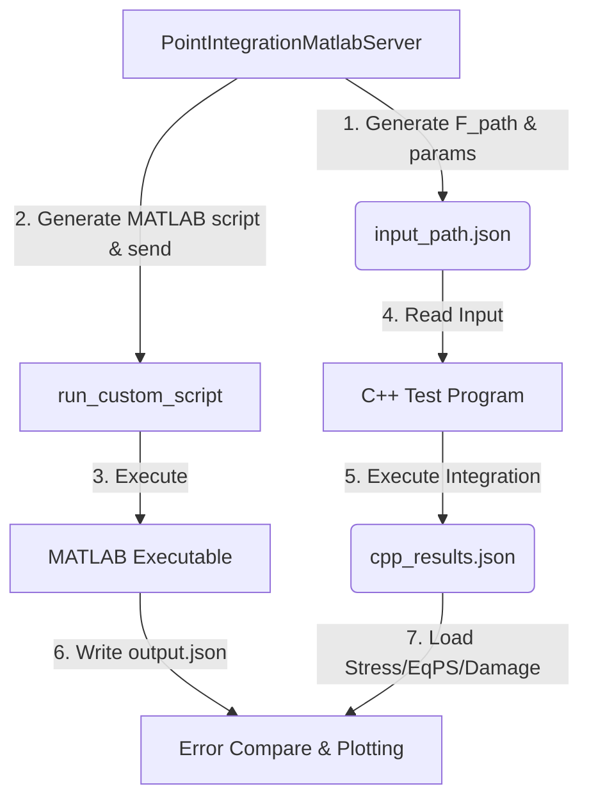

# 本构单点积分验证标准手册

## 目标

通过解耦的 MATLAB MCP 服务通用接口与 C++ 测试桩，双端传入相同的变形梯度路径进行独立积分求解，比对力学响应以验证本构算法的正确性。

## MCP 工具

- **`PointIntegrationMatlabServer.run_constitutive_validation`**：一键执行 C++ 本构与 MATLAB 参考解析解的单点联合对标校验（推荐）。
- **`PointIntegrationMatlabServer.run_custom_script`**：运行自定义的任意 MATLAB 脚本，并自动读回指定的输出 JSON 结果。
  - **解耦设计**：任何复杂的材料本构算法均应由 Python 校验脚本侧维护其 MATLAB 算法模板字符串。运行期直接通过该通用接口发送至 MATLAB 运行。底层服务中不再硬编码具体材料的力学公式。

## 推荐校验流程 (JSON-Driven Dual-End Pipeline)

1. **构造测试载荷**：设计变形梯度历史序列 `F_path`（$N \times 9$，行优先排列）。对于涉及 Lemaitre 损伤的材料，确保最大拉伸应变足够大以越过屈服面及损伤阈值，使损伤演化到其理论上限 $0.999$（或 $1.0$），观测应力退化全过程。
2. **执行联合对标工具**：直接调用 `PointIntegrationMatlabServer.run_constitutive_validation`。
3. **自动编译并运行 C++ 测试桩**：C++ 单点程序 `test_constitutive.exe` 增量编译并运行，输出包含每步 PK1 应力、等效塑性应变和损伤的 `cpp_results.json`。
4. **自动运行 MATLAB 校验脚本**：动态生成 MATLAB 积分脚本并调用本地 MATLAB 运行，输出包含参考求解结果的 `output.json`。
5. **精度对比**：读取 C++ 与 MATLAB 的 stress、eqp、damage，计算绝对误差：
   - **对标阈值**：应力对标绝对误差限制为 $1.0 \times 10^{-5}$ Pa，状态变量（EqPS，Damage）保持严格的机器双精度 $1.0 \times 10^{-10}$ 阈值。
6. **曲线绘制与成果固化**：绘制 PK1 应力-应变、损伤-应变曲线并保存为 `Comparison_Plot.png`，将最大对标误差返回。

## GRPD 物理与数学约定

### 1. 变形梯度与应变转换

- **大变形模式 (`LargeDeformation = true`)**：
  - Green-Lagrange 应变张量：
    $$\boldsymbol{E} = \frac{1}{2}(\boldsymbol{F}^T \boldsymbol{F} - \boldsymbol{I})$$
  - 第一类 Piola-Kirchhoff (PK1) 应力 $\boldsymbol{P}$ 由 Cauchy 应力 $\boldsymbol{\sigma}$ 转换而来：
    $$\boldsymbol{P} = \boldsymbol{F} \boldsymbol{\sigma}$$
  - 双端输出与积分计算统一采用 9 分量的全张量形式 $\boldsymbol{P}$。
- **小变形模式 (`LargeDeformation = false`)**：
  - 小应变张量：
    $$\boldsymbol{\epsilon} = \frac{1}{2}(\boldsymbol{F} + \boldsymbol{F}^T) - \boldsymbol{I}$$
  - 双端输出与积分计算统一采用 9 分量的全张量形式（即 Cauchy 应力 $\boldsymbol{\sigma}$ 的 9 分量行优先排列）。

### 2. 张量表示与积分约定

- 所有的材料本构积分计算与对标比对**严禁使用任何形式的工程分量或 Voigt 表示**。
- 应变、应力与变形梯度等物理量在计算与传输中必须完全采用 9 分量的 $3 \times 3$ 全张量形式，并在 JSON 文件和内存中以行优先（Row-Major）的顺序平铺保存：
  `[xx, xy, xz, yx, yy, yz, zx, zy, zz]`