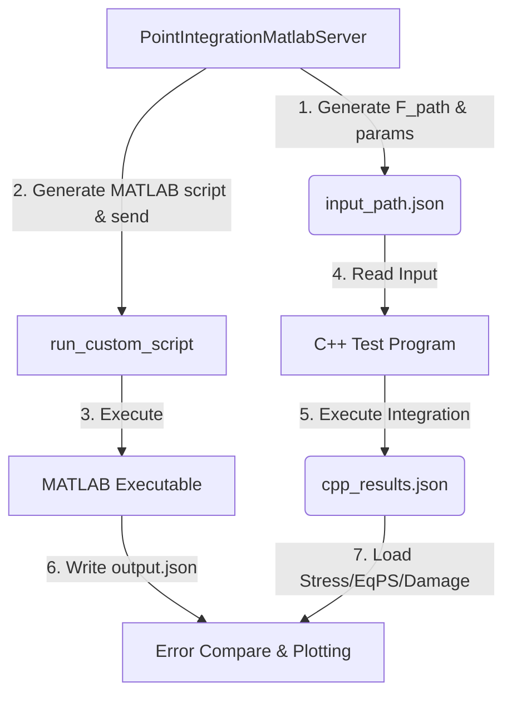

# 本构单点积分验证标准手册

## 目标

通过解耦的 MATLAB MCP 服务通用接口�?C++ 测试桩，双端传入相同的变形梯度路径进行独立积分求解，比对力学响应以验证本构算法的正确性�?
## MCP 工具

- **`PointIntegrationMatlabServer.run_constitutive_validation`**：一键执�?C++ 本构�?MATLAB 参考解析解的单点联合对标校验（推荐）�?- **`PointIntegrationMatlabServer.run_custom_script`**：运行自定义的任�?MATLAB 脚本，并自动读回指定的输�?JSON 结果�?  - **解耦设�?*：任何复杂的材料本构算法均应�?Python 校验脚本侧维护其 MATLAB 算法模板字符串。运行期直接通过该通用接口发送至 MATLAB 运行。底层服务中不再硬编码具体材料的力学公式�?
## 推荐校验流程 (JSON-Driven Dual-End Pipeline)

1. **构造测试载�?*：设计变形梯度历史序�?`F_path`�?N \times 9$，行优先排列）。对于涉�?Lemaitre 损伤的材料，确保最大拉伸应变足够大以越过屈服面及损伤阈值，使损伤演化到其理论上�?$0.999$（或 $1.0$），观测应力退化全过程�?2. **执行联合对标工具**：直接调�?`PointIntegrationMatlabServer.run_constitutive_validation`�?3. **自动编译并运�?C++ 测试�?*：C++ 单点程序 `test_constitutive.exe` 增量编译并运行，输出包含每步 PK1 应力、等效塑性应变和损伤�?`cpp_results.json`�?4. **自动运行 MATLAB 校验�?*：动态生�?MATLAB 积分脚本并调用本�?MATLAB 运行，输出包含参考求解结果的 `output.json`�?5. **精度对比**：读�?C++ �?MATLAB �?stress、eqp、damage，计算绝对误差：
   - **对标阈�?*：应力对标绝对误差限制为 $1.0 \times 10^{-5}$ Pa，状态变量（EqPS，Damage）保持严格的机器双精�?$1.0 \times 10^{-10}$ 阈值�?6. **曲线绘制与成果固�?*：绘�?PK1 应力-应变、损�?应变曲线并保存为 `Comparison_Plot.png`，将最大对标误差返回�?

## GRPD 物理与数学约�?
### 1. 变形梯度与应变转�?- **大变形模�?(`LargeDeformation = true`)**�?  - Green-Lagrange 应变张量�?    $$\boldsymbol{E} = \frac{1}{2}(\boldsymbol{F}^T \boldsymbol{F} - \boldsymbol{I})$$
  - 第一�?Piola-Kirchhoff (PK1) 应力 $\boldsymbol{P}$ �?Cauchy 应力 $\boldsymbol{\sigma}$ 转换而来�?    $$\boldsymbol{P} = \boldsymbol{F} \boldsymbol{\sigma}$$
  - 双端输出对标 PK1 应力（Voigt 形式为非对称 `[P_xx, P_yy, P_zz, P_xy, P_yz, P_zx]`）�?- **小变形模�?(`LargeDeformation = false`)**�?  - 小应变张量：
    $$\boldsymbol{\epsilon} = \frac{1}{2}(\boldsymbol{F} + \boldsymbol{F}^T) - \boldsymbol{I}$$
  - 应力直接对标 Cauchy 应力 $\boldsymbol{\sigma}$�?
### 2. 张量 Voigt 顺序
- **应力/应变 Voigt 顺序**：`[xx, yy, zz, xy, yz, zx]`�?- **剪切分量**：必须采�?tensor strain $\epsilon_{ij}$，不能采用工程剪切应�?$\gamma_{ij}$。因此剪切分量不乘以 2�?