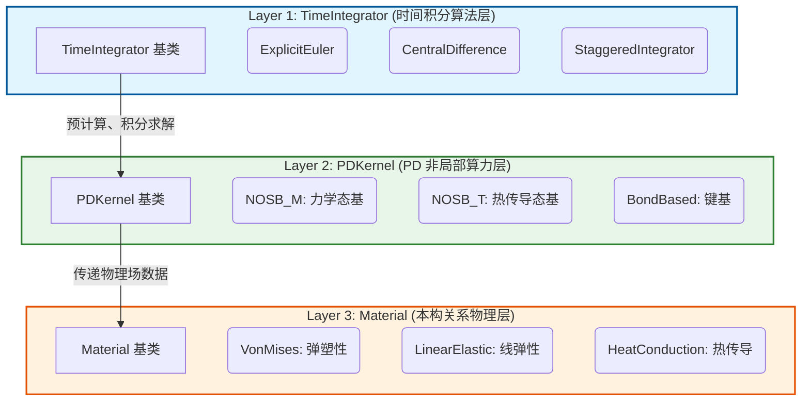

# GRPD 开发者指南 (Developer Guide)

本指南旨在帮助开发者快速理解 GRPD（General-Purpose Peridynamics）项目的系统架构、核心模块设计模式及扩展开发流程。

## 1. 核心架构：三层解耦体系

GRPD 的求解器架构采用了强制解耦的三层设计，确保各层级只需关注自身的抽象接口，从而实现极高的扩展性和开闭原则：



### 层级职责划分

* **Layer 1: TimeIntegrator (时间积分)**
  * **负责**：推进时间步（`dt`），执行 $v += a \cdot dt$ 和 $u += v \cdot dt$。管理边界条件的施加（Dirichlet/Neumann）。
  * **不知道**：它是力学问题还是热学问题？算力用的是键基还是态基？
  * **接口**：只调用 `PDKernel::computeForceState(ctx)`。
* **Layer 2: PDKernel (PD积分核心)**
  * **负责**：遍历邻居列表（CSR 结构），计算形状张量，计算变形梯度 $F$。
  * **不知道**：这是 Explicit 还​​是 CentralDifference？材料是弹性还是塑性？
  * **接口**：将算好的 $F$ 传递给 `Material::evaluate()`，取回 $PK1$ 应力并累加为粒子力态。
* **Layer 3: Material (材料本构)**
  * **负责**：纯粹的局部连续介质力学计算（如用 $F$ 算 $\sigma$）。
  * **不知道**：什么是粒子？什么是邻域？什么是时间步？
  * **接口**：实现 `evaluate()` 方法。

---

## 2. 通用设计模式

项目中大量使用了以下组合设计模式来保证模块的插拔性（以 `Material` 模块为例，`Field`, `BC`, `PDKernel`, `TimeIntegrator` 等均遵循）：

1. **Registry (注册表单例)**: 提供宏 `REGISTER_MATERIAL("LinearElastic", LinearElastic)`，实现编译期静态注册。
2. **Factory (工厂)**: 通过字符串反射（从 YAML 读取 `"LinearElastic"`）来动态使用 `std::unique_ptr` 创建对应的具体子类实例。
3. **Manager (管理器)**: 纯容器（如 `MaterialManager`），**只负责持有和使用**对象，不负责创建对象生命周期，实现了配置解析层和执行层的解耦。

---

## 3. 核心对象 `PDContext`

`PDContext` 是 GRPD 的**核心数据总线**。它没有任何计算逻辑，只负责携带整个仿真所需的全部数据。
各模块（特别是 Kernel 和 Integrator）之间不直接对话，而是通过操作 `PDContext` 中的容器来共享状态。

```cpp
class PDContext {
private:
    ParticleManager particleManager_; // 粒子基本属性（坐标、体积）
    MaterialManager materialManager_; // 材料族
    FieldManager fieldManager_;       // 所有物理场大全
    BCManager bcManager_;             // 边界条件集合
    unique_ptr<NeighborList> neighborList_; // 非局部邻接拓扑
    int dimension_;                   // 仿真维度
};
```

---

## 4. 扩展开发指南（How-To）

这里以添加不同类型的功能为例说明标准的开发流程。

### 场景 1：新增一种材料本构（最常见）

* **目标**：添加一个名为 `NeoHookean` 的超弹性材料。
* **步骤**：
  1. 在 `PDCommon/Material/include/` 和 `src/` 新建 `NeoHookean.h` 和 `.cpp`。
  2. 继承自力学基类（例如 `MechanicalMaterial` 或重构后的基类）。
  3. 重写 `evaluate()` 方法，在这里写入公式：从 `DeformationGradient` 场读数据，算完写到 `PK1Stress` 场。
  4. 在 `.cpp` 末尾添加一行注册宏：`REGISTER_MATERIAL("NeoHookean", NeoHookean);`
  5. 在 `CMakeLists.txt` 中添加源码。
* **结果**：无需修改任何原本的核心代码，用户在 YAML 中填入 `Type: NeoHookean` 即可运行。

### 场景 2：新增一种积分算法

* **目标**：添加 `RungeKutta4`。
* **步骤**：
  1. 在 `Src/Integration/` 下继承 `TimeIntegrator`。
  2. 实现 `run(PDContext& ctx, ...)` 循环。
  3. 在循环内部，对于需要求解算力的地方，调用 `evaluateForces(ctx, kernels, rateFieldNames)`，这会自动搞定率场清零、Neumann 源项和 Kernel 受力计算。
  4. 处理好时间步和约束 `applyConstraints()`。
  5. 注册：`REGISTER_INTEGRATOR("RungeKutta4", RungeKutta4);`

### 场景 3：新增一种影响函数（核函数类型）

* **步骤**：
  1. 修改 `PDKernel::InfluenceKernelType` 枚举，增加如 `CustomShape`。
  2. 在 `PDKernel::GetInfluenceWeight` 的 `switch` 分支中添加你的形函数数学表达式。

---

## 5. 编码规范提醒

1. **C++17标准**：尽量使用现代特性，如 `auto`, 智能指针。
2. **指针性能**：在最核心的循环里（如 `computeForceState`），从 `FieldManager` 获取裸指针（`dataPtr()`），然后用数组下标遍历，结合 `#pragma omp parallel for`，避免在循环体内调用复杂虚函数。
3. **零拷贝原则**：`PDContext` 及各管理器对象在传递时必须传引用 `&`，严禁按值传递导致的巨量内存拷贝。
4. **H/CPP 严格分离**：复杂的逻辑必须写在 `.cpp` 文件里，坚决禁止在 `.h` 头文件里写大量实现代码（模板类除外），以降低编译耦合度。

---

## 6. 开发路线图 (v5.0 Roadmap)

> 最后更新：2026-04-17

### 当前版本状态 (v4.1)

| 模块 | 已实现 | 已知问题 |
|---|---|---|
| **本构** | LinearElastic, J2Plasticity, JCPlasticity | 小应变加法分解，无客观应力率，大旋转下产生虚假应力 |
| **损伤** | BondStretchFracture, DamageValueFracture + JC 损伤 | `(1-D)` 仅退化偏应力，保留静水压 |
| **接触** | 动量摩擦, Kinematic/Penalty接触, Pinball 乘子 | 点对点(NTN)在深层穿模会法线反转爆炸 |
| **积分器** | ExplicitEuler, CentralDifference, ADR | 功能完整 |
| **热学** | NOSB_T + HeatConductionMat | 基本可用 |

### 开发优先级

#### ⭐⭐⭐ Phase 1：Jaumann 率动力学塑性积分（最高优先级）

**问题**：当前 J2/JC 塑性使用小应变假设的加法分解 $\epsilon = \epsilon^e + \epsilon^p$，没有客观应力率。刚体旋转即产生虚假应力，穿甲/冲击等大变形问题的结果**本质上不正确**。

**目标**：在 `J2PlasticityMat` 中实现 Jaumann 客观应力率选项

$$\overset{\nabla}{\boldsymbol{\sigma}} = \dot{\boldsymbol{\sigma}} - \boldsymbol{W}\boldsymbol{\sigma} + \boldsymbol{\sigma}\boldsymbol{W}$$

其中 $\boldsymbol{W} = \frac{1}{2}(\boldsymbol{L} - \boldsymbol{L}^T)$ 是旋率张量，$\boldsymbol{L} = \dot{\boldsymbol{F}}\boldsymbol{F}^{-1}$ 是速度梯度。

**涉及文件**：
- `PDCommon/Material/src/J2PlasticityMat.cpp` — 增加 Jaumann 率积分分支
- `PDCommon/Kernel/src/NOSB_M.cpp` — 传递速度梯度 L 到材料层

---

#### ⭐⭐⭐ Phase 2：乘式分解准静态塑性本构

**问题**：准静态大变形问题（金属成形、蠕变）需要有限应变塑性框架。

**目标**：新建 `FiniteStrainPlasticityMat`，实现乘式分解

$$\boldsymbol{F} = \boldsymbol{F}^e \boldsymbol{F}^p$$

弹性预测在 $\boldsymbol{F}^e$ 上做，塑性修正通过指数映射更新 $\boldsymbol{F}^p$。

**涉及文件**：
- `PDCommon/Material/include/FiniteStrainPlasticityMat.h` — [NEW]
- `PDCommon/Material/src/FiniteStrainPlasticityMat.cpp` — [NEW]

---

#### ⭐⭐⭐ Phase 3：接触架构解耦与防爆模升级 (Strategy Contact Refactoring)

**问题**：传统的 Node-to-Node(NTN) 接触在深层穿刺时会发生球心跨越，导致斥力法线反向，变成加速刺透的“幽灵射透”(Ghosting)。同时，目前每个接触对互相拥有一套孤立的空间哈希网格，在面对海量全模型自接触（多块碎片互相碰撞）时会导致 $O(K \cdot N)$ 的哈希阵列多重冗余和内存浪费。

**目标 1（策略解耦）**：将传统接触算法彻底打碎为：
- **`IContactDetector` 几何探测器**: 专门负责从空间提取间距和宏观不翻转的表面法线（如 `NTNDetector` 和未来的 `NTSGradientDetector`）。
- **`IContactForceLaw` 物理本构力**: 纯粹算力学公式（如 `PenaltyForceLaw`）。

**目标 2（极致性能：General Contact 全域自接触引擎）**：
为了抹平多接触对齐上阵带来的 OMP 并发调度与搜寻开销，开发统一层面的 **全域自接触大网格 (General Contact Spatial Hash)**。
仅在每步耗费一次 $O(N)$ 构建全场物质点唯一大网格，所有独立的力学片段管线全部通过共享这唯一的一张地形图来匹配自己的邻居，将空间建网开销强制从 $O(K \cdot N)$ 极速降维到真正的 $O(N)$！

**涉及文件**：
- `PDCommon/Contact/include/IContactDetector.h` — [NEW] 
- `PDCommon/Contact/include/IContactForceLaw.h` — [NEW]
- `PDCommon/Contact/src/GeneralContactGrid.cpp` — [NEW]

---

#### ⭐ Phase 4：Lemaitre 连续损伤力学本构

**目标**：实现基于热力学的 Lemaitre 损伤模型，适用于低周疲劳和蠕变场景

$$\dot{D} = \left(\frac{Y}{S}\right)^s \dot{p}$$

**涉及文件**：
- `PDCommon/Material/include/LemaitreDamageMat.h` — [NEW]
- `PDCommon/Material/src/LemaitreDamageMat.cpp` — [NEW]

---

#### ⭐ Phase 5：热阻接触算法

**目标**：在接触对之间实现热阻传热，用于热力耦合问题

**涉及文件**：
- `PDCommon/Contact/include/ThermalContact.h` — [NEW]
- `PDCommon/Contact/src/ThermalContact.cpp` — [NEW]

