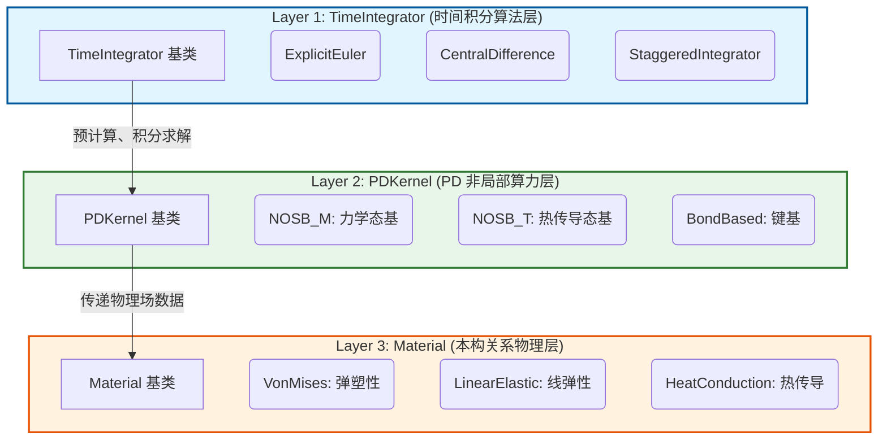
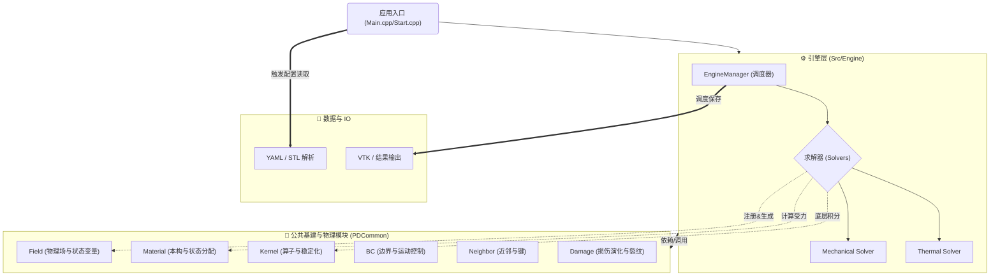
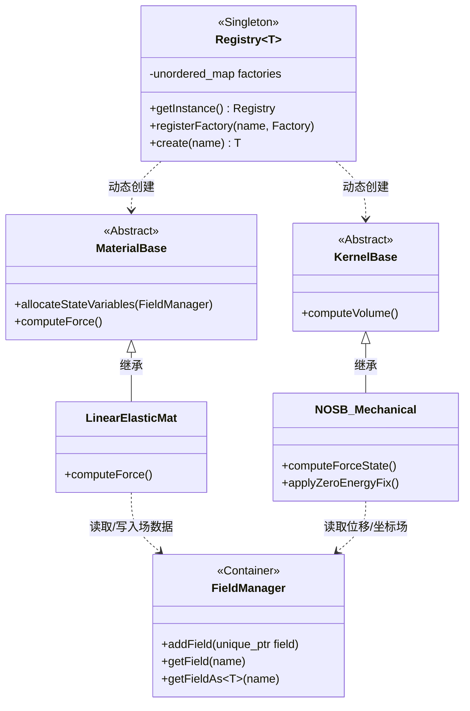
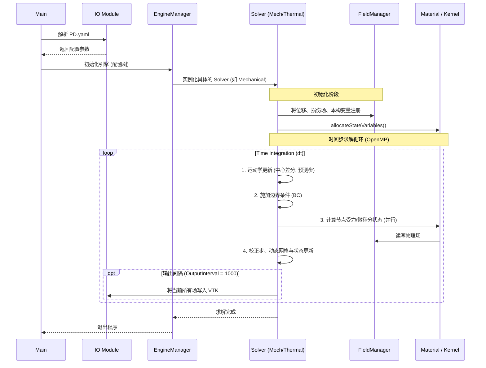

# GRPD Project Context for AI Analysis

## 1. Project Overview & Physical Meaning
> [👉 强烈建议：请在这里用一两句话描述 GRPD 近场动力学项目的核心诉求与背景]

## 2. Architecture & Goals
> [👉 强烈建议：请在这里填入你本次希望大模型帮你重点优化的方向（如内存、多线程并发、某个特定模块）]

## 3. Directory Tree
```text
GRPD/
├── .cache
│   └── clangd
│       └── index
│           ├── BC.cpp.C15222902BF4415B.idx
│           ├── BC.h.4949D65D72BB1EAD.idx
│           ├── BCManager.cpp.7EB541509512E9C6.idx
│           ├── BCManager.h.5D622CC46BB7AA34.idx
│           ├── BCRegistry.cpp.F4DD12F6F6AE5705.idx
│           ├── BCRegistry.h.DBD0232DFB3494BA.idx
│           ├── DataExtractor.h.5481981FE7FD802C.idx
│           ├── Field.cpp.29B1D3A887CE6193.idx
│           ├── Field.h.19F1332FAEDB9180.idx
│           ├── FieldManager.cpp.2256BF585A76C50F.idx
│           ├── FieldManager.h.04F55B42A71DF82E.idx
│           ├── FieldRegistry.cpp.EC5FA72F4A051B76.idx
│           ├── FieldRegistry.h.842A9FD1E1681CD8.idx
│           ├── GRPD.h.0701C9D06951C799.idx
│           ├── GrpdReader.cpp.3E91DC24F6BD7B35.idx
│           ├── GrpdReader.h.E8943571CEA1130C.idx
│           ├── Initial.cpp.5CCD0CBA93EB3EDE.idx
│           ├── Logger.cpp.4DB245E821471C9E.idx
│           ├── Logger.h.E5CCE6421145996D.idx
│           ├── Material.cpp.EAE9A1B6DA75AD4E.idx
│           ├── Material.h.B8B34AF3A071B79B.idx
│           ├── MaterialManager.cpp.9B3CB302EF29F7AD.idx
│           ├── MaterialManager.h.30E0001105E55585.idx
│           ├── MaterialRegistry.cpp.BA6D574FA87CC72B.idx
│           ├── MaterialRegistry.h.BC4241915E855178.idx
│           ├── MechanicalFields.cpp.AF4492355AB13E40.idx
│           ├── MechanicalFields.h.F50B3D6411C74536.idx
│           ├── NeighborList.cpp.AFDD6DCEC5BDF5D1.idx
│           ├── NeighborList.h.7F1ABF4BADEA6584.idx
│           ├── PDSimulater.cpp.26B57E98C84476A7.idx
│           ├── PDSimulater.h.35B5FE000BA19158.idx
│           ├── Particle.cpp.47237895D511D6C2.idx
│           ├── Particle.h.507440168DF8C39E.idx
│           ├── ParticleManager.cpp.BDF8A6DC1EA9E7FE.idx
│           ├── ParticleManager.h.470D883C1793384E.idx
│           ├── PhysicsFieldRegistry.cpp.D0E5A4826A33C500.idx
│           ├── PhysicsFieldRegistry.h.DF1AAABC8BF9B028.idx
│           ├── PhysicsFields.cpp.5F26BD10A3630712.idx
│           ├── PhysicsFields.h.16456FD9611FA793.idx
│           ├── SE_Condition.cpp.F9C823FDC5C42215.idx
│           ├── SE_Field.cpp.2EA77EAD33B92972.idx
│           ├── SE_Material.cpp.F4AFF31B27C78310.idx
│           ├── SE_Model.cpp.894B474088B4432A.idx
│           ├── SE_Output.cpp.ADC45B10A072719A.idx
│           ├── SE_Solve.cpp.A5A51EA652EF6C24.idx
│           ├── SolverEngine.cpp.8AF0960665CFB187.idx
│           ├── SolverEngine.h.5C40FC38BC30CDF5.idx
│           ├── Start.cpp.9EF1F6A9F4A00B06.idx
│           ├── ThermalBC.cpp.218D0C3E1B15A38F.idx
│           ├── ThermalBC.h.E7AC95F93BFA37F8.idx
│           ├── ThermalFields.cpp.298172DBB3864D60.idx
│           ├── ThermalFields.h.00123A9D2F5E173A.idx
│           ├── ThermalMat.cpp.94DC6CA754736DD9.idx
│           ├── ThermalMat.h.BC661C76F8D5A924.idx
│           ├── TypedField.h.86EE2C9994ADE89E.idx
│           ├── VtkWriter.cpp.CE37B049150CF0E0.idx
│           ├── VtkWriter.h.B63D95EAA63E2EF5.idx
│           ├── Writer.cpp.3D92652F6D49BAA3.idx
│           ├── Writer.h.A9185C7192343265.idx
│           ├── anchor.h.8C74650138030978.idx
│           ├── anchordict.h.0E3713743E6BCD06.idx
│           ├── binary.cpp.47A754B080AAEFCC.idx
│           ├── binary.h.F5EA837E17723AB5.idx
│           ├── collectionstack.h.5DD2F8068063CFBD.idx
│           ├── convert.cpp.E1E313DF287B44F9.idx
│           ├── convert.h.9988C9EB3E69437A.idx
│           ├── depthguard.cpp.C67485EC68534B9D.idx
│           ├── depthguard.h.AA4E1082BB19CB3D.idx
│           ├── directives.cpp.4EC2191F74ABECBF.idx
│           ├── directives.h.266199330405E549.idx
│           ├── dll.h.4102F642E9CEE539.idx
│           ├── dragonbox.h.40111F6957B14E73.idx
│           ├── emit.cpp.F1C7E13B8E5F27DA.idx
│           ├── emit.h.104D03DF7871C730.idx
│           ├── emitfromevents.cpp.92735B208F92AE80.idx
│           ├── emitfromevents.h.D90CE3D7E99C7EDF.idx
│           ├── emitter.cpp.F59372EA068364EB.idx
│           ├── emitter.h.91E9B18B56F0AD14.idx
│           ├── emitterdef.h.81F792CA0CA44629.idx
│           ├── emittermanip.h.D4FE1B47AD79A915.idx
│           ├── emitterstate.cpp.9E387B873276C270.idx
│           ├── emitterstate.h.A9D8BD86B4AC15A6.idx
│           ├── emitterstyle.h.FE56CF81CE03F9C8.idx
│           ├── emitterutils.cpp.08BD0E56F697C545.idx
│           ├── emitterutils.h.D1522D3608153514.idx
│           ├── eventhandler.h.B3C3AC1B56F407CC.idx
│           ├── exceptions.cpp.86E34A0F3D6C08AD.idx
│           ├── exceptions.h.92BDF920AB47370E.idx
│           ├── exp.cpp.29EA091D950C4FBC.idx
│           ├── exp.h.66966A0496DBB2CB.idx
│           ├── fptostring.cpp.E902E0DB8C2B3F90.idx
│           ├── fptostring.h.FE2F38BA3E63131E.idx
│           ├── graphbuilder.cpp.3AE0203BCA6264BC.idx
│           ├── graphbuilder.h.870395D82B8CB2A3.idx
│           ├── graphbuilderadapter.cpp.486959D84382F629.idx
│           ├── graphbuilderadapter.h.72BF3D6FC71C19A8.idx
│           ├── impl.h.7BCD90237F4369BD.idx
│           ├── impl.h.B0E58D0F63CCAE10.idx
│           ├── indentation.h.2B68DD857680182C.idx
│           ├── iterator.h.5E8800101A7B0737.idx
│           ├── iterator.h.AC84280010D3C30C.idx
│           ├── iterator_fwd.h.D3B62FB9B90E60D5.idx
│           ├── main.cpp.48C3E638B6713EAA.idx
│           ├── mark.h.B7739B374B63F500.idx
│           ├── memory.cpp.EA6960053C0E8E1E.idx
│           ├── memory.h.24350911FE859BF6.idx
│           ├── node.cpp.D47790585EDD07B4.idx
│           ├── node.h.69762B042F34817C.idx
│           ├── node.h.DCAB6D99C2404D90.idx
│           ├── node_data.cpp.1141A30302FB604D.idx
│           ├── node_data.h.CBD73C736DE4DC95.idx
│           ├── node_iterator.h.1A1E5A6661AFCBDA.idx
│           ├── node_ref.h.3084F9B5100C68C4.idx
│           ├── nodebuilder.cpp.2994CFEE00F0DB7F.idx
│           ├── nodebuilder.h.09001FB86F515150.idx
│           ├── nodeevents.cpp.1C5C2CCFBE6E2387.idx
│           ├── nodeevents.h.F3CB1770BBB273BB.idx
│           ├── noexcept.h.A601C6AA58F1EC5A.idx
│           ├── null.cpp.DC3830052FCE5DD5.idx
│           ├── null.h.38A65E6C45BA9545.idx
│           ├── ostream_wrapper.cpp.BA78C9C3CDBE0B27.idx
│           ├── ostream_wrapper.h.CBC1E6FEF610BC37.idx
│           ├── parse.cpp.14FA7F264BFE366B.idx
│           ├── parse.h.C44CEA567E5675BC.idx
│           ├── parser.cpp.392FD8707C387E48.idx
│           ├── parser.h.5ECA2270AD7F0F24.idx
│           ├── ptr.h.5BC5635BE51D74DD.idx
│           ├── ptr_vector.h.D74829828EB5400A.idx
│           ├── regex_yaml.cpp.D54E9F08A2A9AAC9.idx
│           ├── regex_yaml.h.5DFF75C13FB6B8D4.idx
│           ├── regeximpl.h.8B3A83AB808E516D.idx
│           ├── scanner.cpp.9A1F88A0B9EF4D9B.idx
│           ├── scanner.h.697B445E74E69CA5.idx
│           ├── scanscalar.cpp.8C05FB0E36506136.idx
│           ├── scanscalar.h.5564CA4659076AF7.idx
│           ├── scantag.cpp.3B6793DD44A57CB5.idx
│           ├── scantag.h.388E4726C67EAC04.idx
│           ├── scantoken.cpp.59CB239340B671AB.idx
│           ├── setting.h.60DE5903DCAB12EB.idx
│           ├── simplekey.cpp.010838B2F6011D51.idx
│           ├── singledocparser.cpp.55337B1D6EBA3AE4.idx
│           ├── singledocparser.h.C5FD255AB0004639.idx
│           ├── stlemitter.h.01A20F9562A00AD6.idx
│           ├── stream.cpp.2944BD8731D5B6C6.idx
│           ├── stream.h.D75DB7F636C6918D.idx
│           ├── streamcharsource.h.714E1EEB72E725E7.idx
│           ├── stringsource.h.8EFA1E52B15C6F4C.idx
│           ├── tag.cpp.84B882E28276612A.idx
│           ├── tag.h.8B524A69DE57E49A.idx
│           ├── token.h.627B43D833194A2A.idx
│           ├── traits.h.5EF8DFEBD9F5A7D9.idx
│           ├── type.h.9275AE2527F32519.idx
│           └── yaml.h.4BE5F73C7B17FACF.idx
├── .clangd
├── .gitignore
├── .gitmodules
├── .qtcreator
│   └── CMakeLists.txt.user
├── AGENTS.md
├── CMakeLists.txt
├── DEVELOPER_GUIDE.md
├── Doxyfile
├── Doxyfile.bak
├── Examples
│   ├── .gitignore
│   ├── Box_Disp
│   │   ├── 2D100.100
│   │   │   ├── Disp_Result_output.vtk
│   │   │   ├── Disp_Result_step00000_t0.0000.vtk
│   │   │   ├── Disp_Result_step00100_t0.0000.vtk
│   │   │   ├── Disp_Result_step00200_t0.0000.vtk
│   │   │   ├── Disp_Result_step00300_t0.0000.vtk
│   │   │   ├── Disp_Result_step00400_t0.0000.vtk
│   │   │   ├── Disp_Result_step00500_t0.0000.vtk
│   │   │   ├── Disp_Result_step00600_t0.0000.vtk
│   │   │   ├── Disp_Result_step00700_t0.0000.vtk
│   │   │   ├── Disp_Result_step00800_t0.0000.vtk
│   │   │   ├── Disp_Result_step00900_t0.0000.vtk
│   │   │   ├── Disp_Result_step01000_t0.0000.vtk
│   │   │   ├── Disp_Result_step01100_t0.0000.vtk
│   │   │   ├── Disp_Result_step01200_t0.0000.vtk
│   │   │   ├── Disp_Result_step01300_t0.0000.vtk
│   │   │   ├── Disp_Result_step01400_t0.0000.vtk
│   │   │   ├── Disp_Result_step01500_t0.0000.vtk
│   │   │   ├── Disp_Result_step01600_t0.0000.vtk
│   │   │   ├── Disp_Result_step01700_t0.0000.vtk
│   │   │   ├── Disp_Result_step01800_t0.0000.vtk
│   │   │   ├── Disp_Result_step01900_t0.0000.vtk
│   │   │   ├── Disp_Result_step02000_t0.0000.vtk
│   │   │   ├── Disp_Result_step02100_t0.0000.vtk
│   │   │   ├── Disp_Result_step02200_t0.0000.vtk
│   │   │   ├── Disp_Result_step02300_t0.0000.vtk
│   │   │   ├── Disp_Result_step02400_t0.0000.vtk
│   │   │   ├── Disp_Result_step02500_t0.0000.vtk
│   │   │   ├── Disp_Result_step02600_t0.0000.vtk
│   │   │   ├── Disp_Result_step02700_t0.0000.vtk
│   │   │   ├── Disp_Result_step02800_t0.0000.vtk
│   │   │   ├── Disp_Result_step02900_t0.0000.vtk
│   │   │   ├── Disp_Result_step03000_t0.0000.vtk
│   │   │   ├── Disp_Result_step03100_t0.0000.vtk
│   │   │   ├── Disp_Result_step03200_t0.0000.vtk
│   │   │   ├── Disp_Result_step03300_t0.0000.vtk
│   │   │   ├── Disp_Result_step03400_t0.0000.vtk
│   │   │   ├── Disp_Result_step03500_t0.0000.vtk
│   │   │   ├── Disp_Result_step03600_t0.0000.vtk
│   │   │   ├── Disp_Result_step03700_t0.0000.vtk
│   │   │   ├── Disp_Result_step03800_t0.0000.vtk
│   │   │   ├── Disp_Result_step03900_t0.0000.vtk
│   │   │   ├── Disp_Result_step04000_t0.0000.vtk
│   │   │   ├── Disp_Result_step04100_t0.0000.vtk
│   │   │   ├── Disp_Result_step04200_t0.0000.vtk
│   │   │   ├── Disp_Result_step04300_t0.0000.vtk
│   │   │   ├── Disp_Result_step04400_t0.0000.vtk
│   │   │   ├── Disp_Result_step04500_t0.0000.vtk
│   │   │   ├── Disp_Result_step04600_t0.0000.vtk
│   │   │   ├── Disp_Result_step04700_t0.0000.vtk
│   │   │   ├── Disp_Result_step04800_t0.0000.vtk
│   │   │   ├── Disp_Result_step04900_t0.0000.vtk
│   │   │   ├── Disp_Result_step05000_t0.0000.vtk
│   │   │   ├── Disp_Result_step05100_t0.0000.vtk
│   │   │   ├── Disp_Result_step05200_t0.0000.vtk
│   │   │   ├── Disp_Result_step05300_t0.0000.vtk
│   │   │   ├── Disp_Result_step05400_t0.0000.vtk
│   │   │   ├── Disp_Result_step05500_t0.0000.vtk
│   │   │   ├── Disp_Result_step05600_t0.0000.vtk
│   │   │   ├── Disp_Result_step05700_t0.0000.vtk
│   │   │   ├── Disp_Result_step05800_t0.0000.vtk
│   │   │   ├── Disp_Result_step05900_t0.0000.vtk
│   │   │   ├── Disp_Result_step06000_t0.0000.vtk
│   │   │   ├── Disp_Result_step06100_t0.0000.vtk
│   │   │   ├── Disp_Result_step06200_t0.0000.vtk
│   │   │   ├── Disp_Result_step06300_t0.0000.vtk
│   │   │   ├── Disp_Result_step06400_t0.0000.vtk
│   │   │   ├── Disp_Result_step06500_t0.0000.vtk
│   │   │   ├── Disp_Result_step06600_t0.0000.vtk
│   │   │   ├── Disp_Result_step06700_t0.0000.vtk
│   │   │   ├── Disp_Result_step06800_t0.0000.vtk
│   │   │   ├── Disp_Result_step06900_t0.0000.vtk
│   │   │   ├── Disp_Result_step07000_t0.0000.vtk
│   │   │   ├── Disp_Result_step07100_t0.0000.vtk
│   │   │   ├── Disp_Result_step07200_t0.0000.vtk
│   │   │   ├── Disp_Result_step07300_t0.0000.vtk
│   │   │   ├── Disp_Result_step07400_t0.0000.vtk
│   │   │   ├── Disp_Result_step07500_t0.0000.vtk
│   │   │   ├── Disp_Result_step07600_t0.0000.vtk
│   │   │   ├── Disp_Result_step07700_t0.0000.vtk
│   │   │   ├── Disp_Result_step07800_t0.0000.vtk
│   │   │   ├── Disp_Result_step07900_t0.0000.vtk
│   │   │   ├── Disp_Result_step08000_t0.0000.vtk
│   │   │   ├── Disp_Result_step08100_t0.0000.vtk
│   │   │   ├── Disp_Result_step08200_t0.0000.vtk
│   │   │   ├── Disp_Result_step08300_t0.0000.vtk
│   │   │   ├── Disp_Result_step08400_t0.0000.vtk
│   │   │   ├── Disp_Result_step08500_t0.0000.vtk
│   │   │   ├── Disp_Result_step08600_t0.0000.vtk
│   │   │   ├── Disp_Result_step08700_t0.0000.vtk
│   │   │   ├── Disp_Result_step08800_t0.0000.vtk
│   │   │   ├── Disp_Result_step08900_t0.0000.vtk
│   │   │   ├── Disp_Result_step09000_t0.0000.vtk
│   │   │   ├── Disp_Result_step09100_t0.0000.vtk
│   │   │   ├── Disp_Result_step09200_t0.0000.vtk
│   │   │   ├── Disp_Result_step09300_t0.0000.vtk
│   │   │   ├── Disp_Result_step09400_t0.0000.vtk
│   │   │   ├── Disp_Result_step09500_t0.0000.vtk
│   │   │   ├── Disp_Result_step09600_t0.0000.vtk
│   │   │   ├── Disp_Result_step09700_t0.0000.vtk
│   │   │   ├── Disp_Result_step09800_t0.0000.vtk
│   │   │   ├── Disp_Result_step09900_t0.0000.vtk
│   │   │   └── Disp_Result_step10000_t0.0000.vtk
│   │   ├── 2D200.200
│   │   │   ├── Disp_Result_output.vtk
│   │   │   ├── Disp_Result_step00000_t0.0000.vtk
│   │   │   ├── Disp_Result_step00100_t0.0000.vtk
│   │   │   ├── Disp_Result_step00200_t0.0000.vtk
│   │   │   ├── Disp_Result_step00300_t0.0000.vtk
│   │   │   ├── Disp_Result_step00400_t0.0000.vtk
│   │   │   ├── Disp_Result_step00500_t0.0000.vtk
│   │   │   ├── Disp_Result_step00600_t0.0000.vtk
│   │   │   ├── Disp_Result_step00700_t0.0000.vtk
│   │   │   ├── Disp_Result_step00800_t0.0000.vtk
│   │   │   ├── Disp_Result_step00900_t0.0000.vtk
│   │   │   ├── Disp_Result_step01000_t0.0000.vtk
│   │   │   ├── Disp_Result_step01100_t0.0000.vtk
│   │   │   ├── Disp_Result_step01200_t0.0000.vtk
│   │   │   ├── Disp_Result_step01300_t0.0000.vtk
│   │   │   ├── Disp_Result_step01400_t0.0000.vtk
│   │   │   ├── Disp_Result_step01500_t0.0000.vtk
│   │   │   ├── Disp_Result_step01600_t0.0000.vtk
│   │   │   ├── Disp_Result_step01700_t0.0000.vtk
│   │   │   ├── Disp_Result_step01800_t0.0000.vtk
│   │   │   ├── Disp_Result_step01900_t0.0000.vtk
│   │   │   ├── Disp_Result_step02000_t0.0000.vtk
│   │   │   ├── Disp_Result_step02100_t0.0000.vtk
│   │   │   ├── Disp_Result_step02200_t0.0000.vtk
│   │   │   ├── Disp_Result_step02300_t0.0000.vtk
│   │   │   ├── Disp_Result_step02400_t0.0000.vtk
│   │   │   ├── Disp_Result_step02500_t0.0000.vtk
│   │   │   ├── Disp_Result_step02600_t0.0000.vtk
│   │   │   ├── Disp_Result_step02700_t0.0000.vtk
│   │   │   ├── Disp_Result_step02800_t0.0000.vtk
│   │   │   ├── Disp_Result_step02900_t0.0000.vtk
│   │   │   ├── Disp_Result_step03000_t0.0000.vtk
│   │   │   ├── Disp_Result_step03100_t0.0000.vtk
│   │   │   ├── Disp_Result_step03200_t0.0000.vtk
│   │   │   ├── Disp_Result_step03300_t0.0000.vtk
│   │   │   ├── Disp_Result_step03400_t0.0000.vtk
│   │   │   ├── Disp_Result_step03500_t0.0000.vtk
│   │   │   ├── Disp_Result_step03600_t0.0000.vtk
│   │   │   ├── Disp_Result_step03700_t0.0000.vtk
│   │   │   ├── Disp_Result_step03800_t0.0000.vtk
│   │   │   ├── Disp_Result_step03900_t0.0000.vtk
│   │   │   ├── Disp_Result_step04000_t0.0000.vtk
│   │   │   ├── Disp_Result_step04100_t0.0000.vtk
│   │   │   ├── Disp_Result_step04200_t0.0000.vtk
│   │   │   ├── Disp_Result_step04300_t0.0000.vtk
│   │   │   ├── Disp_Result_step04400_t0.0000.vtk
│   │   │   ├── Disp_Result_step04500_t0.0000.vtk
│   │   │   ├── Disp_Result_step04600_t0.0000.vtk
│   │   │   ├── Disp_Result_step04700_t0.0000.vtk
│   │   │   ├── Disp_Result_step04800_t0.0000.vtk
│   │   │   ├── Disp_Result_step04900_t0.0000.vtk
│   │   │   ├── Disp_Result_step05000_t0.0000.vtk
│   │   │   ├── Disp_Result_step05100_t0.0000.vtk
│   │   │   ├── Disp_Result_step05200_t0.0000.vtk
│   │   │   ├── Disp_Result_step05300_t0.0000.vtk
│   │   │   ├── Disp_Result_step05400_t0.0000.vtk
│   │   │   ├── Disp_Result_step05500_t0.0000.vtk
│   │   │   ├── Disp_Result_step05600_t0.0000.vtk
│   │   │   ├── Disp_Result_step05700_t0.0000.vtk
│   │   │   ├── Disp_Result_step05800_t0.0000.vtk
│   │   │   ├── Disp_Result_step05900_t0.0000.vtk
│   │   │   ├── Disp_Result_step06000_t0.0000.vtk
│   │   │   ├── Disp_Result_step06100_t0.0000.vtk
│   │   │   ├── Disp_Result_step06200_t0.0000.vtk
│   │   │   ├── Disp_Result_step06300_t0.0000.vtk
│   │   │   ├── Disp_Result_step06400_t0.0000.vtk
│   │   │   ├── Disp_Result_step06500_t0.0000.vtk
│   │   │   ├── Disp_Result_step06600_t0.0000.vtk
│   │   │   ├── Disp_Result_step06700_t0.0000.vtk
│   │   │   ├── Disp_Result_step06800_t0.0000.vtk
│   │   │   ├── Disp_Result_step06900_t0.0000.vtk
│   │   │   ├── Disp_Result_step07000_t0.0000.vtk
│   │   │   ├── Disp_Result_step07100_t0.0000.vtk
│   │   │   ├── Disp_Result_step07200_t0.0000.vtk
│   │   │   ├── Disp_Result_step07300_t0.0000.vtk
│   │   │   ├── Disp_Result_step07400_t0.0000.vtk
│   │   │   ├── Disp_Result_step07500_t0.0000.vtk
│   │   │   ├── Disp_Result_step07600_t0.0000.vtk
│   │   │   ├── Disp_Result_step07700_t0.0000.vtk
│   │   │   ├── Disp_Result_step07800_t0.0000.vtk
│   │   │   ├── Disp_Result_step07900_t0.0000.vtk
│   │   │   ├── Disp_Result_step08000_t0.0000.vtk
│   │   │   ├── Disp_Result_step08100_t0.0000.vtk
│   │   │   ├── Disp_Result_step08200_t0.0000.vtk
│   │   │   ├── Disp_Result_step08300_t0.0000.vtk
│   │   │   ├── Disp_Result_step08400_t0.0000.vtk
│   │   │   ├── Disp_Result_step08500_t0.0000.vtk
│   │   │   ├── Disp_Result_step08600_t0.0000.vtk
│   │   │   ├── Disp_Result_step08700_t0.0000.vtk
│   │   │   ├── Disp_Result_step08800_t0.0000.vtk
│   │   │   ├── Disp_Result_step08900_t0.0000.vtk
│   │   │   ├── Disp_Result_step09000_t0.0000.vtk
│   │   │   ├── Disp_Result_step09100_t0.0000.vtk
│   │   │   ├── Disp_Result_step09200_t0.0000.vtk
│   │   │   ├── Disp_Result_step09300_t0.0000.vtk
│   │   │   ├── Disp_Result_step09400_t0.0000.vtk
│   │   │   ├── Disp_Result_step09500_t0.0000.vtk
│   │   │   ├── Disp_Result_step09600_t0.0000.vtk
│   │   │   ├── Disp_Result_step09700_t0.0000.vtk
│   │   │   ├── Disp_Result_step09800_t0.0000.vtk
│   │   │   ├── Disp_Result_step09900_t0.0000.vtk
│   │   │   └── Disp_Result_step10000_t0.0000.vtk
│   │   ├── 3D
│   │   │   ├── Disp_Result_step00000_t0.0000.vtk
│   │   │   └── Disp_Result_step10000_t0.0000.vtk
│   │   ├── Box_Disp.grpd
│   │   ├── GRPD.log
│   │   ├── Low_Res_Box.stl
│   │   ├── PD.yaml
│   │   └── Result_20260329_171001
│   │       ├── Disp_Result_output.vtk
│   │       ├── Disp_Result_step00000_t0.0000.vtk
│   │       ├── Disp_Result_step01000_t0.0000.vtk
│   │       ├── Disp_Result_step02000_t0.0000.vtk
│   │       ├── Disp_Result_step03000_t0.0000.vtk
│   │       ├── Disp_Result_step04000_t0.0000.vtk
│   │       ├── Disp_Result_step05000_t0.0000.vtk
│   │       ├── Disp_Result_step06000_t0.0000.vtk
│   │       ├── Disp_Result_step07000_t0.0000.vtk
│   │       ├── Disp_Result_step08000_t0.0000.vtk
│   │       ├── Disp_Result_step09000_t0.0000.vtk
│   │       ├── Disp_Result_step100000_t0.0001.vtk
│   │       ├── Disp_Result_step10000_t0.0000.vtk
│   │       ├── Disp_Result_step11000_t0.0000.vtk
│   │       ├── Disp_Result_step12000_t0.0000.vtk
│   │       ├── Disp_Result_step13000_t0.0000.vtk
│   │       ├── Disp_Result_step14000_t0.0000.vtk
│   │       ├── Disp_Result_step15000_t0.0000.vtk
│   │       ├── Disp_Result_step16000_t0.0000.vtk
│   │       ├── Disp_Result_step17000_t0.0000.vtk
│   │       ├── Disp_Result_step18000_t0.0000.vtk
│   │       ├── Disp_Result_step19000_t0.0000.vtk
│   │       ├── Disp_Result_step20000_t0.0000.vtk
│   │       ├── Disp_Result_step21000_t0.0000.vtk
│   │       ├── Disp_Result_step22000_t0.0000.vtk
│   │       ├── Disp_Result_step23000_t0.0000.vtk
│   │       ├── Disp_Result_step24000_t0.0000.vtk
│   │       ├── Disp_Result_step25000_t0.0000.vtk
│   │       ├── Disp_Result_step26000_t0.0000.vtk
│   │       ├── Disp_Result_step27000_t0.0000.vtk
│   │       ├── Disp_Result_step28000_t0.0000.vtk
│   │       ├── Disp_Result_step29000_t0.0000.vtk
│   │       ├── Disp_Result_step30000_t0.0000.vtk
│   │       ├── Disp_Result_step31000_t0.0000.vtk
│   │       ├── Disp_Result_step32000_t0.0000.vtk
│   │       ├── Disp_Result_step33000_t0.0000.vtk
│   │       ├── Disp_Result_step34000_t0.0000.vtk
│   │       ├── Disp_Result_step35000_t0.0000.vtk
│   │       ├── Disp_Result_step36000_t0.0000.vtk
│   │       ├── Disp_Result_step37000_t0.0000.vtk
│   │       ├── Disp_Result_step38000_t0.0000.vtk
│   │       ├── Disp_Result_step39000_t0.0000.vtk
│   │       ├── Disp_Result_step40000_t0.0000.vtk
│   │       ├── Disp_Result_step41000_t0.0000.vtk
│   │       ├── Disp_Result_step42000_t0.0000.vtk
│   │       ├── Disp_Result_step43000_t0.0000.vtk
│   │       ├── Disp_Result_step44000_t0.0000.vtk
│   │       ├── Disp_Result_step45000_t0.0000.vtk
│   │       ├── Disp_Result_step46000_t0.0000.vtk
│   │       ├── Disp_Result_step47000_t0.0000.vtk
│   │       ├── Disp_Result_step48000_t0.0000.vtk
│   │       ├── Disp_Result_step49000_t0.0000.vtk
│   │       ├── Disp_Result_step50000_t0.0001.vtk
│   │       ├── Disp_Result_step51000_t0.0001.vtk
│   │       ├── Disp_Result_step52000_t0.0001.vtk
│   │       ├── Disp_Result_step53000_t0.0001.vtk
│   │       ├── Disp_Result_step54000_t0.0001.vtk
│   │       ├── Disp_Result_step55000_t0.0001.vtk
│   │       ├── Disp_Result_step56000_t0.0001.vtk
│   │       ├── Disp_Result_step57000_t0.0001.vtk
│   │       ├── Disp_Result_step58000_t0.0001.vtk
│   │       ├── Disp_Result_step59000_t0.0001.vtk
│   │       ├── Disp_Result_step60000_t0.0001.vtk
│   │       ├── Disp_Result_step61000_t0.0001.vtk
│   │       ├── Disp_Result_step62000_t0.0001.vtk
│   │       ├── Disp_Result_step63000_t0.0001.vtk
│   │       ├── Disp_Result_step64000_t0.0001.vtk
│   │       ├── Disp_Result_step65000_t0.0001.vtk
│   │       ├── Disp_Result_step66000_t0.0001.vtk
│   │       ├── Disp_Result_step67000_t0.0001.vtk
│   │       ├── Disp_Result_step68000_t0.0001.vtk
│   │       ├── Disp_Result_step69000_t0.0001.vtk
│   │       ├── Disp_Result_step70000_t0.0001.vtk
│   │       ├── Disp_Result_step71000_t0.0001.vtk
│   │       ├── Disp_Result_step72000_t0.0001.vtk
│   │       ├── Disp_Result_step73000_t0.0001.vtk
│   │       ├── Disp_Result_step74000_t0.0001.vtk
│   │       ├── Disp_Result_step75000_t0.0001.vtk
│   │       ├── Disp_Result_step76000_t0.0001.vtk
│   │       ├── Disp_Result_step77000_t0.0001.vtk
│   │       ├── Disp_Result_step78000_t0.0001.vtk
│   │       ├── Disp_Result_step79000_t0.0001.vtk
│   │       ├── Disp_Result_step80000_t0.0001.vtk
│   │       ├── Disp_Result_step81000_t0.0001.vtk
│   │       ├── Disp_Result_step82000_t0.0001.vtk
│   │       ├── Disp_Result_step83000_t0.0001.vtk
│   │       ├── Disp_Result_step84000_t0.0001.vtk
│   │       ├── Disp_Result_step85000_t0.0001.vtk
│   │       ├── Disp_Result_step86000_t0.0001.vtk
│   │       ├── Disp_Result_step87000_t0.0001.vtk
│   │       ├── Disp_Result_step88000_t0.0001.vtk
│   │       ├── Disp_Result_step89000_t0.0001.vtk
│   │       ├── Disp_Result_step90000_t0.0001.vtk
│   │       ├── Disp_Result_step91000_t0.0001.vtk
│   │       ├── Disp_Result_step92000_t0.0001.vtk
│   │       ├── Disp_Result_step93000_t0.0001.vtk
│   │       ├── Disp_Result_step94000_t0.0001.vtk
│   │       ├── Disp_Result_step95000_t0.0001.vtk
│   │       ├── Disp_Result_step96000_t0.0001.vtk
│   │       ├── Disp_Result_step97000_t0.0001.vtk
│   │       ├── Disp_Result_step98000_t0.0001.vtk
│   │       └── Disp_Result_step99000_t0.0001.vtk
│   ├── Bunny
│   │   ├── FLATFOOT_StanfordBunny_jmil_HIGH_RES_Smoothed.stl
│   │   ├── GRPD.log
│   │   └── PD.yaml
│   ├── Engine
│   │   ├── GRPD.log
│   │   ├── PD.yaml
│   │   ├── model.stl_15.stl
│   │   └── model.stl_16.stl
│   ├── Sphere
│   │   ├── GRPD.log
│   │   ├── Low_Res_Sphere.stl
│   │   ├── PD.yaml
│   │   ├── Result_20260325_002501
│   │   │   ├── Result_step00000_t0.0000.vtk
│   │   │   ├── Result_step00100_t1.0000.vtk
│   │   │   ├── Result_step00200_t2.0000.vtk
│   │   │   ├── Result_step00300_t3.0000.vtk
│   │   │   └── Result_step00400_t4.0000.vtk
│   │   ├── Result_20260326_220448
│   │   │   ├── Result_step00000_t0.0000.vtk
│   │   │   ├── Result_step00100_t1.0000.vtk
│   │   │   └── Result_step00200_t2.0000.vtk
│   │   ├── Result_20260326_231515
│   │   │   ├── Result_step00000_t0.0000.vtk
│   │   │   └── Result_step00100_t1.0000.vtk
│   │   └── Sphere.grpd
│   └── bone
│       ├── GRPD.log
│       ├── PD.yaml
│       ├── Result_20260331_004546
│       │   ├── Bone_Fracture_Result_output.vtk
│       │   ├── Bone_Fracture_Result_step00000_t0.0000.vtk
│       │   ├── Bone_Fracture_Result_step00100_t0.0000.vtk
│       │   ├── Bone_Fracture_Result_step00200_t0.0000.vtk
│       │   ├── Bone_Fracture_Result_step00300_t0.0000.vtk
│       │   ├── Bone_Fracture_Result_step00400_t0.0000.vtk
│       │   ├── Bone_Fracture_Result_step00500_t0.0000.vtk
│       │   ├── Bone_Fracture_Result_step00600_t0.0001.vtk
│       │   ├── Bone_Fracture_Result_step00700_t0.0001.vtk
│       │   ├── Bone_Fracture_Result_step00800_t0.0001.vtk
│       │   ├── Bone_Fracture_Result_step00900_t0.0001.vtk
│       │   ├── Bone_Fracture_Result_step01000_t0.0001.vtk
│       │   ├── Bone_Fracture_Result_step01100_t0.0001.vtk
│       │   ├── Bone_Fracture_Result_step01200_t0.0001.vtk
│       │   ├── Bone_Fracture_Result_step01300_t0.0001.vtk
│       │   ├── Bone_Fracture_Result_step01400_t0.0001.vtk
│       │   ├── Bone_Fracture_Result_step01500_t0.0001.vtk
│       │   ├── Bone_Fracture_Result_step01600_t0.0002.vtk
│       │   ├── Bone_Fracture_Result_step01700_t0.0002.vtk
│       │   ├── Bone_Fracture_Result_step01800_t0.0002.vtk
│       │   ├── Bone_Fracture_Result_step01900_t0.0002.vtk
│       │   ├── Bone_Fracture_Result_step02000_t0.0002.vtk
│       │   ├── Bone_Fracture_Result_step02100_t0.0002.vtk
│       │   ├── Bone_Fracture_Result_step02200_t0.0002.vtk
│       │   ├── Bone_Fracture_Result_step02300_t0.0002.vtk
│       │   ├── Bone_Fracture_Result_step02400_t0.0002.vtk
│       │   ├── Bone_Fracture_Result_step02500_t0.0003.vtk
│       │   ├── Bone_Fracture_Result_step02600_t0.0003.vtk
│       │   ├── Bone_Fracture_Result_step02700_t0.0003.vtk
│       │   ├── Bone_Fracture_Result_step02800_t0.0003.vtk
│       │   ├── Bone_Fracture_Result_step02900_t0.0003.vtk
│       │   ├── Bone_Fracture_Result_step03000_t0.0003.vtk
│       │   ├── Bone_Fracture_Result_step03100_t0.0003.vtk
│       │   ├── Bone_Fracture_Result_step03200_t0.0003.vtk
│       │   ├── Bone_Fracture_Result_step03300_t0.0003.vtk
│       │   ├── Bone_Fracture_Result_step03400_t0.0003.vtk
│       │   ├── Bone_Fracture_Result_step03500_t0.0003.vtk
│       │   ├── Bone_Fracture_Result_step03600_t0.0004.vtk
│       │   ├── Bone_Fracture_Result_step03700_t0.0004.vtk
│       │   ├── Bone_Fracture_Result_step03800_t0.0004.vtk
│       │   ├── Bone_Fracture_Result_step03900_t0.0004.vtk
│       │   ├── Bone_Fracture_Result_step04000_t0.0004.vtk
│       │   ├── Bone_Fracture_Result_step04100_t0.0004.vtk
│       │   ├── Bone_Fracture_Result_step04200_t0.0004.vtk
│       │   ├── Bone_Fracture_Result_step04300_t0.0004.vtk
│       │   ├── Bone_Fracture_Result_step04400_t0.0004.vtk
│       │   ├── Bone_Fracture_Result_step04500_t0.0004.vtk
│       │   ├── Bone_Fracture_Result_step04600_t0.0005.vtk
│       │   ├── Bone_Fracture_Result_step04700_t0.0005.vtk
│       │   ├── Bone_Fracture_Result_step04800_t0.0005.vtk
│       │   ├── Bone_Fracture_Result_step04900_t0.0005.vtk
│       │   ├── Bone_Fracture_Result_step05000_t0.0005.vtk
│       │   ├── Bone_Fracture_Result_step05100_t0.0005.vtk
│       │   ├── Bone_Fracture_Result_step05200_t0.0005.vtk
│       │   ├── Bone_Fracture_Result_step05300_t0.0005.vtk
│       │   ├── Bone_Fracture_Result_step05400_t0.0005.vtk
│       │   ├── Bone_Fracture_Result_step05500_t0.0005.vtk
│       │   ├── Bone_Fracture_Result_step05600_t0.0006.vtk
│       │   ├── Bone_Fracture_Result_step05700_t0.0006.vtk
│       │   ├── Bone_Fracture_Result_step05800_t0.0006.vtk
│       │   ├── Bone_Fracture_Result_step05900_t0.0006.vtk
│       │   ├── Bone_Fracture_Result_step06000_t0.0006.vtk
│       │   ├── Bone_Fracture_Result_step06100_t0.0006.vtk
│       │   ├── Bone_Fracture_Result_step06200_t0.0006.vtk
│       │   ├── Bone_Fracture_Result_step06300_t0.0006.vtk
│       │   ├── Bone_Fracture_Result_step06400_t0.0006.vtk
│       │   ├── Bone_Fracture_Result_step06500_t0.0006.vtk
│       │   ├── Bone_Fracture_Result_step06600_t0.0007.vtk
│       │   ├── Bone_Fracture_Result_step06700_t0.0007.vtk
│       │   ├── Bone_Fracture_Result_step06800_t0.0007.vtk
│       │   ├── Bone_Fracture_Result_step06900_t0.0007.vtk
│       │   ├── Bone_Fracture_Result_step07000_t0.0007.vtk
│       │   ├── Bone_Fracture_Result_step07100_t0.0007.vtk
│       │   ├── Bone_Fracture_Result_step07200_t0.0007.vtk
│       │   ├── Bone_Fracture_Result_step07300_t0.0007.vtk
│       │   ├── Bone_Fracture_Result_step07400_t0.0007.vtk
│       │   ├── Bone_Fracture_Result_step07500_t0.0008.vtk
│       │   ├── Bone_Fracture_Result_step07600_t0.0008.vtk
│       │   ├── Bone_Fracture_Result_step07700_t0.0008.vtk
│       │   ├── Bone_Fracture_Result_step07800_t0.0008.vtk
│       │   ├── Bone_Fracture_Result_step07900_t0.0008.vtk
│       │   ├── Bone_Fracture_Result_step08000_t0.0008.vtk
│       │   ├── Bone_Fracture_Result_step08100_t0.0008.vtk
│       │   ├── Bone_Fracture_Result_step08200_t0.0008.vtk
│       │   ├── Bone_Fracture_Result_step08300_t0.0008.vtk
│       │   ├── Bone_Fracture_Result_step08400_t0.0008.vtk
│       │   ├── Bone_Fracture_Result_step08500_t0.0008.vtk
│       │   ├── Bone_Fracture_Result_step08600_t0.0009.vtk
│       │   ├── Bone_Fracture_Result_step08700_t0.0009.vtk
│       │   ├── Bone_Fracture_Result_step08800_t0.0009.vtk
│       │   ├── Bone_Fracture_Result_step08900_t0.0009.vtk
│       │   ├── Bone_Fracture_Result_step09000_t0.0009.vtk
│       │   ├── Bone_Fracture_Result_step09100_t0.0009.vtk
│       │   ├── Bone_Fracture_Result_step09200_t0.0009.vtk
│       │   ├── Bone_Fracture_Result_step09300_t0.0009.vtk
│       │   ├── Bone_Fracture_Result_step09400_t0.0009.vtk
│       │   ├── Bone_Fracture_Result_step09500_t0.0009.vtk
│       │   ├── Bone_Fracture_Result_step09600_t0.0010.vtk
│       │   ├── Bone_Fracture_Result_step09700_t0.0010.vtk
│       │   ├── Bone_Fracture_Result_step09800_t0.0010.vtk
│       │   ├── Bone_Fracture_Result_step09900_t0.0010.vtk
│       │   ├── Bone_Fracture_Result_step10000_t0.0010.vtk
│       │   ├── Bone_Fracture_Result_step10100_t0.0010.vtk
│       │   ├── Bone_Fracture_Result_step10200_t0.0010.vtk
│       │   ├── Bone_Fracture_Result_step10300_t0.0010.vtk
│       │   ├── Bone_Fracture_Result_step10400_t0.0010.vtk
│       │   ├── Bone_Fracture_Result_step10500_t0.0010.vtk
│       │   ├── Bone_Fracture_Result_step10600_t0.0011.vtk
│       │   ├── Bone_Fracture_Result_step10700_t0.0011.vtk
│       │   ├── Bone_Fracture_Result_step10800_t0.0011.vtk
│       │   ├── Bone_Fracture_Result_step10900_t0.0011.vtk
│       │   ├── Bone_Fracture_Result_step11000_t0.0011.vtk
│       │   ├── Bone_Fracture_Result_step11100_t0.0011.vtk
│       │   ├── Bone_Fracture_Result_step11200_t0.0011.vtk
│       │   ├── Bone_Fracture_Result_step11300_t0.0011.vtk
│       │   ├── Bone_Fracture_Result_step11400_t0.0011.vtk
│       │   ├── Bone_Fracture_Result_step11500_t0.0011.vtk
│       │   ├── Bone_Fracture_Result_step11600_t0.0012.vtk
│       │   ├── Bone_Fracture_Result_step11700_t0.0012.vtk
│       │   ├── Bone_Fracture_Result_step11800_t0.0012.vtk
│       │   ├── Bone_Fracture_Result_step11900_t0.0012.vtk
│       │   ├── Bone_Fracture_Result_step12000_t0.0012.vtk
│       │   ├── Bone_Fracture_Result_step12100_t0.0012.vtk
│       │   ├── Bone_Fracture_Result_step12200_t0.0012.vtk
│       │   ├── Bone_Fracture_Result_step12300_t0.0012.vtk
│       │   ├── Bone_Fracture_Result_step12400_t0.0012.vtk
│       │   ├── Bone_Fracture_Result_step12500_t0.0013.vtk
│       │   ├── Bone_Fracture_Result_step12600_t0.0013.vtk
│       │   ├── Bone_Fracture_Result_step12700_t0.0013.vtk
│       │   ├── Bone_Fracture_Result_step12800_t0.0013.vtk
│       │   ├── Bone_Fracture_Result_step12900_t0.0013.vtk
│       │   ├── Bone_Fracture_Result_step13000_t0.0013.vtk
│       │   ├── Bone_Fracture_Result_step13100_t0.0013.vtk
│       │   ├── Bone_Fracture_Result_step13200_t0.0013.vtk
│       │   ├── Bone_Fracture_Result_step13300_t0.0013.vtk
│       │   ├── Bone_Fracture_Result_step13400_t0.0013.vtk
│       │   ├── Bone_Fracture_Result_step13500_t0.0013.vtk
│       │   ├── Bone_Fracture_Result_step13600_t0.0014.vtk
│       │   ├── Bone_Fracture_Result_step13700_t0.0014.vtk
│       │   ├── Bone_Fracture_Result_step13800_t0.0014.vtk
│       │   ├── Bone_Fracture_Result_step13900_t0.0014.vtk
│       │   ├── Bone_Fracture_Result_step14000_t0.0014.vtk
│       │   ├── Bone_Fracture_Result_step14100_t0.0014.vtk
│       │   ├── Bone_Fracture_Result_step14200_t0.0014.vtk
│       │   ├── Bone_Fracture_Result_step14300_t0.0014.vtk
│       │   ├── Bone_Fracture_Result_step14400_t0.0014.vtk
│       │   ├── Bone_Fracture_Result_step14500_t0.0014.vtk
│       │   ├── Bone_Fracture_Result_step14600_t0.0015.vtk
│       │   ├── Bone_Fracture_Result_step14700_t0.0015.vtk
│       │   ├── Bone_Fracture_Result_step14800_t0.0015.vtk
│       │   ├── Bone_Fracture_Result_step14900_t0.0015.vtk
│       │   ├── Bone_Fracture_Result_step15000_t0.0015.vtk
│       │   ├── Bone_Fracture_Result_step15100_t0.0015.vtk
│       │   ├── Bone_Fracture_Result_step15200_t0.0015.vtk
│       │   ├── Bone_Fracture_Result_step15300_t0.0015.vtk
│       │   ├── Bone_Fracture_Result_step15400_t0.0015.vtk
│       │   ├── Bone_Fracture_Result_step15500_t0.0015.vtk
│       │   ├── Bone_Fracture_Result_step15600_t0.0016.vtk
│       │   ├── Bone_Fracture_Result_step15700_t0.0016.vtk
│       │   ├── Bone_Fracture_Result_step15800_t0.0016.vtk
│       │   ├── Bone_Fracture_Result_step15900_t0.0016.vtk
│       │   ├── Bone_Fracture_Result_step16000_t0.0016.vtk
│       │   ├── Bone_Fracture_Result_step16100_t0.0016.vtk
│       │   ├── Bone_Fracture_Result_step16200_t0.0016.vtk
│       │   ├── Bone_Fracture_Result_step16300_t0.0016.vtk
│       │   ├── Bone_Fracture_Result_step16400_t0.0016.vtk
│       │   ├── Bone_Fracture_Result_step16500_t0.0016.vtk
│       │   ├── Bone_Fracture_Result_step16600_t0.0017.vtk
│       │   ├── Bone_Fracture_Result_step16700_t0.0017.vtk
│       │   ├── Bone_Fracture_Result_step16800_t0.0017.vtk
│       │   ├── Bone_Fracture_Result_step16900_t0.0017.vtk
│       │   ├── Bone_Fracture_Result_step17000_t0.0017.vtk
│       │   ├── Bone_Fracture_Result_step17100_t0.0017.vtk
│       │   ├── Bone_Fracture_Result_step17200_t0.0017.vtk
│       │   ├── Bone_Fracture_Result_step17300_t0.0017.vtk
│       │   ├── Bone_Fracture_Result_step17400_t0.0017.vtk
│       │   ├── Bone_Fracture_Result_step17500_t0.0017.vtk
│       │   ├── Bone_Fracture_Result_step17600_t0.0018.vtk
│       │   ├── Bone_Fracture_Result_step17700_t0.0018.vtk
│       │   ├── Bone_Fracture_Result_step17800_t0.0018.vtk
│       │   ├── Bone_Fracture_Result_step17900_t0.0018.vtk
│       │   ├── Bone_Fracture_Result_step18000_t0.0018.vtk
│       │   ├── Bone_Fracture_Result_step18100_t0.0018.vtk
│       │   ├── Bone_Fracture_Result_step18200_t0.0018.vtk
│       │   ├── Bone_Fracture_Result_step18300_t0.0018.vtk
│       │   ├── Bone_Fracture_Result_step18400_t0.0018.vtk
│       │   ├── Bone_Fracture_Result_step18500_t0.0018.vtk
│       │   ├── Bone_Fracture_Result_step18600_t0.0019.vtk
│       │   ├── Bone_Fracture_Result_step18700_t0.0019.vtk
│       │   ├── Bone_Fracture_Result_step18800_t0.0019.vtk
│       │   ├── Bone_Fracture_Result_step18900_t0.0019.vtk
│       │   ├── Bone_Fracture_Result_step19000_t0.0019.vtk
│       │   ├── Bone_Fracture_Result_step19100_t0.0019.vtk
│       │   ├── Bone_Fracture_Result_step19200_t0.0019.vtk
│       │   ├── Bone_Fracture_Result_step19300_t0.0019.vtk
│       │   ├── Bone_Fracture_Result_step19400_t0.0019.vtk
│       │   ├── Bone_Fracture_Result_step19500_t0.0019.vtk
│       │   ├── Bone_Fracture_Result_step19600_t0.0020.vtk
│       │   ├── Bone_Fracture_Result_step19700_t0.0020.vtk
│       │   ├── Bone_Fracture_Result_step19800_t0.0020.vtk
│       │   ├── Bone_Fracture_Result_step19900_t0.0020.vtk
│       │   └── Bone_Fracture_Result_step20000_t0.0020.vtk
│       ├── Right_humerus_bone_one-piece.stl
│       ├── bone.grpd
│       ├── bone_fracture.gif
│       └── inspect_stl.py
├── GEMINI.md
├── GRPD_AI_Context.md
├── Generate_py
│   ├── .gitignore
│   ├── PD.yaml
│   ├── generate_model.py
│   └── inspect_stl.py
├── PDCommon
│   ├── BC
│   │   ├── CMakeLists.txt
│   │   ├── include
│   │   │   ├── BC.h
│   │   │   ├── BCManager.h
│   │   │   ├── BCRegistry.h
│   │   │   ├── MechanicalBC.h
│   │   │   └── ThermalBC.h
│   │   └── src
│   │       ├── BC.cpp
│   │       ├── BCManager.cpp
│   │       ├── BCRegistry.cpp
│   │       ├── MechanicalBC.cpp
│   │       └── ThermalBC.cpp
│   ├── CMakeLists.txt
│   ├── Core
│   │   ├── CMakeLists.txt
│   │   ├── include
│   │   │   └── PDContext.h
│   │   └── src
│   │       └── PDContext.cpp
│   ├── Damage
│   │   ├── CMakeLists.txt
│   │   ├── include
│   │   │   ├── CriticalStretch.h
│   │   │   ├── DamageModel.h
│   │   │   ├── DamageRegistry.h
│   │   │   ├── PreCrackModel.h
│   │   │   ├── PreCrackRegistry.h
│   │   │   └── QuadCrack.h
│   │   └── src
│   │       ├── CriticalStretch.cpp
│   │       ├── DamageRegistry.cpp
│   │       └── QuadCrack.cpp
│   ├── Field
│   │   ├── CMakeLists.txt
│   │   ├── include
│   │   │   ├── Field.h
│   │   │   ├── FieldManager.h
│   │   │   ├── FieldRegistry.h
│   │   │   ├── MechanicalFields.h
│   │   │   ├── PhysicsFieldRegistry.h
│   │   │   ├── PhysicsFields.h
│   │   │   ├── ThermalFields.h
│   │   │   └── TypedField.h
│   │   └── src
│   │       ├── Field.cpp
│   │       ├── FieldManager.cpp
│   │       ├── FieldRegistry.cpp
│   │       ├── MechanicalFields.cpp
│   │       ├── PhysicsFieldRegistry.cpp
│   │       ├── PhysicsFields.cpp
│   │       └── ThermalFields.cpp
│   ├── IO
│   │   ├── CMakeLists.txt
│   │   ├── include
│   │   │   ├── GrpdMeshReader.h
│   │   │   ├── IOManager.h
│   │   │   ├── InpMeshReader.h
│   │   │   ├── MeshData.h
│   │   │   ├── MeshReader.h
│   │   │   ├── Outputer.h
│   │   │   ├── ReaderManager.h
│   │   │   ├── ReaderRegistry.h
│   │   │   ├── VtkWriter.h
│   │   │   └── Writer.h
│   │   └── src
│   │       ├── GrpdMeshReader.cpp
│   │       ├── IOManager.cpp
│   │       ├── InpMeshReader.cpp
│   │       ├── MeshData.cpp
│   │       ├── MeshReader.cpp
│   │       ├── Outputer.cpp
│   │       ├── ReaderManager.cpp
│   │       ├── ReaderRegistry.cpp
│   │       ├── VtkWriter.cpp
│   │       └── Writer.cpp
│   ├── Kernel
│   │   ├── CMakeLists.txt
│   │   ├── include
│   │   │   ├── BB_Base.h
│   │   │   ├── KernelRegistry.h
│   │   │   ├── MechanicalStabilizers.h
│   │   │   ├── NOSB_Base.h
│   │   │   ├── NOSB_M.h
│   │   │   ├── NOSB_T.h
│   │   │   ├── PDKernel.h
│   │   │   ├── Stabilizer.h
│   │   │   ├── StabilizerRegistry.h
│   │   │   └── ThermalStabilizers.h
│   │   └── src
│   │       ├── BB_Base.cpp
│   │       ├── KernelRegistry.cpp
│   │       ├── MechanicalStabilizers.cpp
│   │       ├── NOSB_Base.cpp
│   │       ├── NOSB_M.cpp
│   │       ├── NOSB_T.cpp
│   │       ├── StabilizerRegistry.cpp
│   │       └── ThermalStabilizers.cpp
│   ├── Material
│   │   ├── CMakeLists.txt
│   │   ├── include
│   │   │   ├── FourierThermalMat.h
│   │   │   ├── LinearElasticMat.h
│   │   │   ├── Material.h
│   │   │   ├── MaterialManager.h
│   │   │   ├── MaterialRegistry.h
│   │   │   ├── MechanicalMaterial.h
│   │   │   └── ThermalMaterial.h
│   │   └── src
│   │       ├── FourierThermalMat.cpp
│   │       ├── LinearElasticMat.cpp
│   │       ├── Material.cpp
│   │       ├── MaterialManager.cpp
│   │       └── MaterialRegistry.cpp
│   ├── Model
│   │   ├── CMakeLists.txt
│   │   ├── include
│   │   │   ├── Particle.h
│   │   │   └── ParticleManager.h
│   │   └── src
│   │       ├── Particle.cpp
│   │       └── ParticleManager.cpp
│   ├── Neighbor
│   │   ├── CMakeLists.txt
│   │   ├── include
│   │   │   ├── ContactSearch.h
│   │   │   └── NeighborList.h
│   │   └── src
│   │       └── NeighborList.cpp
│   ├── Utils
│   │   ├── CMakeLists.txt
│   │   ├── include
│   │   │   ├── DataExtractor.h
│   │   │   └── Logger.h
│   │   └── src
│   │       └── Logger.cpp
│   └── dummy.cpp
├── README.md
├── Src
│   ├── CMakeLists.txt
│   ├── Engine
│   │   ├── CMakeLists.txt
│   │   ├── Solvers
│   │   │   └── PD
│   │   │       ├── CMakeLists.txt
│   │   │       ├── PDEngine.cpp
│   │   │       ├── PDEngine.h
│   │   │       ├── Post
│   │   │       │   ├── include
│   │   │       │   │   └── PDEnginePost.h
│   │   │       │   └── src
│   │   │       │       └── PDEnginePost.cpp
│   │   │       ├── Pre
│   │   │       │   ├── include
│   │   │       │   │   └── PDEnginePre.h
│   │   │       │   └── src
│   │   │       │       ├── InitConditions.cpp
│   │   │       │       ├── InitDamageModels.cpp
│   │   │       │       ├── InitFields.cpp
│   │   │       │       ├── InitMaterial.cpp
│   │   │       │       ├── InitModel.cpp
│   │   │       │       ├── InitNeighbors.cpp
│   │   │       │       ├── InitPreCracks.cpp
│   │   │       │       └── InitSolverComponents.cpp
│   │   │       └── Run
│   │   │           ├── include
│   │   │           │   └── PDEngineRun.h
│   │   │           └── src
│   │   │               └── PDEngineRun.cpp
│   │   ├── include
│   │   │   ├── Engine.h
│   │   │   ├── EngineManager.h
│   │   │   └── EngineRegistry.h
│   │   └── src
│   │       ├── Engine.cpp
│   │       ├── EngineManager.cpp
│   │       └── EngineRegistry.cpp
│   ├── GRPD.h
│   ├── Integration
│   │   ├── CMakeLists.txt
│   │   ├── include
│   │   │   ├── CentralDifference.h
│   │   │   ├── ExplicitEuler.h
│   │   │   ├── StaggeredIntegrator.h
│   │   │   ├── TimeIntegrator.h
│   │   │   └── TimeIntegratorRegistry.h
│   │   └── src
│   │       ├── CentralDifference.cpp
│   │       ├── ExplicitEuler.cpp
│   │       ├── StaggeredIntegrator.cpp
│   │       ├── TimeIntegrator.cpp
│   │       └── TimeIntegratorRegistry.cpp
│   ├── Start.cpp
│   └── main.cpp
├── bin
│   ├── debug
│   └── release
│       └── GRPD.exe
├── compile_flags.txt
├── docs
│   ├── html
│   │   ├── _b_c_8cpp.html
│   │   ├── _b_c_8cpp__incl.map
│   │   ├── _b_c_8cpp__incl.md5
│   │   ├── _b_c_8cpp__incl.png
│   │   ├── _b_c_8cpp_source.html
│   │   ├── _b_c_8h.html
│   │   ├── _b_c_8h.js
│   │   ├── _b_c_8h__dep__incl.map
│   │   ├── _b_c_8h__dep__incl.md5
│   │   ├── _b_c_8h__dep__incl.png
│   │   ├── _b_c_8h__incl.map
│   │   ├── _b_c_8h__incl.md5
│   │   ├── _b_c_8h__incl.png
│   │   ├── _b_c_8h_source.html
│   │   ├── _b_c_manager_8cpp.html
│   │   ├── _b_c_manager_8cpp__incl.map
│   │   ├── _b_c_manager_8cpp__incl.md5
│   │   ├── _b_c_manager_8cpp__incl.png
│   │   ├── _b_c_manager_8cpp_source.html
│   │   ├── _b_c_manager_8h.html
│   │   ├── _b_c_manager_8h.js
│   │   ├── _b_c_manager_8h__dep__incl.map
│   │   ├── _b_c_manager_8h__dep__incl.md5
│   │   ├── _b_c_manager_8h__dep__incl.png
│   │   ├── _b_c_manager_8h__incl.map
│   │   ├── _b_c_manager_8h__incl.md5
│   │   ├── _b_c_manager_8h__incl.png
│   │   ├── _b_c_manager_8h_source.html
│   │   ├── _b_c_registry_8cpp.html
│   │   ├── _b_c_registry_8cpp__incl.map
│   │   ├── _b_c_registry_8cpp__incl.md5
│   │   ├── _b_c_registry_8cpp__incl.png
│   │   ├── _b_c_registry_8cpp_source.html
│   │   ├── _b_c_registry_8h.html
│   │   ├── _b_c_registry_8h.js
│   │   ├── _b_c_registry_8h__dep__incl.map
│   │   ├── _b_c_registry_8h__dep__incl.md5
│   │   ├── _b_c_registry_8h__dep__incl.png
│   │   ├── _b_c_registry_8h__incl.map
│   │   ├── _b_c_registry_8h__incl.md5
│   │   ├── _b_c_registry_8h__incl.png
│   │   ├── _b_c_registry_8h_source.html
│   │   ├── _data_extractor_8h.html
│   │   ├── _data_extractor_8h.js
│   │   ├── _data_extractor_8h__dep__incl.map
│   │   ├── _data_extractor_8h__dep__incl.md5
│   │   ├── _data_extractor_8h__dep__incl.png
│   │   ├── _data_extractor_8h__incl.map
│   │   ├── _data_extractor_8h__incl.md5
│   │   ├── _data_extractor_8h__incl.png
│   │   ├── _data_extractor_8h_source.html
│   │   ├── _field_8cpp.html
│   │   ├── _field_8cpp__incl.map
│   │   ├── _field_8cpp__incl.md5
│   │   ├── _field_8cpp__incl.png
│   │   ├── _field_8cpp_source.html
│   │   ├── _field_8h.html
│   │   ├── _field_8h.js
│   │   ├── _field_8h__dep__incl.map
│   │   ├── _field_8h__dep__incl.md5
│   │   ├── _field_8h__dep__incl.png
│   │   ├── _field_8h__incl.map
│   │   ├── _field_8h__incl.md5
│   │   ├── _field_8h__incl.png
│   │   ├── _field_8h_source.html
│   │   ├── _field_manager_8cpp.html
│   │   ├── _field_manager_8cpp__incl.map
│   │   ├── _field_manager_8cpp__incl.md5
│   │   ├── _field_manager_8cpp__incl.png
│   │   ├── _field_manager_8cpp_source.html
│   │   ├── _field_manager_8h.html
│   │   ├── _field_manager_8h.js
│   │   ├── _field_manager_8h__dep__incl.map
│   │   ├── _field_manager_8h__dep__incl.md5
│   │   ├── _field_manager_8h__dep__incl.png
│   │   ├── _field_manager_8h__incl.map
│   │   ├── _field_manager_8h__incl.md5
│   │   ├── _field_manager_8h__incl.png
│   │   ├── _field_manager_8h_source.html
│   │   ├── _field_registry_8cpp.html
│   │   ├── _field_registry_8cpp.js
│   │   ├── _field_registry_8cpp__incl.map
│   │   ├── _field_registry_8cpp__incl.md5
│   │   ├── _field_registry_8cpp__incl.png
│   │   ├── _field_registry_8cpp_source.html
│   │   ├── _field_registry_8h.html
│   │   ├── _field_registry_8h.js
│   │   ├── _field_registry_8h__dep__incl.map
│   │   ├── _field_registry_8h__dep__incl.md5
│   │   ├── _field_registry_8h__dep__incl.png
│   │   ├── _field_registry_8h__incl.map
│   │   ├── _field_registry_8h__incl.md5
│   │   ├── _field_registry_8h__incl.png
│   │   ├── _field_registry_8h_source.html
│   │   ├── _g_r_p_d_8h.html
│   │   ├── _g_r_p_d_8h.js
│   │   ├── _g_r_p_d_8h__dep__incl.map
│   │   ├── _g_r_p_d_8h__dep__incl.md5
│   │   ├── _g_r_p_d_8h__dep__incl.png
│   │   ├── _g_r_p_d_8h__incl.map
│   │   ├── _g_r_p_d_8h__incl.md5
│   │   ├── _g_r_p_d_8h__incl.png
│   │   ├── _g_r_p_d_8h_a07aaf1227e4d645f15e0a964f54ef291_icgraph.map
│   │   ├── _g_r_p_d_8h_a07aaf1227e4d645f15e0a964f54ef291_icgraph.md5
│   │   ├── _g_r_p_d_8h_a07aaf1227e4d645f15e0a964f54ef291_icgraph.png
│   │   ├── _g_r_p_d_8h_source.html
│   │   ├── _grpd_reader_8cpp.html
│   │   ├── _grpd_reader_8cpp__incl.map
│   │   ├── _grpd_reader_8cpp__incl.md5
│   │   ├── _grpd_reader_8cpp__incl.png
│   │   ├── _grpd_reader_8cpp_source.html
│   │   ├── _grpd_reader_8h.html
│   │   ├── _grpd_reader_8h.js
│   │   ├── _grpd_reader_8h__dep__incl.map
│   │   ├── _grpd_reader_8h__dep__incl.md5
│   │   ├── _grpd_reader_8h__dep__incl.png
│   │   ├── _grpd_reader_8h__incl.map
│   │   ├── _grpd_reader_8h__incl.md5
│   │   ├── _grpd_reader_8h__incl.png
│   │   ├── _grpd_reader_8h_source.html
│   │   ├── _initial_8cpp.html
│   │   ├── _initial_8cpp_source.html
│   │   ├── _logger_8cpp.html
│   │   ├── _logger_8cpp__incl.map
│   │   ├── _logger_8cpp__incl.md5
│   │   ├── _logger_8cpp__incl.png
│   │   ├── _logger_8cpp_source.html
│   │   ├── _logger_8h.html
│   │   ├── _logger_8h.js
│   │   ├── _logger_8h__dep__incl.map
│   │   ├── _logger_8h__dep__incl.md5
│   │   ├── _logger_8h__dep__incl.png
│   │   ├── _logger_8h__incl.map
│   │   ├── _logger_8h__incl.md5
│   │   ├── _logger_8h__incl.png
│   │   ├── _logger_8h_source.html
│   │   ├── _material_8cpp.html
│   │   ├── _material_8cpp__incl.map
│   │   ├── _material_8cpp__incl.md5
│   │   ├── _material_8cpp__incl.png
│   │   ├── _material_8cpp_source.html
│   │   ├── _material_8h.html
│   │   ├── _material_8h.js
│   │   ├── _material_8h__dep__incl.map
│   │   ├── _material_8h__dep__incl.md5
│   │   ├── _material_8h__dep__incl.png
│   │   ├── _material_8h__incl.map
│   │   ├── _material_8h__incl.md5
│   │   ├── _material_8h__incl.png
│   │   ├── _material_8h_source.html
│   │   ├── _material_manager_8cpp.html
│   │   ├── _material_manager_8cpp__incl.map
│   │   ├── _material_manager_8cpp__incl.md5
│   │   ├── _material_manager_8cpp__incl.png
│   │   ├── _material_manager_8cpp_source.html
│   │   ├── _material_manager_8h.html
│   │   ├── _material_manager_8h.js
│   │   ├── _material_manager_8h__dep__incl.map
│   │   ├── _material_manager_8h__dep__incl.md5
│   │   ├── _material_manager_8h__dep__incl.png
│   │   ├── _material_manager_8h__incl.map
│   │   ├── _material_manager_8h__incl.md5
│   │   ├── _material_manager_8h__incl.png
│   │   ├── _material_manager_8h_source.html
│   │   ├── _material_registry_8cpp.html
│   │   ├── _material_registry_8cpp__incl.map
│   │   ├── _material_registry_8cpp__incl.md5
│   │   ├── _material_registry_8cpp__incl.png
│   │   ├── _material_registry_8cpp_source.html
│   │   ├── _material_registry_8h.html
│   │   ├── _material_registry_8h.js
│   │   ├── _material_registry_8h__dep__incl.map
│   │   ├── _material_registry_8h__dep__incl.md5
│   │   ├── _material_registry_8h__dep__incl.png
│   │   ├── _material_registry_8h__incl.map
│   │   ├── _material_registry_8h__incl.md5
│   │   ├── _material_registry_8h__incl.png
│   │   ├── _material_registry_8h_source.html
│   │   ├── _mechanical_fields_8cpp.html
│   │   ├── _mechanical_fields_8cpp__incl.map
│   │   ├── _mechanical_fields_8cpp__incl.md5
│   │   ├── _mechanical_fields_8cpp__incl.png
│   │   ├── _mechanical_fields_8cpp_source.html
│   │   ├── _mechanical_fields_8h.html
│   │   ├── _mechanical_fields_8h.js
│   │   ├── _mechanical_fields_8h__dep__incl.map
│   │   ├── _mechanical_fields_8h__dep__incl.md5
│   │   ├── _mechanical_fields_8h__dep__incl.png
│   │   ├── _mechanical_fields_8h__incl.map
│   │   ├── _mechanical_fields_8h__incl.md5
│   │   ├── _mechanical_fields_8h__incl.png
│   │   ├── _mechanical_fields_8h_source.html
│   │   ├── _neighbor_list_8cpp.html
│   │   ├── _neighbor_list_8cpp__incl.map
│   │   ├── _neighbor_list_8cpp__incl.md5
│   │   ├── _neighbor_list_8cpp__incl.png
│   │   ├── _neighbor_list_8cpp_source.html
│   │   ├── _neighbor_list_8h.html
│   │   ├── _neighbor_list_8h.js
│   │   ├── _neighbor_list_8h__dep__incl.map
│   │   ├── _neighbor_list_8h__dep__incl.md5
│   │   ├── _neighbor_list_8h__dep__incl.png
│   │   ├── _neighbor_list_8h__incl.map
│   │   ├── _neighbor_list_8h__incl.md5
│   │   ├── _neighbor_list_8h__incl.png
│   │   ├── _neighbor_list_8h_source.html
│   │   ├── _p_d_simulater_8cpp.html
│   │   ├── _p_d_simulater_8cpp__incl.map
│   │   ├── _p_d_simulater_8cpp__incl.md5
│   │   ├── _p_d_simulater_8cpp__incl.png
│   │   ├── _p_d_simulater_8cpp_source.html
│   │   ├── _p_d_simulater_8h.html
│   │   ├── _p_d_simulater_8h.js
│   │   ├── _p_d_simulater_8h__dep__incl.map
│   │   ├── _p_d_simulater_8h__dep__incl.md5
│   │   ├── _p_d_simulater_8h__dep__incl.png
│   │   ├── _p_d_simulater_8h__incl.map
│   │   ├── _p_d_simulater_8h__incl.md5
│   │   ├── _p_d_simulater_8h__incl.png
│   │   ├── _p_d_simulater_8h_source.html
│   │   ├── _particle_8cpp.html
│   │   ├── _particle_8cpp__incl.map
│   │   ├── _particle_8cpp__incl.md5
│   │   ├── _particle_8cpp__incl.png
│   │   ├── _particle_8cpp_source.html
│   │   ├── _particle_8h.html
│   │   ├── _particle_8h.js
│   │   ├── _particle_8h__dep__incl.map
│   │   ├── _particle_8h__dep__incl.md5
│   │   ├── _particle_8h__dep__incl.png
│   │   ├── _particle_8h__incl.map
│   │   ├── _particle_8h__incl.md5
│   │   ├── _particle_8h__incl.png
│   │   ├── _particle_8h_source.html
│   │   ├── _particle_manager_8cpp.html
│   │   ├── _particle_manager_8cpp__incl.map
│   │   ├── _particle_manager_8cpp__incl.md5
│   │   ├── _particle_manager_8cpp__incl.png
│   │   ├── _particle_manager_8cpp_source.html
│   │   ├── _particle_manager_8h.html
│   │   ├── _particle_manager_8h.js
│   │   ├── _particle_manager_8h__dep__incl.map
│   │   ├── _particle_manager_8h__dep__incl.md5
│   │   ├── _particle_manager_8h__dep__incl.png
│   │   ├── _particle_manager_8h__incl.map
│   │   ├── _particle_manager_8h__incl.md5
│   │   ├── _particle_manager_8h__incl.png
│   │   ├── _particle_manager_8h_source.html
│   │   ├── _physics_field_registry_8cpp.html
│   │   ├── _physics_field_registry_8cpp__incl.map
│   │   ├── _physics_field_registry_8cpp__incl.md5
│   │   ├── _physics_field_registry_8cpp__incl.png
│   │   ├── _physics_field_registry_8cpp_source.html
│   │   ├── _physics_field_registry_8h.html
│   │   ├── _physics_field_registry_8h.js
│   │   ├── _physics_field_registry_8h__dep__incl.map
│   │   ├── _physics_field_registry_8h__dep__incl.md5
│   │   ├── _physics_field_registry_8h__dep__incl.png
│   │   ├── _physics_field_registry_8h__incl.map
│   │   ├── _physics_field_registry_8h__incl.md5
│   │   ├── _physics_field_registry_8h__incl.png
│   │   ├── _physics_field_registry_8h_source.html
│   │   ├── _physics_fields_8cpp.html
│   │   ├── _physics_fields_8cpp__incl.map
│   │   ├── _physics_fields_8cpp__incl.md5
│   │   ├── _physics_fields_8cpp__incl.png
│   │   ├── _physics_fields_8cpp_source.html
│   │   ├── _physics_fields_8h.html
│   │   ├── _physics_fields_8h.js
│   │   ├── _physics_fields_8h__dep__incl.map
│   │   ├── _physics_fields_8h__dep__incl.md5
│   │   ├── _physics_fields_8h__dep__incl.png
│   │   ├── _physics_fields_8h__incl.map
│   │   ├── _physics_fields_8h__incl.md5
│   │   ├── _physics_fields_8h__incl.png
│   │   ├── _physics_fields_8h_source.html
│   │   ├── _r_e_a_d_m_e_8md.html
│   │   ├── _s_e___condition_8cpp.html
│   │   ├── _s_e___condition_8cpp__incl.map
│   │   ├── _s_e___condition_8cpp__incl.md5
│   │   ├── _s_e___condition_8cpp__incl.png
│   │   ├── _s_e___condition_8cpp_source.html
│   │   ├── _s_e___field_8cpp.html
│   │   ├── _s_e___field_8cpp__incl.map
│   │   ├── _s_e___field_8cpp__incl.md5
│   │   ├── _s_e___field_8cpp__incl.png
│   │   ├── _s_e___field_8cpp_source.html
│   │   ├── _s_e___material_8cpp.html
│   │   ├── _s_e___material_8cpp__incl.map
│   │   ├── _s_e___material_8cpp__incl.md5
│   │   ├── _s_e___material_8cpp__incl.png
│   │   ├── _s_e___material_8cpp_source.html
│   │   ├── _s_e___model_8cpp.html
│   │   ├── _s_e___model_8cpp__incl.map
│   │   ├── _s_e___model_8cpp__incl.md5
│   │   ├── _s_e___model_8cpp__incl.png
│   │   ├── _s_e___model_8cpp_source.html
│   │   ├── _s_e___output_8cpp.html
│   │   ├── _s_e___output_8cpp__incl.map
│   │   ├── _s_e___output_8cpp__incl.md5
│   │   ├── _s_e___output_8cpp__incl.png
│   │   ├── _s_e___output_8cpp_source.html
│   │   ├── _s_e___solve_8cpp.html
│   │   ├── _s_e___solve_8cpp__incl.map
│   │   ├── _s_e___solve_8cpp__incl.md5
│   │   ├── _s_e___solve_8cpp__incl.png
│   │   ├── _s_e___solve_8cpp_source.html
│   │   ├── _solver_engine_8cpp.html
│   │   ├── _solver_engine_8cpp__incl.map
│   │   ├── _solver_engine_8cpp__incl.md5
│   │   ├── _solver_engine_8cpp__incl.png
│   │   ├── _solver_engine_8cpp_source.html
│   │   ├── _solver_engine_8h.html
│   │   ├── _solver_engine_8h.js
│   │   ├── _solver_engine_8h__dep__incl.map
│   │   ├── _solver_engine_8h__dep__incl.md5
│   │   ├── _solver_engine_8h__dep__incl.png
│   │   ├── _solver_engine_8h__incl.map
│   │   ├── _solver_engine_8h__incl.md5
│   │   ├── _solver_engine_8h__incl.png
│   │   ├── _solver_engine_8h_source.html
│   │   ├── _start_8cpp.html
│   │   ├── _start_8cpp.js
│   │   ├── _start_8cpp__incl.map
│   │   ├── _start_8cpp__incl.md5
│   │   ├── _start_8cpp__incl.png
│   │   ├── _start_8cpp_a07aaf1227e4d645f15e0a964f54ef291_icgraph.map
│   │   ├── _start_8cpp_a07aaf1227e4d645f15e0a964f54ef291_icgraph.md5
│   │   ├── _start_8cpp_a07aaf1227e4d645f15e0a964f54ef291_icgraph.png
│   │   ├── _start_8cpp_source.html
│   │   ├── _thermal_b_c_8cpp.html
│   │   ├── _thermal_b_c_8cpp.js
│   │   ├── _thermal_b_c_8cpp__incl.map
│   │   ├── _thermal_b_c_8cpp__incl.md5
│   │   ├── _thermal_b_c_8cpp__incl.png
│   │   ├── _thermal_b_c_8cpp_source.html
│   │   ├── _thermal_b_c_8h.html
│   │   ├── _thermal_b_c_8h.js
│   │   ├── _thermal_b_c_8h__dep__incl.map
│   │   ├── _thermal_b_c_8h__dep__incl.md5
│   │   ├── _thermal_b_c_8h__dep__incl.png
│   │   ├── _thermal_b_c_8h__incl.map
│   │   ├── _thermal_b_c_8h__incl.md5
│   │   ├── _thermal_b_c_8h__incl.png
│   │   ├── _thermal_b_c_8h_source.html
│   │   ├── _thermal_fields_8cpp.html
│   │   ├── _thermal_fields_8cpp__incl.map
│   │   ├── _thermal_fields_8cpp__incl.md5
│   │   ├── _thermal_fields_8cpp__incl.png
│   │   ├── _thermal_fields_8cpp_source.html
│   │   ├── _thermal_fields_8h.html
│   │   ├── _thermal_fields_8h.js
│   │   ├── _thermal_fields_8h__dep__incl.map
│   │   ├── _thermal_fields_8h__dep__incl.md5
│   │   ├── _thermal_fields_8h__dep__incl.png
│   │   ├── _thermal_fields_8h__incl.map
│   │   ├── _thermal_fields_8h__incl.md5
│   │   ├── _thermal_fields_8h__incl.png
│   │   ├── _thermal_fields_8h_source.html
│   │   ├── _thermal_mat_8cpp.html
│   │   ├── _thermal_mat_8cpp.js
│   │   ├── _thermal_mat_8cpp__incl.map
│   │   ├── _thermal_mat_8cpp__incl.md5
│   │   ├── _thermal_mat_8cpp__incl.png
│   │   ├── _thermal_mat_8cpp_source.html
│   │   ├── _thermal_mat_8h.html
│   │   ├── _thermal_mat_8h.js
│   │   ├── _thermal_mat_8h__dep__incl.map
│   │   ├── _thermal_mat_8h__dep__incl.md5
│   │   ├── _thermal_mat_8h__dep__incl.png
│   │   ├── _thermal_mat_8h__incl.map
│   │   ├── _thermal_mat_8h__incl.md5
│   │   ├── _thermal_mat_8h__incl.png
│   │   ├── _thermal_mat_8h_source.html
│   │   ├── _typed_field_8h.html
│   │   ├── _typed_field_8h.js
│   │   ├── _typed_field_8h__dep__incl.map
│   │   ├── _typed_field_8h__dep__incl.md5
│   │   ├── _typed_field_8h__dep__incl.png
│   │   ├── _typed_field_8h__incl.map
│   │   ├── _typed_field_8h__incl.md5
│   │   ├── _typed_field_8h__incl.png
│   │   ├── _typed_field_8h_source.html
│   │   ├── _vtk_writer_8cpp.html
│   │   ├── _vtk_writer_8cpp__incl.map
│   │   ├── _vtk_writer_8cpp__incl.md5
│   │   ├── _vtk_writer_8cpp__incl.png
│   │   ├── _vtk_writer_8cpp_source.html
│   │   ├── _vtk_writer_8h.html
│   │   ├── _vtk_writer_8h.js
│   │   ├── _vtk_writer_8h__dep__incl.map
│   │   ├── _vtk_writer_8h__dep__incl.md5
│   │   ├── _vtk_writer_8h__dep__incl.png
│   │   ├── _vtk_writer_8h__incl.map
│   │   ├── _vtk_writer_8h__incl.md5
│   │   ├── _vtk_writer_8h__incl.png
│   │   ├── _vtk_writer_8h_source.html
│   │   ├── _writer_8cpp.html
│   │   ├── _writer_8cpp__incl.map
│   │   ├── _writer_8cpp__incl.md5
│   │   ├── _writer_8cpp__incl.png
│   │   ├── _writer_8cpp_source.html
│   │   ├── _writer_8h.html
│   │   ├── _writer_8h.js
│   │   ├── _writer_8h__dep__incl.map
│   │   ├── _writer_8h__dep__incl.md5
│   │   ├── _writer_8h__dep__incl.png
│   │   ├── _writer_8h__incl.map
│   │   ├── _writer_8h__incl.md5
│   │   ├── _writer_8h__incl.png
│   │   ├── _writer_8h_source.html
│   │   ├── annotated.html
│   │   ├── annotated_dup.js
│   │   ├── class_g_r_p_d_1_1_b_c_1_1_b_c-members.html
│   │   ├── class_g_r_p_d_1_1_b_c_1_1_b_c.html
│   │   ├── class_g_r_p_d_1_1_b_c_1_1_b_c.js
│   │   ├── class_g_r_p_d_1_1_b_c_1_1_b_c__inherit__graph.map
│   │   ├── class_g_r_p_d_1_1_b_c_1_1_b_c__inherit__graph.md5
│   │   ├── class_g_r_p_d_1_1_b_c_1_1_b_c__inherit__graph.png
│   │   ├── class_g_r_p_d_1_1_b_c_1_1_b_c_a014b060ebacaa88da1aa273597e4c86e_cgraph.map
│   │   ├── class_g_r_p_d_1_1_b_c_1_1_b_c_a014b060ebacaa88da1aa273597e4c86e_cgraph.md5
│   │   ├── class_g_r_p_d_1_1_b_c_1_1_b_c_a014b060ebacaa88da1aa273597e4c86e_cgraph.png
│   │   ├── class_g_r_p_d_1_1_b_c_1_1_b_c_aa0211101f7efeec45e2029a3cd02b848_icgraph.map
│   │   ├── class_g_r_p_d_1_1_b_c_1_1_b_c_aa0211101f7efeec45e2029a3cd02b848_icgraph.md5
│   │   ├── class_g_r_p_d_1_1_b_c_1_1_b_c_aa0211101f7efeec45e2029a3cd02b848_icgraph.png
│   │   ├── class_g_r_p_d_1_1_b_c_1_1_b_c_ae9b9aaf85e30432a17bf1213a1ccafa9_cgraph.map
│   │   ├── class_g_r_p_d_1_1_b_c_1_1_b_c_ae9b9aaf85e30432a17bf1213a1ccafa9_cgraph.md5
│   │   ├── class_g_r_p_d_1_1_b_c_1_1_b_c_ae9b9aaf85e30432a17bf1213a1ccafa9_cgraph.png
│   │   ├── class_g_r_p_d_1_1_b_c_1_1_b_c_manager-members.html
│   │   ├── class_g_r_p_d_1_1_b_c_1_1_b_c_manager.html
│   │   ├── class_g_r_p_d_1_1_b_c_1_1_b_c_manager.js
│   │   ├── class_g_r_p_d_1_1_b_c_1_1_b_c_manager_a1637788f2085937d6172ead89a1ea314_cgraph.map
│   │   ├── class_g_r_p_d_1_1_b_c_1_1_b_c_manager_a1637788f2085937d6172ead89a1ea314_cgraph.md5
│   │   ├── class_g_r_p_d_1_1_b_c_1_1_b_c_manager_a1637788f2085937d6172ead89a1ea314_cgraph.png
│   │   ├── class_g_r_p_d_1_1_b_c_1_1_b_c_manager_a48ef9f3b4f72e46fe75e9e7aae7c0fd4_cgraph.map
│   │   ├── class_g_r_p_d_1_1_b_c_1_1_b_c_manager_a48ef9f3b4f72e46fe75e9e7aae7c0fd4_cgraph.md5
│   │   ├── class_g_r_p_d_1_1_b_c_1_1_b_c_manager_a48ef9f3b4f72e46fe75e9e7aae7c0fd4_cgraph.png
│   │   ├── class_g_r_p_d_1_1_b_c_1_1_b_c_manager_a4dc147f7859995077e78b3c2040d3465_cgraph.map
│   │   ├── class_g_r_p_d_1_1_b_c_1_1_b_c_manager_a4dc147f7859995077e78b3c2040d3465_cgraph.md5
│   │   ├── class_g_r_p_d_1_1_b_c_1_1_b_c_manager_a4dc147f7859995077e78b3c2040d3465_cgraph.png
│   │   ├── class_g_r_p_d_1_1_b_c_1_1_b_c_manager_a8720808c396ea6662d34154895ab7c6a_icgraph.map
│   │   ├── class_g_r_p_d_1_1_b_c_1_1_b_c_manager_a8720808c396ea6662d34154895ab7c6a_icgraph.md5
│   │   ├── class_g_r_p_d_1_1_b_c_1_1_b_c_manager_a8720808c396ea6662d34154895ab7c6a_icgraph.png
│   │   ├── class_g_r_p_d_1_1_b_c_1_1_b_c_manager_afb18fb5290930cdcef01f14bae80fb4d_cgraph.map
│   │   ├── class_g_r_p_d_1_1_b_c_1_1_b_c_manager_afb18fb5290930cdcef01f14bae80fb4d_cgraph.md5
│   │   ├── class_g_r_p_d_1_1_b_c_1_1_b_c_manager_afb18fb5290930cdcef01f14bae80fb4d_cgraph.png
│   │   ├── class_g_r_p_d_1_1_b_c_1_1_b_c_registry-members.html
│   │   ├── class_g_r_p_d_1_1_b_c_1_1_b_c_registry.html
│   │   ├── class_g_r_p_d_1_1_b_c_1_1_b_c_registry.js
│   │   ├── class_g_r_p_d_1_1_b_c_1_1_b_c_registry_a3a54e461fc4431c434b746ec1d233f1a_icgraph.map
│   │   ├── class_g_r_p_d_1_1_b_c_1_1_b_c_registry_a3a54e461fc4431c434b746ec1d233f1a_icgraph.md5
│   │   ├── class_g_r_p_d_1_1_b_c_1_1_b_c_registry_a3a54e461fc4431c434b746ec1d233f1a_icgraph.png
│   │   ├── class_g_r_p_d_1_1_b_c_1_1_b_c_registry_a439b4293713a062dc0a4f467e423e15d_cgraph.map
│   │   ├── class_g_r_p_d_1_1_b_c_1_1_b_c_registry_a439b4293713a062dc0a4f467e423e15d_cgraph.md5
│   │   ├── class_g_r_p_d_1_1_b_c_1_1_b_c_registry_a439b4293713a062dc0a4f467e423e15d_cgraph.png
│   │   ├── class_g_r_p_d_1_1_b_c_1_1_b_c_registry_a439b4293713a062dc0a4f467e423e15d_icgraph.map
│   │   ├── class_g_r_p_d_1_1_b_c_1_1_b_c_registry_a439b4293713a062dc0a4f467e423e15d_icgraph.md5
│   │   ├── class_g_r_p_d_1_1_b_c_1_1_b_c_registry_a439b4293713a062dc0a4f467e423e15d_icgraph.png
│   │   ├── class_g_r_p_d_1_1_b_c_1_1_b_c_registry_a6cfc2f64f5427ff15db172217c81c5a6_cgraph.map
│   │   ├── class_g_r_p_d_1_1_b_c_1_1_b_c_registry_a6cfc2f64f5427ff15db172217c81c5a6_cgraph.md5
│   │   ├── class_g_r_p_d_1_1_b_c_1_1_b_c_registry_a6cfc2f64f5427ff15db172217c81c5a6_cgraph.png
│   │   ├── class_g_r_p_d_1_1_b_c_1_1_b_c_registry_a6cfc2f64f5427ff15db172217c81c5a6_icgraph.map
│   │   ├── class_g_r_p_d_1_1_b_c_1_1_b_c_registry_a6cfc2f64f5427ff15db172217c81c5a6_icgraph.md5
│   │   ├── class_g_r_p_d_1_1_b_c_1_1_b_c_registry_a6cfc2f64f5427ff15db172217c81c5a6_icgraph.png
│   │   ├── class_g_r_p_d_1_1_b_c_1_1_b_c_registry_affea610569f193882f2fe374f4c8e956_cgraph.map
│   │   ├── class_g_r_p_d_1_1_b_c_1_1_b_c_registry_affea610569f193882f2fe374f4c8e956_cgraph.md5
│   │   ├── class_g_r_p_d_1_1_b_c_1_1_b_c_registry_affea610569f193882f2fe374f4c8e956_cgraph.png
│   │   ├── class_g_r_p_d_1_1_b_c_1_1_convection_b_c-members.html
│   │   ├── class_g_r_p_d_1_1_b_c_1_1_convection_b_c.html
│   │   ├── class_g_r_p_d_1_1_b_c_1_1_convection_b_c.js
│   │   ├── class_g_r_p_d_1_1_b_c_1_1_convection_b_c__coll__graph.map
│   │   ├── class_g_r_p_d_1_1_b_c_1_1_convection_b_c__coll__graph.md5
│   │   ├── class_g_r_p_d_1_1_b_c_1_1_convection_b_c__coll__graph.png
│   │   ├── class_g_r_p_d_1_1_b_c_1_1_convection_b_c__inherit__graph.map
│   │   ├── class_g_r_p_d_1_1_b_c_1_1_convection_b_c__inherit__graph.md5
│   │   ├── class_g_r_p_d_1_1_b_c_1_1_convection_b_c__inherit__graph.png
│   │   ├── class_g_r_p_d_1_1_b_c_1_1_convection_b_c_a3aabca4eb8893340deeb14c64c535143_cgraph.map
│   │   ├── class_g_r_p_d_1_1_b_c_1_1_convection_b_c_a3aabca4eb8893340deeb14c64c535143_cgraph.md5
│   │   ├── class_g_r_p_d_1_1_b_c_1_1_convection_b_c_a3aabca4eb8893340deeb14c64c535143_cgraph.png
│   │   ├── class_g_r_p_d_1_1_b_c_1_1_convection_b_c_af8c0f1a323f9f22191fb65c88f202af0_cgraph.map
│   │   ├── class_g_r_p_d_1_1_b_c_1_1_convection_b_c_af8c0f1a323f9f22191fb65c88f202af0_cgraph.md5
│   │   ├── class_g_r_p_d_1_1_b_c_1_1_convection_b_c_af8c0f1a323f9f22191fb65c88f202af0_cgraph.png
│   │   ├── class_g_r_p_d_1_1_b_c_1_1_heat_flux_b_c-members.html
│   │   ├── class_g_r_p_d_1_1_b_c_1_1_heat_flux_b_c.html
│   │   ├── class_g_r_p_d_1_1_b_c_1_1_heat_flux_b_c.js
│   │   ├── class_g_r_p_d_1_1_b_c_1_1_heat_flux_b_c__coll__graph.map
│   │   ├── class_g_r_p_d_1_1_b_c_1_1_heat_flux_b_c__coll__graph.md5
│   │   ├── class_g_r_p_d_1_1_b_c_1_1_heat_flux_b_c__coll__graph.png
│   │   ├── class_g_r_p_d_1_1_b_c_1_1_heat_flux_b_c__inherit__graph.map
│   │   ├── class_g_r_p_d_1_1_b_c_1_1_heat_flux_b_c__inherit__graph.md5
│   │   ├── class_g_r_p_d_1_1_b_c_1_1_heat_flux_b_c__inherit__graph.png
│   │   ├── class_g_r_p_d_1_1_b_c_1_1_heat_flux_b_c_a22a6f5f45cd1d25459f634eddccb9151_cgraph.map
│   │   ├── class_g_r_p_d_1_1_b_c_1_1_heat_flux_b_c_a22a6f5f45cd1d25459f634eddccb9151_cgraph.md5
│   │   ├── class_g_r_p_d_1_1_b_c_1_1_heat_flux_b_c_a22a6f5f45cd1d25459f634eddccb9151_cgraph.png
│   │   ├── class_g_r_p_d_1_1_b_c_1_1_heat_flux_b_c_ae6004ec6d08a947b560c022ee6a43464_cgraph.map
│   │   ├── class_g_r_p_d_1_1_b_c_1_1_heat_flux_b_c_ae6004ec6d08a947b560c022ee6a43464_cgraph.md5
│   │   ├── class_g_r_p_d_1_1_b_c_1_1_heat_flux_b_c_ae6004ec6d08a947b560c022ee6a43464_cgraph.png
│   │   ├── class_g_r_p_d_1_1_b_c_1_1_temperature_b_c-members.html
│   │   ├── class_g_r_p_d_1_1_b_c_1_1_temperature_b_c.html
│   │   ├── class_g_r_p_d_1_1_b_c_1_1_temperature_b_c.js
│   │   ├── class_g_r_p_d_1_1_b_c_1_1_temperature_b_c__coll__graph.map
│   │   ├── class_g_r_p_d_1_1_b_c_1_1_temperature_b_c__coll__graph.md5
│   │   ├── class_g_r_p_d_1_1_b_c_1_1_temperature_b_c__coll__graph.png
│   │   ├── class_g_r_p_d_1_1_b_c_1_1_temperature_b_c__inherit__graph.map
│   │   ├── class_g_r_p_d_1_1_b_c_1_1_temperature_b_c__inherit__graph.md5
│   │   ├── class_g_r_p_d_1_1_b_c_1_1_temperature_b_c__inherit__graph.png
│   │   ├── class_g_r_p_d_1_1_b_c_1_1_temperature_b_c_a3c926ac863815571b7779d3f7c507059_cgraph.map
│   │   ├── class_g_r_p_d_1_1_b_c_1_1_temperature_b_c_a3c926ac863815571b7779d3f7c507059_cgraph.md5
│   │   ├── class_g_r_p_d_1_1_b_c_1_1_temperature_b_c_a3c926ac863815571b7779d3f7c507059_cgraph.png
│   │   ├── class_g_r_p_d_1_1_b_c_1_1_temperature_b_c_a7e546096323b076724a10ee3d18b89e3_cgraph.map
│   │   ├── class_g_r_p_d_1_1_b_c_1_1_temperature_b_c_a7e546096323b076724a10ee3d18b89e3_cgraph.md5
│   │   ├── class_g_r_p_d_1_1_b_c_1_1_temperature_b_c_a7e546096323b076724a10ee3d18b89e3_cgraph.png
│   │   ├── class_g_r_p_d_1_1_b_c_1_1_thermal_b_c-members.html
│   │   ├── class_g_r_p_d_1_1_b_c_1_1_thermal_b_c.html
│   │   ├── class_g_r_p_d_1_1_b_c_1_1_thermal_b_c.js
│   │   ├── class_g_r_p_d_1_1_b_c_1_1_thermal_b_c__coll__graph.map
│   │   ├── class_g_r_p_d_1_1_b_c_1_1_thermal_b_c__coll__graph.md5
│   │   ├── class_g_r_p_d_1_1_b_c_1_1_thermal_b_c__coll__graph.png
│   │   ├── class_g_r_p_d_1_1_b_c_1_1_thermal_b_c__inherit__graph.map
│   │   ├── class_g_r_p_d_1_1_b_c_1_1_thermal_b_c__inherit__graph.md5
│   │   ├── class_g_r_p_d_1_1_b_c_1_1_thermal_b_c__inherit__graph.png
│   │   ├── class_g_r_p_d_1_1_b_c_1_1_thermal_b_c_af847070b8c53b98adaafbc6b4caa1dcb_cgraph.map
│   │   ├── class_g_r_p_d_1_1_b_c_1_1_thermal_b_c_af847070b8c53b98adaafbc6b4caa1dcb_cgraph.md5
│   │   ├── class_g_r_p_d_1_1_b_c_1_1_thermal_b_c_af847070b8c53b98adaafbc6b4caa1dcb_cgraph.png
│   │   ├── class_g_r_p_d_1_1_b_c_1_1_thermal_b_c_af847070b8c53b98adaafbc6b4caa1dcb_icgraph.map
│   │   ├── class_g_r_p_d_1_1_b_c_1_1_thermal_b_c_af847070b8c53b98adaafbc6b4caa1dcb_icgraph.md5
│   │   ├── class_g_r_p_d_1_1_b_c_1_1_thermal_b_c_af847070b8c53b98adaafbc6b4caa1dcb_icgraph.png
│   │   ├── class_g_r_p_d_1_1_core_1_1_p_d_simulater-members.html
│   │   ├── class_g_r_p_d_1_1_core_1_1_p_d_simulater.html
│   │   ├── class_g_r_p_d_1_1_core_1_1_p_d_simulater.js
│   │   ├── class_g_r_p_d_1_1_core_1_1_p_d_simulater__coll__graph.map
│   │   ├── class_g_r_p_d_1_1_core_1_1_p_d_simulater__coll__graph.md5
│   │   ├── class_g_r_p_d_1_1_core_1_1_p_d_simulater__coll__graph.png
│   │   ├── class_g_r_p_d_1_1_core_1_1_p_d_simulater_a489fefd1c143eae35c1ed4fadb9922d4_icgraph.map
│   │   ├── class_g_r_p_d_1_1_core_1_1_p_d_simulater_a489fefd1c143eae35c1ed4fadb9922d4_icgraph.md5
│   │   ├── class_g_r_p_d_1_1_core_1_1_p_d_simulater_a489fefd1c143eae35c1ed4fadb9922d4_icgraph.png
│   │   ├── class_g_r_p_d_1_1_core_1_1_p_d_simulater_a4ba99b76f29c1407cd53c11094c77011_cgraph.map
│   │   ├── class_g_r_p_d_1_1_core_1_1_p_d_simulater_a4ba99b76f29c1407cd53c11094c77011_cgraph.md5
│   │   ├── class_g_r_p_d_1_1_core_1_1_p_d_simulater_a4ba99b76f29c1407cd53c11094c77011_cgraph.png
│   │   ├── class_g_r_p_d_1_1_core_1_1_p_d_simulater_a6724dfaa3a61314ad20df164a1374276_cgraph.map
│   │   ├── class_g_r_p_d_1_1_core_1_1_p_d_simulater_a6724dfaa3a61314ad20df164a1374276_cgraph.md5
│   │   ├── class_g_r_p_d_1_1_core_1_1_p_d_simulater_a6724dfaa3a61314ad20df164a1374276_cgraph.png
│   │   ├── class_g_r_p_d_1_1_core_1_1_p_d_simulater_a7a77560e6c197f610b49ad6bdd4643a6_cgraph.map
│   │   ├── class_g_r_p_d_1_1_core_1_1_p_d_simulater_a7a77560e6c197f610b49ad6bdd4643a6_cgraph.md5
│   │   ├── class_g_r_p_d_1_1_core_1_1_p_d_simulater_a7a77560e6c197f610b49ad6bdd4643a6_cgraph.png
│   │   ├── class_g_r_p_d_1_1_core_1_1_p_d_simulater_a7be7e26d7c073283b7ca162eb8ab4ed3_icgraph.map
│   │   ├── class_g_r_p_d_1_1_core_1_1_p_d_simulater_a7be7e26d7c073283b7ca162eb8ab4ed3_icgraph.md5
│   │   ├── class_g_r_p_d_1_1_core_1_1_p_d_simulater_a7be7e26d7c073283b7ca162eb8ab4ed3_icgraph.png
│   │   ├── class_g_r_p_d_1_1_core_1_1_p_d_simulater_a92f5e0c0e8cc014b5a5346aae7db4d37_icgraph.map
│   │   ├── class_g_r_p_d_1_1_core_1_1_p_d_simulater_a92f5e0c0e8cc014b5a5346aae7db4d37_icgraph.md5
│   │   ├── class_g_r_p_d_1_1_core_1_1_p_d_simulater_a92f5e0c0e8cc014b5a5346aae7db4d37_icgraph.png
│   │   ├── class_g_r_p_d_1_1_core_1_1_p_d_simulater_add2dc456f98fca78815e32f2a652bde5_cgraph.map
│   │   ├── class_g_r_p_d_1_1_core_1_1_p_d_simulater_add2dc456f98fca78815e32f2a652bde5_cgraph.md5
│   │   ├── class_g_r_p_d_1_1_core_1_1_p_d_simulater_add2dc456f98fca78815e32f2a652bde5_cgraph.png
│   │   ├── class_g_r_p_d_1_1_engine_1_1_solver_engine-members.html
│   │   ├── class_g_r_p_d_1_1_engine_1_1_solver_engine.html
│   │   ├── class_g_r_p_d_1_1_engine_1_1_solver_engine.js
│   │   ├── class_g_r_p_d_1_1_engine_1_1_solver_engine__coll__graph.map
│   │   ├── class_g_r_p_d_1_1_engine_1_1_solver_engine__coll__graph.md5
│   │   ├── class_g_r_p_d_1_1_engine_1_1_solver_engine__coll__graph.png
│   │   ├── class_g_r_p_d_1_1_engine_1_1_solver_engine_a052fb154b8437e3e0524fc66564bf8cf_cgraph.map
│   │   ├── class_g_r_p_d_1_1_engine_1_1_solver_engine_a052fb154b8437e3e0524fc66564bf8cf_cgraph.md5
│   │   ├── class_g_r_p_d_1_1_engine_1_1_solver_engine_a052fb154b8437e3e0524fc66564bf8cf_cgraph.png
│   │   ├── class_g_r_p_d_1_1_engine_1_1_solver_engine_a052fb154b8437e3e0524fc66564bf8cf_icgraph.map
│   │   ├── class_g_r_p_d_1_1_engine_1_1_solver_engine_a052fb154b8437e3e0524fc66564bf8cf_icgraph.md5
│   │   ├── class_g_r_p_d_1_1_engine_1_1_solver_engine_a052fb154b8437e3e0524fc66564bf8cf_icgraph.png
│   │   ├── class_g_r_p_d_1_1_engine_1_1_solver_engine_a0722c25a978ae0c5d314ab534c7c16eb_cgraph.map
│   │   ├── class_g_r_p_d_1_1_engine_1_1_solver_engine_a0722c25a978ae0c5d314ab534c7c16eb_cgraph.md5
│   │   ├── class_g_r_p_d_1_1_engine_1_1_solver_engine_a0722c25a978ae0c5d314ab534c7c16eb_cgraph.png
│   │   ├── class_g_r_p_d_1_1_engine_1_1_solver_engine_a0722c25a978ae0c5d314ab534c7c16eb_icgraph.map
│   │   ├── class_g_r_p_d_1_1_engine_1_1_solver_engine_a0722c25a978ae0c5d314ab534c7c16eb_icgraph.md5
│   │   ├── class_g_r_p_d_1_1_engine_1_1_solver_engine_a0722c25a978ae0c5d314ab534c7c16eb_icgraph.png
│   │   ├── class_g_r_p_d_1_1_engine_1_1_solver_engine_a48303c6771f6d8181cd45d073ba9c829_cgraph.map
│   │   ├── class_g_r_p_d_1_1_engine_1_1_solver_engine_a48303c6771f6d8181cd45d073ba9c829_cgraph.md5
│   │   ├── class_g_r_p_d_1_1_engine_1_1_solver_engine_a48303c6771f6d8181cd45d073ba9c829_cgraph.png
│   │   ├── class_g_r_p_d_1_1_engine_1_1_solver_engine_a5403d5bb766d5404681478f3a0343355_cgraph.map
│   │   ├── class_g_r_p_d_1_1_engine_1_1_solver_engine_a5403d5bb766d5404681478f3a0343355_cgraph.md5
│   │   ├── class_g_r_p_d_1_1_engine_1_1_solver_engine_a5403d5bb766d5404681478f3a0343355_cgraph.png
│   │   ├── class_g_r_p_d_1_1_engine_1_1_solver_engine_a5403d5bb766d5404681478f3a0343355_icgraph.map
│   │   ├── class_g_r_p_d_1_1_engine_1_1_solver_engine_a5403d5bb766d5404681478f3a0343355_icgraph.md5
│   │   ├── class_g_r_p_d_1_1_engine_1_1_solver_engine_a5403d5bb766d5404681478f3a0343355_icgraph.png
│   │   ├── class_g_r_p_d_1_1_engine_1_1_solver_engine_a55a9089df3924703175fd373fe97f1e0_cgraph.map
│   │   ├── class_g_r_p_d_1_1_engine_1_1_solver_engine_a55a9089df3924703175fd373fe97f1e0_cgraph.md5
│   │   ├── class_g_r_p_d_1_1_engine_1_1_solver_engine_a55a9089df3924703175fd373fe97f1e0_cgraph.png
│   │   ├── class_g_r_p_d_1_1_engine_1_1_solver_engine_a9e93565ca1a9b72b12e982379a8ef9e2_icgraph.map
│   │   ├── class_g_r_p_d_1_1_engine_1_1_solver_engine_a9e93565ca1a9b72b12e982379a8ef9e2_icgraph.md5
│   │   ├── class_g_r_p_d_1_1_engine_1_1_solver_engine_a9e93565ca1a9b72b12e982379a8ef9e2_icgraph.png
│   │   ├── class_g_r_p_d_1_1_engine_1_1_solver_engine_a9fc81bb7535e7b58853ce0ad152b8832_cgraph.map
│   │   ├── class_g_r_p_d_1_1_engine_1_1_solver_engine_a9fc81bb7535e7b58853ce0ad152b8832_cgraph.md5
│   │   ├── class_g_r_p_d_1_1_engine_1_1_solver_engine_a9fc81bb7535e7b58853ce0ad152b8832_cgraph.png
│   │   ├── class_g_r_p_d_1_1_engine_1_1_solver_engine_a9fc81bb7535e7b58853ce0ad152b8832_icgraph.map
│   │   ├── class_g_r_p_d_1_1_engine_1_1_solver_engine_a9fc81bb7535e7b58853ce0ad152b8832_icgraph.md5
│   │   ├── class_g_r_p_d_1_1_engine_1_1_solver_engine_a9fc81bb7535e7b58853ce0ad152b8832_icgraph.png
│   │   ├── class_g_r_p_d_1_1_engine_1_1_solver_engine_ab2c03bf4a799a34fc311f2feeb122c23_cgraph.map
│   │   ├── class_g_r_p_d_1_1_engine_1_1_solver_engine_ab2c03bf4a799a34fc311f2feeb122c23_cgraph.md5
│   │   ├── class_g_r_p_d_1_1_engine_1_1_solver_engine_ab2c03bf4a799a34fc311f2feeb122c23_cgraph.png
│   │   ├── class_g_r_p_d_1_1_engine_1_1_solver_engine_ab2c03bf4a799a34fc311f2feeb122c23_icgraph.map
│   │   ├── class_g_r_p_d_1_1_engine_1_1_solver_engine_ab2c03bf4a799a34fc311f2feeb122c23_icgraph.md5
│   │   ├── class_g_r_p_d_1_1_engine_1_1_solver_engine_ab2c03bf4a799a34fc311f2feeb122c23_icgraph.png
│   │   ├── class_g_r_p_d_1_1_engine_1_1_solver_engine_ac2c98ee81cbbe31eba2bee2039ce6d8a_cgraph.map
│   │   ├── class_g_r_p_d_1_1_engine_1_1_solver_engine_ac2c98ee81cbbe31eba2bee2039ce6d8a_cgraph.md5
│   │   ├── class_g_r_p_d_1_1_engine_1_1_solver_engine_ac2c98ee81cbbe31eba2bee2039ce6d8a_cgraph.png
│   │   ├── class_g_r_p_d_1_1_engine_1_1_solver_engine_ac2c98ee81cbbe31eba2bee2039ce6d8a_icgraph.map
│   │   ├── class_g_r_p_d_1_1_engine_1_1_solver_engine_ac2c98ee81cbbe31eba2bee2039ce6d8a_icgraph.md5
│   │   ├── class_g_r_p_d_1_1_engine_1_1_solver_engine_ac2c98ee81cbbe31eba2bee2039ce6d8a_icgraph.png
│   │   ├── class_g_r_p_d_1_1_engine_1_1_solver_engine_ace63dd9a680b0bf8e5eb143c4e59dba6_cgraph.map
│   │   ├── class_g_r_p_d_1_1_engine_1_1_solver_engine_ace63dd9a680b0bf8e5eb143c4e59dba6_cgraph.md5
│   │   ├── class_g_r_p_d_1_1_engine_1_1_solver_engine_ace63dd9a680b0bf8e5eb143c4e59dba6_cgraph.png
│   │   ├── class_g_r_p_d_1_1_engine_1_1_solver_engine_ae0ddc963dbdac522caa5757af29a5b61_cgraph.map
│   │   ├── class_g_r_p_d_1_1_engine_1_1_solver_engine_ae0ddc963dbdac522caa5757af29a5b61_cgraph.md5
│   │   ├── class_g_r_p_d_1_1_engine_1_1_solver_engine_ae0ddc963dbdac522caa5757af29a5b61_cgraph.png
│   │   ├── class_g_r_p_d_1_1_engine_1_1_solver_engine_ae0ddc963dbdac522caa5757af29a5b61_icgraph.map
│   │   ├── class_g_r_p_d_1_1_engine_1_1_solver_engine_ae0ddc963dbdac522caa5757af29a5b61_icgraph.md5
│   │   ├── class_g_r_p_d_1_1_engine_1_1_solver_engine_ae0ddc963dbdac522caa5757af29a5b61_icgraph.png
│   │   ├── class_g_r_p_d_1_1_engine_1_1_solver_engine_ae2358165487a99020cc545ce52f06db2_cgraph.map
│   │   ├── class_g_r_p_d_1_1_engine_1_1_solver_engine_ae2358165487a99020cc545ce52f06db2_cgraph.md5
│   │   ├── class_g_r_p_d_1_1_engine_1_1_solver_engine_ae2358165487a99020cc545ce52f06db2_cgraph.png
│   │   ├── class_g_r_p_d_1_1_engine_1_1_solver_engine_ae2358165487a99020cc545ce52f06db2_icgraph.map
│   │   ├── class_g_r_p_d_1_1_engine_1_1_solver_engine_ae2358165487a99020cc545ce52f06db2_icgraph.md5
│   │   ├── class_g_r_p_d_1_1_engine_1_1_solver_engine_ae2358165487a99020cc545ce52f06db2_icgraph.png
│   │   ├── class_g_r_p_d_1_1_field_1_1_field-members.html
│   │   ├── class_g_r_p_d_1_1_field_1_1_field.html
│   │   ├── class_g_r_p_d_1_1_field_1_1_field.js
│   │   ├── class_g_r_p_d_1_1_field_1_1_field__inherit__graph.map
│   │   ├── class_g_r_p_d_1_1_field_1_1_field__inherit__graph.md5
│   │   ├── class_g_r_p_d_1_1_field_1_1_field__inherit__graph.png
│   │   ├── class_g_r_p_d_1_1_field_1_1_field_a03cbc61d2944762f7ee226874def3c5a_cgraph.map
│   │   ├── class_g_r_p_d_1_1_field_1_1_field_a03cbc61d2944762f7ee226874def3c5a_cgraph.md5
│   │   ├── class_g_r_p_d_1_1_field_1_1_field_a03cbc61d2944762f7ee226874def3c5a_cgraph.png
│   │   ├── class_g_r_p_d_1_1_field_1_1_field_a5053e44c52090df1450ec34dd7282f60_icgraph.map
│   │   ├── class_g_r_p_d_1_1_field_1_1_field_a5053e44c52090df1450ec34dd7282f60_icgraph.md5
│   │   ├── class_g_r_p_d_1_1_field_1_1_field_a5053e44c52090df1450ec34dd7282f60_icgraph.png
│   │   ├── class_g_r_p_d_1_1_field_1_1_field_a5cdc10c8a4c61850307edc26259dcbea_cgraph.map
│   │   ├── class_g_r_p_d_1_1_field_1_1_field_a5cdc10c8a4c61850307edc26259dcbea_cgraph.md5
│   │   ├── class_g_r_p_d_1_1_field_1_1_field_a5cdc10c8a4c61850307edc26259dcbea_cgraph.png
│   │   ├── class_g_r_p_d_1_1_field_1_1_field_abd2d6042f47983859012af4578606891_cgraph.map
│   │   ├── class_g_r_p_d_1_1_field_1_1_field_abd2d6042f47983859012af4578606891_cgraph.md5
│   │   ├── class_g_r_p_d_1_1_field_1_1_field_abd2d6042f47983859012af4578606891_cgraph.png
│   │   ├── class_g_r_p_d_1_1_field_1_1_field_afe5657f5d8bcebc5a64dcb5cf98589b5_cgraph.map
│   │   ├── class_g_r_p_d_1_1_field_1_1_field_afe5657f5d8bcebc5a64dcb5cf98589b5_cgraph.md5
│   │   ├── class_g_r_p_d_1_1_field_1_1_field_afe5657f5d8bcebc5a64dcb5cf98589b5_cgraph.png
│   │   ├── class_g_r_p_d_1_1_field_1_1_field_manager-members.html
│   │   ├── class_g_r_p_d_1_1_field_1_1_field_manager.html
│   │   ├── class_g_r_p_d_1_1_field_1_1_field_manager.js
│   │   ├── class_g_r_p_d_1_1_field_1_1_field_manager_a208565892b32cd4e18a04e0bf61aa6df_cgraph.map
│   │   ├── class_g_r_p_d_1_1_field_1_1_field_manager_a208565892b32cd4e18a04e0bf61aa6df_cgraph.md5
│   │   ├── class_g_r_p_d_1_1_field_1_1_field_manager_a208565892b32cd4e18a04e0bf61aa6df_cgraph.png
│   │   ├── class_g_r_p_d_1_1_field_1_1_field_manager_a3f5797786a82684246b61ef1c474ea07_icgraph.map
│   │   ├── class_g_r_p_d_1_1_field_1_1_field_manager_a3f5797786a82684246b61ef1c474ea07_icgraph.md5
│   │   ├── class_g_r_p_d_1_1_field_1_1_field_manager_a3f5797786a82684246b61ef1c474ea07_icgraph.png
│   │   ├── class_g_r_p_d_1_1_field_1_1_field_manager_a416d648e7c572786346a8da9697aa504_cgraph.map
│   │   ├── class_g_r_p_d_1_1_field_1_1_field_manager_a416d648e7c572786346a8da9697aa504_cgraph.md5
│   │   ├── class_g_r_p_d_1_1_field_1_1_field_manager_a416d648e7c572786346a8da9697aa504_cgraph.png
│   │   ├── class_g_r_p_d_1_1_field_1_1_field_manager_a5c8d6e3009f683af77cf9dcc2c08842a_cgraph.map
│   │   ├── class_g_r_p_d_1_1_field_1_1_field_manager_a5c8d6e3009f683af77cf9dcc2c08842a_cgraph.md5
│   │   ├── class_g_r_p_d_1_1_field_1_1_field_manager_a5c8d6e3009f683af77cf9dcc2c08842a_cgraph.png
│   │   ├── class_g_r_p_d_1_1_field_1_1_field_manager_a5c8d6e3009f683af77cf9dcc2c08842a_icgraph.map
│   │   ├── class_g_r_p_d_1_1_field_1_1_field_manager_a5c8d6e3009f683af77cf9dcc2c08842a_icgraph.md5
│   │   ├── class_g_r_p_d_1_1_field_1_1_field_manager_a5c8d6e3009f683af77cf9dcc2c08842a_icgraph.png
│   │   ├── class_g_r_p_d_1_1_field_1_1_field_manager_a733472bfaaa89b247b59b612747188e1_cgraph.map
│   │   ├── class_g_r_p_d_1_1_field_1_1_field_manager_a733472bfaaa89b247b59b612747188e1_cgraph.md5
│   │   ├── class_g_r_p_d_1_1_field_1_1_field_manager_a733472bfaaa89b247b59b612747188e1_cgraph.png
│   │   ├── class_g_r_p_d_1_1_field_1_1_field_manager_ac8aeec83b40283031970fdeaa8552a84_icgraph.map
│   │   ├── class_g_r_p_d_1_1_field_1_1_field_manager_ac8aeec83b40283031970fdeaa8552a84_icgraph.md5
│   │   ├── class_g_r_p_d_1_1_field_1_1_field_manager_ac8aeec83b40283031970fdeaa8552a84_icgraph.png
│   │   ├── class_g_r_p_d_1_1_field_1_1_field_manager_ad09e3ad3b4c199b84c5e47797f9bebe7_cgraph.map
│   │   ├── class_g_r_p_d_1_1_field_1_1_field_manager_ad09e3ad3b4c199b84c5e47797f9bebe7_cgraph.md5
│   │   ├── class_g_r_p_d_1_1_field_1_1_field_manager_ad09e3ad3b4c199b84c5e47797f9bebe7_cgraph.png
│   │   ├── class_g_r_p_d_1_1_field_1_1_field_manager_ad1a29ba7fb39f56384e210d515fc96da_cgraph.map
│   │   ├── class_g_r_p_d_1_1_field_1_1_field_manager_ad1a29ba7fb39f56384e210d515fc96da_cgraph.md5
│   │   ├── class_g_r_p_d_1_1_field_1_1_field_manager_ad1a29ba7fb39f56384e210d515fc96da_cgraph.png
│   │   ├── class_g_r_p_d_1_1_field_1_1_field_manager_ad1a29ba7fb39f56384e210d515fc96da_icgraph.map
│   │   ├── class_g_r_p_d_1_1_field_1_1_field_manager_ad1a29ba7fb39f56384e210d515fc96da_icgraph.md5
│   │   ├── class_g_r_p_d_1_1_field_1_1_field_manager_ad1a29ba7fb39f56384e210d515fc96da_icgraph.png
│   │   ├── class_g_r_p_d_1_1_field_1_1_field_registry-members.html
│   │   ├── class_g_r_p_d_1_1_field_1_1_field_registry.html
│   │   ├── class_g_r_p_d_1_1_field_1_1_field_registry.js
│   │   ├── class_g_r_p_d_1_1_field_1_1_field_registry_a3ecb9b60bf8909c5200cc525fa875140_cgraph.map
│   │   ├── class_g_r_p_d_1_1_field_1_1_field_registry_a3ecb9b60bf8909c5200cc525fa875140_cgraph.md5
│   │   ├── class_g_r_p_d_1_1_field_1_1_field_registry_a3ecb9b60bf8909c5200cc525fa875140_cgraph.png
│   │   ├── class_g_r_p_d_1_1_field_1_1_field_registry_a72316c3a6a16475b108620bb483d5997_cgraph.map
│   │   ├── class_g_r_p_d_1_1_field_1_1_field_registry_a72316c3a6a16475b108620bb483d5997_cgraph.md5
│   │   ├── class_g_r_p_d_1_1_field_1_1_field_registry_a72316c3a6a16475b108620bb483d5997_cgraph.png
│   │   ├── class_g_r_p_d_1_1_field_1_1_field_registry_a72316c3a6a16475b108620bb483d5997_icgraph.map
│   │   ├── class_g_r_p_d_1_1_field_1_1_field_registry_a72316c3a6a16475b108620bb483d5997_icgraph.md5
│   │   ├── class_g_r_p_d_1_1_field_1_1_field_registry_a72316c3a6a16475b108620bb483d5997_icgraph.png
│   │   ├── class_g_r_p_d_1_1_field_1_1_field_registry_acba333781bcd2e87861b7abf84a4feee_cgraph.map
│   │   ├── class_g_r_p_d_1_1_field_1_1_field_registry_acba333781bcd2e87861b7abf84a4feee_cgraph.md5
│   │   ├── class_g_r_p_d_1_1_field_1_1_field_registry_acba333781bcd2e87861b7abf84a4feee_cgraph.png
│   │   ├── class_g_r_p_d_1_1_field_1_1_field_registry_acba333781bcd2e87861b7abf84a4feee_icgraph.map
│   │   ├── class_g_r_p_d_1_1_field_1_1_field_registry_acba333781bcd2e87861b7abf84a4feee_icgraph.md5
│   │   ├── class_g_r_p_d_1_1_field_1_1_field_registry_acba333781bcd2e87861b7abf84a4feee_icgraph.png
│   │   ├── class_g_r_p_d_1_1_field_1_1_field_registry_ade14840b44b5a0caabe7414c2cb5fee1_icgraph.map
│   │   ├── class_g_r_p_d_1_1_field_1_1_field_registry_ade14840b44b5a0caabe7414c2cb5fee1_icgraph.md5
│   │   ├── class_g_r_p_d_1_1_field_1_1_field_registry_ade14840b44b5a0caabe7414c2cb5fee1_icgraph.png
│   │   ├── class_g_r_p_d_1_1_field_1_1_mechanical_fields-members.html
│   │   ├── class_g_r_p_d_1_1_field_1_1_mechanical_fields.html
│   │   ├── class_g_r_p_d_1_1_field_1_1_mechanical_fields.js
│   │   ├── class_g_r_p_d_1_1_field_1_1_mechanical_fields__coll__graph.map
│   │   ├── class_g_r_p_d_1_1_field_1_1_mechanical_fields__coll__graph.md5
│   │   ├── class_g_r_p_d_1_1_field_1_1_mechanical_fields__coll__graph.png
│   │   ├── class_g_r_p_d_1_1_field_1_1_mechanical_fields__inherit__graph.map
│   │   ├── class_g_r_p_d_1_1_field_1_1_mechanical_fields__inherit__graph.md5
│   │   ├── class_g_r_p_d_1_1_field_1_1_mechanical_fields__inherit__graph.png
│   │   ├── class_g_r_p_d_1_1_field_1_1_mechanical_fields_a66f3eff5c77f6c4b49260fb8405562d1_cgraph.map
│   │   ├── class_g_r_p_d_1_1_field_1_1_mechanical_fields_a66f3eff5c77f6c4b49260fb8405562d1_cgraph.md5
│   │   ├── class_g_r_p_d_1_1_field_1_1_mechanical_fields_a66f3eff5c77f6c4b49260fb8405562d1_cgraph.png
│   │   ├── class_g_r_p_d_1_1_field_1_1_mechanical_fields_aaf6aa6ac7c9fcb6192daeff65b03d044_cgraph.map
│   │   ├── class_g_r_p_d_1_1_field_1_1_mechanical_fields_aaf6aa6ac7c9fcb6192daeff65b03d044_cgraph.md5
│   │   ├── class_g_r_p_d_1_1_field_1_1_mechanical_fields_aaf6aa6ac7c9fcb6192daeff65b03d044_cgraph.png
│   │   ├── class_g_r_p_d_1_1_field_1_1_physics_field_registry-members.html
│   │   ├── class_g_r_p_d_1_1_field_1_1_physics_field_registry.html
│   │   ├── class_g_r_p_d_1_1_field_1_1_physics_field_registry.js
│   │   ├── class_g_r_p_d_1_1_field_1_1_physics_field_registry_a6bcfcb6ee9bf8138e1a13bcc46827849_cgraph.map
│   │   ├── class_g_r_p_d_1_1_field_1_1_physics_field_registry_a6bcfcb6ee9bf8138e1a13bcc46827849_cgraph.md5
│   │   ├── class_g_r_p_d_1_1_field_1_1_physics_field_registry_a6bcfcb6ee9bf8138e1a13bcc46827849_cgraph.png
│   │   ├── class_g_r_p_d_1_1_field_1_1_physics_field_registry_a6bcfcb6ee9bf8138e1a13bcc46827849_icgraph.map
│   │   ├── class_g_r_p_d_1_1_field_1_1_physics_field_registry_a6bcfcb6ee9bf8138e1a13bcc46827849_icgraph.md5
│   │   ├── class_g_r_p_d_1_1_field_1_1_physics_field_registry_a6bcfcb6ee9bf8138e1a13bcc46827849_icgraph.png
│   │   ├── class_g_r_p_d_1_1_field_1_1_physics_field_registry_a7e611c32839de357bbd3d55d244b6d75_cgraph.map
│   │   ├── class_g_r_p_d_1_1_field_1_1_physics_field_registry_a7e611c32839de357bbd3d55d244b6d75_cgraph.md5
│   │   ├── class_g_r_p_d_1_1_field_1_1_physics_field_registry_a7e611c32839de357bbd3d55d244b6d75_cgraph.png
│   │   ├── class_g_r_p_d_1_1_field_1_1_physics_field_registry_a8e413d3fbed8bd784a7fd5ebe61db3e6_cgraph.map
│   │   ├── class_g_r_p_d_1_1_field_1_1_physics_field_registry_a8e413d3fbed8bd784a7fd5ebe61db3e6_cgraph.md5
│   │   ├── class_g_r_p_d_1_1_field_1_1_physics_field_registry_a8e413d3fbed8bd784a7fd5ebe61db3e6_cgraph.png
│   │   ├── class_g_r_p_d_1_1_field_1_1_physics_field_registry_a8e413d3fbed8bd784a7fd5ebe61db3e6_icgraph.map
│   │   ├── class_g_r_p_d_1_1_field_1_1_physics_field_registry_a8e413d3fbed8bd784a7fd5ebe61db3e6_icgraph.md5
│   │   ├── class_g_r_p_d_1_1_field_1_1_physics_field_registry_a8e413d3fbed8bd784a7fd5ebe61db3e6_icgraph.png
│   │   ├── class_g_r_p_d_1_1_field_1_1_physics_fields-members.html
│   │   ├── class_g_r_p_d_1_1_field_1_1_physics_fields.html
│   │   ├── class_g_r_p_d_1_1_field_1_1_physics_fields.js
│   │   ├── class_g_r_p_d_1_1_field_1_1_physics_fields__inherit__graph.map
│   │   ├── class_g_r_p_d_1_1_field_1_1_physics_fields__inherit__graph.md5
│   │   ├── class_g_r_p_d_1_1_field_1_1_physics_fields__inherit__graph.png
│   │   ├── class_g_r_p_d_1_1_field_1_1_physics_fields_a216599889cbf6721a84cf5f6e48cd2c5_cgraph.map
│   │   ├── class_g_r_p_d_1_1_field_1_1_physics_fields_a216599889cbf6721a84cf5f6e48cd2c5_cgraph.md5
│   │   ├── class_g_r_p_d_1_1_field_1_1_physics_fields_a216599889cbf6721a84cf5f6e48cd2c5_cgraph.png
│   │   ├── class_g_r_p_d_1_1_field_1_1_physics_fields_a3f71c3d0cc15932abb63df3b09173084_icgraph.map
│   │   ├── class_g_r_p_d_1_1_field_1_1_physics_fields_a3f71c3d0cc15932abb63df3b09173084_icgraph.md5
│   │   ├── class_g_r_p_d_1_1_field_1_1_physics_fields_a3f71c3d0cc15932abb63df3b09173084_icgraph.png
│   │   ├── class_g_r_p_d_1_1_field_1_1_physics_fields_ad0020b522f12589a7adf7a207815296b_cgraph.map
│   │   ├── class_g_r_p_d_1_1_field_1_1_physics_fields_ad0020b522f12589a7adf7a207815296b_cgraph.md5
│   │   ├── class_g_r_p_d_1_1_field_1_1_physics_fields_ad0020b522f12589a7adf7a207815296b_cgraph.png
│   │   ├── class_g_r_p_d_1_1_field_1_1_thermal_fields-members.html
│   │   ├── class_g_r_p_d_1_1_field_1_1_thermal_fields.html
│   │   ├── class_g_r_p_d_1_1_field_1_1_thermal_fields.js
│   │   ├── class_g_r_p_d_1_1_field_1_1_thermal_fields__coll__graph.map
│   │   ├── class_g_r_p_d_1_1_field_1_1_thermal_fields__coll__graph.md5
│   │   ├── class_g_r_p_d_1_1_field_1_1_thermal_fields__coll__graph.png
│   │   ├── class_g_r_p_d_1_1_field_1_1_thermal_fields__inherit__graph.map
│   │   ├── class_g_r_p_d_1_1_field_1_1_thermal_fields__inherit__graph.md5
│   │   ├── class_g_r_p_d_1_1_field_1_1_thermal_fields__inherit__graph.png
│   │   ├── class_g_r_p_d_1_1_field_1_1_thermal_fields_a09ef12cee52e0a294330615929cc4fa0_cgraph.map
│   │   ├── class_g_r_p_d_1_1_field_1_1_thermal_fields_a09ef12cee52e0a294330615929cc4fa0_cgraph.md5
│   │   ├── class_g_r_p_d_1_1_field_1_1_thermal_fields_a09ef12cee52e0a294330615929cc4fa0_cgraph.png
│   │   ├── class_g_r_p_d_1_1_field_1_1_thermal_fields_a182aefc585a2eb83c4d3039cdb2e43ab_cgraph.map
│   │   ├── class_g_r_p_d_1_1_field_1_1_thermal_fields_a182aefc585a2eb83c4d3039cdb2e43ab_cgraph.md5
│   │   ├── class_g_r_p_d_1_1_field_1_1_thermal_fields_a182aefc585a2eb83c4d3039cdb2e43ab_cgraph.png
│   │   ├── class_g_r_p_d_1_1_field_1_1_typed_field-members.html
│   │   ├── class_g_r_p_d_1_1_field_1_1_typed_field.html
│   │   ├── class_g_r_p_d_1_1_field_1_1_typed_field.js
│   │   ├── class_g_r_p_d_1_1_field_1_1_typed_field__coll__graph.map
│   │   ├── class_g_r_p_d_1_1_field_1_1_typed_field__coll__graph.md5
│   │   ├── class_g_r_p_d_1_1_field_1_1_typed_field__coll__graph.png
│   │   ├── class_g_r_p_d_1_1_field_1_1_typed_field__inherit__graph.map
│   │   ├── class_g_r_p_d_1_1_field_1_1_typed_field__inherit__graph.md5
│   │   ├── class_g_r_p_d_1_1_field_1_1_typed_field__inherit__graph.png
│   │   ├── class_g_r_p_d_1_1_field_1_1_typed_field_a26d9ebb602d0ecbc30c9005536e61786_cgraph.map
│   │   ├── class_g_r_p_d_1_1_field_1_1_typed_field_a26d9ebb602d0ecbc30c9005536e61786_cgraph.md5
│   │   ├── class_g_r_p_d_1_1_field_1_1_typed_field_a26d9ebb602d0ecbc30c9005536e61786_cgraph.png
│   │   ├── class_g_r_p_d_1_1_field_1_1_typed_field_aa1da3d12619e06366ced530a897bd12b_icgraph.map
│   │   ├── class_g_r_p_d_1_1_field_1_1_typed_field_aa1da3d12619e06366ced530a897bd12b_icgraph.md5
│   │   ├── class_g_r_p_d_1_1_field_1_1_typed_field_aa1da3d12619e06366ced530a897bd12b_icgraph.png
│   │   ├── class_g_r_p_d_1_1_field_1_1_typed_field_ac5c38d451ba99b6f297e7214905a48e8_cgraph.map
│   │   ├── class_g_r_p_d_1_1_field_1_1_typed_field_ac5c38d451ba99b6f297e7214905a48e8_cgraph.md5
│   │   ├── class_g_r_p_d_1_1_field_1_1_typed_field_ac5c38d451ba99b6f297e7214905a48e8_cgraph.png
│   │   ├── class_g_r_p_d_1_1_field_1_1_typed_field_acfc851ef826ea71513ffe54aa5ea790a_cgraph.map
│   │   ├── class_g_r_p_d_1_1_field_1_1_typed_field_acfc851ef826ea71513ffe54aa5ea790a_cgraph.md5
│   │   ├── class_g_r_p_d_1_1_field_1_1_typed_field_acfc851ef826ea71513ffe54aa5ea790a_cgraph.png
│   │   ├── class_g_r_p_d_1_1_field_1_1_typed_field_ad5444edd9b7c3f782c63f8d91f92eef9_cgraph.map
│   │   ├── class_g_r_p_d_1_1_field_1_1_typed_field_ad5444edd9b7c3f782c63f8d91f92eef9_cgraph.md5
│   │   ├── class_g_r_p_d_1_1_field_1_1_typed_field_ad5444edd9b7c3f782c63f8d91f92eef9_cgraph.png
│   │   ├── class_g_r_p_d_1_1_field_1_1_typed_field_ad5444edd9b7c3f782c63f8d91f92eef9_icgraph.map
│   │   ├── class_g_r_p_d_1_1_field_1_1_typed_field_ad5444edd9b7c3f782c63f8d91f92eef9_icgraph.md5
│   │   ├── class_g_r_p_d_1_1_field_1_1_typed_field_ad5444edd9b7c3f782c63f8d91f92eef9_icgraph.png
│   │   ├── class_g_r_p_d_1_1_field_1_1_typed_field_adb871979259fcea3c2e49ee7e236692b_cgraph.map
│   │   ├── class_g_r_p_d_1_1_field_1_1_typed_field_adb871979259fcea3c2e49ee7e236692b_cgraph.md5
│   │   ├── class_g_r_p_d_1_1_field_1_1_typed_field_adb871979259fcea3c2e49ee7e236692b_cgraph.png
│   │   ├── class_g_r_p_d_1_1_i_o_1_1_grpd_reader-members.html
│   │   ├── class_g_r_p_d_1_1_i_o_1_1_grpd_reader.html
│   │   ├── class_g_r_p_d_1_1_i_o_1_1_grpd_reader.js
│   │   ├── class_g_r_p_d_1_1_i_o_1_1_grpd_reader_a17b521c3c8cf019fc84bcb483caef248_cgraph.map
│   │   ├── class_g_r_p_d_1_1_i_o_1_1_grpd_reader_a17b521c3c8cf019fc84bcb483caef248_cgraph.md5
│   │   ├── class_g_r_p_d_1_1_i_o_1_1_grpd_reader_a17b521c3c8cf019fc84bcb483caef248_cgraph.png
│   │   ├── class_g_r_p_d_1_1_i_o_1_1_grpd_reader_a17b521c3c8cf019fc84bcb483caef248_icgraph.map
│   │   ├── class_g_r_p_d_1_1_i_o_1_1_grpd_reader_a17b521c3c8cf019fc84bcb483caef248_icgraph.md5
│   │   ├── class_g_r_p_d_1_1_i_o_1_1_grpd_reader_a17b521c3c8cf019fc84bcb483caef248_icgraph.png
│   │   ├── class_g_r_p_d_1_1_i_o_1_1_grpd_reader_a63f482039d38ccdffcb1ebb56d5d795f_cgraph.map
│   │   ├── class_g_r_p_d_1_1_i_o_1_1_grpd_reader_a63f482039d38ccdffcb1ebb56d5d795f_cgraph.md5
│   │   ├── class_g_r_p_d_1_1_i_o_1_1_grpd_reader_a63f482039d38ccdffcb1ebb56d5d795f_cgraph.png
│   │   ├── class_g_r_p_d_1_1_i_o_1_1_grpd_reader_a63f482039d38ccdffcb1ebb56d5d795f_icgraph.map
│   │   ├── class_g_r_p_d_1_1_i_o_1_1_grpd_reader_a63f482039d38ccdffcb1ebb56d5d795f_icgraph.md5
│   │   ├── class_g_r_p_d_1_1_i_o_1_1_grpd_reader_a63f482039d38ccdffcb1ebb56d5d795f_icgraph.png
│   │   ├── class_g_r_p_d_1_1_i_o_1_1_grpd_reader_acb78b0d0f156c100e18690733e77c00f_cgraph.map
│   │   ├── class_g_r_p_d_1_1_i_o_1_1_grpd_reader_acb78b0d0f156c100e18690733e77c00f_cgraph.md5
│   │   ├── class_g_r_p_d_1_1_i_o_1_1_grpd_reader_acb78b0d0f156c100e18690733e77c00f_cgraph.png
│   │   ├── class_g_r_p_d_1_1_i_o_1_1_grpd_reader_acb78b0d0f156c100e18690733e77c00f_icgraph.map
│   │   ├── class_g_r_p_d_1_1_i_o_1_1_grpd_reader_acb78b0d0f156c100e18690733e77c00f_icgraph.md5
│   │   ├── class_g_r_p_d_1_1_i_o_1_1_grpd_reader_acb78b0d0f156c100e18690733e77c00f_icgraph.png
│   │   ├── class_g_r_p_d_1_1_i_o_1_1_grpd_reader_ad1d8c861446c6db8b22cec01bb971aef_icgraph.map
│   │   ├── class_g_r_p_d_1_1_i_o_1_1_grpd_reader_ad1d8c861446c6db8b22cec01bb971aef_icgraph.md5
│   │   ├── class_g_r_p_d_1_1_i_o_1_1_grpd_reader_ad1d8c861446c6db8b22cec01bb971aef_icgraph.png
│   │   ├── class_g_r_p_d_1_1_i_o_1_1_grpd_reader_addce73bde28df30151f834abb4883aad_cgraph.map
│   │   ├── class_g_r_p_d_1_1_i_o_1_1_grpd_reader_addce73bde28df30151f834abb4883aad_cgraph.md5
│   │   ├── class_g_r_p_d_1_1_i_o_1_1_grpd_reader_addce73bde28df30151f834abb4883aad_cgraph.png
│   │   ├── class_g_r_p_d_1_1_i_o_1_1_grpd_reader_addce73bde28df30151f834abb4883aad_icgraph.map
│   │   ├── class_g_r_p_d_1_1_i_o_1_1_grpd_reader_addce73bde28df30151f834abb4883aad_icgraph.md5
│   │   ├── class_g_r_p_d_1_1_i_o_1_1_grpd_reader_addce73bde28df30151f834abb4883aad_icgraph.png
│   │   ├── class_g_r_p_d_1_1_i_o_1_1_vtk_writer-members.html
│   │   ├── class_g_r_p_d_1_1_i_o_1_1_vtk_writer.html
│   │   ├── class_g_r_p_d_1_1_i_o_1_1_vtk_writer.js
│   │   ├── class_g_r_p_d_1_1_i_o_1_1_vtk_writer__coll__graph.map
│   │   ├── class_g_r_p_d_1_1_i_o_1_1_vtk_writer__coll__graph.md5
│   │   ├── class_g_r_p_d_1_1_i_o_1_1_vtk_writer__coll__graph.png
│   │   ├── class_g_r_p_d_1_1_i_o_1_1_vtk_writer__inherit__graph.map
│   │   ├── class_g_r_p_d_1_1_i_o_1_1_vtk_writer__inherit__graph.md5
│   │   ├── class_g_r_p_d_1_1_i_o_1_1_vtk_writer__inherit__graph.png
│   │   ├── class_g_r_p_d_1_1_i_o_1_1_vtk_writer_a034983e7a530bf7f918eb7f1ddc5fac2_icgraph.map
│   │   ├── class_g_r_p_d_1_1_i_o_1_1_vtk_writer_a034983e7a530bf7f918eb7f1ddc5fac2_icgraph.md5
│   │   ├── class_g_r_p_d_1_1_i_o_1_1_vtk_writer_a034983e7a530bf7f918eb7f1ddc5fac2_icgraph.png
│   │   ├── class_g_r_p_d_1_1_i_o_1_1_vtk_writer_a147f86c999b865d9d962ebf8a8442d17_cgraph.map
│   │   ├── class_g_r_p_d_1_1_i_o_1_1_vtk_writer_a147f86c999b865d9d962ebf8a8442d17_cgraph.md5
│   │   ├── class_g_r_p_d_1_1_i_o_1_1_vtk_writer_a147f86c999b865d9d962ebf8a8442d17_cgraph.png
│   │   ├── class_g_r_p_d_1_1_i_o_1_1_vtk_writer_a1b8dd5580a1982fc4790d1125cad864d_cgraph.map
│   │   ├── class_g_r_p_d_1_1_i_o_1_1_vtk_writer_a1b8dd5580a1982fc4790d1125cad864d_cgraph.md5
│   │   ├── class_g_r_p_d_1_1_i_o_1_1_vtk_writer_a1b8dd5580a1982fc4790d1125cad864d_cgraph.png
│   │   ├── class_g_r_p_d_1_1_i_o_1_1_vtk_writer_a1b8dd5580a1982fc4790d1125cad864d_icgraph.map
│   │   ├── class_g_r_p_d_1_1_i_o_1_1_vtk_writer_a1b8dd5580a1982fc4790d1125cad864d_icgraph.md5
│   │   ├── class_g_r_p_d_1_1_i_o_1_1_vtk_writer_a1b8dd5580a1982fc4790d1125cad864d_icgraph.png
│   │   ├── class_g_r_p_d_1_1_i_o_1_1_vtk_writer_a7090e6a3309a6fb4565fd5636fd3873e_icgraph.map
│   │   ├── class_g_r_p_d_1_1_i_o_1_1_vtk_writer_a7090e6a3309a6fb4565fd5636fd3873e_icgraph.md5
│   │   ├── class_g_r_p_d_1_1_i_o_1_1_vtk_writer_a7090e6a3309a6fb4565fd5636fd3873e_icgraph.png
│   │   ├── class_g_r_p_d_1_1_i_o_1_1_vtk_writer_a767b2794d14b6f8f23d7c02bf94e0e5e_cgraph.map
│   │   ├── class_g_r_p_d_1_1_i_o_1_1_vtk_writer_a767b2794d14b6f8f23d7c02bf94e0e5e_cgraph.md5
│   │   ├── class_g_r_p_d_1_1_i_o_1_1_vtk_writer_a767b2794d14b6f8f23d7c02bf94e0e5e_cgraph.png
│   │   ├── class_g_r_p_d_1_1_i_o_1_1_vtk_writer_a767b2794d14b6f8f23d7c02bf94e0e5e_icgraph.map
│   │   ├── class_g_r_p_d_1_1_i_o_1_1_vtk_writer_a767b2794d14b6f8f23d7c02bf94e0e5e_icgraph.md5
│   │   ├── class_g_r_p_d_1_1_i_o_1_1_vtk_writer_a767b2794d14b6f8f23d7c02bf94e0e5e_icgraph.png
│   │   ├── class_g_r_p_d_1_1_i_o_1_1_vtk_writer_a77c1bca1bb729e60864643fc0f8a308a_cgraph.map
│   │   ├── class_g_r_p_d_1_1_i_o_1_1_vtk_writer_a77c1bca1bb729e60864643fc0f8a308a_cgraph.md5
│   │   ├── class_g_r_p_d_1_1_i_o_1_1_vtk_writer_a77c1bca1bb729e60864643fc0f8a308a_cgraph.png
│   │   ├── class_g_r_p_d_1_1_i_o_1_1_vtk_writer_a77ccb911a0204bd7910ac9e5f4664368_cgraph.map
│   │   ├── class_g_r_p_d_1_1_i_o_1_1_vtk_writer_a77ccb911a0204bd7910ac9e5f4664368_cgraph.md5
│   │   ├── class_g_r_p_d_1_1_i_o_1_1_vtk_writer_a77ccb911a0204bd7910ac9e5f4664368_cgraph.png
│   │   ├── class_g_r_p_d_1_1_i_o_1_1_vtk_writer_a77ccb911a0204bd7910ac9e5f4664368_icgraph.map
│   │   ├── class_g_r_p_d_1_1_i_o_1_1_vtk_writer_a77ccb911a0204bd7910ac9e5f4664368_icgraph.md5
│   │   ├── class_g_r_p_d_1_1_i_o_1_1_vtk_writer_a77ccb911a0204bd7910ac9e5f4664368_icgraph.png
│   │   ├── class_g_r_p_d_1_1_i_o_1_1_vtk_writer_a7c29560e76873133809fa2d245f6cb49_icgraph.map
│   │   ├── class_g_r_p_d_1_1_i_o_1_1_vtk_writer_a7c29560e76873133809fa2d245f6cb49_icgraph.md5
│   │   ├── class_g_r_p_d_1_1_i_o_1_1_vtk_writer_a7c29560e76873133809fa2d245f6cb49_icgraph.png
│   │   ├── class_g_r_p_d_1_1_i_o_1_1_vtk_writer_a7c9480d24256a0d76573ecd293f4061c_cgraph.map
│   │   ├── class_g_r_p_d_1_1_i_o_1_1_vtk_writer_a7c9480d24256a0d76573ecd293f4061c_cgraph.md5
│   │   ├── class_g_r_p_d_1_1_i_o_1_1_vtk_writer_a7c9480d24256a0d76573ecd293f4061c_cgraph.png
│   │   ├── class_g_r_p_d_1_1_i_o_1_1_vtk_writer_a7c9480d24256a0d76573ecd293f4061c_icgraph.map
│   │   ├── class_g_r_p_d_1_1_i_o_1_1_vtk_writer_a7c9480d24256a0d76573ecd293f4061c_icgraph.md5
│   │   ├── class_g_r_p_d_1_1_i_o_1_1_vtk_writer_a7c9480d24256a0d76573ecd293f4061c_icgraph.png
│   │   ├── class_g_r_p_d_1_1_i_o_1_1_vtk_writer_ab3726df45485da517bf1f2c1caa63dc9_icgraph.map
│   │   ├── class_g_r_p_d_1_1_i_o_1_1_vtk_writer_ab3726df45485da517bf1f2c1caa63dc9_icgraph.md5
│   │   ├── class_g_r_p_d_1_1_i_o_1_1_vtk_writer_ab3726df45485da517bf1f2c1caa63dc9_icgraph.png
│   │   ├── class_g_r_p_d_1_1_i_o_1_1_vtk_writer_aeb1dff64cbed6913962b5aefd6a3a8e5_cgraph.map
│   │   ├── class_g_r_p_d_1_1_i_o_1_1_vtk_writer_aeb1dff64cbed6913962b5aefd6a3a8e5_cgraph.md5
│   │   ├── class_g_r_p_d_1_1_i_o_1_1_vtk_writer_aeb1dff64cbed6913962b5aefd6a3a8e5_cgraph.png
│   │   ├── class_g_r_p_d_1_1_i_o_1_1_vtk_writer_aeb1dff64cbed6913962b5aefd6a3a8e5_icgraph.map
│   │   ├── class_g_r_p_d_1_1_i_o_1_1_vtk_writer_aeb1dff64cbed6913962b5aefd6a3a8e5_icgraph.md5
│   │   ├── class_g_r_p_d_1_1_i_o_1_1_vtk_writer_aeb1dff64cbed6913962b5aefd6a3a8e5_icgraph.png
│   │   ├── class_g_r_p_d_1_1_i_o_1_1_writer-members.html
│   │   ├── class_g_r_p_d_1_1_i_o_1_1_writer.html
│   │   ├── class_g_r_p_d_1_1_i_o_1_1_writer.js
│   │   ├── class_g_r_p_d_1_1_i_o_1_1_writer__coll__graph.map
│   │   ├── class_g_r_p_d_1_1_i_o_1_1_writer__coll__graph.md5
│   │   ├── class_g_r_p_d_1_1_i_o_1_1_writer__coll__graph.png
│   │   ├── class_g_r_p_d_1_1_i_o_1_1_writer__inherit__graph.map
│   │   ├── class_g_r_p_d_1_1_i_o_1_1_writer__inherit__graph.md5
│   │   ├── class_g_r_p_d_1_1_i_o_1_1_writer__inherit__graph.png
│   │   ├── class_g_r_p_d_1_1_i_o_1_1_writer_a22a5b814901ad04927359aa88f1419a1_icgraph.map
│   │   ├── class_g_r_p_d_1_1_i_o_1_1_writer_a22a5b814901ad04927359aa88f1419a1_icgraph.md5
│   │   ├── class_g_r_p_d_1_1_i_o_1_1_writer_a22a5b814901ad04927359aa88f1419a1_icgraph.png
│   │   ├── class_g_r_p_d_1_1_i_o_1_1_writer_a7e4a72eaf9341956ce6345a37606270d_icgraph.map
│   │   ├── class_g_r_p_d_1_1_i_o_1_1_writer_a7e4a72eaf9341956ce6345a37606270d_icgraph.md5
│   │   ├── class_g_r_p_d_1_1_i_o_1_1_writer_a7e4a72eaf9341956ce6345a37606270d_icgraph.png
│   │   ├── class_g_r_p_d_1_1_i_o_1_1_writer_af482fb76eaa2ca4d205fda7ace1f652e_icgraph.map
│   │   ├── class_g_r_p_d_1_1_i_o_1_1_writer_af482fb76eaa2ca4d205fda7ace1f652e_icgraph.md5
│   │   ├── class_g_r_p_d_1_1_i_o_1_1_writer_af482fb76eaa2ca4d205fda7ace1f652e_icgraph.png
│   │   ├── class_g_r_p_d_1_1_initial_1_1_neighbor_list-members.html
│   │   ├── class_g_r_p_d_1_1_initial_1_1_neighbor_list.html
│   │   ├── class_g_r_p_d_1_1_initial_1_1_neighbor_list.js
│   │   ├── class_g_r_p_d_1_1_initial_1_1_neighbor_list_a06927333b3d0a426e853d2101ae29ea9_cgraph.map
│   │   ├── class_g_r_p_d_1_1_initial_1_1_neighbor_list_a06927333b3d0a426e853d2101ae29ea9_cgraph.md5
│   │   ├── class_g_r_p_d_1_1_initial_1_1_neighbor_list_a06927333b3d0a426e853d2101ae29ea9_cgraph.png
│   │   ├── class_g_r_p_d_1_1_initial_1_1_neighbor_list_a076fac75ba50e81f0c9434612647095b_icgraph.map
│   │   ├── class_g_r_p_d_1_1_initial_1_1_neighbor_list_a076fac75ba50e81f0c9434612647095b_icgraph.md5
│   │   ├── class_g_r_p_d_1_1_initial_1_1_neighbor_list_a076fac75ba50e81f0c9434612647095b_icgraph.png
│   │   ├── class_g_r_p_d_1_1_initial_1_1_neighbor_list_a60414d76eaae4ba9a17cd21a18889e03_cgraph.map
│   │   ├── class_g_r_p_d_1_1_initial_1_1_neighbor_list_a60414d76eaae4ba9a17cd21a18889e03_cgraph.md5
│   │   ├── class_g_r_p_d_1_1_initial_1_1_neighbor_list_a60414d76eaae4ba9a17cd21a18889e03_cgraph.png
│   │   ├── class_g_r_p_d_1_1_initial_1_1_neighbor_list_a61c461d888f8da057e3fa42a50427ae8_cgraph.map
│   │   ├── class_g_r_p_d_1_1_initial_1_1_neighbor_list_a61c461d888f8da057e3fa42a50427ae8_cgraph.md5
│   │   ├── class_g_r_p_d_1_1_initial_1_1_neighbor_list_a61c461d888f8da057e3fa42a50427ae8_cgraph.png
│   │   ├── class_g_r_p_d_1_1_material_1_1_material-members.html
│   │   ├── class_g_r_p_d_1_1_material_1_1_material.html
│   │   ├── class_g_r_p_d_1_1_material_1_1_material.js
│   │   ├── class_g_r_p_d_1_1_material_1_1_material__inherit__graph.map
│   │   ├── class_g_r_p_d_1_1_material_1_1_material__inherit__graph.md5
│   │   ├── class_g_r_p_d_1_1_material_1_1_material__inherit__graph.png
│   │   ├── class_g_r_p_d_1_1_material_1_1_material_a6f1a7c0cbc3fa288802a5412814be0ec_icgraph.map
│   │   ├── class_g_r_p_d_1_1_material_1_1_material_a6f1a7c0cbc3fa288802a5412814be0ec_icgraph.md5
│   │   ├── class_g_r_p_d_1_1_material_1_1_material_a6f1a7c0cbc3fa288802a5412814be0ec_icgraph.png
│   │   ├── class_g_r_p_d_1_1_material_1_1_material_aa96ea9bdc523091556a42cd5c2e3841b_cgraph.map
│   │   ├── class_g_r_p_d_1_1_material_1_1_material_aa96ea9bdc523091556a42cd5c2e3841b_cgraph.md5
│   │   ├── class_g_r_p_d_1_1_material_1_1_material_aa96ea9bdc523091556a42cd5c2e3841b_cgraph.png
│   │   ├── class_g_r_p_d_1_1_material_1_1_material_ab95de222fcce0aa2bdc2d647b2ae066b_cgraph.map
│   │   ├── class_g_r_p_d_1_1_material_1_1_material_ab95de222fcce0aa2bdc2d647b2ae066b_cgraph.md5
│   │   ├── class_g_r_p_d_1_1_material_1_1_material_ab95de222fcce0aa2bdc2d647b2ae066b_cgraph.png
│   │   ├── class_g_r_p_d_1_1_material_1_1_material_manager-members.html
│   │   ├── class_g_r_p_d_1_1_material_1_1_material_manager.html
│   │   ├── class_g_r_p_d_1_1_material_1_1_material_manager.js
│   │   ├── class_g_r_p_d_1_1_material_1_1_material_manager_a405138ec4e0d33ebd02785d8146978d8_icgraph.map
│   │   ├── class_g_r_p_d_1_1_material_1_1_material_manager_a405138ec4e0d33ebd02785d8146978d8_icgraph.md5
│   │   ├── class_g_r_p_d_1_1_material_1_1_material_manager_a405138ec4e0d33ebd02785d8146978d8_icgraph.png
│   │   ├── class_g_r_p_d_1_1_material_1_1_material_manager_a6ce0dfd2fc4efe0c72de1de14eeeef77_cgraph.map
│   │   ├── class_g_r_p_d_1_1_material_1_1_material_manager_a6ce0dfd2fc4efe0c72de1de14eeeef77_cgraph.md5
│   │   ├── class_g_r_p_d_1_1_material_1_1_material_manager_a6ce0dfd2fc4efe0c72de1de14eeeef77_cgraph.png
│   │   ├── class_g_r_p_d_1_1_material_1_1_material_manager_a90cbf1a9a3e12149651be71bf48420ef_cgraph.map
│   │   ├── class_g_r_p_d_1_1_material_1_1_material_manager_a90cbf1a9a3e12149651be71bf48420ef_cgraph.md5
│   │   ├── class_g_r_p_d_1_1_material_1_1_material_manager_a90cbf1a9a3e12149651be71bf48420ef_cgraph.png
│   │   ├── class_g_r_p_d_1_1_material_1_1_material_manager_ab42110a86f235726db72752986104978_cgraph.map
│   │   ├── class_g_r_p_d_1_1_material_1_1_material_manager_ab42110a86f235726db72752986104978_cgraph.md5
│   │   ├── class_g_r_p_d_1_1_material_1_1_material_manager_ab42110a86f235726db72752986104978_cgraph.png
│   │   ├── class_g_r_p_d_1_1_material_1_1_material_manager_ac4d6e6b85d202b7413da495a1fcae0b5_cgraph.map
│   │   ├── class_g_r_p_d_1_1_material_1_1_material_manager_ac4d6e6b85d202b7413da495a1fcae0b5_cgraph.md5
│   │   ├── class_g_r_p_d_1_1_material_1_1_material_manager_ac4d6e6b85d202b7413da495a1fcae0b5_cgraph.png
│   │   ├── class_g_r_p_d_1_1_material_1_1_material_registry-members.html
│   │   ├── class_g_r_p_d_1_1_material_1_1_material_registry.html
│   │   ├── class_g_r_p_d_1_1_material_1_1_material_registry.js
│   │   ├── class_g_r_p_d_1_1_material_1_1_material_registry_a285734d56128a301e45b8cccfcae077e_icgraph.map
│   │   ├── class_g_r_p_d_1_1_material_1_1_material_registry_a285734d56128a301e45b8cccfcae077e_icgraph.md5
│   │   ├── class_g_r_p_d_1_1_material_1_1_material_registry_a285734d56128a301e45b8cccfcae077e_icgraph.png
│   │   ├── class_g_r_p_d_1_1_material_1_1_material_registry_a56dfb719cd07d41839dd6b1539951b31_cgraph.map
│   │   ├── class_g_r_p_d_1_1_material_1_1_material_registry_a56dfb719cd07d41839dd6b1539951b31_cgraph.md5
│   │   ├── class_g_r_p_d_1_1_material_1_1_material_registry_a56dfb719cd07d41839dd6b1539951b31_cgraph.png
│   │   ├── class_g_r_p_d_1_1_material_1_1_material_registry_a56dfb719cd07d41839dd6b1539951b31_icgraph.map
│   │   ├── class_g_r_p_d_1_1_material_1_1_material_registry_a56dfb719cd07d41839dd6b1539951b31_icgraph.md5
│   │   ├── class_g_r_p_d_1_1_material_1_1_material_registry_a56dfb719cd07d41839dd6b1539951b31_icgraph.png
│   │   ├── class_g_r_p_d_1_1_material_1_1_material_registry_a821dffb8bf8f373f8c64c24f90f3d13e_cgraph.map
│   │   ├── class_g_r_p_d_1_1_material_1_1_material_registry_a821dffb8bf8f373f8c64c24f90f3d13e_cgraph.md5
│   │   ├── class_g_r_p_d_1_1_material_1_1_material_registry_a821dffb8bf8f373f8c64c24f90f3d13e_cgraph.png
│   │   ├── class_g_r_p_d_1_1_material_1_1_material_registry_af7d23b701a1ddf210a943f06c854eaff_cgraph.map
│   │   ├── class_g_r_p_d_1_1_material_1_1_material_registry_af7d23b701a1ddf210a943f06c854eaff_cgraph.md5
│   │   ├── class_g_r_p_d_1_1_material_1_1_material_registry_af7d23b701a1ddf210a943f06c854eaff_cgraph.png
│   │   ├── class_g_r_p_d_1_1_material_1_1_material_registry_af7d23b701a1ddf210a943f06c854eaff_icgraph.map
│   │   ├── class_g_r_p_d_1_1_material_1_1_material_registry_af7d23b701a1ddf210a943f06c854eaff_icgraph.md5
│   │   ├── class_g_r_p_d_1_1_material_1_1_material_registry_af7d23b701a1ddf210a943f06c854eaff_icgraph.png
│   │   ├── class_g_r_p_d_1_1_material_1_1_thermal_mat-members.html
│   │   ├── class_g_r_p_d_1_1_material_1_1_thermal_mat.html
│   │   ├── class_g_r_p_d_1_1_material_1_1_thermal_mat.js
│   │   ├── class_g_r_p_d_1_1_material_1_1_thermal_mat__coll__graph.map
│   │   ├── class_g_r_p_d_1_1_material_1_1_thermal_mat__coll__graph.md5
│   │   ├── class_g_r_p_d_1_1_material_1_1_thermal_mat__coll__graph.png
│   │   ├── class_g_r_p_d_1_1_material_1_1_thermal_mat__inherit__graph.map
│   │   ├── class_g_r_p_d_1_1_material_1_1_thermal_mat__inherit__graph.md5
│   │   ├── class_g_r_p_d_1_1_material_1_1_thermal_mat__inherit__graph.png
│   │   ├── class_g_r_p_d_1_1_material_1_1_thermal_mat_a494385c6fb349d4c3b00e5b833ab611d_cgraph.map
│   │   ├── class_g_r_p_d_1_1_material_1_1_thermal_mat_a494385c6fb349d4c3b00e5b833ab611d_cgraph.md5
│   │   ├── class_g_r_p_d_1_1_material_1_1_thermal_mat_a494385c6fb349d4c3b00e5b833ab611d_cgraph.png
│   │   ├── class_g_r_p_d_1_1_material_1_1_thermal_mat_a507448c96505babc0153e5d15c693de1_icgraph.map
│   │   ├── class_g_r_p_d_1_1_material_1_1_thermal_mat_a507448c96505babc0153e5d15c693de1_icgraph.md5
│   │   ├── class_g_r_p_d_1_1_material_1_1_thermal_mat_a507448c96505babc0153e5d15c693de1_icgraph.png
│   │   ├── class_g_r_p_d_1_1_material_1_1_thermal_mat_a90468a0e56fa121528db8ae4e6125310_cgraph.map
│   │   ├── class_g_r_p_d_1_1_material_1_1_thermal_mat_a90468a0e56fa121528db8ae4e6125310_cgraph.md5
│   │   ├── class_g_r_p_d_1_1_material_1_1_thermal_mat_a90468a0e56fa121528db8ae4e6125310_cgraph.png
│   │   ├── class_g_r_p_d_1_1_material_1_1_thermal_mat_a98256740ba8528e397014c32852856ff_icgraph.map
│   │   ├── class_g_r_p_d_1_1_material_1_1_thermal_mat_a98256740ba8528e397014c32852856ff_icgraph.md5
│   │   ├── class_g_r_p_d_1_1_material_1_1_thermal_mat_a98256740ba8528e397014c32852856ff_icgraph.png
│   │   ├── class_g_r_p_d_1_1_model_1_1_particle-members.html
│   │   ├── class_g_r_p_d_1_1_model_1_1_particle.html
│   │   ├── class_g_r_p_d_1_1_model_1_1_particle.js
│   │   ├── class_g_r_p_d_1_1_model_1_1_particle__coll__graph.map
│   │   ├── class_g_r_p_d_1_1_model_1_1_particle__coll__graph.md5
│   │   ├── class_g_r_p_d_1_1_model_1_1_particle__coll__graph.png
│   │   ├── class_g_r_p_d_1_1_model_1_1_particle_acd624f1a69bc944040d64c7579baec2c_icgraph.map
│   │   ├── class_g_r_p_d_1_1_model_1_1_particle_acd624f1a69bc944040d64c7579baec2c_icgraph.md5
│   │   ├── class_g_r_p_d_1_1_model_1_1_particle_acd624f1a69bc944040d64c7579baec2c_icgraph.png
│   │   ├── class_g_r_p_d_1_1_model_1_1_particle_manager-members.html
│   │   ├── class_g_r_p_d_1_1_model_1_1_particle_manager.html
│   │   ├── class_g_r_p_d_1_1_model_1_1_particle_manager.js
│   │   ├── class_g_r_p_d_1_1_model_1_1_particle_manager_a2d64371ce07f0a8427a422e834952fa7_cgraph.map
│   │   ├── class_g_r_p_d_1_1_model_1_1_particle_manager_a2d64371ce07f0a8427a422e834952fa7_cgraph.md5
│   │   ├── class_g_r_p_d_1_1_model_1_1_particle_manager_a2d64371ce07f0a8427a422e834952fa7_cgraph.png
│   │   ├── class_g_r_p_d_1_1_model_1_1_particle_manager_a752c18898c5a2cac7b7fed29423d79f5_icgraph.map
│   │   ├── class_g_r_p_d_1_1_model_1_1_particle_manager_a752c18898c5a2cac7b7fed29423d79f5_icgraph.md5
│   │   ├── class_g_r_p_d_1_1_model_1_1_particle_manager_a752c18898c5a2cac7b7fed29423d79f5_icgraph.png
│   │   ├── class_g_r_p_d_1_1_model_1_1_particle_manager_a7eff63be683fc494e88dc63c2b0a0d4a_icgraph.map
│   │   ├── class_g_r_p_d_1_1_model_1_1_particle_manager_a7eff63be683fc494e88dc63c2b0a0d4a_icgraph.md5
│   │   ├── class_g_r_p_d_1_1_model_1_1_particle_manager_a7eff63be683fc494e88dc63c2b0a0d4a_icgraph.png
│   │   ├── class_g_r_p_d_1_1_model_1_1_particle_manager_a8a0367cb867ef47dbf420c8f1cdb9ed4_icgraph.map
│   │   ├── class_g_r_p_d_1_1_model_1_1_particle_manager_a8a0367cb867ef47dbf420c8f1cdb9ed4_icgraph.md5
│   │   ├── class_g_r_p_d_1_1_model_1_1_particle_manager_a8a0367cb867ef47dbf420c8f1cdb9ed4_icgraph.png
│   │   ├── class_g_r_p_d_1_1_model_1_1_particle_manager_ab60b46d2894a8a5896fd587d796a5323_cgraph.map
│   │   ├── class_g_r_p_d_1_1_model_1_1_particle_manager_ab60b46d2894a8a5896fd587d796a5323_cgraph.md5
│   │   ├── class_g_r_p_d_1_1_model_1_1_particle_manager_ab60b46d2894a8a5896fd587d796a5323_cgraph.png
│   │   ├── class_g_r_p_d_1_1_model_1_1_particle_manager_ae8144d3df45fb2f0be79b0dc7d3fbd0a_icgraph.map
│   │   ├── class_g_r_p_d_1_1_model_1_1_particle_manager_ae8144d3df45fb2f0be79b0dc7d3fbd0a_icgraph.md5
│   │   ├── class_g_r_p_d_1_1_model_1_1_particle_manager_ae8144d3df45fb2f0be79b0dc7d3fbd0a_icgraph.png
│   │   ├── class_g_r_p_d_1_1_utils_1_1_data_extractor-members.html
│   │   ├── class_g_r_p_d_1_1_utils_1_1_data_extractor.html
│   │   ├── class_g_r_p_d_1_1_utils_1_1_data_extractor.js
│   │   ├── class_g_r_p_d_1_1_utils_1_1_data_extractor_a402caf071028e59b409019b5b1ec484a_icgraph.map
│   │   ├── class_g_r_p_d_1_1_utils_1_1_data_extractor_a402caf071028e59b409019b5b1ec484a_icgraph.md5
│   │   ├── class_g_r_p_d_1_1_utils_1_1_data_extractor_a402caf071028e59b409019b5b1ec484a_icgraph.png
│   │   ├── class_g_r_p_d_1_1_utils_1_1_data_extractor_af6560423aa764b84b8cd0be6f8ae40e2_icgraph.map
│   │   ├── class_g_r_p_d_1_1_utils_1_1_data_extractor_af6560423aa764b84b8cd0be6f8ae40e2_icgraph.md5
│   │   ├── class_g_r_p_d_1_1_utils_1_1_data_extractor_af6560423aa764b84b8cd0be6f8ae40e2_icgraph.png
│   │   ├── class_p_d_common_1_1_utils_1_1_logger-members.html
│   │   ├── class_p_d_common_1_1_utils_1_1_logger.html
│   │   ├── class_p_d_common_1_1_utils_1_1_logger.js
│   │   ├── class_p_d_common_1_1_utils_1_1_logger_a1e6439606282074a4597c048b8b36da6_cgraph.map
│   │   ├── class_p_d_common_1_1_utils_1_1_logger_a1e6439606282074a4597c048b8b36da6_cgraph.md5
│   │   ├── class_p_d_common_1_1_utils_1_1_logger_a1e6439606282074a4597c048b8b36da6_cgraph.png
│   │   ├── class_p_d_common_1_1_utils_1_1_logger_a1e6439606282074a4597c048b8b36da6_icgraph.map
│   │   ├── class_p_d_common_1_1_utils_1_1_logger_a1e6439606282074a4597c048b8b36da6_icgraph.md5
│   │   ├── class_p_d_common_1_1_utils_1_1_logger_a1e6439606282074a4597c048b8b36da6_icgraph.png
│   │   ├── class_p_d_common_1_1_utils_1_1_logger_a356627757e780b4b4003d5706e6531b4_cgraph.map
│   │   ├── class_p_d_common_1_1_utils_1_1_logger_a356627757e780b4b4003d5706e6531b4_cgraph.md5
│   │   ├── class_p_d_common_1_1_utils_1_1_logger_a356627757e780b4b4003d5706e6531b4_cgraph.png
│   │   ├── class_p_d_common_1_1_utils_1_1_logger_a362e6b0979c03ccb63779852adf1f71d_cgraph.map
│   │   ├── class_p_d_common_1_1_utils_1_1_logger_a362e6b0979c03ccb63779852adf1f71d_cgraph.md5
│   │   ├── class_p_d_common_1_1_utils_1_1_logger_a362e6b0979c03ccb63779852adf1f71d_cgraph.png
│   │   ├── class_p_d_common_1_1_utils_1_1_logger_a44be40494bdfc342d7a80e863f67903b_cgraph.map
│   │   ├── class_p_d_common_1_1_utils_1_1_logger_a44be40494bdfc342d7a80e863f67903b_cgraph.md5
│   │   ├── class_p_d_common_1_1_utils_1_1_logger_a44be40494bdfc342d7a80e863f67903b_cgraph.png
│   │   ├── class_p_d_common_1_1_utils_1_1_logger_a7978311a773d3600408454213959a1d7_icgraph.map
│   │   ├── class_p_d_common_1_1_utils_1_1_logger_a7978311a773d3600408454213959a1d7_icgraph.md5
│   │   ├── class_p_d_common_1_1_utils_1_1_logger_a7978311a773d3600408454213959a1d7_icgraph.png
│   │   ├── class_p_d_common_1_1_utils_1_1_logger_ae6ec4ee56e3a14183b8e40ebacdab467_icgraph.map
│   │   ├── class_p_d_common_1_1_utils_1_1_logger_ae6ec4ee56e3a14183b8e40ebacdab467_icgraph.md5
│   │   ├── class_p_d_common_1_1_utils_1_1_logger_ae6ec4ee56e3a14183b8e40ebacdab467_icgraph.png
│   │   ├── classes.html
│   │   ├── clipboard.js
│   │   ├── cookie.js
│   │   ├── dir_000000_000003.html
│   │   ├── dir_000000_000028.html
│   │   ├── dir_000001_000000.html
│   │   ├── dir_000001_000003.html
│   │   ├── dir_000001_000013.html
│   │   ├── dir_000001_000015.html
│   │   ├── dir_000001_000016.html
│   │   ├── dir_000001_000028.html
│   │   ├── dir_000002_000017.html
│   │   ├── dir_000003_000028.html
│   │   ├── dir_000004_000003.html
│   │   ├── dir_000005_000000.html
│   │   ├── dir_000005_000003.html
│   │   ├── dir_000005_000013.html
│   │   ├── dir_000005_000015.html
│   │   ├── dir_000005_000016.html
│   │   ├── dir_000012_000017.html
│   │   ├── dir_000013_000016.html
│   │   ├── dir_000013_000028.html
│   │   ├── dir_000014_000000.html
│   │   ├── dir_000014_000001.html
│   │   ├── dir_000014_000003.html
│   │   ├── dir_000014_000016.html
│   │   ├── dir_000014_000028.html
│   │   ├── dir_000015_000003.html
│   │   ├── dir_000015_000028.html
│   │   ├── dir_000016_000028.html
│   │   ├── dir_000018_000002.html
│   │   ├── dir_000018_000017.html
│   │   ├── dir_000019_000003.html
│   │   ├── dir_000019_000004.html
│   │   ├── dir_000019_000028.html
│   │   ├── dir_000020_000005.html
│   │   ├── dir_000020_000028.html
│   │   ├── dir_000021_000006.html
│   │   ├── dir_000021_000028.html
│   │   ├── dir_000022_000007.html
│   │   ├── dir_000022_000016.html
│   │   ├── dir_000022_000028.html
│   │   ├── dir_000023_000000.html
│   │   ├── dir_000023_000001.html
│   │   ├── dir_000023_000003.html
│   │   ├── dir_000023_000008.html
│   │   ├── dir_000023_000016.html
│   │   ├── dir_000023_000028.html
│   │   ├── dir_000024_000003.html
│   │   ├── dir_000024_000009.html
│   │   ├── dir_000024_000028.html
│   │   ├── dir_000025_000010.html
│   │   ├── dir_000025_000028.html
│   │   ├── dir_000026_000011.html
│   │   ├── dir_000027_000012.html
│   │   ├── dir_000027_000017.html
│   │   ├── dir_029c71a645118dfef0c7873e09ae1891.html
│   │   ├── dir_029c71a645118dfef0c7873e09ae1891.js
│   │   ├── dir_029c71a645118dfef0c7873e09ae1891_dep.map
│   │   ├── dir_029c71a645118dfef0c7873e09ae1891_dep.md5
│   │   ├── dir_029c71a645118dfef0c7873e09ae1891_dep.png
│   │   ├── dir_039685a7c8771cdc4dfac61eefd95f1a.html
│   │   ├── dir_039685a7c8771cdc4dfac61eefd95f1a.js
│   │   ├── dir_039685a7c8771cdc4dfac61eefd95f1a_dep.map
│   │   ├── dir_039685a7c8771cdc4dfac61eefd95f1a_dep.md5
│   │   ├── dir_039685a7c8771cdc4dfac61eefd95f1a_dep.png
│   │   ├── dir_104aaefcb8ba96513aee09a49aa4becc.html
│   │   ├── dir_104aaefcb8ba96513aee09a49aa4becc.js
│   │   ├── dir_104aaefcb8ba96513aee09a49aa4becc_dep.map
│   │   ├── dir_104aaefcb8ba96513aee09a49aa4becc_dep.md5
│   │   ├── dir_104aaefcb8ba96513aee09a49aa4becc_dep.png
│   │   ├── dir_1cef1d2403f73b38863f31d089135179.html
│   │   ├── dir_1cef1d2403f73b38863f31d089135179.js
│   │   ├── dir_1cef1d2403f73b38863f31d089135179_dep.map
│   │   ├── dir_1cef1d2403f73b38863f31d089135179_dep.md5
│   │   ├── dir_1cef1d2403f73b38863f31d089135179_dep.png
│   │   ├── dir_29c9ded955cbf5d74aeb12d6c90a5817.html
│   │   ├── dir_29c9ded955cbf5d74aeb12d6c90a5817.js
│   │   ├── dir_29c9ded955cbf5d74aeb12d6c90a5817_dep.map
│   │   ├── dir_29c9ded955cbf5d74aeb12d6c90a5817_dep.md5
│   │   ├── dir_29c9ded955cbf5d74aeb12d6c90a5817_dep.png
│   │   ├── dir_2b94c32a61ed7770847bbcac2c22439a.html
│   │   ├── dir_2b94c32a61ed7770847bbcac2c22439a.js
│   │   ├── dir_2b94c32a61ed7770847bbcac2c22439a_dep.map
│   │   ├── dir_2b94c32a61ed7770847bbcac2c22439a_dep.md5
│   │   ├── dir_2b94c32a61ed7770847bbcac2c22439a_dep.png
│   │   ├── dir_39b8c0ab3cb800cb912d5ea2e74edd49.html
│   │   ├── dir_39b8c0ab3cb800cb912d5ea2e74edd49.js
│   │   ├── dir_39b8c0ab3cb800cb912d5ea2e74edd49_dep.map
│   │   ├── dir_39b8c0ab3cb800cb912d5ea2e74edd49_dep.md5
│   │   ├── dir_39b8c0ab3cb800cb912d5ea2e74edd49_dep.png
│   │   ├── dir_3e7f2718f86c0cc48255a53dfd5fb8ba.html
│   │   ├── dir_3e7f2718f86c0cc48255a53dfd5fb8ba.js
│   │   ├── dir_3e7f2718f86c0cc48255a53dfd5fb8ba_dep.map
│   │   ├── dir_3e7f2718f86c0cc48255a53dfd5fb8ba_dep.md5
│   │   ├── dir_3e7f2718f86c0cc48255a53dfd5fb8ba_dep.png
│   │   ├── dir_413f4e031a85da0d68269c6fd2f76e1c.html
│   │   ├── dir_413f4e031a85da0d68269c6fd2f76e1c.js
│   │   ├── dir_413f4e031a85da0d68269c6fd2f76e1c_dep.map
│   │   ├── dir_413f4e031a85da0d68269c6fd2f76e1c_dep.md5
│   │   ├── dir_413f4e031a85da0d68269c6fd2f76e1c_dep.png
│   │   ├── dir_6b22ea18a08ef335a43abb7b2af66524.html
│   │   ├── dir_6b22ea18a08ef335a43abb7b2af66524.js
│   │   ├── dir_6b22ea18a08ef335a43abb7b2af66524_dep.map
│   │   ├── dir_6b22ea18a08ef335a43abb7b2af66524_dep.md5
│   │   ├── dir_6b22ea18a08ef335a43abb7b2af66524_dep.png
│   │   ├── dir_70aa80b4610af81ff12942d84b14a65d.html
│   │   ├── dir_70aa80b4610af81ff12942d84b14a65d.js
│   │   ├── dir_70aa80b4610af81ff12942d84b14a65d_dep.map
│   │   ├── dir_70aa80b4610af81ff12942d84b14a65d_dep.md5
│   │   ├── dir_70aa80b4610af81ff12942d84b14a65d_dep.png
│   │   ├── dir_7643b64df255ca17b2dea70c4e340f3f.html
│   │   ├── dir_7643b64df255ca17b2dea70c4e340f3f.js
│   │   ├── dir_7643b64df255ca17b2dea70c4e340f3f_dep.map
│   │   ├── dir_7643b64df255ca17b2dea70c4e340f3f_dep.md5
│   │   ├── dir_7643b64df255ca17b2dea70c4e340f3f_dep.png
│   │   ├── dir_7f18efbdeab9977140246e0a5a68c185.html
│   │   ├── dir_7f18efbdeab9977140246e0a5a68c185.js
│   │   ├── dir_7f18efbdeab9977140246e0a5a68c185_dep.map
│   │   ├── dir_7f18efbdeab9977140246e0a5a68c185_dep.md5
│   │   ├── dir_7f18efbdeab9977140246e0a5a68c185_dep.png
│   │   ├── dir_82990f28b3d57147f09d8121542f2b1b.html
│   │   ├── dir_82990f28b3d57147f09d8121542f2b1b.js
│   │   ├── dir_82990f28b3d57147f09d8121542f2b1b_dep.map
│   │   ├── dir_82990f28b3d57147f09d8121542f2b1b_dep.md5
│   │   ├── dir_82990f28b3d57147f09d8121542f2b1b_dep.png
│   │   ├── dir_96fe4d83adbf5cdeecac3108973328fb.html
│   │   ├── dir_96fe4d83adbf5cdeecac3108973328fb.js
│   │   ├── dir_96fe4d83adbf5cdeecac3108973328fb_dep.map
│   │   ├── dir_96fe4d83adbf5cdeecac3108973328fb_dep.md5
│   │   ├── dir_96fe4d83adbf5cdeecac3108973328fb_dep.png
│   │   ├── dir_9c597efc5908d96b91ff1d97a3957fbe.html
│   │   ├── dir_9c597efc5908d96b91ff1d97a3957fbe.js
│   │   ├── dir_9c597efc5908d96b91ff1d97a3957fbe_dep.map
│   │   ├── dir_9c597efc5908d96b91ff1d97a3957fbe_dep.md5
│   │   ├── dir_9c597efc5908d96b91ff1d97a3957fbe_dep.png
│   │   ├── dir_a2053ff07bdfadf9af98a403ee68ac59.html
│   │   ├── dir_a2053ff07bdfadf9af98a403ee68ac59.js
│   │   ├── dir_a2053ff07bdfadf9af98a403ee68ac59_dep.map
│   │   ├── dir_a2053ff07bdfadf9af98a403ee68ac59_dep.md5
│   │   ├── dir_a2053ff07bdfadf9af98a403ee68ac59_dep.png
│   │   ├── dir_a25cf6673cf631078e185f01314ff17a.html
│   │   ├── dir_a25cf6673cf631078e185f01314ff17a.js
│   │   ├── dir_a25cf6673cf631078e185f01314ff17a_dep.map
│   │   ├── dir_a25cf6673cf631078e185f01314ff17a_dep.md5
│   │   ├── dir_a25cf6673cf631078e185f01314ff17a_dep.png
│   │   ├── dir_a2daf69c565a3fd949f1d6e404e4b611.html
│   │   ├── dir_a2daf69c565a3fd949f1d6e404e4b611.js
│   │   ├── dir_a2daf69c565a3fd949f1d6e404e4b611_dep.map
│   │   ├── dir_a2daf69c565a3fd949f1d6e404e4b611_dep.md5
│   │   ├── dir_a2daf69c565a3fd949f1d6e404e4b611_dep.png
│   │   ├── dir_a591c683d1732c37ac66e1c4b47b9ca5.html
│   │   ├── dir_a591c683d1732c37ac66e1c4b47b9ca5.js
│   │   ├── dir_a591c683d1732c37ac66e1c4b47b9ca5_dep.map
│   │   ├── dir_a591c683d1732c37ac66e1c4b47b9ca5_dep.md5
│   │   ├── dir_a591c683d1732c37ac66e1c4b47b9ca5_dep.png
│   │   ├── dir_ad8df47529792a0f4075ad4389ceb28b.html
│   │   ├── dir_ad8df47529792a0f4075ad4389ceb28b.js
│   │   ├── dir_ad8df47529792a0f4075ad4389ceb28b_dep.map
│   │   ├── dir_ad8df47529792a0f4075ad4389ceb28b_dep.md5
│   │   ├── dir_ad8df47529792a0f4075ad4389ceb28b_dep.png
│   │   ├── dir_bf4fb35719a0be3b5efc40ce9ee0f51f.html
│   │   ├── dir_bf4fb35719a0be3b5efc40ce9ee0f51f.js
│   │   ├── dir_bf4fb35719a0be3b5efc40ce9ee0f51f_dep.map
│   │   ├── dir_bf4fb35719a0be3b5efc40ce9ee0f51f_dep.md5
│   │   ├── dir_bf4fb35719a0be3b5efc40ce9ee0f51f_dep.png
│   │   ├── dir_cbf5afd220b75547bdf9ad092dcfdf5d.html
│   │   ├── dir_cbf5afd220b75547bdf9ad092dcfdf5d.js
│   │   ├── dir_cbf5afd220b75547bdf9ad092dcfdf5d_dep.map
│   │   ├── dir_cbf5afd220b75547bdf9ad092dcfdf5d_dep.md5
│   │   ├── dir_cbf5afd220b75547bdf9ad092dcfdf5d_dep.png
│   │   ├── dir_dca5b3716ae416490763ea2aa294757b.html
│   │   ├── dir_dca5b3716ae416490763ea2aa294757b.js
│   │   ├── dir_dca5b3716ae416490763ea2aa294757b_dep.map
│   │   ├── dir_dca5b3716ae416490763ea2aa294757b_dep.md5
│   │   ├── dir_dca5b3716ae416490763ea2aa294757b_dep.png
│   │   ├── dir_dd8ff78bb30673b32fa177db73ae3113.html
│   │   ├── dir_dd8ff78bb30673b32fa177db73ae3113.js
│   │   ├── dir_dd8ff78bb30673b32fa177db73ae3113_dep.map
│   │   ├── dir_dd8ff78bb30673b32fa177db73ae3113_dep.md5
│   │   ├── dir_dd8ff78bb30673b32fa177db73ae3113_dep.png
│   │   ├── dir_e292eb45cb1f79a2253c54b36210108b.html
│   │   ├── dir_e292eb45cb1f79a2253c54b36210108b.js
│   │   ├── dir_e292eb45cb1f79a2253c54b36210108b_dep.map
│   │   ├── dir_e292eb45cb1f79a2253c54b36210108b_dep.md5
│   │   ├── dir_e292eb45cb1f79a2253c54b36210108b_dep.png
│   │   ├── dir_ec850c3c11222e8679739cda1bbf78ca.html
│   │   ├── dir_ec850c3c11222e8679739cda1bbf78ca.js
│   │   ├── dir_ec850c3c11222e8679739cda1bbf78ca_dep.map
│   │   ├── dir_ec850c3c11222e8679739cda1bbf78ca_dep.md5
│   │   ├── dir_ec850c3c11222e8679739cda1bbf78ca_dep.png
│   │   ├── dir_ed529d3f2b54f7f4cc0e11461ee0c315.html
│   │   ├── dir_ed529d3f2b54f7f4cc0e11461ee0c315.js
│   │   ├── dir_ed529d3f2b54f7f4cc0e11461ee0c315_dep.map
│   │   ├── dir_ed529d3f2b54f7f4cc0e11461ee0c315_dep.md5
│   │   ├── dir_ed529d3f2b54f7f4cc0e11461ee0c315_dep.png
│   │   ├── dir_eeebb6aa6bbd9f630e24977cd6917247.html
│   │   ├── dir_eeebb6aa6bbd9f630e24977cd6917247.js
│   │   ├── dir_eeebb6aa6bbd9f630e24977cd6917247_dep.map
│   │   ├── dir_eeebb6aa6bbd9f630e24977cd6917247_dep.md5
│   │   ├── dir_eeebb6aa6bbd9f630e24977cd6917247_dep.png
│   │   ├── doxygen.css
│   │   ├── doxygen.svg
│   │   ├── doxygen_crawl.html
│   │   ├── dummy_8cpp.html
│   │   ├── dummy_8cpp_source.html
│   │   ├── dynsections.js
│   │   ├── files.html
│   │   ├── files_dup.js
│   │   ├── functions.html
│   │   ├── functions_b.html
│   │   ├── functions_c.html
│   │   ├── functions_d.html
│   │   ├── functions_dup.js
│   │   ├── functions_e.html
│   │   ├── functions_enum.html
│   │   ├── functions_f.html
│   │   ├── functions_func.html
│   │   ├── functions_func.js
│   │   ├── functions_func_b.html
│   │   ├── functions_func_c.html
│   │   ├── functions_func_d.html
│   │   ├── functions_func_e.html
│   │   ├── functions_func_f.html
│   │   ├── functions_func_g.html
│   │   ├── functions_func_h.html
│   │   ├── functions_func_i.html
│   │   ├── functions_func_l.html
│   │   ├── functions_func_m.html
│   │   ├── functions_func_n.html
│   │   ├── functions_func_o.html
│   │   ├── functions_func_p.html
│   │   ├── functions_func_r.html
│   │   ├── functions_func_s.html
│   │   ├── functions_func_t.html
│   │   ├── functions_func_v.html
│   │   ├── functions_func_w.html
│   │   ├── functions_func_~.html
│   │   ├── functions_g.html
│   │   ├── functions_h.html
│   │   ├── functions_i.html
│   │   ├── functions_l.html
│   │   ├── functions_m.html
│   │   ├── functions_n.html
│   │   ├── functions_o.html
│   │   ├── functions_p.html
│   │   ├── functions_r.html
│   │   ├── functions_rela.html
│   │   ├── functions_s.html
│   │   ├── functions_t.html
│   │   ├── functions_type.html
│   │   ├── functions_v.html
│   │   ├── functions_vars.html
│   │   ├── functions_w.html
│   │   ├── functions_~.html
│   │   ├── globals.html
│   │   ├── globals_defs.html
│   │   ├── globals_func.html
│   │   ├── graph_legend.html
│   │   ├── graph_legend.md5
│   │   ├── graph_legend.png
│   │   ├── hierarchy.html
│   │   ├── hierarchy.js
│   │   ├── index.html
│   │   ├── inherit_graph_0.map
│   │   ├── inherit_graph_0.md5
│   │   ├── inherit_graph_0.png
│   │   ├── inherit_graph_1.map
│   │   ├── inherit_graph_1.md5
│   │   ├── inherit_graph_1.png
│   │   ├── inherit_graph_10.map
│   │   ├── inherit_graph_10.md5
│   │   ├── inherit_graph_10.png
│   │   ├── inherit_graph_11.map
│   │   ├── inherit_graph_11.md5
│   │   ├── inherit_graph_11.png
│   │   ├── inherit_graph_12.map
│   │   ├── inherit_graph_12.md5
│   │   ├── inherit_graph_12.png
│   │   ├── inherit_graph_13.map
│   │   ├── inherit_graph_13.md5
│   │   ├── inherit_graph_13.png
│   │   ├── inherit_graph_14.map
│   │   ├── inherit_graph_14.md5
│   │   ├── inherit_graph_14.png
│   │   ├── inherit_graph_15.map
│   │   ├── inherit_graph_15.md5
│   │   ├── inherit_graph_15.png
│   │   ├── inherit_graph_16.map
│   │   ├── inherit_graph_16.md5
│   │   ├── inherit_graph_16.png
│   │   ├── inherit_graph_17.map
│   │   ├── inherit_graph_17.md5
│   │   ├── inherit_graph_17.png
│   │   ├── inherit_graph_18.map
│   │   ├── inherit_graph_18.md5
│   │   ├── inherit_graph_18.png
│   │   ├── inherit_graph_19.map
│   │   ├── inherit_graph_19.md5
│   │   ├── inherit_graph_19.png
│   │   ├── inherit_graph_2.map
│   │   ├── inherit_graph_2.md5
│   │   ├── inherit_graph_2.png
│   │   ├── inherit_graph_20.map
│   │   ├── inherit_graph_20.md5
│   │   ├── inherit_graph_20.png
│   │   ├── inherit_graph_3.map
│   │   ├── inherit_graph_3.md5
│   │   ├── inherit_graph_3.png
│   │   ├── inherit_graph_4.map
│   │   ├── inherit_graph_4.md5
│   │   ├── inherit_graph_4.png
│   │   ├── inherit_graph_5.map
│   │   ├── inherit_graph_5.md5
│   │   ├── inherit_graph_5.png
│   │   ├── inherit_graph_6.map
│   │   ├── inherit_graph_6.md5
│   │   ├── inherit_graph_6.png
│   │   ├── inherit_graph_7.map
│   │   ├── inherit_graph_7.md5
│   │   ├── inherit_graph_7.png
│   │   ├── inherit_graph_8.map
│   │   ├── inherit_graph_8.md5
│   │   ├── inherit_graph_8.png
│   │   ├── inherit_graph_9.map
│   │   ├── inherit_graph_9.md5
│   │   ├── inherit_graph_9.png
│   │   ├── inherits.html
│   │   ├── jquery.js
│   │   ├── main_8cpp.html
│   │   ├── main_8cpp.js
│   │   ├── main_8cpp__incl.map
│   │   ├── main_8cpp__incl.md5
│   │   ├── main_8cpp__incl.png
│   │   ├── main_8cpp_a0ddf1224851353fc92bfbff6f499fa97_cgraph.map
│   │   ├── main_8cpp_a0ddf1224851353fc92bfbff6f499fa97_cgraph.md5
│   │   ├── main_8cpp_a0ddf1224851353fc92bfbff6f499fa97_cgraph.png
│   │   ├── main_8cpp_source.html
│   │   ├── menu.js
│   │   ├── menudata.js
│   │   ├── namespace_g_r_p_d.html
│   │   ├── namespace_g_r_p_d.js
│   │   ├── namespace_g_r_p_d_1_1_b_c.html
│   │   ├── namespace_g_r_p_d_1_1_b_c.js
│   │   ├── namespace_g_r_p_d_1_1_core.html
│   │   ├── namespace_g_r_p_d_1_1_core.js
│   │   ├── namespace_g_r_p_d_1_1_engine.html
│   │   ├── namespace_g_r_p_d_1_1_engine.js
│   │   ├── namespace_g_r_p_d_1_1_field.html
│   │   ├── namespace_g_r_p_d_1_1_field.js
│   │   ├── namespace_g_r_p_d_1_1_i_o.html
│   │   ├── namespace_g_r_p_d_1_1_i_o.js
│   │   ├── namespace_g_r_p_d_1_1_initial.html
│   │   ├── namespace_g_r_p_d_1_1_initial.js
│   │   ├── namespace_g_r_p_d_1_1_material.html
│   │   ├── namespace_g_r_p_d_1_1_material.js
│   │   ├── namespace_g_r_p_d_1_1_model.html
│   │   ├── namespace_g_r_p_d_1_1_model.js
│   │   ├── namespace_g_r_p_d_1_1_utils.html
│   │   ├── namespace_g_r_p_d_1_1_utils.js
│   │   ├── namespace_p_d_common.html
│   │   ├── namespace_p_d_common.js
│   │   ├── namespace_p_d_common_1_1_utils.html
│   │   ├── namespace_p_d_common_1_1_utils.js
│   │   ├── namespacemembers.html
│   │   ├── namespacemembers_enum.html
│   │   ├── namespacemembers_eval.html
│   │   ├── namespacemembers_func.html
│   │   ├── namespacemembers_type.html
│   │   ├── namespaces.html
│   │   ├── namespaces_dup.js
│   │   ├── navtree.css
│   │   ├── navtree.js
│   │   ├── navtreedata.js
│   │   ├── navtreeindex0.js
│   │   ├── navtreeindex1.js
│   │   ├── navtreeindex2.js
│   │   ├── navtreeindex3.js
│   │   ├── search
│   │   │   ├── all_0.js
│   │   │   ├── all_1.js
│   │   │   ├── all_10.js
│   │   │   ├── all_11.js
│   │   │   ├── all_12.js
│   │   │   ├── all_13.js
│   │   │   ├── all_2.js
│   │   │   ├── all_3.js
│   │   │   ├── all_4.js
│   │   │   ├── all_5.js
│   │   │   ├── all_6.js
│   │   │   ├── all_7.js
│   │   │   ├── all_8.js
│   │   │   ├── all_9.js
│   │   │   ├── all_a.js
│   │   │   ├── all_b.js
│   │   │   ├── all_c.js
│   │   │   ├── all_d.js
│   │   │   ├── all_e.js
│   │   │   ├── all_f.js
│   │   │   ├── classes_0.js
│   │   │   ├── classes_1.js
│   │   │   ├── classes_2.js
│   │   │   ├── classes_3.js
│   │   │   ├── classes_4.js
│   │   │   ├── classes_5.js
│   │   │   ├── classes_6.js
│   │   │   ├── classes_7.js
│   │   │   ├── classes_8.js
│   │   │   ├── classes_9.js
│   │   │   ├── classes_a.js
│   │   │   ├── classes_b.js
│   │   │   ├── classes_c.js
│   │   │   ├── classes_d.js
│   │   │   ├── defines_0.js
│   │   │   ├── defines_1.js
│   │   │   ├── defines_2.js
│   │   │   ├── enums_0.js
│   │   │   ├── enums_1.js
│   │   │   ├── enums_2.js
│   │   │   ├── enums_3.js
│   │   │   ├── enums_4.js
│   │   │   ├── enumvalues_0.js
│   │   │   ├── enumvalues_1.js
│   │   │   ├── enumvalues_2.js
│   │   │   ├── enumvalues_3.js
│   │   │   ├── enumvalues_4.js
│   │   │   ├── enumvalues_5.js
│   │   │   ├── enumvalues_6.js
│   │   │   ├── enumvalues_7.js
│   │   │   ├── enumvalues_8.js
│   │   │   ├── enumvalues_9.js
│   │   │   ├── files_0.js
│   │   │   ├── files_1.js
│   │   │   ├── files_2.js
│   │   │   ├── files_3.js
│   │   │   ├── files_4.js
│   │   │   ├── files_5.js
│   │   │   ├── files_6.js
│   │   │   ├── files_7.js
│   │   │   ├── files_8.js
│   │   │   ├── files_9.js
│   │   │   ├── files_a.js
│   │   │   ├── files_b.js
│   │   │   ├── files_c.js
│   │   │   ├── files_d.js
│   │   │   ├── functions_0.js
│   │   │   ├── functions_1.js
│   │   │   ├── functions_10.js
│   │   │   ├── functions_11.js
│   │   │   ├── functions_12.js
│   │   │   ├── functions_13.js
│   │   │   ├── functions_2.js
│   │   │   ├── functions_3.js
│   │   │   ├── functions_4.js
│   │   │   ├── functions_5.js
│   │   │   ├── functions_6.js
│   │   │   ├── functions_7.js
│   │   │   ├── functions_8.js
│   │   │   ├── functions_9.js
│   │   │   ├── functions_a.js
│   │   │   ├── functions_b.js
│   │   │   ├── functions_c.js
│   │   │   ├── functions_d.js
│   │   │   ├── functions_e.js
│   │   │   ├── functions_f.js
│   │   │   ├── namespaces_0.js
│   │   │   ├── namespaces_1.js
│   │   │   ├── pages_0.js
│   │   │   ├── related_0.js
│   │   │   ├── search.css
│   │   │   ├── search.js
│   │   │   ├── searchdata.js
│   │   │   ├── typedefs_0.js
│   │   │   ├── typedefs_1.js
│   │   │   ├── typedefs_2.js
│   │   │   ├── typedefs_3.js
│   │   │   ├── typedefs_4.js
│   │   │   ├── variables_0.js
│   │   │   ├── variables_1.js
│   │   │   ├── variables_2.js
│   │   │   ├── variables_3.js
│   │   │   ├── variables_4.js
│   │   │   ├── variables_5.js
│   │   │   ├── variables_6.js
│   │   │   ├── variables_7.js
│   │   │   ├── variables_8.js
│   │   │   ├── variables_9.js
│   │   │   ├── variables_a.js
│   │   │   ├── variables_b.js
│   │   │   ├── variables_c.js
│   │   │   ├── variables_d.js
│   │   │   ├── variables_e.js
│   │   │   └── variables_f.js
│   │   ├── struct_g_r_p_d_1_1_i_o_1_1data_info_struct-members.html
│   │   ├── struct_g_r_p_d_1_1_i_o_1_1data_info_struct.html
│   │   ├── struct_g_r_p_d_1_1_i_o_1_1data_info_struct.js
│   │   └── tabs.css
│   └── latex
│       ├── Makefile
│       ├── _b_c_8cpp.tex
│       ├── _b_c_8cpp__incl.md5
│       ├── _b_c_8cpp__incl.pdf
│       ├── _b_c_8cpp_source.tex
│       ├── _b_c_8h.tex
│       ├── _b_c_8h__dep__incl.md5
│       ├── _b_c_8h__dep__incl.pdf
│       ├── _b_c_8h__incl.md5
│       ├── _b_c_8h__incl.pdf
│       ├── _b_c_8h_source.tex
│       ├── _b_c_manager_8cpp.tex
│       ├── _b_c_manager_8cpp__incl.md5
│       ├── _b_c_manager_8cpp__incl.pdf
│       ├── _b_c_manager_8cpp_source.tex
│       ├── _b_c_manager_8h.tex
│       ├── _b_c_manager_8h__dep__incl.md5
│       ├── _b_c_manager_8h__dep__incl.pdf
│       ├── _b_c_manager_8h__incl.md5
│       ├── _b_c_manager_8h__incl.pdf
│       ├── _b_c_manager_8h_source.tex
│       ├── _b_c_registry_8cpp.tex
│       ├── _b_c_registry_8cpp__incl.md5
│       ├── _b_c_registry_8cpp__incl.pdf
│       ├── _b_c_registry_8cpp_source.tex
│       ├── _b_c_registry_8h.tex
│       ├── _b_c_registry_8h__dep__incl.md5
│       ├── _b_c_registry_8h__dep__incl.pdf
│       ├── _b_c_registry_8h__incl.md5
│       ├── _b_c_registry_8h__incl.pdf
│       ├── _b_c_registry_8h_source.tex
│       ├── _data_extractor_8h.tex
│       ├── _data_extractor_8h__dep__incl.md5
│       ├── _data_extractor_8h__dep__incl.pdf
│       ├── _data_extractor_8h__incl.md5
│       ├── _data_extractor_8h__incl.pdf
│       ├── _data_extractor_8h_source.tex
│       ├── _field_8cpp.tex
│       ├── _field_8cpp__incl.md5
│       ├── _field_8cpp__incl.pdf
│       ├── _field_8cpp_source.tex
│       ├── _field_8h.tex
│       ├── _field_8h__dep__incl.md5
│       ├── _field_8h__dep__incl.pdf
│       ├── _field_8h__incl.md5
│       ├── _field_8h__incl.pdf
│       ├── _field_8h_source.tex
│       ├── _field_manager_8cpp.tex
│       ├── _field_manager_8cpp__incl.md5
│       ├── _field_manager_8cpp__incl.pdf
│       ├── _field_manager_8cpp_source.tex
│       ├── _field_manager_8h.tex
│       ├── _field_manager_8h__dep__incl.md5
│       ├── _field_manager_8h__dep__incl.pdf
│       ├── _field_manager_8h__incl.md5
│       ├── _field_manager_8h__incl.pdf
│       ├── _field_manager_8h_source.tex
│       ├── _field_registry_8cpp.tex
│       ├── _field_registry_8cpp__incl.md5
│       ├── _field_registry_8cpp__incl.pdf
│       ├── _field_registry_8cpp_source.tex
│       ├── _field_registry_8h.tex
│       ├── _field_registry_8h__dep__incl.md5
│       ├── _field_registry_8h__dep__incl.pdf
│       ├── _field_registry_8h__incl.md5
│       ├── _field_registry_8h__incl.pdf
│       ├── _field_registry_8h_source.tex
│       ├── _g_r_p_d_8h.tex
│       ├── _g_r_p_d_8h__dep__incl.md5
│       ├── _g_r_p_d_8h__dep__incl.pdf
│       ├── _g_r_p_d_8h__incl.md5
│       ├── _g_r_p_d_8h__incl.pdf
│       ├── _g_r_p_d_8h_a07aaf1227e4d645f15e0a964f54ef291_icgraph.md5
│       ├── _g_r_p_d_8h_a07aaf1227e4d645f15e0a964f54ef291_icgraph.pdf
│       ├── _g_r_p_d_8h_source.tex
│       ├── _grpd_reader_8cpp.tex
│       ├── _grpd_reader_8cpp__incl.md5
│       ├── _grpd_reader_8cpp__incl.pdf
│       ├── _grpd_reader_8cpp_source.tex
│       ├── _grpd_reader_8h.tex
│       ├── _grpd_reader_8h__dep__incl.md5
│       ├── _grpd_reader_8h__dep__incl.pdf
│       ├── _grpd_reader_8h__incl.md5
│       ├── _grpd_reader_8h__incl.pdf
│       ├── _grpd_reader_8h_source.tex
│       ├── _initial_8cpp.tex
│       ├── _initial_8cpp_source.tex
│       ├── _logger_8cpp.tex
│       ├── _logger_8cpp__incl.md5
│       ├── _logger_8cpp__incl.pdf
│       ├── _logger_8cpp_source.tex
│       ├── _logger_8h.tex
│       ├── _logger_8h__dep__incl.md5
│       ├── _logger_8h__dep__incl.pdf
│       ├── _logger_8h__incl.md5
│       ├── _logger_8h__incl.pdf
│       ├── _logger_8h_source.tex
│       ├── _material_8cpp.tex
│       ├── _material_8cpp__incl.md5
│       ├── _material_8cpp__incl.pdf
│       ├── _material_8cpp_source.tex
│       ├── _material_8h.tex
│       ├── _material_8h__dep__incl.md5
│       ├── _material_8h__dep__incl.pdf
│       ├── _material_8h__incl.md5
│       ├── _material_8h__incl.pdf
│       ├── _material_8h_source.tex
│       ├── _material_manager_8cpp.tex
│       ├── _material_manager_8cpp__incl.md5
│       ├── _material_manager_8cpp__incl.pdf
│       ├── _material_manager_8cpp_source.tex
│       ├── _material_manager_8h.tex
│       ├── _material_manager_8h__dep__incl.md5
│       ├── _material_manager_8h__dep__incl.pdf
│       ├── _material_manager_8h__incl.md5
│       ├── _material_manager_8h__incl.pdf
│       ├── _material_manager_8h_source.tex
│       ├── _material_registry_8cpp.tex
│       ├── _material_registry_8cpp__incl.md5
│       ├── _material_registry_8cpp__incl.pdf
│       ├── _material_registry_8cpp_source.tex
│       ├── _material_registry_8h.tex
│       ├── _material_registry_8h__dep__incl.md5
│       ├── _material_registry_8h__dep__incl.pdf
│       ├── _material_registry_8h__incl.md5
│       ├── _material_registry_8h__incl.pdf
│       ├── _material_registry_8h_source.tex
│       ├── _mechanical_fields_8cpp.tex
│       ├── _mechanical_fields_8cpp__incl.md5
│       ├── _mechanical_fields_8cpp__incl.pdf
│       ├── _mechanical_fields_8cpp_source.tex
│       ├── _mechanical_fields_8h.tex
│       ├── _mechanical_fields_8h__dep__incl.md5
│       ├── _mechanical_fields_8h__dep__incl.pdf
│       ├── _mechanical_fields_8h__incl.md5
│       ├── _mechanical_fields_8h__incl.pdf
│       ├── _mechanical_fields_8h_source.tex
│       ├── _neighbor_list_8cpp.tex
│       ├── _neighbor_list_8cpp__incl.md5
│       ├── _neighbor_list_8cpp__incl.pdf
│       ├── _neighbor_list_8cpp_source.tex
│       ├── _neighbor_list_8h.tex
│       ├── _neighbor_list_8h__dep__incl.md5
│       ├── _neighbor_list_8h__dep__incl.pdf
│       ├── _neighbor_list_8h__incl.md5
│       ├── _neighbor_list_8h__incl.pdf
│       ├── _neighbor_list_8h_source.tex
│       ├── _p_d_simulater_8cpp.tex
│       ├── _p_d_simulater_8cpp__incl.md5
│       ├── _p_d_simulater_8cpp__incl.pdf
│       ├── _p_d_simulater_8cpp_source.tex
│       ├── _p_d_simulater_8h.tex
│       ├── _p_d_simulater_8h__dep__incl.md5
│       ├── _p_d_simulater_8h__dep__incl.pdf
│       ├── _p_d_simulater_8h__incl.md5
│       ├── _p_d_simulater_8h__incl.pdf
│       ├── _p_d_simulater_8h_source.tex
│       ├── _particle_8cpp.tex
│       ├── _particle_8cpp__incl.md5
│       ├── _particle_8cpp__incl.pdf
│       ├── _particle_8cpp_source.tex
│       ├── _particle_8h.tex
│       ├── _particle_8h__dep__incl.md5
│       ├── _particle_8h__dep__incl.pdf
│       ├── _particle_8h__incl.md5
│       ├── _particle_8h__incl.pdf
│       ├── _particle_8h_source.tex
│       ├── _particle_manager_8cpp.tex
│       ├── _particle_manager_8cpp__incl.md5
│       ├── _particle_manager_8cpp__incl.pdf
│       ├── _particle_manager_8cpp_source.tex
│       ├── _particle_manager_8h.tex
│       ├── _particle_manager_8h__dep__incl.md5
│       ├── _particle_manager_8h__dep__incl.pdf
│       ├── _particle_manager_8h__incl.md5
│       ├── _particle_manager_8h__incl.pdf
│       ├── _particle_manager_8h_source.tex
│       ├── _physics_field_registry_8cpp.tex
│       ├── _physics_field_registry_8cpp__incl.md5
│       ├── _physics_field_registry_8cpp__incl.pdf
│       ├── _physics_field_registry_8cpp_source.tex
│       ├── _physics_field_registry_8h.tex
│       ├── _physics_field_registry_8h__dep__incl.md5
│       ├── _physics_field_registry_8h__dep__incl.pdf
│       ├── _physics_field_registry_8h__incl.md5
│       ├── _physics_field_registry_8h__incl.pdf
│       ├── _physics_field_registry_8h_source.tex
│       ├── _physics_fields_8cpp.tex
│       ├── _physics_fields_8cpp__incl.md5
│       ├── _physics_fields_8cpp__incl.pdf
│       ├── _physics_fields_8cpp_source.tex
│       ├── _physics_fields_8h.tex
│       ├── _physics_fields_8h__dep__incl.md5
│       ├── _physics_fields_8h__dep__incl.pdf
│       ├── _physics_fields_8h__incl.md5
│       ├── _physics_fields_8h__incl.pdf
│       ├── _physics_fields_8h_source.tex
│       ├── _r_e_a_d_m_e_8md.tex
│       ├── _s_e___condition_8cpp.tex
│       ├── _s_e___condition_8cpp__incl.md5
│       ├── _s_e___condition_8cpp__incl.pdf
│       ├── _s_e___condition_8cpp_source.tex
│       ├── _s_e___field_8cpp.tex
│       ├── _s_e___field_8cpp__incl.md5
│       ├── _s_e___field_8cpp__incl.pdf
│       ├── _s_e___field_8cpp_source.tex
│       ├── _s_e___material_8cpp.tex
│       ├── _s_e___material_8cpp__incl.md5
│       ├── _s_e___material_8cpp__incl.pdf
│       ├── _s_e___material_8cpp_source.tex
│       ├── _s_e___model_8cpp.tex
│       ├── _s_e___model_8cpp__incl.md5
│       ├── _s_e___model_8cpp__incl.pdf
│       ├── _s_e___model_8cpp_source.tex
│       ├── _s_e___output_8cpp.tex
│       ├── _s_e___output_8cpp__incl.md5
│       ├── _s_e___output_8cpp__incl.pdf
│       ├── _s_e___output_8cpp_source.tex
│       ├── _s_e___solve_8cpp.tex
│       ├── _s_e___solve_8cpp__incl.md5
│       ├── _s_e___solve_8cpp__incl.pdf
│       ├── _s_e___solve_8cpp_source.tex
│       ├── _solver_engine_8cpp.tex
│       ├── _solver_engine_8cpp__incl.md5
│       ├── _solver_engine_8cpp__incl.pdf
│       ├── _solver_engine_8cpp_source.tex
│       ├── _solver_engine_8h.tex
│       ├── _solver_engine_8h__dep__incl.md5
│       ├── _solver_engine_8h__dep__incl.pdf
│       ├── _solver_engine_8h__incl.md5
│       ├── _solver_engine_8h__incl.pdf
│       ├── _solver_engine_8h_source.tex
│       ├── _start_8cpp.tex
│       ├── _start_8cpp__incl.md5
│       ├── _start_8cpp__incl.pdf
│       ├── _start_8cpp_a07aaf1227e4d645f15e0a964f54ef291_icgraph.md5
│       ├── _start_8cpp_a07aaf1227e4d645f15e0a964f54ef291_icgraph.pdf
│       ├── _start_8cpp_source.tex
│       ├── _thermal_b_c_8cpp.tex
│       ├── _thermal_b_c_8cpp__incl.md5
│       ├── _thermal_b_c_8cpp__incl.pdf
│       ├── _thermal_b_c_8cpp_source.tex
│       ├── _thermal_b_c_8h.tex
│       ├── _thermal_b_c_8h__dep__incl.md5
│       ├── _thermal_b_c_8h__dep__incl.pdf
│       ├── _thermal_b_c_8h__incl.md5
│       ├── _thermal_b_c_8h__incl.pdf
│       ├── _thermal_b_c_8h_source.tex
│       ├── _thermal_fields_8cpp.tex
│       ├── _thermal_fields_8cpp__incl.md5
│       ├── _thermal_fields_8cpp__incl.pdf
│       ├── _thermal_fields_8cpp_source.tex
│       ├── _thermal_fields_8h.tex
│       ├── _thermal_fields_8h__dep__incl.md5
│       ├── _thermal_fields_8h__dep__incl.pdf
│       ├── _thermal_fields_8h__incl.md5
│       ├── _thermal_fields_8h__incl.pdf
│       ├── _thermal_fields_8h_source.tex
│       ├── _thermal_mat_8cpp.tex
│       ├── _thermal_mat_8cpp__incl.md5
│       ├── _thermal_mat_8cpp__incl.pdf
│       ├── _thermal_mat_8cpp_source.tex
│       ├── _thermal_mat_8h.tex
│       ├── _thermal_mat_8h__dep__incl.md5
│       ├── _thermal_mat_8h__dep__incl.pdf
│       ├── _thermal_mat_8h__incl.md5
│       ├── _thermal_mat_8h__incl.pdf
│       ├── _thermal_mat_8h_source.tex
│       ├── _typed_field_8h.tex
│       ├── _typed_field_8h__dep__incl.md5
│       ├── _typed_field_8h__dep__incl.pdf
│       ├── _typed_field_8h__incl.md5
│       ├── _typed_field_8h__incl.pdf
│       ├── _typed_field_8h_source.tex
│       ├── _vtk_writer_8cpp.tex
│       ├── _vtk_writer_8cpp__incl.md5
│       ├── _vtk_writer_8cpp__incl.pdf
│       ├── _vtk_writer_8cpp_source.tex
│       ├── _vtk_writer_8h.tex
│       ├── _vtk_writer_8h__dep__incl.md5
│       ├── _vtk_writer_8h__dep__incl.pdf
│       ├── _vtk_writer_8h__incl.md5
│       ├── _vtk_writer_8h__incl.pdf
│       ├── _vtk_writer_8h_source.tex
│       ├── _writer_8cpp.tex
│       ├── _writer_8cpp__incl.md5
│       ├── _writer_8cpp__incl.pdf
│       ├── _writer_8cpp_source.tex
│       ├── _writer_8h.tex
│       ├── _writer_8h__dep__incl.md5
│       ├── _writer_8h__dep__incl.pdf
│       ├── _writer_8h__incl.md5
│       ├── _writer_8h__incl.pdf
│       ├── _writer_8h_source.tex
│       ├── annotated.tex
│       ├── class_g_r_p_d_1_1_b_c_1_1_b_c.tex
│       ├── class_g_r_p_d_1_1_b_c_1_1_b_c__inherit__graph.md5
│       ├── class_g_r_p_d_1_1_b_c_1_1_b_c__inherit__graph.pdf
│       ├── class_g_r_p_d_1_1_b_c_1_1_b_c_a014b060ebacaa88da1aa273597e4c86e_cgraph.md5
│       ├── class_g_r_p_d_1_1_b_c_1_1_b_c_a014b060ebacaa88da1aa273597e4c86e_cgraph.pdf
│       ├── class_g_r_p_d_1_1_b_c_1_1_b_c_aa0211101f7efeec45e2029a3cd02b848_icgraph.md5
│       ├── class_g_r_p_d_1_1_b_c_1_1_b_c_aa0211101f7efeec45e2029a3cd02b848_icgraph.pdf
│       ├── class_g_r_p_d_1_1_b_c_1_1_b_c_ae9b9aaf85e30432a17bf1213a1ccafa9_cgraph.md5
│       ├── class_g_r_p_d_1_1_b_c_1_1_b_c_ae9b9aaf85e30432a17bf1213a1ccafa9_cgraph.pdf
│       ├── class_g_r_p_d_1_1_b_c_1_1_b_c_manager.tex
│       ├── class_g_r_p_d_1_1_b_c_1_1_b_c_manager_a1637788f2085937d6172ead89a1ea314_cgraph.md5
│       ├── class_g_r_p_d_1_1_b_c_1_1_b_c_manager_a1637788f2085937d6172ead89a1ea314_cgraph.pdf
│       ├── class_g_r_p_d_1_1_b_c_1_1_b_c_manager_a48ef9f3b4f72e46fe75e9e7aae7c0fd4_cgraph.md5
│       ├── class_g_r_p_d_1_1_b_c_1_1_b_c_manager_a48ef9f3b4f72e46fe75e9e7aae7c0fd4_cgraph.pdf
│       ├── class_g_r_p_d_1_1_b_c_1_1_b_c_manager_a4dc147f7859995077e78b3c2040d3465_cgraph.md5
│       ├── class_g_r_p_d_1_1_b_c_1_1_b_c_manager_a4dc147f7859995077e78b3c2040d3465_cgraph.pdf
│       ├── class_g_r_p_d_1_1_b_c_1_1_b_c_manager_a8720808c396ea6662d34154895ab7c6a_icgraph.md5
│       ├── class_g_r_p_d_1_1_b_c_1_1_b_c_manager_a8720808c396ea6662d34154895ab7c6a_icgraph.pdf
│       ├── class_g_r_p_d_1_1_b_c_1_1_b_c_manager_afb18fb5290930cdcef01f14bae80fb4d_cgraph.md5
│       ├── class_g_r_p_d_1_1_b_c_1_1_b_c_manager_afb18fb5290930cdcef01f14bae80fb4d_cgraph.pdf
│       ├── class_g_r_p_d_1_1_b_c_1_1_b_c_registry.tex
│       ├── class_g_r_p_d_1_1_b_c_1_1_b_c_registry_a3a54e461fc4431c434b746ec1d233f1a_icgraph.md5
│       ├── class_g_r_p_d_1_1_b_c_1_1_b_c_registry_a3a54e461fc4431c434b746ec1d233f1a_icgraph.pdf
│       ├── class_g_r_p_d_1_1_b_c_1_1_b_c_registry_a439b4293713a062dc0a4f467e423e15d_cgraph.md5
│       ├── class_g_r_p_d_1_1_b_c_1_1_b_c_registry_a439b4293713a062dc0a4f467e423e15d_cgraph.pdf
│       ├── class_g_r_p_d_1_1_b_c_1_1_b_c_registry_a439b4293713a062dc0a4f467e423e15d_icgraph.md5
│       ├── class_g_r_p_d_1_1_b_c_1_1_b_c_registry_a439b4293713a062dc0a4f467e423e15d_icgraph.pdf
│       ├── class_g_r_p_d_1_1_b_c_1_1_b_c_registry_a6cfc2f64f5427ff15db172217c81c5a6_cgraph.md5
│       ├── class_g_r_p_d_1_1_b_c_1_1_b_c_registry_a6cfc2f64f5427ff15db172217c81c5a6_cgraph.pdf
│       ├── class_g_r_p_d_1_1_b_c_1_1_b_c_registry_a6cfc2f64f5427ff15db172217c81c5a6_icgraph.md5
│       ├── class_g_r_p_d_1_1_b_c_1_1_b_c_registry_a6cfc2f64f5427ff15db172217c81c5a6_icgraph.pdf
│       ├── class_g_r_p_d_1_1_b_c_1_1_b_c_registry_affea610569f193882f2fe374f4c8e956_cgraph.md5
│       ├── class_g_r_p_d_1_1_b_c_1_1_b_c_registry_affea610569f193882f2fe374f4c8e956_cgraph.pdf
│       ├── class_g_r_p_d_1_1_b_c_1_1_convection_b_c.tex
│       ├── class_g_r_p_d_1_1_b_c_1_1_convection_b_c__coll__graph.md5
│       ├── class_g_r_p_d_1_1_b_c_1_1_convection_b_c__coll__graph.pdf
│       ├── class_g_r_p_d_1_1_b_c_1_1_convection_b_c__inherit__graph.md5
│       ├── class_g_r_p_d_1_1_b_c_1_1_convection_b_c__inherit__graph.pdf
│       ├── class_g_r_p_d_1_1_b_c_1_1_convection_b_c_a3aabca4eb8893340deeb14c64c535143_cgraph.md5
│       ├── class_g_r_p_d_1_1_b_c_1_1_convection_b_c_a3aabca4eb8893340deeb14c64c535143_cgraph.pdf
│       ├── class_g_r_p_d_1_1_b_c_1_1_convection_b_c_af8c0f1a323f9f22191fb65c88f202af0_cgraph.md5
│       ├── class_g_r_p_d_1_1_b_c_1_1_convection_b_c_af8c0f1a323f9f22191fb65c88f202af0_cgraph.pdf
│       ├── class_g_r_p_d_1_1_b_c_1_1_heat_flux_b_c.tex
│       ├── class_g_r_p_d_1_1_b_c_1_1_heat_flux_b_c__coll__graph.md5
│       ├── class_g_r_p_d_1_1_b_c_1_1_heat_flux_b_c__coll__graph.pdf
│       ├── class_g_r_p_d_1_1_b_c_1_1_heat_flux_b_c__inherit__graph.md5
│       ├── class_g_r_p_d_1_1_b_c_1_1_heat_flux_b_c__inherit__graph.pdf
│       ├── class_g_r_p_d_1_1_b_c_1_1_heat_flux_b_c_a22a6f5f45cd1d25459f634eddccb9151_cgraph.md5
│       ├── class_g_r_p_d_1_1_b_c_1_1_heat_flux_b_c_a22a6f5f45cd1d25459f634eddccb9151_cgraph.pdf
│       ├── class_g_r_p_d_1_1_b_c_1_1_heat_flux_b_c_ae6004ec6d08a947b560c022ee6a43464_cgraph.md5
│       ├── class_g_r_p_d_1_1_b_c_1_1_heat_flux_b_c_ae6004ec6d08a947b560c022ee6a43464_cgraph.pdf
│       ├── class_g_r_p_d_1_1_b_c_1_1_temperature_b_c.tex
│       ├── class_g_r_p_d_1_1_b_c_1_1_temperature_b_c__coll__graph.md5
│       ├── class_g_r_p_d_1_1_b_c_1_1_temperature_b_c__coll__graph.pdf
│       ├── class_g_r_p_d_1_1_b_c_1_1_temperature_b_c__inherit__graph.md5
│       ├── class_g_r_p_d_1_1_b_c_1_1_temperature_b_c__inherit__graph.pdf
│       ├── class_g_r_p_d_1_1_b_c_1_1_temperature_b_c_a3c926ac863815571b7779d3f7c507059_cgraph.md5
│       ├── class_g_r_p_d_1_1_b_c_1_1_temperature_b_c_a3c926ac863815571b7779d3f7c507059_cgraph.pdf
│       ├── class_g_r_p_d_1_1_b_c_1_1_temperature_b_c_a7e546096323b076724a10ee3d18b89e3_cgraph.md5
│       ├── class_g_r_p_d_1_1_b_c_1_1_temperature_b_c_a7e546096323b076724a10ee3d18b89e3_cgraph.pdf
│       ├── class_g_r_p_d_1_1_b_c_1_1_thermal_b_c.tex
│       ├── class_g_r_p_d_1_1_b_c_1_1_thermal_b_c__coll__graph.md5
│       ├── class_g_r_p_d_1_1_b_c_1_1_thermal_b_c__coll__graph.pdf
│       ├── class_g_r_p_d_1_1_b_c_1_1_thermal_b_c__inherit__graph.md5
│       ├── class_g_r_p_d_1_1_b_c_1_1_thermal_b_c__inherit__graph.pdf
│       ├── class_g_r_p_d_1_1_b_c_1_1_thermal_b_c_af847070b8c53b98adaafbc6b4caa1dcb_cgraph.md5
│       ├── class_g_r_p_d_1_1_b_c_1_1_thermal_b_c_af847070b8c53b98adaafbc6b4caa1dcb_cgraph.pdf
│       ├── class_g_r_p_d_1_1_b_c_1_1_thermal_b_c_af847070b8c53b98adaafbc6b4caa1dcb_icgraph.md5
│       ├── class_g_r_p_d_1_1_b_c_1_1_thermal_b_c_af847070b8c53b98adaafbc6b4caa1dcb_icgraph.pdf
│       ├── class_g_r_p_d_1_1_core_1_1_p_d_simulater.tex
│       ├── class_g_r_p_d_1_1_core_1_1_p_d_simulater__coll__graph.md5
│       ├── class_g_r_p_d_1_1_core_1_1_p_d_simulater__coll__graph.pdf
│       ├── class_g_r_p_d_1_1_core_1_1_p_d_simulater_a489fefd1c143eae35c1ed4fadb9922d4_icgraph.md5
│       ├── class_g_r_p_d_1_1_core_1_1_p_d_simulater_a489fefd1c143eae35c1ed4fadb9922d4_icgraph.pdf
│       ├── class_g_r_p_d_1_1_core_1_1_p_d_simulater_a4ba99b76f29c1407cd53c11094c77011_cgraph.md5
│       ├── class_g_r_p_d_1_1_core_1_1_p_d_simulater_a4ba99b76f29c1407cd53c11094c77011_cgraph.pdf
│       ├── class_g_r_p_d_1_1_core_1_1_p_d_simulater_a6724dfaa3a61314ad20df164a1374276_cgraph.md5
│       ├── class_g_r_p_d_1_1_core_1_1_p_d_simulater_a6724dfaa3a61314ad20df164a1374276_cgraph.pdf
│       ├── class_g_r_p_d_1_1_core_1_1_p_d_simulater_a7a77560e6c197f610b49ad6bdd4643a6_cgraph.md5
│       ├── class_g_r_p_d_1_1_core_1_1_p_d_simulater_a7a77560e6c197f610b49ad6bdd4643a6_cgraph.pdf
│       ├── class_g_r_p_d_1_1_core_1_1_p_d_simulater_a7be7e26d7c073283b7ca162eb8ab4ed3_icgraph.md5
│       ├── class_g_r_p_d_1_1_core_1_1_p_d_simulater_a7be7e26d7c073283b7ca162eb8ab4ed3_icgraph.pdf
│       ├── class_g_r_p_d_1_1_core_1_1_p_d_simulater_a92f5e0c0e8cc014b5a5346aae7db4d37_icgraph.md5
│       ├── class_g_r_p_d_1_1_core_1_1_p_d_simulater_a92f5e0c0e8cc014b5a5346aae7db4d37_icgraph.pdf
│       ├── class_g_r_p_d_1_1_core_1_1_p_d_simulater_add2dc456f98fca78815e32f2a652bde5_cgraph.md5
│       ├── class_g_r_p_d_1_1_core_1_1_p_d_simulater_add2dc456f98fca78815e32f2a652bde5_cgraph.pdf
│       ├── class_g_r_p_d_1_1_engine_1_1_solver_engine.tex
│       ├── class_g_r_p_d_1_1_engine_1_1_solver_engine__coll__graph.md5
│       ├── class_g_r_p_d_1_1_engine_1_1_solver_engine__coll__graph.pdf
│       ├── class_g_r_p_d_1_1_engine_1_1_solver_engine_a052fb154b8437e3e0524fc66564bf8cf_cgraph.md5
│       ├── class_g_r_p_d_1_1_engine_1_1_solver_engine_a052fb154b8437e3e0524fc66564bf8cf_cgraph.pdf
│       ├── class_g_r_p_d_1_1_engine_1_1_solver_engine_a052fb154b8437e3e0524fc66564bf8cf_icgraph.md5
│       ├── class_g_r_p_d_1_1_engine_1_1_solver_engine_a052fb154b8437e3e0524fc66564bf8cf_icgraph.pdf
│       ├── class_g_r_p_d_1_1_engine_1_1_solver_engine_a0722c25a978ae0c5d314ab534c7c16eb_cgraph.md5
│       ├── class_g_r_p_d_1_1_engine_1_1_solver_engine_a0722c25a978ae0c5d314ab534c7c16eb_cgraph.pdf
│       ├── class_g_r_p_d_1_1_engine_1_1_solver_engine_a0722c25a978ae0c5d314ab534c7c16eb_icgraph.md5
│       ├── class_g_r_p_d_1_1_engine_1_1_solver_engine_a0722c25a978ae0c5d314ab534c7c16eb_icgraph.pdf
│       ├── class_g_r_p_d_1_1_engine_1_1_solver_engine_a48303c6771f6d8181cd45d073ba9c829_cgraph.md5
│       ├── class_g_r_p_d_1_1_engine_1_1_solver_engine_a48303c6771f6d8181cd45d073ba9c829_cgraph.pdf
│       ├── class_g_r_p_d_1_1_engine_1_1_solver_engine_a5403d5bb766d5404681478f3a0343355_cgraph.md5
│       ├── class_g_r_p_d_1_1_engine_1_1_solver_engine_a5403d5bb766d5404681478f3a0343355_cgraph.pdf
│       ├── class_g_r_p_d_1_1_engine_1_1_solver_engine_a5403d5bb766d5404681478f3a0343355_icgraph.md5
│       ├── class_g_r_p_d_1_1_engine_1_1_solver_engine_a5403d5bb766d5404681478f3a0343355_icgraph.pdf
│       ├── class_g_r_p_d_1_1_engine_1_1_solver_engine_a55a9089df3924703175fd373fe97f1e0_cgraph.md5
│       ├── class_g_r_p_d_1_1_engine_1_1_solver_engine_a55a9089df3924703175fd373fe97f1e0_cgraph.pdf
│       ├── class_g_r_p_d_1_1_engine_1_1_solver_engine_a9e93565ca1a9b72b12e982379a8ef9e2_icgraph.md5
│       ├── class_g_r_p_d_1_1_engine_1_1_solver_engine_a9e93565ca1a9b72b12e982379a8ef9e2_icgraph.pdf
│       ├── class_g_r_p_d_1_1_engine_1_1_solver_engine_a9fc81bb7535e7b58853ce0ad152b8832_cgraph.md5
│       ├── class_g_r_p_d_1_1_engine_1_1_solver_engine_a9fc81bb7535e7b58853ce0ad152b8832_cgraph.pdf
│       ├── class_g_r_p_d_1_1_engine_1_1_solver_engine_a9fc81bb7535e7b58853ce0ad152b8832_icgraph.md5
│       ├── class_g_r_p_d_1_1_engine_1_1_solver_engine_a9fc81bb7535e7b58853ce0ad152b8832_icgraph.pdf
│       ├── class_g_r_p_d_1_1_engine_1_1_solver_engine_ab2c03bf4a799a34fc311f2feeb122c23_cgraph.md5
│       ├── class_g_r_p_d_1_1_engine_1_1_solver_engine_ab2c03bf4a799a34fc311f2feeb122c23_cgraph.pdf
│       ├── class_g_r_p_d_1_1_engine_1_1_solver_engine_ab2c03bf4a799a34fc311f2feeb122c23_icgraph.md5
│       ├── class_g_r_p_d_1_1_engine_1_1_solver_engine_ab2c03bf4a799a34fc311f2feeb122c23_icgraph.pdf
│       ├── class_g_r_p_d_1_1_engine_1_1_solver_engine_ac2c98ee81cbbe31eba2bee2039ce6d8a_cgraph.md5
│       ├── class_g_r_p_d_1_1_engine_1_1_solver_engine_ac2c98ee81cbbe31eba2bee2039ce6d8a_cgraph.pdf
│       ├── class_g_r_p_d_1_1_engine_1_1_solver_engine_ac2c98ee81cbbe31eba2bee2039ce6d8a_icgraph.md5
│       ├── class_g_r_p_d_1_1_engine_1_1_solver_engine_ac2c98ee81cbbe31eba2bee2039ce6d8a_icgraph.pdf
│       ├── class_g_r_p_d_1_1_engine_1_1_solver_engine_ace63dd9a680b0bf8e5eb143c4e59dba6_cgraph.md5
│       ├── class_g_r_p_d_1_1_engine_1_1_solver_engine_ace63dd9a680b0bf8e5eb143c4e59dba6_cgraph.pdf
│       ├── class_g_r_p_d_1_1_engine_1_1_solver_engine_ae0ddc963dbdac522caa5757af29a5b61_cgraph.md5
│       ├── class_g_r_p_d_1_1_engine_1_1_solver_engine_ae0ddc963dbdac522caa5757af29a5b61_cgraph.pdf
│       ├── class_g_r_p_d_1_1_engine_1_1_solver_engine_ae0ddc963dbdac522caa5757af29a5b61_icgraph.md5
│       ├── class_g_r_p_d_1_1_engine_1_1_solver_engine_ae0ddc963dbdac522caa5757af29a5b61_icgraph.pdf
│       ├── class_g_r_p_d_1_1_engine_1_1_solver_engine_ae2358165487a99020cc545ce52f06db2_cgraph.md5
│       ├── class_g_r_p_d_1_1_engine_1_1_solver_engine_ae2358165487a99020cc545ce52f06db2_cgraph.pdf
│       ├── class_g_r_p_d_1_1_engine_1_1_solver_engine_ae2358165487a99020cc545ce52f06db2_icgraph.md5
│       ├── class_g_r_p_d_1_1_engine_1_1_solver_engine_ae2358165487a99020cc545ce52f06db2_icgraph.pdf
│       ├── class_g_r_p_d_1_1_field_1_1_field.tex
│       ├── class_g_r_p_d_1_1_field_1_1_field__inherit__graph.md5
│       ├── class_g_r_p_d_1_1_field_1_1_field__inherit__graph.pdf
│       ├── class_g_r_p_d_1_1_field_1_1_field_a03cbc61d2944762f7ee226874def3c5a_cgraph.md5
│       ├── class_g_r_p_d_1_1_field_1_1_field_a03cbc61d2944762f7ee226874def3c5a_cgraph.pdf
│       ├── class_g_r_p_d_1_1_field_1_1_field_a5053e44c52090df1450ec34dd7282f60_icgraph.md5
│       ├── class_g_r_p_d_1_1_field_1_1_field_a5053e44c52090df1450ec34dd7282f60_icgraph.pdf
│       ├── class_g_r_p_d_1_1_field_1_1_field_a5cdc10c8a4c61850307edc26259dcbea_cgraph.md5
│       ├── class_g_r_p_d_1_1_field_1_1_field_a5cdc10c8a4c61850307edc26259dcbea_cgraph.pdf
│       ├── class_g_r_p_d_1_1_field_1_1_field_abd2d6042f47983859012af4578606891_cgraph.md5
│       ├── class_g_r_p_d_1_1_field_1_1_field_abd2d6042f47983859012af4578606891_cgraph.pdf
│       ├── class_g_r_p_d_1_1_field_1_1_field_afe5657f5d8bcebc5a64dcb5cf98589b5_cgraph.md5
│       ├── class_g_r_p_d_1_1_field_1_1_field_afe5657f5d8bcebc5a64dcb5cf98589b5_cgraph.pdf
│       ├── class_g_r_p_d_1_1_field_1_1_field_manager.tex
│       ├── class_g_r_p_d_1_1_field_1_1_field_manager_a208565892b32cd4e18a04e0bf61aa6df_cgraph.md5
│       ├── class_g_r_p_d_1_1_field_1_1_field_manager_a208565892b32cd4e18a04e0bf61aa6df_cgraph.pdf
│       ├── class_g_r_p_d_1_1_field_1_1_field_manager_a3f5797786a82684246b61ef1c474ea07_icgraph.md5
│       ├── class_g_r_p_d_1_1_field_1_1_field_manager_a3f5797786a82684246b61ef1c474ea07_icgraph.pdf
│       ├── class_g_r_p_d_1_1_field_1_1_field_manager_a416d648e7c572786346a8da9697aa504_cgraph.md5
│       ├── class_g_r_p_d_1_1_field_1_1_field_manager_a416d648e7c572786346a8da9697aa504_cgraph.pdf
│       ├── class_g_r_p_d_1_1_field_1_1_field_manager_a5c8d6e3009f683af77cf9dcc2c08842a_cgraph.md5
│       ├── class_g_r_p_d_1_1_field_1_1_field_manager_a5c8d6e3009f683af77cf9dcc2c08842a_cgraph.pdf
│       ├── class_g_r_p_d_1_1_field_1_1_field_manager_a5c8d6e3009f683af77cf9dcc2c08842a_icgraph.md5
│       ├── class_g_r_p_d_1_1_field_1_1_field_manager_a5c8d6e3009f683af77cf9dcc2c08842a_icgraph.pdf
│       ├── class_g_r_p_d_1_1_field_1_1_field_manager_a733472bfaaa89b247b59b612747188e1_cgraph.md5
│       ├── class_g_r_p_d_1_1_field_1_1_field_manager_a733472bfaaa89b247b59b612747188e1_cgraph.pdf
│       ├── class_g_r_p_d_1_1_field_1_1_field_manager_ac8aeec83b40283031970fdeaa8552a84_icgraph.md5
│       ├── class_g_r_p_d_1_1_field_1_1_field_manager_ac8aeec83b40283031970fdeaa8552a84_icgraph.pdf
│       ├── class_g_r_p_d_1_1_field_1_1_field_manager_ad09e3ad3b4c199b84c5e47797f9bebe7_cgraph.md5
│       ├── class_g_r_p_d_1_1_field_1_1_field_manager_ad09e3ad3b4c199b84c5e47797f9bebe7_cgraph.pdf
│       ├── class_g_r_p_d_1_1_field_1_1_field_manager_ad1a29ba7fb39f56384e210d515fc96da_cgraph.md5
│       ├── class_g_r_p_d_1_1_field_1_1_field_manager_ad1a29ba7fb39f56384e210d515fc96da_cgraph.pdf
│       ├── class_g_r_p_d_1_1_field_1_1_field_manager_ad1a29ba7fb39f56384e210d515fc96da_icgraph.md5
│       ├── class_g_r_p_d_1_1_field_1_1_field_manager_ad1a29ba7fb39f56384e210d515fc96da_icgraph.pdf
│       ├── class_g_r_p_d_1_1_field_1_1_field_registry.tex
│       ├── class_g_r_p_d_1_1_field_1_1_field_registry_a3ecb9b60bf8909c5200cc525fa875140_cgraph.md5
│       ├── class_g_r_p_d_1_1_field_1_1_field_registry_a3ecb9b60bf8909c5200cc525fa875140_cgraph.pdf
│       ├── class_g_r_p_d_1_1_field_1_1_field_registry_a72316c3a6a16475b108620bb483d5997_cgraph.md5
│       ├── class_g_r_p_d_1_1_field_1_1_field_registry_a72316c3a6a16475b108620bb483d5997_cgraph.pdf
│       ├── class_g_r_p_d_1_1_field_1_1_field_registry_a72316c3a6a16475b108620bb483d5997_icgraph.md5
│       ├── class_g_r_p_d_1_1_field_1_1_field_registry_a72316c3a6a16475b108620bb483d5997_icgraph.pdf
│       ├── class_g_r_p_d_1_1_field_1_1_field_registry_acba333781bcd2e87861b7abf84a4feee_cgraph.md5
│       ├── class_g_r_p_d_1_1_field_1_1_field_registry_acba333781bcd2e87861b7abf84a4feee_cgraph.pdf
│       ├── class_g_r_p_d_1_1_field_1_1_field_registry_acba333781bcd2e87861b7abf84a4feee_icgraph.md5
│       ├── class_g_r_p_d_1_1_field_1_1_field_registry_acba333781bcd2e87861b7abf84a4feee_icgraph.pdf
│       ├── class_g_r_p_d_1_1_field_1_1_field_registry_ade14840b44b5a0caabe7414c2cb5fee1_icgraph.md5
│       ├── class_g_r_p_d_1_1_field_1_1_field_registry_ade14840b44b5a0caabe7414c2cb5fee1_icgraph.pdf
│       ├── class_g_r_p_d_1_1_field_1_1_mechanical_fields.tex
│       ├── class_g_r_p_d_1_1_field_1_1_mechanical_fields__coll__graph.md5
│       ├── class_g_r_p_d_1_1_field_1_1_mechanical_fields__coll__graph.pdf
│       ├── class_g_r_p_d_1_1_field_1_1_mechanical_fields__inherit__graph.md5
│       ├── class_g_r_p_d_1_1_field_1_1_mechanical_fields__inherit__graph.pdf
│       ├── class_g_r_p_d_1_1_field_1_1_mechanical_fields_a66f3eff5c77f6c4b49260fb8405562d1_cgraph.md5
│       ├── class_g_r_p_d_1_1_field_1_1_mechanical_fields_a66f3eff5c77f6c4b49260fb8405562d1_cgraph.pdf
│       ├── class_g_r_p_d_1_1_field_1_1_mechanical_fields_aaf6aa6ac7c9fcb6192daeff65b03d044_cgraph.md5
│       ├── class_g_r_p_d_1_1_field_1_1_mechanical_fields_aaf6aa6ac7c9fcb6192daeff65b03d044_cgraph.pdf
│       ├── class_g_r_p_d_1_1_field_1_1_physics_field_registry.tex
│       ├── class_g_r_p_d_1_1_field_1_1_physics_field_registry_a6bcfcb6ee9bf8138e1a13bcc46827849_cgraph.md5
│       ├── class_g_r_p_d_1_1_field_1_1_physics_field_registry_a6bcfcb6ee9bf8138e1a13bcc46827849_cgraph.pdf
│       ├── class_g_r_p_d_1_1_field_1_1_physics_field_registry_a6bcfcb6ee9bf8138e1a13bcc46827849_icgraph.md5
│       ├── class_g_r_p_d_1_1_field_1_1_physics_field_registry_a6bcfcb6ee9bf8138e1a13bcc46827849_icgraph.pdf
│       ├── class_g_r_p_d_1_1_field_1_1_physics_field_registry_a7e611c32839de357bbd3d55d244b6d75_cgraph.md5
│       ├── class_g_r_p_d_1_1_field_1_1_physics_field_registry_a7e611c32839de357bbd3d55d244b6d75_cgraph.pdf
│       ├── class_g_r_p_d_1_1_field_1_1_physics_field_registry_a8e413d3fbed8bd784a7fd5ebe61db3e6_cgraph.md5
│       ├── class_g_r_p_d_1_1_field_1_1_physics_field_registry_a8e413d3fbed8bd784a7fd5ebe61db3e6_cgraph.pdf
│       ├── class_g_r_p_d_1_1_field_1_1_physics_field_registry_a8e413d3fbed8bd784a7fd5ebe61db3e6_icgraph.md5
│       ├── class_g_r_p_d_1_1_field_1_1_physics_field_registry_a8e413d3fbed8bd784a7fd5ebe61db3e6_icgraph.pdf
│       ├── class_g_r_p_d_1_1_field_1_1_physics_fields.tex
│       ├── class_g_r_p_d_1_1_field_1_1_physics_fields__inherit__graph.md5
│       ├── class_g_r_p_d_1_1_field_1_1_physics_fields__inherit__graph.pdf
│       ├── class_g_r_p_d_1_1_field_1_1_physics_fields_a216599889cbf6721a84cf5f6e48cd2c5_cgraph.md5
│       ├── class_g_r_p_d_1_1_field_1_1_physics_fields_a216599889cbf6721a84cf5f6e48cd2c5_cgraph.pdf
│       ├── class_g_r_p_d_1_1_field_1_1_physics_fields_a3f71c3d0cc15932abb63df3b09173084_icgraph.md5
│       ├── class_g_r_p_d_1_1_field_1_1_physics_fields_a3f71c3d0cc15932abb63df3b09173084_icgraph.pdf
│       ├── class_g_r_p_d_1_1_field_1_1_physics_fields_ad0020b522f12589a7adf7a207815296b_cgraph.md5
│       ├── class_g_r_p_d_1_1_field_1_1_physics_fields_ad0020b522f12589a7adf7a207815296b_cgraph.pdf
│       ├── class_g_r_p_d_1_1_field_1_1_thermal_fields.tex
│       ├── class_g_r_p_d_1_1_field_1_1_thermal_fields__coll__graph.md5
│       ├── class_g_r_p_d_1_1_field_1_1_thermal_fields__coll__graph.pdf
│       ├── class_g_r_p_d_1_1_field_1_1_thermal_fields__inherit__graph.md5
│       ├── class_g_r_p_d_1_1_field_1_1_thermal_fields__inherit__graph.pdf
│       ├── class_g_r_p_d_1_1_field_1_1_thermal_fields_a09ef12cee52e0a294330615929cc4fa0_cgraph.md5
│       ├── class_g_r_p_d_1_1_field_1_1_thermal_fields_a09ef12cee52e0a294330615929cc4fa0_cgraph.pdf
│       ├── class_g_r_p_d_1_1_field_1_1_thermal_fields_a182aefc585a2eb83c4d3039cdb2e43ab_cgraph.md5
│       ├── class_g_r_p_d_1_1_field_1_1_thermal_fields_a182aefc585a2eb83c4d3039cdb2e43ab_cgraph.pdf
│       ├── class_g_r_p_d_1_1_field_1_1_typed_field.tex
│       ├── class_g_r_p_d_1_1_field_1_1_typed_field__coll__graph.md5
│       ├── class_g_r_p_d_1_1_field_1_1_typed_field__coll__graph.pdf
│       ├── class_g_r_p_d_1_1_field_1_1_typed_field__inherit__graph.md5
│       ├── class_g_r_p_d_1_1_field_1_1_typed_field__inherit__graph.pdf
│       ├── class_g_r_p_d_1_1_field_1_1_typed_field_a26d9ebb602d0ecbc30c9005536e61786_cgraph.md5
│       ├── class_g_r_p_d_1_1_field_1_1_typed_field_a26d9ebb602d0ecbc30c9005536e61786_cgraph.pdf
│       ├── class_g_r_p_d_1_1_field_1_1_typed_field_aa1da3d12619e06366ced530a897bd12b_icgraph.md5
│       ├── class_g_r_p_d_1_1_field_1_1_typed_field_aa1da3d12619e06366ced530a897bd12b_icgraph.pdf
│       ├── class_g_r_p_d_1_1_field_1_1_typed_field_ac5c38d451ba99b6f297e7214905a48e8_cgraph.md5
│       ├── class_g_r_p_d_1_1_field_1_1_typed_field_ac5c38d451ba99b6f297e7214905a48e8_cgraph.pdf
│       ├── class_g_r_p_d_1_1_field_1_1_typed_field_acfc851ef826ea71513ffe54aa5ea790a_cgraph.md5
│       ├── class_g_r_p_d_1_1_field_1_1_typed_field_acfc851ef826ea71513ffe54aa5ea790a_cgraph.pdf
│       ├── class_g_r_p_d_1_1_field_1_1_typed_field_ad5444edd9b7c3f782c63f8d91f92eef9_cgraph.md5
│       ├── class_g_r_p_d_1_1_field_1_1_typed_field_ad5444edd9b7c3f782c63f8d91f92eef9_cgraph.pdf
│       ├── class_g_r_p_d_1_1_field_1_1_typed_field_ad5444edd9b7c3f782c63f8d91f92eef9_icgraph.md5
│       ├── class_g_r_p_d_1_1_field_1_1_typed_field_ad5444edd9b7c3f782c63f8d91f92eef9_icgraph.pdf
│       ├── class_g_r_p_d_1_1_field_1_1_typed_field_adb871979259fcea3c2e49ee7e236692b_cgraph.md5
│       ├── class_g_r_p_d_1_1_field_1_1_typed_field_adb871979259fcea3c2e49ee7e236692b_cgraph.pdf
│       ├── class_g_r_p_d_1_1_i_o_1_1_grpd_reader.tex
│       ├── class_g_r_p_d_1_1_i_o_1_1_grpd_reader_a17b521c3c8cf019fc84bcb483caef248_cgraph.md5
│       ├── class_g_r_p_d_1_1_i_o_1_1_grpd_reader_a17b521c3c8cf019fc84bcb483caef248_cgraph.pdf
│       ├── class_g_r_p_d_1_1_i_o_1_1_grpd_reader_a17b521c3c8cf019fc84bcb483caef248_icgraph.md5
│       ├── class_g_r_p_d_1_1_i_o_1_1_grpd_reader_a17b521c3c8cf019fc84bcb483caef248_icgraph.pdf
│       ├── class_g_r_p_d_1_1_i_o_1_1_grpd_reader_a63f482039d38ccdffcb1ebb56d5d795f_cgraph.md5
│       ├── class_g_r_p_d_1_1_i_o_1_1_grpd_reader_a63f482039d38ccdffcb1ebb56d5d795f_cgraph.pdf
│       ├── class_g_r_p_d_1_1_i_o_1_1_grpd_reader_a63f482039d38ccdffcb1ebb56d5d795f_icgraph.md5
│       ├── class_g_r_p_d_1_1_i_o_1_1_grpd_reader_a63f482039d38ccdffcb1ebb56d5d795f_icgraph.pdf
│       ├── class_g_r_p_d_1_1_i_o_1_1_grpd_reader_acb78b0d0f156c100e18690733e77c00f_cgraph.md5
│       ├── class_g_r_p_d_1_1_i_o_1_1_grpd_reader_acb78b0d0f156c100e18690733e77c00f_cgraph.pdf
│       ├── class_g_r_p_d_1_1_i_o_1_1_grpd_reader_acb78b0d0f156c100e18690733e77c00f_icgraph.md5
│       ├── class_g_r_p_d_1_1_i_o_1_1_grpd_reader_acb78b0d0f156c100e18690733e77c00f_icgraph.pdf
│       ├── class_g_r_p_d_1_1_i_o_1_1_grpd_reader_ad1d8c861446c6db8b22cec01bb971aef_icgraph.md5
│       ├── class_g_r_p_d_1_1_i_o_1_1_grpd_reader_ad1d8c861446c6db8b22cec01bb971aef_icgraph.pdf
│       ├── class_g_r_p_d_1_1_i_o_1_1_grpd_reader_addce73bde28df30151f834abb4883aad_cgraph.md5
│       ├── class_g_r_p_d_1_1_i_o_1_1_grpd_reader_addce73bde28df30151f834abb4883aad_cgraph.pdf
│       ├── class_g_r_p_d_1_1_i_o_1_1_grpd_reader_addce73bde28df30151f834abb4883aad_icgraph.md5
│       ├── class_g_r_p_d_1_1_i_o_1_1_grpd_reader_addce73bde28df30151f834abb4883aad_icgraph.pdf
│       ├── class_g_r_p_d_1_1_i_o_1_1_vtk_writer.tex
│       ├── class_g_r_p_d_1_1_i_o_1_1_vtk_writer__coll__graph.md5
│       ├── class_g_r_p_d_1_1_i_o_1_1_vtk_writer__coll__graph.pdf
│       ├── class_g_r_p_d_1_1_i_o_1_1_vtk_writer__inherit__graph.md5
│       ├── class_g_r_p_d_1_1_i_o_1_1_vtk_writer__inherit__graph.pdf
│       ├── class_g_r_p_d_1_1_i_o_1_1_vtk_writer_a034983e7a530bf7f918eb7f1ddc5fac2_icgraph.md5
│       ├── class_g_r_p_d_1_1_i_o_1_1_vtk_writer_a034983e7a530bf7f918eb7f1ddc5fac2_icgraph.pdf
│       ├── class_g_r_p_d_1_1_i_o_1_1_vtk_writer_a147f86c999b865d9d962ebf8a8442d17_cgraph.md5
│       ├── class_g_r_p_d_1_1_i_o_1_1_vtk_writer_a147f86c999b865d9d962ebf8a8442d17_cgraph.pdf
│       ├── class_g_r_p_d_1_1_i_o_1_1_vtk_writer_a1b8dd5580a1982fc4790d1125cad864d_cgraph.md5
│       ├── class_g_r_p_d_1_1_i_o_1_1_vtk_writer_a1b8dd5580a1982fc4790d1125cad864d_cgraph.pdf
│       ├── class_g_r_p_d_1_1_i_o_1_1_vtk_writer_a1b8dd5580a1982fc4790d1125cad864d_icgraph.md5
│       ├── class_g_r_p_d_1_1_i_o_1_1_vtk_writer_a1b8dd5580a1982fc4790d1125cad864d_icgraph.pdf
│       ├── class_g_r_p_d_1_1_i_o_1_1_vtk_writer_a7090e6a3309a6fb4565fd5636fd3873e_icgraph.md5
│       ├── class_g_r_p_d_1_1_i_o_1_1_vtk_writer_a7090e6a3309a6fb4565fd5636fd3873e_icgraph.pdf
│       ├── class_g_r_p_d_1_1_i_o_1_1_vtk_writer_a767b2794d14b6f8f23d7c02bf94e0e5e_cgraph.md5
│       ├── class_g_r_p_d_1_1_i_o_1_1_vtk_writer_a767b2794d14b6f8f23d7c02bf94e0e5e_cgraph.pdf
│       ├── class_g_r_p_d_1_1_i_o_1_1_vtk_writer_a767b2794d14b6f8f23d7c02bf94e0e5e_icgraph.md5
│       ├── class_g_r_p_d_1_1_i_o_1_1_vtk_writer_a767b2794d14b6f8f23d7c02bf94e0e5e_icgraph.pdf
│       ├── class_g_r_p_d_1_1_i_o_1_1_vtk_writer_a77c1bca1bb729e60864643fc0f8a308a_cgraph.md5
│       ├── class_g_r_p_d_1_1_i_o_1_1_vtk_writer_a77c1bca1bb729e60864643fc0f8a308a_cgraph.pdf
│       ├── class_g_r_p_d_1_1_i_o_1_1_vtk_writer_a77ccb911a0204bd7910ac9e5f4664368_cgraph.md5
│       ├── class_g_r_p_d_1_1_i_o_1_1_vtk_writer_a77ccb911a0204bd7910ac9e5f4664368_cgraph.pdf
│       ├── class_g_r_p_d_1_1_i_o_1_1_vtk_writer_a77ccb911a0204bd7910ac9e5f4664368_icgraph.md5
│       ├── class_g_r_p_d_1_1_i_o_1_1_vtk_writer_a77ccb911a0204bd7910ac9e5f4664368_icgraph.pdf
│       ├── class_g_r_p_d_1_1_i_o_1_1_vtk_writer_a7c29560e76873133809fa2d245f6cb49_icgraph.md5
│       ├── class_g_r_p_d_1_1_i_o_1_1_vtk_writer_a7c29560e76873133809fa2d245f6cb49_icgraph.pdf
│       ├── class_g_r_p_d_1_1_i_o_1_1_vtk_writer_a7c9480d24256a0d76573ecd293f4061c_cgraph.md5
│       ├── class_g_r_p_d_1_1_i_o_1_1_vtk_writer_a7c9480d24256a0d76573ecd293f4061c_cgraph.pdf
│       ├── class_g_r_p_d_1_1_i_o_1_1_vtk_writer_a7c9480d24256a0d76573ecd293f4061c_icgraph.md5
│       ├── class_g_r_p_d_1_1_i_o_1_1_vtk_writer_a7c9480d24256a0d76573ecd293f4061c_icgraph.pdf
│       ├── class_g_r_p_d_1_1_i_o_1_1_vtk_writer_ab3726df45485da517bf1f2c1caa63dc9_icgraph.md5
│       ├── class_g_r_p_d_1_1_i_o_1_1_vtk_writer_ab3726df45485da517bf1f2c1caa63dc9_icgraph.pdf
│       ├── class_g_r_p_d_1_1_i_o_1_1_vtk_writer_aeb1dff64cbed6913962b5aefd6a3a8e5_cgraph.md5
│       ├── class_g_r_p_d_1_1_i_o_1_1_vtk_writer_aeb1dff64cbed6913962b5aefd6a3a8e5_cgraph.pdf
│       ├── class_g_r_p_d_1_1_i_o_1_1_vtk_writer_aeb1dff64cbed6913962b5aefd6a3a8e5_icgraph.md5
│       ├── class_g_r_p_d_1_1_i_o_1_1_vtk_writer_aeb1dff64cbed6913962b5aefd6a3a8e5_icgraph.pdf
│       ├── class_g_r_p_d_1_1_i_o_1_1_writer.tex
│       ├── class_g_r_p_d_1_1_i_o_1_1_writer__coll__graph.md5
│       ├── class_g_r_p_d_1_1_i_o_1_1_writer__coll__graph.pdf
│       ├── class_g_r_p_d_1_1_i_o_1_1_writer__inherit__graph.md5
│       ├── class_g_r_p_d_1_1_i_o_1_1_writer__inherit__graph.pdf
│       ├── class_g_r_p_d_1_1_i_o_1_1_writer_a22a5b814901ad04927359aa88f1419a1_icgraph.md5
│       ├── class_g_r_p_d_1_1_i_o_1_1_writer_a22a5b814901ad04927359aa88f1419a1_icgraph.pdf
│       ├── class_g_r_p_d_1_1_i_o_1_1_writer_a7e4a72eaf9341956ce6345a37606270d_icgraph.md5
│       ├── class_g_r_p_d_1_1_i_o_1_1_writer_a7e4a72eaf9341956ce6345a37606270d_icgraph.pdf
│       ├── class_g_r_p_d_1_1_i_o_1_1_writer_af482fb76eaa2ca4d205fda7ace1f652e_icgraph.md5
│       ├── class_g_r_p_d_1_1_i_o_1_1_writer_af482fb76eaa2ca4d205fda7ace1f652e_icgraph.pdf
│       ├── class_g_r_p_d_1_1_initial_1_1_neighbor_list.tex
│       ├── class_g_r_p_d_1_1_initial_1_1_neighbor_list_a06927333b3d0a426e853d2101ae29ea9_cgraph.md5
│       ├── class_g_r_p_d_1_1_initial_1_1_neighbor_list_a06927333b3d0a426e853d2101ae29ea9_cgraph.pdf
│       ├── class_g_r_p_d_1_1_initial_1_1_neighbor_list_a076fac75ba50e81f0c9434612647095b_icgraph.md5
│       ├── class_g_r_p_d_1_1_initial_1_1_neighbor_list_a076fac75ba50e81f0c9434612647095b_icgraph.pdf
│       ├── class_g_r_p_d_1_1_initial_1_1_neighbor_list_a60414d76eaae4ba9a17cd21a18889e03_cgraph.md5
│       ├── class_g_r_p_d_1_1_initial_1_1_neighbor_list_a60414d76eaae4ba9a17cd21a18889e03_cgraph.pdf
│       ├── class_g_r_p_d_1_1_initial_1_1_neighbor_list_a61c461d888f8da057e3fa42a50427ae8_cgraph.md5
│       ├── class_g_r_p_d_1_1_initial_1_1_neighbor_list_a61c461d888f8da057e3fa42a50427ae8_cgraph.pdf
│       ├── class_g_r_p_d_1_1_material_1_1_material.tex
│       ├── class_g_r_p_d_1_1_material_1_1_material__inherit__graph.md5
│       ├── class_g_r_p_d_1_1_material_1_1_material__inherit__graph.pdf
│       ├── class_g_r_p_d_1_1_material_1_1_material_a6f1a7c0cbc3fa288802a5412814be0ec_icgraph.md5
│       ├── class_g_r_p_d_1_1_material_1_1_material_a6f1a7c0cbc3fa288802a5412814be0ec_icgraph.pdf
│       ├── class_g_r_p_d_1_1_material_1_1_material_aa96ea9bdc523091556a42cd5c2e3841b_cgraph.md5
│       ├── class_g_r_p_d_1_1_material_1_1_material_aa96ea9bdc523091556a42cd5c2e3841b_cgraph.pdf
│       ├── class_g_r_p_d_1_1_material_1_1_material_ab95de222fcce0aa2bdc2d647b2ae066b_cgraph.md5
│       ├── class_g_r_p_d_1_1_material_1_1_material_ab95de222fcce0aa2bdc2d647b2ae066b_cgraph.pdf
│       ├── class_g_r_p_d_1_1_material_1_1_material_manager.tex
│       ├── class_g_r_p_d_1_1_material_1_1_material_manager_a405138ec4e0d33ebd02785d8146978d8_icgraph.md5
│       ├── class_g_r_p_d_1_1_material_1_1_material_manager_a405138ec4e0d33ebd02785d8146978d8_icgraph.pdf
│       ├── class_g_r_p_d_1_1_material_1_1_material_manager_a6ce0dfd2fc4efe0c72de1de14eeeef77_cgraph.md5
│       ├── class_g_r_p_d_1_1_material_1_1_material_manager_a6ce0dfd2fc4efe0c72de1de14eeeef77_cgraph.pdf
│       ├── class_g_r_p_d_1_1_material_1_1_material_manager_a90cbf1a9a3e12149651be71bf48420ef_cgraph.md5
│       ├── class_g_r_p_d_1_1_material_1_1_material_manager_a90cbf1a9a3e12149651be71bf48420ef_cgraph.pdf
│       ├── class_g_r_p_d_1_1_material_1_1_material_manager_ab42110a86f235726db72752986104978_cgraph.md5
│       ├── class_g_r_p_d_1_1_material_1_1_material_manager_ab42110a86f235726db72752986104978_cgraph.pdf
│       ├── class_g_r_p_d_1_1_material_1_1_material_manager_ac4d6e6b85d202b7413da495a1fcae0b5_cgraph.md5
│       ├── class_g_r_p_d_1_1_material_1_1_material_manager_ac4d6e6b85d202b7413da495a1fcae0b5_cgraph.pdf
│       ├── class_g_r_p_d_1_1_material_1_1_material_registry.tex
│       ├── class_g_r_p_d_1_1_material_1_1_material_registry_a285734d56128a301e45b8cccfcae077e_icgraph.md5
│       ├── class_g_r_p_d_1_1_material_1_1_material_registry_a285734d56128a301e45b8cccfcae077e_icgraph.pdf
│       ├── class_g_r_p_d_1_1_material_1_1_material_registry_a56dfb719cd07d41839dd6b1539951b31_cgraph.md5
│       ├── class_g_r_p_d_1_1_material_1_1_material_registry_a56dfb719cd07d41839dd6b1539951b31_cgraph.pdf
│       ├── class_g_r_p_d_1_1_material_1_1_material_registry_a56dfb719cd07d41839dd6b1539951b31_icgraph.md5
│       ├── class_g_r_p_d_1_1_material_1_1_material_registry_a56dfb719cd07d41839dd6b1539951b31_icgraph.pdf
│       ├── class_g_r_p_d_1_1_material_1_1_material_registry_a821dffb8bf8f373f8c64c24f90f3d13e_cgraph.md5
│       ├── class_g_r_p_d_1_1_material_1_1_material_registry_a821dffb8bf8f373f8c64c24f90f3d13e_cgraph.pdf
│       ├── class_g_r_p_d_1_1_material_1_1_material_registry_af7d23b701a1ddf210a943f06c854eaff_cgraph.md5
│       ├── class_g_r_p_d_1_1_material_1_1_material_registry_af7d23b701a1ddf210a943f06c854eaff_cgraph.pdf
│       ├── class_g_r_p_d_1_1_material_1_1_material_registry_af7d23b701a1ddf210a943f06c854eaff_icgraph.md5
│       ├── class_g_r_p_d_1_1_material_1_1_material_registry_af7d23b701a1ddf210a943f06c854eaff_icgraph.pdf
│       ├── class_g_r_p_d_1_1_material_1_1_thermal_mat.tex
│       ├── class_g_r_p_d_1_1_material_1_1_thermal_mat__coll__graph.md5
│       ├── class_g_r_p_d_1_1_material_1_1_thermal_mat__coll__graph.pdf
│       ├── class_g_r_p_d_1_1_material_1_1_thermal_mat__inherit__graph.md5
│       ├── class_g_r_p_d_1_1_material_1_1_thermal_mat__inherit__graph.pdf
│       ├── class_g_r_p_d_1_1_material_1_1_thermal_mat_a494385c6fb349d4c3b00e5b833ab611d_cgraph.md5
│       ├── class_g_r_p_d_1_1_material_1_1_thermal_mat_a494385c6fb349d4c3b00e5b833ab611d_cgraph.pdf
│       ├── class_g_r_p_d_1_1_material_1_1_thermal_mat_a507448c96505babc0153e5d15c693de1_icgraph.md5
│       ├── class_g_r_p_d_1_1_material_1_1_thermal_mat_a507448c96505babc0153e5d15c693de1_icgraph.pdf
│       ├── class_g_r_p_d_1_1_material_1_1_thermal_mat_a90468a0e56fa121528db8ae4e6125310_cgraph.md5
│       ├── class_g_r_p_d_1_1_material_1_1_thermal_mat_a90468a0e56fa121528db8ae4e6125310_cgraph.pdf
│       ├── class_g_r_p_d_1_1_material_1_1_thermal_mat_a98256740ba8528e397014c32852856ff_icgraph.md5
│       ├── class_g_r_p_d_1_1_material_1_1_thermal_mat_a98256740ba8528e397014c32852856ff_icgraph.pdf
│       ├── class_g_r_p_d_1_1_model_1_1_particle.tex
│       ├── class_g_r_p_d_1_1_model_1_1_particle__coll__graph.md5
│       ├── class_g_r_p_d_1_1_model_1_1_particle__coll__graph.pdf
│       ├── class_g_r_p_d_1_1_model_1_1_particle_acd624f1a69bc944040d64c7579baec2c_icgraph.md5
│       ├── class_g_r_p_d_1_1_model_1_1_particle_acd624f1a69bc944040d64c7579baec2c_icgraph.pdf
│       ├── class_g_r_p_d_1_1_model_1_1_particle_manager.tex
│       ├── class_g_r_p_d_1_1_model_1_1_particle_manager_a2d64371ce07f0a8427a422e834952fa7_cgraph.md5
│       ├── class_g_r_p_d_1_1_model_1_1_particle_manager_a2d64371ce07f0a8427a422e834952fa7_cgraph.pdf
│       ├── class_g_r_p_d_1_1_model_1_1_particle_manager_a752c18898c5a2cac7b7fed29423d79f5_icgraph.md5
│       ├── class_g_r_p_d_1_1_model_1_1_particle_manager_a752c18898c5a2cac7b7fed29423d79f5_icgraph.pdf
│       ├── class_g_r_p_d_1_1_model_1_1_particle_manager_a7eff63be683fc494e88dc63c2b0a0d4a_icgraph.md5
│       ├── class_g_r_p_d_1_1_model_1_1_particle_manager_a7eff63be683fc494e88dc63c2b0a0d4a_icgraph.pdf
│       ├── class_g_r_p_d_1_1_model_1_1_particle_manager_a8a0367cb867ef47dbf420c8f1cdb9ed4_icgraph.md5
│       ├── class_g_r_p_d_1_1_model_1_1_particle_manager_a8a0367cb867ef47dbf420c8f1cdb9ed4_icgraph.pdf
│       ├── class_g_r_p_d_1_1_model_1_1_particle_manager_ab60b46d2894a8a5896fd587d796a5323_cgraph.md5
│       ├── class_g_r_p_d_1_1_model_1_1_particle_manager_ab60b46d2894a8a5896fd587d796a5323_cgraph.pdf
│       ├── class_g_r_p_d_1_1_model_1_1_particle_manager_ae8144d3df45fb2f0be79b0dc7d3fbd0a_icgraph.md5
│       ├── class_g_r_p_d_1_1_model_1_1_particle_manager_ae8144d3df45fb2f0be79b0dc7d3fbd0a_icgraph.pdf
│       ├── class_g_r_p_d_1_1_utils_1_1_data_extractor.tex
│       ├── class_g_r_p_d_1_1_utils_1_1_data_extractor_a402caf071028e59b409019b5b1ec484a_icgraph.md5
│       ├── class_g_r_p_d_1_1_utils_1_1_data_extractor_a402caf071028e59b409019b5b1ec484a_icgraph.pdf
│       ├── class_g_r_p_d_1_1_utils_1_1_data_extractor_af6560423aa764b84b8cd0be6f8ae40e2_icgraph.md5
│       ├── class_g_r_p_d_1_1_utils_1_1_data_extractor_af6560423aa764b84b8cd0be6f8ae40e2_icgraph.pdf
│       ├── class_p_d_common_1_1_utils_1_1_logger.tex
│       ├── class_p_d_common_1_1_utils_1_1_logger_a1e6439606282074a4597c048b8b36da6_cgraph.md5
│       ├── class_p_d_common_1_1_utils_1_1_logger_a1e6439606282074a4597c048b8b36da6_cgraph.pdf
│       ├── class_p_d_common_1_1_utils_1_1_logger_a1e6439606282074a4597c048b8b36da6_icgraph.md5
│       ├── class_p_d_common_1_1_utils_1_1_logger_a1e6439606282074a4597c048b8b36da6_icgraph.pdf
│       ├── class_p_d_common_1_1_utils_1_1_logger_a356627757e780b4b4003d5706e6531b4_cgraph.md5
│       ├── class_p_d_common_1_1_utils_1_1_logger_a356627757e780b4b4003d5706e6531b4_cgraph.pdf
│       ├── class_p_d_common_1_1_utils_1_1_logger_a362e6b0979c03ccb63779852adf1f71d_cgraph.md5
│       ├── class_p_d_common_1_1_utils_1_1_logger_a362e6b0979c03ccb63779852adf1f71d_cgraph.pdf
│       ├── class_p_d_common_1_1_utils_1_1_logger_a44be40494bdfc342d7a80e863f67903b_cgraph.md5
│       ├── class_p_d_common_1_1_utils_1_1_logger_a44be40494bdfc342d7a80e863f67903b_cgraph.pdf
│       ├── class_p_d_common_1_1_utils_1_1_logger_a7978311a773d3600408454213959a1d7_icgraph.md5
│       ├── class_p_d_common_1_1_utils_1_1_logger_a7978311a773d3600408454213959a1d7_icgraph.pdf
│       ├── class_p_d_common_1_1_utils_1_1_logger_ae6ec4ee56e3a14183b8e40ebacdab467_icgraph.md5
│       ├── class_p_d_common_1_1_utils_1_1_logger_ae6ec4ee56e3a14183b8e40ebacdab467_icgraph.pdf
│       ├── dir_029c71a645118dfef0c7873e09ae1891.tex
│       ├── dir_029c71a645118dfef0c7873e09ae1891_dep.md5
│       ├── dir_029c71a645118dfef0c7873e09ae1891_dep.pdf
│       ├── dir_039685a7c8771cdc4dfac61eefd95f1a.tex
│       ├── dir_039685a7c8771cdc4dfac61eefd95f1a_dep.md5
│       ├── dir_039685a7c8771cdc4dfac61eefd95f1a_dep.pdf
│       ├── dir_104aaefcb8ba96513aee09a49aa4becc.tex
│       ├── dir_104aaefcb8ba96513aee09a49aa4becc_dep.md5
│       ├── dir_104aaefcb8ba96513aee09a49aa4becc_dep.pdf
│       ├── dir_1cef1d2403f73b38863f31d089135179.tex
│       ├── dir_1cef1d2403f73b38863f31d089135179_dep.md5
│       ├── dir_1cef1d2403f73b38863f31d089135179_dep.pdf
│       ├── dir_29c9ded955cbf5d74aeb12d6c90a5817.tex
│       ├── dir_29c9ded955cbf5d74aeb12d6c90a5817_dep.md5
│       ├── dir_29c9ded955cbf5d74aeb12d6c90a5817_dep.pdf
│       ├── dir_2b94c32a61ed7770847bbcac2c22439a.tex
│       ├── dir_2b94c32a61ed7770847bbcac2c22439a_dep.md5
│       ├── dir_2b94c32a61ed7770847bbcac2c22439a_dep.pdf
│       ├── dir_39b8c0ab3cb800cb912d5ea2e74edd49.tex
│       ├── dir_39b8c0ab3cb800cb912d5ea2e74edd49_dep.md5
│       ├── dir_39b8c0ab3cb800cb912d5ea2e74edd49_dep.pdf
│       ├── dir_3e7f2718f86c0cc48255a53dfd5fb8ba.tex
│       ├── dir_3e7f2718f86c0cc48255a53dfd5fb8ba_dep.md5
│       ├── dir_3e7f2718f86c0cc48255a53dfd5fb8ba_dep.pdf
│       ├── dir_413f4e031a85da0d68269c6fd2f76e1c.tex
│       ├── dir_413f4e031a85da0d68269c6fd2f76e1c_dep.md5
│       ├── dir_413f4e031a85da0d68269c6fd2f76e1c_dep.pdf
│       ├── dir_6b22ea18a08ef335a43abb7b2af66524.tex
│       ├── dir_6b22ea18a08ef335a43abb7b2af66524_dep.md5
│       ├── dir_6b22ea18a08ef335a43abb7b2af66524_dep.pdf
│       ├── dir_70aa80b4610af81ff12942d84b14a65d.tex
│       ├── dir_70aa80b4610af81ff12942d84b14a65d_dep.md5
│       ├── dir_70aa80b4610af81ff12942d84b14a65d_dep.pdf
│       ├── dir_7643b64df255ca17b2dea70c4e340f3f.tex
│       ├── dir_7643b64df255ca17b2dea70c4e340f3f_dep.md5
│       ├── dir_7643b64df255ca17b2dea70c4e340f3f_dep.pdf
│       ├── dir_7f18efbdeab9977140246e0a5a68c185.tex
│       ├── dir_7f18efbdeab9977140246e0a5a68c185_dep.md5
│       ├── dir_7f18efbdeab9977140246e0a5a68c185_dep.pdf
│       ├── dir_82990f28b3d57147f09d8121542f2b1b.tex
│       ├── dir_82990f28b3d57147f09d8121542f2b1b_dep.md5
│       ├── dir_82990f28b3d57147f09d8121542f2b1b_dep.pdf
│       ├── dir_96fe4d83adbf5cdeecac3108973328fb.tex
│       ├── dir_96fe4d83adbf5cdeecac3108973328fb_dep.md5
│       ├── dir_96fe4d83adbf5cdeecac3108973328fb_dep.pdf
│       ├── dir_9c597efc5908d96b91ff1d97a3957fbe.tex
│       ├── dir_9c597efc5908d96b91ff1d97a3957fbe_dep.md5
│       ├── dir_9c597efc5908d96b91ff1d97a3957fbe_dep.pdf
│       ├── dir_a2053ff07bdfadf9af98a403ee68ac59.tex
│       ├── dir_a2053ff07bdfadf9af98a403ee68ac59_dep.md5
│       ├── dir_a2053ff07bdfadf9af98a403ee68ac59_dep.pdf
│       ├── dir_a25cf6673cf631078e185f01314ff17a.tex
│       ├── dir_a25cf6673cf631078e185f01314ff17a_dep.md5
│       ├── dir_a25cf6673cf631078e185f01314ff17a_dep.pdf
│       ├── dir_a2daf69c565a3fd949f1d6e404e4b611.tex
│       ├── dir_a2daf69c565a3fd949f1d6e404e4b611_dep.md5
│       ├── dir_a2daf69c565a3fd949f1d6e404e4b611_dep.pdf
│       ├── dir_a591c683d1732c37ac66e1c4b47b9ca5.tex
│       ├── dir_a591c683d1732c37ac66e1c4b47b9ca5_dep.md5
│       ├── dir_a591c683d1732c37ac66e1c4b47b9ca5_dep.pdf
│       ├── dir_ad8df47529792a0f4075ad4389ceb28b.tex
│       ├── dir_ad8df47529792a0f4075ad4389ceb28b_dep.md5
│       ├── dir_ad8df47529792a0f4075ad4389ceb28b_dep.pdf
│       ├── dir_bf4fb35719a0be3b5efc40ce9ee0f51f.tex
│       ├── dir_bf4fb35719a0be3b5efc40ce9ee0f51f_dep.md5
│       ├── dir_bf4fb35719a0be3b5efc40ce9ee0f51f_dep.pdf
│       ├── dir_cbf5afd220b75547bdf9ad092dcfdf5d.tex
│       ├── dir_cbf5afd220b75547bdf9ad092dcfdf5d_dep.md5
│       ├── dir_cbf5afd220b75547bdf9ad092dcfdf5d_dep.pdf
│       ├── dir_dca5b3716ae416490763ea2aa294757b.tex
│       ├── dir_dca5b3716ae416490763ea2aa294757b_dep.md5
│       ├── dir_dca5b3716ae416490763ea2aa294757b_dep.pdf
│       ├── dir_dd8ff78bb30673b32fa177db73ae3113.tex
│       ├── dir_dd8ff78bb30673b32fa177db73ae3113_dep.md5
│       ├── dir_dd8ff78bb30673b32fa177db73ae3113_dep.pdf
│       ├── dir_e292eb45cb1f79a2253c54b36210108b.tex
│       ├── dir_e292eb45cb1f79a2253c54b36210108b_dep.md5
│       ├── dir_e292eb45cb1f79a2253c54b36210108b_dep.pdf
│       ├── dir_ec850c3c11222e8679739cda1bbf78ca.tex
│       ├── dir_ec850c3c11222e8679739cda1bbf78ca_dep.md5
│       ├── dir_ec850c3c11222e8679739cda1bbf78ca_dep.pdf
│       ├── dir_ed529d3f2b54f7f4cc0e11461ee0c315.tex
│       ├── dir_ed529d3f2b54f7f4cc0e11461ee0c315_dep.md5
│       ├── dir_ed529d3f2b54f7f4cc0e11461ee0c315_dep.pdf
│       ├── dir_eeebb6aa6bbd9f630e24977cd6917247.tex
│       ├── dir_eeebb6aa6bbd9f630e24977cd6917247_dep.md5
│       ├── dir_eeebb6aa6bbd9f630e24977cd6917247_dep.pdf
│       ├── doxygen.sty
│       ├── dummy_8cpp.tex
│       ├── dummy_8cpp_source.tex
│       ├── etoc_doxygen.sty
│       ├── files.tex
│       ├── hierarchy.tex
│       ├── index.tex
│       ├── longtable_doxygen.sty
│       ├── main_8cpp.tex
│       ├── main_8cpp__incl.md5
│       ├── main_8cpp__incl.pdf
│       ├── main_8cpp_a0ddf1224851353fc92bfbff6f499fa97_cgraph.md5
│       ├── main_8cpp_a0ddf1224851353fc92bfbff6f499fa97_cgraph.pdf
│       ├── main_8cpp_source.tex
│       ├── make.bat
│       ├── namespace_g_r_p_d.tex
│       ├── namespace_g_r_p_d_1_1_b_c.tex
│       ├── namespace_g_r_p_d_1_1_core.tex
│       ├── namespace_g_r_p_d_1_1_engine.tex
│       ├── namespace_g_r_p_d_1_1_field.tex
│       ├── namespace_g_r_p_d_1_1_i_o.tex
│       ├── namespace_g_r_p_d_1_1_initial.tex
│       ├── namespace_g_r_p_d_1_1_material.tex
│       ├── namespace_g_r_p_d_1_1_model.tex
│       ├── namespace_g_r_p_d_1_1_utils.tex
│       ├── namespace_p_d_common.tex
│       ├── namespace_p_d_common_1_1_utils.tex
│       ├── namespaces.tex
│       ├── refman.tex
│       ├── struct_g_r_p_d_1_1_i_o_1_1data_info_struct.tex
│       └── tabu_doxygen.sty
├── doxygen_warnings.log
├── export_ai_context.py
├── fix_guards.ps1
├── lib
│   ├── debug
│   ├── libPDCommon.a
│   ├── libyaml-cpp.a
│   └── release
│       ├── libPDCommon.a
│       └── libyaml-cpp.a
├── replace.py
├── revert_zhang.py
├── setup_build.cmd
└── 架构说明_PPT.md
```

## 4. Source Code

==================================================
File: AGENTS.md
==================================================
```markdown
# AGENTS.md

## 适用范围

- 本文件适用于整个 `GRPD` 仓库。
- 在本仓库中阅读、编写、重构、解释、评审代码时，始终遵守以下规则。
- 如果子目录后续存在更近层级的 `AGENTS.md`，则更近层级的规则优先。

## 回答语言

- 对话、计划、任务说明、实现说明、代码评审结论、变更摘要等，默认一律使用中文。
- 除非任务明确要求，否则不要切换为英文输出。

## C++ 开发总原则

- 使用 C++17 标准。
- 优先考虑运行效率与工程可维护性。
- 避免不必要的对象拷贝，优先使用引用、移动语义和合适的返回值优化。
- 资源管理优先使用 RAII。
- 当所有权明确且需要动态生命周期管理时，优先使用智能指针，例如 `std::unique_ptr`。
- 在不破坏现有架构的前提下，尽量保持接口清晰、职责单一、依赖方向稳定。

## 性能与并行

- 对计算密集型循环，例如粒子遍历、受力计算、邻域相关计算等，优先评估是否适合使用 OpenMP 并行化。
- 当循环之间不存在数据竞争，且并行收益明显时，优先考虑 `#pragma omp parallel for`。
- 引入或修改并行逻辑时，必须同时考虑：
  - 线程安全
  - 数据竞争
  - 共享变量与私有变量划分
  - 累加、归约、缓存局部性
  - 并行开销是否超过收益

- 不要为了“使用并行”而并行；如果循环规模很小、依赖复杂或串行更稳妥，则保持串行实现。

## CMake 与构建约束

- 保持项目使用 C++17，并确保相关 CMake 配置一致。
- 如果任务涉及 OpenMP，必须同时检查并维护 CMake 中的 OpenMP 配置，确保构建链路完整。
- 不随意引入新的第三方依赖，除非任务明确要求且理由充分。
- 修改构建脚本时，优先保持与现有工程结构兼容，不做无关重构。

## 模块设计模式

- 对核心模块，例如 `Field`、`Material`、`BC`，统一遵循以下模式：
  - `Manager`：统一持有并管理该模块的实例。
  - `Registry`：提供全局注册中心，并支持编译期静态注册。
  - `Factory`：通过字符串类型名动态创建具体子类对象。
  - `Singleton`：注册表通常实现为单例，例如 `FieldRegistry::getInstance()`。

- 新增同类模块能力时，优先沿用既有模式，不随意引入风格不一致的新机制。
- 如果现有实现已经形成稳定约定，优先贴合现有代码风格，而不是抽象出“理论上更通用”的新架构。

## 模块解耦原则

- 模块之间必须保持高度解耦。
- 材料本构模型不应直接依赖具体求解器核心。
- 各模块之间优先通过抽象基类、稳定接口和多态进行协作。
- 避免跨模块直接访问内部细节，避免形成反向依赖、循环依赖或隐式耦合。
- 当需要扩展功能时，优先在接口层扩展，而不是在实现层硬编码耦合逻辑。

## 物理场生成规则

- 通过物理问题类型生成对应的待求解物理场，例如 `Thermal`、`Mechanical`。
- 使用 `PhysicsFieldRegistry` 与 `PhysicsFields` 子类，自动向 `FieldManager` 注册所需字段。
- 新增物理问题类型时，优先沿用“Physics Type -> Fields”的既有注册与生成路径。
- 不要绕过注册体系手工散落地创建字段，除非任务明确要求且现有架构无法承载。

## 材料状态变量规则

- 通过材料类型生成对应的内部状态变量场。
- 每个 `Material` 子类应实现 `allocateStateVariables(FieldManager&)`。
- 新增材料类型时，应同步考虑其状态变量声明、分配、注册与使用链路是否完整。
- 不要把材料内部状态变量的生成逻辑散落到求解器或其他无关模块中。

## 头文件与源文件组织

- 严禁在 `.h` 文件中实现复杂函数逻辑。
- `.h` 文件主要存放：
  - 类定义
  - 结构体定义
  - 枚举
  - 常量声明
  - 函数声明
  - 只有在确有必要时才放置的短小内联实现

- `.cpp` 文件负责主要函数实现与复杂逻辑。
- 新增代码时，优先保持声明与实现分离，避免头文件膨胀、编译耦合扩大和实现细节泄漏。

## 代码修改策略

- 优先做小而稳的局部修改，不做与任务无关的大规模重构。
- 保持与现有目录结构、命名习惯、代码风格一致。
- 修改现有模块时，先理解原有职责边界，再决定扩展点，避免“顺手重写”。
- 如果任务只是修复 bug 或补充功能，不要借机改变整体架构。
- 如果确实需要架构调整，必须说明原因、影响范围以及与现有模式的关系。

## 评审与实现关注点

- 涉及性能敏感代码时，重点关注时间复杂度、内存访问模式、临时对象、拷贝成本与并行收益。
- 涉及并行代码时，重点关注正确性优先于提速。
- 涉及模块扩展时，重点检查是否破坏既有注册表、工厂、管理器和接口边界。
- 涉及材料或物理场相关改动时，重点检查生成链路是否闭合，避免“声明了但未注册”或“分配了但未使用”。
- 涉及头文件改动时，重点避免把实现细节、重依赖或复杂模板逻辑无约束地扩散到公共接口。

## 默认工作方式

- 在信息不足时，先阅读相关代码与构建配置，再下结论。
- 输出结论时保持直接、具体、可执行，避免空泛表述。
- 如果发现用户要求与本文件约束冲突，先指出冲突，再按用户明确指令执行。
```

==================================================
File: CMakeLists.txt
==================================================
```cmake
# ==============================================================================
# GRPD - Top-Level CMakeLists (Global Build Engine)
# Architecture: Pure dispatcher, contains no business dependencies,
#               strictly follows module autonomy principles.
# ==============================================================================

# 1. Set minimum CMake version (4.0.3 introduced improved FetchContent support)
cmake_minimum_required(VERSION 4.0.3)

# 2. Define project name, version, and language (C++)
project(GRPD VERSION 1.0.0 LANGUAGES CXX)

# ------------------------------------------------------------------------------
# Global compilation standards and policies
# ------------------------------------------------------------------------------
# Enforce C++17 standard (for std::filesystem, std::unique_ptr, etc.)
set(CMAKE_CXX_STANDARD 17)
set(CMAKE_CXX_STANDARD_REQUIRED ON)
# Disable compiler-specific extensions (e.g. gnu++17) for maximum cross-platform portability
set(CMAKE_CXX_EXTENSIONS OFF)
# Export compile_commands.json for IntelliSense
set(CMAKE_EXPORT_COMPILE_COMMANDS ON)

set(CMAKE_RUNTIME_OUTPUT_DIRECTORY "${CMAKE_SOURCE_DIR}/bin")
set(CMAKE_LIBRARY_OUTPUT_DIRECTORY "${CMAKE_SOURCE_DIR}/lib")
set(CMAKE_ARCHIVE_OUTPUT_DIRECTORY "${CMAKE_SOURCE_DIR}/lib")

set(CMAKE_RUNTIME_OUTPUT_DIRECTORY_RELEASE "${CMAKE_SOURCE_DIR}/bin/release")
set(CMAKE_RUNTIME_OUTPUT_DIRECTORY_DEBUG   "${CMAKE_SOURCE_DIR}/bin/debug")
set(CMAKE_LIBRARY_OUTPUT_DIRECTORY_RELEASE "${CMAKE_SOURCE_DIR}/lib/release")
set(CMAKE_LIBRARY_OUTPUT_DIRECTORY_DEBUG   "${CMAKE_SOURCE_DIR}/lib/debug")
set(CMAKE_ARCHIVE_OUTPUT_DIRECTORY_RELEASE "${CMAKE_SOURCE_DIR}/lib/release")
set(CMAKE_ARCHIVE_OUTPUT_DIRECTORY_DEBUG   "${CMAKE_SOURCE_DIR}/lib/debug")

# 确保输出目录在配置阶段被创建（MinGW 等单配置生成器不会自动创建 _RELEASE/_DEBUG 目录）
file(MAKE_DIRECTORY "${CMAKE_SOURCE_DIR}/bin/release")
file(MAKE_DIRECTORY "${CMAKE_SOURCE_DIR}/bin/debug")
file(MAKE_DIRECTORY "${CMAKE_SOURCE_DIR}/lib/release")
file(MAKE_DIRECTORY "${CMAKE_SOURCE_DIR}/lib/debug")

# ------------------------------------------------------------------------------
# Core: Delegate control to top-level modules
# ------------------------------------------------------------------------------
# Include the base library module (data structures, IO, constitutive models, etc.)
add_subdirectory(PDCommon)

# Include the main solver engine module (time integration, main entry point, etc.)
add_subdirectory(Src)

# Include third-party dependencies
add_subdirectory(Third)
# ------------------------------------------------------------------------------
# Build status output
# ------------------------------------------------------------------------------
message(STATUS "==================================================")
message(STATUS "GRPD Top-Level Configuration Done!")
message(STATUS "Build Type: ${CMAKE_BUILD_TYPE}")
message(STATUS "C++ Standard: ${CMAKE_CXX_STANDARD}")
message(STATUS "Architecture: Decoupled (PDCommon + Src + Third)")
message(STATUS "==================================================")
```

==================================================
File: compile_flags.txt
==================================================
```cpp
--target=x86_64-w64-mingw32
-std=c++17
-Wno-attributes
-Wno-builtin-macro-redefined
```

==================================================
File: DEVELOPER_GUIDE.md
==================================================
```markdown
# GRPD 开发者指南 (Developer Guide)

本指南旨在帮助开发者快速理解 GRPD（General-Purpose Peridynamics）项目的系统架构、核心模块设计模式及扩展开发流程。

## 1. 核心架构：三层解耦体系

GRPD 的求解器架构采用了强制解耦的三层设计，确保各层级只需关注自身的抽象接口，从而实现极高的扩展性和开闭原则：



### 层级职责划分

* **Layer 1: TimeIntegrator (时间积分)**
  * **负责**：推进时间步（`dt`），执行 $v += a \cdot dt$ 和 $u += v \cdot dt$。管理边界条件的施加（Dirichlet/Neumann）。
  * **不知道**：它是力学问题还是热学问题？算力用的是键基还是态基？
  * **接口**：只调用 `PDKernel::computeForceState(ctx)`。
* **Layer 2: PDKernel (PD积分核心)**
  * **负责**：遍历邻居列表（CSR 结构），计算形状张量，计算变形梯度 $F$。
  * **不知道**：这是 Explicit 还​​是 CentralDifference？材料是弹性还是塑性？
  * **接口**：将算好的 $F$ 传递给 `Material::evaluate()`，取回 $PK1$ 应力并累加为粒子力态。
* **Layer 3: Material (材料本构)**
  * **负责**：纯粹的局部连续介质力学计算（如用 $F$ 算 $\sigma$）。
  * **不知道**：什么是粒子？什么是邻域？什么是时间步？
  * **接口**：实现 `evaluate()` 方法。

---

## 2. 通用设计模式

项目中大量使用了以下组合设计模式来保证模块的插拔性（以 `Material` 模块为例，`Field`, `BC`, `PDKernel`, `TimeIntegrator` 等均遵循）：

1. **Registry (注册表单例)**: 提供宏 `REGISTER_MATERIAL("LinearElastic", LinearElastic)`，实现编译期静态注册。
2. **Factory (工厂)**: 通过字符串反射（从 YAML 读取 `"LinearElastic"`）来动态使用 `std::unique_ptr` 创建对应的具体子类实例。
3. **Manager (管理器)**: 纯容器（如 `MaterialManager`），**只负责持有和使用**对象，不负责创建对象生命周期，实现了配置解析层和执行层的解耦。

---

## 3. 核心对象 `PDContext`

`PDContext` 是 GRPD 的**核心数据总线**。它没有任何计算逻辑，只负责携带整个仿真所需的全部数据。
各模块（特别是 Kernel 和 Integrator）之间不直接对话，而是通过操作 `PDContext` 中的容器来共享状态。

```cpp
class PDContext {
private:
    ParticleManager particleManager_; // 粒子基本属性（坐标、体积）
    MaterialManager materialManager_; // 材料族
    FieldManager fieldManager_;       // 所有物理场大全
    BCManager bcManager_;             // 边界条件集合
    unique_ptr<NeighborList> neighborList_; // 非局部邻接拓扑
    int dimension_;                   // 仿真维度
};
```

---

## 4. 扩展开发指南（How-To）

这里以添加不同类型的功能为例说明标准的开发流程。

### 场景 1：新增一种材料本构（最常见）

* **目标**：添加一个名为 `NeoHookean` 的超弹性材料。
* **步骤**：
  1. 在 `PDCommon/Material/include/` 和 `src/` 新建 `NeoHookean.h` 和 `.cpp`。
  2. 继承自力学基类（例如 `MechanicalMaterial` 或重构后的基类）。
  3. 重写 `evaluate()` 方法，在这里写入公式：从 `DeformationGradient` 场读数据，算完写到 `PK1Stress` 场。
  4. 在 `.cpp` 末尾添加一行注册宏：`REGISTER_MATERIAL("NeoHookean", NeoHookean);`
  5. 在 `CMakeLists.txt` 中添加源码。
* **结果**：无需修改任何原本的核心代码，用户在 YAML 中填入 `Type: NeoHookean` 即可运行。

### 场景 2：新增一种积分算法

* **目标**：添加 `RungeKutta4`。
* **步骤**：
  1. 在 `Src/Integration/` 下继承 `TimeIntegrator`。
  2. 实现 `run(PDContext& ctx, ...)` 循环。
  3. 在循环内部，对于需要求解算力的地方，调用 `evaluateForces(ctx, kernels, rateFieldNames)`，这会自动搞定率场清零、Neumann 源项和 Kernel 受力计算。
  4. 处理好时间步和约束 `applyConstraints()`。
  5. 注册：`REGISTER_INTEGRATOR("RungeKutta4", RungeKutta4);`

### 场景 3：新增一种影响函数（核函数类型）

* **步骤**：
  1. 修改 `PDKernel::InfluenceKernelType` 枚举，增加如 `CustomShape`。
  2. 在 `PDKernel::GetInfluenceWeight` 的 `switch` 分支中添加你的形函数数学表达式。

---

## 5. 编码规范提醒

1. **C++17标准**：尽量使用现代特性，如 `auto`, 智能指针。
2. **指针性能**：在最核心的循环里（如 `computeForceState`），从 `FieldManager` 获取裸指针（`dataPtr()`），然后用数组下标遍历，结合 `#pragma omp parallel for`，避免在循环体内调用复杂虚函数。
3. **零拷贝原则**：`PDContext` 及各管理器对象在传递时必须传引用 `&`，严禁按值传递导致的巨量内存拷贝。
4. **H/CPP 严格分离**：复杂的逻辑必须写在 `.cpp` 文件里，坚决禁止在 `.h` 头文件里写大量实现代码（模板类除外），以降低编译耦合度。
```

==================================================
File: GEMINI.md
==================================================
```markdown
# GRPD Project Coding Standards (GEMINI.md)

作为 GRPD 项目的 AI 助手，在阅读、编写或重构代码时，必须严格遵守以下原则：

## 1. 高效 C++ 编程

- 使用 C++17 标准。
- 优先考虑性能，避免不必要的对象拷贝。
- 使用智能指针（如 `std::unique_ptr`）进行资源管理。

## 2. 并行加速 (OpenMP)

- 对计算密集型循环（如粒子遍历、受力计算）使用 `#pragma omp parallel for` 进行加速。
- 确保在 CMake 中正确配置 OpenMP 支持。

## 3. 设计模式与模块化

对于项目中的核心模块（如 `Field`, `Material`, `BC`），应统一遵循以下模式：

- **Manager (管理器)**: 统一持有和管理该模块的所有实例（如 `FieldManager`）。
- **Registry (注册表)**: 提供全局注册中心，支持编译期静态注册。
- **Factory (工厂)**: 通过字符串类型名动态创建具体子类实例。
- **Singleton (单例)**: 注册表类通常实现为单例模式（如 `FieldRegistry::getInstance()`）。

## 4. 模块间解耦

- 模块之间必须保持高度解耦。例如，材料本构模型不应直接依赖于具体的求解器核心。
- 使用基类接口和多态性进行交互。

## 5. 物理场生成 (Physics Type to Field)

- 通过物理问题类型（如 "Thermal", "Mechanical"）生成对应的待求解物理场。
- 使用 `PhysicsFieldRegistry` 和 `PhysicsFields` 子类来自动向 `FieldManager` 注册所需字段。

## 6. 材料状态变量 (Material to State Field)

- 通过材料类型生成对应的内部状态变量场。
- 每个 `Material` 子类应实现 `allocateStateVariables(FieldManager&)` 方法。

## 7. 源码组织 (H/CPP 分离)

- 严禁在 `.h` 文件中实现复杂的函数逻辑。
- `.h` 文件仅存放类定义和函数声明。
- `.cpp` 文件负责具体的函数实现。

## 8. 回答问题

- 永远使用中文回答plan、Task等文件内容，以及对话结论等。
```

==================================================
File: README.md
==================================================
```markdown
# General Peridynamics 🚀

General Peridynamics (即原 GRPD) 是一个基于 **现代 C++ (C++17)** 编写的高性能、高扩展性近场动力学求解引擎。采用完全面向数据的设计和多态工厂架构，该引擎能够以极致的内存局部性和高度的模块化去处理多物理场（如各向同性热传导、动量方程）的非局部积分运算。其核心理论脱胎于 **非常规态基近场动力学 (NOSB-PD)**，为复杂域内的破裂与跨尺度问题提供强劲底层计算力。

---

## ✨ 核心特性与架构亮点

General Peridynamics 坚持极简的依赖项、严苛的性能优化以及面向工业级扩展的架构准则：

1. 🚀 **纯粹的面向数据设计 (Data-Oriented Design)**
   抛弃传统“大对象裹挟数据”的重度封装。所有物理量按需经由 `FieldManager` 转化为连续的 SoA（结构体数组转数组结构体）存储（即成百上千个长度为 `NUM_PARTICLES` 的 `double*` 一级指针）。对计算核直接暴露连续数组，完全消灭指针追逐 (Pointer Chasing)，榨干 L1 高速缓存。

2. 🧩 **高度解耦的多态隔离与注册中心 (Registry & Factory)**
   从底层的材料本构 (`Material`)、物理场清单 (`PhysicsFields`)，到边界解析器 (`MeshReader`)，全部采用单例工厂加编译期注册设计。只要新增一个对应类并调用注册宏，即可自动注入内核逻辑，无需对求解器本身进行任何硬编码修改，实现了功能“插拔”和极致解耦。

3. ⚡ **全面并发指令驱动 (Parallel Native)**
   利用 OpenMP 进行细粒度共享大数组并发调度。无论是巨量的距离和影响系数运算，还是状态张量的内部还原、断键惩罚以及积分方程的主循环，全链路铺满 `#pragma omp parallel for`，且无任何锁开销风险带来的竞争。

4. 📂 **泛用型多格式无缝对接工作流**
   从上游点云/网格到下游计算的入口已实现了标准化。内置 Python 工具集支持使用 Open3D 高速扫描构建含表面精修的百万级体素测试物，而内核 IO 则拥有解析自定义文本 (`.grpd`) 乃至经典分析网格 (`.inp`) 等多模态提取能力。

5. 🛡️ **表面体积修正与零能震荡抑制**
   内嵌高精度非常规态基模型的体积补偿计算，彻底解决材料表面粒子因积分域被截断带来的非物理“软化”与形状张量不可逆缺陷；同时集成了高效抑制点阵空间零阶伪能震荡的算法模块机制。

---

## 📸 效果演示


*非常规态基近场动力学 (NOSB-PD) 模拟的长骨三点弯曲与动态脆性断裂过程（ParaView 渲染）*

---

## 🚀 快速上手 (Quick Start)

让引擎跑起来只需简单几步！我们的计算管线通过 `PD.yaml` 灵活调度。

### 1. 基本依赖准备

* **C++17 编译器**（需支持 OpenMP）：例如 TDM-GCC 或 Visual Studio 2019/2022+。
* **CMake** (3.15+) 及 **Python** (3.10+)。Python 端依赖库请通过以下命令装载：

  ```bash
  pip install open3d numpy pyyaml pydantic
  ```

### 2. 获取源码与编译

务必使用 `--recurse-submodules` 拉取第三方子模块（如 yaml-cpp）：

```bash
git clone -b v1.2 --recurse-submodules https://github.com/Huckleberry-F/GRPD.git
cd GRPD
mkdir build && cd build
# 生成工程 (Windows 环境使用 VS 则可以直接 cmake ..)
cmake -G "MinGW Makefiles" ..   
# 执行最终多线程构建
cmake --build . --config Release -j 12
```

### 3. 执行第一个算例

程序编译生成至 `bin/release/` 下。让我们以自带的 Box 测试用例为例：

```bash
# 1. 移步业务运行目录
cd Examples\Box

# 2. 调用 Python 前处理脚本引擎，根据 YAML 将 STL 立体离散化生成初始节点网络
python ..\..\Generate_py\generate_model.py PD.yaml

# 3. 轰鸣起动机，调用 C++ 引擎（它会自动拾取本目录的 PD.yaml）
..\..\bin\release\GRPD.exe
```

计算结束后，当前目录下将自动生成形如 `Result_YYYYMMDD_HHMMSS/` 的时间戳数据包，直接向 ParaView 中一拉，即可探索分析您的模拟数据。

---

## 🗺️ GRPD 架构全景图 (Architecture Overview)

为了能够直观展现 GRPD 项目的结构、底层设计模式以及各模块之间的解耦关系，我们可以从“**模块组织层**”、“**核心运行流转层**”以及“**设计模式类图**”三个维度来构建架构图。

### 1. 系统模块层级图 (System Component Diagram)

展示整个 `GRPD` 的目录结构与模块宏观职责划分。严格遵守“解耦”和“高内聚低耦合”原则，`Engine` 和 `PDCommon` 形成了清晰的边界。



### 2. 核心架构与设计模式类图 (Design Patterns)

GRPD 采用了大量现代 C++ 架构设计，其中最核心的是：**“Manager进行生命周期管理（自身非单例，由引擎或求解器持有） + Registry进行静态注册（单例模式） + Factory实现多态分离”**。



### 3. 主计算循环时序图 (Main Computation Flow)

反映 `YAML` 解析到整个求解循环（`TimeIntegrator`）的时间线流转。



---

## 🏗️ 引擎工作流与多层体系深入概览

引擎的每一次“点火”，均按照以下 **6个核心层级** 依次激活与演化，每一层严格执行单一职责：

### 第 1 层：输入解析控制层 (IO & Parsing Gateway)

这是外部世界与引擎握手的接驳点。

* 由 `IOManager` 自动寻获当前运行环境下的 `PD.yaml` 并转换为引擎参数结构。
* 调用 `ReaderRegistry` 获取当前环境最适配的 `MeshReader` 派生类。不管是点云结构还是 FEM 网格拓扑，统一翻译剥离并存储为高度扁平化、脱水的 `MeshData` 对象。

### 第 2 层：预处理与内存初始化池 (Initialization Pool)

从混沌进入有序状态。主导权交由 `PDEngineInitializer`：

* 由 `InitModel` 将 `MeshData` 的点数据转换为粒子抽象身份 (`ParticleManager`)。
* 由 `InitNeighbors` 计算邻域范围并压紧生成数以百万计的稀疏映射池 (`NeighborList`)，并一次性进行体积修复计算。至此，拓扑连接完成建立并固化。

### 第 3 层：大容量连续场接管层 (Core Data Fields)

整个底层的高性能命脉。

* 基于给定的 `Physics Type` 和材料种类，工厂会唤醒对应的注册器。随即，`FieldManager` 会向内存开辟大块的线性连续存储区 (即 `double*`)，作为 `Temperature`、`Volume`，乃至 `State Variables` 的最终宿主，为下一步的指针狂潮做准备。

### 第 4 层：时间积分与外力驱动器 (Time Integration & Drivers)

引擎大循环的节拍器。

* 这层主要承接 `TimeIntegrator` 显式或混合步进（例如 Explicit Euler, Velocity-Verlet）。
* 在每次循环起步时下发外力和边界条件约束锁 (`BCManager`)。

### 第 5 层：物理积分核方程体系 (Physics Integral Kernel)

真正的数学计算深渊：非常规态基 (`NOSB_Base`) 内部架构处理。

* 使用最高频的 OMP 并发大循环调取相邻空间相互作用系数。组装形状张量表观 $\mathbf{K}$ 并执行它的精确求逆；处理广义状态力和零能控制模式衰减惩罚并将其平铺。此层计算结果将回传直接影响粒子的运动状态更新。

### 第 6 层：力学和物理本构层 (Material Constitutive)

极微观尺度的裁决官。

* 如 `FourierThermalMat` (傅立叶热传导法则) 等均以无状态类的单例形态存在。`PDKernel` 积分时仅负责传参下发，材料层计算应力、热通量响应值并回传反馈。两者完全解耦，绝不互相知晓各自内存结构。

---

## 📁 目录结构与功能注解

```text
General-Peridynamics/
├── PDCommon/          # 核心底层通用架构与各类计算基底构件 (Core Base)
│   ├── BC/            # → 边界约束容器：位移锁定(DISP)/外力载荷(BODY_FORCE)/速度场控制
│   ├── Core/          # → 全局类型定义与内存配置抽象基类
│   ├── Damage/        # → 损伤力学架构：解耦的断裂模型组件与预制裂纹形态注册表
│   ├── Field/         # → 数据大动脉：连续内存场(SoA)生态与分配池
│   ├── IO/            # → 多态接驳口：结构化 YAML分析与多模态模型写入接口
│   ├── Kernel/        # → 物理内循环组件：广义力学(NOSB_M)与动态稳定器 (Stabilizer)
│   ├── Material/      # → 本构计算枢纽：弹性介质库(LinearElasticMat)与状态存储
│   ├── Model/         # → 模型构架图谱：承载网格转化信息的 ParticleManager
│   ├── Neighbor/      # → 邻域搜索引擎：CSR大容量索引建设及表面截断修正库
│   └── Utils/         # → 底层服务体系：日志打印系统、错误溯源捕手
├── Src/               # 主求解核心与全生命周期组装厂
│   ├── Engine/        # → 求解引擎多态池：定义Engine抽象机制与注册工厂
│   │   └── Solvers/   #   └── 具体的求解机实现仓库 (如 PDEngine 及特供力学初始化机制)
│   ├── Integration/   # → 时间演化推进器：分步差分演化大总管 (ExplicitEuler/CentralDifference)
│   └── main.cpp       # 引擎最高时序控制主点火程序入口
├── Generate_py/       # 辅助 Python 前处理与网格体素工厂
│   └── generate_model.py # → 使用 Open3D 构建高密度实体微元模型的瑞士军刀
├── Examples/          # 工程应用与测试基准全解靶场
│   ├── Box/           # → 均质长方体空间导热 Benchmark
│   ├── Sphere/        # → 标准球体径向扩展 Benchmark
│   ├── bone/          # → 特异性曲面网格 (如骨骼) 分析 Benchmark
│   └── Engine/        # → 复杂装配体级仿真案例
└── CMakeLists.txt     # 各平台编译一键流水线蓝本
```

---

## 📌 版本更新日志 (Changelog)

### v2.3 — 损伤断裂力学解耦与多材料扩展架构 (Damage Module Refactoring) (当前版本)

* **全局损伤机制解耦 (Damage Decoupling)**: 彻底重构 Peridynamics 断裂模块。将 `DamageModel` 的配置与判断逻辑由全局 `Solver` 级别剥离，下沉至 `Material` 本构层级。这种架构级的重大解耦使不同材料能够拥有独立自治的断裂失效法则，为未来处理多相复合材料复杂破坏、界面脱粘提供了坚实的扩展根基。
* **预制裂纹单例注册表 (PreCrack Registry)**: 引入 `PreCrackRegistry` 和 `PreCrack` 多态抽象体系，通过参数化几何描述（如 `QuadCrack` 四边形裂纹面）精确定位并自动切断初始拓扑连结。实现了在连续体素网格内无需前处理结构分割即可灵活定义三维内部裂纹。
* **状态变量内聚化管理**: 损伤状态等历史记忆变量完全作为一种内部场，依托标准 `allocateStateVariables` 机制由材料组件自我管理。断绝了物理积分内核与具体损伤演化的相互粘连，将内核演化系统还原为最纯粹的微分代数计算。

### v2.2 — 高性能零分配内核与多维惩罚架构升维

* **零内存分配生命周期 (Zero-Allocation Lifecycle)**: 彻底重构 `Stabilizer` 的基类体系与运行机制，引入强制性的 `preCompute` 生命期接口。将原本在时间积分主循环 (Hot-Loop) 中每步触发的属性下发、张量不变式拼装全盘剥离至初始化阶段。依靠预申请的高速大缓存（如 `pkKinvCache_`, `shapeAi_`），彻底根除了单步千万级的底层动态堆内存分配和 RTTI 检查。
* **物理维度自动降阶投影 (Auto Dimension Projection)**: Python 前处理工作流深度挂载 `Dimension` 控制选项。开启 2D 时将自动剥离冗余 Z 轴进行微元切片降维组装。巧妙利用数学恒等变换，让纯粹 3D 架构的 C++ 底层引擎在**零业务代码修改、无特判**的情境下，完成了纯平面的跨量级降维打击，粒子搜索开销几何级清空。
* **深度局部并发与 OMP Guided 均衡 (SIMD Vectorization & Load Balancing)**: 将力学 `NOSB_M` 和热学 `NOSB_T` 内核中涉及巨量点积计算的底循环通过 `#pragma omp simd` 强制挂载编译器矢量化寄存器，并手动实施不变式前置抽取。将所有物理场层级并发块挂入 `schedule(guided)` 调度网络，彻底歼灭表面和缺角粒子带来的多线程长尾饥饿问题。
* **现代 CMake 标准破壁前向兼容 (Forward Compatibility)**: 排查并修复了 `Eigen` 等下辖泛型模板库内陈旧的预处理语法。启用 `VERSION 3.14...4.1.0` 的闭区间宽恕声明，完美横跨对接最新 CMake 4.0.3+ 的所有规范性检验，全战线黄线报错清零。
* **零能控制模块角点异常解析 (Boundary Anomaly Resolving)**: 针对 Zhang 等刚度惩罚力算法在局部张量条件数病态断层时的“角点爆炸”痛点，给出了涵盖幽灵粒子 (Fictitious Nodes)、边界刚度衰减器 (Boundary Attenuation)、多态回退融合三种工业级化解纲领。

### v2.1 — 边界条件体系规范化与时间积分器统一重构

* **BC 分类体系统一**: 所有边界条件子类（热/力学共 7 个）全部显式声明 `isConstraint()` 覆盖，彻底消除依赖基类默认值的隐患。统一约定：Dirichlet 型（`set`, `isConstraint=true`）在积分步末尾重新施加；Neumann 型（`add`, `isConstraint=false`）仅在力计算前施加一次。
* **VelocityBC 叠加缺陷修复**: 修复了 `VelocityBC` 因缺少 `isConstraint()` 重写导致速度在每步不断累加的严重 bug。
* **力学 BC `apply()` 接口统一**: 全部力学边界条件的 `apply()` 方法从手动 `getData()` 下标操作重构为使用 `TypedField` 的 `set()`/`add()` 按分量接口，与热 BC 风格完全对齐。
* **时间积分器步骤结构规范化**: `ExplicitEuler` 与 `CentralDifference` 统一为「清零→源项→内力→积分→约束」的标准循环模板。`applySources()` 与 `applyConstraints()` 完全解耦，各自出现在逻辑正确的位置。
* **Python 前处理科学计数法容错**: 修复 `generate_model.py` 中因 PyYAML 将 `1.0e20` 解析为字符串导致的格式化崩溃。
* **通用算力流程封装**: 在 `TimeIntegrator` 基类中提取 `evaluateForces()` protected 函数，封装「清零率场→施加源项→计算内力」三步通用流程，消除子类间的重复代码。
* **力学位移加载算例**: 新增 `Examples/Box_Disp` 二维平面位移拉伸测试用例，配套速度驱动边界与线弹性本构。

### v2.0 — 非常规态基力学内核崛起与全域稳定化体系

* **大变形 NOSB 核心上趟**: 全面贯通了 `NOSB_M` 力学积分核。在双重 OMP 热点下实现了形变梯度 $\mathbf{F}$、广义形状算子 $\mathbf{K}^{-1}$、以及非仿射残存位移 $\mathbf{z}$ 的无分支萃取与高性能并发现发。
* **全系零能模式防护墙 (Zero-Energy Stabilizers)**: 构建了三套针对大变形切变与穿透的微观惩罚网络（Silling 标量法、Wan 纯四阶缩并法、Zhang 动态阻力张量阵）。通过对公式体系的终极重整，将原本极易拖垮缓存的全局阻滞张量替换为 L1 命中率爆表的 $O(N)$ 零长延时向量点积。
* **动量与显式差分驱动器**: 针对运动方程上线了 `CentralDifference` 核心差分推进引擎，被安全挂入全局 `TimeIntegrator` 网络，支持双物理场异阶时间分步演化。
* **固体微观材料工厂**: 完全封装了力学专有的线弹性本构 `LinearElasticMat` 基元，只需杨氏模量极简介入便可高效率投射拉梅常数反馈第一类皮奥拉-基尔霍夫 (PK1) 应力场。
* **精细化刚体边界**: 新增涵盖 `DISP`, `BODY_FORCE`, `VELOCITY`, `PRESSURE` 的四大结构动力学约束协议，真正实现由外部 YAML 安全指挥时域载荷施加。

### v1.5 — 稳态底层模块职责纯度与 Manager/Registry对齐

* **Field 模块统一工厂路线**: 销毁遗留的散装注册路径，统一由 `FieldRegistry` 接手 `DoubleField` 与 `IntField` 工厂分发，根除历史遗留。
* **三大容器模块多态闭环体系**: 抽象规范了 Field/Material/BC 实例化参数通道。

### v1.4 — 多态核心提炼与全面解耦

* **全局泛型工厂架构**: 将零能模式抑制项彻底从核积分体系中剥离，建立了跨物理场的 `Stabilizer` 纯虚抽象体系。
* **单例注册表注入**: 确立了 `StabilizerRegistry` 编译期加载机制，实现了无需硬编码的安全策略模式换血。
* **高性能二次型预计算**: 深度实装了 Zhang 的全维各向异性零能惩罚方法（基于逆向形状张量的 $\mathbf{K_T}$ 二次形式展开），并通过预计算场极大压缩了时间积分内循环压力。
* **同一 Part 多材料映射**: 前处理 `generate_model.py` 新增 `MatRegions` 特性，允许利用 AABB 几何分块安全切割并赋闲多材料 ID。

### v1.3 — 彻底纯化 IO 多态架构

* **剔除遗留硬编码**：完全删除了早期的粗暴读取类 `GrpdReader`。
* **解析逻辑闭环**：全格式多态解码均已融入 `GrpdMeshReader` 及新派生体系内。
* **提炼通用数据引擎**：实现了 `MeshData` 解耦数据泵，专门负责将外部点云拓扑无缝输送灌入底层物理场。

### v1.2 — 多态网格接入与 NOSB 表面补偿

* **自动 `MeshReader` 体系**：确立了基于文件后缀双向识别的多态工厂。
* **空间孤岛切除**：前置 Python 脚本引入了基于 Open3D 树扫描的筛选器，前置抹除了脱离主体大部队的游离死点。
* **NOSB 表面体积修正落地**：实现了基于实际邻域体积的修正补偿，抑制了表面截断引发的张量病态。

### v1.1 — 全局路径接管与无锁化迭代

* **智能工作目录**：`IOManager` 单例诞生，废除一切路径硬编码，程序开始基于本地 `PD.yaml` 机动执行。
* **全局并发矩阵**：极限线程发掘的大规模稀疏邻接映射池构建完成。

---

## 📅 未来研究方向与学术计划 (Roadmap)

当前的重构与开发已完成了 **底层架构极度提纯**，未来项目将沿着多物理耦合与防断裂机制的深水区全速推进。

### ✅ Phase 0. 稳态/瞬态纯热场算法闭环与零能抑制补测 (Completed)

* **热零能模式抑制 (Zero-Energy Mode Suppression) 多态实施**: 彻底完成了对点阵积分由于畸变/截面断裂所引发的虚假零能空间震荡进行多态化的补偿抑制。
* **基准标定与 ANSYS 仿真校验**: 热传导全解模型的数据结果已与顶级商软 ANSYS 在同平台网格下完成了深度映射校验，核心算法结果分毫不差。

### ✅ Phase 1. 结构大变形内核全覆盖推进实装 (Completed)

* **`MechanicalFields` 基础就绪**: 完美兼容且实装了力学位移、速度、加速度三维核心运动学场的底层注册化剥离。
* **`CentralDifference` 与多场协同**: 已实现且深度验证了具备高精度的二阶显式中心差分加速器以及异阶交错步积分编排 (`StaggeredIntegrator`)。
* **`NOSB_Mechanical` 与弹性力态根基落地**: 全量落实力学内核，彻底打破网格局限解算大形变梯度张量。实装针对各类穿透与沙漏变形的纯并发惩罚计算网络，杜绝任何零能崩溃点。
* **线弹性微观材料库搭建**: 植入可控的线弹性基元 (`LinearElasticMat`) 及其到宏观弹性 PK1 应力场的高速映射转化通道，现已完全具备纯净的介质抗拉防变能力。

### ✅ Phase 2. 高阶边界条件钳制与动态本领强化 (Completed)

* **力学专属边界条件全覆盖**: 完整实现了位移锁定 (`DisplacementBC`)、速度驱动 (`VelocityBC`)、体力载荷 (`BodyForceBC`)、压力加载 (`PressureBC`) 四大结构动力学约束协议，统一 Dirichlet/Neumann 分类与 `isConstraint` 显式声明体系。
* **时间积分器规范化**: `ExplicitEuler` 与 `CentralDifference` 统一为标准化步骤模板，BC 施加逻辑完全解耦且位置正确。
* **待后续扩展**: 动态加载场与时域查表加载机制 (Table Curve)、多物件刚体接触判定算法。

### 🌌 Phase 3. 破裂损伤行为与耦合大业

* **断键力学 (Damage & Failure)**: 给相邻键赋值临界伸长率，引入裂纹动态分叉与表面能量失效机制。彻底打开近场动力学处理非连续介质破坏的“杀手锏”功能。
* **大耦合体系 (`ThermoMechanical`)**: 开放跨架构的数据交互通道，计算由于瞬时温度梯度引发的内部热应力形变，以及因塑性剧变而逆向产生的激波与聚热。
* **强非线性降伏模块**: 开发包含 J2 等向强化效应等复杂塑性本构法则演算插件。

### ⚡ Phase 4. 高性能力量跃迁计算架构

* 向前探索基于 CUDA 的异构大规模并行核 `Gpu_PDKernel`，将局部积分加速率再次抬升量级尺度。探索与隐式时间迭代 `Implicit Integrator` 的底层联用设计。

> 👨‍💻 **项目哲学**: 计算科学的代码架构应如其推导的微分算式一样——**严密、纯粹、互不冗余且无处不展现高度的数学秩序**。这就是 General Peridynamics 永远的追求目标。
```

==================================================
File: 架构说明_PPT.md
==================================================
```markdown
---
marp: true
theme: default
paginate: true
---

# 🚀 GRPD 引擎核心架构讲解

### 面向高性能多物理场计算的纯粹底层与模块解耦

欢迎查看这份幻灯片。
这里为您梳理了 General Peridynamics 项目中**强制解耦的三层体系**及其**物理流转机制**。

> 👨‍💻 **架构金律**: 代码设计应如其推导的微分方程自身一样——严密、纯粹且绝不多做一毫不相干的事。

---

# 三层强制解耦体系

项目的计算核心逻辑被严格划分为互不可见的三层：**控制（时间积分）**、**算力（拓扑运算）**、与**属性（材料本构）**。


---

# 🛡️ 架构层级之间的边界协议

### ⏱️ Layer 1: 时间推进 (TimeIntegrator)
我不关心你在算什么物理场（力或热），我也不知道什么是材料。
**我只负责：**
- 推进 `dt`，执行简单的牛顿运动学更新 ($x += v\cdot dt$)。
- 按时给各个点位加减外界约束与力场（Dirichlet、BodyForce）。

---

### 🧩 Layer 2: 并发积分核 (PDKernel)
我不在乎你是欧拉前向还是中心差分，我也不关心这是铁还是铝。
**我只负责：**
- 遍历拓扑邻居字典，全核心发动算力去萃取变形梯度 $\mathbf{F}$ 和非局部空间信息。
- 把算完的变量下放给下边，等他们告诉我应力，我再聚合成受力。

### 🧱 Layer 3: 本构层 (Material)
我不知道什么是“粒子对象”，也没听说过什么“搜索半径”。
**我只负责：**
- 给我一个张量，我还你一个包含连续介质力学的应力本构反应。

---

# 🏗️ 引擎起飞大循环：六大生命周期

1. **输入解析（IO Gateway）**
   `IOManager` + `MeshReader` 撕裂模型，生成最纯净的脱水数据结构。
2. **初始化缓冲池（Init Pool）** 
   将数据粒子化，开辟并压缩百万级的邻域拓扑映射表。
3. **连续场大动脉（Core Fields）**
   巨量的 `double*` SoA 内存连续存储托举数据。
4. **时间管理（Integrators）**
   准备大循环，如 100,000 步并行差分。
5. **计算深渊（Kernel Arrays）** 
   全面调取矩阵算力进行全积分，引入并发空间，执行影响函数和惩罚项。
6. **局部裁决（Constitutives）** 
   材料瞬时极速计算。

---

# 🛠️ 模块化拓展与单例注册流

> 💡 **多层解耦不仅是设计选项，而是纪律！** 开发者进行功能延伸时必须遵循这三大模式：

- **Registry（注册表）**: 使用底层宏 `REGISTER_MATERIAL("Type", MyClass)` 编译期注入字典。
- **Factory（工厂）**: 程序将自动从 `PD.yaml` 读取字符匹配，然后构建 `unique_ptr` 智能基类指针。
- **Manager（容器库）**: 以 `MaterialManager` 为首的容器不负责生产，只负责在内存中纯粹地保管它们并执行调配。

> **坚持数据驱动：消灭指针追逐，保持 L1 CACHE 命中率。坚守 `double*` 一级访问。**
```

==================================================
File: Examples/bone/PD.yaml
==================================================
```yaml
#==============================================================================
# GRPD 全局主配置文件 - 骨骼 (Bone) 冲击脆性断裂模拟
# 单位制：N-mm-tonne-s
#   长度: mm
#   质量: tonne (1e3 kg)
#   时间: s
#   力:   N (= tonne·mm/s²)
#   应力: MPa (= N/mm²)
# ==============================================================================

# 1. 全局设置
Assembly: {}

# 2. 多模型几何定义
Parts:
  - PartID: 1
    MatID: 1
    Dimension: 3
    Thickness: 1.0
    Source: "Right_humerus_bone_one-piece.stl"
    RepairMesh: false
    dx: 1.0 # 网格分辨率 (dx=1.0 可以有较好的断裂细节表现)
    Scale: 1.0

# 3. 边界条件
# 三点弯曲试验约束与载荷：两端固定支撑，中部施加横向加载
BoundaryConditions:
  - BcID: 1
    Name: "Support_Bottom"
    # 骨头底部(Z < 1060范围)完全固定，模拟三点支撑的一端
    Box: [-999.0, 999.0, -999.0, 999.0, -999.0, 1060.0]
    Type: "VELOCITY"
    Value: [0.0, 0.0, 0.0]
  - BcID: 2
    Name: "Support_Top"
    # 骨头顶部(Z > 1300范围)完全固定，模拟三点支撑的另一端
    Box: [-999.0, 999.0, -999.0, 999.0, 1300.0, 9999.0]
    Type: "VELOCITY"
    Value: [0.0, 0.0, 0.0]
  - BcID: 3
    Name: "Load_Middle"
    # 中间受载区，裂纹在1180右侧(+X侧)，因此我们在左侧(-X侧，X < -200)施加向右(+X)的加载速度
    # 这会使中段向右弯曲，右侧受拉，从而使预置裂纹张开断裂
    Box: [-999.0, -200.0, -999.0, 999.0, 1170.0, 1190.0]
    Type: "VELOCITY"
    Value: [5000.0, 0.0, 0.0] # 三点弯曲中心加载速度

# 4. 预置裂纹 (PreCracks)
PreCracks:
  - Type: "QuadCrack"
    # 三点弯曲受力下，左侧受推向右弯曲，右侧受拉应力主导。
    # 我们在 Z=1180 (骨头中部) 的受拉侧置入一个预制裂纹。
    # 裂纹水平横切，从 X=-190 延伸到骨头右侧表面（+X方向）。
    V1: [-190.0, -200.0, 1180.0]
    V2: [100.0, -200.0, 1180.0]
    V3: [100.0, 200.0, 1180.0]
    V4: [-190.0, 200.0, 1180.0]

# 5. 材质物理属性
# 参数参考皮质骨 (Cortical bone) 近似值
Materials:
  - MatID: 1
    Name: "Bone_Cortical"
    Type: "LinearElasticMat"
    Density: 2.0e-9 # tonne/mm³ (约 2 g/cm³)
    YoungsModulus: 1.5e4 # MPa (15 GPa)
    PoissonsRatio: 0.3 # 泊松比
    # 断裂损伤准则 (近期 v2.3 已重构，放置于 Material 内)
    Damage:
      Type: "CriticalStretch"
      Critical_Stretch: 0.01 # 2% 的临界伸长率，表现脆性断裂特征

# 6. 求解器控制
Solver:
  Engine: "PD"
  Type: "Mechanical" # 切换为力学求解器
  Kernel: "NOSB_M" # 采用非普通态基力学核
  TimeIntegrator: "CentralDifference" # 显式动力学中心差分
  TotalTime: 2.0e-3 # 总模拟时间 2 ms (足以让应力波走完骨头并发生断裂)
  TimeStep_dt: 1.0e-7 # 显式积分小时间步 (满足 CFL)
  OutputInterval: 100 # 每 100 步输出一帧 (共 200 帧)
  OMP_Threads: 8 # 多线程加速
  Horizon: 3.015 # 邻近域半径 = 3.015 * dx
  KernelWeightType: "Constant"
  ZeroEnergyG0: 1.0 # NOSB 零能模式修正
  ZeroEnergyMethod: "Silling"

# 7. 输出设置
Writer:
  Name: "Bone_Fracture_Result"
  Type: "binary"
  Variables:
    - Name: "PartID"
      Dimension: 1
    - Name: "Volume"
      Dimension: 1
    - Name: "Displacement"
      Dimension: 3
    - Name: "Velocity"
      Dimension: 3
    - Name: "DeformationGradient"
      Dimension: 9
    - Name: "Damage" # [关键] 必须输出 Damage 以便观测断裂与裂纹扩散
      Dimension: 1
    - Name: "PK1Stress"
      Dimension: 9
    - Name: "Acceleration"
      Dimension: 3
```

==================================================
File: Examples/Box_Disp/PD.yaml
==================================================
```yaml
#==============================================================================
# GRPD 全局主配置文件 - 力学 NOSB 测试用例 (2D 纯平面位移)
# 单位制：N-mm-tonne-s
#   长度: mm
#   质量: tonne (1e3 kg)
#   时间: s
#   力:   N (= tonne·mm/s²)
#   应力: MPa (= N/mm²)
# ==============================================================================

# 1. 全局设置
Assembly: {}

Parts:
  - PartID: 1
    MatID: 1 # 默认材质
    Dimension: 2 # [关键] 声明为 2 维平面问题
    Length: 200.0
    Width: 100.0
    Thickness: 1.0 # 2D情况下的虚拟厚度
    Offset: [-100.0, 0.0, 0.0] # 偏移到 [-100, 100] × [0, 100] 构成真实的宽度200全模型
    dx: 0.25 # 离散间距

# 3. 边界条件
BoundaryConditions:
  - BcID: 1
    Name: "Impact_Top"
    # 顶部撞击区：在两条裂纹之间 (-25 < X < 25) 加载，彻底取消对称轴位移约束
    # 保持厚度抓取 Y > 99.39，防止剥离
    Box: [-25.01, 25.01, 99.39, 999.0, -999.0, 999.0]
    Type: "VELOCITY"
    Value: [1.0e20, -32000.0, 1.0e20] # 竖直向下施加 32 m/s

# 4. 预置裂纹 (PreCracks) - Kalthoff-Winkler 双裂纹 (非对称全模型)
# 两条垂直裂纹，从顶面向下延伸50mm，分别位于 X=-25 和 X=25
PreCracks:
  - Type: "QuadCrack"
    # 左侧裂纹
    V1: [-25.0, 50.0, -100.0]
    V2: [-25.0, 100.1, -100.0]
    V3: [-25.0, 100.1, 100.0]
    V4: [-25.0, 50.0, 100.0]
  - Type: "QuadCrack"
    # 右侧裂纹
    V1: [25.0, 50.0, -100.0]
    V2: [25.0, 100.1, -100.0]
    V3: [25.0, 100.1, 100.0]
    V4: [25.0, 50.0, 100.0]

# 5. 材质物理属性 (钢材的线弹性本构)
Materials:
  - MatID: 1
    Name: "Steel_Elastic"
    Type: "LinearElasticMat"
    Density: 8.0e-9 # tonne/mm³
    YoungsModulus: 1.91e5 # MPa (N/mm²)
    PoissonsRatio: 0.3 # 泊松比
    # 断裂损伤准则
    Damage:
      Type: "CriticalStretch"
      Critical_Stretch: 0.02 # 超过此伸长率的键将动态断裂

# 5. 求解器控制
Solver:
  Engine: "PD"
  Type: "Mechanical" # [关键] 切换为力学引擎
  Kernel: "NOSB_M"
  TimeIntegrator: "CentralDifference" # [关键] 使用中心差分法
  TotalTime: 8.7e-5 # 总时长 0.1 s
  TimeStep_dt: 8.7e-9 # 中心差分的显式时间步(需很小以满足 CFL)
  OutputInterval: 200 # 每 100 步输出一帧
  OMP_Threads: 8
  Horizon: 0.7515 # 邻域半径 3.015*dx
  KernelWeightType: "Linear"
  ZeroEnergyG0: 0.1 # 零能模式修正系数
  ZeroEnergyMethod: "Zhang" # [关键] 开启 Silling 修正

# 7. 输出设置
Writer:
  Name: "Disp_Result"
  Type: "binary"
  Variables:
    - Name: "PartID"
      Dimension: 1
    - Name: "Volume"
      Dimension: 1
    - Name: "Displacement"
      Dimension: 3
    - Name: "Velocity"
      Dimension: 3
    - Name: "DeformationGradient"
      Dimension: 9
    - Name: "Damage" # [关键] 输出损伤场以便 ParaView 渲染裂纹
      Dimension: 1
    - Name: "PK1Stress" # [关键] 输出损伤场以便 ParaView 渲染裂纹
      Dimension: 9
```

==================================================
File: Examples/Bunny/PD.yaml
==================================================
```yaml
#==============================================================================
# GRPD 配置文件 - 斯坦福兔子 (Stanford Bunny) 陶瓷脆性断裂测试
# 测试类型：兔子底部固定，头部受到侧向撞击（模拟“斩首”或颈部折断断裂）
# 单位制：N-mm-tonne-s
#   长度: mm
#   质量: tonne (1e3 kg)
#   时间: s
#   力:   N (= tonne·mm/s²)
#   应力: MPa (= N/mm²)
# ==============================================================================

# 1. 全局设置
Assembly: {}

# 2. 多模型几何定义
Parts:
  - PartID: 1
    MatID: 1
    Dimension: 3
    Thickness: 1.0
    Source: "FLATFOOT_StanfordBunny_jmil_HIGH_RES_Smoothed.stl"
    RepairMesh: false
    # 兔子尺寸约 86x67x84 mm。dx=1.0 时大约有几万个粒子，计算很快；
    # 想要更精细的断口可以调小至 dx=0.5 (几十万粒子)。
    dx: 1.0
    Scale: 1.0

# 3. 边界条件
BoundaryConditions:
  - BcID: 1
    Name: "Fixed_Base"
    # 固定兔子的底座/四肢 (Z 轴从 0 到 84，Z < 5.0 的区域全部固定)
    Box: [-999.0, 999.0, -999.0, 999.0, -999.0, 5.0]
    Type: "DISP"
    Value: [0.0, 0.0, 0.0] # X, Y, Z 三向全固定
  - BcID: 2
    Name: "Impact_Head"
    # 在兔子的头部/耳朵区域 (Z > 55.0) 施加侧向速度，迫使其头部弯折产生断裂
    Box: [-999.0, 999.0, -999.0, 999.0, 55.0, 999.0]
    Type: "VELOCITY"
    Value: [200.0, 0.0, 0.0] # 以 200 mm/s 的向右速度推击头部，属于中低速撞击

# 4. 预置裂纹 (PreCracks)
# 这里我们不设置预置裂纹，让自然应力集中（比如纤细的颈部）去引导断裂的产生。
PreCracks: []

# 5. 材质物理属性 (极脆的玻璃/陶瓷本构)
Materials:
  - MatID: 1
    Name: "Ceramic_Glass"
    Type: "LinearElasticMat"
    Density: 2.5e-9 # 玻璃/陶瓷密度: 约 2.5 g/cm³ -> 2.5e-9 tonne/mm³
    YoungsModulus: 7.0e4 # 杨氏模量: 70 GPa = 70000 MPa
    PoissonsRatio: 0.22 # 泊松比: 0.22 左右
    # 断裂损伤准则
    Damage:
      Type: "CriticalStretch"
      Critical_Stretch: 0.005 # 极脆！仅允许 0.5% 的临界伸长率，必定发生清脆的断裂

# 6. 求解器控制
Solver:
  Engine: "PD"
  Type: "Mechanical" # 纯力学
  Kernel: "NOSB_M" # NOSB 核心
  TimeIntegrator: "CentralDifference" # 中心差分
  TotalTime: 1.0e-2 # 总时长 10 ms。在这个时间内头部被推移了 2 mm。
  TimeStep_dt: 1.0e-7 # 显式积分步长。玻璃声速极快，需非常小的时间步
  OutputInterval: 500 # 每 500 步输出一帧 (共计 200 帧)
  OMP_Threads: 8 # 并行线程
  Horizon: 3.015 # 邻近域半径 = 3.015 * dx
  KernelWeightType: "Constant"
  ZeroEnergyG0: 1.0 # 零能模式修正系数
  ZeroEnergyMethod: "Silling"

# 7. 输出设置
Writer:
  Name: "Bunny_Fracture_Result"
  Type: "binary"
  Variables:
    - Name: "PartID"
      Dimension: 1
    - Name: "Displacement"
      Dimension: 3
    - Name: "Velocity"
      Dimension: 3
    - Name: "Damage" # [关键] 输出损伤场以便渲染断裂面和裂纹扩展
      Dimension: 1
    - Name: "PK1Stress"
      Dimension: 9
```

==================================================
File: Examples/Engine/PD.yaml
==================================================
```yaml
#==============================================================================
# GRPD 全局主配置文件 - 热传导 NOSB 测试用例
# 单位制：N-mm-tonne-s-K
#   长度: mm
#   质量: tonne (1e3 kg)
#   时间: s
#   力:   N (= tonne·mm/s²)
#   能量: N·mm (= mJ)
#   温度: K
# ==============================================================================

# 1. 全局设置
Assembly: {}

  # 2. 多模型几何定义
Parts:
  - PartID: 1
    MatID: 1
    Dimension: 3
    Thickness: 1.0
    Source: "model.stl_16.stl"
    RepairMesh: true
    dx: 0.2          # 先用较大的 dx 快速测试
    Scale: 1.0     # Stanford Bunny 原始尺寸很小，需要放大
    
  - PartID: 2
    MatID: 1
    Dimension: 3
    Thickness: 1.0
    Source: "model.stl_15.stl"
    RepairMesh: true
    dx: 0.2          # 先用较大的 dx 快速测试
    Scale: 1.0     # Stanford Bunny 原始尺寸很小，需要放大
    # 3. 边界条件
    # 左端面固定 500K，右端面绝热
BoundaryConditions:
  - BcID: 1
    Name: "Left_Fixed_Temp_500K"
    Box: [-999.0, 999.0, -999.0, 999.0, -999.0, 0.5]  # z < 2.0mm → 左端第一层
    Type: "T"
    Value: 100.0

  - BcID: 2
    Name: "Right_Flux"
    Box: [-999.0, 999.0, -999.0, 999.0, 105.0, 999.0]  # 上端面热流
    Type: "FLUX"
    Value: 100.0

# 4. 材质物理属性 (钢，N-mm-tonne-s 单位)
#    SI → N-mm-tonne 换算:
#    密度:   7850 kg/m³  = 7.85e-9 tonne/mm³
#    导热:   45 W/(m·K)  = 45 tonne·mm/(s³·K)  (数值不变)
#    比热:   460 J/(kg·K)= 4.6e8 mm²/(s²·K)
Materials:
  - MatID: 1
    Name: "Steel_NmmTonne"
    Type: "FourierThermalMat"
    Density: 7.85e-9         # tonne/mm³
    Conductivity: 45.0       # tonne·mm/(s³·K)
    HeatCapacity: 4.6e8      # mm²/(s²·K)

# 5. 求解器控制
# dt_crit ≈ ρ·cp·dx² / (6k) = 7.85e-9 * 4.6e8 * 25 / 270 ≈ 0.334 s
# dt = 0.01 远小于 dt_crit，稳定
Solver:
  Engine: "PD"
  Type: "Thermal"
  TotalTime: 10.0            # 10 秒
  TimeStep_dt: 0.001          # dt = 0.01 s
  OutputInterval: 100        # 每 100 步输出一次（共 10 个输出帧）
  OMP_Threads: 8
  Horizon: 0.6015              # 3.015 * dx = 3.015 * 1.0 = 3.015 mm
  KernelWeightType: "Linear" # 可选: Constant, InverseDistance, Linear, Quadratic, Cubic, Quartic, Gaussian
  ZeroEnergyG0: 1.0          # 零能模式修正系数
  ZeroEnergyMethod: "Silling"   # 可选: Silling, Wan, Zhang

# 6. 输出设置
Writer:
  Name: "Result"
  Type: "binary"
  Variables:
    - Name: "PartID"
      Dimension: 1
    - Name: "Volume"
      Dimension: 1
    - Name: "Temperature"
      Dimension: 1
    - Name: "ID"
      Dimension: 1
    - Name: "HeatFlux"
      Dimension: 1
    - Name: "NeighborCount"
      Dimension: 1
```

==================================================
File: Examples/Sphere/PD.yaml
==================================================
```yaml
#==============================================================================
# GRPD 全局主配置文件 - 热传导 NOSB 测试用例
# 单位制：N-mm-tonne-s-K
#   长度: mm
#   质量: tonne (1e3 kg)
#   时间: s
#   力:   N (= tonne·mm/s²)
#   能量: N·mm (= mJ)
#   温度: K
# ==============================================================================

# 1. 全局设置
Assembly: {}

  # 2. 多模型几何定义
Parts:
  - PartID: 1
    MatID: 1
    Dimension: 3
    Thickness: 1.0
    Source: "Low_Res_Sphere.stl"
    RepairMesh: false
    dx: 0.5          # 先用较大的 dx 快速测试
    Scale: 1.0     # Stanford Bunny 原始尺寸很小，需要放大

    # 3. 边界条件
    # 左端面固定 500K，右端面绝热
BoundaryConditions:
  - BcID: 1
    Name: "Left_Fixed_Temp_500K"
    Box: [-999.0, -20.0, -999.0, 999.0, -999.0, 999.0]  # z < 2.0mm → 左端第一层
    Type: "T"
    Value: 100.0

  - BcID: 2
    Name: "Right_Flux"
    Box: [-999.0, 999.0, -999.0, 999.0, 999.0, 999.0]  # 上端面热流
    Type: "FLUX"
    Value: 100.0

# 4. 材质物理属性 (钢，N-mm-tonne-s 单位)
#    SI → N-mm-tonne 换算:
#    密度:   7850 kg/m³  = 7.85e-9 tonne/mm³
#    导热:   45 W/(m·K)  = 45 tonne·mm/(s³·K)  (数值不变)
#    比热:   460 J/(kg·K)= 4.6e8 mm²/(s²·K)
Materials:
  - MatID: 1
    Name: "Steel_NmmTonne"
    Type: "FourierThermalMat"
    Density: 7.85e-9         # tonne/mm³
    Conductivity: 45.0       # tonne·mm/(s³·K)
    HeatCapacity: 4.6e8      # mm²/(s²·K)

# 5. 求解器控制
# dt_crit ≈ ρ·cp·dx² / (6k) = 7.85e-9 * 4.6e8 * 25 / 270 ≈ 0.334 s
# dt = 0.01 远小于 dt_crit，稳定
Solver:
  Type: "Thermal"
  TimeIntegrator: "Explicit"
  Kernel: "NOSB_T"
  TotalTime: 10.0            # 10 秒
  TimeStep_dt: 0.01          # dt = 0.01 s
  OutputInterval: 100        # 每 100 步输出一次（共 10 个输出帧）
  OMP_Threads: 8
  Horizon: 1.5075              # 3.015 * dx = 3.015 * 1.0 = 3.015 mm
  KernelWeightType: "Linear" # 可选: Constant, InverseDistance, Linear, Quadratic, Cubic, Quartic, Gaussian
  ZeroEnergyG0: 1.0          # 零能模式修正系数
  ZeroEnergyMethod: "Zhang"   # 可选: Silling, Wan, Zhang

# 6. 输出设置
Writer:
  Name: "Result"
  Type: "binary"
  Variables:
    - Name: "PartID"
      Dimension: 1
    - Name: "Volume"
      Dimension: 1
    - Name: "Temperature"
      Dimension: 1
    - Name: "ID"
      Dimension: 1
    - Name: "HeatFlux"
      Dimension: 1
    - Name: "NeighborCount"
      Dimension: 1
```

==================================================
File: Generate_py/PD.yaml
==================================================
```yaml
#==============================================================================
# GRPD 全局主配置文件 - 力学 NOSB 测试用例 (2D 纯平面位移)
# 单位制：N-mm-tonne-s
#   长度: mm
#   质量: tonne (1e3 kg)
#   时间: s
#   力:   N (= tonne·mm/s²)
#   应力: MPa (= N/mm²)
# ==============================================================================

# 1. 全局设置
Assembly: {}

Parts:
  - PartID: 1
    MatID: 1         # 默认材质
    Dimension: 2     # [关键] 声明为 2 维平面问题
    Thickness: 1.0   # 2D情况下的虚拟厚度
    Source: "Low_Res_Box.stl"
    RepairMesh: false
    dx: 1.0          # 离散间距
    Scale: 1.0

# 3. 边界条件
BoundaryConditions:
  - BcID: 1
    Name: "Left_Fixed"
    # 锁定左端面 X 和 Y (位移 0)，Z 轴无约束 (1e20)
    Box: [-999.0, 1.5, -999.0, 999.0, -999.0, 999.0]
    Type: "DISP"
    Value: [0.0, 0.0, 1.0e20]

  - BcID: 2
    Name: "Right_Pull"
    # 右侧施加 X 方向恒等速度拉伸 (Velocity BC)，模拟位移加载
    Box: [98.5, 999.0, -999.0, 999.0, -999.0, 999.0]  # 若 Box 尺寸不对可自行调整 X 坐标
    Type: "VELOCITY"
    Value: [5.0, 0.0, 1.0e20]  # Vx = 5.0 mm/s, Vy = 0, Vz free

# 4. 预置裂纹 (PreCracks) 模块示例
# 独立于 Solver，可在 0 步截断键以形成初始裂缝
PreCracks:
  - Type: "QuadCrack"
    # 这里在几何中心 (X=50), Y从 0 到 50 的范围内切穿板子 (Z 拉伸)
    V1: [49.9,   0.0, -100.0]
    V2: [50.1,   0.0, -100.0]
    V3: [50.1,  50.0,  100.0]
    V4: [49.9,  50.0,  100.0]

# 5. 材质物理属性 (钢材的线弹性本构)
Materials:
  - MatID: 1
    Name: "Steel_Elastic"
    Type: "LinearElasticMat"
    Density: 7.85e-9         # tonne/mm³
    YoungsModulus: 2.1e5     # MPa (N/mm²)
    PoissonsRatio: 0.3       # 泊松比
    # 动态损伤准则示例
    Damage:
      Type: "CriticalStretch"
      Critical_Stretch: 10.05   # 超过此伸长率的键将动态断裂

# 5. 求解器控制
Solver:
  Engine: "PD"
  Type: "Mechanical"         # [关键] 切换为力学引擎
  TimeIntegrator: "CentralDifference" # [关键] 使用中心差分法
  TotalTime: 0.1             # 总时长 0.1 s
  TimeStep_dt: 1.0e-5        # 中心差分的显式时间步(需很小以满足 CFL)
  OutputInterval: 100        # 每 100 步输出一帧
  OMP_Threads: 8
  Horizon: 3.015             # 邻域半径 3.015*dx
  KernelWeightType: "Linear"
  ZeroEnergyG0: 10.0         # 零能模式修正系数
  ZeroEnergyMethod: "Silling"# [关键] 开启 Silling 修正

# 7. 输出设置
Writer:
  Name: "Disp_Result"
  Type: "binary"
  Variables:
    - Name: "PartID"
      Dimension: 1
    - Name: "Volume"
      Dimension: 1
    - Name: "Displacement"
      Dimension: 3
    - Name: "Velocity"
      Dimension: 3
    - Name: "DeformationGradient"
      Dimension: 9
    - Name: "Damage"         # [关键] 输出损伤场以便 ParaView 渲染裂纹
      Dimension: 1

```

==================================================
File: PDCommon/CMakeLists.txt
==================================================
```cmake
# ==============================================================================
# PDCommon/CMakeLists.txt
# ==============================================================================
# 1. Find OpenMP package (REQUIRED means error if not found)
find_package(OpenMP REQUIRED)

# 2. OpenMP::OpenMP_CXX target exists only if found
if(OpenMP_CXX_FOUND)
    message(STATUS "OpenMP found and version is ${OpenMP_CXX_VERSION}")
endif()

# 1. Enter subdirectories first so CMake defines Model_Obj, IO_Obj, etc.
add_subdirectory(Utils)
add_subdirectory(Field)
add_subdirectory(Material)
add_subdirectory(Model)
add_subdirectory(BC)
add_subdirectory(Neighbor)
add_subdirectory(IO)
add_subdirectory(Core)
add_subdirectory(Kernel)
add_subdirectory(Damage)

# 2. Create the final static library and bundle all submodule object files
# $<TARGET_OBJECTS:target_name> is the standard CMake syntax for referencing object libraries
add_library(PDCommon STATIC
    $<TARGET_OBJECTS:Model_Obj>
    $<TARGET_OBJECTS:Field_Obj>
	$<TARGET_OBJECTS:Neighbor_Obj>
    $<TARGET_OBJECTS:IO_Obj>
    $<TARGET_OBJECTS:Material_Obj>
    $<TARGET_OBJECTS:BC_Obj>
    $<TARGET_OBJECTS:Utils_Obj>
    $<TARGET_OBJECTS:Core_Obj>
    $<TARGET_OBJECTS:Kernel_Obj>
    $<TARGET_OBJECTS:Damage_Obj>
)

# 3. Propagate header file interfaces uniformly
# Although objects are bundled, we still need to expose each module's include paths externally (e.g. to Src)
target_link_libraries(PDCommon PUBLIC 
    Model_Obj 
    Field_Obj
    Utils_Obj
    Material_Obj
    BC_Obj
    Neighbor_Obj
    IO_Obj
    Core_Obj
    Kernel_Obj
    Damage_Obj
    yaml-cpp
    OpenMP::OpenMP_CXX
)
```

==================================================
File: PDCommon/dummy.cpp
==================================================
```cpp
// dummy.cpp - Placeholder file, to be implemented later
```

==================================================
File: PDCommon/BC/CMakeLists.txt
==================================================
```cmake
# ==============================================================================
# PDCommon/BC/CMakeLists.txt
# ==============================================================================

# 1. Define object library (produces .obj, not .lib)
# Manually list source files for CMake 4.0+ stability
add_library(BC_Obj OBJECT 
    src/BC.cpp
    src/ThermalBC.cpp
    src/MechanicalBC.cpp
    src/BCManager.cpp
    src/BCRegistry.cpp
)
# 2. Add header files to target
target_sources(BC_Obj PRIVATE
    include/BC.h
    include/ThermalBC.h
    include/MechanicalBC.h
    include/BCManager.h
    include/BCRegistry.h
)
# 3. Set header include paths for this module
# PUBLIC ensures targets linking to BC_Obj can see these headers
target_include_directories(BC_Obj PUBLIC include)

# 4. Link dependencies: PUBLIC because ThermalBC.h includes ThermalField.h
target_link_libraries(BC_Obj PUBLIC Field_Obj Utils_Obj yaml-cpp OpenMP::OpenMP_CXX)
```

==================================================
File: PDCommon/BC/include/BC.h
==================================================
```cpp
#ifndef PDCOMMON_BC_BC_H
#define PDCOMMON_BC_BC_H

// ============================================================================
// BC.h - 边界条件 (Boundary Condition) 基类
// 责任：
// 1. 定义边界条件的通用接口 (apply, initialize)
// 2. 作为所有物理场边界条件（热、力等）的根基类
// 架构规约：对齐 Material 基类设计，支持注册工厂 + 多态调用
// ============================================================================

#include <string>
#include <vector>

// 前置声明，避免在基类头文件引入具体物理场依赖
namespace PDCommon::Field {
class FieldManager;
}

namespace PDCommon::BC {

class BC {
public:
  /// @brief 构造函数
  /// @param name 边界条件实例的唯一名称
  explicit BC(const std::string &name = "");

  virtual ~BC() = default;

  // 禁用拷贝
  BC(const BC &) = delete;
  BC &operator=(const BC &) = delete;

  /// @brief 获取边界条件名称
  const std::string &getName() const;

  /// @brief 设置名称
  void setName(const std::string &name);

  /// @brief 初始化接口：注入物理场管理器、粒子 ID 和参数值
  /// @param fieldManager 物理场管理器引用（通过它获取各物理场）
  /// @param particleId   粒子 ID
  /// @param values       参数值列表
  virtual void initialize(PDCommon::Field::FieldManager &fieldManager,
                          int particleId,
                          const std::vector<double> &values) = 0;

  /// @brief 施加边界条件的核心虚函数
  /// 每个具体的派生类将实现自己的施加逻辑
  virtual void apply() = 0;

  /// @brief 标识是否为约束型边界条件
  /// 约定：所有子类必须显式 override 此方法，禁止依赖基类默认值
  ///   - Dirichlet 型 (直接设定主场/速度/温度值)  → 返回 true
  ///   - Neumann/Source 型 (向变化率场累加贡献)   → 返回 false
  /// Constraint (true)  会在时间积分步末尾由 applyConstraints() 重新施加
  /// Source    (false) 仅在力计算前由 applySources() 调用一次
  virtual bool isConstraint() const { return false; }

protected:
  std::string name_; // 边界条件实例名称
};

} // namespace PDCommon::BC

#endif // PDCOMMON_BC_BC_H
```

==================================================
File: PDCommon/BC/include/BCManager.h
==================================================
```cpp
#ifndef PDCOMMON_BC_BC_MANAGER_H
#define PDCOMMON_BC_BC_MANAGER_H

// ============================================================================
// BCManager.h - 边界条件实例管理器 (非单例，每个模型一个)
// 责任：
// 1. 管理某个具体模型上下文中的所有边界条件实例
// 2. 提供统一的施加接口给求解轴
// 架构对标：完全对称于 MaterialManager（泛化容器，不依赖具体类型）
// ============================================================================

#include "BC.h"
#include <memory>
#include <vector>

namespace PDCommon::BC {

class BCManager {
public:
    BCManager() = default;
    ~BCManager() = default;

    // 禁用拷贝，允许移动
    BCManager(const BCManager&) = delete;
    BCManager& operator=(const BCManager&) = delete;
    BCManager(BCManager&&) = default;
    BCManager& operator=(BCManager&&) = default;

    // -----------------------------------------------------------------------
    // 边界条件实例管理 (泛化接口)
    // -----------------------------------------------------------------------

    /// @brief 添加一个边界条件实例（独占所有权）
    /// @param bc 边界条件实例的 unique_ptr
    void addBC(std::unique_ptr<BC> bc);

    /// @brief 批量施加所有边界条件
    void applyAll();

    /// @brief 仅施加源项型边界条件（如热流、对流）
    void applySources();

    /// @brief 仅施加约束型边界条件（如固定温度）
    void applyConstraints();

    /// @brief 获取当前管理的边界条件总数
    size_t size() const;

    /// @brief 清空所有边界条件
    void clear();

private:
    // 统一容器，通过多态调用 apply()
    std::vector<std::unique_ptr<BC>> bcs_;
};

} // namespace PDCommon::BC

#endif // PDCOMMON_BC_BC_MANAGER_H
```

==================================================
File: PDCommon/BC/include/BCRegistry.h
==================================================
```cpp
#ifndef PDCOMMON_BC_BC_REGISTRY_H
#define PDCOMMON_BC_BC_REGISTRY_H

// ============================================================================
// BCRegistry.h - 边界条件全局注册中心 (单例)
// 责任：
// 1. 保存所有编译期静态注入的边界条件工厂函数
// 2. 提供统一的接口用于创建具体的边界条件对象
// 架构对标：完全对称于 MaterialRegistry 的工厂注册模式
// ============================================================================

#include "BC.h"
#include <functional>
#include <map>
#include <memory>
#include <string>
#include <vector>

namespace PDCommon::BC {

// ---------------------------------------------------------------------------
// 工厂函数定义：根据名称返回一个具体 BC 的 unique_ptr
// ---------------------------------------------------------------------------
typedef std::function<std::unique_ptr<BC>(const std::string &)> BCCreatorFunc;

class BCRegistry {
public:
    // -----------------------------------------------------------------------
    // 单例模式访问接口
    // -----------------------------------------------------------------------
    static BCRegistry &getInstance();

    // 禁用拷贝
    BCRegistry(const BCRegistry &) = delete;
    BCRegistry &operator=(const BCRegistry &) = delete;

    // -----------------------------------------------------------------------
    // 工厂注册机制 (Registry)
    // -----------------------------------------------------------------------

    /// @brief 注册一个边界条件类型及其工厂函数
    /// @param type 边界条件类型名（如 "ThermalBC"）
    /// @param creator 创建该类型实例的工厂函数
    void registerBCType(const std::string &type, BCCreatorFunc creator);

    /// @brief 使用注册的工厂函数创建边界条件实例
    /// @param type 已注册的类型名
    /// @param name 新实例名称
    /// @return 创建的 BC 智能指针
    std::unique_ptr<BC> createBC(const std::string &type,
                                  const std::string &name);

    /// @brief 获取所有已注册的类型名列表
    std::vector<std::string> getRegisteredTypes() const;

private:
    BCRegistry() = default;
    ~BCRegistry() = default;

    // 类型注册表：类型名 -> 工厂函数
    std::map<std::string, BCCreatorFunc> registryMap_;
};

// ---------------------------------------------------------------------------
// 自动注册宏：在派生类 .cpp 文件中使用此宏进行编译期静态注册
// ---------------------------------------------------------------------------
#define REGISTER_BC_TYPE(Type, Creator)                                        \
    namespace {                                                                \
    struct BCRegistrar_##Type {                                                 \
        BCRegistrar_##Type() {                                                 \
            PDCommon::BC::BCRegistry::getInstance().registerBCType(#Type, Creator);\
        }                                                                      \
    };                                                                         \
    static BCRegistrar_##Type global_BCRegistrar_##Type;                        \
    }

} // namespace PDCommon::BC

#endif // PDCOMMON_BC_BC_REGISTRY_H
```

==================================================
File: PDCommon/BC/include/MechanicalBC.h
==================================================
```cpp
#ifndef PDCOMMON_BC_MECHANICAL_BC_H
#define PDCOMMON_BC_MECHANICAL_BC_H

// ============================================================================
// MechanicalBC.h - 力学边界条件派生体系
// 责任：
// 1. MechanicalBC 作为力学边界条件的中间抽象类，继承 BC 基类
// 2. 派生出 DisplacementBC (Dirichlet), BodyForceBC / AccelerationBC (Neumann)
// 架构规约：通过 REGISTER_BC_TYPE 宏在编译期自动注册到 BCRegistry
// ============================================================================

#include "BC.h"
#include "TypedField.h"

namespace PDCommon::BC {

/**
 * @brief 力学边界条件抽象中间类
 * 持有三个 TypedField<double> 指针（位移、速度、加速度）
 */
class MechanicalBC : public BC {
public:
  explicit MechanicalBC(const std::string &name)
      : BC(name), displacement_(nullptr), velocity_(nullptr),
        acceleration_(nullptr) {}

  virtual ~MechanicalBC() = default;

protected:
  PDCommon::Field::TypedField<double> *displacement_;
  PDCommon::Field::TypedField<double> *velocity_;
  PDCommon::Field::TypedField<double> *acceleration_;
};

/**
 * @brief 位移边界条件 (Dirichlet)
 * u(x, t) = u_fixed
 * 也相应地将速度钳制为 0 (静态约束)
 */
class DisplacementBC : public MechanicalBC {
public:
  explicit DisplacementBC(const std::string &name)
      : MechanicalBC(name), particleId_(-1) {
    dispVal_[0] = 0.0;
    dispVal_[1] = 0.0;
    dispVal_[2] = 0.0;
    applyDirs_[0] = false;
    applyDirs_[1] = false;
    applyDirs_[2] = false;
  }

  void initialize(PDCommon::Field::FieldManager &fieldManager, int particleId,
                  const std::vector<double> &values) override;

  void apply() override;
  bool isConstraint() const override {
    return true;
  } // Dirichlet: 直接设定位移值

private:
  int particleId_;
  double dispVal_[3];
  bool applyDirs_[3];
};

/**
 * @brief 体力/加速度边界条件 (Neumann)
 * a(x, t) = a_fixed (例如重力场 9.8)
 */
class BodyForceBC : public MechanicalBC {
public:
  explicit BodyForceBC(const std::string &name)
      : MechanicalBC(name), particleId_(-1) {
    accVal_[0] = 0.0;
    accVal_[1] = 0.0;
    accVal_[2] = 0.0;
    applyDirs_[0] = false;
    applyDirs_[1] = false;
    applyDirs_[2] = false;
  }

  void initialize(PDCommon::Field::FieldManager &fieldManager, int particleId,
                  const std::vector<double> &values) override;

  void apply() override;
  bool isConstraint() const override {
    return false;
  } // Neumann: 向加速度场累加

private:
  int particleId_;
  double accVal_[3];
  bool applyDirs_[3];
};
/**
 * @brief 速度边界条件 (Dirichlet)
 * v(x, t) = v_fixed
 */
class VelocityBC : public MechanicalBC {
public:
  explicit VelocityBC(const std::string &name)
      : MechanicalBC(name), particleId_(-1) {
    velVal_[0] = 0.0;
    velVal_[1] = 0.0;
    velVal_[2] = 0.0;
    applyDirs_[0] = false;
    applyDirs_[1] = false;
    applyDirs_[2] = false;
  }

  void initialize(PDCommon::Field::FieldManager &fieldManager, int particleId,
                  const std::vector<double> &values) override;

  void apply() override;
  bool isConstraint() const override {
    return false;
  } // Dirichlet: 直接设定速度值

private:
  int particleId_;
  double velVal_[3];
  bool applyDirs_[3];
};

/**
 * @brief 压力边界条件 (Neumann)
 * p(x, t) = p_fixed
 */
class PressureBC : public MechanicalBC {
public:
  explicit PressureBC(const std::string &name)
      : MechanicalBC(name), particleId_(-1) {
    pressVal_[0] = 0.0;
    pressVal_[1] = 0.0;
    pressVal_[2] = 0.0;
    applyDirs_[0] = false;
    applyDirs_[1] = false;
    applyDirs_[2] = false;
  }

  void initialize(PDCommon::Field::FieldManager &fieldManager, int particleId,
                  const std::vector<double> &values) override;

  void apply() override;
  bool isConstraint() const override {
    return false;
  } // Neumann: 向加速度场累加

private:
  int particleId_;
  double pressVal_[3];
  bool applyDirs_[3];
};

} // namespace PDCommon::BC

#endif // PDCOMMON_BC_MECHANICAL_BC_H
```

==================================================
File: PDCommon/BC/include/ThermalBC.h
==================================================
```cpp
#ifndef PDCOMMON_BC_THERMAL_BC_H
#define PDCOMMON_BC_THERMAL_BC_H

// ============================================================================
// ThermalBC.h - 热边界条件派生体系
// 责任：
// 1. ThermalBC 作为热边界条件的中间抽象类，继承 BC 基类
// 2. 派生出 TemperatureBC (Dirichlet), HeatFluxBC (Neumann), ConvectionBC (Robin)
// 3. 采用稀疏存储粒子 ID，避免全量扫描
// 架构规约：通过 REGISTER_BC_TYPE 宏在编译期自动注册到 BCRegistry
// ============================================================================

#include "BC.h"
#include "TypedField.h"

namespace PDCommon::BC {

/**
 * @brief 热边界条件抽象中间类
 * 持有三个 TypedField<double> 指针（温度、温度变化率、热流密度），
 * 所有热相关 BC 均从此类派生。
 * 使用指针而非引用以支持工厂模式的两阶段构造。
 */
class ThermalBC : public BC {
public:
    /// 工厂构造：仅传入名称，field 指针在 initialize() 中注入
    explicit ThermalBC(const std::string &name)
        : BC(name), temperature_(nullptr), tempRate_(nullptr),
          heatFlux_(nullptr) {}

    virtual ~ThermalBC() = default;

protected:
    PDCommon::Field::TypedField<double> *temperature_; // 温度场指针
    PDCommon::Field::TypedField<double> *tempRate_;    // 温度变化率场指针
    PDCommon::Field::TypedField<double> *heatFlux_;    // 热流密度场指针
};

/**
 * @brief 温度边界条件 (Dirichlet)
 * T(x, t) = T_fixed
 */
class TemperatureBC : public ThermalBC {
public:
    /// 工厂构造函数：仅传入名称
    explicit TemperatureBC(const std::string &name)
        : ThermalBC(name), particleId_(-1), temperatureVal_(0.0) {}

    /// 初始化：从 FieldManager 获取场指针，设置粒子 ID 和温度值
    void initialize(PDCommon::Field::FieldManager &fieldManager,
                    int particleId,
                    const std::vector<double> &values) override;

    void apply() override;
    bool isConstraint() const override { return true; }

private:
    int particleId_;
    double temperatureVal_;
};

/**
 * @brief 热流边界条件 (Neumann)
 * q = q_fixed
 */
class HeatFluxBC : public ThermalBC {
public:
    /// 工厂构造函数
    explicit HeatFluxBC(const std::string &name)
        : ThermalBC(name), particleId_(-1), flux_(0.0) {}

    /// 初始化：从 FieldManager 获取场指针，设置粒子 ID 和热流密度
    void initialize(PDCommon::Field::FieldManager &fieldManager,
                    int particleId,
                    const std::vector<double> &values) override;

    void apply() override;
    bool isConstraint() const override { return false; }  // Neumann: 向变化率场累加

private:
    int particleId_;
    double flux_;
};

/**
 * @brief 对流边界条件 (Robin)
 * q = h * (T_inf - T)
 */
class ConvectionBC : public ThermalBC {
public:
    /// 工厂构造函数
    explicit ConvectionBC(const std::string &name)
        : ThermalBC(name), particleId_(-1), hConv_(0.0), tInf_(0.0) {}

    /// 初始化：从 FieldManager 获取场指针，设置粒子 ID、h 和 T_inf
    void initialize(PDCommon::Field::FieldManager &fieldManager,
                    int particleId,
                    const std::vector<double> &values) override;

    void apply() override;
    bool isConstraint() const override { return false; }  // Robin: 向变化率场累加

private:
    int particleId_;
    double hConv_;
    double tInf_;
};

} // namespace PDCommon::BC

#endif // PDCOMMON_BC_THERMAL_BC_H
```

==================================================
File: PDCommon/BC/src/BC.cpp
==================================================
```cpp
// ============================================================================
// BC.cpp - 边界条件基类实现
// ============================================================================

#include "BC.h"

namespace PDCommon::BC {

BC::BC(const std::string &name) : name_(name) {}

const std::string &BC::getName() const { return name_; }

void BC::setName(const std::string &name) { name_ = name; }

} // namespace PDCommon::BC
```

==================================================
File: PDCommon/BC/src/BCManager.cpp
==================================================
```cpp
// ============================================================================
// BCManager.cpp - 边界条件实例管理器实现
// ============================================================================

#include "BCManager.h"

namespace PDCommon::BC {

void BCManager::addBC(std::unique_ptr<BC> bc) {
    bcs_.push_back(std::move(bc));
}

void BCManager::applyAll() {
    for (auto &bc : bcs_) {
        bc->apply();
    }
}

void BCManager::applySources() {
    for (auto &bc : bcs_) {
        if (!bc->isConstraint()) {
            bc->apply();
        }
    }
}

void BCManager::applyConstraints() {
    for (auto &bc : bcs_) {
        if (bc->isConstraint()) {
            bc->apply();
        }
    }
}

size_t BCManager::size() const { return bcs_.size(); }

void BCManager::clear() { bcs_.clear(); }

} // namespace PDCommon::BC
```

==================================================
File: PDCommon/BC/src/BCRegistry.cpp
==================================================
```cpp
// ============================================================================
// BCRegistry.cpp - 边界条件全局注册中心实现
// ============================================================================

#include "BCRegistry.h"
#include "Logger.h"
#include <stdexcept>

namespace PDCommon::BC {

// ---------------------------------------------------------------------------
// 单例实例获取
// ---------------------------------------------------------------------------
BCRegistry &BCRegistry::getInstance() {
    static BCRegistry instance;
    return instance;
}

// ---------------------------------------------------------------------------
// 注册边界条件工厂函数
// ---------------------------------------------------------------------------
void BCRegistry::registerBCType(const std::string &type,
                                BCCreatorFunc creator) {
    if (registryMap_.find(type) != registryMap_.end()) {
        LOG_WARNING("[BCRegistry] BC type '" + type +
                    "' already registered, overwriting.");
    }
    registryMap_[type] = creator;
}

// ---------------------------------------------------------------------------
// 通过工厂创建边界条件实例（不保管，返回所有权）
// ---------------------------------------------------------------------------
std::unique_ptr<BC> BCRegistry::createBC(const std::string &type,
                                          const std::string &name) {
    auto it = registryMap_.find(type);
    if (it == registryMap_.end()) {
        LOG_ERROR("[BCRegistry] Create BC failed: unknown type '" + type + "'!");
        throw std::runtime_error("Unknown BC type: " + type);
    }
    return it->second(name);
}

std::vector<std::string> BCRegistry::getRegisteredTypes() const {
    std::vector<std::string> types;
    types.reserve(registryMap_.size());
    for (const auto &[key, _] : registryMap_) {
        types.push_back(key);
    }
    return types;
}

} // namespace PDCommon::BC
```

==================================================
File: PDCommon/BC/src/MechanicalBC.cpp
==================================================
```cpp
// ============================================================================
// MechanicalBC.cpp - 力学边界条件派生类实现 + 工厂注册
// ============================================================================

#include "MechanicalBC.h"
#include "BCRegistry.h"
#include "FieldManager.h"
#include <cmath>
#include <limits>

namespace PDCommon::BC {

static constexpr double UNCONSTRAINED_TOL = 1e20; // 超大数值视为无约束

// ===========================================================================
// DisplacementBC (Dirichlet)
// ===========================================================================
void DisplacementBC::initialize(PDCommon::Field::FieldManager &fieldManager,
                                int particleId,
                                const std::vector<double> &values) {
  displacement_ = fieldManager.getFieldAs<double>("Displacement");
  velocity_ = fieldManager.getFieldAs<double>("Velocity");
  acceleration_ = fieldManager.getFieldAs<double>("Acceleration");
  particleId_ = particleId;

  // 约定: values 如果是 [x, y, z]，数值大于 1e20 表示该方向无约束自由
  size_t dim = std::min(values.size(), static_cast<size_t>(3));
  for (size_t i = 0; i < dim; ++i) {
    if (std::abs(values[i]) < UNCONSTRAINED_TOL) {
      dispVal_[i] = values[i];
      applyDirs_[i] = true;
    } else {
      applyDirs_[i] = false;
    }
  }
}

void DisplacementBC::apply() {
  if (!displacement_)
    return;
  for (int d = 0; d < 3; ++d) {
    if (applyDirs_[d]) {
      // 钳制位移，并将关联方向的速度和加速度清零
      displacement_->set(particleId_, dispVal_[d], d);
      if (velocity_)
        velocity_->set(particleId_, 0.0, d);
      if (acceleration_)
        acceleration_->set(particleId_, 0.0, d);
    }
  }
}

// ===========================================================================
// BodyForceBC (Neumann)
// ===========================================================================
void BodyForceBC::initialize(PDCommon::Field::FieldManager &fieldManager,
                             int particleId,
                             const std::vector<double> &values) {
  displacement_ = fieldManager.getFieldAs<double>("Displacement");
  velocity_ = fieldManager.getFieldAs<double>("Velocity");
  acceleration_ = fieldManager.getFieldAs<double>("Acceleration");
  particleId_ = particleId;

  size_t dim = std::min(values.size(), static_cast<size_t>(3));
  for (size_t i = 0; i < dim; ++i) {
    if (std::abs(values[i]) < UNCONSTRAINED_TOL) {
      accVal_[i] = values[i];
      applyDirs_[i] = true;
    } else {
      applyDirs_[i] = false;
    }
  }
}

void BodyForceBC::apply() {
  if (!acceleration_)
    return;
  for (int d = 0; d < 3; ++d) {
    if (applyDirs_[d]) {
      // 外加体力（加速度增量）累加到变化率场
      acceleration_->add(particleId_, accVal_[d], d);
    }
  }
}

// ===========================================================================
// VelocityBC (Dirichlet)
// ===========================================================================
void VelocityBC::initialize(PDCommon::Field::FieldManager &fieldManager,
                            int particleId, const std::vector<double> &values) {
  displacement_ = fieldManager.getFieldAs<double>("Displacement");
  velocity_ = fieldManager.getFieldAs<double>("Velocity");
  acceleration_ = fieldManager.getFieldAs<double>("Acceleration");
  particleId_ = particleId;

  size_t dim = std::min(values.size(), static_cast<size_t>(3));
  for (size_t i = 0; i < dim; ++i) {
    if (std::abs(values[i]) < UNCONSTRAINED_TOL) {
      velVal_[i] = values[i];
      applyDirs_[i] = true;
    } else {
      applyDirs_[i] = false;
    }
  }
}

void VelocityBC::apply() {
  if (!velocity_)
    return;
  for (int d = 0; d < 3; ++d) {
    if (applyDirs_[d]) {
      // 强制设定速度值（Dirichlet 约束）
      velocity_->set(particleId_, velVal_[d], d);
    }
  }
}

// ===========================================================================
// PressureBC (Neumann)
// ===========================================================================
void PressureBC::initialize(PDCommon::Field::FieldManager &fieldManager,
                            int particleId, const std::vector<double> &values) {
  displacement_ = fieldManager.getFieldAs<double>("Displacement");
  velocity_ = fieldManager.getFieldAs<double>("Velocity");
  acceleration_ = fieldManager.getFieldAs<double>("Acceleration");
  particleId_ = particleId;

  size_t dim = std::min(values.size(), static_cast<size_t>(3));
  for (size_t i = 0; i < dim; ++i) {
    if (std::abs(values[i]) < UNCONSTRAINED_TOL) {
      pressVal_[i] = values[i];
      applyDirs_[i] = true;
    } else {
      applyDirs_[i] = false;
    }
  }
}

void PressureBC::apply() {
  if (!acceleration_)
    return;
  for (int d = 0; d < 3; ++d) {
    if (applyDirs_[d]) {
      // 压力贡献累加到加速度场
      acceleration_->add(particleId_, pressVal_[d], d);
    }
  }
}

// ============================================================================
// 编译期工厂注册：将具体子类以 .grpd 中的 Type 名注册到 BCRegistry
// ============================================================================

REGISTER_BC_TYPE(DISP, [](const std::string &name) {
  return std::make_unique<DisplacementBC>(name);
});

REGISTER_BC_TYPE(BODY_FORCE, [](const std::string &name) {
  return std::make_unique<BodyForceBC>(name);
});

REGISTER_BC_TYPE(VELOCITY, [](const std::string &name) {
  return std::make_unique<VelocityBC>(name);
});

REGISTER_BC_TYPE(PRESSURE, [](const std::string &name) {
  return std::make_unique<PressureBC>(name);
});

} // namespace PDCommon::BC
```

==================================================
File: PDCommon/BC/src/ThermalBC.cpp
==================================================
```cpp
// ============================================================================
// ThermalBC.cpp - 热边界条件派生类实现 + 工厂注册
// ============================================================================

#include "ThermalBC.h"
#include "BCRegistry.h"
#include "FieldManager.h"
#include <cmath>

namespace PDCommon::BC {

// ===========================================================================
// TemperatureBC (Dirichlet)
// ===========================================================================
void TemperatureBC::initialize(PDCommon::Field::FieldManager &fieldManager,
                               int particleId,
                               const std::vector<double> &values) {
  // 从 FieldManager 获取各物理场指针
  temperature_ = fieldManager.getFieldAs<double>("Temperature");
  tempRate_ = fieldManager.getFieldAs<double>("TempRate");
  heatFlux_ = fieldManager.getFieldAs<double>("HeatFlux");
  particleId_ = particleId;
  temperatureVal_ = values[0];
}

void TemperatureBC::apply() { temperature_->set(particleId_, temperatureVal_); }

// ===========================================================================
// HeatFluxBC (Neumann)
// ===========================================================================
void HeatFluxBC::initialize(PDCommon::Field::FieldManager &fieldManager,
                            int particleId, const std::vector<double> &values) {
  temperature_ = fieldManager.getFieldAs<double>("Temperature");
  tempRate_ = fieldManager.getFieldAs<double>("TempRate");
  heatFlux_ = fieldManager.getFieldAs<double>("HeatFlux");
  particleId_ = particleId;

  auto *volField = fieldManager.getFieldAs<double>("Volume");
  double vol = volField ? volField->get(particleId) : 1.0;
  double dx = std::cbrt(vol);

  // 等效体积热源换算: Q_v = q_s / dx
  flux_ = values[0] / dx;
}

void HeatFluxBC::apply() {
  tempRate_->add(particleId_, flux_);
  heatFlux_->set(particleId_, flux_);
}

// ===========================================================================
// ConvectionBC (Robin)
// ===========================================================================
void ConvectionBC::initialize(PDCommon::Field::FieldManager &fieldManager,
                              int particleId,
                              const std::vector<double> &values) {
  temperature_ = fieldManager.getFieldAs<double>("Temperature");
  tempRate_ = fieldManager.getFieldAs<double>("TempRate");
  heatFlux_ = fieldManager.getFieldAs<double>("HeatFlux");
  particleId_ = particleId;

  auto *volField = fieldManager.getFieldAs<double>("Volume");
  double vol = volField ? volField->get(particleId) : 1.0;
  double dx = std::cbrt(vol);

  // 等效体积对流系数换算
  hConv_ = values[0] / dx;
  tInf_ = (values.size() > 1) ? values[1] : 0.0;
}

void ConvectionBC::apply() {
  double currentT = temperature_->get(particleId_);
  double qConv = hConv_ * (tInf_ - currentT);
  tempRate_->add(particleId_, qConv);
  heatFlux_->set(particleId_, qConv);
}

// ============================================================================
// 编译期工厂注册：将具体子类以 .grpd 中的 Type 名注册到 BCRegistry
// ============================================================================
REGISTER_BC_TYPE(T, [](const std::string &name) {
  return std::make_unique<TemperatureBC>(name);
});

REGISTER_BC_TYPE(FLUX, [](const std::string &name) {
  return std::make_unique<HeatFluxBC>(name);
});

REGISTER_BC_TYPE(CONV, [](const std::string &name) {
  return std::make_unique<ConvectionBC>(name);
});

} // namespace PDCommon::BC
```

==================================================
File: PDCommon/Core/CMakeLists.txt
==================================================
```cmake
# ==============================================================================
# PDCommon/Core/CMakeLists.txt
# ==============================================================================

# 1. Define object library for the simulation hub
add_library(Core_Obj OBJECT 
    src/PDContext.cpp
)

# 2. Add header files to target
target_sources(Core_Obj PRIVATE
    include/PDContext.h
)

# 3. Set header include paths for this module
target_include_directories(Core_Obj PUBLIC include)

# 4. Link dependencies: PUBLIC because headers include these modules
target_link_libraries(Core_Obj PUBLIC Model_Obj Material_Obj Field_Obj Utils_Obj Neighbor_Obj BC_Obj yaml-cpp)
```

==================================================
File: PDCommon/Core/include/PDContext.h
==================================================
```cpp
#ifndef PDCOMMON_CORE_PDCONTEXT_H
#define PDCOMMON_CORE_PDCONTEXT_H

// ============================================================================
// PDContext.h - 近场动力学仿真上下文容器 (核心枢纽)
// 责任：
// 1. 代表一个完整的 PD 物理或计算工程上下文
// 2. 独立持有自己专属的 ParticleManager、MaterialManager、FieldManager
// 等数据组件
// 3. 作为 PD 系统与外界 (如主程序、或者未来的 FEM 系统) 耦合的唯一数据桥梁
// ============================================================================

#include "BCManager.h"
#include "FieldManager.h"
#include "MaterialManager.h"
#include "NeighborList.h"
#include "ParticleManager.h"
#include <memory>
#include <string>

namespace PDCommon::Core {

class PDContext {
public:
  /// @brief 默认构造函数
  PDContext() = default;

  /// @brief 构造函数，初始化一个全新的仿真模型上下文
  /// @param name 模型名称，用于标识和日志输出
  explicit PDContext(const std::string &name);

  ~PDContext() = default;

  // 禁用拷贝，允许移动（保持资源独占）
  PDContext(const PDContext &) = delete;
  PDContext &operator=(const PDContext &) = delete;
  PDContext(PDContext &&) = default;
  PDContext &operator=(PDContext &&) = default;

  /// @brief 获取模型名称
  const std::string &getName() const { return name_; }

  /// @brief 设置模型名称
  void setName(const std::string &name) { name_ = name; }

  /// @brief 获取粒子管理器引用（非 const，用于求解和初始化）
  PDCommon::Model::ParticleManager &getParticleManager() {
    return particleManager_;
  }
  const PDCommon::Model::ParticleManager &getParticleManager() const {
    return particleManager_;
  }

  /// @brief 获取材料管理器引用（非 const，用于绑定和求解）
  PDCommon::Material::MaterialManager &getMaterialManager() {
    return materialManager_;
  }
  const PDCommon::Material::MaterialManager &getMaterialManager() const {
    return materialManager_;
  }

  // -----------------------------------------------------------------------
  // 物理场管理器 (FieldManager) — 统一管理所有物理场
  // -----------------------------------------------------------------------

  /// @brief 获取物理场管理器引用
  PDCommon::Field::FieldManager &getFieldManager() { return fieldManager_; }
  const PDCommon::Field::FieldManager &getFieldManager() const {
    return fieldManager_;
  }

  // -----------------------------------------------------------------------
  // 近邻列表 (NeighborList) 按需分配
  // -----------------------------------------------------------------------
  void createNeighborList(const PDCommon::Model::ParticleManager &mgr,
                          double horizon);
  bool hasNeighborList() const { return neighborList_ != nullptr; }
  PDCommon::Neighbor::NeighborList &getNeighborList() { return *neighborList_; }
  const PDCommon::Neighbor::NeighborList &getNeighborList() const {
    return *neighborList_;
  }

  // -----------------------------------------------------------------------
  // 边界条件管理器 (BCManager)
  // -----------------------------------------------------------------------
  PDCommon::BC::BCManager &getBCManager() { return bcManager_; }
  const PDCommon::BC::BCManager &getBCManager() const { return bcManager_; }

  // -----------------------------------------------------------------------
  // 模型维度 (2D / 3D)
  // -----------------------------------------------------------------------

  /// @brief 获取模型维度 (2 或 3)
  int getDimension() const { return dimension_; }

  /// @brief 设置模型维度 (2 或 3)
  void setDimension(int dim) { dimension_ = dim; }

private:
  std::string name_;                                    ///< 模型名称
  int dimension_ = 3;                                   ///< 模型维度 (默认 3D)
  PDCommon::Model::ParticleManager particleManager_;    ///< 粒子管理器
  PDCommon::Material::MaterialManager materialManager_; ///< 材料管理器
  PDCommon::Field::FieldManager fieldManager_;          ///< 物理场管理器

  std::unique_ptr<PDCommon::Neighbor::NeighborList>
      neighborList_; ///< 近邻列表（按需分配）

  PDCommon::BC::BCManager bcManager_; ///< 边界条件管理器
};

} // namespace PDCommon::Core

#endif // PDCOMMON_CORE_PDCONTEXT_H
```

==================================================
File: PDCommon/Core/src/PDContext.cpp
==================================================
```cpp
// ============================================================================
// PDContext.cpp - 鏉╂垵婧€閸斻劌濮忕€涳缚璞㈤惇鐔糕偓缁樺付缁鐤勯悳?
// ============================================================================

#include "PDContext.h"
#include "Logger.h"
#include <string>

namespace PDCommon::Core {

PDContext::PDContext(const std::string &name) : name_(name) {
  LOG_INFO(std::string("[PDContext] Start: ") + name_);
}

void PDContext::createNeighborList(const PDCommon::Model::ParticleManager &mgr,
                                    double horizon) {
  neighborList_ = std::make_unique<PDCommon::Neighbor::NeighborList>();
  neighborList_->buildNeighbors(mgr, horizon);
}

} // namespace PDCommon::Core
```

==================================================
File: PDCommon/Damage/CMakeLists.txt
==================================================
```cmake
# ==============================================================================
# PDCommon/Damage/CMakeLists.txt
# ==============================================================================

add_library(Damage_Obj OBJECT 
    src/DamageRegistry.cpp
    src/CriticalStretch.cpp
    src/QuadCrack.cpp
)

target_sources(Damage_Obj PRIVATE
    include/DamageRegistry.h
    include/DamageModel.h
    include/CriticalStretch.h
    include/PreCrackModel.h
    include/PreCrackRegistry.h
    include/QuadCrack.h
)

target_include_directories(Damage_Obj PUBLIC include)

target_link_libraries(Damage_Obj PRIVATE yaml-cpp OpenMP::OpenMP_CXX Utils_Obj Core_Obj Neighbor_Obj Field_Obj Model_Obj)
```

==================================================
File: PDCommon/Damage/include/CriticalStretch.h
==================================================
```cpp
// ============================================================================
// CriticalStretch.h - 基于临界伸长率的脆性断裂判据
// ============================================================================

#ifndef PDCOMMON_DAMAGE_CRITICAL_STRETCH_H
#define PDCOMMON_DAMAGE_CRITICAL_STRETCH_H

#include "DamageModel.h"

namespace PDCommon::Damage {

/// @brief 原型键的临界伸长率断裂模型
class CriticalStretch : public DamageModel {
public:
  CriticalStretch() = default;
  ~CriticalStretch() override = default;

  void configure(const YAML::Node &node) override;
  void preCompute(PDCommon::Core::PDContext &ctx, int matId = -1) override;
  void computeDamage(PDCommon::Core::PDContext &ctx, int matId = -1) override;
  
  std::string getName() const override { return "CriticalStretch"; }

private:
  double criticalStretch_{0.0};
  
  // 用于统计初始每颗粒子的总键数，用以计算最终 Damage 指数
  std::vector<int> initialBondsCount_; 
};

} // namespace PDCommon::Damage

#endif // PDCOMMON_DAMAGE_CRITICAL_STRETCH_H
```

==================================================
File: PDCommon/Damage/include/DamageModel.h
==================================================
```cpp
// ============================================================================
// DamageModel.h - 损伤/断裂模抽象基类
// ============================================================================

#ifndef PDCOMMON_DAMAGE_DAMAGEMODEL_H
#define PDCOMMON_DAMAGE_DAMAGEMODEL_H

#include <yaml-cpp/yaml.h>
#include <string>

namespace PDCommon::Core {
class PDContext;
}

namespace PDCommon::Damage {

/// @brief 损伤评估抽象基类
/// 提供统一接口供近场动力学核心 (PDKernel) 在适当的时机调用。
class DamageModel {
public:
  virtual ~DamageModel() = default;

  /// @brief 从 YAML 加载模型参数
  virtual void configure(const YAML::Node &node) = 0;

  /// @brief 初始化 / 预计算 (在第一个时间步前被调用一次)
  /// 用于向 NeighborList 注册额外的 BondFields，或向 FieldManager 注册全局 Damage 场。
  virtual void preCompute(PDCommon::Core::PDContext &ctx, int matId = -1) = 0;

  /// @brief 计算损伤 / 判定键断裂
  /// @details 通常在 postCompute 阶段调用，计算键的当前状态（伸长率/应力等），
  /// 若达到失效条件，则置对应的 neighbour ID 为 -1。
  virtual void computeDamage(PDCommon::Core::PDContext &ctx, int matId = -1) = 0;

  /// @brief 返回本损伤模型的名字 (用于识别)
  virtual std::string getName() const = 0;

protected:
  DamageModel() = default;
};

} // namespace PDCommon::Damage

#endif // PDCOMMON_DAMAGE_DAMAGEMODEL_H
```

==================================================
File: PDCommon/Damage/include/DamageRegistry.h
==================================================
```cpp
// ============================================================================
// DamageRegistry.h - 损伤工厂
// ============================================================================

#ifndef PDCOMMON_DAMAGE_DAMAGEREGISTRY_H
#define PDCOMMON_DAMAGE_DAMAGEREGISTRY_H

#include "DamageModel.h"
#include <functional>
#include <map>
#include <memory>
#include <string>

namespace PDCommon::Damage {

/// @brief 损伤模型注册表/单例工厂
class DamageRegistry {
public:
  using Creator = std::function<std::unique_ptr<DamageModel>()>;

  static DamageRegistry &getInstance();

  /// @brief 注册构造函数
  void registerFactory(const std::string &name, Creator creator);

  /// @brief 创建损伤模型实例
  std::unique_ptr<DamageModel> create(const std::string &name) const;

  /// @brief 是否存在指定的损伤模型
  bool contains(const std::string &name) const;

private:
  DamageRegistry() = default;
  std::map<std::string, Creator> factories_;
};

/// @brief 用于在全局域静态注册损伤模型的辅助类
class DamageRegistrar {
public:
  DamageRegistrar(const std::string &name, DamageRegistry::Creator creator) {
    DamageRegistry::getInstance().registerFactory(name, std::move(creator));
  }
};

#define REGISTER_DAMAGE_MODEL(Name, Class)                                     \
  static const PDCommon::Damage::DamageRegistrar registrar_Damage_##Name(      \
      #Name, []() { return std::make_unique<Class>(); });

} // namespace PDCommon::Damage

#endif // PDCOMMON_DAMAGE_DAMAGEREGISTRY_H
```

==================================================
File: PDCommon/Damage/include/PreCrackModel.h
==================================================
```cpp
#ifndef PDCOMMON_DAMAGE_PRECRACKMODEL_H
#define PDCOMMON_DAMAGE_PRECRACKMODEL_H

#include <yaml-cpp/yaml.h>
#include "PDContext.h"
#include <string>

namespace PDCommon::Damage {

/// @brief 预置裂纹抽象基类
class PreCrackModel {
public:
  virtual ~PreCrackModel() = default;

  /// @brief 配置裂纹几何参数
  virtual void configure(const YAML::Node &node) = 0;

  /// @brief 应用预置裂纹：扫描相邻列表并打断被裂纹切割的键
  virtual void apply(PDCommon::Core::PDContext &ctx) = 0;

  const std::string& getType() const { return type_; }
  void setType(const std::string& type) { type_ = type; }

protected:
  std::string type_;
};

} // namespace PDCommon::Damage

#endif // PDCOMMON_DAMAGE_PRECRACKMODEL_H
```

==================================================
File: PDCommon/Damage/include/PreCrackRegistry.h
==================================================
```cpp
#ifndef PDCOMMON_DAMAGE_PRECRACKREGISTRY_H
#define PDCOMMON_DAMAGE_PRECRACKREGISTRY_H

#include "PreCrackModel.h"
#include <functional>
#include <map>
#include <memory>
#include <string>

namespace PDCommon::Damage {

class PreCrackRegistry {
public:
  using Creator = std::function<std::unique_ptr<PreCrackModel>()>;

  static PreCrackRegistry &getInstance() {
    static PreCrackRegistry instance;
    return instance;
  }

  void registerType(const std::string &type, Creator creator) {
    registry_[type] = std::move(creator);
  }

  std::unique_ptr<PreCrackModel> create(const std::string &type) {
    auto it = registry_.find(type);
    if (it != registry_.end()) {
      auto model = it->second();
      model->setType(type);
      return model;
    }
    return nullptr;
  }

  bool contains(const std::string &type) const {
    return registry_.find(type) != registry_.end();
  }

private:
  PreCrackRegistry() = default;
  std::map<std::string, Creator> registry_;
};

} // namespace PDCommon::Damage

#define REGISTER_PRECRACK_MODEL(Type, Class)                                   \
  namespace {                                                                  \
  struct PreCrackRegister##Type {                                              \
    PreCrackRegister##Type() {                                                 \
      PDCommon::Damage::PreCrackRegistry::getInstance().registerType(          \
          #Type, []() { return std::make_unique<Class>(); });                  \
    }                                                                          \
  };                                                                           \
  static PreCrackRegister##Type global_PreCrackRegister##Type;                 \
  }

#endif // PDCOMMON_DAMAGE_PRECRACKREGISTRY_H
```

==================================================
File: PDCommon/Damage/include/QuadCrack.h
==================================================
```cpp
#ifndef PDCOMMON_DAMAGE_QUADCRACK_H
#define PDCOMMON_DAMAGE_QUADCRACK_H

#include "PreCrackModel.h"
#include <Eigen/Dense>

namespace PDCommon::Damage {

/// @brief 四边形面预置裂纹 (QuadCrack)
/// 通过射线(键)与平面多边形求交判定，降维打击地覆盖 2D/3D 任意空间斜裂纹
class QuadCrack : public PreCrackModel {
public:
  QuadCrack() = default;
  ~QuadCrack() override = default;

  void configure(const YAML::Node &node) override;
  void apply(PDCommon::Core::PDContext &ctx) override;

private:
  Eigen::Vector3d v1_, v2_, v3_, v4_; // 四边形的四个顶点坐标
  Eigen::Vector3d normal_;           // 平面单位法向量

  /// @brief 几何核心：计算线段 (A, B) 是否贯穿限定的面 (V1..V4)
  bool doesIntersect(const Eigen::Vector3d &pA, const Eigen::Vector3d &pB) const;
};

} // namespace PDCommon::Damage

#endif // PDCOMMON_DAMAGE_QUADCRACK_H
```

==================================================
File: PDCommon/Damage/src/CriticalStretch.cpp
==================================================
```cpp
// ============================================================================
// CriticalStretch.cpp
// ============================================================================

#include "CriticalStretch.h"
#include "DamageRegistry.h"
#include "PDContext.h"
#include "FieldManager.h"
#include "FieldRegistry.h"
#include "Logger.h"
#include "NeighborList.h"
#include "ParticleManager.h"
#include <cmath>
#include <omp.h>

REGISTER_DAMAGE_MODEL(CriticalStretch, PDCommon::Damage::CriticalStretch)

namespace PDCommon::Damage {

void CriticalStretch::configure(const YAML::Node &node) {
  if (node["Critical_Stretch"]) {
    criticalStretch_ = node["Critical_Stretch"].as<double>();
  } else {
    // 设置一个回退默认值，或者也可以报错
    criticalStretch_ = 0.05; 
    LOG_INFO("[CriticalStretch] 'Critical_Stretch' not found in YAML. Using default 0.05.");
  }
}

void CriticalStretch::preCompute(PDCommon::Core::PDContext &ctx, int matId) {
  auto &fieldManager = ctx.getFieldManager();
  auto &manager = ctx.getParticleManager();
  auto &neighborList = ctx.getNeighborList();
  
  const size_t numParticles = manager.getTotalParticles();

  // 1. 获取全局断裂场变量
  if (!fieldManager.hasField("Damage")) {
    auto damageField = PDCommon::Field::FieldRegistry::getInstance().createField("DoubleField", "Damage", 1);
    fieldManager.addField(std::move(damageField));
  }
  
  auto *damageField = fieldManager.getFieldAs<double>("Damage");
  damageField->resize(numParticles);
  damageField->clearToZero();
  
  // 2. 统计初始键数量，用于后面计算 Damage (1 - 完好键/初始键)
  initialBondsCount_.assign(numParticles, 0);
  const auto &particles = manager.getAllParticles();
  
#pragma omp parallel for schedule(static)
  for (int i = 0; i < static_cast<int>(numParticles); ++i) {
    if (matId != -1 && particles[i].getMatId() != matId) {
       continue;
    }
    const int numNeighbors = neighborList.getNeighborCount(i);
    const int *neighbors = neighborList.getNeighborIds(i);
    int count = 0;
    for (int k = 0; k < numNeighbors; ++k) {
      if (neighbors[k] != -1) {
        count++;
      }
    }
    initialBondsCount_[i] = count;
  }
  
  LOG_INFO("[CriticalStretch] Initialized. Critical Stretch = " + std::to_string(criticalStretch_));
}

void CriticalStretch::computeDamage(PDCommon::Core::PDContext &ctx, int matId) {
  auto &neighborList = ctx.getNeighborList();
  auto &manager = ctx.getParticleManager();
  auto &fieldManager = ctx.getFieldManager();
  
  const size_t numParticles = manager.getTotalParticles();
  auto *coordsField = fieldManager.getFieldAs<double>("Coords");
  auto *dispField = fieldManager.getFieldAs<double>("Displacement");
  auto *damageField = fieldManager.getFieldAs<double>("Damage");

  if (!coordsField || !dispField || !damageField) {
      return; 
  }

  const double *coords = coordsField->dataPtr();
  const double *disps = dispField->dataPtr();
  double *damagePtr = damageField->dataPtr();
  const auto &particles = manager.getAllParticles();

#pragma omp parallel for schedule(guided)
  for (int i = 0; i < static_cast<int>(numParticles); ++i) {
    if (matId != -1 && particles[i].getMatId() != matId) {
        continue;
    }
    int activeBonds = 0;
    const int numNeighbors = neighborList.getNeighborCount(i);
    int *neighbors = neighborList.getNeighborIdsMutable(i);
    const double* initLengths = neighborList.getBondLengths(i);
    
    double xi_x = coords[i * 3], xi_y = coords[i * 3 + 1], xi_z = coords[i * 3 + 2];
    double u_ix = disps[i * 3], u_iy = disps[i * 3 + 1], u_iz = disps[i * 3 + 2];
    
    for (int k = 0; k < numNeighbors; ++k) {
      int j = neighbors[k];
      if (j == -1) continue; // 已经断开
      
      double xj_x = coords[j * 3], xj_y = coords[j * 3 + 1], xj_z = coords[j * 3 + 2];
      double u_jx = disps[j * 3], u_jy = disps[j * 3 + 1], u_jz = disps[j * 3 + 2];
      
      double def_x = (xj_x + u_jx) - (xi_x + u_ix);
      double def_y = (xj_y + u_jy) - (xi_y + u_iy);
      double def_z = (xj_z + u_jz) - (xi_z + u_iz);
      
      double def_length = std::sqrt(def_x*def_x + def_y*def_y + def_z*def_z);
      double init_length = initLengths[k];
      
      if (init_length > 1e-16) {
        double stretch = (def_length - init_length) / init_length;
        if (stretch > criticalStretch_) {
            // 断开键！
            neighbors[k] = -1;
        } else {
            activeBonds++;
        }
      } else {
          // 初始化距离为0的奇异点
          neighbors[k] = -1;
      }
    }
    
    // 更新 Damage 指数 (0.0 表示完好，1.0 表示全断)
    int initialBonds = initialBondsCount_[i];
    if (initialBonds > 0) {
        damagePtr[i] = 1.0 - static_cast<double>(activeBonds) / static_cast<double>(initialBonds);
    } else {
        damagePtr[i] = 0.0;
    }
  }
}

} // namespace PDCommon::Damage
```

==================================================
File: PDCommon/Damage/src/DamageRegistry.cpp
==================================================
```cpp
// ============================================================================
// DamageRegistry.cpp
// ============================================================================

#include "DamageRegistry.h"
#include "Logger.h"

namespace PDCommon::Damage {

DamageRegistry &DamageRegistry::getInstance() {
  static DamageRegistry instance;
  return instance;
}

void DamageRegistry::registerFactory(const std::string &name, Creator creator) {
  if (factories_.find(name) != factories_.end()) {
    LOG_ERROR("[DamageRegistry] Damage model '" + name + "' is already registered.");
    return;
  }
  factories_[name] = std::move(creator);
}

std::unique_ptr<DamageModel> DamageRegistry::create(const std::string &name) const {
  auto it = factories_.find(name);
  if (it == factories_.end()) {
    LOG_ERROR("[DamageRegistry] Damage model '" + name + "' not found.");
    return nullptr;
  }
  return it->second();
}

bool DamageRegistry::contains(const std::string &name) const {
  return factories_.find(name) != factories_.end();
}

} // namespace PDCommon::Damage
```

==================================================
File: PDCommon/Damage/src/QuadCrack.cpp
==================================================
```cpp
#include "QuadCrack.h"
#include "PreCrackRegistry.h"
#include "Logger.h"
#include "FieldManager.h"
#include "ParticleManager.h"
#include "NeighborList.h"
#include <cmath>
#include <vector>

REGISTER_PRECRACK_MODEL(QuadCrack, PDCommon::Damage::QuadCrack)

namespace PDCommon::Damage {

void QuadCrack::configure(const YAML::Node &node) {
  auto readVec3 = [](const YAML::Node& n) -> Eigen::Vector3d {
      return Eigen::Vector3d(n[0].as<double>(), n[1].as<double>(), n[2].as<double>());
  };

  if (!node["V1"] || !node["V2"] || !node["V3"] || !node["V4"]) {
      LOG_ERROR("[QuadCrack] Missing vertex configurations (V1, V2, V3, V4)!");
      return;
  }

  v1_ = readVec3(node["V1"]);
  v2_ = readVec3(node["V2"]);
  v3_ = readVec3(node["V3"]);
  v4_ = readVec3(node["V4"]);

  // 计算法向量
  Eigen::Vector3d e1 = v2_ - v1_;
  Eigen::Vector3d e2 = v3_ - v2_;
  normal_ = e1.cross(e2);
  
  if (normal_.norm() < 1e-12) {
      LOG_ERROR("[QuadCrack] Invalid quad vertices: plane is degenerate.");
      normal_ = Eigen::Vector3d::UnitZ();
  } else {
      normal_.normalize();
  }

  LOG_INFO("[QuadCrack] Successfully configured QuadCrack with normal: (" +
           std::to_string(normal_.x()) + ", " +
           std::to_string(normal_.y()) + ", " +
           std::to_string(normal_.z()) + ")");
}

bool QuadCrack::doesIntersect(const Eigen::Vector3d &A, const Eigen::Vector3d &B) const {
  Eigen::Vector3d uA = A - v1_;
  Eigen::Vector3d uB = B - v1_;
  
  double dA = uA.dot(normal_);
  double dB = uB.dot(normal_);
  
  const double eps = 1e-9;
  // 严格同侧
  if ((dA > eps && dB > eps) || (dA < -eps && dB < -eps)) {
      return false; 
  }
  
  // 完全贴合在裂纹面（由于浮点误差，这种情况不应被剪断）
  if (std::abs(dA) < eps && std::abs(dB) < eps) {
      return false;
  }
  
  // 插值求交点 t 必定在 [0, 1] 内
  double denom = dA - dB;
  if(std::abs(denom) < eps) return false;

  double t = dA / denom;
  if (t < 0.0 || t > 1.0) {
      return false;
  }
  
  Eigen::Vector3d P = A + t * (B - A);
  
  // 利用四边形的有向边进行包络检查
  auto checkEdge = [&](const Eigen::Vector3d& start, const Eigen::Vector3d& end) {
      Eigen::Vector3d edge = end - start;
      Eigen::Vector3d toP = P - start;
      Eigen::Vector3d cp = edge.cross(toP);
      return cp.dot(normal_) >= -eps; // 取向一致则认为在内部
  };
  
  if (!checkEdge(v1_, v2_)) return false;
  if (!checkEdge(v2_, v3_)) return false;
  if (!checkEdge(v3_, v4_)) return false;
  if (!checkEdge(v4_, v1_)) return false;
  
  return true;
}

void QuadCrack::apply(PDCommon::Core::PDContext &ctx) {
  auto& manager = ctx.getParticleManager();
  auto& neighborList = ctx.getNeighborList();
  auto& fieldManager = ctx.getFieldManager();
  
  const size_t numParticles = manager.getTotalParticles();
  auto *coordsField = fieldManager.getFieldAs<double>("Coords");
  if (!coordsField) {
      LOG_ERROR("[QuadCrack] Coords field missing.");
      return;
  }
  const double* coords = coordsField->dataPtr();

  LOG_INFO("[QuadCrack] Evaluating bond breakage for crack...");

  int totalBondsBroken = 0;

  #pragma omp parallel for reduction(+:totalBondsBroken) schedule(guided)
  for (int i = 0; i < static_cast<int>(numParticles); ++i) {
      Eigen::Vector3d xi(coords[i * 3], coords[i * 3 + 1], coords[i * 3 + 2]);
      
      const int numNeighbors = neighborList.getNeighborCount(i);
      int* neighbors = neighborList.getNeighborIdsMutable(i);
      
      for (int k = 0; k < numNeighbors; ++k) {
          int j = neighbors[k];
          if (j == -1) continue;
          
          Eigen::Vector3d xj(coords[j * 3], coords[j * 3 + 1], coords[j * 3 + 2]);
          
          if (doesIntersect(xi, xj)) {
              neighbors[k] = -1;
              totalBondsBroken++;
          }
      }
  }

  LOG_INFO("[QuadCrack] Cut " + std::to_string(totalBondsBroken) + " bonds traversing the preset crack.");
}

} // namespace PDCommon::Damage
```

==================================================
File: PDCommon/Field/CMakeLists.txt
==================================================
```cmake
# ==============================================================================
# PDCommon/Field/CMakeLists.txt
# ==============================================================================

# 1. 定义对象库 (OBJECT library)
add_library(Field_Obj OBJECT
    src/Field.cpp
    src/FieldManager.cpp
    src/FieldRegistry.cpp
    src/PhysicsFields.cpp
    src/PhysicsFieldRegistry.cpp
    src/ThermalFields.cpp
    src/MechanicalFields.cpp
)

# 2. 添加头文件到构建目标
target_sources(Field_Obj PRIVATE
    include/Field.h
    include/TypedField.h
    include/FieldManager.h
    include/FieldRegistry.h
    include/PhysicsFields.h
    include/PhysicsFieldRegistry.h
    include/ThermalFields.h
    include/MechanicalFields.h
)

# 3. 设置头文件 include 路径
target_include_directories(Field_Obj PUBLIC include)

# 4. 链接依赖：Field 模块依赖 Utils (Logger) 和 OpenMP
target_link_libraries(Field_Obj PUBLIC Utils_Obj OpenMP::OpenMP_CXX)
```

==================================================
File: PDCommon/Field/include/Field.h
==================================================
```cpp
#ifndef PDCOMMON_FIELD_FIELD_H
#define PDCOMMON_FIELD_FIELD_H

// ============================================================================
// Field.h - 物理场基类 (原 FieldBase)
// 责任：
// 1. 定义所有物理场（标量场、矢量场、张量场）的通用接口
// 2. 作为 FieldManager 多态管理的根基类
// 架构规约：对齐 Material.h / BC.h 的基类设计模式
// ============================================================================

#include <cstddef>
#include <string>

namespace PDCommon::Field {

class Field {
public:
  /// @brief 构造函数
  /// @param name 物理场名称（如 "Temperature", "Displacement"）
  /// @param dim  每个粒子的分量数（标量=1, 矢量=3, 对称张量=6）
  explicit Field(const std::string &name, int dim = 1);

  virtual ~Field() = default;

  // 禁用拷贝，允许移动
  Field(const Field &) = delete;
  Field &operator=(const Field &) = delete;
  Field(Field &&) = default;
  Field &operator=(Field &&) = default;

  // -----------------------------------------------------------------------
  // 通用属性访问
  // -----------------------------------------------------------------------

  /// @brief 获取物理场名称
  const std::string &getName() const;

  /// @brief 获取每个粒子的分量维度（标量=1, 矢量=3, 张量=9）
  int getDim() const;

  // -----------------------------------------------------------------------
  // 纯虚接口：由模板子类 TypedField<T> 实现
  // -----------------------------------------------------------------------

  /// @brief 按粒子总数分配/重新分配内存，初始化为零值
  /// @param numParticles 粒子总数
  virtual void resize(size_t numParticles) = 0;

  /// @brief 当前已分配的粒子数量
  virtual size_t size() const = 0;

  /// @brief 将所有数据清零（每个时间步开始时重置变化率等场量）
  virtual void clearToZero() = 0;

  /// @brief 获取底层连续内存的 double 裸指针（用于 VTK 输出 / OpenMP 并行）
  virtual double *rawPtr() = 0;
  virtual const double *rawPtr() const = 0;

protected:
  std::string name_; // 物理场名称
  int dim_;          // 每个粒子的分量维度
};

} // namespace PDCommon::Field

#endif // PDCOMMON_FIELD_FIELD_H
```

==================================================
File: PDCommon/Field/include/FieldManager.h
==================================================
```cpp
#ifndef PDCOMMON_FIELD_FIELD_MANAGER_H
#define PDCOMMON_FIELD_FIELD_MANAGER_H

// ============================================================================
// FieldManager.h - 物理场管理器 (纯容器)
// 责任：
// 1. 统一持有所有已创建的物理场实例
// 2. 提供按名称查询、批量操作的接口
// 架构规约：对标 MaterialManager — 只负责存储，不负责创建
// ============================================================================

#include "Field.h"
#include "TypedField.h"
#include <map>
#include <memory>
#include <string>
#include <vector>

namespace PDCommon::Field {

class FieldManager {
public:
  FieldManager() = default;
  ~FieldManager() = default;

  // 禁用拷贝，允许移动
  FieldManager(const FieldManager &) = delete;
  FieldManager &operator=(const FieldManager &) = delete;
  FieldManager(FieldManager &&) = default;
  FieldManager &operator=(FieldManager &&) = default;

  // -----------------------------------------------------------------------
  // 实例添加接口（对标 MaterialManager::addMaterial）
  // -----------------------------------------------------------------------

  /// @brief 添加一个已创建的物理场实例（幂等：同名场已存在则直接返回已有指针）
  /// @param field 场实例的所有权（unique_ptr），名称自动从 Field::getName() 提取
  /// @return 场指针（管理器持有所有权）
  Field *addField(std::unique_ptr<Field> field);

  // -----------------------------------------------------------------------
  // 查询接口
  // -----------------------------------------------------------------------

  /// @brief 获取已注册的物理场基类指针（不存在返回 nullptr）
  Field *getField(const std::string &name);
  const Field *getField(const std::string &name) const;

  /// @brief 获取带类型安全的物理场指针（不存在或类型不匹配返回 nullptr）
  template <typename T = double>
  TypedField<T> *getFieldAs(const std::string &name);
  template <typename T = double>
  const TypedField<T> *getFieldAs(const std::string &name) const;

  /// @brief 检查某个物理场是否已注册
  bool hasField(const std::string &name) const;

  /// @brief 获取所有已注册物理场的名称列表
  std::vector<std::string> getFieldNames() const;

  /// @brief 获取已注册物理场总数
  size_t getFieldCount() const;

  // -----------------------------------------------------------------------
  // 批量操作
  // -----------------------------------------------------------------------

  /// @brief 对所有已注册的场统一按粒子数分配内存
  void resizeAll(size_t numParticles);

private:
  /// 物理场容器：场名 -> unique_ptr<Field>
  std::map<std::string, std::unique_ptr<Field>> fields_;
};

// ===========================================================================
// 模板方法内联实现
// ===========================================================================

template <typename T>
TypedField<T> *FieldManager::getFieldAs(const std::string &name) {
  auto it = fields_.find(name);
  if (it == fields_.end()) {
    return nullptr;
  }
  return dynamic_cast<TypedField<T> *>(it->second.get());
}

template <typename T>
const TypedField<T> *FieldManager::getFieldAs(const std::string &name) const {
  auto it = fields_.find(name);
  if (it == fields_.end()) {
    return nullptr;
  }
  return dynamic_cast<const TypedField<T> *>(it->second.get());
}

} // namespace PDCommon::Field

#endif // PDCOMMON_FIELD_FIELD_MANAGER_H
```

==================================================
File: PDCommon/Field/include/FieldRegistry.h
==================================================
```cpp
#ifndef PDCOMMON_FIELD_FIELD_REGISTRY_H
#define PDCOMMON_FIELD_FIELD_REGISTRY_H

// ============================================================================
// FieldRegistry.h - 物理场全局注册中心 (单例)
// 责任：
// 1. 保存所有编译期静态注入的物理场工厂函数
// 2. 提供统一的接口用于通过类型名称字符串创建物理场实例
// 架构对标：完全对称于 BCRegistry / MaterialRegistry 的工厂注册模式
// ============================================================================

#include "Field.h"
#include <functional>
#include <map>
#include <memory>
#include <string>
#include <vector>

namespace PDCommon::Field {

// ---------------------------------------------------------------------------
// 工厂函数定义：根据名称返回一个具体 Field 的 unique_ptr
// ---------------------------------------------------------------------------
typedef std::function<std::unique_ptr<Field>(const std::string &, int)>
    FieldCreatorFunc;

class FieldRegistry {
public:
    // -----------------------------------------------------------------------
    // 单例模式访问接口
    // -----------------------------------------------------------------------
    static FieldRegistry &getInstance();

    // 禁用拷贝
    FieldRegistry(const FieldRegistry &) = delete;
    FieldRegistry &operator=(const FieldRegistry &) = delete;

    // -----------------------------------------------------------------------
    // 工厂注册机制 (Registry)
    // -----------------------------------------------------------------------

    /// @brief 注册一个物理场类型及其工厂函数
    /// @param type    物理场类型名（如 "ScalarField", "VectorField"）
    /// @param creator 创建该类型实例的工厂函数
    void registerFieldType(const std::string &type, FieldCreatorFunc creator);

    /// @brief 使用注册的工厂函数创建物理场实例
    /// @param type 已注册的类型名（如 "DoubleField", "IntField"）
    /// @param name 新实例名称
    /// @param dim  每个粒子的分量数（标量=1, 矢量=3, 张量=9）
    /// @return 创建的 Field 智能指针
    std::unique_ptr<Field> createField(const std::string &type,
                                        const std::string &name,
                                        int dim);

    /// @brief 获取所有已注册的类型名列表
    std::vector<std::string> getRegisteredTypes() const;

private:
    FieldRegistry() = default;
    ~FieldRegistry() = default;

    // 类型注册表：类型名 -> 工厂函数
    std::map<std::string, FieldCreatorFunc> registryMap_;
};

// ---------------------------------------------------------------------------
// 自动注册宏：在需要注册新场类型的 .cpp 文件中使用此宏进行编译期静态注册
// ---------------------------------------------------------------------------
#define REGISTER_FIELD_TYPE(Type, Creator)                                      \
    namespace {                                                                \
    struct FieldRegistrar_##Type {                                              \
        FieldRegistrar_##Type() {                                              \
            PDCommon::Field::FieldRegistry::getInstance().registerFieldType(       \
                #Type, Creator);                                               \
        }                                                                      \
    };                                                                         \
    static FieldRegistrar_##Type global_FieldRegistrar_##Type;                 \
    }

} // namespace PDCommon::Field

#endif // PDCOMMON_FIELD_FIELD_REGISTRY_H
```

==================================================
File: PDCommon/Field/include/MechanicalFields.h
==================================================
```cpp
#ifndef PDCOMMON_FIELD_MECHANICAL_FIELDS_H
#define PDCOMMON_FIELD_MECHANICAL_FIELDS_H

// ============================================================================
// MechanicalFields.h - 力学物理场配置器
// 责任：注册力学问题所需的核心场 (Displacement, Velocity, Acceleration)
// ============================================================================

#include "PhysicsFields.h"

namespace PDCommon::Field {

class MechanicalFields : public PhysicsFields {
public:
  MechanicalFields() : PhysicsFields("Mechanical") {}
  ~MechanicalFields() override = default;

  /// @brief 注册力学核心场
  void registerFields(FieldManager &fm) override;
};

} // namespace PDCommon::Field

#endif // PDCOMMON_FIELD_MECHANICAL_FIELDS_H
```

==================================================
File: PDCommon/Field/include/PhysicsFieldRegistry.h
==================================================
```cpp
#ifndef PDCOMMON_FIELD_PHYSICS_FIELD_REGISTRY_H
#define PDCOMMON_FIELD_PHYSICS_FIELD_REGISTRY_H

// ============================================================================
// PhysicsFieldRegistry.h - 物理场配置器注册中心 (单例)
// 责任：
// 1. 管理 PhysicsFields 派生类的工厂函数
// 2. 通过字符串（如 "Thermal"）返回对应的配置器实例
// 架构对标：完全对称于 MaterialRegistry / BCRegistry
// ============================================================================

#include "PhysicsFields.h"
#include <functional>
#include <map>
#include <memory>
#include <string>
#include <vector>

namespace PDCommon::Field {

typedef std::function<std::unique_ptr<PhysicsFields>()> PhysicsFieldsCreatorFunc;

class PhysicsFieldRegistry {
public:
    /// @brief 获取单例
    static PhysicsFieldRegistry &getInstance();

    // 禁用拷贝
    PhysicsFieldRegistry(const PhysicsFieldRegistry &) = delete;
    PhysicsFieldRegistry &operator=(const PhysicsFieldRegistry &) = delete;

    /// @brief 注册物理场配置器类型
    /// @param type 类型名（如 "Thermal", "Mechanical"）
    /// @param creator 工厂函数
    void registerType(const std::string &type, PhysicsFieldsCreatorFunc creator);

    /// @brief 创建物理场配置器实例
    /// @param type 已注册的类型名
    /// @return 配置器实例的 unique_ptr
    std::unique_ptr<PhysicsFields> create(const std::string &type);

    /// @brief 检查是否已注册某类型
    bool hasType(const std::string &type) const;

    /// @brief 获取所有已注册的类型名列表
    std::vector<std::string> getRegisteredTypes() const;

private:
    PhysicsFieldRegistry() = default;
    ~PhysicsFieldRegistry() = default;

    std::map<std::string, PhysicsFieldsCreatorFunc> registry_;
};

// ---------------------------------------------------------------------------
// 自动注册宏
// 用法 (在 .cpp 文件中):
//   REGISTER_PHYSICS_FIELDS(Thermal, ThermalFields)
// ---------------------------------------------------------------------------
#define REGISTER_PHYSICS_FIELDS(Type, Class)                                    \
    namespace {                                                                \
    struct PhysicsFieldsRegistrar_##Type {                                      \
        PhysicsFieldsRegistrar_##Type() {                                      \
            PDCommon::Field::PhysicsFieldRegistry::getInstance().registerType(      \
                #Type, []() { return std::make_unique<Class>(); });             \
        }                                                                      \
    };                                                                         \
    static PhysicsFieldsRegistrar_##Type global_PhysicsFieldsRegistrar_##Type;  \
    }

} // namespace PDCommon::Field

#endif // PDCOMMON_FIELD_PHYSICS_FIELD_REGISTRY_H
```

==================================================
File: PDCommon/Field/include/PhysicsFields.h
==================================================
```cpp
#ifndef PDCOMMON_FIELD_PHYSICS_FIELDS_H
#define PDCOMMON_FIELD_PHYSICS_FIELDS_H

// ============================================================================
// PhysicsFields.h - 物理场配置器基类
// 责任：
// 1. 定义特定物理问题（热传导、力学等）所需核心场的注册接口
// 2. 由 PhysicsFieldRegistry 管理，在初始化阶段由引擎按需调用
// 架构对标：对标 Material/BC 的基类 + 注册表设计模式
// ============================================================================

#include <string>

// 前置声明
namespace PDCommon::Field {
class FieldManager;
}

namespace PDCommon::Field {

class PhysicsFields {
public:
    explicit PhysicsFields(const std::string &typeName = "");

    virtual ~PhysicsFields();

    // 禁用拷贝
    PhysicsFields(const PhysicsFields &) = delete;
    PhysicsFields &operator=(const PhysicsFields &) = delete;

    /// @brief 向 FieldManager 注册此物理问题所需的所有核心场
    /// @param fm 物理场管理器引用
    virtual void registerFields(FieldManager &fm) = 0;

    /// @brief 获取类型名称
    const std::string &getTypeName() const { return typeName_; }

protected:
    std::string typeName_;
};

} // namespace PDCommon::Field

#endif // PDCOMMON_FIELD_PHYSICS_FIELDS_H
```

==================================================
File: PDCommon/Field/include/ThermalFields.h
==================================================
```cpp
#ifndef PDCOMMON_FIELD_THERMAL_FIELDS_H
#define PDCOMMON_FIELD_THERMAL_FIELDS_H

// ============================================================================
// ThermalFields.h - 热传导物理场配置器
// 责任：注册热传导问题所需的核心场 (Temperature, TempRate)
// ============================================================================

#include "PhysicsFields.h"

namespace PDCommon::Field {

class ThermalFields : public PhysicsFields {
public:
    ThermalFields() : PhysicsFields("Thermal") {}
    ~ThermalFields() override = default;

    /// @brief 注册热传导核心场
    void registerFields(FieldManager &fm) override;
};

} // namespace PDCommon::Field

#endif // PDCOMMON_FIELD_THERMAL_FIELDS_H
```

==================================================
File: PDCommon/Field/include/TypedField.h
==================================================
```cpp
#ifndef PDCOMMON_FIELD_TYPED_FIELD_H
#define PDCOMMON_FIELD_TYPED_FIELD_H

// ============================================================================
// TypedField.h - 模板物理场类 (原 Field<T>，纯头文件)
// 责任：
// 1. 继承 Field 基类，提供类型安全的 SoA 连续内存存储
// 2. 支持标量场 (dim=1)、矢量场 (dim=3)、张量场 (dim=6) 等
// 架构规约：对标 ThermalBC / ThermalMat 的派生类角色
// ============================================================================

#include "Field.h"
#include <algorithm>
#include <vector>

namespace PDCommon::Field {

/// @brief 模板物理场类
/// @tparam T 数据类型，默认为 double（支持 int 等扩展）
template <typename T = double> class TypedField : public Field {
public:
  /// @brief 构造函数
  /// @param name 物理场名称（如 "Temperature", "Displacement"）
  /// @param dim  每个粒子的分量数（标量=1, 矢量=3）
  explicit TypedField(const std::string &name, int dim = 1)
      : Field(name, dim) {}

  ~TypedField() override = default;

  // 禁用拷贝，允许移动
  TypedField(const TypedField &) = delete;
  TypedField &operator=(const TypedField &) = delete;
  TypedField(TypedField &&) = default;
  TypedField &operator=(TypedField &&) = default;

  // -----------------------------------------------------------------------
  // 覆盖 Field 纯虚接口
  // -----------------------------------------------------------------------

  /// @brief 按粒子总数分配内存，初始化为零值
  /// 实际分配长度 = numParticles * dim_
  void resize(size_t numParticles) override {
    size_t totalSize = numParticles * static_cast<size_t>(dim_);
    data_.resize(totalSize);
#pragma omp parallel for schedule(static)
    for (long long i = 0; i < static_cast<long long>(totalSize); ++i) {
      data_[i] = T{};
    }
  }

  /// @brief 当前存储的粒子数量
  size_t size() const override {
    return dim_ > 0 ? data_.size() / static_cast<size_t>(dim_) : 0;
  }

  /// @brief 将所有数据清零
  void clearToZero() override {
    size_t totalSize = data_.size();
#pragma omp parallel for schedule(static)
    for (long long i = 0; i < static_cast<long long>(totalSize); ++i) {
      data_[i] = T{};
    }
  }

  /// @brief 获取底层 double* 裸指针（用于 VTK 输出等通用接口）
  double *rawPtr() override { return reinterpret_cast<double *>(data_.data()); }

  /// @brief 获取底层 const double* 裸指针
  const double *rawPtr() const override {
    return reinterpret_cast<const double *>(data_.data());
  }

  // -----------------------------------------------------------------------
  // 类型安全的数据访问接口
  // -----------------------------------------------------------------------

  /// @brief 获取指定粒子、指定分量的值
  /// @param id   粒子 ID（全局索引）
  /// @param comp 分量索引（标量场为 0，矢量场为 0/1/2）
  T get(int id, int comp = 0) const {
    return data_[static_cast<size_t>(id) * dim_ + comp];
  }

  /// @brief 设置指定粒子、指定分量的值
  void set(int id, T val, int comp = 0) {
    data_[static_cast<size_t>(id) * dim_ + comp] = val;
  }

  /// @brief 累加指定粒子、指定分量的值（适用于力/变化率等可叠加量）
  void add(int id, T val, int comp = 0) {
    data_[static_cast<size_t>(id) * dim_ + comp] += val;
  }

  // -----------------------------------------------------------------------
  // 指针访问（OpenMP 并行 / 批量操作）
  // -----------------------------------------------------------------------

  /// @brief 获取类型安全的数据裸指针
  T *dataPtr() { return data_.data(); }

  /// @brief 获取类型安全的 const 数据裸指针
  const T *dataPtr() const { return data_.data(); }

  /// @brief 获取底层 std::vector 引用（高级用途）
  std::vector<T> &getData() { return data_; }
  const std::vector<T> &getData() const { return data_; }

private:
  std::vector<T> data_; // SoA 连续内存存储：长度 = numParticles * dim_
};

} // namespace PDCommon::Field

#endif // PDCOMMON_FIELD_TYPED_FIELD_H
```

==================================================
File: PDCommon/Field/src/Field.cpp
==================================================
```cpp
// ============================================================================
// FieldBase.cpp - 物理场基类实现 (类名: Field, 原 FieldBase)
// ============================================================================

#include "Field.h"

namespace PDCommon::Field {

// ---------------------------------------------------------------------------
// 构造函数：初始化场名称与分量维度
// ---------------------------------------------------------------------------
Field::Field(const std::string &name, int dim)
    : name_(name), dim_(dim) {}

// ---------------------------------------------------------------------------
// 属性访问器
// ---------------------------------------------------------------------------
const std::string &Field::getName() const { return name_; }

int Field::getDim() const { return dim_; }

} // namespace PDCommon::Field
```

==================================================
File: PDCommon/Field/src/FieldManager.cpp
==================================================
```cpp
// ============================================================================
// FieldManager.cpp - 物理场管理器实现（纯容器，不负责创建）
// ============================================================================

#include "FieldManager.h"
#include "Logger.h"

namespace PDCommon::Field {

// ---------------------------------------------------------------------------
// 实例添加接口（对标 MaterialManager::addMaterial）
// ---------------------------------------------------------------------------
Field *FieldManager::addField(std::unique_ptr<Field> field) {
    if (!field) {
        LOG_ERROR("[FieldManager] Cannot add null field.");
        return nullptr;
    }

    const std::string &name = field->getName();

    // 幂等：同名场已存在则直接返回已有指针
    auto it = fields_.find(name);
    if (it != fields_.end()) {
        LOG_WARNING("[FieldManager] Field '" + name +
                    "' already exists. Returning existing instance.");
        return it->second.get();
    }

    Field *ptr = field.get();
    fields_[name] = std::move(field);
    LOG_INFO("[FieldManager] Added field '" + name + "'.");
    return ptr;
}

// ---------------------------------------------------------------------------
// 查询接口
// ---------------------------------------------------------------------------
Field *FieldManager::getField(const std::string &name) {
    auto it = fields_.find(name);
    return (it != fields_.end()) ? it->second.get() : nullptr;
}

const Field *FieldManager::getField(const std::string &name) const {
    auto it = fields_.find(name);
    return (it != fields_.end()) ? it->second.get() : nullptr;
}

bool FieldManager::hasField(const std::string &name) const {
    return fields_.find(name) != fields_.end();
}

std::vector<std::string> FieldManager::getFieldNames() const {
    std::vector<std::string> names;
    names.reserve(fields_.size());
    for (const auto &pair : fields_) {
        names.push_back(pair.first);
    }
    return names;
}

size_t FieldManager::getFieldCount() const { return fields_.size(); }

// ---------------------------------------------------------------------------
// 批量操作
// ---------------------------------------------------------------------------
void FieldManager::resizeAll(size_t numParticles) {
    for (auto &pair : fields_) {
        pair.second->resize(numParticles);
    }
    LOG_INFO("[FieldManager] Resized all " + std::to_string(fields_.size()) +
             " fields for " + std::to_string(numParticles) + " particles.");
}

} // namespace PDCommon::Field
```

==================================================
File: PDCommon/Field/src/FieldRegistry.cpp
==================================================
```cpp
// ============================================================================
// FieldRegistry.cpp - 物理场全局注册中心实现 + 标准场类型静态注册
// ============================================================================

#include "FieldRegistry.h"
#include "Logger.h"
#include "TypedField.h"
#include <stdexcept>

namespace PDCommon::Field {

// ---------------------------------------------------------------------------
// 单例实例获取
// ---------------------------------------------------------------------------
FieldRegistry &FieldRegistry::getInstance() {
  static FieldRegistry instance;
  return instance;
}

// ---------------------------------------------------------------------------
// 注册物理场工厂函数
// ---------------------------------------------------------------------------
void FieldRegistry::registerFieldType(const std::string &type,
                                      FieldCreatorFunc creator) {
  if (registryMap_.find(type) != registryMap_.end()) {
    LOG_WARNING("[FieldRegistry] Field type '" + type +
                "' already registered, overwriting.");
  }
  registryMap_[type] = creator;
}

// ---------------------------------------------------------------------------
// 通过工厂创建物理场实例
// ---------------------------------------------------------------------------
std::unique_ptr<Field> FieldRegistry::createField(const std::string &type,
                                                  const std::string &name,
                                                  int dim) {
  auto it = registryMap_.find(type);
  if (it == registryMap_.end()) {
    LOG_ERROR("[FieldRegistry] Create Field failed: unknown type '" + type +
              "'!");
    throw std::runtime_error("Unknown Field type: " + type);
  }
  return it->second(name, dim);
}

std::vector<std::string> FieldRegistry::getRegisteredTypes() const {
  std::vector<std::string> types;
  types.reserve(registryMap_.size());
  for (const auto &[key, _] : registryMap_) {
    types.push_back(key);
  }
  return types;
}

// ============================================================================
// 标准场类型的编译期静态注册
// ============================================================================

// 双精度场：支持任意维度（标量/矢量/张量/SDV 等）
REGISTER_FIELD_TYPE(DoubleField, [](const std::string &name, int dim) {
  return std::make_unique<TypedField<double>>(name, dim);
});

// 整数场：支持任意维度（ID、PartID 等离散变量）
REGISTER_FIELD_TYPE(IntField, [](const std::string &name, int dim) {
  return std::make_unique<TypedField<int>>(name, dim);
});

} // namespace PDCommon::Field
```

==================================================
File: PDCommon/Field/src/MechanicalFields.cpp
==================================================
```cpp
// ============================================================================
// MechanicalFields.cpp - 力学物理场配置器实现
// ============================================================================

#include "MechanicalFields.h"
#include "FieldManager.h"
#include "FieldRegistry.h"
#include "Logger.h"
#include "PhysicsFieldRegistry.h"

namespace PDCommon::Field {

void MechanicalFields::registerFields(FieldManager &fm) {
  auto &reg = FieldRegistry::getInstance();
  // 力学核心场：位移、速度、加速度（均为三维矢量场）
  auto displacement = reg.createField("DoubleField", "Displacement", 3);
  auto velocity = reg.createField("DoubleField", "Velocity", 3);
  auto acceleration = reg.createField("DoubleField", "Acceleration", 3);
  fm.addField(std::move(displacement));
  fm.addField(std::move(velocity));
  fm.addField(std::move(acceleration));
  LOG_INFO("[MechanicalFields] Core fields registered: "
           "Displacement, Velocity, Acceleration.");
}

// 静态注册到 PhysicsFieldRegistry
REGISTER_PHYSICS_FIELDS(Mechanical, PDCommon::Field::MechanicalFields)

} // namespace PDCommon::Field
```

==================================================
File: PDCommon/Field/src/PhysicsFieldRegistry.cpp
==================================================
```cpp
// ============================================================================
// PhysicsFieldRegistry.cpp - 物理场配置器注册中心实现
// ============================================================================

#include "PhysicsFieldRegistry.h"
#include "Logger.h"
#include <stdexcept>

namespace PDCommon::Field {

PhysicsFieldRegistry &PhysicsFieldRegistry::getInstance() {
    static PhysicsFieldRegistry instance;
    return instance;
}

void PhysicsFieldRegistry::registerType(const std::string &type,
                                         PhysicsFieldsCreatorFunc creator) {
    if (registry_.find(type) != registry_.end()) {
        LOG_WARNING("[PhysicsFieldRegistry] Type '" + type +
                    "' already registered, overwriting.");
    }
    registry_[type] = creator;
}

std::unique_ptr<PhysicsFields>
PhysicsFieldRegistry::create(const std::string &type) {
    auto it = registry_.find(type);
    if (it == registry_.end()) {
        LOG_ERROR("[PhysicsFieldRegistry] Unknown physics type: '" + type +
                  "'!");
        throw std::runtime_error("Unknown PhysicsFields type: " + type);
    }
    return it->second();
}

bool PhysicsFieldRegistry::hasType(const std::string &type) const {
    return registry_.find(type) != registry_.end();
}

std::vector<std::string> PhysicsFieldRegistry::getRegisteredTypes() const {
    std::vector<std::string> types;
    types.reserve(registry_.size());
    for (const auto &[key, _] : registry_) {
        types.push_back(key);
    }
    return types;
}

} // namespace PDCommon::Field
```

==================================================
File: PDCommon/Field/src/PhysicsFields.cpp
==================================================
```cpp
// ============================================================================
// PhysicsFields.cpp - 物理场配置器基类实现
// ============================================================================

#include "PhysicsFields.h"

namespace PDCommon::Field {

PhysicsFields::PhysicsFields(const std::string &typeName)
    : typeName_(typeName) {}

// 在 .cpp 中定义虚析构函数，确保虚函数表 (vtable) 有固定的锚点
PhysicsFields::~PhysicsFields() = default;

} // namespace PDCommon::Field
```

==================================================
File: PDCommon/Field/src/ThermalFields.cpp
==================================================
```cpp
// ============================================================================
// ThermalFields.cpp - 热传导物理场配置器实现
// ============================================================================

#include "ThermalFields.h"
#include "FieldManager.h"
#include "FieldRegistry.h"
#include "Logger.h"
#include "PhysicsFieldRegistry.h"

namespace PDCommon::Field {

void ThermalFields::registerFields(FieldManager &fm) {
    auto &reg = FieldRegistry::getInstance();
    // 热传导核心场：温度 (标量)、变化率 (标量) 以及 热流密度 (标量)
    auto temperature = reg.createField("DoubleField", "Temperature", 1);
    auto tempRate    = reg.createField("DoubleField", "TempRate", 1);
    auto heatFlux    = reg.createField("DoubleField", "HeatFlux", 1);
    fm.addField(std::move(temperature));
    fm.addField(std::move(tempRate));
    fm.addField(std::move(heatFlux));
    LOG_INFO("[ThermalFields] Core fields registered: Temperature, TempRate, HeatFlux.");
}

// 静态注册到 PhysicsFieldRegistry
REGISTER_PHYSICS_FIELDS(Thermal, PDCommon::Field::ThermalFields)

} // namespace PDCommon::Field
```

==================================================
File: PDCommon/IO/CMakeLists.txt
==================================================
```cmake
# ==============================================================================
# PDCommon/IO/CMakeLists.txt
# ==============================================================================

# 1. Define object library (produces .obj, not .lib)
# Manually list source files for CMake stability
add_library(IO_Obj OBJECT 
    src/IOManager.cpp
    src/Outputer.cpp
    src/Writer.cpp
    src/VtkWriter.cpp
    src/MeshData.cpp
    src/MeshReader.cpp
    src/ReaderRegistry.cpp
    src/ReaderManager.cpp
    src/GrpdMeshReader.cpp
    src/InpMeshReader.cpp
)

# 2. Add header files to target
target_sources(IO_Obj PRIVATE
    include/IOManager.h
    include/Outputer.h
    include/Writer.h
    include/VtkWriter.h
    include/MeshData.h
    include/MeshReader.h
    include/ReaderRegistry.h
    include/ReaderManager.h
    include/GrpdMeshReader.h
    include/InpMeshReader.h
)

# 3. Set header include paths for this module
# PUBLIC ensures targets linking to IO_Obj can see these headers
target_include_directories(IO_Obj PUBLIC include)

# 4. Link dependencies: yaml-cpp, OpenMP, Model_Obj, Utils_Obj, Core_Obj, BC_Obj, Neighbor_Obj
target_link_libraries(IO_Obj PUBLIC yaml-cpp OpenMP::OpenMP_CXX Model_Obj Field_Obj Utils_Obj Core_Obj BC_Obj Neighbor_Obj)
```

==================================================
File: PDCommon/IO/include/GrpdMeshReader.h
==================================================
```cpp
#ifndef PDCOMMON_IO_GRPD_MESH_READER_H
#define PDCOMMON_IO_GRPD_MESH_READER_H

// ============================================================================
// GrpdMeshReader.h - .grpd 格式读取器（完整实现）
//
// 吸收了原 GrpdReader 的全部解析逻辑：
//   - 状态机逐行扫描（trim / tokenizeCsv / scanFile）
//   - *PARTICLE 段 → meshData_ 几何字段
//   - *LOAD 段    → meshData_.loads 边界条件
//
// 架构地位：MeshReader 的具体派生类，通过 REGISTER_READER 宏自动注册。
// ============================================================================

#include "MeshReader.h"
#include <functional>
#include <string>
#include <vector>

namespace PDCommon::IO {

class GrpdMeshReader : public MeshReader {
public:
  /// @brief 构造函数
  explicit GrpdMeshReader(const std::string &name = "");

  ~GrpdMeshReader() override = default;

  /// @brief 读取 .grpd 文件，同时解析 *PARTICLE 和 *LOAD 段
  bool read(const std::string &filepath) override;

private:
  /// 内部解析状态枚举
  enum class ParseState {
    IDLE,              ///< 初始状态，等待段标记
    READING_PARTICLES, ///< 正在读取 *PARTICLE 段
    READING_LOADS      ///< 正在读取 *LOAD 段
  };

  /// 行回调函数签名
  using LineCallback = std::function<bool(ParseState state,
                                          const std::vector<std::string> &tokens,
                                          int lineNumber)>;

  /// @brief 去除字符串首尾空白
  static std::string trim(const std::string &s);

  /// @brief 将逗号分隔的一行文本分割为修剪后的字段数组
  static std::vector<std::string> tokenizeCsv(const std::string &line);

  /// @brief 通用文件扫描器：封装文件打开、逐行读取、状态机切换
  static bool scanFile(const std::string &filepath, LineCallback callback,
                       const std::string &logPrefix);
};

} // namespace PDCommon::IO

#endif // PDCOMMON_IO_GRPD_MESH_READER_H
```

==================================================
File: PDCommon/IO/include/InpMeshReader.h
==================================================
```cpp
#ifndef PDCOMMON_IO_INP_MESH_READER_H
#define PDCOMMON_IO_INP_MESH_READER_H

// ============================================================================
// InpMeshReader.h - Abaqus .inp 格式读取器（骨架）
//
// 架构对称于 GrpdMeshReader，预留给未来 Abaqus 导入支持。
// ============================================================================

#include "MeshReader.h"
#include <string>

namespace PDCommon::IO {

class InpMeshReader : public MeshReader {
public:
  /// @brief 构造函数
  explicit InpMeshReader(const std::string &name = "");

  ~InpMeshReader() override = default;

  /// @brief 读取 .inp 文件，填充 meshData_（当前为骨架实现）
  bool read(const std::string &filepath) override;
};

} // namespace PDCommon::IO

#endif // PDCOMMON_IO_INP_MESH_READER_H
```

==================================================
File: PDCommon/IO/include/IOManager.h
==================================================
```cpp
#ifndef PDCOMMON_IO_IOMANAGER_H
#define PDCOMMON_IO_IOMANAGER_H

// ============================================================================
// IOManager.h - 全局输入输出管理器 (单例模式)
//
// 设计理念：
//   IOManager 是整个 GRPD 求解器的"路径中枢"。它在程序启动时自动推导出
//   模型名称、配置文件路径、输出目录等信息，并通过单例接口向所有模块提供
//   统一的路径查询服务。
//
// 为什么用单例？
//   路径信息是全局唯一且与程序生命周期绑定的。任何模块（Engine, Outputer,
//   Reader）在任何时刻都可能需要查询路径，单例保证了访问便利性和一致性。
//
// 使用方法：
//   auto& io = PDCommon::IO::IOManager::getInstance();
//   io.initialize();  // 在 main() 中调用一次
//   std::string resultDir = io.getResultDir().string();
// ============================================================================

#include <filesystem>
#include <string>

namespace PDCommon::IO {

namespace fs = std::filesystem;

class IOManager {
public:
  // ---- 单例访问 ----
  static IOManager &getInstance();

  // 禁止拷贝和移动（单例标准做法）
  IOManager(const IOManager &) = delete;
  IOManager &operator=(const IOManager &) = delete;
  IOManager(IOManager &&) = delete;
  IOManager &operator=(IOManager &&) = delete;

  /// @brief 初始化 IOManager
  /// 自动完成：推导模型名、定位 PD.yaml、创建带时间戳的 Result 文件夹
  void initialize();

  // ---- 路径查询接口 ----

  /// @brief 获取用户 cd 进的工作目录（模型文件夹）
  const fs::path &getWorkDir() const;

  /// @brief 获取 PD.yaml 的绝对路径
  const fs::path &getYamlPath() const;

  /// @brief 获取本次运行的结果输出目录 (Result_YYYYMMDD_HHMMSS)
  const fs::path &getResultDir() const;

  /// @brief 获取模型名称（= 工作目录的文件夹名）
  const std::string &getModelName() const;

  /// @brief 获取软件安装根目录（exe 所在位置往上推导）
  const fs::path &getInstallDir() const;

  /// @brief 获取内置 Python 脚本的完整路径
  /// @param scriptName 脚本文件名，如 "generate_model.py"
  fs::path getScriptPath(const std::string &scriptName) const;

  /// @brief 获取 .grpd 文件的完整路径（自动从模型名推导）
  /// 例如： workDir / "Bunny_Thermal.grpd"
  fs::path getGrpdPath() const;

  /// @brief 在工作目录中查找已注册的网格文件
  /// 扫描 workDir，返回第一个匹配 ReaderRegistry 已注册后缀名的文件路径
  /// @return 找到的网格文件路径，未找到则返回空路径
  fs::path findMeshFile() const;

  // ---- 输出路径生成 ----

  /// @brief 根据步数和物理时间，生成 VTK 文件的完整路径
  /// @param baseName 文件基础名（通常为模型名）
  /// @param step 时间步编号
  /// @param time 物理时间
  /// @return 完整的 VTK 文件路径字符串
  std::string buildVtkPath(const std::string &baseName, int step,
                           double time) const;

  /// @brief 在 Result 目录下生成任意文件的完整路径
  /// @param filename 文件名（如 "log.txt"）
  /// @return 完整的文件路径字符串
  std::string buildResultPath(const std::string &filename) const;

  /// @brief 检查 IOManager 是否已初始化
  bool isInitialized() const;

private:
  IOManager() = default;

  bool initialized_ = false;
  fs::path workDir_;      ///< 用户 cd 进的工作目录
  fs::path yamlPath_;     ///< PD.yaml 绝对路径
  fs::path resultDir_;    ///< 本次运行的 Result_时间戳 目录
  fs::path installDir_;   ///< 软件安装根目录（exe 所在的上级目录）
  std::string modelName_; ///< 模型名称 = 工作目录文件夹名
};

} // namespace PDCommon::IO

#endif // PDCOMMON_IO_IOMANAGER_H
```

==================================================
File: PDCommon/IO/include/MeshData.h
==================================================
```cpp
#ifndef PDCOMMON_IO_MESH_DATA_H
#define PDCOMMON_IO_MESH_DATA_H

// ============================================================================
// MeshData.h - 通用网格中间数据结构
//
// 设计灵感：借鉴 Writer 基类的 pointsVariable 模式。
// 无论读取 .grpd (点云)、.inp (Abaqus)、.cdb (ANSYS)，
// 解析结果统一存储在此结构中，作为 Reader 与 Engine 之间的解耦桥梁。
//
// Reader 侧：子类格式化读入 → 填充 MeshData
// Engine 侧：通过 getMeshData() 统一取用，无需关心原始文件格式
// ============================================================================

#include <string>
#include <vector>

// 前置声明（避免头文件循环依赖）
namespace PDCommon::Field {
class FieldManager;
}
namespace PDCommon::Model {
class ParticleManager;
}

namespace PDCommon::IO {

/// @brief 单元类型枚举（未来 FEM 扩展使用）
enum class ElementType {
  POINT = 0, // 物质点（无连接性）
  TET4,      // 四面体
  TET10,     // 十节点四面体
  HEX8,      // 六面体
  HEX20,     // 二十节点六面体
  TRI3,      // 三角形
  QUAD4,     // 四边形
};

/// @brief 载荷/边界条件条目
struct LoadEntry {
  int nodeID;       ///< 作用节点 ID
  int bcID;         ///< 边界条件组 ID
  std::string type; ///< 边界条件类型 ("T", "FLUX" 等)
  std::vector<double> values; ///< 多维边界条件值数组
};

/// @brief 通用网格中间数据结构
///
/// 所有 MeshReader 子类将解析结果填入此结构。
/// Engine 侧通过 reader->getMeshData() 统一消费。
struct MeshData {
  // =======================================================================
  // 所有格式共有（点云 + FEM 网格）
  // =======================================================================
  std::vector<double> coords;   ///< 节点坐标 (3N，连续存储 x0,y0,z0,x1,y1,z1...)
  std::vector<int> nodeIDs;     ///< 节点全局 ID
  std::vector<int> partIDs;     ///< Part 归属 ID
  std::vector<int> matIDs;      ///< 材料 ID
  std::vector<double> volumes;  ///< 物质点代表体积

  // =======================================================================
  // FEM 网格专属（.inp / .cdb，点云格式留空即可）
  // =======================================================================
  std::vector<int> elements;       ///< 单元连接性（展平存储，节点 ID 序列）
  std::vector<int> elemOffsets;    ///< 每个单元在 elements 中的起始偏移
  std::vector<ElementType> elemTypes; ///< 每个单元的类型

  // =======================================================================
  // 边界条件 / 载荷
  // =======================================================================
  std::vector<LoadEntry> loads; ///< 载荷/边界条件数据

  // =======================================================================
  // 便捷查询
  // =======================================================================

  /// @brief 是否包含单元连接性信息（区分点云 vs FEM 网格）
  bool hasElements() const { return !elements.empty(); }

  /// @brief 节点总数
  size_t numNodes() const { return nodeIDs.size(); }

  /// @brief 单元总数
  size_t numElements() const { return elemOffsets.size(); }

  /// @brief 清空所有数据
  void clear() {
    coords.clear();
    nodeIDs.clear();
    partIDs.clear();
    matIDs.clear();
    volumes.clear();
    elements.clear();
    elemOffsets.clear();
    elemTypes.clear();
    loads.clear();
  }
  // =======================================================================
  // 格式无关工具（从原 GrpdReader 迁入）
  // =======================================================================

  /// @brief 注册粒子基础几何场到 FieldManager (ID, PartID, MatID, Coords, Volume)
  static void
  ensureParticleFields(PDCommon::Field::FieldManager &fm);

  /// @brief 将 ParticleManager 中的粒子几何数据回填到 FieldManager
  static bool
  populateParticleFields(const PDCommon::Model::ParticleManager &pm,
                         PDCommon::Field::FieldManager &fm);
};

} // namespace PDCommon::IO

#endif // PDCOMMON_IO_MESH_DATA_H
```

==================================================
File: PDCommon/IO/include/MeshReader.h
==================================================
```cpp
#ifndef PDCOMMON_IO_MESH_READER_H
#define PDCOMMON_IO_MESH_READER_H

// ============================================================================
// MeshReader.h - 网格文件读取器抽象基类
//
// 架构对称于 Material 基类：
//   Material:   name_, matId_, initialize(YAML), evaluate() = 0
//   MeshReader: name_,         initialize(YAML), read(filepath) = 0
//
// 所有具体解析器（GrpdMeshReader, InpMeshReader 等）继承此基类，
// 只需实现 read() 方法将文件内容填入 meshData_ 即可。
// 上层代码通过 getMeshData() 统一消费，完全不关心原始文件格式。
// ============================================================================

#include "MeshData.h"
#include <string>
#include <yaml-cpp/yaml.h>

namespace PDCommon::IO {

class MeshReader {
public:
  /// @brief 构造函数
  /// @param name 读取器实例的名称（对称 Material(name)）
  explicit MeshReader(const std::string &name = "");

  virtual ~MeshReader() = default;

  // 禁用拷贝构造和赋值（对称 Material）
  MeshReader(const MeshReader &) = delete;
  MeshReader &operator=(const MeshReader &) = delete;

  /// @brief 获取读取器实例名称
  const std::string &getName() const;

  /// @brief 设置名称
  void setName(const std::string &name);

  /// @brief 初始化读取器参数（可选，子类按需覆盖）
  /// @param config 对应的 YAML 配置节点
  virtual void initialize(const YAML::Node &config);

  /// @brief 读取网格文件，将解析结果填入内部 meshData_
  /// @param filepath 文件路径
  /// @return true=成功, false=失败
  virtual bool read(const std::string &filepath) = 0;

  /// @brief 获取解析后的通用网格数据（只读引用）
  const MeshData &getMeshData() const { return meshData_; }

  /// @brief 获取解析后的通用网格数据（可写引用，供子类使用）
  MeshData &getMeshData() { return meshData_; }

protected:
  std::string name_;  ///< 读取器实例名称（对称 Material::name_）
  MeshData meshData_; ///< 通用中间容器（对称 Writer 的 pointsVariable）
};

} // namespace PDCommon::IO

#endif // PDCOMMON_IO_MESH_READER_H
```

==================================================
File: PDCommon/IO/include/Outputer.h
==================================================
```cpp
#ifndef PDCOMMON_IO_OUTPUTER_H
#define PDCOMMON_IO_OUTPUTER_H

#include "Writer.h"
#include <cstddef>
#include <string>
#include <vector>

namespace PDCommon::Field {
class FieldManager;
}

namespace PDCommon::IO {

class Outputer {
public:
  void addScalarField(const std::string &fieldName);
  void addVectorField(const std::string &fieldName);
  void addTensorField(const std::string &fieldName);
  void addIntField(const std::string &fieldName);
  void clear();

  /// @brief 设置输出格式 (ascii 或 binary)，默认为 ascii
  void setFormat(fileFormat fmt);

  bool writeVTK(const std::string &filename,
                const PDCommon::Field::FieldManager &fm,
                size_t numParticles) const;

private:
  fileFormat format_ = ascii;  // 输出格式，默认 ASCII
  std::vector<std::string> scalarFields_;
  std::vector<std::string> vectorFields_;
  std::vector<std::string> tensorFields_;
  std::vector<std::string> intFields_;
};

} // namespace PDCommon::IO

#endif // PDCOMMON_IO_OUTPUTER_H
```

==================================================
File: PDCommon/IO/include/ReaderManager.h
==================================================
```cpp
#ifndef PDCOMMON_IO_READER_MANAGER_H
#define PDCOMMON_IO_READER_MANAGER_H

// ============================================================================
// ReaderManager.h - 网格读取器实例管理器 (非单例，每个模型一个)
//
// 架构对称于 MaterialManager：
//   MaterialManager: 持有模型中所有 Material 实例
//   ReaderManager:   持有模型中所有 MeshReader 实例
//
// 非单例设计：由上层 PDContext 或 Initializer 持有，
// 支持同一模型中加载多种格式的网格文件。
// ============================================================================

#include "MeshReader.h"
#include <map>
#include <memory>
#include <string>

namespace PDCommon::IO {

class ReaderManager {
public:
  ReaderManager() = default;
  ~ReaderManager() = default;

  // 禁用拷贝
  ReaderManager(const ReaderManager &) = delete;
  ReaderManager &operator=(const ReaderManager &) = delete;

  // 允许移动
  ReaderManager(ReaderManager &&) = default;
  ReaderManager &operator=(ReaderManager &&) = default;

  // -----------------------------------------------------------------------
  // 读取器实例管理
  // -----------------------------------------------------------------------

  /// @brief 添加一个已创建好的读取器实例
  /// @param name 读取器实例名称（如 "MainMesh", "BoundaryMesh"）
  /// @param reader 读取器实例的所有权（unique_ptr）
  void addReader(const std::string &name,
                 std::unique_ptr<MeshReader> reader);

  /// @brief 获取已实例化的读取器指针
  /// @param name 读取器实例名称
  MeshReader *getReader(const std::string &name);
  const MeshReader *getReader(const std::string &name) const;

  /// @brief 检查读取器实例是否存在
  bool hasReader(const std::string &name) const;

  /// @brief 获取已注册读取器总数
  size_t getReaderCount() const { return readers_.size(); }

  /// @brief 获取所有读取器的引用（用于遍历）
  const std::map<std::string, std::unique_ptr<MeshReader>> &
  getReaders() const {
    return readers_;
  }

private:
  /// 存储当前上下文中的所有读取器实例（实例名 -> unique_ptr<MeshReader>）
  std::map<std::string, std::unique_ptr<MeshReader>> readers_;
};

} // namespace PDCommon::IO

#endif // PDCOMMON_IO_READER_MANAGER_H
```

==================================================
File: PDCommon/IO/include/ReaderRegistry.h
==================================================
```cpp
#ifndef PDCOMMON_IO_READER_REGISTRY_H
#define PDCOMMON_IO_READER_REGISTRY_H

// ============================================================================
// ReaderRegistry.h - 网格读取器全局注册中心 (单例)
//
// 架构对称于 MaterialRegistry：
//   MaterialRegistry:  registerMaterialType(type, creator) + createMaterial()
//   ReaderRegistry:    registerReaderType(ext, creator) + createReader()
//
// 唯一区别：注册键是文件后缀名（如 ".grpd", ".inp"），而非类型名。
//
// 新增解析器只需：
//   1. 写一个继承 MeshReader 的子类
//   2. 在 .cpp 末尾加一行：REGISTER_READER(".xxx", XxxMeshReader)
//   零修改注册中心代码，彻底消除 if-else 分支。
// ============================================================================

#include "MeshReader.h"
#include <functional>
#include <map>
#include <memory>
#include <string>
#include <vector>

namespace PDCommon::IO {

/// 工厂函数类型：返回 MeshReader 的 unique_ptr（对称 MaterialCreatorFunc）
using ReaderCreatorFunc =
    std::function<std::unique_ptr<MeshReader>(const std::string &)>;

class ReaderRegistry {
public:
  /// @brief 获取单例
  static ReaderRegistry &getInstance();

  // 禁用拷贝
  ReaderRegistry(const ReaderRegistry &) = delete;
  ReaderRegistry &operator=(const ReaderRegistry &) = delete;

  /// @brief 注册读取器类型（对称 registerMaterialType）
  /// @param extension 文件后缀名（含点号，如 ".grpd", ".inp"）
  /// @param creator 工厂函数
  void registerReaderType(const std::string &extension,
                          ReaderCreatorFunc creator);

  /// @brief 根据后缀名创建读取器实例（对称 createMaterial）
  /// @param extension 文件后缀名
  /// @param name 实例名称
  /// @return MeshReader 实例的 unique_ptr，未注册则返回 nullptr
  std::unique_ptr<MeshReader> createReader(const std::string &extension,
                                           const std::string &name);

  /// @brief 检查某后缀名是否已注册
  bool hasType(const std::string &extension) const;

  /// @brief 获取所有已注册的后缀名列表
  std::vector<std::string> getRegisteredTypes() const;

private:
  ReaderRegistry() = default;
  ~ReaderRegistry() = default;

  std::map<std::string, ReaderCreatorFunc> registry_;
};

// ---------------------------------------------------------------------------
// 自动注册宏（对称 REGISTER_MATERIAL_TYPE）
// 用法（在 .cpp 文件末尾，namespace 内部）：
//   REGISTER_READER(".grpd", GrpdMeshReader)
//   REGISTER_READER(".inp",  InpMeshReader)
// ---------------------------------------------------------------------------
#define REGISTER_READER(Extension, Class)                                      \
  namespace {                                                                  \
  struct ReaderRegistrar_##Class {                                             \
    ReaderRegistrar_##Class() {                                                \
      PDCommon::IO::ReaderRegistry::getInstance().registerReaderType(          \
          Extension, [](const std::string &name) {                            \
            return std::make_unique<Class>(name);                              \
          });                                                                  \
    }                                                                          \
  };                                                                           \
  static ReaderRegistrar_##Class global_ReaderRegistrar_##Class;               \
  }

} // namespace PDCommon::IO

#endif // PDCOMMON_IO_READER_REGISTRY_H
```

==================================================
File: PDCommon/IO/include/VtkWriter.h
==================================================
```cpp
#pragma once

#include "Writer.h"

namespace PDCommon {
namespace IO {

class VtkWriter : public Writer {
private:
  dataInfoStruct cells, cellTypes;
  char *buf;

public:
  VtkWriter();
  VtkWriter(std::string filename, int nP, fileFormat f);
  ~VtkWriter() override;

public:
  void write() override;
  bool setPointsNumber(int nP) override;

private:
  void writePoints();
  void writeCells();
  void writeCellTypes();
  void writePointsVariable();

  template <typename T> void writeAscii(T *arr, int width);

  template <typename T> void writeBinary(T *arr, int width);

  template <typename T> void writeArrayBinary(T *arr, int width);

  void convertEndian(char *buf, void *ptr, dataType type, int length);
};

} // namespace IO
} // namespace PDCommon
```

==================================================
File: PDCommon/IO/include/Writer.h
==================================================
```cpp
#pragma once

#include <fstream>
#include <string>
#include <vector>

namespace PDCommon {
namespace IO {

enum fileFormat { ascii, binary };
enum dataType { Int32, Int64, Float32, Float64 };

struct dataInfoStruct {
  dataType type;
  std::string typeStr;
  std::string name;
  void *ptr;
  int width;
};

class Writer {
protected:
  std::ofstream outFile;
  int pointsNumber;
  fileFormat format;
  dataInfoStruct pointsInfo;
  std::vector<dataInfoStruct> pointsVariable;

public:
  Writer();
  Writer(std::string filename, int nP, fileFormat f);
  virtual ~Writer();

  void open(std::string filename, fileFormat f);

  virtual bool setPointsNumber(int nP) = 0;
  int getPointsNumber();

  void setFormat(fileFormat f);
  fileFormat getFormat();

  void setPointsInfo(dataType type, void *ptr, std::string name = "Points",
                     int width = 3);
  void setPointsVariable(dataType type, void *ptr, std::string name, int width);
  virtual void write() = 0;
};

} // namespace IO
} // namespace PDCommon
```

==================================================
File: PDCommon/IO/src/GrpdMeshReader.cpp
==================================================
```cpp
#include "GrpdMeshReader.h"
#include "Logger.h"
#include "ReaderRegistry.h"
#include <fstream>
#include <sstream>

namespace PDCommon::IO {

// ---------------------------------------------------------------------------
// 构造函数
// ---------------------------------------------------------------------------
GrpdMeshReader::GrpdMeshReader(const std::string &name) : MeshReader(name) {}

// ---------------------------------------------------------------------------
// trim: 去除字符串首尾空白字符
// ---------------------------------------------------------------------------
std::string GrpdMeshReader::trim(const std::string &s) {
  auto start = s.find_first_not_of(" \t\r\n");
  if (start == std::string::npos)
    return "";
  auto end = s.find_last_not_of(" \t\r\n");
  return s.substr(start, end - start + 1);
}

// ---------------------------------------------------------------------------
// tokenizeCsv: 将逗号分隔的一行文本分割为修剪后的字段数组
// ---------------------------------------------------------------------------
std::vector<std::string>
GrpdMeshReader::tokenizeCsv(const std::string &line) {
  std::vector<std::string> tokens;
  std::istringstream ss(line);
  std::string token;
  while (std::getline(ss, token, ',')) {
    tokens.push_back(trim(token));
  }
  return tokens;
}

// ---------------------------------------------------------------------------
// scanFile: 通用文件扫描器
//   封装：文件打开 → 逐行读取 → 空行/注释跳过 → 段标记状态切换
//   遇到有效数据行时，调用 callback(state, tokens, lineNumber)
// ---------------------------------------------------------------------------
bool GrpdMeshReader::scanFile(const std::string &filepath,
                              LineCallback callback,
                              const std::string &logPrefix) {
  std::ifstream file(filepath);
  if (!file.is_open()) {
    LOG_ERROR("[" + logPrefix + "] Error: cannot open file \"" + filepath +
              "\"");
    return false;
  }

  ParseState state = ParseState::IDLE;
  std::string line;
  int lineNumber = 0;

  while (std::getline(file, line)) {
    lineNumber++;
    std::string trimmedLine = trim(line);

    // 跳过空行和注释行
    if (trimmedLine.empty() || trimmedLine[0] == '#')
      continue;

    // 段标记检测：切换状态
    if (trimmedLine == "*PARTICLE") {
      state = ParseState::READING_PARTICLES;
      LOG_INFO("[" + logPrefix + "] Entering *PARTICLE section (Line " +
               std::to_string(lineNumber) + ")");
      continue;
    }
    if (trimmedLine == "*LOAD") {
      state = ParseState::READING_LOADS;
      LOG_INFO("[" + logPrefix + "] Entering *LOAD section (Line " +
               std::to_string(lineNumber) + ")");
      continue;
    }

    // IDLE 状态下忽略数据行
    if (state == ParseState::IDLE)
      continue;

    // 分割字段并调用回调
    auto tokens = tokenizeCsv(line);
    if (!callback(state, tokens, lineNumber))
      break;
  }

  file.close();
  return true;
}

// ---------------------------------------------------------------------------
// read: 一次扫描同时解析 *PARTICLE 和 *LOAD 段
//   - *PARTICLE → meshData_ 的几何字段 (coords, nodeIDs, partIDs, matIDs, volumes)
//   - *LOAD     → meshData_.loads
// ---------------------------------------------------------------------------
bool GrpdMeshReader::read(const std::string &filepath) {
  LOG_INFO("[GrpdMeshReader] Reading file: " + filepath);
  meshData_.clear();

  int particleCount = 0;
  int loadCount = 0;

  bool ok = scanFile(
      filepath,
      [&](ParseState state, const std::vector<std::string> &tokens,
          int lineNumber) -> bool {
        // ===== *PARTICLE 段：解析 ID, PartID, MatID, X, Y, Z, Volume =====
        if (state == ParseState::READING_PARTICLES) {
          if (tokens.size() != 7) {
            LOG_WARNING("[GrpdMeshReader] Line " +
                        std::to_string(lineNumber) +
                        " field count=" + std::to_string(tokens.size()) +
                        ", expected 7, skipped");
            return true;
          }

          try {
            int id = std::stoi(tokens[0]);
            int partId = std::stoi(tokens[1]);
            int matId = std::stoi(tokens[2]);
            double x = std::stod(tokens[3]);
            double y = std::stod(tokens[4]);
            double z = std::stod(tokens[5]);
            double vol = std::stod(tokens[6]);

            meshData_.nodeIDs.push_back(id);
            meshData_.partIDs.push_back(partId);
            meshData_.matIDs.push_back(matId);
            meshData_.coords.push_back(x);
            meshData_.coords.push_back(y);
            meshData_.coords.push_back(z);
            meshData_.volumes.push_back(vol);
            particleCount++;
          } catch (const std::exception &e) {
            LOG_ERROR("[GrpdMeshReader] Line " +
                      std::to_string(lineNumber) +
                      " parse failed: " + std::string(e.what()));
          }
        }

        // ===== *LOAD 段：解析载荷条目 → meshData_.loads =====
        if (state == ParseState::READING_LOADS) {
          if (tokens.size() < 4)
            return true;

          try {
            LoadEntry entry;
            entry.nodeID = std::stoi(tokens[0]);
            entry.bcID = std::stoi(tokens[1]);
            entry.type = tokens[2];
            for (size_t i = 3; i < tokens.size(); ++i) {
              entry.values.push_back(std::stod(tokens[i]));
            }
            meshData_.loads.push_back(entry);
            loadCount++;
          } catch (const std::exception &e) {
            LOG_ERROR("[GrpdMeshReader] Line " +
                      std::to_string(lineNumber) +
                      " load parse failed: " + std::string(e.what()));
          }
        }

        return true;
      },
      "GrpdMeshReader");

  if (!ok)
    return false;

  LOG_INFO("[GrpdMeshReader] ============================================");
  LOG_INFO("[GrpdMeshReader]    File reading complete!");
  LOG_INFO("[GrpdMeshReader]    Total particles: " +
           std::to_string(particleCount));
  LOG_INFO("[GrpdMeshReader]    Total load entries: " +
           std::to_string(loadCount));
  LOG_INFO("[GrpdMeshReader] ============================================");

  return true;
}

// 编译期自动注册：以 ".grpd" 后缀名为键
REGISTER_READER(".grpd", GrpdMeshReader)

} // namespace PDCommon::IO
```

==================================================
File: PDCommon/IO/src/InpMeshReader.cpp
==================================================
```cpp
#include "InpMeshReader.h"
#include "Logger.h"
#include "ReaderRegistry.h"

namespace PDCommon::IO {

// ---------------------------------------------------------------------------
// 构造函数
// ---------------------------------------------------------------------------
InpMeshReader::InpMeshReader(const std::string &name) : MeshReader(name) {}

// ---------------------------------------------------------------------------
// 读取 .inp 文件（骨架实现）
// ---------------------------------------------------------------------------
bool InpMeshReader::read(const std::string &filepath) {
  LOG_WARNING("[InpMeshReader] INP reader not yet implemented. File: " +
              filepath);
  return false;
}

// 编译期自动注册：以 ".inp" 后缀名为键
REGISTER_READER(".inp", InpMeshReader)

} // namespace PDCommon::IO
```

==================================================
File: PDCommon/IO/src/IOManager.cpp
==================================================
```cpp
// ============================================================================
// IOManager.cpp - 全局输入输出管理器实现
// ============================================================================

#include "IOManager.h"
#include "Logger.h"
#include "ReaderRegistry.h"
#include <chrono>
#include <cstdio>
#include <cstdlib>

#ifdef _WIN32
#include <windows.h>
#endif

namespace PDCommon::IO {

// ---------------------------------------------------------------------------
// 单例实例获取（Meyers' Singleton，线程安全，C++11 保证）
// ---------------------------------------------------------------------------
IOManager &IOManager::getInstance() {
  static IOManager instance;
  return instance;
}

// ---------------------------------------------------------------------------
// 初始化：自动推导所有路径并创建输出目录
// ---------------------------------------------------------------------------
void IOManager::initialize() {
  if (initialized_) {
    LOG_WARNING("[IOManager] Already initialized. Skipping re-initialization.");
    return;
  }

  LOG_INFO("[IOManager] Initializing IO Manager...");

  // ===========================================================
  // 1. 获取当前工作目录（用户 cd 进的模型文件夹）
  // ===========================================================
  workDir_ = fs::current_path();
  LOG_INFO("[IOManager] Working directory: " + workDir_.string());

  // ===========================================================
  // 1.5 推导软件安装根目录（基于 exe 自身位置）
  //     exe 在 bin/release/GRPD.exe，往上两层 = 项目根目录
  // ===========================================================
#ifdef _WIN32
  wchar_t exeBuf[MAX_PATH];
  GetModuleFileNameW(nullptr, exeBuf, MAX_PATH);
  fs::path exePath(exeBuf);
#else
  fs::path exePath = fs::read_symlink("/proc/self/exe");
#endif
  installDir_ = exePath.parent_path().parent_path().parent_path();
  LOG_INFO("[IOManager] Install directory: " + installDir_.string());

  // ===========================================================
  // 2. 从文件夹名推导模型名称
  //    例如：D:\Models\Bunny_Thermal → modelName_ = "Bunny_Thermal"
  // ===========================================================
  modelName_ = workDir_.filename().string();
  LOG_INFO("[IOManager] Model name: " + modelName_);

  // ===========================================================
  // 3. 检查 PD.yaml 是否存在
  // ===========================================================
  yamlPath_ = workDir_ / "PD.yaml";
  if (!fs::exists(yamlPath_)) {
    LOG_ERROR("[IOManager] Configuration file not found: " +
              yamlPath_.string());
    LOG_ERROR("[IOManager] Please make sure 'PD.yaml' exists in the current "
              "working directory.");
    exit(EXIT_FAILURE);
  }
  LOG_INFO("[IOManager] Config file found: " + yamlPath_.string());

  // ===========================================================
  // 4. 生成带时间戳的结果文件夹：Result_YYYYMMDD_HHMMSS
  //    使用 <chrono> + localtime 生成精确到秒的时间戳
  // ===========================================================
  auto now = std::chrono::system_clock::now();
  std::time_t now_time = std::chrono::system_clock::to_time_t(now);
  std::tm local_tm{};

  // Windows 安全版本的 localtime
  localtime_s(&local_tm, &now_time);

  char timeBuffer[64];
  std::snprintf(timeBuffer, sizeof(timeBuffer), "Result_%04d%02d%02d_%02d%02d%02d",
                local_tm.tm_year + 1900, local_tm.tm_mon + 1, local_tm.tm_mday,
                local_tm.tm_hour, local_tm.tm_min, local_tm.tm_sec);

  resultDir_ = workDir_ / std::string(timeBuffer);

  // 创建输出目录（如果不存在）
  if (!fs::exists(resultDir_)) {
    fs::create_directories(resultDir_);
  }
  LOG_INFO("[IOManager] Result directory created: " + resultDir_.string());

  // ===========================================================
  // 5. 汇总输出
  // ===========================================================
  LOG_INFO("==================================================");
  LOG_INFO("[IOManager] IO Manager Ready:");
  LOG_INFO("  Model Name  : " + modelName_);
  LOG_INFO("  Work Dir    : " + workDir_.string());
  LOG_INFO("  Install Dir : " + installDir_.string());
  LOG_INFO("  YAML Path   : " + yamlPath_.string());
  LOG_INFO("  Result Dir  : " + resultDir_.string());
  LOG_INFO("==================================================");

  initialized_ = true;
}

// ---------------------------------------------------------------------------
// 路径查询接口
// ---------------------------------------------------------------------------
const fs::path &IOManager::getWorkDir() const { return workDir_; }

const fs::path &IOManager::getYamlPath() const { return yamlPath_; }

const fs::path &IOManager::getResultDir() const { return resultDir_; }

const std::string &IOManager::getModelName() const { return modelName_; }

const fs::path &IOManager::getInstallDir() const { return installDir_; }

fs::path IOManager::getScriptPath(const std::string &scriptName) const {
  // 脚本存放在项目根目录的 Generate_py/ 下
  return installDir_ / "Generate_py" / scriptName;
}

fs::path IOManager::getGrpdPath() const {
  return workDir_ / (modelName_ + ".grpd");
}

fs::path IOManager::findMeshFile() const {
  // 获取所有已注册的后缀名
  auto registeredExts = ReaderRegistry::getInstance().getRegisteredTypes();

  // 遍历工作目录，查找匹配的网格文件
  for (const auto &entry : fs::directory_iterator(workDir_)) {
    if (!entry.is_regular_file())
      continue;
    std::string ext = entry.path().extension().string();
    for (const auto &regExt : registeredExts) {
      if (ext == regExt) {
        LOG_INFO("[IOManager] Found mesh file: " + entry.path().string());
        return entry.path();
      }
    }
  }

  LOG_WARNING("[IOManager] No mesh file found in: " + workDir_.string());
  return fs::path{};
}

bool IOManager::isInitialized() const { return initialized_; }

// ---------------------------------------------------------------------------
// 输出路径生成
// ---------------------------------------------------------------------------
std::string IOManager::buildVtkPath(const std::string &baseName, int step,
                                    double time) const {
  // 生成格式：Result_时间戳/baseName_step00100_t0.0100.vtk
  char buffer[256];
  std::snprintf(buffer, sizeof(buffer), "%s_step%05d_t%.4f.vtk",
                baseName.c_str(), step, time);
  return (resultDir_ / std::string(buffer)).string();
}

std::string IOManager::buildResultPath(const std::string &filename) const {
  return (resultDir_ / filename).string();
}

} // namespace PDCommon::IO
```

==================================================
File: PDCommon/IO/src/MeshData.cpp
==================================================
```cpp
#include "MeshData.h"
#include "FieldManager.h"
#include "FieldRegistry.h"
#include "Logger.h"
#include "ParticleManager.h"
#include "TypedField.h"

namespace PDCommon::IO {

namespace {
// 字段名常量（与原 GrpdReader 保持一致）
constexpr const char *kIdFieldName = "ID";
constexpr const char *kPartIdFieldName = "PartID";
constexpr const char *kMatIdFieldName = "MatID";
constexpr const char *kCoordsFieldName = "Coords";
constexpr const char *kVolumeFieldName = "Volume";
} // namespace

// ---------------------------------------------------------------------------
// ensureParticleFields: 注册粒子基础几何场
// ---------------------------------------------------------------------------
void MeshData::ensureParticleFields(PDCommon::Field::FieldManager &fm) {
  auto &reg = PDCommon::Field::FieldRegistry::getInstance();
  auto idField     = reg.createField("IntField", kIdFieldName, 1);
  auto partIdField = reg.createField("IntField", kPartIdFieldName, 1);
  auto matIdField  = reg.createField("IntField", kMatIdFieldName, 1);
  auto coordsField = reg.createField("DoubleField", kCoordsFieldName, 3);
  auto volumeField = reg.createField("DoubleField", kVolumeFieldName, 1);
  fm.addField(std::move(idField));
  fm.addField(std::move(partIdField));
  fm.addField(std::move(matIdField));
  fm.addField(std::move(coordsField));
  fm.addField(std::move(volumeField));
}

// ---------------------------------------------------------------------------
// populateParticleFields: 从 ParticleManager 填充 FieldManager
// ---------------------------------------------------------------------------
bool MeshData::populateParticleFields(
    const PDCommon::Model::ParticleManager &pm,
    PDCommon::Field::FieldManager &fm) {
  auto *idField = fm.getFieldAs<int>(kIdFieldName);
  auto *partIdField = fm.getFieldAs<int>(kPartIdFieldName);
  auto *matIdField = fm.getFieldAs<int>(kMatIdFieldName);
  auto *coordsField = fm.getFieldAs<double>(kCoordsFieldName);
  auto *volumeField = fm.getFieldAs<double>(kVolumeFieldName);

  if (!idField || !partIdField || !matIdField || !coordsField || !volumeField) {
    LOG_ERROR(
        "[MeshData] Particle fields are not fully registered in FieldManager.");
    return false;
  }

  const size_t numParticles = pm.getTotalParticles();
  if (idField->size() != numParticles || partIdField->size() != numParticles ||
      matIdField->size() != numParticles ||
      coordsField->size() != numParticles ||
      volumeField->size() != numParticles) {
    LOG_ERROR("[MeshData] Particle field size mismatch. Ensure resizeAll() "
              "has been called before populateParticleFields().");
    return false;
  }

  for (size_t i = 0; i < numParticles; ++i) {
    const auto &particle = pm.getParticle(static_cast<int>(i));
    const auto &coords = particle.getCoords();

    idField->set(static_cast<int>(i), particle.getId());
    partIdField->set(static_cast<int>(i), particle.getPartId());
    matIdField->set(static_cast<int>(i), particle.getMatId());
    coordsField->set(static_cast<int>(i), coords[0], 0);
    coordsField->set(static_cast<int>(i), coords[1], 1);
    coordsField->set(static_cast<int>(i), coords[2], 2);
    volumeField->set(static_cast<int>(i), particle.getVolume());
  }

  LOG_INFO("[MeshData] Populated particle geometry fields into FieldManager "
           "for " +
           std::to_string(numParticles) + " particles.");
  return true;
}

} // namespace PDCommon::IO
```

==================================================
File: PDCommon/IO/src/MeshReader.cpp
==================================================
```cpp
#include "MeshReader.h"
#include "Logger.h"

namespace PDCommon::IO {

// ---------------------------------------------------------------------------
// 构造函数
// ---------------------------------------------------------------------------
MeshReader::MeshReader(const std::string &name) : name_(name) {}

// ---------------------------------------------------------------------------
// 名称访问
// ---------------------------------------------------------------------------
const std::string &MeshReader::getName() const { return name_; }

void MeshReader::setName(const std::string &name) { name_ = name; }

// ---------------------------------------------------------------------------
// 默认初始化（子类可覆盖）
// ---------------------------------------------------------------------------
void MeshReader::initialize(const YAML::Node &config) {
  // 默认空实现，子类按需覆盖以解析额外配置项
  (void)config;
}

} // namespace PDCommon::IO
```

==================================================
File: PDCommon/IO/src/Outputer.cpp
==================================================
```cpp
#include "Outputer.h"

#include "FieldManager.h"
#include "Logger.h"
#include "TypedField.h"
#include "VtkWriter.h"
#include <algorithm>

namespace PDCommon::IO {

namespace {

void addUnique(std::vector<std::string> &fields, const std::string &fieldName) {
  if (std::find(fields.begin(), fields.end(), fieldName) == fields.end()) {
    fields.push_back(fieldName);
  }
}

bool validateFieldSize(const std::string &fieldName, size_t actualSize,
                       size_t expectedSize) {
  if (actualSize == expectedSize) {
    return true;
  }

  LOG_WARNING("[Outputer] Field '" + fieldName + "' size mismatch. Expected " +
              std::to_string(expectedSize) + ", got " +
              std::to_string(actualSize) + ". Skipping.");
  return false;
}

} // namespace

void Outputer::addScalarField(const std::string &fieldName) {
  addUnique(scalarFields_, fieldName);
}

void Outputer::addVectorField(const std::string &fieldName) {
  addUnique(vectorFields_, fieldName);
}

void Outputer::addTensorField(const std::string &fieldName) {
  addUnique(tensorFields_, fieldName);
}

void Outputer::addIntField(const std::string &fieldName) {
  addUnique(intFields_, fieldName);
}

void Outputer::clear() {
  scalarFields_.clear();
  vectorFields_.clear();
  tensorFields_.clear();
  intFields_.clear();
}

void Outputer::setFormat(fileFormat fmt) { format_ = fmt; }

bool Outputer::writeVTK(const std::string &filename,
                        const PDCommon::Field::FieldManager &fm,
                        size_t numParticles) const {
  if (numParticles == 0) {
    LOG_WARNING("[Outputer] No particles available for VTK export.");
    return false;
  }

  const auto *coordsField = fm.getFieldAs<double>("Coords");
  if (!coordsField) {
    LOG_ERROR("[Outputer] Required field 'Coords' not found.");
    return false;
  }
  if (coordsField->getDim() != 3) {
    LOG_ERROR("[Outputer] Field 'Coords' must have dimension 3.");
    return false;
  }
  if (!validateFieldSize("Coords", coordsField->size(), numParticles)) {
    return false;
  }

  VtkWriter writer(filename, static_cast<int>(numParticles), format_);
  writer.setPointsInfo(Float64,
                       const_cast<double *>(coordsField->dataPtr()),
                       "Coords",
                       3);

  for (const auto &fieldName : intFields_) {
    const auto *field = fm.getFieldAs<int>(fieldName);
    if (!field) {
      LOG_WARNING("[Outputer] Integer field '" + fieldName +
                  "' not found. Skipping.");
      continue;
    }
    if (field->getDim() != 1) {
      LOG_WARNING("[Outputer] Integer field '" + fieldName +
                  "' must be scalar. Skipping.");
      continue;
    }
    if (!validateFieldSize(fieldName, field->size(), numParticles)) {
      continue;
    }

    writer.setPointsVariable(Int32,
                             const_cast<int *>(field->dataPtr()),
                             fieldName,
                             1);
  }

  for (const auto &fieldName : scalarFields_) {
    const auto *field = fm.getFieldAs<double>(fieldName);
    if (!field) {
      LOG_WARNING("[Outputer] Scalar field '" + fieldName +
                  "' not found. Skipping.");
      continue;
    }
    if (field->getDim() != 1) {
      LOG_WARNING("[Outputer] Scalar field '" + fieldName +
                  "' must have dimension 1. Skipping.");
      continue;
    }
    if (!validateFieldSize(fieldName, field->size(), numParticles)) {
      continue;
    }

    writer.setPointsVariable(Float64,
                             const_cast<double *>(field->dataPtr()),
                             fieldName,
                             1);
  }

  for (const auto &fieldName : vectorFields_) {
    const auto *field = fm.getFieldAs<double>(fieldName);
    if (!field) {
      LOG_WARNING("[Outputer] Vector field '" + fieldName +
                  "' not found. Skipping.");
      continue;
    }
    if (field->getDim() != 3) {
      LOG_WARNING("[Outputer] Vector field '" + fieldName +
                  "' must have dimension 3. Skipping.");
      continue;
    }
    if (!validateFieldSize(fieldName, field->size(), numParticles)) {
      continue;
    }

    writer.setPointsVariable(Float64,
                             const_cast<double *>(field->dataPtr()),
                             fieldName,
                             3);
  }

  for (const auto &fieldName : tensorFields_) {
    const auto *field = fm.getFieldAs<double>(fieldName);
    if (!field) {
      LOG_WARNING("[Outputer] Tensor field '" + fieldName +
                  "' not found. Skipping.");
      continue;
    }
    int dim = field->getDim();
    if (dim != 6 && dim != 9) {
      LOG_WARNING("[Outputer] Tensor field '" + fieldName +
                  "' must have dimension 6 or 9. Skipping.");
      continue;
    }
    if (!validateFieldSize(fieldName, field->size(), numParticles)) {
      continue;
    }

    writer.setPointsVariable(Float64,
                             const_cast<double *>(field->dataPtr()),
                             fieldName,
                             dim);
  }

  writer.write();
  return true;
}

} // namespace PDCommon::IO
```

==================================================
File: PDCommon/IO/src/ReaderManager.cpp
==================================================
```cpp
#include "ReaderManager.h"
#include "Logger.h"

namespace PDCommon::IO {

// ---------------------------------------------------------------------------
// 添加读取器实例
// ---------------------------------------------------------------------------
void ReaderManager::addReader(const std::string &name,
                              std::unique_ptr<MeshReader> reader) {
  if (readers_.count(name)) {
    LOG_WARNING("[ReaderManager] Overwriting existing reader: " + name);
  }
  reader->setName(name);
  readers_[name] = std::move(reader);
  LOG_INFO("[ReaderManager] Added reader: " + name);
}

// ---------------------------------------------------------------------------
// 获取读取器实例
// ---------------------------------------------------------------------------
MeshReader *ReaderManager::getReader(const std::string &name) {
  auto it = readers_.find(name);
  if (it != readers_.end()) {
    return it->second.get();
  }
  LOG_ERROR("[ReaderManager] Reader not found: " + name);
  return nullptr;
}

const MeshReader *ReaderManager::getReader(const std::string &name) const {
  auto it = readers_.find(name);
  if (it != readers_.end()) {
    return it->second.get();
  }
  LOG_ERROR("[ReaderManager] Reader not found: " + name);
  return nullptr;
}

// ---------------------------------------------------------------------------
// 检查读取器是否存在
// ---------------------------------------------------------------------------
bool ReaderManager::hasReader(const std::string &name) const {
  return readers_.count(name) > 0;
}

} // namespace PDCommon::IO
```

==================================================
File: PDCommon/IO/src/ReaderRegistry.cpp
==================================================
```cpp
#include "ReaderRegistry.h"
#include "Logger.h"

namespace PDCommon::IO {

// ---------------------------------------------------------------------------
// 单例
// ---------------------------------------------------------------------------
ReaderRegistry &ReaderRegistry::getInstance() {
  static ReaderRegistry instance;
  return instance;
}

// ---------------------------------------------------------------------------
// 注册读取器类型（对称 registerMaterialType）
// ---------------------------------------------------------------------------
void ReaderRegistry::registerReaderType(const std::string &extension,
                                        ReaderCreatorFunc creator) {
  registry_[extension] = std::move(creator);
  LOG_INFO("[ReaderRegistry] Registered reader for: " + extension);
}

// ---------------------------------------------------------------------------
// 创建读取器实例（对称 createMaterial）
// ---------------------------------------------------------------------------
std::unique_ptr<MeshReader>
ReaderRegistry::createReader(const std::string &extension,
                             const std::string &name) {
  auto it = registry_.find(extension);
  if (it != registry_.end()) {
    LOG_INFO("[ReaderRegistry] Creating reader for: " + extension +
             " (name: " + name + ")");
    return it->second(name);
  }
  LOG_ERROR("[ReaderRegistry] No reader registered for extension: " +
            extension);
  return nullptr;
}

// ---------------------------------------------------------------------------
// 辅助查询
// ---------------------------------------------------------------------------
bool ReaderRegistry::hasType(const std::string &extension) const {
  return registry_.count(extension) > 0;
}

std::vector<std::string> ReaderRegistry::getRegisteredTypes() const {
  std::vector<std::string> types;
  types.reserve(registry_.size());
  for (const auto &pair : registry_) {
    types.push_back(pair.first);
  }
  return types;
}

} // namespace PDCommon::IO
```

==================================================
File: PDCommon/IO/src/VtkWriter.cpp
==================================================
```cpp
#include "VtkWriter.h"
#include <iomanip>
#include <iostream>

namespace PDCommon {
namespace IO {

VtkWriter::VtkWriter() : Writer() {
  cells.ptr = nullptr;
  cells.name = "CELLS";
  cells.type = Int32;
  cells.typeStr = "Int32";
  cells.width = 2; // 物质点是2，FEM网格可能是5或者9

  cellTypes.ptr = nullptr;
  cellTypes.name = "CELL_TYPES";
  cellTypes.type = Int32;
  cellTypes.typeStr = "Int32";
  cellTypes.width = 1;

  buf = nullptr;
}

VtkWriter::VtkWriter(std::string filename, int nP, fileFormat f)
    : Writer(filename, nP, f) {
  cells.ptr = nullptr;
  cells.name = "CELLS";
  cells.type = Int32;
  cells.typeStr = "Int32";
  cells.width = 2; // 物质点是2，FEM网格可能是5或者9

  cellTypes.ptr = nullptr;
  cellTypes.name = "CELL_TYPES";
  cellTypes.type = Int32;
  cellTypes.typeStr = "Int32";
  cellTypes.width = 1;

  setPointsNumber(nP);
}

VtkWriter::~VtkWriter() {
  if (pointsNumber > 0) {
    delete[] static_cast<int *>(cells.ptr);
    delete[] static_cast<int *>(cellTypes.ptr);
    delete[] buf;
  }
}

bool VtkWriter::setPointsNumber(int nP) {
  try {
    if (nP < 0) {
      std::cout << "VtkWriter::setPointsNumber Failed: The number of points "
                   "must greater than zero!"
                << std::endl;
      throw std::runtime_error("");
    }

    if (nP == pointsNumber) {
      return true;
    } else {
      if (pointsNumber == -1) {

        pointsNumber = nP;
        cells.ptr = new int[nP * 2];
        cells.name = "CELLS";
        cells.type = Int32;
        cells.typeStr = "Int32";
        cells.width = 2; // 物质点是2，FEM网格可能是5或者9

        cellTypes.ptr = new int[nP];
        cellTypes.name = "CELL_TYPES";
        cellTypes.type = Int32;
        cellTypes.typeStr = "Int32";
        cellTypes.width = 1;

        buf = new char[nP * 9 * 8];
      } else {
        delete[] static_cast<int *>(cells.ptr);
        delete[] static_cast<int *>(cellTypes.ptr);
        delete[] buf;

        pointsNumber = nP;
        cells.ptr = new int[nP * 2];
        cellTypes.ptr = new int[nP];
        buf = new char[nP * 9 * 8];
      }
      int *cellsPTR = static_cast<int *>(cells.ptr);
      int *cellTypesPTR = static_cast<int *>(cellTypes.ptr);
      for (int i = 0; i < nP; i++) {
        int idx = 2 * i;
        cellsPTR[idx] = 1;
        cellsPTR[idx + 1] = i;
        cellTypesPTR[i] = 1;
      }
      return true;
    }
  } catch (const std::exception &e) {
    std::cerr << "Error:" << e.what();
    return false;
  }
}

void VtkWriter::write() {
  outFile << "# vtk DataFile Version 4.2";
  outFile << '\n';
  outFile << "vtk output";
  outFile << '\n';
  std::string Format;
  switch (format) {
  case ascii:
    Format = "ASCII";
    break;
  case binary:
    Format = "BINARY";
    break;
  }
  outFile << Format << std::endl;
  outFile << "DATASET UNSTRUCTURED_GRID";
  outFile << '\n';
  writePoints();
  writeCells();
  writeCellTypes();
  writePointsVariable();
}

void VtkWriter::writePoints() {
  try {
    switch (pointsInfo.type) {
    case Float32:
      outFile << "POINTS " << pointsNumber << " " << "float";
      outFile << '\n';
      switch (format) {
      case ascii:
        writeAscii(static_cast<float *>(pointsInfo.ptr), pointsInfo.width);
        break;
      case binary:
        convertEndian(buf, pointsInfo.ptr, Float32,
                      pointsNumber * pointsInfo.width);
        writeBinary(reinterpret_cast<float *>(buf), pointsInfo.width);
        break;
      }
      break;
    case Float64:
      outFile << "POINTS " << pointsNumber << " " << "double";
      outFile << '\n';
      switch (format) {
      case ascii:
        writeAscii(static_cast<double *>(pointsInfo.ptr), pointsInfo.width);
        break;
      case binary:
        convertEndian(buf, pointsInfo.ptr, Float64,
                      pointsNumber * pointsInfo.width);
        writeBinary(reinterpret_cast<double *>(buf), pointsInfo.width);
        break;
      }
      break;
    default:
      std::cout << "VtkWriter::writePoints ERROR: Points only can be written "
                   "as double/float form!\n"
                << std::endl;
      throw std::runtime_error("");
    }
  } catch (const std::exception &e) {
    std::cerr << "Error:" << e.what();
  }
}

void VtkWriter::writeCells() {
  outFile << "CELLS " << pointsNumber << " " << pointsNumber * 2;
  outFile << '\n';
  switch (format) {
  case ascii:
    writeAscii(static_cast<int *>(cells.ptr), cells.width);
    break;
  case binary:
    convertEndian(buf, cells.ptr, Int32, pointsNumber * cells.width);
    writeBinary(reinterpret_cast<int *>(buf), cells.width);
    break;
  }
}

void VtkWriter::writeCellTypes() {
  outFile << "CELL_TYPES " << pointsNumber;
  outFile << '\n';
  switch (format) {
  case ascii:
    writeAscii(static_cast<int *>(cellTypes.ptr), cellTypes.width);
    break;
  case binary:
    convertEndian(buf, cellTypes.ptr, Int32, pointsNumber * cellTypes.width);
    writeBinary(reinterpret_cast<int *>(buf), cellTypes.width);
    break;
  }
}

void VtkWriter::writePointsVariable() {
  outFile << "POINT_DATA " << pointsNumber;
  outFile << '\n';
  outFile << "FIELD FieldData " << pointsVariable.size();
  outFile << '\n';
  for (auto i = pointsVariable.begin(); i != pointsVariable.end(); i++) {
    outFile << i->name << " " << i->width << " " << pointsNumber << " ";
    switch (format) {
    case ascii:
      switch (i->type) {
      case Int32:
        outFile << "int";
        outFile << '\n';
        writeAscii(static_cast<int *>(i->ptr), i->width);
        break;
      case Int64:
        outFile << "long";
        outFile << '\n';
        writeAscii(static_cast<int *>(i->ptr), i->width);
        break;
      case Float32:
        outFile << "float";
        outFile << '\n';
        writeAscii(static_cast<float *>(i->ptr), i->width);
        break;
      case Float64:
        outFile << "double";
        outFile << '\n';
        writeAscii(static_cast<double *>(i->ptr), i->width);
        break;
      }
      break;
    case binary:
      switch (i->type) {
      case Int32:
        outFile << "int";
        outFile << '\n';
        convertEndian(buf, i->ptr, Int32, pointsNumber * i->width);
        writeBinary(reinterpret_cast<int *>(buf), i->width);
        break;
      case Int64:
        outFile << "long";
        outFile << '\n';
        convertEndian(buf, i->ptr, Int64, pointsNumber * i->width);
        writeBinary(reinterpret_cast<long *>(buf), i->width);
        break;
      case Float32:
        outFile << "float";
        outFile << '\n';
        convertEndian(buf, i->ptr, Float32, pointsNumber * i->width);
        writeBinary(reinterpret_cast<float *>(buf), i->width);
        break;
      case Float64:
        outFile << "double";
        outFile << '\n';
        convertEndian(buf, i->ptr, Float64, pointsNumber * i->width);
        writeBinary(reinterpret_cast<double *>(buf), i->width);
        break;
      }
      break;
    }
  }
}

template <typename T> void VtkWriter::writeAscii(T *arr, int width) {
  std::ios_base::fmtflags originalFlags = outFile.flags();
  std::streamsize originalPrecision = outFile.precision();
  outFile << std::scientific;
  outFile << std::setprecision(8);
  for (int i = 0; i < pointsNumber; ++i) {
    auto *rowStart = arr + i * width;
    for (int j = 0; j < width; j++) {
      T value = rowStart[j];
      outFile << std::setw(16) << value;
      if (j < width - 1) {
        outFile << " ";
      }
    }
    outFile << '\n';
  }
  outFile.flags(originalFlags);
  outFile.precision(originalPrecision);
}

template <typename T> void VtkWriter::writeBinary(T *arr, int width) {
  try {
    size_t sz = static_cast<unsigned long>(pointsNumber * width) * sizeof(T);
    if (!outFile.write(reinterpret_cast<char *>(arr), static_cast<long>(sz))) {
      throw std::runtime_error("Failed to write data in binary form!");
    }
  } catch (const std::exception &e) {
    std::cerr << "Error:" << e.what();
  }
}

void VtkWriter::convertEndian(char *buf, void *ptr, dataType type, int length) {
  char *cptr = static_cast<char *>(ptr);
  int width = 0;
  switch (type) {
  case Int32:
  case Float32:
    width = 4;
    break;
  case Int64:
  case Float64:
    width = 8;
    break;
  default:
    return;
  }
  for (int i = 0; i < length; i++) {
    char *src = cptr + i * width;
    char *dst = buf + i * width;
    for (int j = 0; j < width; j++) {
      dst[j] = src[width - 1 - j];
    }
  }
}

} // namespace IO
} // namespace PDCommon
```

==================================================
File: PDCommon/IO/src/Writer.cpp
==================================================
```cpp
#include "Writer.h"
#include <iostream>

namespace PDCommon {
namespace IO {

Writer::Writer() {
  pointsNumber = -1;
  format = ascii;
  pointsInfo.ptr = nullptr;
}

Writer::Writer(std::string filename, int nP, fileFormat f) {
  if (f == ascii) {
    outFile.open(filename, std::ios::out);
  } else {
    outFile.open(filename, std::ios::binary | std::ios::out);
  }
  pointsNumber = -1; // Force setPointsNumber to allocate in derived classes
  format = f;
  pointsInfo.ptr = nullptr;
}

Writer::~Writer() {
  if (outFile.is_open()) {
    outFile.close();
  }
}

void Writer::open(std::string filename, fileFormat f) {
  if (outFile.is_open()) {
    outFile.close();
  }
  format = f;
  if (f == ascii) {
    try {
      outFile.open(filename, std::ios::out);
      if (!outFile.is_open()) {
        std::cout << "open file Error:" << filename << "does not exist!"
                  << std::endl;
        throw std::runtime_error("open file Error:" + std::string(filename));
      }
    } catch (const std::exception &e) {
      std::cerr << "Error:" << e.what();
    }
  } else {
    try {
      outFile.open(filename, std::ios::binary | std::ios::out);
      if (!outFile.is_open()) {
        std::cout << "open file Error:" << filename << "does not exist!"
                  << std::endl;
        throw std::runtime_error("open file Error:" + std::string(filename));
      }
    } catch (const std::exception &e) {
      std::cerr << "Error:" << e.what();
    }
  }
}

bool Writer::setPointsNumber(int nP) {
  pointsNumber = nP;
  return true;
}

int Writer::getPointsNumber() { return pointsNumber; }

void Writer::setFormat(fileFormat f) { format = f; }

fileFormat Writer::getFormat() { return format; }

void Writer::setPointsInfo(dataType type, void *ptr, std::string name,
                           int width) {
  pointsInfo.type = type;
  switch (type) {
  case Int32:
    pointsInfo.typeStr = "Int32";
    break;
  case Int64:
    pointsInfo.typeStr = "Int64";
    break;
  case Float32:
    pointsInfo.typeStr = "Float32";
    break;
  case Float64:
    pointsInfo.typeStr = "Float64";
    break;
  }
  pointsInfo.name = name;
  pointsInfo.ptr = ptr;
  pointsInfo.width = 3;
}

void Writer::setPointsVariable(dataType type, void *ptr, std::string name,
                               int width) {
  dataInfoStruct dataInfo;
  dataInfo.type = type;
  switch (type) {
  case Int32:
    dataInfo.typeStr = "Int32";
    break;
  case Int64:
    dataInfo.typeStr = "Int64";
    break;
  case Float32:
    dataInfo.typeStr = "Float32";
    break;
  case Float64:
    dataInfo.typeStr = "Float64";
    break;
  }
  dataInfo.name = name;
  dataInfo.ptr = ptr;
  dataInfo.width = width;
  pointsVariable.push_back(dataInfo);
}

} // namespace IO
} // namespace PDCommon
```

==================================================
File: PDCommon/Kernel/CMakeLists.txt
==================================================
```cmake
# ==============================================================================
# PDCommon/Kernel/CMakeLists.txt
# ==============================================================================

add_library(Kernel_Obj OBJECT 
    src/KernelRegistry.cpp
    src/BB_Base.cpp
    src/NOSB_Base.cpp
    src/NOSB_T.cpp
    src/NOSB_M.cpp
    src/ThermalStabilizers.cpp
    src/MechanicalStabilizers.cpp
    src/StabilizerRegistry.cpp
)

target_sources(Kernel_Obj PRIVATE
    include/PDKernel.h
    include/BB_Base.h
    include/NOSB_Base.h
    include/NOSB_T.h
    include/NOSB_M.h
    include/ThermalStabilizers.h
    include/MechanicalStabilizers.h
    include/Stabilizer.h
    include/StabilizerRegistry.h
)

target_include_directories(Kernel_Obj PUBLIC include)

target_link_libraries(Kernel_Obj PRIVATE yaml-cpp OpenMP::OpenMP_CXX Utils_Obj Field_Obj Material_Obj Neighbor_Obj Core_Obj Model_Obj Damage_Obj)
target_link_libraries(Kernel_Obj PUBLIC Eigen3::Eigen)
```

==================================================
File: PDCommon/Kernel/include/BB_Base.h
==================================================
```cpp
#ifndef PDCOMMON_KERNEL_BB_BASE_H
#define PDCOMMON_KERNEL_BB_BASE_H

#include "PDKernel.h"
#include <cmath>
#include <yaml-cpp/yaml.h>

namespace PDCommon::Kernel {

/// @brief 键基和常规态基近场动力学 (BBPD / OSB) 通用基类
/// 负责实现表面体积修正与微观力求导的基础功能
class BB_Base : public PDKernel {
public:
  BB_Base() = default;
  ~BB_Base() override = default;

  void configure(const YAML::Node &solverNode) override;

protected:

  /// @brief 计算并存入每个键的表面体积修正因子 (Skin Effect Correction)
  /// 在 BB 和 OSB 算法中，边界粒子的缺失刚度需要被显式补偿
  void ComputeSurfaceCorrections(PDCommon::Core::PDContext &ctx);
};

} // namespace PDCommon::Kernel

#endif // PDCOMMON_KERNEL_BB_BASE_H
```

==================================================
File: PDCommon/Kernel/include/KernelRegistry.h
==================================================
```cpp
// ============================================================================
// KernelRegistry.h - PD 积分核心全局注册中心 (单例)
// 责任：
// 1. 管理 PDKernel 派生类的工厂函数
// 2. 通过字符串（如 "NOSB_Thermal"）返回对应的核心实例
// 架构对标：完全对称于 MaterialRegistry / PhysicsFieldRegistry
// ============================================================================

#ifndef PDCOMMON_KERNEL_KERNEL_REGISTRY_H
#define PDCOMMON_KERNEL_KERNEL_REGISTRY_H

#include "PDKernel.h"
#include <functional>
#include <map>
#include <memory>
#include <string>
#include <vector>

namespace PDCommon::Kernel {

typedef std::function<std::unique_ptr<PDKernel>()> KernelCreatorFunc;

class KernelRegistry {
public:
    /// @brief 获取单例
    static KernelRegistry &getInstance();

    // 禁用拷贝
    KernelRegistry(const KernelRegistry &) = delete;
    KernelRegistry &operator=(const KernelRegistry &) = delete;

    /// @brief 注册内核类型
    /// @param type 类型名（如 "NOSB_Thermal", "BB_Elastic"）
    /// @param creator 工厂函数
    void registerType(const std::string &type, KernelCreatorFunc creator);

    /// @brief 创建内核实例
    /// @param type 已注册的类型名
    /// @return 内核实例的 unique_ptr，失败返回 nullptr
    std::unique_ptr<PDKernel> create(const std::string &type);

    /// @brief 检查是否已注册某类型
    bool hasType(const std::string &type) const;

    /// @brief 获取所有已注册的类型名列表
    std::vector<std::string> getRegisteredTypes() const;

private:
    KernelRegistry() = default;
    ~KernelRegistry() = default;

    std::map<std::string, KernelCreatorFunc> registry_;
};

// ---------------------------------------------------------------------------
// 自动注册宏
// 用法 (在 .cpp 文件末尾):
//   REGISTER_KERNEL(NOSB_Thermal, NOSB_T)
// ---------------------------------------------------------------------------
#define REGISTER_KERNEL(TypeName, Class)                                        \
    namespace {                                                                \
    struct KernelRegistrar_##TypeName {                                         \
        KernelRegistrar_##TypeName() {                                         \
            PDCommon::Kernel::KernelRegistry::getInstance().registerType(       \
                #TypeName, []() { return std::make_unique<Class>(); });         \
        }                                                                      \
    };                                                                         \
    static KernelRegistrar_##TypeName global_KernelRegistrar_##TypeName;        \
    }

} // namespace PDCommon::Kernel

#endif // PDCOMMON_KERNEL_KERNEL_REGISTRY_H
```

==================================================
File: PDCommon/Kernel/include/MechanicalStabilizers.h
==================================================
```cpp
#ifndef PDCOMMON_KERNEL_MECHANICAL_STABILIZERS_H
#define PDCOMMON_KERNEL_MECHANICAL_STABILIZERS_H

#include "Stabilizer.h"
#include <vector>

namespace PDCommon::Kernel {

class MechanicalSillingStabilizer : public Stabilizer {
public:
  MechanicalSillingStabilizer() { name_ = "Mechanical_Silling"; }
  void preCompute(PDCommon::Core::PDContext &ctx) override;
  void applyPenalty(PDCommon::Core::PDContext &ctx) override;

private:
  std::vector<double> bulkArr_;
  std::vector<double> rhoArr_;
};

class MechanicalWanStabilizer : public Stabilizer {
public:
  MechanicalWanStabilizer() { name_ = "Mechanical_Wan"; }
  void preCompute(PDCommon::Core::PDContext &ctx) override;
  void applyPenalty(PDCommon::Core::PDContext &ctx) override;

private:
  std::vector<double> lambdaArr_;
  std::vector<double> muArr_;
  std::vector<double> rhoArr_;
  std::vector<double> shapeAi_; // 预分配的外接张量缓存
};

class MechanicalZhangStabilizer : public Stabilizer {
public:
  MechanicalZhangStabilizer() { name_ = "Mechanical_Zhang"; }
  void preCompute(PDCommon::Core::PDContext &ctx) override;
  void applyPenalty(PDCommon::Core::PDContext &ctx) override;

private:
  std::vector<double> lambdaArr_;
  std::vector<double> muArr_;
  std::vector<double> rhoArr_;
};

} // namespace PDCommon::Kernel

#endif // PDCOMMON_KERNEL_MECHANICAL_STABILIZERS_H
```

==================================================
File: PDCommon/Kernel/include/NOSB_Base.h
==================================================
```cpp
#ifndef PDCOMMON_KERNEL_NOSB_BASE_H
#define PDCOMMON_KERNEL_NOSB_BASE_H

#include "PDKernel.h"
#include <Eigen/Dense>
#include <cmath>
#include <yaml-cpp/yaml.h>

namespace PDCommon::Kernel {

// 旧的 enum 已经被重构为基于独立类的策略模式 (ThermalStabilizers.h)
// 这里只保留从 YAML 读取的字符串形式，在派生类中具体工厂实例化

/// @brief 非常规态基近场动力学 (NOSB-PD) 通用基类
/// 提供可复用的纯几何张量积分计算（例如形状张量 K^-1 的计算）。
class NOSB_Base : public PDKernel {
public:
  NOSB_Base() = default;
  ~NOSB_Base() override = default;

  /// @brief 从 YAML Solver 段读取 NOSB 家族共有的配置参数
  void configure(const YAML::Node &solverNode) override;

protected:
  std::string zeroEnergyMethodStr_{}; // 延迟初始化，由派生类在 configure 中设置
  double zeroEnergyG0_{1.0};

  /// @brief 计算物质点部分体积截断修正因子
  double GetPartialVolumeFactor(double xi, double horizon, double radij) const {
    if (xi < horizon - radij)
      return 1.0;
    else if (xi < horizon + radij)
      return (horizon + radij - xi) / (2.0 * radij);
    else
      return 0.0;
  }

  /// @brief 计算形状张量逆 K⁻¹ 并存入 "ShapeTensorInv" 场
  /// 这个算子纯几何依赖，热 (NOSB_T) 和 力 (NOSB_Mechanical) 均可继承复用
  void ComputeShapeTensors(PDCommon::Core::PDContext &ctx);
};

} // namespace PDCommon::Kernel

#endif // PDCOMMON_KERNEL_NOSB_BASE_H
```

==================================================
File: PDCommon/Kernel/include/NOSB_M.h
==================================================
```cpp
#ifndef PDCOMMON_KERNEL_NOSB_M_H
#define PDCOMMON_KERNEL_NOSB_M_H

// ============================================================================
// NOSB_M.h - 力学非常规态基近场动力学 (Mechanical NOSB-PD)
//
// 职责：
//   实现 Mechanical NOSB-PD 的非局部积分计算框架。
//   将 CSR 格式邻居表上的非局部积分与本构黑盒 (MechanicalMaterial) 桥接。
// ============================================================================

#include "NOSB_Base.h"
#include "Stabilizer.h"
#include "MechanicalMaterial.h"
#include <memory>
#include <vector>

namespace PDCommon::Kernel {

class NOSB_M : public NOSB_Base {
public:
  NOSB_M() = default;
  ~NOSB_M() override = default;

  // -----------------------------------------------------------------------
  // PDKernel 接口实现
  // -----------------------------------------------------------------------

  /// @brief 时间循环前预计算：计算形状张量 K⁻¹ 并注册工作场
  void preCompute(PDCommon::Core::PDContext &ctx) override;

  /// @brief 每步核心积分：NOSB 三步非局部力学计算
  void computeForceState(PDCommon::Core::PDContext &ctx) override;

  /// @brief 时间步积分完成后的善后钩子（调用损伤等后处理计算）
  void postCompute(PDCommon::Core::PDContext &ctx) override;

  /// @brief 返回此核心需要时间积分的场对接签名
  std::vector<IntegrationTarget> getIntegrationTargets() const override;

private:
  std::unique_ptr<Stabilizer> stabilizer_;

  // =======================================================================
  // HPC 优化缓存：避免每次调用堆分配，避免内层循环重复矩阵运算
  // =======================================================================
  std::vector<PDCommon::Material::MechanicalMaterial*> matArrCache_;
  std::vector<double> rhoArrCache_;
  // 预计算的有效应力张量 S = P * K^-1，避免 O(N * NumNeighbors) 复杂度的冗余外积
  std::vector<double> pkKinvCache_;

  // -----------------------------------------------------------------------
  // 内部实现方法
  // -----------------------------------------------------------------------

  /// @brief 执行 Mechanical NOSB-PD 完整三步积分
  void ComputeMechanicalState(PDCommon::Core::PDContext &ctx);
};

} // namespace PDCommon::Kernel

#endif // PDCOMMON_KERNEL_NOSB_M_H
```

==================================================
File: PDCommon/Kernel/include/NOSB_T.h
==================================================
```cpp
#ifndef PDCOMMON_KERNEL_NOSB_T_H
#define PDCOMMON_KERNEL_NOSB_T_H

// ============================================================================
// NOSB_T.h - 热传导非常规态基近场动力学 (Thermal NOSB-PD)
//
// 职责：
//   实现 Thermal NOSB-PD 的非局部积分计算框架。
//   将 CSR 格式邻居表上的非局部积分与本构黑盒 (ThermalMaterial) 桥接。
//
// 架构关系（三层多态 L2）：
//   PDKernel (L2 基类)
//     └── NOSB_T（本类）
//           ├── 读取 PDContext 中的物理场、邻居表、粒子数据
//           ├── 执行 NOSB 三步非局部积分
//           └── 调用 ThermalMaterial::ComputeHeatFlux() 完成本构计算 (L3)
//
// HPC 规约：
//   - 邻居表采用 1D CSR 扁平格式（offsets + neighborIds + bondLengths）
//   - 断键机制：neighborIds[k] == -1 表示已断键，遍历时跳过
//   - 循环粒子遍历使用 OpenMP 并行加速
//   - 使用 Eigen::Vector3d / Eigen::Matrix3d 进行向量/张量运算
//
// 本构解耦：
//   本类不包含任何材料参数或本构定律，纯粹是非局部积分框架。
//   本构计算通过 ThermalMaterial 基类的虚函数多态调用。
// ============================================================================

#include "NOSB_Base.h"
#include "Stabilizer.h"
#include "ThermalMaterial.h"
#include <Eigen/Dense>
#include <memory>

namespace PDCommon::Kernel {

/// @brief 热传导非常规态基近场动力学 (Thermal NOSB-PD) 计算框架
class NOSB_T : public NOSB_Base {
public:
  NOSB_T() = default;
  ~NOSB_T() override = default;

  // -----------------------------------------------------------------------
  // PDKernel 接口实现
  // -----------------------------------------------------------------------

  /// @brief 时间循环前预计算：计算形状张量 K⁻¹ 并注册工作场
  void preCompute(PDCommon::Core::PDContext &ctx) override;

  /// @brief 每步核心积分：NOSB 三步非局部热传导计算
  void computeForceState(PDCommon::Core::PDContext &ctx) override;

  /// @brief 返回此核心需要时间积分的场
  std::vector<IntegrationTarget> getIntegrationTargets() const override;

private:
  std::unique_ptr<Stabilizer> stabilizer_;

  // =======================================================================
  // HPC 优化缓存：避免每次调用堆分配，避免内层循环重复运算
  // =======================================================================
  std::vector<PDCommon::Material::ThermalMaterial *> matArrCache_;
  std::vector<double> rhoArrCache_;
  std::vector<double> cpArrCache_;
  std::vector<double> kArrCache_;
  // 预计算的矢量 KQ = K^-1 * q，容量 numParticles * 3
  std::vector<double> kqCache_;

  // -----------------------------------------------------------------------
  // 内部实现方法
  // -----------------------------------------------------------------------

  /// @brief 执行 Thermal NOSB-PD 完整三步积分
  void ComputeThermalState(PDCommon::Core::PDContext &ctx);
};

} // namespace PDCommon::Kernel

#endif // PDCOMMON_KERNEL_NOSB_T_H
```

==================================================
File: PDCommon/Kernel/include/PDKernel.h
==================================================
```cpp
// ============================================================================
// PDKernel.h - PD 积分核心抽象基类 (Layer 2)
//
// 职责：
//   定义所有 PD 非局部积分框架（NOSB / BB / OSB）的统一接口。
//   TimeIntegrator (L1) 通过此接口调用 PD 核心积分，
//   实现算法层与 PD 理论层的完全解耦。
//
// 架构位置：
//   PDEngine::Solve()
//     → integrator_->run()          ← L1: 求解算法
//         → kernel_->computeForceState()  ← L2: 本类
//             → mat->evaluate()     ← L3: 本构
// ============================================================================

#ifndef PDCOMMON_KERNEL_PDKERNEL_H
#define PDCOMMON_KERNEL_PDKERNEL_H

#include "PDContext.h"
#include <string>
#include <vector>
#include <yaml-cpp/yaml.h>

namespace PDCommon::Kernel {

/// @brief 影响函数（核函数）权重类型
enum class InfluenceKernelType {
  Constant,
  InverseDistance,
  Linear,
  Quadratic,
  Cubic,
  Quartic,
  Gaussian
};

class PDKernel {
public:
  virtual ~PDKernel() = default;

  // 禁用拷贝
  PDKernel(const PDKernel &) = delete;
  PDKernel &operator=(const PDKernel &) = delete;

  // -----------------------------------------------------------------------
  // 核心接口
  // -----------------------------------------------------------------------

  /// @brief 从 YAML Solver 段读取本核心的配置参数
  /// 默认空实现，各中间基类/子类按需重写
  virtual void configure(const YAML::Node &solverNode) {}

  /// @brief 时间循环前的一次性预计算（如 NOSB 形函数张量）
  /// @param ctx PD 仿真上下文
  virtual void preCompute(PDCommon::Core::PDContext &ctx) = 0;

  /// @brief 每个时间步的核心积分计算
  /// @param ctx PD 仿真上下文
  virtual void computeForceState(PDCommon::Core::PDContext &ctx) = 0;

  /// @brief 时间步积分完成后的善后钩子（可选重写）
  /// @details 供子类在时间推进结束后执行状态变量演化、热应变更新、
  ///          材料参数温度依赖刷新等后处理操作。默认空实现。
  /// @param ctx PD 仿真上下文
  virtual void postCompute(PDCommon::Core::PDContext &ctx) {}

  // -----------------------------------------------------------------------
  // 时间积分辅助信息
  // -----------------------------------------------------------------------

  /// @brief 描述一个需要时间积分的场对
  struct IntegrationTarget {
    std::string primaryField; ///< 被更新的主场 (如 "Temperature")
    std::string rateField;    ///< 变化率场 (如 "TempRate")
    int dimension;            ///< 场的分量数 (标量=1, 向量=3)
  };

  /// @brief 返回此核心需要时间积分的场列表
  virtual std::vector<IntegrationTarget> getIntegrationTargets() const = 0;

protected:
  PDKernel() = default; // 只允许子类构造
  
  InfluenceKernelType kernelType_{InfluenceKernelType::Constant};

  /// @brief 获取指定核函数（影响函数）的权重值
  inline double GetInfluenceWeight(double xi, double horizon,
                            InfluenceKernelType type) const {
    switch (type) {
    case InfluenceKernelType::InverseDistance:
      return (xi > 1e-16) ? (1.0 / xi) : 0.0;
    case InfluenceKernelType::Constant:
      return 1.0;
    case InfluenceKernelType::Linear: {
      double r = 1.0 - xi / horizon;
      return (r > 0.0) ? r : 0.0;
    }
    case InfluenceKernelType::Quadratic: {
      double r = 1.0 - xi / horizon;
      return (r > 0.0) ? r * r : 0.0;
    }
    case InfluenceKernelType::Cubic: {
      double r = 1.0 - xi / horizon;
      return (r > 0.0) ? r * r * r : 0.0;
    }
    case InfluenceKernelType::Quartic: {
      double r = 1.0 - xi / horizon;
      return (r > 0.0) ? r * r * r * r : 0.0;
    }
    case InfluenceKernelType::Gaussian:
      return std::exp(-(xi * xi) / (horizon * horizon));
    default:
      return 1.0;
    }
  }
};

} // namespace PDCommon::Kernel

#endif // PDCOMMON_KERNEL_PDKERNEL_H
```

==================================================
File: PDCommon/Kernel/include/Stabilizer.h
==================================================
```cpp
#ifndef PDCOMMON_KERNEL_STABILIZER_H
#define PDCOMMON_KERNEL_STABILIZER_H

#include "PDContext.h"
#include <string>

namespace PDCommon::Kernel {

// =========================================================================
// 零能模式稳定化策略基类 (Zero-Energy Mode Stabilizer Interface)
// 纯虚泛型接口：不再强制绑定具体物理场的参数签名 (如 kArr 等)。
// =========================================================================

/// @brief 近场动力学非局部方程零能模式稳定化器的基类
/// 热传导与力学计算共用相同的生命周期抽象。具体参数通过 PDContext 提取。
class Stabilizer {
public:
  virtual ~Stabilizer() = default;

  /// @brief 每时间步调用：执行独立的遍历积分，将惩罚力/热流加回 Rate 或 Force
  /// 场 子类在内部通过 ctx.getParticleManager() 和 dynamic_cast
  /// 本构类自行获取所需属性。
  virtual void applyPenalty(PDCommon::Core::PDContext &ctx) = 0;

  /// @brief 模型时间步循环前调用：由核心求解引擎调用，进行零内存分配改造。子类在此统一提取并缓存后续海量计算所需的不变量矩阵与材料属性数组。
  virtual void preCompute(PDCommon::Core::PDContext &ctx) {}

  /// @brief 设置稳定器缩放系数 G0（通常由 YAML 指定参数控制总惩罚权重）
  void setG0(double g0) { g0_ = g0; }

  /// @brief 获取稳定器名称
  const std::string &getName() const { return name_; }
  void setName(const std::string &name) { name_ = name; }

protected:
  std::string name_; ///< 稳定器注册名
  double g0_{1.0};   ///< 零能修正缩放系数 G0
};

} // namespace PDCommon::Kernel

#endif // PDCOMMON_KERNEL_STABILIZER_H
```

==================================================
File: PDCommon/Kernel/include/StabilizerRegistry.h
==================================================
```cpp
#ifndef PDCOMMON_KERNEL_STABILIZER_REGISTRY_H
#define PDCOMMON_KERNEL_STABILIZER_REGISTRY_H

#include "Stabilizer.h"
#include <functional>
#include <map>
#include <memory>
#include <string>

namespace PDCommon::Kernel {

/// @brief 稳定器工厂创建函数别名
using StabilizerCreator = std::function<std::unique_ptr<Stabilizer>()>;

/// @brief 稳定器全局注册表 (Singleton Factory)
/// 用于编译期静态注册所有 Stabilizer 类型，并在运行时通过 YAML 字符串名称安全实例化。
class StabilizerRegistry {
public:
  static StabilizerRegistry &getInstance();

  /// @brief 将名称映射绑定到具体的工厂创建器
  void registerStabilizer(const std::string &name, StabilizerCreator creator);

  /// @brief 通过字符串名称多态创建唯一的稳定器实例
  std::unique_ptr<Stabilizer> create(const std::string &name) const;

  /// @brief 检查一个稳定器是否已注册
  bool contains(const std::string &name) const;

private:
  StabilizerRegistry() = default;
  ~StabilizerRegistry() = default;
  StabilizerRegistry(const StabilizerRegistry &) = delete;
  StabilizerRegistry &operator=(const StabilizerRegistry &) = delete;

  std::map<std::string, StabilizerCreator> registryMap_;
};

/// @brief 辅助工具类：帮助在源文件中执行编译期自我静态注册
class StabilizerRegistrar {
public:
  StabilizerRegistrar(const std::string &name, StabilizerCreator creator) {
    StabilizerRegistry::getInstance().registerStabilizer(name, creator);
  }
};

} // namespace PDCommon::Kernel

// -------------------------------------------------------------------------
// 注册宏代码：在具体的 Stabilizer.cpp 中调用，以静态创建全局反射实例
// 示例：REGISTER_STABILIZER(Thermal_Zhang, PDCommon::Kernel::ZhangThermalStabilizer)
// -------------------------------------------------------------------------
#define REGISTER_STABILIZER(TypeName, ClassName)                               \
  static PDCommon::Kernel::StabilizerRegistrar                                 \
      registrar_##TypeName(#TypeName, []() {                                   \
        auto inst = std::make_unique<ClassName>();                             \
        inst->setName(#TypeName);                                              \
        return inst;                                                           \
      });

#endif // PDCOMMON_KERNEL_STABILIZER_REGISTRY_H
```

==================================================
File: PDCommon/Kernel/include/ThermalStabilizers.h
==================================================
```cpp
#ifndef PDCOMMON_KERNEL_THERMAL_STABILIZERS_H
#define PDCOMMON_KERNEL_THERMAL_STABILIZERS_H

#include "Stabilizer.h"
#include <vector>

namespace PDCommon::Kernel {

class SillingStabilizer : public Stabilizer {
public:
  SillingStabilizer() { name_ = "Thermal_Silling"; }
  void preCompute(PDCommon::Core::PDContext &ctx) override;
  void applyPenalty(PDCommon::Core::PDContext &ctx) override;
private:
  std::vector<double> kArr_;
};

class WanStabilizer : public Stabilizer {
public:
  WanStabilizer() { name_ = "Thermal_Wan"; }
  void preCompute(PDCommon::Core::PDContext &ctx) override;
  void applyPenalty(PDCommon::Core::PDContext &ctx) override;
private:
  std::vector<double> GWanArr_; // Precomputed scalar penalty
};

class ZhangStabilizer : public Stabilizer {
public:
  ZhangStabilizer() { name_ = "Thermal_Zhang"; }
  void preCompute(PDCommon::Core::PDContext &ctx) override;
  void applyPenalty(PDCommon::Core::PDContext &ctx) override;
private:
  std::vector<double> kArr_;
};

} // namespace PDCommon::Kernel

#endif // PDCOMMON_KERNEL_THERMAL_STABILIZERS_H
```

==================================================
File: PDCommon/Kernel/src/BB_Base.cpp
==================================================
```cpp
#include "BB_Base.h"
#include "FieldManager.h"
#include "NeighborList.h"
#include "ParticleManager.h"
#include "Logger.h"
#include <vector>
#include <omp.h>

namespace PDCommon::Kernel {

void BB_Base::configure(const YAML::Node &solverNode) {
  if (solverNode["KernelWeightType"]) {
    std::string kt = solverNode["KernelWeightType"].as<std::string>();
    if (kt == "Constant") kernelType_ = InfluenceKernelType::Constant;
    else if (kt == "Linear") kernelType_ = InfluenceKernelType::Linear;
    // ...
    LOG_INFO("[BB_Base] Applied KernelWeightType: " + kt);
  }
}

void BB_Base::ComputeSurfaceCorrections(PDCommon::Core::PDContext &ctx) {
  auto &manager = ctx.getParticleManager();
  auto &neighborList = ctx.getNeighborList();
  auto &fieldManager = ctx.getFieldManager();

  const size_t numParticles = manager.getTotalParticles();
  const double horizon = neighborList.getHorizon();
  const int dim = ctx.getDimension();

  auto *volumeField = fieldManager.getFieldAs<double>("Volume");
  if (!volumeField) return;
  const double *volumes = volumeField->dataPtr();

  LOG_INFO("[BB_Base] Computing Volume Surface Correction Factors...");

  // 1. 理论完整体积
  const double PI = 3.14159265358979323846;
  double dx_ref = std::cbrt(volumes[0]);
  double V_complete;
  if (dim == 2) {
    V_complete = PI * horizon * horizon * dx_ref; 
  } else {
    V_complete = (4.0 / 3.0) * PI * horizon * horizon * horizon;
  }

  // 2. 计算每个粒子的实际邻域体积
  std::vector<double> volActual(numParticles, 0.0);
  #pragma omp parallel for schedule(static)
  for (int i = 0; i < static_cast<int>(numParticles); ++i) {
    double vSum = 0.0;
    const int numNeighbors = neighborList.getNeighborCount(i);
    const int *neighbors = neighborList.getNeighborIds(i);
    for (int k = 0; k < numNeighbors; ++k) {
      if (neighbors[k] != -1) vSum += volumes[neighbors[k]];
    }
    volActual[i] = vSum;
  }

  // 3. 将 g_ij 写入 BondField
  neighborList.registerBondField("SurfaceCorrection");
  double *gPtr = neighborList.getBondFieldPtr("SurfaceCorrection");

  #pragma omp parallel for schedule(static)
  for (int i = 0; i < static_cast<int>(numParticles); ++i) {
    double g_i = (volActual[i] > 1e-30) ? (V_complete / volActual[i]) : 1.0;
    if (g_i > 5.0) g_i = 5.0; // 限幅

    const int numNeighbors = neighborList.getNeighborCount(i);
    const int *neighbors = neighborList.getNeighborIds(i);
    const int offset = neighbors - neighborList.getNeighborIds(0);

    for (int k = 0; k < numNeighbors; ++k) {
      int j = neighbors[k];
      if (j == -1) {
        gPtr[offset + k] = 1.0;
        continue;
      }

      double g_j = (volActual[j] > 1e-30) ? (V_complete / volActual[j]) : 1.0;
      if (g_j > 5.0) g_j = 5.0;
      gPtr[offset + k] = std::sqrt(g_i * g_j); // 几何平均
    }
  }

  LOG_INFO("[BB_Base] Surface Correction applied.");
}

} // namespace PDCommon::Kernel
```

==================================================
File: PDCommon/Kernel/src/KernelRegistry.cpp
==================================================
```cpp
// ============================================================================
// KernelRegistry.cpp - PD 积分核心全局注册中心实现
// ============================================================================

#include "KernelRegistry.h"
#include "Logger.h"

namespace PDCommon::Kernel {

KernelRegistry &KernelRegistry::getInstance() {
    static KernelRegistry instance;
    return instance;
}

void KernelRegistry::registerType(const std::string &type,
                                  KernelCreatorFunc creator) {
    registry_[type] = std::move(creator);
}

std::unique_ptr<PDKernel> KernelRegistry::create(const std::string &type) {
    auto it = registry_.find(type);
    if (it != registry_.end()) {
        return it->second();
    }
    LOG_ERROR("[KernelRegistry] Unknown kernel type: '" + type + "'");
    return nullptr;
}

bool KernelRegistry::hasType(const std::string &type) const {
    return registry_.find(type) != registry_.end();
}

std::vector<std::string> KernelRegistry::getRegisteredTypes() const {
    std::vector<std::string> types;
    types.reserve(registry_.size());
    for (const auto &[name, _] : registry_) {
        types.push_back(name);
    }
    return types;
}

} // namespace PDCommon::Kernel
```

==================================================
File: PDCommon/Kernel/src/MechanicalStabilizers.cpp
==================================================
```cpp
#include "MechanicalStabilizers.h"
#include "FieldManager.h"
#include "MechanicalMaterial.h"
#include "NeighborList.h"
#include "ParticleManager.h"
#include "StabilizerRegistry.h"
#include <cmath>
#include <omp.h>

namespace PDCommon::Kernel {

using namespace PDCommon::Core;
using namespace PDCommon::Field;
using namespace PDCommon::Model;
using namespace PDCommon::Material;

// 静态注册 Mechanical Stabilizers 到全局工厂中
REGISTER_STABILIZER(Mechanical_Silling, MechanicalSillingStabilizer)
REGISTER_STABILIZER(Mechanical_Wan, MechanicalWanStabilizer)
REGISTER_STABILIZER(Mechanical_Zhang, MechanicalZhangStabilizer)

// Helper: Compute z_i = Du - (F_i - I)*Dx
static inline void ComputeNonAffineDisp(double du_x, double du_y, double du_z,
                                        double dx, double dy, double dz,
                                        const double *F_i, double &zx,
                                        double &zy, double &zz) {
  double H00 = F_i[0] - 1.0;
  double H01 = F_i[1];
  double H02 = F_i[2];
  double H10 = F_i[3];
  double H11 = F_i[4] - 1.0;
  double H12 = F_i[5];
  double H20 = F_i[6];
  double H21 = F_i[7];
  double H22 = F_i[8] - 1.0;

  double pre_x = H00 * dx + H01 * dy + H02 * dz;
  double pre_y = H10 * dx + H11 * dy + H12 * dz;
  double pre_z = H20 * dx + H21 * dy + H22 * dz;

  zx = du_x - pre_x;
  zy = du_y - pre_y;
  zz = du_z - pre_z;
}

// =========================================================================
// MechanicalSillingStabilizer 实现
// =========================================================================
void MechanicalSillingStabilizer::preCompute(PDContext &ctx) {
  auto &manager = ctx.getParticleManager();
  const size_t numParticles = manager.getTotalParticles();
  bulkArr_.assign(numParticles, 0.0);
  rhoArr_.assign(numParticles, 0.0);
  const auto &particles = manager.getAllParticles();

#pragma omp parallel for schedule(static)
  for (int i = 0; i < static_cast<int>(numParticles); ++i) {
    auto *mat = dynamic_cast<MechanicalMaterial *>(particles[i].getMaterial());
    if (mat) {
      bulkArr_[i] = mat->getBulkModulus();
      rhoArr_[i] = mat->getDensity();
    }
  }
}

void MechanicalSillingStabilizer::applyPenalty(PDContext &ctx) {
  auto &fieldManager = ctx.getFieldManager();
  auto &neighborList = ctx.getNeighborList();
  auto &manager = ctx.getParticleManager();
  const size_t numParticles = manager.getTotalParticles();

  const double horizon = neighborList.getHorizon();
  const double delta4 = horizon * horizon * horizon * horizon;
  // Silling 的经验系数：18 / (pi * delta^4)
  const double coeff_base = 18.0 / (3.141592653589793 * delta4);

  const double *coords = fieldManager.getFieldAs<double>("Coords")->dataPtr();
  const double *volumes = fieldManager.getFieldAs<double>("Volume")->dataPtr();
  const double *dispPtr =
      fieldManager.getFieldAs<double>("Displacement")->dataPtr();
  const double *F_Ptr =
      fieldManager.getFieldAs<double>("DeformationGradient")->dataPtr();
  const double *vvPtr = fieldManager.getFieldAs<double>("VHorizon")->dataPtr();
  const double *omegaPtr = neighborList.getBondFieldPtr("InfluenceWeight");
  double *accPtr = fieldManager.getFieldAs<double>("Acceleration")->dataPtr();

#pragma omp parallel for schedule(guided)
  for (int i = 0; i < static_cast<int>(numParticles); ++i) {
    double rho_i = rhoArr_[i];
    if (rho_i <= 0.0)
      continue;

    double xi_x = coords[i * 3];
    double xi_y = coords[i * 3 + 1];
    double xi_z = coords[i * 3 + 2];

    double u_ix = dispPtr[i * 3];
    double u_iy = dispPtr[i * 3 + 1];
    double u_iz = dispPtr[i * 3 + 2];

    double G_i = g0_ * bulkArr_[i];
    double coeff_i = coeff_base * G_i / vvPtr[i];
    const double *Fi = &F_Ptr[i * 9];

    double force_x = 0.0, force_y = 0.0, force_z = 0.0;

    const int numNeighbors = neighborList.getNeighborCount(i);
    const int *neighbors = neighborList.getNeighborIds(i);
    const int offset = neighbors - neighborList.getNeighborIds(0);

#pragma omp simd
    for (int k_nb = 0; k_nb < numNeighbors; ++k_nb) {
      int j = neighbors[k_nb];
      if (j == -1)
        continue;

      double dx = coords[j * 3] - xi_x;
      double dy = coords[j * 3 + 1] - xi_y;
      double dz = coords[j * 3 + 2] - xi_z;

      double du_x = dispPtr[j * 3] - u_ix;
      double du_y = dispPtr[j * 3 + 1] - u_iy;
      double du_z = dispPtr[j * 3 + 2] - u_iz;

      double omega = omegaPtr[offset + k_nb];
      double vj = volumes[j];

      double z_ix, z_iy, z_iz;
      ComputeNonAffineDisp(du_x, du_y, du_z, dx, dy, dz, Fi, z_ix, z_iy, z_iz);

      const double *Fj = &F_Ptr[j * 9];
      double z_jx, z_jy, z_jz;
      ComputeNonAffineDisp(-du_x, -du_y, -du_z, -dx, -dy, -dz, Fj, z_jx, z_jy,
                           z_jz);

      double G_j = g0_ * bulkArr_[j];
      double coeff_j = coeff_base * G_j / vvPtr[j];

      force_x += omega * vj / horizon * (coeff_i * z_ix - coeff_j * z_jx);
      force_y += omega * vj / horizon * (coeff_i * z_iy - coeff_j * z_jy);
      force_z += omega * vj / horizon * (coeff_i * z_iz - coeff_j * z_jz);
    }

    accPtr[i * 3] += force_x / rho_i;
    accPtr[i * 3 + 1] += force_y / rho_i;
    accPtr[i * 3 + 2] += force_z / rho_i;
  }
}

// =========================================================================
// MechanicalWanStabilizer 实现
// =========================================================================
void MechanicalWanStabilizer::preCompute(PDContext &ctx) {
  auto &manager = ctx.getParticleManager();
  const size_t numParticles = manager.getTotalParticles();

  lambdaArr_.assign(numParticles, 0.0);
  muArr_.assign(numParticles, 0.0);
  rhoArr_.assign(numParticles, 0.0);
  shapeAi_.assign(numParticles * 9, 0.0);

  const auto &particles = manager.getAllParticles();
#pragma omp parallel for schedule(static)
  for (int i = 0; i < static_cast<int>(numParticles); ++i) {
    auto *mat = dynamic_cast<MechanicalMaterial *>(particles[i].getMaterial());
    if (mat) {
      double E = mat->getYoungsModulus();
      double nu = mat->getPoissonsRatio();
      if (nu >= 0.5)
        nu = 0.4999;
      lambdaArr_[i] = (E * nu) / ((1.0 + nu) * (1.0 - 2.0 * nu));
      muArr_[i] = E / (2.0 * (1.0 + nu));
      rhoArr_[i] = mat->getDensity();
    }
  }

  // 计算并缓存 A_i 惩罚张量，这是 Wan 方法最耗时的矩阵。
  auto *shapeInvF = ctx.getFieldManager().getFieldAs<double>("ShapeTensorInv");
  if (shapeInvF) {
    const double *shapeInvPtr = shapeInvF->dataPtr();
#pragma omp parallel for schedule(static)
    for (int i = 0; i < static_cast<int>(numParticles); ++i) {
      double trace_K_inv =
          shapeInvPtr[i * 9] + shapeInvPtr[i * 9 + 4] + shapeInvPtr[i * 9 + 8];
      double lam = lambdaArr_[i];
      double mu = muArr_[i];
      double *Ai = &shapeAi_[i * 9];
      for (int r = 0; r < 3; ++r) {
        for (int c = 0; c < 3; ++c) {
          Ai[r * 3 + c] = 2.0 * mu * shapeInvPtr[i * 9 + r * 3 + c];
        }
        Ai[r * 3 + r] += lam * trace_K_inv;
      }
    }
  }
}

void MechanicalWanStabilizer::applyPenalty(PDContext &ctx) {
  auto &fieldManager = ctx.getFieldManager();
  auto &neighborList = ctx.getNeighborList();
  auto &manager = ctx.getParticleManager();
  const size_t numParticles = manager.getTotalParticles();

  const double *coords = fieldManager.getFieldAs<double>("Coords")->dataPtr();
  const double *volumes = fieldManager.getFieldAs<double>("Volume")->dataPtr();
  const double *dispPtr =
      fieldManager.getFieldAs<double>("Displacement")->dataPtr();
  const double *F_Ptr =
      fieldManager.getFieldAs<double>("DeformationGradient")->dataPtr();
  const double *omegaPtr = neighborList.getBondFieldPtr("InfluenceWeight");
  double *accPtr = fieldManager.getFieldAs<double>("Acceleration")->dataPtr();

#pragma omp parallel for schedule(guided)
  for (int i = 0; i < static_cast<int>(numParticles); ++i) {
    double rho_i = rhoArr_[i];
    if (rho_i <= 0.0)
      continue;

    double xi_x = coords[i * 3];
    double xi_y = coords[i * 3 + 1];
    double xi_z = coords[i * 3 + 2];

    double u_ix = dispPtr[i * 3];
    double u_iy = dispPtr[i * 3 + 1];
    double u_iz = dispPtr[i * 3 + 2];

    // 直接提取 A_i
    const double *Ai = &shapeAi_[i * 9];
    const double *Fi = &F_Ptr[i * 9];

    double force_x = 0.0, force_y = 0.0, force_z = 0.0;

    const int numNeighbors = neighborList.getNeighborCount(i);
    const int *neighbors = neighborList.getNeighborIds(i);
    const int offset = neighbors - neighborList.getNeighborIds(0);

#pragma omp simd
    for (int k_nb = 0; k_nb < numNeighbors; ++k_nb) {
      int j = neighbors[k_nb];
      if (j == -1)
        continue;

      double dx = coords[j * 3] - xi_x;
      double dy = coords[j * 3 + 1] - xi_y;
      double dz = coords[j * 3 + 2] - xi_z;

      double du_x = dispPtr[j * 3] - u_ix;
      double du_y = dispPtr[j * 3 + 1] - u_iy;
      double du_z = dispPtr[j * 3 + 2] - u_iz;

      double omega = omegaPtr[offset + k_nb];
      double vj = volumes[j];

      double z_ix, z_iy, z_iz;
      ComputeNonAffineDisp(du_x, du_y, du_z, dx, dy, dz, Fi, z_ix, z_iy, z_iz);

      const double *Fj = &F_Ptr[j * 9];
      double z_jx, z_jy, z_jz;
      ComputeNonAffineDisp(-du_x, -du_y, -du_z, -dx, -dy, -dz, Fj, z_jx, z_jy,
                           z_jz);

      // 提取预先计算的 A_j 且再乘体积权值！极度降维！
      const double *Aj = &shapeAi_[j * 9];

      double Ti_x = g0_ * (Ai[0] * z_ix + Ai[1] * z_iy + Ai[2] * z_iz);
      double Ti_y = g0_ * (Ai[3] * z_ix + Ai[4] * z_iy + Ai[5] * z_iz);
      double Ti_z = g0_ * (Ai[6] * z_ix + Ai[7] * z_iy + Ai[8] * z_iz);

      double Tj_x = g0_ * (Aj[0] * z_jx + Aj[1] * z_jy + Aj[2] * z_jz);
      double Tj_y = g0_ * (Aj[3] * z_jx + Aj[4] * z_jy + Aj[5] * z_jz);
      double Tj_z = g0_ * (Aj[6] * z_jx + Aj[7] * z_jy + Aj[8] * z_jz);

      force_x += omega * vj * (Ti_x - Tj_x);
      force_y += omega * vj * (Ti_y - Tj_y);
      force_z += omega * vj * (Ti_z - Tj_z);
    }

    accPtr[i * 3] += force_x / rho_i;
    accPtr[i * 3 + 1] += force_y / rho_i;
    accPtr[i * 3 + 2] += force_z / rho_i;
  }
}

// =========================================================================
// MechanicalZhangStabilizer 实现
// =========================================================================
void MechanicalZhangStabilizer::preCompute(PDContext &ctx) {
  auto &manager = ctx.getParticleManager();
  const size_t numParticles = manager.getTotalParticles();

  lambdaArr_.assign(numParticles, 0.0);
  muArr_.assign(numParticles, 0.0);
  rhoArr_.assign(numParticles, 0.0);

  const auto &particles = manager.getAllParticles();
#pragma omp parallel for schedule(static)
  for (int i = 0; i < static_cast<int>(numParticles); ++i) {
    auto *mat = dynamic_cast<MechanicalMaterial *>(particles[i].getMaterial());
    if (mat) {
      double E = mat->getYoungsModulus();
      double nu = mat->getPoissonsRatio();
      if (nu >= 0.5)
        nu = 0.4999;
      lambdaArr_[i] = (E * nu) / ((1.0 + nu) * (1.0 - 2.0 * nu));
      muArr_[i] = E / (2.0 * (1.0 + nu));
      rhoArr_[i] = mat->getDensity();
    }
  }
}

void MechanicalZhangStabilizer::applyPenalty(PDContext &ctx) {
  auto &fieldManager = ctx.getFieldManager();
  auto &neighborList = ctx.getNeighborList();
  auto &manager = ctx.getParticleManager();

  const size_t numParticles = manager.getTotalParticles();
  const double *coords = fieldManager.getFieldAs<double>("Coords")->dataPtr();
  const double *volumes = fieldManager.getFieldAs<double>("Volume")->dataPtr();
  const double *dispPtr =
      fieldManager.getFieldAs<double>("Displacement")->dataPtr();
  const double *F_Ptr =
      fieldManager.getFieldAs<double>("DeformationGradient")->dataPtr();
  const double *vvPtr = fieldManager.getFieldAs<double>("VHorizon")->dataPtr();
  const double *shapeInvPtr =
      fieldManager.getFieldAs<double>("ShapeTensorInv")->dataPtr();
  const double *omegaPtr = neighborList.getBondFieldPtr("InfluenceWeight");
  double *accPtr = fieldManager.getFieldAs<double>("Acceleration")->dataPtr();

#pragma omp parallel for schedule(guided)
  for (int i = 0; i < static_cast<int>(numParticles); ++i) {
    double rho_i = rhoArr_[i];
    if (rho_i <= 0.0)
      continue;

    double xi_x = coords[i * 3];
    double xi_y = coords[i * 3 + 1];
    double xi_z = coords[i * 3 + 2];
    double u_ix = dispPtr[i * 3];
    double u_iy = dispPtr[i * 3 + 1];
    double u_iz = dispPtr[i * 3 + 2];

    double lam_i = lambdaArr_[i];
    double mu_i = muArr_[i];
    const double *i_k = &shapeInvPtr[i * 9];
    const double *Fi = &F_Ptr[i * 9];

    double force_x = 0.0, force_y = 0.0, force_z = 0.0;
    const int numNeighbors = neighborList.getNeighborCount(i);
    const int *neighbors = neighborList.getNeighborIds(i);
    const int offset = neighbors - neighborList.getNeighborIds(0);

#pragma omp simd
    for (int k_nb = 0; k_nb < numNeighbors; ++k_nb) {
      int j = neighbors[k_nb];
      if (j == -1)
        continue;

      double dx = coords[j * 3] - xi_x;
      double dy = coords[j * 3 + 1] - xi_y;
      double dz = coords[j * 3 + 2] - xi_z;

      double du_x = dispPtr[j * 3] - u_ix;
      double du_y = dispPtr[j * 3 + 1] - u_iy;
      double du_z = dispPtr[j * 3 + 2] - u_iz;

      double vj = volumes[j];
      double omega = omegaPtr[offset + k_nb];

      double z_ix, z_iy, z_iz;
      ComputeNonAffineDisp(du_x, du_y, du_z, dx, dy, dz, Fi, z_ix, z_iy, z_iz);

      const double *Fj = &F_Ptr[j * 9];
      double z_jx, z_jy, z_jz;
      ComputeNonAffineDisp(-du_x, -du_y, -du_z, -dx, -dy, -dz, Fj, z_jx, z_jy,
                           z_jz);

      double px_i = i_k[0] * dx + i_k[1] * dy + i_k[2] * dz;
      double py_i = i_k[3] * dx + i_k[4] * dy + i_k[5] * dz;
      double pz_i = i_k[6] * dx + i_k[7] * dy + i_k[8] * dz;
      double p_dot_p_i = px_i * px_i + py_i * py_i + pz_i * pz_i;
      double p_dot_z_i = px_i * z_ix + py_i * z_iy + pz_i * z_iz;

      double o2 = omega * omega;
      double lam_mu_i = lam_i + mu_i;
      double vv_j = vvPtr[j];
      double t_ix =
          o2 * (lam_mu_i * p_dot_z_i * px_i + mu_i * p_dot_p_i * z_ix) * vv_j;
      double t_iy =
          o2 * (lam_mu_i * p_dot_z_i * py_i + mu_i * p_dot_p_i * z_iy) * vv_j;
      double t_iz =
          o2 * (lam_mu_i * p_dot_z_i * pz_i + mu_i * p_dot_p_i * z_iz) * vv_j;

      const double *j_k = &shapeInvPtr[j * 9];
      double px_j = j_k[0] * (-dx) + j_k[1] * (-dy) + j_k[2] * (-dz);
      double py_j = j_k[3] * (-dx) + j_k[4] * (-dy) + j_k[5] * (-dz);
      double pz_j = j_k[6] * (-dx) + j_k[7] * (-dy) + j_k[8] * (-dz);
      double p_dot_p_j = px_j * px_j + py_j * py_j + pz_j * pz_j;
      double p_dot_z_j = px_j * z_jx + py_j * z_jy + pz_j * z_jz;

      double mu_j = muArr_[j];
      double lam_mu_j = lambdaArr_[j] + mu_j;
      double t_jx = o2 *
                    (lam_mu_j * p_dot_z_j * px_j + mu_j * p_dot_p_j * z_jx) *
                    vvPtr[i];
      double t_jy = o2 *
                    (lam_mu_j * p_dot_z_j * py_j + mu_j * p_dot_p_j * z_jy) *
                    vvPtr[i];
      double t_jz = o2 *
                    (lam_mu_j * p_dot_z_j * pz_j + mu_j * p_dot_p_j * z_jz) *
                    vvPtr[i];

      force_x += g0_ * (t_ix - t_jx) * vj;
      force_y += g0_ * (t_iy - t_jy) * vj;
      force_z += g0_ * (t_iz - t_jz) * vj;
    }

    accPtr[i * 3] += force_x / rho_i;
    accPtr[i * 3 + 1] += force_y / rho_i;
    accPtr[i * 3 + 2] += force_z / rho_i;
  }
}

} // namespace PDCommon::Kernel
```

==================================================
File: PDCommon/Kernel/src/NOSB_Base.cpp
==================================================
```cpp
#include "NOSB_Base.h"
#include "FieldManager.h"
#include "FieldRegistry.h"
#include "Logger.h"
#include "NeighborList.h"
#include "ParticleManager.h"
#include <cmath>
#include <omp.h>

namespace PDCommon::Kernel {

using namespace PDCommon::Core;
using namespace PDCommon::Field;
using namespace Eigen;

// ---------------------------------------------------------------------------
// NOSB 家族通用 YAML 配置解析
// ---------------------------------------------------------------------------
void NOSB_Base::configure(const YAML::Node &solverNode) {
  // 1. 核函数类型
  if (solverNode["KernelWeightType"]) {
    std::string kt = solverNode["KernelWeightType"].as<std::string>();
    if (kt == "Constant")
      kernelType_ = InfluenceKernelType::Constant;
    else if (kt == "Linear")
      kernelType_ = InfluenceKernelType::Linear;
    else if (kt == "Quadratic")
      kernelType_ = InfluenceKernelType::Quadratic;
    else if (kt == "Cubic")
      kernelType_ = InfluenceKernelType::Cubic;
    else if (kt == "Quartic")
      kernelType_ = InfluenceKernelType::Quartic;
    else if (kt == "Gaussian")
      kernelType_ = InfluenceKernelType::Gaussian;
    else
      kernelType_ = InfluenceKernelType::InverseDistance;
    LOG_INFO("[NOSB_Base] Applied KernelWeightType: " + kt);
  }
  // 2. 零能修正系数
  if (solverNode["ZeroEnergyG0"]) {
    zeroEnergyG0_ = solverNode["ZeroEnergyG0"].as<double>();
    LOG_INFO("[NOSB_Base] Applied ZeroEnergyG0: " +
             std::to_string(zeroEnergyG0_));
  }
  // 3. 零能修正方案配置字符串
  if (solverNode["ZeroEnergyMethod"]) {
    zeroEnergyMethodStr_ = solverNode["ZeroEnergyMethod"].as<std::string>();
    LOG_INFO("[NOSB_Base] Applied ZeroEnergyMethod string: " + zeroEnergyMethodStr_);
  }
}

// ---------------------------------------------------------------------------
// 形状张量逆 K⁻¹ 计算
// ---------------------------------------------------------------------------
void NOSB_Base::ComputeShapeTensors(PDContext &ctx) {
  auto &manager = ctx.getParticleManager();
  auto &neighborList = ctx.getNeighborList();
  auto &fieldManager = ctx.getFieldManager();

  const size_t numParticles = manager.getTotalParticles();

  // ===================================================================
  // 集中注册 NOSB 算法框架所需的工作场（仅此一次）
  // ===================================================================
  auto &reg = FieldRegistry::getInstance();
  auto shapeField = reg.createField("DoubleField", "ShapeTensorInv", 9);
  auto vhField    = reg.createField("DoubleField", "VHorizon", 1);
  fieldManager.addField(std::move(shapeField));
  fieldManager.addField(std::move(vhField));
  auto *shapeInvField = fieldManager.getFieldAs<double>("ShapeTensorInv");
  auto *vHorizonField = fieldManager.getFieldAs<double>("VHorizon");

  shapeInvField->resize(numParticles);
  vHorizonField->resize(numParticles);

  shapeInvField->clearToZero();
  vHorizonField->clearToZero();

  // 提取高性能 SoA 裸指针
  double *shapeInvPtr = shapeInvField->dataPtr();
  double *vvPtr = vHorizonField->dataPtr();
  auto *coordsField = fieldManager.getFieldAs<double>("Coords");
  auto *volumeField = fieldManager.getFieldAs<double>("Volume");
  if (!coordsField || !volumeField) {
    LOG_ERROR("[NOSB_Base] Critical: Coords or Volume field missing in "
              "FieldManager!");
    return;
  }
  const double *coords = coordsField->dataPtr();
  const double *volumes = volumeField->dataPtr();

  // ===================================================================
  // [HPC 优化] 预计算影响函数权重 BondField + 形状张量 K⁻¹（合并单次遍历）
  // omega 计算完立即存入 BondField，同时用于 K 累加，零额外遍历开销
  // ===================================================================
  neighborList.registerBondField("InfluenceWeight");
  double *omegaPtr = neighborList.getBondFieldPtr("InfluenceWeight");
  const double horizon = neighborList.getHorizon();

  // 从上下文获取模型维度
  const int dim = ctx.getDimension();

  LOG_INFO(
      "[NOSB_Base] Computing InfluenceWeight + Shape Tensor Inverse (K^-1)...");

  // ===================================================================
  // [PASS 1] 计算影响函数权重 + 形状张量 K 累加 + K⁻¹
  // ===================================================================
  // 孤立粒子保护阈值：3D 至少需要 dim+1=4 个非共面邻居，2D 需要 3 个
  const int minNeighborsRequired = dim + 1;

#pragma omp parallel for schedule(static)
  for (int i = 0; i < static_cast<int>(numParticles); ++i) {
    const int numNeighbors = neighborList.getNeighborCount(i);
    const int *neighbors = neighborList.getNeighborIds(i);
    const double *bondLens = neighborList.getBondLengths(i);
    const int offset = neighbors - neighborList.getNeighborIds(0);

    // ---------------------------------------------------------------
    // 兜底保护：邻居数不足 → K 物理上不可能满秩，直接赋单位阵跳过
    // ---------------------------------------------------------------
    // 先统计有效邻居数（排除 j == -1 的无效邻居）
    int validNeighborCount = 0;
    for (int k = 0; k < numNeighbors; ++k) {
      if (neighbors[k] != -1)
        ++validNeighborCount;
    }

    if (validNeighborCount < minNeighborsRequired) {
      // omega 仍需写入 BondField（避免后续读取未初始化值）
      for (int k = 0; k < numNeighbors; ++k) {
        double omega_raw =
            GetInfluenceWeight(bondLens[k], horizon, kernelType_);
        double radij = std::cbrt(volumes[i]) * 0.5;
        double fac = GetPartialVolumeFactor(bondLens[k], horizon, radij);
        double omega = omega_raw * fac;
        omegaPtr[offset + k] = omega;
      }
      vvPtr[i] = 1.0; // 防止除零
      Map<Matrix<double, 3, 3, RowMajor>> K_inv_map(&shapeInvPtr[i * 9]);
      K_inv_map = Matrix3d::Identity();
      continue;
    }

    // ---------------------------------------------------------------
    // 正常粒子：标准的 K 累加 (NOSB中无需基于体积的表面刚度修正)
    // ---------------------------------------------------------------
    Vector3d xi(coords[i * 3], coords[i * 3 + 1], coords[i * 3 + 2]);
    Matrix3d K = Matrix3d::Zero();
    double sum_fac = 0.0;       // Σ fac_ij（部分体积因子之和）
    double sum_omega_raw = 0.0; // Σ omega_raw_ij（原始核函数之和）

    for (int k = 0; k < numNeighbors; ++k) {
      int j = neighbors[k];

      // 计算 omega * fac 并存入 BondField
      double omega_raw = GetInfluenceWeight(bondLens[k], horizon, kernelType_);
      double radij = std::cbrt(volumes[i]) * 0.5; // 粒子半径 = dx/2
      double fac = GetPartialVolumeFactor(bondLens[k], horizon, radij);
      double omega = omega_raw * fac;
      omegaPtr[offset + k] = omega;

      if (j == -1)
        continue;

      // 累加 VHorizon 分子分母
      sum_fac += fac;
      sum_omega_raw += omega_raw;

      Vector3d xj(coords[j * 3], coords[j * 3 + 1], coords[j * 3 + 2]);
      Vector3d deltaX = xj - xi;

      double vj = volumes[j];
      K += omega * (deltaX * deltaX.transpose()) * vj;
    }

    // v_horizon = Σfac / Σω_raw（邻域部分体积修正比）
    vvPtr[i] = (sum_omega_raw > 1e-30) ? (sum_fac / sum_omega_raw) : 1.0;

    // 2D 降维保护：强制 Z 轴满秩，使 K_inv(2,2) = 1.0，
    // 从而严格消除 Z 方向数值噪音（deltaZ 严格为 0，乘 1.0 结果仍为 0）
    if (dim == 2) {
      K(2, 2) = 1.0;
    }

    // 通用正则化：基于迹(Trace)的动态小参量，防止 3D 畸形边界节点导致逆矩阵爆炸
    double trace_K = K.trace();
    K += (trace_K * 1e-6 + 1e-15) * Matrix3d::Identity();

    Matrix3d K_inv = K.inverse();
    Map<Matrix<double, 3, 3, RowMajor>> K_inv_map(&shapeInvPtr[i * 9]);
    K_inv_map = K_inv;
  }

  LOG_INFO("[NOSB_Base] All NOSB base fields registered and Shape Tensor "
           "Inverse computed.");
}

} // namespace PDCommon::Kernel
```

==================================================
File: PDCommon/Kernel/src/NOSB_M.cpp
==================================================
```cpp
// ============================================================================
// NOSB_M.cpp - 力学非常规态基近场动力学 (Mechanical NOSB-PD)
// ============================================================================

#include "NOSB_M.h"
#include "FieldManager.h"
#include "FieldRegistry.h"
#include "KernelRegistry.h"
#include "Logger.h"
#include "MechanicalMaterial.h"
#include "NeighborList.h"
#include "ParticleManager.h"
#include "StabilizerRegistry.h"
#include "DamageModel.h"
#include <cmath>
#include <omp.h>

// ---------------------------------------------------------------------------
// 编译期静态注册：将 NOSB_M 注册到 KernelRegistry
// ---------------------------------------------------------------------------
REGISTER_KERNEL(NOSB_M, PDCommon::Kernel::NOSB_M)

namespace PDCommon::Kernel {

using namespace PDCommon::Core;
using namespace PDCommon::Model;
using namespace PDCommon::Field;
using namespace PDCommon::Material;
using namespace Eigen;

void NOSB_M::ComputeMechanicalState(PDContext &ctx) {
  auto &manager = ctx.getParticleManager();
  auto &neighborList = ctx.getNeighborList();
  auto &fieldManager = ctx.getFieldManager();

  const size_t numParticles = manager.getTotalParticles();

  // 获取核心物理场 (力学核心为 Displacement, Velocity, Acceleration)
  auto *dispField = fieldManager.getFieldAs<double>("Displacement");
  auto *accelField = fieldManager.getFieldAs<double>("Acceleration");
  auto *shapeInvField = fieldManager.getFieldAs<double>("ShapeTensorInv");

  if (!dispField || !accelField || !shapeInvField) {
    LOG_ERROR("[NOSB_M] Core fields missing! Check Displacement, Acceleration "
              "or ShapeTensorInv.");
    return;
  }

  // 获取工作场
  auto *defGradField = fieldManager.getFieldAs<double>("DeformationGradient");
  auto *stressField = fieldManager.getFieldAs<double>("PK1Stress");
  if (!defGradField || !stressField) {
    LOG_ERROR("[NOSB_M] 'DeformationGradient' or 'PK1Stress' not found!");
    return;
  }

  // 获取 HPC 指针
  auto *coordsField = fieldManager.getFieldAs<double>("Coords");
  auto *volumeField = fieldManager.getFieldAs<double>("Volume");
  const double *coords = coordsField->dataPtr();
  const double *volumes = volumeField->dataPtr();
  const double *dispPtr = dispField->dataPtr();
  const double *shapeInvPtr = shapeInvField->dataPtr();
  double *FPtr = defGradField->dataPtr();
  double *PK1Ptr = stressField->dataPtr();
  double *accPtr = accelField->dataPtr();

  const double *omegaPtr = neighborList.getBondFieldPtr("InfluenceWeight");
  auto *vHorizonField = fieldManager.getFieldAs<double>("VHorizon");
  const double *vvPtr = vHorizonField->dataPtr();
  const double horizon = neighborList.getHorizon();

  // =======================================================================
  // HPC 核心提速区：合并 OpenMP 并行域，减少屏障与线程调度开销
  // =======================================================================
#pragma omp parallel
  {
    // -----------------------------------------------------------------------
    // 步骤 1+2: 非局部形变梯度张量 F 重构 & 本构计算 & 消冗余张量预计算
    // -----------------------------------------------------------------------
#pragma omp for schedule(guided)
    for (int i = 0; i < static_cast<int>(numParticles); ++i) {
      double xi_x = coords[i * 3], xi_y = coords[i * 3 + 1],
             xi_z = coords[i * 3 + 2];
      double u_ix = dispPtr[i * 3], u_iy = dispPtr[i * 3 + 1],
             u_iz = dispPtr[i * 3 + 2];

      double m00 = 0.0, m01 = 0.0, m02 = 0.0;
      double m10 = 0.0, m11 = 0.0, m12 = 0.0;
      double m20 = 0.0, m21 = 0.0, m22 = 0.0;

      const int numNeighbors = neighborList.getNeighborCount(i);
      const int *neighbors = neighborList.getNeighborIds(i);
      const int offset = neighbors - neighborList.getNeighborIds(0);

      for (int k = 0; k < numNeighbors; ++k) {
        int j = neighbors[k];
        if (j == -1)
          continue;

        double dx = coords[j * 3] - xi_x;
        double dy = coords[j * 3 + 1] - xi_y;
        double dz = coords[j * 3 + 2] - xi_z;

        double dux = dispPtr[j * 3] - u_ix;
        double duy = dispPtr[j * 3 + 1] - u_iy;
        double duz = dispPtr[j * 3 + 2] - u_iz;

        double omega = omegaPtr[offset + k];
        double vj = volumes[j];
        double vol_omega = omega * vj;

        m00 += vol_omega * dux * dx;
        m01 += vol_omega * dux * dy;
        m02 += vol_omega * dux * dz;
        m10 += vol_omega * duy * dx;
        m11 += vol_omega * duy * dy;
        m12 += vol_omega * duy * dz;
        m20 += vol_omega * duz * dx;
        m21 += vol_omega * duz * dy;
        m22 += vol_omega * duz * dz;
      }

      int idx9 = i * 9;
      double k00 = shapeInvPtr[idx9], k01 = shapeInvPtr[idx9 + 1],
             k02 = shapeInvPtr[idx9 + 2];
      double k10 = shapeInvPtr[idx9 + 3], k11 = shapeInvPtr[idx9 + 4],
             k12 = shapeInvPtr[idx9 + 5];
      double k20 = shapeInvPtr[idx9 + 6], k21 = shapeInvPtr[idx9 + 7],
             k22 = shapeInvPtr[idx9 + 8];

      double d00 = m00 * k00 + m01 * k10 + m02 * k20;
      double d01 = m00 * k01 + m01 * k11 + m02 * k21;
      double d02 = m00 * k02 + m01 * k12 + m02 * k22;
      double d10 = m10 * k00 + m11 * k10 + m12 * k20;
      double d11 = m10 * k01 + m11 * k11 + m12 * k21;
      double d12 = m10 * k02 + m11 * k12 + m12 * k22;
      double d20 = m20 * k00 + m21 * k10 + m22 * k20;
      double d21 = m20 * k01 + m21 * k11 + m22 * k21;
      double d22 = m20 * k02 + m21 * k12 + m22 * k22;

      FPtr[idx9] = 1.0 + d00;
      FPtr[idx9 + 1] = d01;
      FPtr[idx9 + 2] = d02;
      FPtr[idx9 + 3] = d10;
      FPtr[idx9 + 4] = 1.0 + d11;
      FPtr[idx9 + 5] = d12;
      FPtr[idx9 + 6] = d20;
      FPtr[idx9 + 7] = d21;
      FPtr[idx9 + 8] = 1.0 + d22;

      if (matArrCache_[i]) {
        Eigen::Matrix3d F_mat;
        F_mat << FPtr[idx9], FPtr[idx9 + 1], FPtr[idx9 + 2], FPtr[idx9 + 3],
            FPtr[idx9 + 4], FPtr[idx9 + 5], FPtr[idx9 + 6], FPtr[idx9 + 7],
            FPtr[idx9 + 8];

        Eigen::Matrix3d P_mat = matArrCache_[i]->ComputePK1Stress(F_mat);

        double p00 = P_mat(0, 0), p01 = P_mat(0, 1), p02 = P_mat(0, 2);
        double p10 = P_mat(1, 0), p11 = P_mat(1, 1), p12 = P_mat(1, 2);
        double p20 = P_mat(2, 0), p21 = P_mat(2, 1), p22 = P_mat(2, 2);

        PK1Ptr[idx9] = p00;
        PK1Ptr[idx9 + 1] = p01;
        PK1Ptr[idx9 + 2] = p02;
        PK1Ptr[idx9 + 3] = p10;
        PK1Ptr[idx9 + 4] = p11;
        PK1Ptr[idx9 + 5] = p12;
        PK1Ptr[idx9 + 6] = p20;
        PK1Ptr[idx9 + 7] = p21;
        PK1Ptr[idx9 + 8] = p22;

        // 【算法降维的核心】提前在颗粒 i 的一维循环中计算好有效矩阵 S_i = P_i *
        // K_i^-1
        pkKinvCache_[idx9] = p00 * k00 + p01 * k10 + p02 * k20;
        pkKinvCache_[idx9 + 1] = p00 * k01 + p01 * k11 + p02 * k21;
        pkKinvCache_[idx9 + 2] = p00 * k02 + p01 * k12 + p02 * k22;
        pkKinvCache_[idx9 + 3] = p10 * k00 + p11 * k10 + p12 * k20;
        pkKinvCache_[idx9 + 4] = p10 * k01 + p11 * k11 + p12 * k21;
        pkKinvCache_[idx9 + 5] = p10 * k02 + p11 * k12 + p12 * k22;
        pkKinvCache_[idx9 + 6] = p20 * k00 + p21 * k10 + p22 * k20;
        pkKinvCache_[idx9 + 7] = p20 * k01 + p21 * k11 + p22 * k21;
        pkKinvCache_[idx9 + 8] = p20 * k02 + p21 * k12 + p22 * k22;
      } else {
        pkKinvCache_[idx9] = pkKinvCache_[idx9 + 1] = pkKinvCache_[idx9 + 2] =
            0.0;
        pkKinvCache_[idx9 + 3] = pkKinvCache_[idx9 + 4] =
            pkKinvCache_[idx9 + 5] = 0.0;
        pkKinvCache_[idx9 + 6] = pkKinvCache_[idx9 + 7] =
            pkKinvCache_[idx9 + 8] = 0.0;
      }
    }

    // -----------------------------------------------------------------------
    // 步骤 3: 非局部力态散度积分
    // 采用 schedule(guided) 平衡边界缺边带来的负载不平均
    // -----------------------------------------------------------------------
#pragma omp for schedule(guided)
    for (int i = 0; i < static_cast<int>(numParticles); ++i) {
      if (rhoArrCache_[i] <= 0.0)
        continue;

      int idx9_i = i * 9;
      // 取出粒子 i 的预计算张量 S_i
      double PKi_00 = pkKinvCache_[idx9_i], PKi_01 = pkKinvCache_[idx9_i + 1],
             PKi_02 = pkKinvCache_[idx9_i + 2];
      double PKi_10 = pkKinvCache_[idx9_i + 3],
             PKi_11 = pkKinvCache_[idx9_i + 4],
             PKi_12 = pkKinvCache_[idx9_i + 5];
      double PKi_20 = pkKinvCache_[idx9_i + 6],
             PKi_21 = pkKinvCache_[idx9_i + 7],
             PKi_22 = pkKinvCache_[idx9_i + 8];

      double xi_x = coords[i * 3], xi_y = coords[i * 3 + 1],
             xi_z = coords[i * 3 + 2];
      double force_x = 0.0, force_y = 0.0, force_z = 0.0;

      const int numNeighbors = neighborList.getNeighborCount(i);
      const int *neighbors = neighborList.getNeighborIds(i);
      const int offset = neighbors - neighborList.getNeighborIds(0);

      // 引入 SIMD 指令进行内部矢量化纯加乘计算
#pragma omp simd
      for (int k_nb = 0; k_nb < numNeighbors; ++k_nb) {
        int j = neighbors[k_nb];
        if (j == -1)
          continue;

        double dx = coords[j * 3] - xi_x;
        double dy = coords[j * 3 + 1] - xi_y;
        double dz = coords[j * 3 + 2] - xi_z;

        double omega = omegaPtr[offset + k_nb];
        double vj = volumes[j];
        double vol_omega = omega * vj;

        int idx9_j = j * 9;
        // 取出为粒子 j 预先计算好的张量 S_j！在此内层完全消去矩阵外积操作！
        double PKj_00 = pkKinvCache_[idx9_j], PKj_01 = pkKinvCache_[idx9_j + 1],
               PKj_02 = pkKinvCache_[idx9_j + 2];
        double PKj_10 = pkKinvCache_[idx9_j + 3],
               PKj_11 = pkKinvCache_[idx9_j + 4],
               PKj_12 = pkKinvCache_[idx9_j + 5];
        double PKj_20 = pkKinvCache_[idx9_j + 6],
               PKj_21 = pkKinvCache_[idx9_j + 7],
               PKj_22 = pkKinvCache_[idx9_j + 8];

        double vx = (PKi_00 + PKj_00) * dx + (PKi_01 + PKj_01) * dy +
                    (PKi_02 + PKj_02) * dz;
        double vy = (PKi_10 + PKj_10) * dx + (PKi_11 + PKj_11) * dy +
                    (PKi_12 + PKj_12) * dz;
        double vz = (PKi_20 + PKj_20) * dx + (PKi_21 + PKj_21) * dy +
                    (PKi_22 + PKj_22) * dz;

        force_x += vol_omega * vx;
        force_y += vol_omega * vy;
        force_z += vol_omega * vz;
      }

      accPtr[i * 3] += force_x / rhoArrCache_[i];
      accPtr[i * 3 + 1] += force_y / rhoArrCache_[i];
      accPtr[i * 3 + 2] += force_z / rhoArrCache_[i];
    }
  }

  // 4. 应用零能模式修正 (若有)
  if (stabilizer_) {
    stabilizer_->applyPenalty(ctx);
  }
}

void NOSB_M::preCompute(PDCommon::Core::PDContext &ctx) {
  ComputeShapeTensors(ctx);

  auto &fieldManager = ctx.getFieldManager();
  auto &manager = ctx.getParticleManager();
  const size_t numParticles = manager.getTotalParticles();

  // HPC优化：预先分配全部矩阵和材料指针的内存缓存，避免 O(Steps*N) 次堆调用
  matArrCache_.assign(numParticles, nullptr);
  rhoArrCache_.assign(numParticles, 0.0);
  pkKinvCache_.assign(numParticles * 9, 0.0);

  const auto &particles = manager.getAllParticles();
#pragma omp parallel for schedule(static)
  for (int i = 0; i < static_cast<int>(numParticles); ++i) {
    auto *mat = dynamic_cast<PDCommon::Material::MechanicalMaterial *>(
        particles[i].getMaterial());
    if (mat) {
      matArrCache_[i] = mat;
      rhoArrCache_[i] = mat->getDensity();
    }
  }
  auto &reg = FieldRegistry::getInstance();
  auto fField = reg.createField("DoubleField", "DeformationGradient", 9);
  auto pField = reg.createField("DoubleField", "PK1Stress", 9);

  fieldManager.addField(std::move(fField));
  fieldManager.addField(std::move(pField));

  auto *defGradField = fieldManager.getFieldAs<double>("DeformationGradient");
  auto *stressField = fieldManager.getFieldAs<double>("PK1Stress");

  defGradField->resize(numParticles);
  stressField->resize(numParticles);
  defGradField->clearToZero();
  stressField->clearToZero();

  double *FPtr = defGradField->dataPtr();
#pragma omp parallel for schedule(static)
  for (int i = 0; i < static_cast<int>(numParticles); ++i) {
    int idx9 = i * 9;
    FPtr[idx9] = 1.0;
    FPtr[idx9 + 1] = 0.0;
    FPtr[idx9 + 2] = 0.0;
    FPtr[idx9 + 3] = 0.0;
    FPtr[idx9 + 4] = 1.0;
    FPtr[idx9 + 5] = 0.0;
    FPtr[idx9 + 6] = 0.0;
    FPtr[idx9 + 7] = 0.0;
    FPtr[idx9 + 8] = 1.0;
  }

  if (!zeroEnergyMethodStr_.empty() && zeroEnergyMethodStr_ != "None") {
    std::string regName = "Mechanical_" + zeroEnergyMethodStr_;
    if (StabilizerRegistry::getInstance().contains(regName)) {
      stabilizer_ = StabilizerRegistry::getInstance().create(regName);
    }
  } else {
    stabilizer_ = nullptr;
  }

  if (stabilizer_) {
    stabilizer_->setG0(zeroEnergyG0_);
    stabilizer_->preCompute(ctx);
    LOG_INFO("[NOSB_M] Instantiated MechanicalStabilizer globally in Phase 0 "
             "using strategy: " +
             zeroEnergyMethodStr_);
  }
  // Damage 相关的解析已迁移至 Material 层
}
void NOSB_M::computeForceState(PDCommon::Core::PDContext &ctx) {
  ComputeMechanicalState(ctx);
}

void NOSB_M::postCompute(PDCommon::Core::PDContext &ctx) {
  auto &matManager = ctx.getMaterialManager();
  // 遍历所有注册在系统中的材料
  for (const auto &[name, mat] : matManager.getMaterials()) {
      if (mat && mat->getDamageModel()) {
          // 每个具体的断裂准则模型只会遍历自身对应的粒子
          mat->getDamageModel()->computeDamage(ctx, mat->getMatId());
      }
  }
}

std::vector<PDKernel::IntegrationTarget> NOSB_M::getIntegrationTargets() const {
  // 定义 L1(积分器)-L2(空间内核) 的拓扑对接链
  // 对二阶中心差分系统：
  // Target 1: Displacement -> Velocity
  // Target 2: Velocity -> Acceleration
  return {{"Displacement", "Velocity", 3}, {"Velocity", "Acceleration", 3}};
}

} // namespace PDCommon::Kernel
```

==================================================
File: PDCommon/Kernel/src/NOSB_T.cpp
==================================================
```cpp
// ============================================================================
// NOSB_T.cpp - 热传导非常规态基近场动力学 (Thermal NOSB-PD)
//
// 核心贡献：
//   无状态求解框架，专注于高性能的纯数学/空间积分。所有状态均托管在 PDContext。
//
// HPC 架构优势：
//   1. 极速邻域遍历：基于 1D CSR 扁平格式 (offsets+neighborIds)。
//   2. 极速断键跳过：利用 if (j == -1) continue; 无分支重惩罚跳过断键。
//   3. 内存连续访问：1D 扁平数组 (SoA) + #pragma omp parallel for
//   schedule(static)。
//   4. 全局数据零拷贝：K⁻¹ 通过 9 分量场全局共享，利用 Eigen::Map 零拷贝读写。
// ============================================================================

#include "NOSB_T.h"
#include "FieldManager.h"
#include "FieldRegistry.h"
#include "KernelRegistry.h"
#include "Logger.h"
#include "NeighborList.h"
#include "ParticleManager.h"
#include "StabilizerRegistry.h"
#include "ThermalMaterial.h"
#include <cmath>
#include <omp.h>

// ---------------------------------------------------------------------------
// 编译期静态注册：将 NOSB_T 以 "NOSB_Thermal" 名称注入 KernelRegistry
// ---------------------------------------------------------------------------
REGISTER_KERNEL(NOSB_T, PDCommon::Kernel::NOSB_T)

namespace PDCommon::Kernel {

using namespace PDCommon::Core;
using namespace PDCommon::Model;
using namespace PDCommon::Field;
using namespace PDCommon::Material;
using namespace Eigen;

// ---------------------------------------------------------------------------
// 核心三步：Thermal NOSB 态基积分算法（每个时间步调用）
// ---------------------------------------------------------------------------
void NOSB_T::ComputeThermalState(PDContext &ctx) {
  auto &manager = ctx.getParticleManager();
  auto &neighborList = ctx.getNeighborList();
  auto &fieldManager = ctx.getFieldManager();
  auto &matManager = ctx.getMaterialManager();

  const size_t numParticles = manager.getTotalParticles();

  // 1. 获取核心物理场
  auto *tempField = fieldManager.getFieldAs<double>("Temperature");
  auto *rateField = fieldManager.getFieldAs<double>("TempRate");
  auto *shapeInvField = fieldManager.getFieldAs<double>("ShapeTensorInv");

  if (!shapeInvField) {
    LOG_ERROR("[NOSB_T] 'ShapeTensorInv' not found! Please run "
              "ComputeShapeTensors() before solving.");
    return;
  }

  // 2. 获取 NOSB 专属的工作场
  auto *tempGradField = fieldManager.getFieldAs<double>("TempGradient");
  auto *heatFluxField = fieldManager.getFieldAs<double>("HeatFluxVec");
  if (!tempGradField || !heatFluxField) {
    LOG_ERROR("[NOSB_T] 'TempGradient' or 'HeatFluxVec' not found! Please run "
              "ComputeShapeTensors() first.");
    return;
  }

  // 清空当前步的增量(由 ExplicitEuler 负责清除，这里不能清除否则会覆盖由 BC
  // 应用的热流源项)

  // 3. 提取所有高性能 SoA 裸指针
  auto *coordsField = fieldManager.getFieldAs<double>("Coords");
  auto *volumeField = fieldManager.getFieldAs<double>("Volume");
  if (!coordsField || !volumeField) {
    LOG_ERROR(
        "[NOSB_T] Critical: Coords or Volume field missing in FieldManager!");
    return;
  }
  const double *coords = coordsField->dataPtr();
  const double *volumes = volumeField->dataPtr();

  const double *tempPtr = tempField->dataPtr();
  const double *shapeInvPtr = shapeInvField->dataPtr();

  double *gradPtr = tempGradField->dataPtr();
  double *fluxPtr = heatFluxField->dataPtr();
  double *ratePtr = rateField->dataPtr();

  // 获取预计算的影响函数权重 BondField
  const double *omegaPtr = neighborList.getBondFieldPtr("InfluenceWeight");

  // 获取预计算的部分体积因子比例
  auto *vHorizonField = fieldManager.getFieldAs<double>("VHorizon");
  const double *vvPtr = vHorizonField->dataPtr();
  const double horizon = neighborList.getHorizon();

  // 用于访问每颗粒子的绑定的具体 ThermalMaterial
  const auto &particles = manager.getAllParticles();

  // =======================================================================
  // HPC 核心提速区：合并 OpenMP 并行域，减少屏障与线程调度开销
  // =======================================================================
#pragma omp parallel
  {
    // -----------------------------------------------------------------------
    // 步骤 1+2: 非局部温度梯度重构 & 纯局部热流计算 & 退化本构联乘提取
    // -----------------------------------------------------------------------
#pragma omp for schedule(guided)
    for (int i = 0; i < static_cast<int>(numParticles); ++i) {
      double xi_x = coords[i * 3];
      double xi_y = coords[i * 3 + 1];
      double xi_z = coords[i * 3 + 2];
      double ti = tempPtr[i];

      double sum_x = 0.0, sum_y = 0.0, sum_z = 0.0;

      const int numNeighbors = neighborList.getNeighborCount(i);
      const int *neighbors = neighborList.getNeighborIds(i);
      const int offset = neighbors - neighborList.getNeighborIds(0);

#pragma omp simd
      for (int k = 0; k < numNeighbors; ++k) {
        int j = neighbors[k];
        if (j == -1)
          continue;

        double dx = coords[j * 3] - xi_x;
        double dy = coords[j * 3 + 1] - xi_y;
        double dz = coords[j * 3 + 2] - xi_z;

        double deltaT = tempPtr[j] - ti;
        double omega = omegaPtr[offset + k];
        double vj = volumes[j];

        double factor = omega * deltaT * vj;
        sum_x += factor * dx;
        sum_y += factor * dy;
        sum_z += factor * dz;
      }

      int idx9 = i * 9;
      double k00 = shapeInvPtr[idx9], k01 = shapeInvPtr[idx9 + 1],
             k02 = shapeInvPtr[idx9 + 2];
      double k10 = shapeInvPtr[idx9 + 3], k11 = shapeInvPtr[idx9 + 4],
             k12 = shapeInvPtr[idx9 + 5];
      double k20 = shapeInvPtr[idx9 + 6], k21 = shapeInvPtr[idx9 + 7],
             k22 = shapeInvPtr[idx9 + 8];

      // 计算梯度 (K^-1 * sum)
      double grad_x = k00 * sum_x + k01 * sum_y + k02 * sum_z;
      double grad_y = k10 * sum_x + k11 * sum_y + k12 * sum_z;
      double grad_z = k20 * sum_x + k21 * sum_y + k22 * sum_z;

      gradPtr[i * 3] = grad_x;
      gradPtr[i * 3 + 1] = grad_y;
      gradPtr[i * 3 + 2] = grad_z;

      // 调用多态本构模型计算热流密度 q = f(∇T)
      Eigen::Vector3d qVec(0.0, 0.0, 0.0);
      if (matArrCache_[i]) {
        Eigen::Vector3d gradT(grad_x, grad_y, grad_z);
        qVec = matArrCache_[i]->ComputeHeatFlux(gradT);
        double qx = qVec(0);
        double qy = qVec(1);
        double qz = qVec(2);

        fluxPtr[i * 3] = qx;
        fluxPtr[i * 3 + 1] = qy;
        fluxPtr[i * 3 + 2] = qz;
        // 【HPC 算法降维】极度关键的反张量矢量乘法提取 KQ_i = K_i^-1 * q_i
        kqCache_[i * 3] = k00 * qx + k01 * qy + k02 * qz;
        kqCache_[i * 3 + 1] = k10 * qx + k11 * qy + k12 * qz;
        kqCache_[i * 3 + 2] = k20 * qx + k21 * qy + k22 * qz;
      } else {
        kqCache_[i * 3] = kqCache_[i * 3 + 1] = kqCache_[i * 3 + 2] = 0.0;
      }
    }

    // -----------------------------------------------------------------------
    // 步骤 3: 非局部热量散度积分
    // -----------------------------------------------------------------------
#pragma omp for schedule(guided)
    for (int i = 0; i < static_cast<int>(numParticles); ++i) {
      double rho = rhoArrCache_[i];
      double cp = cpArrCache_[i];
      if (rho <= 0.0 || cp <= 0.0)
        continue;

      double xi_x = coords[i * 3];
      double xi_y = coords[i * 3 + 1];
      double xi_z = coords[i * 3 + 2];

      // 取出粒子 i 的预计算张量积 (K^-1 * q)_i
      double KQi_x = kqCache_[i * 3];
      double KQi_y = kqCache_[i * 3 + 1];
      double KQi_z = kqCache_[i * 3 + 2];

      double rate_sum_nosb = 0.0;

      const int numNeighbors = neighborList.getNeighborCount(i);
      const int *neighbors = neighborList.getNeighborIds(i);
      const int offset = neighbors - neighborList.getNeighborIds(0);

      // 内围引入 SIMD，消除了一切 3x3 关联
#pragma omp simd
      for (int k_nb = 0; k_nb < numNeighbors; ++k_nb) {
        int j = neighbors[k_nb];
        if (j == -1)
          continue;

        double dx = coords[j * 3] - xi_x;
        double dy = coords[j * 3 + 1] - xi_y;
        double dz = coords[j * 3 + 2] - xi_z;

        double omega = omegaPtr[offset + k_nb];
        double vj = volumes[j];

        // 极速读取预先计算的 KQ_j
        double KQj_x = kqCache_[j * 3];
        double KQj_y = kqCache_[j * 3 + 1];
        double KQj_z = kqCache_[j * 3 + 2];

        double dot_val =
            (KQi_x + KQj_x) * dx + (KQi_y + KQj_y) * dy + (KQi_z + KQj_z) * dz;
        rate_sum_nosb += omega * dot_val * vj;
      }

      ratePtr[i] -= rate_sum_nosb;
    }
  }

  // 4. 应用独立解耦的零能模式数值修正！
  // 4. 应用独立解耦的零能模式数值修正
  if (stabilizer_) {
    // 稳定器内部会将零能修正热功率 (W/m^3) 直接 += 累加进 ratePtr[i] 中
    stabilizer_->applyPenalty(ctx);
  }

// 5. 最终统一转化量纲：将总热功率密度转化为温度的时间变化率 dT/dt = Q_total /
// (rho * cp)
#pragma omp parallel for schedule(static)
  for (int i = 0; i < static_cast<int>(numParticles); ++i) {
    double rho = rhoArrCache_[i];
    double cp = cpArrCache_[i];
    if (rho > 1e-12 && cp > 1e-12) {
      ratePtr[i] /= (rho * cp);
    }
  }
}

// ---------------------------------------------------------------------------
// PDKernel 接口实现：委托到内部方法
// ---------------------------------------------------------------------------

void NOSB_T::preCompute(PDCommon::Core::PDContext &ctx) {
  // 1. 获取通用形状张量
  ComputeShapeTensors(ctx);

  // 2. 注册热传导特有的本地状态场
  auto &fieldManager = ctx.getFieldManager();
  auto &manager = ctx.getParticleManager();
  const size_t numParticles = manager.getTotalParticles();

  // HPC优化：预先分配全部矩阵和材料指针的内存缓存，避免 O(Steps*N) 次堆分配
  matArrCache_.assign(numParticles, nullptr);
  rhoArrCache_.assign(numParticles, 0.0);
  cpArrCache_.assign(numParticles, 0.0);
  kArrCache_.assign(numParticles, 0.0);
  kqCache_.assign(numParticles * 3, 0.0);

  const auto &particles = manager.getAllParticles();
#pragma omp parallel for schedule(static)
  for (int i = 0; i < static_cast<int>(numParticles); ++i) {
    auto *mat = dynamic_cast<PDCommon::Material::ThermalMaterial *>(
        particles[i].getMaterial());
    if (mat) {
      matArrCache_[i] = mat;
      rhoArrCache_[i] = mat->getDensity();
      cpArrCache_[i] = mat->getHeatCapacity();
      kArrCache_[i] = mat->getConductivity();
    }
  }

  auto &reg = FieldRegistry::getInstance();
  auto gradField = reg.createField("DoubleField", "TempGradient", 3);
  auto fluxField = reg.createField("DoubleField", "HeatFluxVec", 3);
  fieldManager.addField(std::move(gradField));
  fieldManager.addField(std::move(fluxField));
  auto *tempGradField = fieldManager.getFieldAs<double>("TempGradient");
  auto *heatFluxField = fieldManager.getFieldAs<double>("HeatFluxVec");

  if (!tempGradField || !heatFluxField) {
    LOG_ERROR("[NOSB_T] Failed to create TempGradient or HeatFluxVec fields.");
    return;
  }

  tempGradField->resize(numParticles);
  heatFluxField->resize(numParticles);
  tempGradField->clearToZero();
  heatFluxField->clearToZero();

  // 3. 实例化零能模式策略工厂：根据 zeroEnergyMethodStr_ 创建多态稳定化对象
  if (!zeroEnergyMethodStr_.empty() && zeroEnergyMethodStr_ != "None") {
    // 根据老配置映射：如果填"Zhang"，映射为 "Thermal_Zhang"
    std::string regName = "Thermal_" + zeroEnergyMethodStr_;
    stabilizer_ = StabilizerRegistry::getInstance().create(regName);
  } else {
    stabilizer_ = nullptr; // 可选的关闭修正
  }

  if (stabilizer_) {
    stabilizer_->setG0(zeroEnergyG0_);
    stabilizer_->preCompute(ctx);
    LOG_INFO("[NOSB_T] Instantiated ThermalStabilizer globally in Phase 0 "
             "using strategy: " +
             zeroEnergyMethodStr_);
  }
}

void NOSB_T::computeForceState(PDCommon::Core::PDContext &ctx) {
  ComputeThermalState(ctx);
}

std::vector<PDKernel::IntegrationTarget> NOSB_T::getIntegrationTargets() const {
  return {{"Temperature", "TempRate", 1}};
}

} // namespace PDCommon::Kernel
```

==================================================
File: PDCommon/Kernel/src/StabilizerRegistry.cpp
==================================================
```cpp
#include "StabilizerRegistry.h"
#include "Logger.h"


namespace PDCommon::Kernel {

StabilizerRegistry &StabilizerRegistry::getInstance() {
  static StabilizerRegistry instance;
  return instance;
}

void StabilizerRegistry::registerStabilizer(const std::string &name,
                                            StabilizerCreator creator) {
  if (registryMap_.find(name) != registryMap_.end()) {
    LOG_ERROR("[StabilizerRegistry] Stabilizer '" + name + "' is already registered!");
    return;
  }
  registryMap_[name] = std::move(creator);
  LOG_INFO("[StabilizerRegistry] Registered Stabilizer: " + name);
}

std::unique_ptr<Stabilizer> StabilizerRegistry::create(const std::string &name) const {
  auto it = registryMap_.find(name);
  if (it != registryMap_.end()) {
    return it->second();
  }
  LOG_ERROR("[StabilizerRegistry] Requested Stabilizer '" + name + "' not found!");
  return nullptr;
}

bool StabilizerRegistry::contains(const std::string &name) const {
  return registryMap_.find(name) != registryMap_.end();
}

} // namespace PDCommon::Kernel
```

==================================================
File: PDCommon/Kernel/src/ThermalStabilizers.cpp
==================================================
```cpp
#include "ThermalStabilizers.h"
#include "FieldManager.h"
#include "NeighborList.h"
#include "ParticleManager.h"
#include "StabilizerRegistry.h"
#include "ThermalMaterial.h"
#include <cmath>
#include <omp.h>

namespace PDCommon::Kernel {

using namespace PDCommon::Core;
using namespace PDCommon::Model;
using namespace PDCommon::Field;
using namespace PDCommon::Material;

// 静态注册 Thermal Stabilizers 到全局工厂中
REGISTER_STABILIZER(Thermal_Silling, SillingStabilizer)
REGISTER_STABILIZER(Thermal_Wan, WanStabilizer)
REGISTER_STABILIZER(Thermal_Zhang, ZhangStabilizer)

// =========================================================================
// SillingStabilizer
// =========================================================================
void SillingStabilizer::preCompute(PDContext &ctx) {
  auto &manager = ctx.getParticleManager();
  const size_t numParticles = manager.getTotalParticles();
  kArr_.assign(numParticles, 0.0);
  const auto &particles = manager.getAllParticles();
#pragma omp parallel for schedule(static)
  for (int i = 0; i < static_cast<int>(numParticles); ++i) {
    auto *mat = dynamic_cast<ThermalMaterial *>(particles[i].getMaterial());
    if (mat)
      kArr_[i] = mat->getConductivity();
  }
}

void SillingStabilizer::applyPenalty(PDContext &ctx) {
  auto &fieldManager = ctx.getFieldManager();
  auto &neighborList = ctx.getNeighborList();
  auto &manager = ctx.getParticleManager();
  const size_t numParticles = manager.getTotalParticles();

  const double horizon = neighborList.getHorizon();
  const double delta4 = horizon * horizon * horizon * horizon;
  const double coeff_base = 6.0 / (3.141592653589793 * delta4);

  const double *coords = fieldManager.getFieldAs<double>("Coords")->dataPtr();
  const double *volumes = fieldManager.getFieldAs<double>("Volume")->dataPtr();
  const double *tempPtr =
      fieldManager.getFieldAs<double>("Temperature")->dataPtr();
  const double *gradPtr =
      fieldManager.getFieldAs<double>("TempGradient")->dataPtr();
  const double *vvPtr = fieldManager.getFieldAs<double>("VHorizon")->dataPtr();
  const double *omegaPtr = neighborList.getBondFieldPtr("InfluenceWeight");
  double *ratePtr = fieldManager.getFieldAs<double>("TempRate")->dataPtr();

#pragma omp parallel for schedule(guided)
  for (int i = 0; i < static_cast<int>(numParticles); ++i) {
    double xi_x = coords[i * 3];
    double xi_y = coords[i * 3 + 1];
    double xi_z = coords[i * 3 + 2];
    double temp_i = tempPtr[i];
    double gx_i = gradPtr[i * 3];
    double gy_i = gradPtr[i * 3 + 1];
    double gz_i = gradPtr[i * 3 + 2];
    double coeff_i = coeff_base * g0_ * kArr_[i] / vvPtr[i];

    double rate_sum = 0.0;
    const int numNeighbors = neighborList.getNeighborCount(i);
    const int *neighbors = neighborList.getNeighborIds(i);
    const int offset = neighbors - neighborList.getNeighborIds(0);

#pragma omp simd
    for (int k_nb = 0; k_nb < numNeighbors; ++k_nb) {
      int j = neighbors[k_nb];
      if (j == -1)
        continue;

      double dx = coords[j * 3] - xi_x;
      double dy = coords[j * 3 + 1] - xi_y;
      double dz = coords[j * 3 + 2] - xi_z;
      double omega_vj = omegaPtr[offset + k_nb] * volumes[j];

      double deltaT_act = tempPtr[j] - temp_i;
      double deltaT_res_plus = deltaT_act - (gx_i * dx + gy_i * dy + gz_i * dz);
      double deltaT_res_minus =
          deltaT_act - (gradPtr[j * 3] * dx + gradPtr[j * 3 + 1] * dy +
                        gradPtr[j * 3 + 2] * dz);

      double coeff_j = coeff_base * g0_ * kArr_[j] / vvPtr[j];
      rate_sum += omega_vj / horizon *
                  (coeff_i * deltaT_res_plus + coeff_j * deltaT_res_minus);
    }
    ratePtr[i] += rate_sum;
  }
}

// =========================================================================
// WanStabilizer
// =========================================================================
void WanStabilizer::preCompute(PDContext &ctx) {
  auto &manager = ctx.getParticleManager();
  const size_t numParticles = manager.getTotalParticles();
  GWanArr_.assign(numParticles, 0.0);

  const auto &particles = manager.getAllParticles();
  auto *shapeInv = ctx.getFieldManager().getFieldAs<double>("ShapeTensorInv");
  if (!shapeInv)
    return;
  const double *shapeInvPtr = shapeInv->dataPtr();

#pragma omp parallel for schedule(static)
  for (int i = 0; i < static_cast<int>(numParticles); ++i) {
    auto *mat = dynamic_cast<ThermalMaterial *>(particles[i].getMaterial());
    if (mat) {
      double k = mat->getConductivity();
      double trace_inv =
          shapeInvPtr[i * 9] + shapeInvPtr[i * 9 + 4] + shapeInvPtr[i * 9 + 8];
      GWanArr_[i] = g0_ * k * trace_inv;
    }
  }
}

void WanStabilizer::applyPenalty(PDContext &ctx) {
  auto &fieldManager = ctx.getFieldManager();
  auto &neighborList = ctx.getNeighborList();
  auto &manager = ctx.getParticleManager();
  const size_t numParticles = manager.getTotalParticles();

  const double *coords = fieldManager.getFieldAs<double>("Coords")->dataPtr();
  const double *volumes = fieldManager.getFieldAs<double>("Volume")->dataPtr();
  const double *tempPtr =
      fieldManager.getFieldAs<double>("Temperature")->dataPtr();
  const double *gradPtr =
      fieldManager.getFieldAs<double>("TempGradient")->dataPtr();
  const double *omegaPtr = neighborList.getBondFieldPtr("InfluenceWeight");
  double *ratePtr = fieldManager.getFieldAs<double>("TempRate")->dataPtr();

#pragma omp parallel for schedule(guided)
  for (int i = 0; i < static_cast<int>(numParticles); ++i) {
    double xi_x = coords[i * 3], xi_y = coords[i * 3 + 1],
           xi_z = coords[i * 3 + 2];
    double temp_i = tempPtr[i];
    double gx_i = gradPtr[i * 3], gy_i = gradPtr[i * 3 + 1],
           gz_i = gradPtr[i * 3 + 2];
    double G_Wan_i = GWanArr_[i];

    double rate_sum = 0.0;
    const int numNeighbors = neighborList.getNeighborCount(i);
    const int *neighbors = neighborList.getNeighborIds(i);
    const int offset = neighbors - neighborList.getNeighborIds(0);

#pragma omp simd
    for (int k_nb = 0; k_nb < numNeighbors; ++k_nb) {
      int j = neighbors[k_nb];
      if (j == -1)
        continue;

      double dx = coords[j * 3] - xi_x;
      double dy = coords[j * 3 + 1] - xi_y;
      double dz = coords[j * 3 + 2] - xi_z;
      double omega_vj = omegaPtr[offset + k_nb] * volumes[j];

      double deltaT_act = tempPtr[j] - temp_i;
      double deltaT_res_plus = deltaT_act - (gx_i * dx + gy_i * dy + gz_i * dz);
      double deltaT_res_minus =
          deltaT_act - (gradPtr[j * 3] * dx + gradPtr[j * 3 + 1] * dy +
                        gradPtr[j * 3 + 2] * dz);

      rate_sum += omega_vj *
                  (G_Wan_i * deltaT_res_plus + GWanArr_[j] * deltaT_res_minus);
    }
    ratePtr[i] += rate_sum;
  }
}

// =========================================================================
// ZhangStabilizer
// =========================================================================
void ZhangStabilizer::preCompute(PDContext &ctx) {
  auto &manager = ctx.getParticleManager();
  const size_t numParticles = manager.getTotalParticles();
  kArr_.assign(numParticles, 0.0);
  const auto &particles = manager.getAllParticles();
#pragma omp parallel for schedule(static)
  for (int i = 0; i < static_cast<int>(numParticles); ++i) {
    auto *mat = dynamic_cast<ThermalMaterial *>(particles[i].getMaterial());
    if (mat)
      kArr_[i] = mat->getConductivity();
  }
}

void ZhangStabilizer::applyPenalty(PDContext &ctx) {
  auto &fieldManager = ctx.getFieldManager();
  auto &neighborList = ctx.getNeighborList();
  auto &manager = ctx.getParticleManager();
  const size_t numParticles = manager.getTotalParticles();

  const double *coords = fieldManager.getFieldAs<double>("Coords")->dataPtr();
  const double *volumes = fieldManager.getFieldAs<double>("Volume")->dataPtr();
  const double *tempPtr =
      fieldManager.getFieldAs<double>("Temperature")->dataPtr();
  const double *gradPtr =
      fieldManager.getFieldAs<double>("TempGradient")->dataPtr();
  const double *vvPtr = fieldManager.getFieldAs<double>("VHorizon")->dataPtr();
  const double *omegaPtr = neighborList.getBondFieldPtr("InfluenceWeight");
  double *ratePtr = fieldManager.getFieldAs<double>("TempRate")->dataPtr();
  const double *shapeInvPtr =
      fieldManager.getFieldAs<double>("ShapeTensorInv")->dataPtr();

#pragma omp parallel for schedule(guided)
  for (int i = 0; i < static_cast<int>(numParticles); ++i) {
    double xi_x = coords[i * 3], xi_y = coords[i * 3 + 1],
           xi_z = coords[i * 3 + 2];
    double temp_i = tempPtr[i];
    double gx_i = gradPtr[i * 3], gy_i = gradPtr[i * 3 + 1],
           gz_i = gradPtr[i * 3 + 2];
    double vv_i = vvPtr[i];
    const double *i_k = &shapeInvPtr[i * 9];
    double k_i = kArr_[i];

    double rate_sum = 0.0;
    const int numNeighbors = neighborList.getNeighborCount(i);
    const int *neighbors = neighborList.getNeighborIds(i);
    const int offset = neighbors - neighborList.getNeighborIds(0);

#pragma omp simd
    for (int k_nb = 0; k_nb < numNeighbors; ++k_nb) {
      int j = neighbors[k_nb];
      if (j == -1)
        continue;

      double dx = coords[j * 3] - xi_x;
      double dy = coords[j * 3 + 1] - xi_y;
      double dz = coords[j * 3 + 2] - xi_z;
      double vj = volumes[j];

      double deltaT_act = tempPtr[j] - temp_i;
      double deltaT_res_plus = deltaT_act - (gx_i * dx + gy_i * dy + gz_i * dz);
      double deltaT_res_minus =
          deltaT_act - (gradPtr[j * 3] * dx + gradPtr[j * 3 + 1] * dy +
                        gradPtr[j * 3 + 2] * dz);

      double px_i = i_k[0] * dx + i_k[1] * dy + i_k[2] * dz;
      double py_i = i_k[3] * dx + i_k[4] * dy + i_k[5] * dz;
      double pz_i = i_k[6] * dx + i_k[7] * dy + i_k[8] * dz;
      double p_dot_p_i = px_i * px_i + py_i * py_i + pz_i * pz_i;

      double omega = omegaPtr[offset + k_nb];
      double o2 = omega * omega;
      double G_Zhang_i = o2 * k_i * p_dot_p_i * vvPtr[j];

      const double *j_k = &shapeInvPtr[j * 9];
      double px_j = j_k[0] * dx + j_k[1] * dy + j_k[2] * dz;
      double py_j = j_k[3] * dx + j_k[4] * dy + j_k[5] * dz;
      double pz_j = j_k[6] * dx + j_k[7] * dy + j_k[8] * dz;
      double p_dot_p_j = px_j * px_j + py_j * py_j + pz_j * pz_j;
      double G_Zhang_j = o2 * kArr_[j] * p_dot_p_j * vv_i;

      rate_sum += g0_ * vj *
                  (G_Zhang_i * deltaT_res_plus + G_Zhang_j * deltaT_res_minus);
    }
    ratePtr[i] += rate_sum;
  }
}

} // namespace PDCommon::Kernel
```

==================================================
File: PDCommon/Material/CMakeLists.txt
==================================================
```cmake
# ==============================================================================
# PDCommon/Material/CMakeLists.txt
# ==============================================================================

# 1. Define object library (produces .obj, not .lib)
# Manually list source files for CMake 4.0+ stability
add_library(Material_Obj OBJECT 
    src/Material.cpp
    src/MaterialManager.cpp
    src/MaterialRegistry.cpp
    src/FourierThermalMat.cpp
    src/LinearElasticMat.cpp
)

# 2. Add header files to target
target_sources(Material_Obj PRIVATE
    include/Material.h
    include/MaterialManager.h
    include/MaterialRegistry.h
    include/ThermalMaterial.h
    include/FourierThermalMat.h
    include/MechanicalMaterial.h
    include/LinearElasticMat.h
)

# 3. Set header include paths for this module
# PUBLIC ensures targets linking to Material_Obj can see these headers
target_include_directories(Material_Obj PUBLIC include)
target_include_directories(Material_Obj PRIVATE ${PROJECT_SOURCE_DIR}/PDCommon/Damage/include)

# 4. Link dependencies
# Note: For OBJECT libraries, this is mainly to propagate include paths
# Eigen3::Eigen 需要 PUBLIC 因为 ThermalMaterial.h 公共头文件包含了 <Eigen/Dense>
target_link_libraries(Material_Obj PRIVATE yaml-cpp OpenMP::OpenMP_CXX Utils_Obj Field_Obj)
target_link_libraries(Material_Obj PUBLIC Eigen3::Eigen)
```

==================================================
File: PDCommon/Material/include/FourierThermalMat.h
==================================================
```cpp
#ifndef PDCOMMON_MATERIAL_FOURIER_THERMAL_MAT_H
#define PDCOMMON_MATERIAL_FOURIER_THERMAL_MAT_H

// ============================================================================
// FourierThermalMat.h - 傅里叶热传导派生类
//
// 职责：
//   实现经典傅里叶热传导定律：q = -k ∇T
//
// 架构规约：
//   - 继承 ThermalMaterial 纯虚接口
//   - 本构模型是纯粹的数学黑盒
// ============================================================================

#include "ThermalMaterial.h"
#include <string>
#include <yaml-cpp/yaml.h>

namespace PDCommon::Material {

class FourierThermalMat : public ThermalMaterial {
public:
  /// @brief 构造函数
  /// @param name 材料实例的具体名称（例如 YAML 中定义的别名）
  explicit FourierThermalMat(const std::string& name = "");

  ~FourierThermalMat() override = default;

  // -----------------------------------------------------------------------
  // 实现 ThermalMaterial 纯虚接口
  // -----------------------------------------------------------------------

  /// @brief 计算傅里叶热流密度：q = -k * gradT
  /// @param gradT 温度梯度向量 ∇T [K/m]
  /// @return 热流密度向量 q = -k ∇T [W/m²]
  Eigen::Vector3d ComputeHeatFlux(
      const Eigen::Vector3d& gradT) const override;

  // -----------------------------------------------------------------------
  // 实现 Material 基类虚函数
  // -----------------------------------------------------------------------

  /// @brief 从 YAML 节点初始化材料参数
  /// @param matNode 属于此材料实体的 YAML 子节点
  void initialize(const YAML::Node& matNode) override;

  /// @brief 分配状态变量场（热传导模型暂无私有状态变量）
  void allocateStateVariables(PDCommon::Field::FieldManager& fm) override;

  /// @brief 获取状态变量数量
  size_t getNumStateVariables() const override;

  /// @brief 计算本构关系（预留接口，热传导通过 ComputeHeatFlux 执行）
  void evaluate() override;

  // -----------------------------------------------------------------------
  // 实现 ThermalMaterial 参数接口
  // -----------------------------------------------------------------------
  double getConductivity() const override;
  double getHeatCapacity() const override;
  double getDensity() const override;

  // -----------------------------------------------------------------------
  // Setter（仅 FourierThermalMat 拥有，基类不暴露）
  // -----------------------------------------------------------------------
  void setConductivity(double k);
  void setHeatCapacity(double cp);
  void setDensity(double rho);

private:
  double conductivity_{-1.0}; ///< 热导率 k [W/(m·K)]
  double heatCapacity_{-1.0}; ///< 比热容 cp [J/(kg·K)]
  double density_{-1.0};      ///< 密度 ρ [kg/m³]
};

} // namespace PDCommon::Material

#endif // PDCOMMON_MATERIAL_FOURIER_THERMAL_MAT_H
```

==================================================
File: PDCommon/Material/include/LinearElasticMat.h
==================================================
```cpp
#ifndef PDCOMMON_MATERIAL_LINEAR_ELASTIC_MAT_H
#define PDCOMMON_MATERIAL_LINEAR_ELASTIC_MAT_H

// ============================================================================
// LinearElasticMat.h - 各向同性线弹性本构派生类
//
// 职责：
//   实现经典的线弹性胡克定律本构关系。
//   具备将变形梯度转为第一类 P-K 应力的能力。
// ============================================================================

#include "MechanicalMaterial.h"
#include <string>
#include <yaml-cpp/yaml.h>

namespace PDCommon::Material {

class LinearElasticMat : public MechanicalMaterial {
public:
  explicit LinearElasticMat(const std::string &name = "");
  ~LinearElasticMat() override = default;

  // -----------------------------------------------------------------------
  // 实现 MechanicalMaterial 纯虚接口
  // -----------------------------------------------------------------------
  Eigen::Matrix3d
  ComputeEngineeringStress(const Eigen::Matrix3d &strain) const override;
  Eigen::Matrix3d ComputePK1Stress(const Eigen::Matrix3d &F) const override;

  // -----------------------------------------------------------------------
  // 实现 Material 基类虚函数
  // -----------------------------------------------------------------------
  void initialize(const YAML::Node &matNode) override;
  void allocateStateVariables(PDCommon::Field::FieldManager &fm) override;
  size_t getNumStateVariables() const override;
  void evaluate() override;

  double getDensity() const override;
  double getYoungsModulus() const override;
  double getPoissonsRatio() const override;
  // -----------------------------------------------------------------------
  // Setter/Getter
  // -----------------------------------------------------------------------
  void setDensity(double rho);
  void setYoungsModulus(double E);
  void setPoissonsRatio(double nu);

private:
  double density_{-1.0};
  double youngsModulus_{-1.0};
  double poissonsRatio_{-1.0};

  // 派生拉梅常数
  double lambda_{0.0};
  double mu_{0.0};

  void computeLameParameters();
};

} // namespace PDCommon::Material

#endif // PDCOMMON_MATERIAL_LINEAR_ELASTIC_MAT_H
```

==================================================
File: PDCommon/Material/include/Material.h
==================================================
```cpp
#ifndef PDCOMMON_MATERIAL_H
#define PDCOMMON_MATERIAL_H

// ============================================================================
// Material.h - 材料基础接口
// 责任：定义所有近场动力学(PD)本构模型（如弹塑性、脆性、蠕变等）的基本行为。
// 架构规约：本构模型与计算核心绝对解耦，主计算循环只能通过此基类的虚函数调用物理逻辑。
// ============================================================================

#include <string>
#include <yaml-cpp/yaml.h>

// 前置声明，避免在基类头文件引入具体物理场依赖
namespace PDCommon::Field {
class FieldManager;
}

namespace PDCommon::Damage {
class DamageModel;
}

namespace PDCommon::Material {

class Material {
public:
  /// @brief 构造函数
  /// @param name 材料实例的唯一名称
  explicit Material(const std::string &name = "");

  virtual ~Material();

  // 禁用拷贝构造和赋值操作
  Material(const Material &) = delete;
  Material &operator=(const Material &) = delete;

  /// @brief 获取当前材料实例名称
  const std::string &getName() const;

  /// @brief 设置名字
  void setName(const std::string &name);

  /// @brief 获取/设置 MatID
  int getMatId() const;
  void setMatId(int id);

  /// @brief 初始化材料参数或状态变量
  /// @param matNode 对应于本材料的 YAML 配置节点
  virtual void initialize(const YAML::Node &matNode);

  /// @brief 分配材料私有的状态变量场
  /// 子类覆盖此方法，向 FieldManager 注册材料所需的状态变量
  /// 注意：如果使用通用 SDV 池化机制，此方法可能为空，主要用于注册特殊命名的场
  /// @param fm 物理场管理器引用
  virtual void allocateStateVariables(PDCommon::Field::FieldManager &fm);

  /// @brief 获取该材料需要的状态变量(SDV)数量
  /// 引擎将根据所有材料的最大需求分配统一的 SDV 场
  /// @return 状态变量数量
  virtual size_t getNumStateVariables() const;

  /// @brief 计算力态或更新本构关系 (子类需具体实现)
  /// 注意：后续应结合Particle对象的属性（如状态变量state_vars等）传入进行计算
  virtual void evaluate() = 0;

  /// @brief 获取挂载在此材料下的损伤评估模型
  PDCommon::Damage::DamageModel* getDamageModel() const;

protected:
  std::string name_; // 材料实例名称
  int matId_;        // 关联的整型标号
  std::unique_ptr<PDCommon::Damage::DamageModel> damageModel_; // 专属损伤判定模型
};

} // namespace PDCommon::Material

#endif // PDCOMMON_MODEL_PDCOMMON_MATERIAL_H
```

==================================================
File: PDCommon/Material/include/MaterialManager.h
==================================================
```cpp
#ifndef PDCOMMON_MATERIAL_MANAGER_H
#define PDCOMMON_MATERIAL_MANAGER_H

// ============================================================================
// MaterialManager.h - 材料实例管理器 (非单例，每个模型一个)
// 责任：管理某个具体模型上下文中的所有材料实例。
// 架构对标：完全对称于 ParticleManager（非单例，由上层 Registry 持有）
// ============================================================================

#include "Material.h"
#include <map>
#include <memory>
#include <string>

namespace PDCommon::Material {

class MaterialManager {
public:
  MaterialManager() = default; // 公有构造函数，由 MaterialRegistry 创建
  ~MaterialManager() = default;

  // 禁用拷贝构造和赋值
  MaterialManager(const MaterialManager &) = delete;
  MaterialManager &operator=(const MaterialManager &) = delete;

  // 允许移动构造和赋值
  MaterialManager(MaterialManager &&) = default;
  MaterialManager &operator=(MaterialManager &&) = default;

  // -----------------------------------------------------------------------
  // 材料实例管理
  // -----------------------------------------------------------------------

  /// @brief 添加一个已创建好的材料实例到当前管理器中
  /// @param material 材料实例的所有权（名称自动从 Material::getName() 提取）
  void addMaterial(std::unique_ptr<Material> material);

  /// @brief 获取已实例化的材料对象指针
  /// @param name 材料实例名称
  Material *getMaterial(const std::string &name);
  const Material *getMaterial(const std::string &name) const;

  /// @brief 检查材料实例是否存在
  bool hasMaterial(const std::string &name) const;

  /// @brief 获取已注册材料总数
  size_t getMaterialCount() const { return materials_.size(); }

  /// @brief 获取所有材料的引用（用于遍历，如分配状态变量）
  const std::map<std::string, std::unique_ptr<Material>> &getMaterials() const {
    return materials_;
  }

private:
  // 存储当前模型上下文中的所有材料实例（实例名 -> unique_ptr<Material>）
  std::map<std::string, std::unique_ptr<Material>> materials_;
};

} // namespace PDCommon::Material

#endif // PDCOMMON_MODEL_MATERIAL_MANAGER_H
```

==================================================
File: PDCommon/Material/include/MaterialRegistry.h
==================================================
```cpp
#ifndef MATERIALREGISTRY_H
#define MATERIALREGISTRY_H

// ============================================================================
// MaterialRegistry.h - 材料全局注册中心 (单例)
// 责任：
// 1. 保存所有编译期静态注入的材料工厂函数 (registryMap_)
// 2. 提供统一的接口用于创建具体的材料对象
// 架构对标：完全对称于 ModelDataRegistry 的工厂注册模式
// ============================================================================

#include "Material.h"
#include <functional>
#include <map>
#include <memory>
#include <string>
#include <vector>

namespace PDCommon::Material {

// ---------------------------------------------------------------------------
// 工厂函数定义：根据名称返回一个具体 Material 的 unique_ptr
// ---------------------------------------------------------------------------
typedef std::function<std::unique_ptr<Material>(const std::string &)>
    MaterialCreatorFunc;

class MaterialRegistry {
public:
  // -----------------------------------------------------------------------
  // 单例模式访问接口
  // -----------------------------------------------------------------------
  static MaterialRegistry &getInstance();

  // 禁用拷贝构造和赋值
  MaterialRegistry(const MaterialRegistry &) = delete;
  MaterialRegistry &operator=(const MaterialRegistry &) = delete;

  // -----------------------------------------------------------------------
  // 工厂注册机制 (Registry)
  // -----------------------------------------------------------------------
  /// @brief Register a material type with its creator function
  /// @param type    Material type name (e.g., "Elastic", "ThermalMat")
  /// @param creator Function to create the material instance
  void registerMaterialType(const std::string &type,
                            MaterialCreatorFunc creator);

  /// @brief Create a material instance using the registered creator function
  /// @param type Registered material type name
  /// @param name New instance name
  /// @return Created Material smart pointer
  std::unique_ptr<Material> createMaterial(const std::string &type,
                                           const std::string &name);

  /// @brief 获取所有已注册的类型名列表
  std::vector<std::string> getRegisteredTypes() const;

private:
  MaterialRegistry() = default;
  ~MaterialRegistry() = default;

  // Material type registry: type name -> creator function
  std::map<std::string, MaterialCreatorFunc> registryMap_;
};
// ---------------------------------------------------------------------------
// Macro definition for automatically registering specific material subclasses
// ---------------------------------------------------------------------------
#define REGISTER_MATERIAL_TYPE(Type, Creator)                                  \
  namespace {                                                                  \
  struct MaterialRegistrar_##Type {                                            \
    MaterialRegistrar_##Type() {                                               \
      PDCommon::Material::MaterialRegistry::getInstance().registerMaterialType(    \
          #Type, Creator);                                                     \
    }                                                                          \
  };                                                                           \
  static MaterialRegistrar_##Type global_MaterialRegistrar_##Type;             \
  }

} // namespace PDCommon::Material

#endif // PDCOMMON_MODEL_MATERIAL_REGISTRY_H
```

==================================================
File: PDCommon/Material/include/MechanicalMaterial.h
==================================================
```cpp
#ifndef PDCOMMON_MATERIAL_MECHANICAL_MATERIAL_H
#define PDCOMMON_MATERIAL_MECHANICAL_MATERIAL_H

// ============================================================================
// MechanicalMaterial.h - 力学本构纯虚基类
//
// 职责：
//   定义所有力学本构模型必须实现的纯数学接口。
//   支持小变形应变-应力转换和基于变形梯度的 P-K 应力转换。
//
// 核心规约：
//   - 本构模型是纯粹的数学黑盒，仅处理状态张量转换
//   - 适配态基近场动力学积分框架
// ============================================================================

#include "Material.h"
#include <Eigen/Dense>

namespace PDCommon::Material {

class MechanicalMaterial : public Material {
public:
  using Material::Material; // 继承基类构造函数

  virtual ~MechanicalMaterial() = default;

  // -----------------------------------------------------------------------
  // 核心纯虚接口：纯数学本构计算
  // -----------------------------------------------------------------------

  /// @brief 计算柯西应力/真实应力 (Cauchy Stress)
  /// @param strain 应变张量
  /// @return 应力张量
  virtual Eigen::Matrix3d
  ComputeEngineeringStress(const Eigen::Matrix3d &strain) const = 0;

  /// @brief 计算第一类 Piola-Kirchhoff 应力 P (NOSB中用于力态积分)
  /// @param F 变形梯度张量 (Deformation Gradient)
  /// @return 第一类 P-K 应力张量 P
  virtual Eigen::Matrix3d ComputePK1Stress(const Eigen::Matrix3d &F) const = 0;

  // -----------------------------------------------------------------------
  // 材料物理参数纯虚接口
  // -----------------------------------------------------------------------

  /// @brief 获取密度 ρ [kg/m³]
  virtual double getDensity() const = 0;

  /// @brief 获取杨氏模量 E [GPa]
  virtual double getYoungsModulus() const = 0;

  /// @brief 获取泊松比 ν [-]
  virtual double getPoissonsRatio() const = 0;

  /// @brief 便捷获取体积模量 K [GPa]
  virtual double getBulkModulus() const {
    double E = getYoungsModulus();
    double nu = getPoissonsRatio();
    if (nu >= 0.5)
      return E * 1000.0; // 避免不可压缩失效
    return E / (3.0 * (1.0 - 2.0 * nu));
  }
};

} // namespace PDCommon::Material

#endif // PDCOMMON_MATERIAL_MECHANICAL_MATERIAL_H
```

==================================================
File: PDCommon/Material/include/ThermalMaterial.h
==================================================
```cpp
#ifndef PDCOMMON_MATERIAL_THERMAL_MATERIAL_H
#define PDCOMMON_MATERIAL_THERMAL_MATERIAL_H

// ============================================================================
// ThermalMaterial.h - 热传导本构纯虚基类
//
// 职责：
//   定义所有热传导材料模型必须实现的纯数学接口。
//   输入温度梯度 ∇T，输出热流密度 q。
//
// 核心规约：
//   - 本构模型是纯粹的数学黑盒，绝对不包含粒子、邻居表、键等
//     离散化概念。
//   - 使用 Eigen::Vector3d 进行 3D 向量运算。
// ============================================================================

#include "Material.h"
#include <Eigen/Dense>

namespace PDCommon::Material {

class ThermalMaterial : public Material {
public:
  using Material::Material; // 继承基类构造函数

  virtual ~ThermalMaterial() = default;

  // -----------------------------------------------------------------------
  // 核心纯虚接口：纯数学本构计算
  // -----------------------------------------------------------------------

  /// @brief 计算热流密度
  /// @param gradT 温度梯度向量 ∇T [K/m]
  /// @return 热流密度向量 q [W/m²]
  /// @note 数学定义：q = f(∇T)，具体形式由派生类实现
  virtual Eigen::Vector3d ComputeHeatFlux(
      const Eigen::Vector3d& gradT) const = 0;

  // -----------------------------------------------------------------------
  // 材料物理参数纯虚接口
  // -----------------------------------------------------------------------

  /// @brief 获取热导率 k [W/(m·K)]
  virtual double getConductivity() const = 0;

  /// @brief 获取比热容 cp [J/(kg·K)]
  virtual double getHeatCapacity() const = 0;

  /// @brief 获取密度 ρ [kg/m³]
  virtual double getDensity() const = 0;
};

} // namespace PDCommon::Material

#endif // PDCOMMON_MATERIAL_THERMAL_MATERIAL_H
```

==================================================
File: PDCommon/Material/src/FourierThermalMat.cpp
==================================================
```cpp
// ============================================================================
// FourierThermalMat.cpp - 傅里叶热传导本构实现
//
// 实现 FourierThermalMat 类：
//   - ComputeHeatFlux: q = -k * gradT (傅里叶定律)
//   - initialize: 从 YAML 读取 k, cp, ρ
//   - 工厂注册: "FourierThermalMat"
// ============================================================================

#include "FourierThermalMat.h"
#include "FieldManager.h"
#include "Logger.h"
#include "MaterialRegistry.h"

namespace PDCommon::Material {

// ---------------------------------------------------------------------------
// 构造函数
// ---------------------------------------------------------------------------
FourierThermalMat::FourierThermalMat(const std::string& name)
    : ThermalMaterial(name) {
  // 物理参数已在头文件中初始化为 -1.0，具体数值将由外部(如 YAML)读取后赋值
}

// ---------------------------------------------------------------------------
// 核心本构计算：傅里叶热传导定律
// q = -k * ∇T
// ---------------------------------------------------------------------------
Eigen::Vector3d FourierThermalMat::ComputeHeatFlux(
    const Eigen::Vector3d& gradT) const {
  // 傅里叶热传导定律：热流密度与温度梯度成正比，方向相反
  return -conductivity_ * gradT;
}

// ---------------------------------------------------------------------------
// 初始化材料参数
// ---------------------------------------------------------------------------
void FourierThermalMat::initialize(const YAML::Node& matNode) {
  // 必须调用基类 initialize 以解析 Damage 等通用挂载组件
  Material::initialize(matNode);

  if (matNode["Conductivity"]) {
    conductivity_ = matNode["Conductivity"].as<double>();
  } else {
    LOG_WARNING("[FourierThermalMat] 'Conductivity' not found, using default.");
  }

  if (matNode["HeatCapacity"]) {
    heatCapacity_ = matNode["HeatCapacity"].as<double>();
  } else {
    LOG_WARNING("[FourierThermalMat] 'HeatCapacity' not found, using default.");
  }

  if (matNode["Density"]) {
    density_ = matNode["Density"].as<double>();
  } else {
    LOG_WARNING("[FourierThermalMat] 'Density' not found, using default.");
  }

  LOG_INFO("[FourierThermalMat] Material '" + name_ +
           "' is initialized. Conductivity = " +
           std::to_string(conductivity_) +
           ", HeatCapacity = " + std::to_string(heatCapacity_) +
           ", Density = " + std::to_string(density_));
}

// ---------------------------------------------------------------------------
// 分配材料状态变量场
// ---------------------------------------------------------------------------
void FourierThermalMat::allocateStateVariables(
    PDCommon::Field::FieldManager& fm) {
  // 注意：HeatFlux 已在 ThermalFields 中作为核心场注册，此处无需重复
}

size_t FourierThermalMat::getNumStateVariables() const {
  // 目前默认为 0，如需烧蚀等状态变量可在此扩充
  return 0;
}

// ---------------------------------------------------------------------------
// 本构关系/状态计算（预留）
// ---------------------------------------------------------------------------
void FourierThermalMat::evaluate() {
  // 热传导本构的核心计算通过 ComputeHeatFlux 接口执行
  // 此 evaluate 预留接口，可用于更复杂的非线性热材料逻辑
  // （如与温度相关的热导率 k(T) 的更新等）
}

// ============================================================================
// 重要：将此材料通过宏静态注册到全局单例工厂 MaterialRegistry
// ============================================================================
// 注册名 "FourierThermalMat" 必须与 YAML 文件中的 `Type: FourierThermalMat` 对应
REGISTER_MATERIAL_TYPE(FourierThermalMat, [](const std::string& name) {
  return std::make_unique<FourierThermalMat>(name);
});

// ---------------------------------------------------------------------------
// Getter / Setter
// ---------------------------------------------------------------------------
double FourierThermalMat::getConductivity() const { return conductivity_; }
void FourierThermalMat::setConductivity(double k) { conductivity_ = k; }

double FourierThermalMat::getHeatCapacity() const { return heatCapacity_; }
void FourierThermalMat::setHeatCapacity(double cp) { heatCapacity_ = cp; }

double FourierThermalMat::getDensity() const { return density_; }
void FourierThermalMat::setDensity(double rho) { density_ = rho; }

} // namespace PDCommon::Material
```

==================================================
File: PDCommon/Material/src/LinearElasticMat.cpp
==================================================
```cpp
// ============================================================================
// LinearElasticMat.cpp - 各向同性线弹性本构实现
// ============================================================================

#include "LinearElasticMat.h"
#include "FieldManager.h"
#include "Logger.h"
#include "MaterialRegistry.h"

namespace PDCommon::Material {

LinearElasticMat::LinearElasticMat(const std::string &name)
    : MechanicalMaterial(name) {}

void LinearElasticMat::initialize(const YAML::Node &matNode) {
  // 必须调用基类 initialize 以解析 Damage 等通用挂载组件
  Material::initialize(matNode);

  if (matNode["Density"]) {
    density_ = matNode["Density"].as<double>();
  } else {
    LOG_WARNING("[LinearElasticMat] 'Density' not found, using default.");
  }

  if (matNode["YoungsModulus"]) {
    youngsModulus_ = matNode["YoungsModulus"].as<double>();
  } else {
    LOG_WARNING("[LinearElasticMat] 'YoungsModulus' not found, using default.");
  }

  if (matNode["PoissonsRatio"]) {
    poissonsRatio_ = matNode["PoissonsRatio"].as<double>();
  } else {
    LOG_WARNING("[LinearElasticMat] 'PoissonsRatio' not found, using default.");
  }

  computeLameParameters();

  LOG_INFO("[LinearElasticMat] Material '" + name_ +
           "' is initialized. E = " + std::to_string(youngsModulus_) +
           ", nu = " + std::to_string(poissonsRatio_) +
           ", Density = " + std::to_string(density_));
}

void LinearElasticMat::computeLameParameters() {
  if (youngsModulus_ > 0.0 && poissonsRatio_ > 0.0) {
    mu_ = youngsModulus_ / (2.0 * (1.0 + poissonsRatio_));
    lambda_ = (youngsModulus_ * poissonsRatio_) /
              ((1.0 + poissonsRatio_) * (1.0 - 2.0 * poissonsRatio_));
  }
}

Eigen::Matrix3d
LinearElasticMat::ComputeEngineeringStress(const Eigen::Matrix3d &F) const {
  // 广义胡克定律: \sigma = \lambda * tr(\varepsilon) * I + 2 * \mu *
  // \varepsilon
  Eigen::Matrix3d strain =
      0.5 * (F + F.transpose()) - Eigen::Matrix3d::Identity();
  double trace = strain.trace();
  return lambda_ * trace * Eigen::Matrix3d::Identity() + 2.0 * mu_ * strain;
}

Eigen::Matrix3d
LinearElasticMat::ComputePK1Stress(const Eigen::Matrix3d &F) const {
  // 小应变假设下的简易回拉（大变形应使用对数应变等其他形变度量）
  // 计算右 Cauchy-Green 张量 C = F^T * F
  Eigen::Matrix3d C = F.transpose() * F;
  // 计算 Green-Lagrange 应变张量 E = 0.5 * (C - I)
  Eigen::Matrix3d E = 0.5 * (C - Eigen::Matrix3d::Identity());

  // 第二类 Piola-Kirchhoff 应力 S
  double trace = E.trace();
  Eigen::Matrix3d S =
      lambda_ * trace * Eigen::Matrix3d::Identity() + 2.0 * mu_ * E;
  // 第一类 Piola-Kirchhoff 应力 P = F * S
  return F * S;
}

void LinearElasticMat::allocateStateVariables(
    PDCommon::Field::FieldManager &fm) {
  // 线弹性暂无状态变量
}

size_t LinearElasticMat::getNumStateVariables() const { return 0; }

void LinearElasticMat::evaluate() {
  // 预留接口：本构具体运算通过 ComputePK1Stress 暴露给 Kernel
  // 计算，无需在此缓存状态
}

double LinearElasticMat::getDensity() const { return density_; }
double LinearElasticMat::getYoungsModulus() const { return youngsModulus_; }
double LinearElasticMat::getPoissonsRatio() const { return poissonsRatio_; }

void LinearElasticMat::setDensity(double rho) { density_ = rho; }

void LinearElasticMat::setYoungsModulus(double e) {
  youngsModulus_ = e;
  computeLameParameters();
}

void LinearElasticMat::setPoissonsRatio(double nu) {
  poissonsRatio_ = nu;
  computeLameParameters();
}

// ============================================================================
// 将线弹性材料静态注册到全局单例工厂
// ============================================================================
REGISTER_MATERIAL_TYPE(LinearElasticMat, [](const std::string &name) {
  return std::make_unique<LinearElasticMat>(name);
});

} // namespace PDCommon::Material
```

==================================================
File: PDCommon/Material/src/Material.cpp
==================================================
```cpp
// ============================================================================
// Material.cpp - 材料基础类实现
// ============================================================================

#include "Material.h"
#include "DamageModel.h"
#include "DamageRegistry.h"
#include "Logger.h"

namespace PDCommon::Material {

// 基础类实现
Material::Material(const std::string &name) : name_(name), matId_(-1), damageModel_(nullptr) {}

Material::~Material() = default;

const std::string &Material::getName() const { return name_; }

void Material::setName(const std::string &name) { name_ = name; }

int Material::getMatId() const { return matId_; }

void Material::setMatId(int id) { matId_ = id; }

void Material::initialize(const YAML::Node &matNode) {
  // 解析依附于该材料独有的损伤准则
  if (matNode["Damage"]) {
      if (matNode["Damage"]["Type"]) {
          std::string damageTypeStr = matNode["Damage"]["Type"].as<std::string>();
          if (damageTypeStr != "None") {
               if (PDCommon::Damage::DamageRegistry::getInstance().contains(damageTypeStr)) {
                   damageModel_ = PDCommon::Damage::DamageRegistry::getInstance().create(damageTypeStr);
                   if (damageModel_) {
                       damageModel_->configure(matNode["Damage"]);
                       LOG_INFO("[Material] Attached DamageModel '" + damageTypeStr + "' to material: " + name_);
                   }
               } else {
                   LOG_ERROR("[Material] Damage model '" + damageTypeStr + "' not found in registry!");
               }
          }
      }
  }
}
PDCommon::Damage::DamageModel* Material::getDamageModel() const {
  return damageModel_.get();
}

void Material::allocateStateVariables(PDCommon::Field::FieldManager &fm) {
  // 默认空实现，子类覆盖以注册材料私有的特定场（非 SDV 池模式）
}

size_t Material::getNumStateVariables() const {
  // 默认返回 0，不需要池化状态变量
  return 0;
}

} // namespace PDCommon::Material
```

==================================================
File: PDCommon/Material/src/MaterialManager.cpp
==================================================
```cpp
// ============================================================================
// MaterialManager.cpp - 材料实例管理器实现
// ============================================================================

#include "MaterialManager.h"
#include "Logger.h"
#include <stdexcept>

namespace PDCommon::Material {

// ---------------------------------------------------------------------------
// 添加材料实例
// ---------------------------------------------------------------------------
void MaterialManager::addMaterial(std::unique_ptr<Material> material) {
  if (!material) {
    LOG_ERROR("[MaterialManager] Cannot add null material.");
    return;
  }
  const std::string &name = material->getName();
  if (materials_.find(name) != materials_.end()) {
    LOG_WARNING("[MaterialManager] Material '" + name +
                "' has been exist, overwriting.");
  }
  materials_[name] = std::move(material);
  LOG_INFO("[MaterialManager] Successfully added material instance: " + name);
}

// ---------------------------------------------------------------------------
// 获取材料实例
// ---------------------------------------------------------------------------
Material *MaterialManager::getMaterial(const std::string &name) {
  auto it = materials_.find(name);
  if (it == materials_.end()) {
    LOG_ERROR("[MaterialManager] Failed to find material instance: " + name);
    throw std::runtime_error("Not find material instance" + name);
  }
  return it->second.get();
}

const Material *MaterialManager::getMaterial(const std::string &name) const {
  auto it = materials_.find(name);
  if (it == materials_.end()) {
    LOG_ERROR("[MaterialManager] Failed to find material instance: " + name);
    throw std::runtime_error("Not find material instance: " + name);
  }
  return it->second.get();
}

// ---------------------------------------------------------------------------
// 检查材料实例是否存在
// ---------------------------------------------------------------------------
bool MaterialManager::hasMaterial(const std::string &name) const {
  return materials_.find(name) != materials_.end();
}

} // namespace PDCommon::Material
```

==================================================
File: PDCommon/Material/src/MaterialRegistry.cpp
==================================================
```cpp
// ============================================================================
// MaterialRegistry.cpp - 材料全局注册中心实现
// ============================================================================

#include "MaterialRegistry.h"
#include "Logger.h"
#include <stdexcept>

namespace PDCommon::Material {

// ---------------------------------------------------------------------------
// 单例实例获取
// ---------------------------------------------------------------------------
MaterialRegistry &MaterialRegistry::getInstance() {
  static MaterialRegistry instance;
  return instance;
}

// ---------------------------------------------------------------------------
// 注册材料工厂函数
// ---------------------------------------------------------------------------
void MaterialRegistry::registerMaterialType(const std::string &type,
                                            MaterialCreatorFunc creator) {
  if (registryMap_.find(type) != registryMap_.end()) {
    LOG_WARNING("[MaterialRegistry] Material type '" + type +
                "' has been registry, overwrite it.");
  }
  registryMap_[type] = creator;
}

// ---------------------------------------------------------------------------
// 通过工厂创建材料实例（不保管，返回所有权）
// ---------------------------------------------------------------------------
std::unique_ptr<Material>
MaterialRegistry::createMaterial(const std::string &type,
                                 const std::string &name) {
  auto it = registryMap_.find(type);
  if (it == registryMap_.end()) {
    LOG_ERROR(
        "[MaterialRegistry] Create material failed: unknown material type '" +
        type + "' !");
    throw std::runtime_error("Unknown material type: " + type);
  }
  LOG_INFO("[MaterialRegistry] Using factory to create material: " + name +
           " (type: " + type + ")");
  return it->second(name);
}

std::vector<std::string> MaterialRegistry::getRegisteredTypes() const {
  std::vector<std::string> types;
  types.reserve(registryMap_.size());
  for (const auto &[key, _] : registryMap_) {
    types.push_back(key);
  }
  return types;
}

} // namespace PDCommon::Material
```

==================================================
File: PDCommon/Model/CMakeLists.txt
==================================================
```cmake
# ==============================================================================
# PDCommon/Model/CMakeLists.txt
# ==============================================================================

# 1. Define object library (produces .obj, not .lib)
# Manually list source files for CMake 4.0+ stability
add_library(Model_Obj OBJECT 
    src/Particle.cpp
    src/ParticleManager.cpp
)

# 2. Add header files to target
target_sources(Model_Obj PRIVATE
    include/Particle.h
    include/ParticleManager.h
)

# 3. Set header include paths for this module
# PUBLIC ensures targets linking to Model_Obj can see these headers
target_include_directories(Model_Obj PUBLIC include)

target_link_libraries(Model_Obj PRIVATE yaml-cpp OpenMP::OpenMP_CXX Utils_Obj Material_Obj)
```

==================================================
File: PDCommon/Model/include/Particle.h
==================================================
```cpp
#ifndef PDCOMMON_MODEL_PARTICLE_H
#define PDCOMMON_MODEL_PARTICLE_H

// ============================================================================
// Particle.h - PD particle entity class
// Responsibility: Store geometric and physical field attributes of a single
//                 particle, providing zero-overhead inline access.
// Architecture rule: IDs start from 0 and map perfectly to the global
//                    std::vector index.
// ============================================================================

#include <array>

namespace PDCommon::Material {
class Material;
}

namespace PDCommon::Model {

class Particle {
  friend class ParticleManager;

public:
  // -----------------------------------------------------------------------
  // Constructor (uses member initializer list)
  // -----------------------------------------------------------------------
  Particle(int id, int partId, int matId, double x, double y, double z,
           double volume);

  // -----------------------------------------------------------------------
  // const Getters (implemented in Particle.cpp)
  // -----------------------------------------------------------------------

  /// Get the globally unique ID (equals the index in globalParticles_)
  int getId() const;

  /// Get the part number this particle belongs to
  int getPartId() const;

  /// Get const reference to the 3D coordinate array [x, y, z]
  const std::array<double, 3> &getCoords() const;

  /// Get the particle volume
  double getVolume() const;


  /// Get the material ID assigned from .grpd file
  int getMatId() const;

  /// Get the assigned physical material pointer
  ::PDCommon::Material::Material *getMaterial() const;

  // -----------------------------------------------------------------------
  // Setter (only temperature and material pointer are mutable)
  // -----------------------------------------------------------------------

  /// Assign the material instance to this particle
  void setMaterial(::PDCommon::Material::Material *mat);


private:
  int id_;                       // Globally unique ID (== vector index)
  int partId_;                   // Part number
  int matId_;                    // Material ID read from .grpd file
  std::array<double, 3> coords_; // 3D coordinates [x, y, z]
  double volume_;                // Particle volume

  PDCommon::Material::Material *material_ =
      nullptr; // Pointer to actual physical material instance
};

} // namespace PDCommon::Model

#endif // PDCOMMON_MODEL_PARTICLE_H
```

==================================================
File: PDCommon/Model/include/ParticleManager.h
==================================================
```cpp
#ifndef PDCOMMON_MODEL_PARTICLE_MANAGER_H
#define PDCOMMON_MODEL_PARTICLE_MANAGER_H

// ============================================================================
// ParticleManager.h - Global particle manager
// Responsibility: Holds the single std::vector<Particle> array, provides
//                 O(1) indexed access.
// Architecture rule: All particles must reside in this unique container only.
//                    Splitting by PartID is strictly forbidden!
// ============================================================================

#include "Particle.h"
#include <cstddef> // size_t
#include <string>
#include <vector>

namespace PDCommon::Model {

enum class ModelVar { ID, Coords, Volume, PartID, MatID };

class ParticleManager {
public:
  ParticleManager() = default; // Public constructor for normal instantiation

  // -----------------------------------------------------------------------
  // Particle operation interface
  // -----------------------------------------------------------------------

  /// Emplace-construct a new particle and push it into the global array
  /// @param id     Globally unique ID (must equal current array size)
  /// @param partId Part number this particle belongs to
  /// @param matId  Material ID assigned to this particle
  /// @param x, y, z  3D coordinates
  /// @param volume Particle volume
  void addParticle(int id, int partId, int matId, double x, double y, double z,
                   double volume);

  /// O(1) indexed access - const version
  const Particle &getParticle(int id) const;

  /// O(1) indexed access - mutable version (e.g. for setting temperature)
  Particle &getParticle(int id);

  /// Get current total particle count
  size_t getTotalParticles() const;

  /// Pre-allocate memory before file reading to avoid dynamic resizing jitter
  /// @param size Expected total particle count
  void reserveMemory(size_t size);

  /// Get const reference to the underlying array (for solver traversal)
  const std::vector<Particle> &getAllParticles() const;

  /// Get mutable reference to the underlying array (for solver field writes)
  std::vector<Particle> &getAllParticles();

  // -----------------------------------------------------------------------
  // Dynamic Generic Extraction Routing
  // -----------------------------------------------------------------------
  double *getGeomDataPtr(ModelVar varName) const;
  int *getIntDataPtr(ModelVar varName) const;

  enum class VarDataType { Int, Double };

  /// Get the ModelVar enum and data type for a given variable string name
  static bool getModelVarInfo(const std::string &varName, ModelVar &outVar,
                              VarDataType &outType, int &outDim);

private:
  std::vector<Particle> globalParticles_; // The single global particle array
};

} // namespace PDCommon::Model

#endif // PDCOMMON_MODEL_PARTICLE_MANAGER_H
```

==================================================
File: PDCommon/Model/src/Particle.cpp
==================================================
```cpp
// ============================================================================
// Particle.cpp - PD particle entity class implementation
// Responsibility: Implements constructor and accessors
// ============================================================================

#include "Particle.h"

namespace PDCommon::Model {

// ---------------------------------------------------------------------------
// Constructor: uses member initializer list, zero redundant assignment
// ---------------------------------------------------------------------------
Particle::Particle(int id, int partId, int matId, double x, double y, double z,
                   double volume)
    : id_(id), partId_(partId), matId_(matId), coords_({x, y, z}),
      volume_(volume), material_(nullptr) {}

// ---------------------------------------------------------------------------
// Getter implementations
// ---------------------------------------------------------------------------
int Particle::getId() const { return id_; }

int Particle::getPartId() const { return partId_; }

const std::array<double, 3> &Particle::getCoords() const { return coords_; }

double Particle::getVolume() const { return volume_; }


int Particle::getMatId() const { return matId_; }

::PDCommon::Material::Material *Particle::getMaterial() const { return material_; }

// ---------------------------------------------------------------------------
// Setter implementations
// ---------------------------------------------------------------------------


void Particle::setMaterial(::PDCommon::Material::Material *mat) { material_ = mat; }

} // namespace PDCommon::Model
```

==================================================
File: PDCommon/Model/src/ParticleManager.cpp
==================================================
```cpp
// ============================================================================
// ParticleManager.cpp - Global particle manager implementation
// Responsibility: Implements in-place particle construction and memory
//                 pre-allocation
// ============================================================================

#include "ParticleManager.h"
#include "DataExtractor.h"
#include "Logger.h"
#include <stdexcept>
#include <string>
#include <unordered_map>

namespace PDCommon::Model {

// ---------------------------------------------------------------------------
// addParticle: Emplace-construct into the global array
// Safety check: Ensures the incoming ID matches the current array size
//               (enforcing the ID==index invariant)
// ---------------------------------------------------------------------------
void ParticleManager::addParticle(int id, int partId, int matId, double x,
                                  double y, double z, double volume) {
  // Assert ID continuity: incoming id must exactly equal current array length
  if (static_cast<size_t>(id) != globalParticles_.size()) {
    LOG_ERROR("[ParticleManager] Error: particle ID=" + std::to_string(id) +
              " does not match expected index " +
              std::to_string(globalParticles_.size()) +
              "! Violates zero-based ID invariant!");
    throw std::runtime_error(
        "Particle ID does not match expected vector index.");
  }

  globalParticles_.emplace_back(id, partId, matId, x, y, z, volume);
}

// ---------------------------------------------------------------------------
// reserveMemory: Pre-allocate memory to avoid repeated resizing overhead
// ---------------------------------------------------------------------------
void ParticleManager::reserveMemory(size_t size) {
  globalParticles_.reserve(size);
  LOG_INFO("[ParticleManager] Pre-allocated memory for " +
           std::to_string(size) + " particles");
}

// ---------------------------------------------------------------------------
// Getter implementations
// ---------------------------------------------------------------------------
const Particle &ParticleManager::getParticle(int id) const {
  return globalParticles_[id];
}

Particle &ParticleManager::getParticle(int id) { return globalParticles_[id]; }

size_t ParticleManager::getTotalParticles() const {
  return globalParticles_.size();
}

const std::vector<Particle> &ParticleManager::getAllParticles() const {
  return globalParticles_;
}

std::vector<Particle> &ParticleManager::getAllParticles() {
  return globalParticles_;
}

// ---------------------------------------------------------------------------
// Dynamic Generic Extraction Routing
// ---------------------------------------------------------------------------
double *ParticleManager::getGeomDataPtr(ModelVar varName) const {
  switch (varName) {
  case ModelVar::Coords:
    return Utils::DataExtractor::getVectorPtr<Particle, double, 3,
                                              &Particle::coords_>(
        globalParticles_);
  case ModelVar::Volume:
    return Utils::DataExtractor::getScalarPtr<Particle, double,
                                              &Particle::volume_>(
        globalParticles_);

  default:
    LOG_WARNING(
        "[ParticleManager] Requested unmapped double variable from ModelVar!");
    return nullptr;
  }
}

int *ParticleManager::getIntDataPtr(ModelVar varName) const {
  switch (varName) {
  case ModelVar::ID:
    return Utils::DataExtractor::getScalarPtr<Particle, int, &Particle::id_>(
        globalParticles_);
  case ModelVar::PartID:
    return Utils::DataExtractor::getScalarPtr<Particle, int,
                                              &Particle::partId_>(
        globalParticles_);
  case ModelVar::MatID:
    return Utils::DataExtractor::getScalarPtr<Particle, int, &Particle::matId_>(
        globalParticles_);
  default:
    LOG_WARNING(
        "[ParticleManager] Requested unmapped int variable from ModelVar!");
    return nullptr;
  }
}

bool ParticleManager::getModelVarInfo(const std::string &varName,
                                      ModelVar &outVar, VarDataType &outType,
                                      int &outDim) {
  // Map structure: { "StringName", { ModelVarEnum, VarDataTypeEnum,
  // DimensionValue } }
  struct VarInfo {
    ModelVar var;
    VarDataType type;
    int dim;
  };

  static const std::unordered_map<std::string, VarInfo> varMap = {
      {"Coords", {ModelVar::Coords, VarDataType::Double, 3}},
      {"Volume", {ModelVar::Volume, VarDataType::Double, 1}},

      {"ID", {ModelVar::ID, VarDataType::Int, 1}},
      {"PartID", {ModelVar::PartID, VarDataType::Int, 1}},
      {"MatID", {ModelVar::MatID, VarDataType::Int, 1}}};

  auto it = varMap.find(varName);
  if (it != varMap.end()) {
    outVar = it->second.var;
    outType = it->second.type;
    outDim = it->second.dim;
    return true;
  }
  return false;
}

} // namespace PDCommon::Model
```

==================================================
File: PDCommon/Neighbor/CMakeLists.txt
==================================================
```cmake
# ==============================================================================
# PDCommon/Neighbor/CMakeLists.txt - 邻域搜索与接触搜索模块
# ==============================================================================

# 1. Define object library
add_library(Neighbor_Obj OBJECT 
    src/NeighborList.cpp
)

# 2. Add header files to target
target_sources(Neighbor_Obj PRIVATE
    include/NeighborList.h
    include/ContactSearch.h
)

# 3. Set header include paths
target_include_directories(Neighbor_Obj PUBLIC include)

# 4. Link dependencies
target_link_libraries(Neighbor_Obj PRIVATE yaml-cpp OpenMP::OpenMP_CXX Model_Obj Utils_Obj)
```

==================================================
File: PDCommon/Neighbor/include/ContactSearch.h
==================================================
```cpp
// ============================================================================
// ContactSearch.h - 接触搜索抽象接口
// 责任：
// 1. 定义接触检测的统一接口
// 2. 具体实现（如节点-面、面-面）由派生类完成
// 注意：当前为预留接口，尚未实现具体算法
// ============================================================================

#ifndef PDCOMMON_NEIGHBOR_CONTACT_SEARCH_H
#define PDCOMMON_NEIGHBOR_CONTACT_SEARCH_H

#include <vector>
#include <cstddef>

namespace PDCommon::Model {
class ParticleManager;
}

namespace PDCommon::Neighbor {

/// @brief 接触对信息
struct ContactPair {
  int masterId;  ///< 主面/节点 ID
  int slaveId;   ///< 从面/节点 ID
  double gap;    ///< 法向间隙（负值表示穿透）
  double normal[3]; ///< 接触法向量
};

/// @brief 接触搜索抽象基类
/// @details 定义接触检测的统一接口。
///          具体实现（如节点-面、面-面）由派生类完成。
///          当前为预留接口，尚未实现具体算法。
class ContactSearch {
public:
  ContactSearch() = default;
  virtual ~ContactSearch() = default;

  // 禁用拷贝
  ContactSearch(const ContactSearch &) = delete;
  ContactSearch &operator=(const ContactSearch &) = delete;

  /// @brief 执行接触搜索，更新接触对列表
  /// @param mgr 粒子管理器，提供几何数据
  virtual void detectContacts(
      const PDCommon::Model::ParticleManager &mgr) = 0;

  /// @brief 获取当前检测到的所有接触对
  virtual const std::vector<ContactPair> &getContactPairs() const = 0;

  /// @brief 获取接触对数量
  virtual size_t getContactCount() const = 0;

  /// @brief 清空接触对列表
  virtual void clear() = 0;
};

} // namespace PDCommon::Neighbor

#endif // PDCOMMON_NEIGHBOR_CONTACT_SEARCH_H
```

==================================================
File: PDCommon/Neighbor/include/NeighborList.h
==================================================
```cpp
// ============================================================================
// NeighborList.h - CSR 格式的高性能邻域搜索管理器
// 数据布局：
//   offsets_[N+1]          — CSR 行指针
//   neighborIds_[总键数]    — 扁平邻居 ID 连续数组
//   bondLengths_[总键数]    — 扁平初始键长连续数组
//   bondFields_[name]      — 动态注册的 per-bond 状态变量（如 damage、stretch）
// 优势：连续内存，零锁竞争并行填充，键场共享 CSR 偏移量
// ============================================================================

#ifndef PDCOMMON_NEIGHBOR_NEIGHBOR_LIST_H
#define PDCOMMON_NEIGHBOR_NEIGHBOR_LIST_H

#include <cstddef>
#include <string>
#include <unordered_map>
#include <vector>

namespace PDCommon::Model {
class ParticleManager;
}

namespace PDCommon::Neighbor {

class NeighborList {
public:
  NeighborList() = default;
  ~NeighborList() = default;

  // 禁用拷贝
  NeighborList(const NeighborList &) = delete;
  NeighborList &operator=(const NeighborList &) = delete;

  /// @brief 使用两步法 Cell List 算法构建 CSR 格式近邻列表
  /// @param mgr ParticleManager 实例，包含所有粒子位置
  /// @param horizon 邻域半径 delta
  void buildNeighbors(const PDCommon::Model::ParticleManager &mgr,
                      double horizon);

  // -----------------------------------------------------------------------
  // CSR 格式访问接口
  // -----------------------------------------------------------------------

  /// @brief 获取粒子 i 的邻居数量
  int getNeighborCount(int i) const {
    return offsets_[i + 1] - offsets_[i];
  }

  /// @brief 获取粒子 i 的邻居 ID 连续数组指针
  const int *getNeighborIds(int i) const {
    return &neighborIds_[offsets_[i]];
  }

  /// @brief 获取粒子 i 的邻居 ID 连续数组非 const 指针 (供发生断裂更新时使用)
  int *getNeighborIdsMutable(int i) {
    return &neighborIds_[offsets_[i]];
  }

  /// @brief 获取粒子 i 的键长连续数组指针
  const double *getBondLengths(int i) const {
    return &bondLengths_[offsets_[i]];
  }

  /// @brief 获取总粒子数
  size_t size() const { return offsets_.empty() ? 0 : offsets_.size() - 1; }

  /// @brief 获取总键数
  size_t totalBonds() const { return neighborIds_.size(); }

  /// @brief 获取邻域半径
  double getHorizon() const { return horizon_; }

  /// @brief 清空数据
  void clear();

  // -----------------------------------------------------------------------
  // BondField 动态注册接口（per-bond 状态变量）
  // -----------------------------------------------------------------------

  /// @brief 注册一个 per-bond 状态变量场（大小 = totalBonds，初始化为 0）
  void registerBondField(const std::string &name);

  /// @brief 获取键场裸指针（用于高性能遍历）
  double *getBondFieldPtr(const std::string &name);
  const double *getBondFieldPtr(const std::string &name) const;

  /// @brief 查询键场是否已注册
  bool hasBondField(const std::string &name) const;

  /// @brief 获取粒子 i 的键场数据指针（从 offsets_[i] 开始，长度 = getNeighborCount(i)）
  double *getBondFieldForParticle(const std::string &name, int i);
  const double *getBondFieldForParticle(const std::string &name, int i) const;

private:
  std::vector<int> offsets_;       ///< CSR 行指针，大小 N+1
  std::vector<int> neighborIds_;   ///< 扁平邻居 ID 数组
  std::vector<double> bondLengths_;///< 扁平初始键长数组
  double horizon_{0.0};

  /// 动态注册的 per-bond 状态变量（如 "damage"、"stretch"）
  std::unordered_map<std::string, std::vector<double>> bondFields_;
};

} // namespace PDCommon::Neighbor

#endif // PDCOMMON_NEIGHBOR_NEIGHBOR_LIST_H
```

==================================================
File: PDCommon/Neighbor/src/NeighborList.cpp
==================================================
```cpp
// ============================================================================
// NeighborList.cpp - 全扁平化 Cell List + CSR 邻域搜索
// 特点：
// 1. Cell List 使用计数排序 (Counting Sort)，零嵌套 vector
// 2. CSR 两步法：Pass1 计数 → Prefix Sum → Pass2 填充
// 3. 全程只有连续数组访问，100% 缓存友好
// ============================================================================

#include "NeighborList.h"
#include "Logger.h"
#include "ParticleManager.h"
#include <algorithm>
#include <cmath>
#include <cstring>
#include <omp.h>
#include <string>
#include <vector>

namespace PDCommon::Neighbor {

// 辅助函数：计算粒子所在的 cell 索引
static inline int computeCellIndex(double x, double y, double z, double xMin,
                                   double yMin, double zMin, double cellSize,
                                   int nx, int ny, int nz) {
  int cx = std::clamp(static_cast<int>((x - xMin) / cellSize), 0, nx - 1);
  int cy = std::clamp(static_cast<int>((y - yMin) / cellSize), 0, ny - 1);
  int cz = std::clamp(static_cast<int>((z - zMin) / cellSize), 0, nz - 1);
  return cx + cy * nx + cz * nx * ny;
}

void NeighborList::buildNeighbors(const PDCommon::Model::ParticleManager &mgr,
                                  double horizon) {
  horizon_ = horizon;
  const int N = static_cast<int>(mgr.getTotalParticles());
  LOG_INFO("[NeighborList] Starting full-flat CSR search for " +
           std::to_string(N) +
           " particles, horizon = " + std::to_string(horizon));

  if (N == 0)
    return;

  double t0 = omp_get_wtime();

  // ===================================================================
  // 1. 获取数据指针
  // ===================================================================
  const double *coords = mgr.getGeomDataPtr(PDCommon::Model::ModelVar::Coords);
  const int *partIds = mgr.getIntDataPtr(PDCommon::Model::ModelVar::PartID);

  // ===================================================================
  // 2. 计算包围盒
  // ===================================================================
  double xMin = coords[0], xMax = coords[0];
  double yMin = coords[1], yMax = coords[1];
  double zMin = coords[2], zMax = coords[2];

  for (int i = 1; i < N; ++i) {
    double x = coords[3 * i + 0];
    double y = coords[3 * i + 1];
    double z = coords[3 * i + 2];
    xMin = std::min(xMin, x);
    xMax = std::max(xMax, x);
    yMin = std::min(yMin, y);
    yMax = std::max(yMax, y);
    zMin = std::min(zMin, z);
    zMax = std::max(zMax, z);
  }

  const double eps = 1e-10;
  xMin -= eps;
  yMin -= eps;
  zMin -= eps;
  xMax += eps;
  yMax += eps;
  zMax += eps;

  // ===================================================================
  // 3. 网格尺寸
  // ===================================================================
  const double cellSize = horizon;
  const int nx = std::max(1, static_cast<int>((xMax - xMin) / cellSize) + 1);
  const int ny = std::max(1, static_cast<int>((yMax - yMin) / cellSize) + 1);
  const int nz = std::max(1, static_cast<int>((zMax - zMin) / cellSize) + 1);
  const int totalCells = nx * ny * nz;

  LOG_INFO("[NeighborList] Cell grid: " + std::to_string(nx) + " x " +
           std::to_string(ny) + " x " + std::to_string(nz) + " = " +
           std::to_string(totalCells) + " cells");

  // ===================================================================
  // 4. 扁平化 Cell List（计数排序，零嵌套 vector）
  //    cellOffset[c] ~ cellOffset[c+1] 是 cell c 中的粒子在 cellData 中的范围
  //    cellData[k] = 粒子 ID
  // ===================================================================

  // 4a. 计数每个 cell 中有多少粒子
  std::vector<int> cellCount(totalCells, 0);
  std::vector<int> particleCellIdx(N); // 每个粒子的 cell 索引

  for (int i = 0; i < N; ++i) {
    int c =
        computeCellIndex(coords[3 * i], coords[3 * i + 1], coords[3 * i + 2],
                         xMin, yMin, zMin, cellSize, nx, ny, nz);
    particleCellIdx[i] = c;
    cellCount[c]++;
  }

  // 4b. Prefix Sum → cell 偏移量
  std::vector<int> cellOffset(totalCells + 1);
  cellOffset[0] = 0;
  for (int c = 0; c < totalCells; ++c) {
    cellOffset[c + 1] = cellOffset[c] + cellCount[c];
  }

  // 4c. 填充扁平 cellData
  std::vector<int> cellData(N);
  std::vector<int> cellWritePos(totalCells, 0); // 每个 cell 的写入游标

  for (int i = 0; i < N; ++i) {
    int c = particleCellIdx[i];
    int pos = cellOffset[c] + cellWritePos[c];
    cellData[pos] = i;
    cellWritePos[c]++;
  }

  double t1 = omp_get_wtime();
  LOG_INFO("[NeighborList] Flat cell list built in " +
           std::to_string((t1 - t0) * 1000.0) + " ms");

  // ===================================================================
  // 5. Pass 1：并行计数邻居（纯连续内存遍历）
  // ===================================================================
  const double h2 = horizon * horizon;
  std::vector<int> count(N, 0);

#pragma omp parallel for schedule(static)
  for (int i = 0; i < N; ++i) {
    const double xi = coords[3 * i + 0];
    const double yi = coords[3 * i + 1];
    const double zi = coords[3 * i + 2];
    const int partI = partIds[i];

    int cx = std::clamp(static_cast<int>((xi - xMin) / cellSize), 0, nx - 1);
    int cy = std::clamp(static_cast<int>((yi - yMin) / cellSize), 0, ny - 1);
    int cz = std::clamp(static_cast<int>((zi - zMin) / cellSize), 0, nz - 1);

    int cnt = 0;

    for (int dz = -1; dz <= 1; ++dz) {
      int nzz = cz + dz;
      if (nzz < 0 || nzz >= nz)
        continue;
      for (int dy = -1; dy <= 1; ++dy) {
        int nyy = cy + dy;
        if (nyy < 0 || nyy >= ny)
          continue;
        for (int dx = -1; dx <= 1; ++dx) {
          int nxx = cx + dx;
          if (nxx < 0 || nxx >= nx)
            continue;

          int neighborCell = nxx + nyy * nx + nzz * nx * ny;
          // 遍历该 cell 中的粒子（连续内存访问！）
          for (int k = cellOffset[neighborCell];
               k < cellOffset[neighborCell + 1]; ++k) {
            int j = cellData[k];
            if (j == i)
              continue;
            if (partIds[j] != partI)
              continue;

            double ddx = coords[3 * j + 0] - xi;
            double ddy = coords[3 * j + 1] - yi;
            double ddz = coords[3 * j + 2] - zi;

            if (ddx * ddx + ddy * ddy + ddz * ddz <= h2) {
              ++cnt;
            }
          }
        }
      }
    }
    count[i] = cnt;
  }

  double t2 = omp_get_wtime();
  LOG_INFO("[NeighborList] Pass 1 (count) done in " +
           std::to_string((t2 - t1) * 1000.0) + " ms");

  // ===================================================================
  // 6. Prefix Sum → CSR 偏移量 + 分配扁平数组
  // ===================================================================
  offsets_.resize(N + 1);
  offsets_[0] = 0;
  for (int i = 0; i < N; ++i) {
    offsets_[i + 1] = offsets_[i] + count[i];
  }
  const size_t totalBondsCount = static_cast<size_t>(offsets_[N]);

  neighborIds_.resize(totalBondsCount);
  bondLengths_.resize(totalBondsCount);

  LOG_INFO("[NeighborList] Total bonds: " + std::to_string(totalBondsCount) +
           ", Memory: " +
           std::to_string((totalBondsCount * (sizeof(int) + sizeof(double))) /
                          (1024 * 1024)) +
           " MB");

  // ===================================================================
  // 7. Pass 2：并行填充（零竞争，连续内存）
  // ===================================================================
#pragma omp parallel for schedule(static)
  for (int i = 0; i < N; ++i) {
    const double xi = coords[3 * i + 0];
    const double yi = coords[3 * i + 1];
    const double zi = coords[3 * i + 2];
    const int partI = partIds[i];

    int cx = std::clamp(static_cast<int>((xi - xMin) / cellSize), 0, nx - 1);
    int cy = std::clamp(static_cast<int>((yi - yMin) / cellSize), 0, ny - 1);
    int cz = std::clamp(static_cast<int>((zi - zMin) / cellSize), 0, nz - 1);

    int writePos = offsets_[i];

    for (int dz = -1; dz <= 1; ++dz) {
      int nzz = cz + dz;
      if (nzz < 0 || nzz >= nz)
        continue;
      for (int dy = -1; dy <= 1; ++dy) {
        int nyy = cy + dy;
        if (nyy < 0 || nyy >= ny)
          continue;
        for (int dx = -1; dx <= 1; ++dx) {
          int nxx = cx + dx;
          if (nxx < 0 || nxx >= nx)
            continue;

          int neighborCell = nxx + nyy * nx + nzz * nx * ny;
          for (int k = cellOffset[neighborCell];
               k < cellOffset[neighborCell + 1]; ++k) {
            int j = cellData[k];
            if (j == i)
              continue;
            if (partIds[j] != partI)
              continue;

            double ddx = coords[3 * j + 0] - xi;
            double ddy = coords[3 * j + 1] - yi;
            double ddz = coords[3 * j + 2] - zi;
            double dist2 = ddx * ddx + ddy * ddy + ddz * ddz;

            if (dist2 <= h2) {
              neighborIds_[writePos] = j;
              bondLengths_[writePos] = std::sqrt(dist2);
              ++writePos;
            }
          }
        }
      }
    }
  }

  double t3 = omp_get_wtime();
  LOG_INFO("[NeighborList] Pass 2 (fill) done in " +
           std::to_string((t3 - t2) * 1000.0) + " ms");

  // ===================================================================
  // 8. 统计
  // ===================================================================
  int maxNeighbors = 0;
  for (int i = 0; i < N; ++i) {
    maxNeighbors = std::max(maxNeighbors, count[i]);
  }

  LOG_INFO("[NeighborList] Max neighbors: " + std::to_string(maxNeighbors));
  LOG_INFO("[NeighborList] Total time: " + std::to_string((t3 - t0) * 1000.0) +
           " ms");
}

void NeighborList::clear() {
  offsets_.clear();
  neighborIds_.clear();
  bondLengths_.clear();
  bondFields_.clear();
}

// =====================================================================
// BondField 动态注册实现
// =====================================================================

void NeighborList::registerBondField(const std::string &name) {
  if (bondFields_.count(name)) {
    return; // 已注册，跳过
  }
  // 分配 totalBonds 大小的连续数组，初始化为 0
  bondFields_[name].assign(neighborIds_.size(), 0.0);
}

double *NeighborList::getBondFieldPtr(const std::string &name) {
  auto it = bondFields_.find(name);
  if (it == bondFields_.end())
    return nullptr;
  return it->second.data();
}

const double *NeighborList::getBondFieldPtr(const std::string &name) const {
  auto it = bondFields_.find(name);
  if (it == bondFields_.end())
    return nullptr;
  return it->second.data();
}

bool NeighborList::hasBondField(const std::string &name) const {
  return bondFields_.count(name) > 0;
}

double *NeighborList::getBondFieldForParticle(const std::string &name, int i) {
  auto it = bondFields_.find(name);
  if (it == bondFields_.end())
    return nullptr;
  return &(it->second[offsets_[i]]);
}

const double *NeighborList::getBondFieldForParticle(const std::string &name,
                                                    int i) const {
  auto it = bondFields_.find(name);
  if (it == bondFields_.end())
    return nullptr;
  return &(it->second[offsets_[i]]);
}

} // namespace PDCommon::Neighbor
```

==================================================
File: PDCommon/Utils/CMakeLists.txt
==================================================
```cmake
# ==============================================================================
# PDCommon/Utils/CMakeLists.txt
# ==============================================================================

# 1. Define object library (produces .obj, not .lib)
# Manually list source files for CMake 4.0+ stability
add_library(Utils_Obj OBJECT 
    src/Logger.cpp
)

# 2. Add header files to target
target_sources(Utils_Obj PRIVATE
    include/Logger.h
    include/DataExtractor.h
    # Other headers...
)
# 3. Set header include paths for this module
# PUBLIC ensures targets linking to Utils_Obj can see these headers
target_include_directories(Utils_Obj PUBLIC include)

# 4. Link dependencies if this module uses yaml-cpp or OpenMP headers
# Note: For OBJECT libraries, this is mainly to propagate include paths
target_link_libraries(Utils_Obj PRIVATE yaml-cpp OpenMP::OpenMP_CXX)
```

==================================================
File: PDCommon/Utils/include/DataExtractor.h
==================================================
```cpp
#ifndef PDCOMMON_UTILS_DATAEXTRACTOR_H
#define PDCOMMON_UTILS_DATAEXTRACTOR_H

// ==========================================================================
// [遗留模块 - 可删除]
// 本模块已被 FieldManager + TypedField 体系完全替代。
// 所有物理场数据现在通过 FieldManager 统一管理，不再需要从 Particle 结构体中
// 逐字段提取裸指针。当前仅 ParticleManager.cpp 残留引用，但其对外 getter
// (getCoordsPtr 等) 已无任何外部调用者。待确认后可安全移除本文件。
// ==========================================================================

#include <array>
#include <vector>

namespace PDCommon::Utils {

class DataExtractor {
public:
  // Extract a scalar property into a continuous array
  // MemberPtr as template arg ensures a unique thread_local buffer per property
  template <typename C, typename T, T C::*MemberPtr>
  static T *getScalarPtr(const std::vector<C> &container) {
    // Use thread_local to avoid repeated heavy allocations in the main thread
    thread_local std::vector<T> buf;
    buf.resize(container.size());
    for (size_t i = 0; i < container.size(); ++i) {
      buf[i] = container[i].*MemberPtr;
    }
    return buf.data();
  }

  // Extract an std::array vector property (e.g. 3D coordinates) into a
  // continuous array
  template <typename C, typename T, size_t N, std::array<T, N> C::*MemberPtr>
  static T *getVectorPtr(const std::vector<C> &container) {
    thread_local std::vector<T> buf;
    buf.resize(container.size() * N);
    for (size_t i = 0; i < container.size(); ++i) {
      const auto &arr = container[i].*MemberPtr;
      for (size_t j = 0; j < N; ++j) {
        buf[i * N + j] = arr[j];
      }
    }
    return buf.data();
  }
};

} // namespace PDCommon::Utils

#endif // PDCOMMON_UTILS_DATAEXTRACTOR_H
```

==================================================
File: PDCommon/Utils/include/Logger.h
==================================================
```cpp
/********************************************************************************
 * *
 * Logger.h                                                                    *
 * By Huckelberry Zhang  2026-03-3     zhanghanbo@inspur.com                   *
 * *
 ********************************************************************************/
#pragma once // Replaces #ifndef ... #define ...

#include <fstream>
#include <mutex>
#include <string>
#include <vector>

namespace PDCommon {
namespace Utils {

/**
 * @brief Global logger manager (Singleton pattern)
 * Handles all log output (console and file) and Logo display.
 * Thread-safe for OpenMP multi-threading.
 */
class Logger {
public:
  // Get the global singleton instance (C++11 static local guarantees
  // thread-safe init)
  static Logger &getInstance();

  // Disable copy and assignment
  Logger(const Logger &) = delete;
  Logger &operator=(const Logger &) = delete;

  // Set and open the global log file (console-only if not set)
  void setLogFile(const std::string &logFilePath);

  // Display the software Logo
  void showLogo();

  // Basic logging interface
  void info(const std::string &message);
  void warning(const std::string &message);
  void error(const std::string &message);

private:
  Logger() = default;
  ~Logger();

  // Internal: build all Logo text lines
  std::vector<std::string> buildLogoLines();

  // Internal: safely write block text to all active streams
  void printToStreams(const std::vector<std::string> &lines);

  std::mutex logMutex_;   // Output synchronization lock
  std::ofstream logFile_; // Global file stream instance
};

// Utility macros for cleaner call-site syntax
#define LOG_SET_FILE(path)                                                     \
  PDCommon::Utils::Logger::getInstance().setLogFile(path)
#define LOG_INFO(msg) PDCommon::Utils::Logger::getInstance().info(msg)
#define LOG_WARNING(msg) PDCommon::Utils::Logger::getInstance().warning(msg)
#define LOG_ERROR(msg) PDCommon::Utils::Logger::getInstance().error(msg)
#define SHOW_LOGO() PDCommon::Utils::Logger::getInstance().showLogo()

} // namespace Utils
} // namespace PDCommon
```

==================================================
File: PDCommon/Utils/src/Logger.cpp
==================================================
```cpp
/********************************************************************************
 * *
 * Logger.cpp                                                                  *
 * By Huckelberry Zhang  2026-03-3     zhanghanbo@inspur.com                   *
 * *
 ********************************************************************************/
#include "Logger.h"
#include <iostream>

namespace PDCommon {
namespace Utils {
Logger &Logger::getInstance() {
  static Logger instance;
  return instance;
}

Logger::~Logger() {
  if (logFile_.is_open()) {
    logFile_.close();
  }
}

void Logger::setLogFile(const std::string &logFilePath) {
  std::lock_guard<std::mutex> lock(logMutex_);
  if (logFile_.is_open()) {
    logFile_.close();
  }

  // Open file in append mode to ensure continuous logging across sessions
  logFile_.open(logFilePath, std::ios::app);
  if (!logFile_.is_open()) {
    std::cerr << "[WARNING] Failed to open log file: " << logFilePath
              << ", subsequent logs will only be output to the console."
              << std::endl;
  }
}

std::vector<std::string> Logger::buildLogoLines() {
  std::vector<std::string> lines;

  // ====== Logo 1: GRPD ======
  lines.push_back(
      "*****************************************************************");
  lines.push_back(
      "   ____  ____   ____   ____                                     ");
  lines.push_back(
      "  / ___||  _ \\ |  _ \\ |  _ \\                                   ");
  lines.push_back(
      " | |  _ | |_) || |_) || | | |                                  ");
  lines.push_back(
      " | |_| ||  _ < |  __/ | |_| |     v1.0                         ");
  lines.push_back(
      "  \\____||_| \\_\\|_|    |____/                                  ");
  lines.push_back(
      "*****************************************************************");
  lines.push_back("");

  // ====== Logo 2: GRPD (Block Style) ======
  lines.push_back(
      "*****************************************************************");
  lines.push_back(
      "    ####   ####    ####   ####                                  ");
  lines.push_back(
      "   ##  ## ##  ##  ## ## ##  ##                                  ");
  lines.push_back(
      "   ##     ##  ##  ##  # ##  ##                                  ");
  lines.push_back(
      "   ## ### #####   ####  ##  ##                                  ");
  lines.push_back(
      "   ##  ## ##  ##  ##    ##  ##                                  ");
  lines.push_back(
      "   ##  ## ##  ##  ##    ##  ##                                  ");
  lines.push_back(
      "    ####  ##  ##  ##    ####                                    ");
  lines.push_back(
      "*****************************************************************");
  lines.push_back("");

  // ====== Logo 3: Pipe Style GrPD ======
  lines.push_back("          _____                    _____                    "
                  "_____                    _____          ");
  lines.push_back("         /\\    \\                  /\\    \\               "
                  "   /\\    \\                  /\\    \\         ");
  lines.push_back("        /::\\    \\                /::\\    \\              "
                  "  /::\\    \\                /::\\    \\        ");
  lines.push_back("       /::::\\    \\              /::::\\    \\             "
                  " /::::\\    \\              /::::\\    \\       ");
  lines.push_back("      /::::::\\    \\            /::::::\\    \\            "
                  "/::::::\\    \\            /::::::\\    \\      ");
  lines.push_back("     /:::/\\:::\\    \\          /:::/\\:::\\    \\         "
                  " /:::/\\:::\\    \\          /:::/\\:::\\    \\     ");
  lines.push_back("    /:::/  \\:::\\    \\        /:::/__\\:::\\    \\        "
                  "/:::/__\\:::\\    \\        /:::/  \\:::\\    \\    ");
  lines.push_back("   /:::/    \\:::\\    \\      /::::\\   \\:::\\    \\      "
                  "/::::\\   \\:::\\    \\      /:::/    \\:::\\    \\   ");
  lines.push_back("  /:::/    / \\:::\\    \\    /::::::\\   \\:::\\    \\    "
                  "/::::::\\   \\:::\\    \\    /:::/    / \\:::\\    \\  ");
  lines.push_back(" /:::/    /   \\:::\\ ___\\  /:::/\\:::\\   \\:::\\____\\  "
                  "/:::/\\:::\\   \\:::\\____\\  /:::/    /   \\:::\\ ___\\ ");
  lines.push_back("/:::/____/  ___\\:::|    |/:::/  \\:::\\   \\:::|    |/:::/ "
                  " \\:::\\   \\:::|    |/:::/____/     \\:::|    |");
  lines.push_back(
      "\\:::\\    \\ /\\  /:::|____|\\::/   |::::\\  /:::|____|\\::/    "
      "\\:::\\  /:::|____|\\:::\\    \\     /:::|____|");
  lines.push_back(" \\:::\\    /::\\ \\::/    /  \\/____|:::::\\/:::/    /  "
                  "\\/_____/\\:::\\/:::/    /  \\:::\\    \\   /:::/    / ");
  lines.push_back("  \\:::\\   \\:::\\ \\/____/         |:::::::::/    /       "
                  "     \\::::::/    /    \\:::\\    \\ /:::/    /  ");
  lines.push_back("   \\:::\\   \\:::\\____\\           |::|\\::::/    /       "
                  "       \\::::/    /      \\:::\\    /:::/    /   ");
  lines.push_back("    \\:::\\  /:::/    /           |::| \\::/____/           "
                  "     \\::/____/        \\:::\\  /:::/    /    ");
  lines.push_back("     \\:::\\/:::/    /            |::|  ~|                  "
                  "     ~~               \\:::\\/:::/    /     ");
  lines.push_back("      \\::::::/    /             |::|   |                   "
                  "                      \\::::::/    /      ");
  lines.push_back("       \\::::/    /              \\::|   |                  "
                  "                        \\::::/    /       ");
  lines.push_back("        \\::/____/                \\:|   |                  "
                  "                         \\::/____/        ");
  lines.push_back("                                  \\|___|                   "
                  "                         ~~              ");
  lines.push_back("");

  // ====== Logo 4: Letter-based Pattern ======
  lines.push_back(
      "*****************************************************************");
  lines.push_back("   GGGGGGG RRRRRR  PPPPPP   DDDDD                        ");
  lines.push_back("   GG      RR  RR  PP   PP  DD  DD                       ");
  lines.push_back("   GG      RR  RR  PP   PP  DD   DD                      ");
  lines.push_back("   GG GGG  RRRRRR  PPPPPP   DD   DD                     ");
  lines.push_back("   GG  GG  RR RR   PP       DD   DD                     ");
  lines.push_back("   GG  GG  RR  RR  PP       DD  DD                      ");
  lines.push_back("   GGGGGGG RR   RR PP       DDDDD                       ");
  lines.push_back(
      "*****************************************************************");
  lines.push_back("");

  return lines;
}

void Logger::printToStreams(const std::vector<std::string> &lines) {
  std::lock_guard<std::mutex> lock(logMutex_);

  // Use '\n' instead of endl for efficient line breaks inside loops, avoiding
  // frequent buffer flushes
  for (const auto &line : lines) {
    std::cout << line << "\n";
    if (logFile_.is_open()) {
      logFile_ << line << "\n";
    }
  }

  // Flush the buffer once after the loop completes
  std::cout << std::endl;
  if (logFile_.is_open()) {
    logFile_ << std::endl;
  }
}

void Logger::showLogo() {
  auto lines = buildLogoLines();
  printToStreams(lines);
}

void Logger::info(const std::string &message) {
  std::lock_guard<std::mutex> lock(logMutex_);
  std::string outMsg = "[INFO] " + message;
  std::cout << outMsg << std::endl;
  if (logFile_.is_open()) {
    logFile_ << outMsg << std::endl;
  }
}

void Logger::warning(const std::string &message) {
  std::lock_guard<std::mutex> lock(logMutex_);
  std::string outMsg = "[WARNING] " + message;
  std::cout << outMsg << std::endl;
  if (logFile_.is_open()) {
    logFile_ << outMsg << std::endl;
  }
}

void Logger::error(const std::string &message) {
  std::lock_guard<std::mutex> lock(logMutex_);
  std::string outMsg = "[ERROR] " + message;
  std::cerr << outMsg << std::endl;
  if (logFile_.is_open()) {
    logFile_ << outMsg << std::endl;
  }
}

} // namespace Utils
} // namespace PDCommon
```

==================================================
File: Src/CMakeLists.txt
==================================================
```cmake
# ==============================================================================
# Src - Main solver engine
# ==============================================================================

# 1. Define executable target
aux_source_directory(${CMAKE_CURRENT_SOURCE_DIR} DIR_SRCS)
add_executable(${PROJECT_NAME} ${DIR_SRCS})

# Add include directories for PDCommon components
target_include_directories(${PROJECT_NAME} PRIVATE
    ${PROJECT_SOURCE_DIR}/PDCommon/Utils/include
    ${PROJECT_SOURCE_DIR}/PDCommon/Material/include
    ${PROJECT_SOURCE_DIR}/PDCommon/BC/include
    ${PROJECT_SOURCE_DIR}/PDCommon/Core/include
    ${PROJECT_SOURCE_DIR}/Src
    ${PROJECT_SOURCE_DIR}/Src/Engine/include
)

# 2. Link PDCommon base library and all components to force static registration logic inclusion
target_link_libraries(${PROJECT_NAME} PRIVATE 
    PDCommon 
    Engine_Obj 
    PDSolve_Obj
    Material_Obj 
    BC_Obj 
    IO_Obj 
    Model_Obj 
    Neighbor_Obj
    Core_Obj
    Field_Obj
    Kernel_Obj
    Integration_Obj
    Damage_Obj
)


# 3. Add Engine component
add_subdirectory(Engine)
add_subdirectory(Integration)
```

==================================================
File: Src/GRPD.h
==================================================
```cpp
/**************************************************************************************************************
 *                                                                                                             *
 *                                                  GRPD.h
 *                               *
 *                                                                                                             *
 *-------------------------------------------------------------------------------------------------------------*
 *                                                                                                             *
 *                       By Huckelberry Zhang  2026-03-06  zhanghanbo@inspur.com
 *                           *
 *                                                                                                             *
 **************************************************************************************************************/
#ifndef GRPD_H
#define GRPD_H

#include "PDContext.h"

void Start();

// Initializes the provided simulation model context with mesh data
void Model(PDCommon::Core::PDContext &model);

void Material(PDCommon::Core::PDContext &model);

void Initialize(PDCommon::Core::PDContext &model);

void Solve(PDCommon::Core::PDContext &model);

void Write(const PDCommon::Core::PDContext &model);

#endif
```

==================================================
File: Src/main.cpp
==================================================
```cpp
#include "EngineManager.h"
#include "GRPD.h"
#include "IOManager.h"
#include "Logger.h"
#include <cstdlib>

int main(int argc, char *argv[]) {

  // =================================================================
  // 1. 显示 Logo
  // =================================================================
  Start();

  // =================================================================
  // 2. 初始化 IOManager：自动推导路径、定位 PD.yaml、创建 Result 文件夹
  // =================================================================
  auto &io = PDCommon::IO::IOManager::getInstance();
  io.initialize();

  // 将日志文件输出到工作目录（Job 文件夹根目录）
  LOG_SET_FILE((io.getWorkDir() / "GRPD.log").string());

  // =================================================================
  // 3. 引擎调度：将 IOManager 提供的 YAML 路径传入引擎管理器
  // =================================================================
  Src::Engine::EngineManager GRSIM;
  GRSIM.Setup(io.getYamlPath().string());

  GRSIM.RunAll();

  GRSIM.ExportAll();

  system("pause");

  return 0;
}
```

==================================================
File: Src/Start.cpp
==================================================
```cpp
// ============================================================================
// Start.cpp - Start GRPD exe
// Responsibility: Show Logo and print the initial information
// ============================================================================
#include "GRPD.h"
#include "Logger.h"

void Start() {

  SHOW_LOGO();

  LOG_INFO("GRPD is running...!");
}
```

==================================================
File: Src/Engine/CMakeLists.txt
==================================================
```cmake
# ==============================================================================
# Src/Engine/CMakeLists.txt - 通用框架层
# ==============================================================================

# 1. Define object library for the simulation engine framework
add_library(Engine_Obj OBJECT 
    src/Engine.cpp
    src/EngineManager.cpp
    src/EngineRegistry.cpp
)

# 2. Add header files to target
target_sources(Engine_Obj PRIVATE
    include/Engine.h
    include/EngineManager.h
    include/EngineRegistry.h
)

# 3. Include directories
target_include_directories(Engine_Obj PRIVATE
    include
    ${PROJECT_SOURCE_DIR}/PDCommon/Utils/include
    ${PROJECT_SOURCE_DIR}/PDCommon/Core/include
    ${PROJECT_SOURCE_DIR}/Src
)

# 4. Link dependencies
target_link_libraries(Engine_Obj PRIVATE PDCommon Integration_Obj)

# 5. Add specific solvers
add_subdirectory(Solvers/PD)
```

==================================================
File: Src/Engine/include/Engine.h
==================================================
```cpp
// ============================================================================
// Engine.h - 求解器引擎抽象基类
// 定义所有求解器的统一接口，任何具体求解器（PD、FEM 等）均需继承此类
// ============================================================================

#ifndef SRC_ENGINE_ENGINE_H
#define SRC_ENGINE_ENGINE_H

#include <string>

namespace Src::Engine {

/// @brief 求解器引擎抽象基类
/// @details 定义统一的初始化 → 求解 → 输出三阶段生命周期接口。
///          具体求解器（如 PDSolver、FEMSolver）继承此基类，
///          通过 EngineRegistry 注册，由 EngineManager 动态调度。
class Engine {
public:
  Engine() = default;
  virtual ~Engine();

  /// @brief 初始化求解器（解析配置、生成网格、分配材料与场等）
  /// @param yamlPath YAML 配置文件路径
  virtual void Initialize(const std::string &yamlPath) = 0;

  /// @brief 执行主求解循环
  virtual void Solve() = 0;

  /// @brief 导出计算结果
  virtual void Output() = 0;

  /// @brief 获取求解器类型名称（如 "PD", "FEM"）
  virtual std::string getName() const = 0;

  /// @brief 打印该引擎使用的注册表信息（可选覆盖）
  /// @details 由 EngineManager 在 Setup 阶段调用，各子类自行决定打印内容
  virtual void printRegistrySummary() const {}
};

} // namespace Src::Engine

#endif // SRC_ENGINE_ENGINE_H
```

==================================================
File: Src/Engine/include/EngineManager.h
==================================================
```cpp
// ============================================================================
// EngineManager.h - 仿真引擎顶层调度器
// 责任：
// 1. 解析 YAML 配置，确定需要实例化哪些求解器
// 2. 通过 EngineRegistry 动态创建求解器实例
// 3. 统一调度所有求解器的 Initialize → Solve → Output 生命周期
// 不包含任何具体物理（PD/FEM）相关的头文件或逻辑
// ============================================================================

#ifndef SRC_ENGINE_ENGINE_MANAGER_H
#define SRC_ENGINE_ENGINE_MANAGER_H

#include "Engine.h"
#include <memory>
#include <string>
#include <vector>

namespace Src::Engine {

class EngineManager {
public:
  EngineManager();
  ~EngineManager() = default;

  // 禁用拷贝
  EngineManager(const EngineManager &) = delete;
  EngineManager &operator=(const EngineManager &) = delete;

  /// @brief 启动仿真工程
  /// @details 解析 YAML 中的 Solver.Engine，通过 EngineRegistry 创建对应的
  ///          求解器实例，打印注册表信息，然后依次调用每个求解器的 Initialize()
  void Setup(const std::string &yamlPath = "../../Input/PD.yaml");

  /// @brief 启动主求解循环（遍历所有求解器）
  void RunAll();

  /// @brief 导出计算结果（遍历所有求解器）
  void ExportAll();

private:
  /// @brief 持有所有激活的求解器实例
  std::vector<std::unique_ptr<Engine>> engines_;
};

} // namespace Src::Engine

#endif // SRC_ENGINE_ENGINE_MANAGER_H
```

==================================================
File: Src/Engine/include/EngineRegistry.h
==================================================
```cpp
// ============================================================================
// EngineRegistry.h - 求解器全局注册中心（单例）
// 责任：
// 1. 保存所有编译期静态注入的求解器工厂函数
// 2. 提供统一的接口用于通过类型名称字符串创建求解器实例
// 架构对标：完全对称于 MaterialRegistry / BCRegistry / FieldRegistry
// ============================================================================

#ifndef SRC_ENGINE_ENGINE_REGISTRY_H
#define SRC_ENGINE_ENGINE_REGISTRY_H

#include "Engine.h"
#include <functional>
#include <map>
#include <memory>
#include <string>
#include <vector>

namespace Src::Engine {

// ---------------------------------------------------------------------------
// 工厂函数类型：无参，返回一个具体 Engine 的 unique_ptr
// ---------------------------------------------------------------------------
using EngineCreatorFunc = std::function<std::unique_ptr<Engine>()>;

class EngineRegistry {
public:
  // -----------------------------------------------------------------------
  // 单例模式访问接口
  // -----------------------------------------------------------------------
  static EngineRegistry &getInstance();

  // 禁用拷贝
  EngineRegistry(const EngineRegistry &) = delete;
  EngineRegistry &operator=(const EngineRegistry &) = delete;

  // -----------------------------------------------------------------------
  // 工厂注册机制
  // -----------------------------------------------------------------------

  /// @brief 注册一个求解器类型及其工厂函数
  /// @param type 求解器类型名（如 "PD", "FEM"）
  /// @param creator 创建该类型实例的工厂函数
  void registerType(const std::string &type, EngineCreatorFunc creator);

  /// @brief 使用注册的工厂函数创建求解器实例
  /// @param type 已注册的类型名
  /// @return 创建的 Engine 智能指针
  std::unique_ptr<Engine> create(const std::string &type);

  /// @brief 检查是否已注册某类型
  bool hasType(const std::string &type) const;

  /// @brief 获取所有已注册的类型名列表
  std::vector<std::string> getRegisteredTypes() const;

private:
  EngineRegistry() = default;
  ~EngineRegistry() = default;

  std::map<std::string, EngineCreatorFunc> registry_;
};

// ---------------------------------------------------------------------------
// 自动注册宏：在具体求解器的 .cpp 文件中使用此宏进行编译期静态注册
// 用法: REGISTER_ENGINE_TYPE(PD, [](){ return std::make_unique<PDSolver>(); })
// ---------------------------------------------------------------------------
#define REGISTER_ENGINE_TYPE(Name, Creator)                                    \
  namespace {                                                                  \
  struct EngineRegistrar_##Name {                                              \
    EngineRegistrar_##Name() {                                                 \
      Src::Engine::EngineRegistry::getInstance().registerType(#Name, Creator); \
    }                                                                          \
  };                                                                           \
  static EngineRegistrar_##Name global_EngineRegistrar_##Name;                 \
  }

} // namespace Src::Engine

#endif // SRC_ENGINE_ENGINE_REGISTRY_H
```

==================================================
File: Src/Engine/Solvers/PD/CMakeLists.txt
==================================================
```cmake
# ==============================================================================
# Src/Engine/Solvers/PD/CMakeLists.txt - PD 引擎模块
# ==============================================================================

add_library(PDSolve_Obj OBJECT
    PDEngine.cpp
    Pre/src/InitModel.cpp
    Pre/src/InitMaterial.cpp
    Pre/src/InitFields.cpp
    Pre/src/InitConditions.cpp
    Pre/src/InitNeighbors.cpp
    Pre/src/InitDamageModels.cpp
    Pre/src/InitPreCracks.cpp
    Pre/src/InitSolverComponents.cpp
    Run/src/PDEngineRun.cpp
    Post/src/PDEnginePost.cpp
)

target_sources(PDSolve_Obj PRIVATE
    PDEngine.h
    Pre/include/PDEnginePre.h
    Run/include/PDEngineRun.h
    Post/include/PDEnginePost.h
)

target_include_directories(PDSolve_Obj PRIVATE
    ${CMAKE_CURRENT_SOURCE_DIR}
    ${PROJECT_SOURCE_DIR}/Src/Engine/include
    ${CMAKE_CURRENT_SOURCE_DIR}/Pre/include
    ${CMAKE_CURRENT_SOURCE_DIR}/Run/include
    ${CMAKE_CURRENT_SOURCE_DIR}/Post/include
    ${PROJECT_SOURCE_DIR}/Src/Integration/include
    ${PROJECT_SOURCE_DIR}/PDCommon/Utils/include
    ${PROJECT_SOURCE_DIR}/PDCommon/Core/include
    ${PROJECT_SOURCE_DIR}/PDCommon/Model/include
    ${PROJECT_SOURCE_DIR}/PDCommon/Material/include
    ${PROJECT_SOURCE_DIR}/PDCommon/BC/include
    ${PROJECT_SOURCE_DIR}/PDCommon/Field/include
    ${PROJECT_SOURCE_DIR}/PDCommon/Neighbor/include
    ${PROJECT_SOURCE_DIR}/PDCommon/IO/include
    ${PROJECT_SOURCE_DIR}/PDCommon/Kernel/include
    ${PROJECT_SOURCE_DIR}/PDCommon/Damage/include
)

target_link_libraries(PDSolve_Obj PRIVATE PDCommon Integration_Obj)
```

==================================================
File: Src/Engine/Solvers/PD/PDEngine.cpp
==================================================
```cpp
// ============================================================================
// PDEngine.cpp - PD 求解引擎 (整合自 Initialize, Solve, Output)
// ============================================================================

#include "PDEngine.h"
#include "PDEnginePre.h"
#include "PDEngineRun.h"
#include "PDEnginePost.h"
#include "BCRegistry.h"
#include "EngineRegistry.h"
#include "FieldManager.h"
#include "FieldRegistry.h"
#include "IOManager.h"
#include "KernelRegistry.h"
#include "Logger.h"
#include "MaterialRegistry.h"
#include "TimeIntegratorRegistry.h"
#include "PhysicsFieldRegistry.h"
#include <string>
#include <vector>
#include <yaml-cpp/yaml.h>

namespace Src::Engine::Solvers::PD {

// ---------------------------------------------------------------------------
// 辅助：将注册表类型列表拼接为逗号分隔的字符串
// ---------------------------------------------------------------------------
static std::string joinTypes(const std::vector<std::string> &types) {
  std::string result;
  for (const auto &t : types) {
    result += t + ", ";
  }
  if (!result.empty()) {
    result.erase(result.size() - 2);
  }
  return result;
}

PDEngine::PDEngine() { 
  LOG_INFO("[PDEngine] PD Engine instance created."); 
}

// ---------------------------------------------------------------------------
// printRegistrySummary: 打印 PD 引擎使用的所有注册表信息
// ---------------------------------------------------------------------------
void PDEngine::printRegistrySummary() const {
  LOG_INFO("========== Registered Types Summary ===========");
  LOG_INFO("  TimeIntegrator    : " +
           joinTypes(Src::Integration::TimeIntegratorRegistry::getInstance()
                         .getRegisteredTypes()));
  LOG_INFO("  FieldRegistry     : " +
           joinTypes(PDCommon::Field::FieldRegistry::getInstance().getRegisteredTypes()));
  LOG_INFO("  PhysicsFields     : " +
           joinTypes(PDCommon::Field::PhysicsFieldRegistry::getInstance().getRegisteredTypes()));
  LOG_INFO("  BCRegistry        : " +
           joinTypes(PDCommon::BC::BCRegistry::getInstance().getRegisteredTypes()));
  LOG_INFO("  MaterialRegistry  : " +
           joinTypes(PDCommon::Material::MaterialRegistry::getInstance().getRegisteredTypes()));
  LOG_INFO("  KernelRegistry    : " +
           joinTypes(PDCommon::Kernel::KernelRegistry::getInstance().getRegisteredTypes()));
  LOG_INFO("  EngineRegistry    : " +
           joinTypes(Src::Engine::EngineRegistry::getInstance().getRegisteredTypes()));
  LOG_INFO("===============================================");
}

// ============================================================================
// 初始化前处理阶段 (Pre)
// ============================================================================
void PDEngine::Initialize(const std::string &yamlPath) {
  LOG_INFO("[PDEngine] Initializing PD simulation context...");
  yamlPath_ = yamlPath;

  YAML::Node config = YAML::LoadFile(yamlPath);

  // 使用静态门面层接口（分离自庞杂的 PDEngineInitializer）无缝调度各步骤构建
  Init::InitModel(pdContext_, config, yamlPath);
  Init::InitMaterial(pdContext_, config);
  Init::InitFields(pdContext_, config);
  Init::InitConditions(pdContext_, config);
  Init::InitNeighbors(pdContext_, config);
  Init::InitDamageModels(pdContext_, config);
  Init::InitPreCracks(pdContext_, config);
  Init::InitSolverComponents(config, integrator_, kernels_);

  LOG_INFO("[PDEngine] PD simulation context initialized successfully.");
}

// ============================================================================
// 时间循环推进阶段 (Run)
// ============================================================================
void PDEngine::Solve() {
  LOG_INFO("[PDEngine] Starting PD Engine Solve Phase...");

  if (!integrator_ || kernels_.empty()) {
    LOG_ERROR("[PDEngine] Solver components not initialized...");
    return;
  }
  
  // 定制挂钩的 lambda：当解算器跑出满足时间步的节点，会调用当前的 Output 输出至底层 IO
  auto outputCallback = [this](int step, double time) { this->Output(step, time); };

  // 全权委托执行端负责运行（传入多核集合）
  Run::ExecuteSolve(pdContext_, integrator_, kernels_, outputCallback);

  LOG_INFO("[PDEngine] PD Engine Solve Phase Finished.");
}

void PDEngine::Output() {
  Output(-1, 0.0);
}

// ============================================================================
// 导出处理阶段 (Post)
// ============================================================================
void PDEngine::Output(int step, double physicalTime) {
  // 屏蔽一切重负载脏活累活的 VTK 打包程序，交给静悄悄的 Post 大师执行
  Post::ExportVTK(pdContext_, yamlPath_, step, physicalTime);
}

} // namespace Src::Engine::Solvers::PD

REGISTER_ENGINE_TYPE(PD, []() {
  return std::make_unique<Src::Engine::Solvers::PD::PDEngine>();
});
```

==================================================
File: Src/Engine/Solvers/PD/PDEngine.h
==================================================
```cpp
// ============================================================================
// PDSolver.h - 近场动力学 (PD) 求解器
// 继承 Src::Engine::Engine，封装完整的 PD 仿真生命周期
//
// 架构：三层多态组装器
//   L1 TimeIntegrator (integrator_)  — 求解算法
//   L2 PDKernel       (kernels_)     — PD 积分框架（支持多核协同）
//   L3 Material                      — 本构模型（由 PDContext 持有）
// ============================================================================

#ifndef SRC_ENGINE_SOLVERS_PD_PDENGINE_H
#define SRC_ENGINE_SOLVERS_PD_PDENGINE_H

#include "Engine.h"
#include "PDContext.h"
#include "PDKernel.h"
#include "TimeIntegrator.h"
#include <memory>
#include <vector>

namespace Src::Engine::Solvers::PD {

/// @brief PD（近场动力学）求解引擎
/// @details 封装了 PD 仿真的完整流程：模型生成、材料分配、物理场注册、
///          边界条件加载、时间步求解与结果输出。
///          通过 REGISTER_ENGINE_TYPE 宏自动注册到 EngineRegistry。
class PDEngine : public Src::Engine::Engine {
public:
  PDEngine();
  ~PDEngine() override = default;

  // -----------------------------------------------------------------------
  // Engine 接口实现
  // -----------------------------------------------------------------------

  /// @brief 初始化 PD 仿真上下文（模型、材料、场、边界条件）
  void Initialize(const std::string &yamlPath) override;

  /// @brief 执行 PD 求解主循环
  void Solve() override;

  /// @brief 导出 PD 计算结果 (最终结果调用)
  void Output() override;

  /// @brief 导出带有时间步后缀和物理时间后缀的计算结果
  void Output(int step, double physicalTime);

  /// @brief 返回求解器类型名
  std::string getName() const override { return "PD"; }

  /// @brief 打印 PD 引擎使用的所有注册表信息
  void printRegistrySummary() const override;

private:

  // -----------------------------------------------------------------------
  // PD 仿真上下文与三层组件
  // -----------------------------------------------------------------------
  PDCommon::Core::PDContext pdContext_;              ///< PD 数据容器
  std::string yamlPath_;                                            ///< YAML 配置文件路径
  std::unique_ptr<Src::Integration::TimeIntegrator> integrator_;    ///< L1: 时间推进策略
  std::vector<std::unique_ptr<PDCommon::Kernel::PDKernel>> kernels_; ///< L2: PD 积分核心集合（多核协同）
};

} // namespace Src::Engine::Solvers::PD

#endif // SRC_ENGINE_SOLVERS_PD_PDENGINE_H
```

==================================================
File: Src/Engine/Solvers/PD/Post/include/PDEnginePost.h
==================================================
```cpp
#ifndef SRC_ENGINE_SOLVERS_PD_POST_PDENGINEPOST_H
#define SRC_ENGINE_SOLVERS_PD_POST_PDENGINEPOST_H

#include "PDContext.h"
#include <string>

namespace Src::Engine::Solvers::PD::Post {

/// @brief 接管 PD 引擎的后处理逻辑（基于物理场与 IOManager 把场写出为 VTK）
/// @details 定位物理域内的所有已解算坐标以及状态变量，遵循 yaml 配置里定制
/// 的列表提取多维张量信息（标量/矢量），最后由底层的 Outputer 类导出到文件存储系统。
/// @param ctx PD 全局上下文
/// @param yamlPath 传入模拟设定的 yaml 路径以便按需剥取导出白名单
/// @param step 当前写入帧步编号（对应帧文件后缀）
/// @param physicalTime 传入写入时间进行日志打标
void ExportVTK(const PDCommon::Core::PDContext &ctx,
               const std::string &yamlPath,
               int step, double physicalTime);

} // namespace Src::Engine::Solvers::PD::Post

#endif // SRC_ENGINE_SOLVERS_PD_POST_PDENGINEPOST_H
```

==================================================
File: Src/Engine/Solvers/PD/Post/src/PDEnginePost.cpp
==================================================
```cpp
#include "PDEnginePost.h"
#include "IOManager.h"
#include "Outputer.h"
#include "FieldManager.h"
#include "Logger.h"
#include <yaml-cpp/yaml.h>
#include <vector>

namespace Src::Engine::Solvers::PD::Post {

void ExportVTK(const PDCommon::Core::PDContext &ctx,
               const std::string &yamlPath,
               int step, double physicalTime) {
  const auto &currentModel = ctx;
  LOG_INFO("Starting data export process step=" + std::to_string(step) + 
           " t=" + std::to_string(physicalTime));

  std::string currentModelName = currentModel.getName();
  bool binaryRequested = false;
  std::string customWriterName;
  std::vector<std::pair<std::string, int>> variablesToOutput;

  try {
    YAML::Node config = YAML::LoadFile(yamlPath);

    // [解析配置] 用户可自由筛选 Writer 名下的待导出自定义场，若无给定将应用自带三项兜底。
    if (config["Writer"]) {
      if (config["Writer"]["Name"]) {
        customWriterName = config["Writer"]["Name"].as<std::string>();
      }
      if (config["Writer"]["Type"]) {
        std::string typeStr = config["Writer"]["Type"].as<std::string>();
        if (typeStr == "BINARY" || typeStr == "binary") {
          binaryRequested = true;
        } else if (typeStr == "ASCII" || typeStr == "ascii") {
          binaryRequested = false;
        } else {
          LOG_INFO("Unknown Writer Type: " + typeStr +
                   ". Using default ASCII.");
        }
      }
      if (config["Writer"]["Variables"]) {
        for (const auto &it : config["Writer"]["Variables"]) {
          std::string varName = it["Name"].as<std::string>();
          int varDim = it["Dimension"] ? it["Dimension"].as<int>() : 1;
          variablesToOutput.push_back({varName, varDim});
        }
      } else {
        variablesToOutput.push_back({"Coords", 3});
        variablesToOutput.push_back({"PartID", 1});
        variablesToOutput.push_back({"Volume", 1});
      }
    }
  } catch (const YAML::Exception &e) {
    LOG_ERROR("Failed to parse YAML file in Output(): " +
              std::string(e.what()));
    return;
  }

  LOG_INFO("Fetching model context for export: " + currentModelName);

  try {
    const auto &fieldManager = currentModel.getFieldManager();
    const auto *coordsField = fieldManager.getFieldAs<double>("Coords");
    if (!coordsField) {
      LOG_ERROR("Field 'Coords' not found. Aborting write.");
      return;
    }
    if (coordsField->getDim() != 3) {
      LOG_ERROR("Field 'Coords' must have dimension 3. Aborting write.");
      return;
    }

    std::string finalOutputName =
        customWriterName.empty() ? currentModelName : customWriterName;
        
    // [文件系装配] 通过 IOManager 生成标准规范的 VTK 输出路径（自动放入 Result_生成时间戳 文件夹内部）
    auto &ioManager = PDCommon::IO::IOManager::getInstance();
    std::string vtkOutputPath;
    if (step >= 0) {
      vtkOutputPath = ioManager.buildVtkPath(finalOutputName, step, physicalTime);
    } else {
      vtkOutputPath = ioManager.buildResultPath(finalOutputName + "_output.vtk");
    }
    LOG_INFO("Exporting to VTK format: " + vtkOutputPath);

    const size_t numParticles = coordsField->size();
    if (numParticles == 0) {
      LOG_INFO("No particles to export for model: " + currentModelName);
      return;
    }

    PDCommon::IO::Outputer outputer;
    if (binaryRequested) {
      outputer.setFormat(PDCommon::IO::binary);
      LOG_INFO("Output format set to BINARY.");
    } else {
      LOG_INFO("Output format set to ASCII.");
    }

    // [遍历写出白名单] 按要求进行过滤组装。对于一维场执行 addScalarField，而对 3 维场执行 addVectorField。
    for (const auto &[varName, yamlDim] : variablesToOutput) {
      if (varName == "Coords") {
        continue;
      }

      if (!fieldManager.hasField(varName)) {
        LOG_WARNING("Unknown output variable requested: " + varName +
                    ". Skipping.");
        continue;
      }

      if (varName == "ID" || varName == "PartID" || varName == "MatID") {
        outputer.addIntField(varName);
        continue;
      }

      const auto *field = fieldManager.getField(varName);
      if (!field) {
        LOG_WARNING("Field '" + varName + "' is null. Skipping.");
        continue;
      }

      const int fieldDim = field->getDim();
      if (fieldDim == 6 || fieldDim == 9 || yamlDim == 6 || yamlDim == 9) {
        outputer.addTensorField(varName);
      } else if (fieldDim == 3 || yamlDim == 3) {
        outputer.addVectorField(varName);
      } else if (fieldDim == 1) {
        outputer.addScalarField(varName);
      } else {
        LOG_WARNING("Field '" + varName + "' has unsupported dimension " +
                    std::to_string(fieldDim) + ". Skipping.");
      }
    }

    if (!outputer.writeVTK(vtkOutputPath, fieldManager, numParticles)) {
      LOG_ERROR("VTK export failed for model: " + currentModelName);
      return;
    }

    LOG_INFO("Successfully exported data for model: " + currentModelName);
  } catch (const std::exception &e) {
    LOG_ERROR("Write process aborted: " + std::string(e.what()));
  }
}

} // namespace Src::Engine::Solvers::PD::Post
```

==================================================
File: Src/Engine/Solvers/PD/Pre/include/PDEnginePre.h
==================================================
```cpp
// ============================================================================
// PDEngineInit.h - 引擎阶段初始化自由函数集合 (去类化结构)
// ============================================================================

#ifndef SRC_ENGINE_SOLVERS_PD_INIT_PDENGINE_INIT_H
#define SRC_ENGINE_SOLVERS_PD_INIT_PDENGINE_INIT_H

#include "PDContext.h"
#include "PDKernel.h"
#include "TimeIntegrator.h"
#include <memory>
#include <string>
#include <vector>
#include <yaml-cpp/yaml.h>

namespace Src::Engine::Solvers::PD::Init {

/// @brief 初始化模型（包含 Python 网格生成与多态 Reader 读取）
/// @details 从 yaml 或已有 grpd 获取网格拓扑，并将之转化为 Particle 对象送入 ParticleManager。
/// @param ctx PD 全局上下文
/// @param config 模拟系统的 yaml 根配置
/// @param yamlPath 运行所用的 yaml 文件绝对路径
void InitModel(PDCommon::Core::PDContext &ctx, const YAML::Node &config,
               const std::string &yamlPath);

/// @brief 初始化材料本构分配
/// @details 通过 MaterialRegistry 动态解析 yaml 所需本构模型类型并分发给所有粒子。
/// @param ctx PD 全局上下文
/// @param config 模拟系统的 yaml 根配置
void InitMaterial(PDCommon::Core::PDContext &ctx, const YAML::Node &config);

/// @brief 注册系统的核心物理场及 SDV(状态变量场)
/// @details 提取物理问题类型 (例如 Thermal) 并由 PhysicsFieldRegistry 自动在 FieldManager 中开辟并填充几何场、状态场。
/// @param ctx PD 全局上下文
/// @param config 模拟系统的 yaml 根配置
void InitFields(PDCommon::Core::PDContext &ctx, const YAML::Node &config);

/// @brief 初始化并推导边界条件
/// @details 读取 *LOAD 等载荷节，生成多态 BC 子类，并转译到物理节点施加源项约束。
/// @param ctx PD 全局上下文
/// @param config 模拟系统的 yaml 根配置
void InitConditions(PDCommon::Core::PDContext &ctx, const YAML::Node &config);

/// @brief 构建模型近邻关系表
/// @details 基于给定的 Horizon 半径利用 Cell List 将近邻绑定成键 (Bond)，并注入 NeighborCount 和 BondDamage 场。
/// @param ctx PD 全局上下文
/// @param config 模拟系统的 yaml 根配置
void InitNeighbors(PDCommon::Core::PDContext &ctx, const YAML::Node &config);

/// @brief 初始化所有带有私有 Damage 准则的 Material（需在拓扑建树之后执行）
/// @details 为这些存在断裂模型的材质预分配状态缓存（如初始完好键统计）。
/// @param ctx PD 全局上下文
/// @param config 模拟系统的 yaml 根配置
void InitDamageModels(PDCommon::Core::PDContext &ctx, const YAML::Node &config);

/// @brief 初始化宏观裂纹挂载
/// @details 读取 PreCracks 配置并用几何算法切断对应债券，形成预置裂纹面或几何缝。
/// @param ctx PD 全局上下文
/// @param config 模拟系统的 yaml 根配置
void InitPreCracks(PDCommon::Core::PDContext &ctx, const YAML::Node &config);

/// @brief 初始化微积分方程执行器与空间积分内核（多核版本）
/// @details 在 L1 和 L2 的架构层组装出 TimeIntegrator（如 ExplicitEuler）和多个 PDKernel 内核。
///          支持 YAML 中的 Solver.Kernel（单核兼容）和 Solver.Kernels（多核列表）两种模式。
/// @param config 模拟系统的 yaml 根配置
/// @param integrator 传出装配好的时间积分器对象
/// @param kernels 传出装配好的空间微积分内核集合
void InitSolverComponents(
    const YAML::Node &config,
    std::unique_ptr<Src::Integration::TimeIntegrator> &integrator,
    std::vector<std::unique_ptr<PDCommon::Kernel::PDKernel>> &kernels);

} // namespace Src::Engine::Solvers::PD::Init

#endif // SRC_ENGINE_SOLVERS_PD_INIT_PDENGINE_INIT_H
```

==================================================
File: Src/Engine/Solvers/PD/Pre/src/InitConditions.cpp
==================================================
```cpp
#include "BCManager.h"
#include "BCRegistry.h"
#include "FieldManager.h"
#include "IOManager.h"
#include "Logger.h"
#include "MeshData.h"
#include "PDEnginePre.h"
#include "ReaderRegistry.h"
#include <filesystem>
#include <map>
#include <string>
#include <vector>


namespace Src::Engine::Solvers::PD::Init {

// ============================================================================
// 步骤 4：初始化并解析边界条件
// 读取所有的载荷描述 (如 Dirichlet 位移约束、Neumann 力学边界或辐射边界类型)，
// 利用 BCRegistry 生成对应格式的条件多态实例并进行注册挂载。
// ============================================================================
void InitConditions(PDCommon::Core::PDContext &ctx, const YAML::Node &config) {
  LOG_INFO("Entering Conditions Initialization Phase...");

  auto &ioMgr = PDCommon::IO::IOManager::getInstance();
  std::string grpdPath = ioMgr.getGrpdPath().string();
  namespace fs = std::filesystem;
  std::string ext = fs::path(grpdPath).extension().string();

  auto reader = PDCommon::IO::ReaderRegistry::getInstance().createReader(
      ext, "LoadReader");
  if (!reader || !reader->read(grpdPath)) {
    LOG_ERROR("[InitConditions] Failed to read loads from file: " + grpdPath);
    return;
  }

  const auto &loads = reader->getMeshData().loads;
  auto &fieldManager = ctx.getFieldManager();
  auto &bcManager = ctx.getBCManager();

  std::map<std::string, int> bcStats;

  for (const auto &entry : loads) {
    std::string bcName = entry.type + "_BC" + std::to_string(entry.bcID) +
                         "_P" + std::to_string(entry.nodeID);

    auto bc =
        PDCommon::BC::BCRegistry::getInstance().createBC(entry.type, bcName);
    if (!bc) {
      LOG_WARNING("[InitConditions] Unknown BC type: " + entry.type);
      bcStats["Unknown"]++;
      continue;
    }

    bc->initialize(fieldManager, entry.nodeID, entry.values);

    bcStats[entry.type]++;
    bcManager.addBC(std::move(bc));
  }

  bcManager.applySources();
  bcManager.applyConstraints();

  LOG_INFO("[InitConditions] Load statistics:");
  for (const auto &[type, count] : bcStats) {
    LOG_INFO("  - " + type + " : " + std::to_string(count));
  }

  LOG_INFO("[InitConditions] Boundary conditions initialization complete.");
}

} // namespace Src::Engine::Solvers::PD::Init
```

==================================================
File: Src/Engine/Solvers/PD/Pre/src/InitDamageModels.cpp
==================================================
```cpp
#include "PDEnginePre.h"
#include "MaterialManager.h"
#include "Material.h"
#include "DamageModel.h"
#include "Logger.h"

namespace Src::Engine::Solvers::PD::Init {

// ============================================================================
// 独立初始化步骤：初始化带有专属 DamageModel 的材料（需在近邻表构建之后进行）
// ============================================================================
void InitDamageModels(PDCommon::Core::PDContext &ctx, const YAML::Node &config) {
  LOG_INFO("Initializing Material-specific Damage Models...");

  auto &matManager = ctx.getMaterialManager();
  int damageModelsCount = 0;

  for (const auto &[name, mat] : matManager.getMaterials()) {
      if (mat && mat->getDamageModel()) {
          mat->getDamageModel()->preCompute(ctx, mat->getMatId());
          damageModelsCount++;
      }
  }

  LOG_INFO("Material Damage Models initialized. Total Active Models: " + std::to_string(damageModelsCount));
}

} // namespace Src::Engine::Solvers::PD::Init
```

==================================================
File: Src/Engine/Solvers/PD/Pre/src/InitFields.cpp
==================================================
```cpp
#include "PDEnginePre.h"
#include "Logger.h"
#include "FieldManager.h"
#include "FieldRegistry.h"
#include "Material.h"
#include "MaterialManager.h"
#include "MeshData.h"
#include "ParticleManager.h"
#include "PhysicsFieldRegistry.h"
#include "PhysicsFields.h"
#include <string>

namespace Src::Engine::Solvers::PD::Init {

// ============================================================================
// 步骤 3：初始化引擎字段空间和状态池
// 通过 PhysicsFieldRegistry 识别待求解字段，再从所有已注册的独立 Materials 
// 获取状态变量长度来扩展 SDV (State Dependent Variables) 池。
// ============================================================================
void InitFields(PDCommon::Core::PDContext &ctx,
                const YAML::Node &config) {
  LOG_INFO("Entering Field Registration Phase...");

  std::string solverType = "";
  if (config["Solver"] && config["Solver"]["Type"]) {
    solverType = config["Solver"]["Type"].as<std::string>();
  }

  auto &fieldManager = ctx.getFieldManager();

  auto &registry = PDCommon::Field::PhysicsFieldRegistry::getInstance();
  bool anyMatch = false;

  for (const auto &registeredType : registry.getRegisteredTypes()) {
    if (solverType.find(registeredType) != std::string::npos) {
      auto fields = registry.create(registeredType);
      if (fields) {
        fields->registerFields(fieldManager);
        anyMatch = true;
        LOG_INFO("[InitFields] Auto-registered PhysicsFields module: " +
                 registeredType);
      }
    }
  }

  if (!anyMatch) {
    LOG_WARNING("[InitFields] Solver type '" + solverType +
                "' did not match any registered PhysicsFields types.");
  }

  PDCommon::IO::MeshData::ensureParticleFields(fieldManager);

  auto &matManager = ctx.getMaterialManager();
  size_t maxSDVs = 0;
  for (const auto &[matName, matPtr] : matManager.getMaterials()) {
    if (matPtr) {
      maxSDVs = std::max(maxSDVs, matPtr->getNumStateVariables());
    }
  }

  if (maxSDVs > 0) {
    auto sdvField = PDCommon::Field::FieldRegistry::getInstance()
        .createField("DoubleField", "SDV", static_cast<int>(maxSDVs));
    fieldManager.addField(std::move(sdvField));
    LOG_INFO("[InitFields] SDV Pool registered with dimension: " +
             std::to_string(maxSDVs));
  }

  for (const auto &[matName, matPtr] : matManager.getMaterials()) {
    if (matPtr) {
      matPtr->allocateStateVariables(fieldManager);
    }
  }

  size_t numParticles = ctx.getParticleManager().getTotalParticles();
  fieldManager.resizeAll(numParticles);

  if (!PDCommon::IO::MeshData::populateParticleFields(
          ctx.getParticleManager(), fieldManager)) {
    LOG_ERROR("[InitFields] Failed to populate particle fields from "
              "ParticleManager.");
    exit(EXIT_FAILURE);
  }

  LOG_INFO("[InitFields] All fields allocated for " +
           std::to_string(numParticles) + " particles. Total fields: " +
           std::to_string(fieldManager.getFieldCount()) + ".");
}

} // namespace Src::Engine::Solvers::PD::Init
```

==================================================
File: Src/Engine/Solvers/PD/Pre/src/InitMaterial.cpp
==================================================
```cpp
#include "PDEnginePre.h"
#include "Logger.h"
#include "Material.h"
#include "MaterialManager.h"
#include "MaterialRegistry.h"
#include "Particle.h"
#include "ParticleManager.h"
#include <string>
#include <unordered_map>
#include <vector>

namespace Src::Engine::Solvers::PD::Init {

// ============================================================================
// 步骤 2：初始化本构模型池及分配机制
// 依次读取 YAML 内所有 Material 对象信息，创建对应的注册表内多态实例。
// 然后将其安全且去重地指针化赋予每个对应的 Particle。
// ============================================================================
void InitMaterial(PDCommon::Core::PDContext &ctx,
                  const YAML::Node &config) {
  LOG_INFO("Entering Material Initialization Phase...");

  auto &matManager = ctx.getMaterialManager();
  std::unordered_map<int, PDCommon::Material::Material *> idToMatMap;

  YAML::Node materialsNode;
  if (config["Materials"]) {
    materialsNode = config["Materials"];
  } else if (config["Material"]) {
    materialsNode = config["Material"];
  }

  if (materialsNode) {
    std::vector<YAML::Node> nodes;
    if (materialsNode.IsSequence()) {
      for (const auto &n : materialsNode) {
        nodes.push_back(n);
      }
    } else {
      nodes.push_back(materialsNode);
    }

    for (const auto &matNode : nodes) {
      try {
        int matId = matNode["MatID"] ? matNode["MatID"].as<int>() : 1;
        std::string type = matNode["Type"].as<std::string>();
        std::string name =
            matNode["Name"] ? matNode["Name"].as<std::string>() : "";

        LOG_INFO("Instantiating material [" + std::to_string(matId) +
                 "] of type: " + type);
        std::string keyName =
            name.empty() ? "Mat_" + std::to_string(matId) : name;

        auto matPtr =
            PDCommon::Material::MaterialRegistry::getInstance().createMaterial(
                type, keyName);

        if (matPtr) {
          matPtr->initialize(matNode);
          matPtr->setName(keyName);
          matPtr->setMatId(matId);

          idToMatMap[matId] = matPtr.get();
          matManager.addMaterial(std::move(matPtr));

          LOG_INFO("Successfully registered material ID " +
                   std::to_string(matId) + " (" + keyName + ")");
        }
      } catch (const std::exception &e) {
        LOG_ERROR("Error parsing material entry: " + std::string(e.what()));
      }
    }
  } else {
    LOG_WARNING("No 'Material' or 'Materials' section found in PD.yaml!");
  }

  LOG_INFO("Assigning material pointers to particles...");
  auto &particleArray = ctx.getParticleManager().getAllParticles();
  int assignCount = 0;

  for (auto &p : particleArray) {
    int matId = p.getMatId();
    PDCommon::Material::Material *assignedMat = nullptr;
    auto it = idToMatMap.find(matId);
    if (it != idToMatMap.end()) {
      assignedMat = it->second;
    }

    if (assignedMat) {
      p.setMaterial(assignedMat);
      assignCount++;
    } else {
      LOG_ERROR("Particle ID " + std::to_string(p.getId()) +
                " requests MatID " + std::to_string(matId) +
                " but it was not defined in YAML!");
    }
  }

  LOG_INFO("Successfully assigned materials to " + std::to_string(assignCount) +
           " particles.");
}

} // namespace Src::Engine::Solvers::PD::Init
```

==================================================
File: Src/Engine/Solvers/PD/Pre/src/InitModel.cpp
==================================================
```cpp
#include "PDEnginePre.h"
#include "IOManager.h"
#include "ReaderRegistry.h"
#include "ParticleManager.h"
#include "MeshData.h"
#include "Logger.h"
#include <cstdlib>
#include <filesystem>

namespace Src::Engine::Solvers::PD::Init {

// ============================================================================
// 步骤 1：初始化几何模型及网格节点解析
// 由 IOManager 定位 grpd 文件；若不存在则呼叫 Python 生成引擎生成该文件；
// 依据后缀多态调动对应的 ReaderRegistry 将拓扑结构吸入体系并映射到 Particle。
// ============================================================================
void InitModel(PDCommon::Core::PDContext &ctx,
               const YAML::Node &config,
               const std::string &yamlPath) {
  LOG_INFO("Model pre-processing...");

  auto &ioMgr = PDCommon::IO::IOManager::getInstance();
  std::string grpdPath = ioMgr.getGrpdPath().string();
  std::string currentModelName = ioMgr.getModelName();
  LOG_INFO("[InitModel] grpd path: " + grpdPath);
  LOG_INFO("[InitModel] model name: " + currentModelName);

  if (std::filesystem::exists(grpdPath)) {
    LOG_INFO("Found existing .grpd mesh file at: " + grpdPath +
             ". Skipping generation.");
  } else {
    LOG_INFO("Calling Python pre-processor to generate .grpd mesh...");

    auto &ioMgr = PDCommon::IO::IOManager::getInstance();
    std::filesystem::path scriptPath =
        ioMgr.getScriptPath("generate_model.py");

    std::string pythonCommand =
        "python \"" + scriptPath.string() + "\" \"" + yamlPath + "\"";
    int pyStatus = std::system(pythonCommand.c_str());

    if (pyStatus != 0) {
      LOG_ERROR("Python pre-processor failed! Please check if python is "
                "installed and paths are correct.");
      LOG_ERROR("Exit code: " + std::to_string(pyStatus));
      exit(EXIT_FAILURE);
    }

    LOG_INFO("Mesh generated successfully by Python.");
  }

  ctx.setName(currentModelName);
  LOG_INFO(std::string("[Context Manager] Formalized model name to: ") +
           ctx.getName());

  try {
    if (config["Parts"] && config["Parts"].IsSequence() &&
        config["Parts"].size() > 0) {
      int dim = config["Parts"][0]["Dimension"]
                    ? config["Parts"][0]["Dimension"].as<int>()
                    : 3;
      ctx.setDimension(dim);
      LOG_INFO("[Context Manager] Model dimension set to: " +
               std::to_string(dim) + "D");
    }
  } catch (const YAML::Exception &e) {
    LOG_WARNING("[Context Manager] Failed to parse Dimension from YAML: " +
                std::string(e.what()) + ". Defaulting to 3D.");
    ctx.setDimension(3);
  }

  auto &manager = ctx.getParticleManager();

  // 依靠 ReaderRegistry 反射构造支持多格式文件 (默认是 .grpd 的二进制专用 Reader)
  namespace fs = std::filesystem;
  std::string ext = fs::path(grpdPath).extension().string();
  auto reader = PDCommon::IO::ReaderRegistry::getInstance().createReader(
      ext, currentModelName);

  if (!reader) {
    LOG_ERROR("[InitModel] No reader registered for extension: " + ext);
    exit(EXIT_FAILURE);
  }

  LOG_INFO("[InitModel] Reading mesh file: " + grpdPath +
           " (reader: " + ext + ")");

  if (!reader->read(grpdPath)) {
    LOG_ERROR("[InitModel] Reader failed for file: " + grpdPath);
    exit(EXIT_FAILURE);
  }

  const auto &meshData = reader->getMeshData();
  size_t numPts = meshData.nodeIDs.size();

  for (size_t i = 0; i < numPts; ++i) {
    manager.addParticle(meshData.nodeIDs[i], meshData.partIDs[i],
                        meshData.matIDs[i], meshData.coords[i * 3 + 0],
                        meshData.coords[i * 3 + 1],
                        meshData.coords[i * 3 + 2], meshData.volumes[i]);
  }

  LOG_INFO("[InitModel] Total particles loaded for model " +
           currentModelName + ": " +
           std::to_string(manager.getTotalParticles()));

  size_t previewCount =
      std::min(static_cast<size_t>(5), manager.getTotalParticles());
  for (size_t i = 0; i < previewCount; i++) {
    const auto &p = manager.getParticle(static_cast<int>(i));
    LOG_INFO("  Particle[" + std::to_string(p.getId()) +
             "] Part=" + std::to_string(p.getPartId()) + " Pos=(" +
             std::to_string(p.getCoords()[0]) + ", " +
             std::to_string(p.getCoords()[1]) + ", " +
             std::to_string(p.getCoords()[2]) + ")" +
             " Vol=" + std::to_string(p.getVolume()));
  }
}

} // namespace Src::Engine::Solvers::PD::Init
```

==================================================
File: Src/Engine/Solvers/PD/Pre/src/InitNeighbors.cpp
==================================================
```cpp
#include "PDEnginePre.h"
#include "Logger.h"
#include "ParticleManager.h"
#include "FieldManager.h"
#include "NeighborList.h"
#include "FieldRegistry.h"

namespace Src::Engine::Solvers::PD::Init {

// ============================================================================
// 步骤 5：构建空间拓扑连接列表（近邻表）
// 根据控制球半径 (Horizon)，使用 O(N) 的网格单元搜索法建立节点关系（Bonds）。
// 完毕后注入表征损伤的基础场如 NeighborCount（初始邻居数）和 BondDamage。
// ============================================================================
void InitNeighbors(PDCommon::Core::PDContext &ctx,
                   const YAML::Node &config) {
  LOG_INFO("[InitNeighbors] Entering Neighbor Search Phase...");

  double horizon = 0.0;
  if (config["Solver"] && config["Solver"]["Horizon"]) {
    horizon = config["Solver"]["Horizon"].as<double>();
  } else {
    LOG_ERROR("[InitNeighbors] Solver.Horizon not found in YAML! Please "
              "specify the horizon radius.");
    exit(EXIT_FAILURE);
  }

  LOG_INFO("[InitNeighbors] Horizon radius: " + std::to_string(horizon));

  auto &mgr = ctx.getParticleManager();
  ctx.createNeighborList(mgr, horizon);

  auto &fieldManager = ctx.getFieldManager();
  auto &neighborList = ctx.getNeighborList();
  size_t numParticles = mgr.getTotalParticles();

  auto ncFieldNew = PDCommon::Field::FieldRegistry::getInstance()
      .createField("DoubleField", "NeighborCount", 1);
  fieldManager.addField(std::move(ncFieldNew));
  auto *ncField = fieldManager.getFieldAs<double>("NeighborCount");

  if (ncField) {
    ncField->resize(numParticles);
    double *ncPtr = ncField->dataPtr();

    for (size_t i = 0; i < numParticles; ++i) {
      ncPtr[i] = static_cast<double>(
          neighborList.getNeighborCount(static_cast<int>(i)));
    }
    LOG_INFO("[InitNeighbors] NeighborCount field populated for " +
             std::to_string(numParticles) + " particles.");
  }

  // 为 DamageModel 及 Writer 提前注册全局 Damage 标量场 (防止第 0 步输出时找不到场)
  if (!fieldManager.hasField("Damage")) {
    auto damageFieldNew = PDCommon::Field::FieldRegistry::getInstance()
        .createField("DoubleField", "Damage", 1);
    fieldManager.addField(std::move(damageFieldNew));
  }
  auto *damageField = fieldManager.getFieldAs<double>("Damage");
  if (damageField) {
      damageField->resize(numParticles);
      damageField->clearToZero();
      LOG_INFO("[InitNeighbors] Global Damage scalar field properly initialized to 0.0");
  }

  LOG_INFO("[InitNeighbors] Neighbor search phase complete.");
}

} // namespace Src::Engine::Solvers::PD::Init
```

==================================================
File: Src/Engine/Solvers/PD/Pre/src/InitPreCracks.cpp
==================================================
```cpp
#include "PDEnginePre.h"
#include "Logger.h"
#include "PreCrackRegistry.h"
#include <yaml-cpp/yaml.h>

namespace Src::Engine::Solvers::PD::Init {

void InitPreCracks(PDCommon::Core::PDContext &ctx, const YAML::Node &config) {
    if (config["PreCracks"]) {
        LOG_INFO("[InitPreCracks] Detected PreCracks configuration. Initializing geometric cuts...");
        const YAML::Node& cracks = config["PreCracks"];
        if (cracks.IsSequence()) {
            for (auto crackNode : cracks) {
                if (crackNode["Type"]) {
                    std::string type = crackNode["Type"].as<std::string>();
                    if (PDCommon::Damage::PreCrackRegistry::getInstance().contains(type)) {
                        auto crackModel = PDCommon::Damage::PreCrackRegistry::getInstance().create(type);
                        crackModel->configure(crackNode);
                        crackModel->apply(ctx);
                        LOG_INFO("[InitPreCracks] Applied PreCrack of type: " + type);
                    } else {
                        LOG_ERROR("[InitPreCracks] PreCrack Model '" + type + "' not found in registry.");
                    }
                }
            }
        }
    }
}

} // namespace Src::Engine::Solvers::PD::Init
```

==================================================
File: Src/Engine/Solvers/PD/Pre/src/InitSolverComponents.cpp
==================================================
```cpp
#include "PDEnginePre.h"
#include "TimeIntegratorRegistry.h"
#include "KernelRegistry.h"
#include "Logger.h"

namespace Src::Engine::Solvers::PD::Init {

// ============================================================================
// 步骤 6：装配核心运动方程求积分器与本构内核引擎（多核版本）
// 基于 YAML 解析所选时域推演器 (TimeIntegrator，例如显式 Euler / Verlet) 
// 和空间求解核 (PDKernel)。支持单个 Kernel 或 Kernels 列表解析。
// ============================================================================
void InitSolverComponents(
    const YAML::Node &config,
    std::unique_ptr<Src::Integration::TimeIntegrator> &integrator,
    std::vector<std::unique_ptr<PDCommon::Kernel::PDKernel>> &kernels) {
  LOG_INFO("Entering Solver Components Assembly Phase...");

  // -----------------------------------------------------------------
  // 1. 时间积分器装配（逻辑不变）
  // -----------------------------------------------------------------
  std::string solverType;
  if (config["Solver"] && config["Solver"]["TimeIntegrator"]) {
    solverType = config["Solver"]["TimeIntegrator"].as<std::string>();
  } else {
    LOG_ERROR("Solver.TimeIntegrator not found in YAML! Please specify it explicitly.");
    exit(EXIT_FAILURE);
  }

  LOG_INFO("Building Time Integrator: " + solverType);
  integrator = Src::Integration::TimeIntegratorRegistry::getInstance()
                   .create(solverType);

  if (integrator) {
    integrator->configure(config["Solver"]);
    LOG_INFO("Time Integrator configured.");
  } else {
    LOG_ERROR("Failed to create Time Integrator: " + solverType);
    exit(EXIT_FAILURE);
  }

  // -----------------------------------------------------------------
  // 2. 空间内核装配（升级为多核支持）
  //    优先读取 Solver.Kernels 数组；若不存在则降级读取 Solver.Kernel 单值
  // -----------------------------------------------------------------
  std::vector<std::string> kernelTypes;

  if (config["Solver"] && config["Solver"]["Kernels"] && 
      config["Solver"]["Kernels"].IsSequence()) {
    // 多核列表模式：Kernels: [NOSB_T, NOSB_M]
    for (const auto &node : config["Solver"]["Kernels"]) {
      kernelTypes.push_back(node.as<std::string>());
    }
    LOG_INFO("Detected multi-kernel configuration with " + 
             std::to_string(kernelTypes.size()) + " kernels.");
  } else if (config["Solver"] && config["Solver"]["Kernel"]) {
    // 单核兼容模式：Kernel: NOSB_T
    kernelTypes.push_back(config["Solver"]["Kernel"].as<std::string>());
  } else {
    LOG_ERROR("Solver.Kernel (or Solver.Kernels) not found in YAML! "
              "Please specify it explicitly.");
    exit(EXIT_FAILURE);
  }

  // 逐一实例化并压入容器
  for (const auto &kernelType : kernelTypes) {
    LOG_INFO("Building Space Kernel: " + kernelType);
    auto kernel = PDCommon::Kernel::KernelRegistry::getInstance().create(kernelType);

    if (kernel) {
      kernel->configure(config["Solver"]);
      LOG_INFO("Space Kernel '" + kernelType + "' configured.");
      kernels.push_back(std::move(kernel));
    } else {
      LOG_ERROR("Failed to create Kernel: " + kernelType);
      exit(EXIT_FAILURE);
    }
  }

  LOG_INFO("Total kernels assembled: " + std::to_string(kernels.size()));

  // -----------------------------------------------------------------
  // TODO [热力耦合扩展]: 支持 StaggeredIntegrator（异阶交错积分器）
  // -----------------------------------------------------------------
  // 当 TimeIntegrator 为 "Staggered" 时，需要额外解析 Solver.SubSolvers 节点，
  // 将每个 Kernel 与其专属的子积分器进行配对。YAML 格式示例：
  //
  //   Solver:
  //     TimeIntegrator: Staggered
  //     SubSolvers:
  //       - Kernel: NOSB_T
  //         TimeIntegrator: Explicit        # 热场用一阶显式欧拉
  //       - Kernel: NOSB_M
  //         TimeIntegrator: CentralDifference  # 力场用二阶中心差分
  //
  // 实现要点：
  //   1. 在此处检测 solverType == "Staggered"
  //   2. 遍历 config["Solver"]["SubSolvers"] 序列
  //   3. 对每个子项分别创建 Kernel（已上方压入 kernels_）和子 TimeIntegrator
  //   4. 将配对信息传递给 StaggeredIntegrator（可通过 configure 或专用 setter）
  //   5. StaggeredIntegrator::run() 内部按配对关系分别驱动各子系统
  //   6. 交替/迭代策略（弱耦合单次交替 vs 强耦合迭代收敛）由 Staggered 内部控制
  // -----------------------------------------------------------------
}

} // namespace Src::Engine::Solvers::PD::Init
```

==================================================
File: Src/Engine/Solvers/PD/Run/include/PDEngineRun.h
==================================================
```cpp
#ifndef SRC_ENGINE_SOLVERS_PD_RUN_PDENGINERUN_H
#define SRC_ENGINE_SOLVERS_PD_RUN_PDENGINERUN_H

#include "PDContext.h"
#include "PDKernel.h"
#include "TimeIntegrator.h"
#include <memory>
#include <functional>
#include <vector>

namespace Src::Engine::Solvers::PD::Run {

/// @brief 接管 PD 引擎的主求解循环运行态逻辑
/// @details 以单入口下放主循环控制权至被构造出的时间积分器中。
/// 支持多内核协同推进，热力多尺度交替逻辑均可在此层进行二次分拆组合。
/// @param ctx PD 全局上下文
/// @param integrator 由工厂通过反射生成的多态时间递推积分器
/// @param kernels 由工厂通过反射生成的空间计算核集合（支持多场协同）
/// @param outputCallback 用于每一时间步检查写出条件的回调函数（接入后处理接口）
void ExecuteSolve(
    PDCommon::Core::PDContext &ctx,
    const std::unique_ptr<Src::Integration::TimeIntegrator> &integrator,
    std::vector<std::unique_ptr<PDCommon::Kernel::PDKernel>> &kernels,
    const std::function<void(int, double)> &outputCallback);

} // namespace Src::Engine::Solvers::PD::Run

#endif // SRC_ENGINE_SOLVERS_PD_RUN_PDENGINERUN_H
```

==================================================
File: Src/Engine/Solvers/PD/Run/src/PDEngineRun.cpp
==================================================
```cpp
#include "PDEngineRun.h"
#include "Logger.h"

namespace Src::Engine::Solvers::PD::Run {

// ============================================================================
// 核心运行模块单入口门面实现（多核协同版本）
// 由于时间积分（如 Euler/Verlet）的 for 循环机制和收敛判断内嵌在基类中，
// 本处的门面仅承担检查装配组件完整性，随后立刻调用 TimeIntegrator::run。
// ============================================================================
void ExecuteSolve(
    PDCommon::Core::PDContext &ctx,
    const std::unique_ptr<Src::Integration::TimeIntegrator> &integrator,
    std::vector<std::unique_ptr<PDCommon::Kernel::PDKernel>> &kernels,
    const std::function<void(int, double)> &outputCallback) {
  
  if (!integrator || kernels.empty()) {
    LOG_ERROR("[PDEngineRun] Target solver components are missing.");
    return;
  }
  
  // 将多内核集合整体委托给积分器接管计算生命周期
  integrator->run(ctx, kernels, outputCallback);
}

} // namespace Src::Engine::Solvers::PD::Run
```

==================================================
File: Src/Engine/src/Engine.cpp
==================================================
```cpp
// ============================================================================
// Engine.cpp - 求解器引擎抽象基类实现
// ============================================================================

#include "Engine.h"

namespace Src::Engine {

// ---------------------------------------------------------------------------
// 虚析构函数实现（提供 vtable 锚点，避免链接警告）
// ---------------------------------------------------------------------------
Engine::~Engine() = default;

} // namespace Src::Engine
```

==================================================
File: Src/Engine/src/EngineManager.cpp
==================================================
```cpp
// ============================================================================
// EngineManager.cpp - 仿真引擎顶层调度器实现
// 职责：解析 YAML 选择引擎 → 创建引擎 → 委派生命周期调用
// 不包含任何具体物理模块（PD/FEM）的头文件或逻辑
// ============================================================================

#include "EngineManager.h"

#include "EngineRegistry.h"
#include "Logger.h"
#include <yaml-cpp/yaml.h>

namespace Src::Engine {

// ---------------------------------------------------------------------------
// 构造函数
// ---------------------------------------------------------------------------
EngineManager::EngineManager() {
  LOG_INFO("==================================================");
  LOG_INFO("   GRPD Solver Engine Initialized                 ");
  LOG_INFO("==================================================");
}

// ---------------------------------------------------------------------------
// Setup: 解析 YAML → 创建求解器 → 逐一初始化
// ---------------------------------------------------------------------------
void EngineManager::Setup(const std::string &yamlPath) {
  // 1. 解析 YAML 获取需要激活的求解器类型
  YAML::Node config;
  try {
    config = YAML::LoadFile(yamlPath);
  } catch (const YAML::BadFile &e) {
    LOG_ERROR("[EngineManager] Failed to load YAML: " + std::string(e.what()));
    return;
  }

  // 读取引擎类型: Solver.Engine (如 "PD", "FEM")
  // 注意: Solver.Type (如 "Thermal") 是物理类型，由具体 Engine 子类内部处理
  std::string engineType = "PD"; // 默认使用 PD 引擎
  if (config["Solver"] && config["Solver"]["Engine"]) {
    engineType = config["Solver"]["Engine"].as<std::string>();
  }

  // 2. 根据 Solver.Engine 通过 Registry 创建引擎实例
  auto &registry = EngineRegistry::getInstance();

  if (registry.hasType(engineType)) {
    engines_.push_back(registry.create(engineType));
  } else {
    LOG_WARNING("[EngineManager] Engine type '" + engineType +
                "' not found in registry. No solver will be activated.");
  }

  // 3. 打印各引擎注册表信息（由子类多态实现）
  for (auto &engine : engines_) {
    engine->printRegistrySummary();
  }

  // 4. 逐一初始化所有求解器
  for (auto &engine : engines_) {
    LOG_INFO("[EngineManager] Initializing solver: " + engine->getName());
    engine->Initialize(yamlPath);
  }

  LOG_INFO("[EngineManager] All solvers initialized. Total: " +
           std::to_string(engines_.size()));
}

// ---------------------------------------------------------------------------
// RunAll: 遍历所有求解器执行求解
// ---------------------------------------------------------------------------
void EngineManager::RunAll() {
  LOG_INFO("[EngineManager] Entering Main Solver Phase");
  for (auto &engine : engines_) {
    LOG_INFO("[EngineManager] Solving: " + engine->getName());
    engine->Solve();
  }
  LOG_INFO("[EngineManager] Main Solver Phase finished.");
}

// ---------------------------------------------------------------------------
// ExportAll: 遍历所有求解器执行输出
// ---------------------------------------------------------------------------
void EngineManager::ExportAll() {
  LOG_INFO("[EngineManager] Entering Post-processing Phase");
  for (auto &engine : engines_) {
    LOG_INFO("[EngineManager] Outputting: " + engine->getName());
    engine->Output();
  }
  LOG_INFO("[EngineManager] Post-processing Phase finished.");
}

} // namespace Src::Engine
```

==================================================
File: Src/Engine/src/EngineRegistry.cpp
==================================================
```cpp
// ============================================================================
// EngineRegistry.cpp - 求解器全局注册中心实现
// ============================================================================

#include "EngineRegistry.h"
#include "Logger.h"
#include <stdexcept>

namespace Src::Engine {

// ---------------------------------------------------------------------------
// 单例实例获取
// ---------------------------------------------------------------------------
EngineRegistry &EngineRegistry::getInstance() {
  static EngineRegistry instance;
  return instance;
}

// ---------------------------------------------------------------------------
// 注册求解器工厂函数
// ---------------------------------------------------------------------------
void EngineRegistry::registerType(const std::string &type,
                                  EngineCreatorFunc creator) {
  if (registry_.find(type) != registry_.end()) {
    LOG_WARNING("[EngineRegistry] Solver type '" + type +
                "' already registered, overwriting.");
  }
  registry_[type] = creator;
}

// ---------------------------------------------------------------------------
// 通过工厂创建引擎实例
// ---------------------------------------------------------------------------
std::unique_ptr<Engine> EngineRegistry::create(const std::string &type) {
  auto it = registry_.find(type);
  if (it == registry_.end()) {
    LOG_ERROR("[EngineRegistry] Create Engine failed: unknown type '" + type +
              "'!");
    throw std::runtime_error("Unknown Engine type: " + type);
  }
  LOG_INFO("[EngineRegistry] Creating Engine instance: " + type);
  return it->second();
}

// ---------------------------------------------------------------------------
// 检查是否已注册某类型
// ---------------------------------------------------------------------------
bool EngineRegistry::hasType(const std::string &type) const {
  return registry_.find(type) != registry_.end();
}

// ---------------------------------------------------------------------------
// 获取所有已注册的类型名列表
// ---------------------------------------------------------------------------
std::vector<std::string> EngineRegistry::getRegisteredTypes() const {
  std::vector<std::string> types;
  types.reserve(registry_.size());
  for (const auto &[key, _] : registry_) {
    types.push_back(key);
  }
  return types;
}

} // namespace Src::Engine
```

==================================================
File: Src/Integration/CMakeLists.txt
==================================================
```cmake
# ==============================================================================
# Src/Integration/CMakeLists.txt
# ==============================================================================

add_library(Integration_Obj OBJECT 
    src/TimeIntegrator.cpp
    src/ExplicitEuler.cpp
    src/TimeIntegratorRegistry.cpp
    src/CentralDifference.cpp
    src/StaggeredIntegrator.cpp
)

target_sources(Integration_Obj PRIVATE
    include/TimeIntegrator.h
    include/ExplicitEuler.h
    include/TimeIntegratorRegistry.h
    include/CentralDifference.h
    include/StaggeredIntegrator.h
)

target_include_directories(Integration_Obj PUBLIC include)

target_include_directories(Integration_Obj PRIVATE
    ${PROJECT_SOURCE_DIR}/PDCommon/Core/include
    ${PROJECT_SOURCE_DIR}/PDCommon/Field/include
    ${PROJECT_SOURCE_DIR}/PDCommon/BC/include
    ${PROJECT_SOURCE_DIR}/PDCommon/Model/include
    ${PROJECT_SOURCE_DIR}/PDCommon/Kernel/include
    ${PROJECT_SOURCE_DIR}/PDCommon/Utils/include
)

target_link_libraries(Integration_Obj PRIVATE PDCommon)
```

==================================================
File: Src/Integration/include/CentralDifference.h
==================================================
```cpp
// ============================================================================
// CentralDifference.h - 中心差分法时间积分器 (Leapfrog / Velocity Verlet)
// ============================================================================

#ifndef SRC_SOLVE_PD_CENTRAL_DIFFERENCE_H
#define SRC_SOLVE_PD_CENTRAL_DIFFERENCE_H

#include "TimeIntegrator.h"
#include <memory>
#include <vector>

namespace PDCommon::Kernel { class PDKernel; }

namespace Src::Integration {

using PDCommon::Kernel::PDKernel;

/// @brief 中心差分时间积分器 (Velocity Verlet 格式)
/// @details
///   泛型二阶常微分方程积分器，适用于任意存在 "位移/速度" 类拓扑依赖的物理场：
///   v_{n+1/2} = v_n + 0.5 * a_n * dt
///   u_{n+1}   = u_n + v_{n+1/2} * dt
///   (计算 a_{n+1})
///   v_{n+1}   = v_{n+1/2} + 0.5 * a_{n+1} * dt
///
///   此算法严格依靠 Kernel 返回的 targets 进行自动拓扑配对（例如找出 target_a 的 Primary
///   碰巧是 target_b 的 Rate）。未找到耦合并组建二阶系统的环境时，将直接报错。
class CentralDifference : public TimeIntegrator {
public:
  CentralDifference() = default;
  ~CentralDifference() override = default;

  /// @brief 执行中心差分时间推进循环（多核版本）
  void run(PDCommon::Core::PDContext &ctx,
           std::vector<std::unique_ptr<PDKernel>> &kernels,
           std::function<void(int, double)> outputCallback) override;

  std::string getName() const override { return "CentralDifference"; }
};

} // namespace Src::Integration

#endif // SRC_SOLVE_PD_CENTRAL_DIFFERENCE_H
```

==================================================
File: Src/Integration/include/ExplicitEuler.h
==================================================
```cpp
// ============================================================================
// ExplicitEuler.h - 显式欧拉时间积分 (Layer 1 具体实现)
// ============================================================================

#ifndef SRC_SOLVE_PD_EXPLICIT_EULER_H
#define SRC_SOLVE_PD_EXPLICIT_EULER_H

#include "TimeIntegrator.h"
#include <memory>
#include <vector>

namespace PDCommon::Kernel { class PDKernel; }

namespace Src::Integration {

using PDCommon::Kernel::PDKernel;

/// @brief 显式欧拉时间积分器
/// @details
///   T_{n+1} = T_n + Rate_n * dt
///   适用于热传导等显式时间推进问题。支持多核协同推进。
class ExplicitEuler : public TimeIntegrator {
public:
  ExplicitEuler() = default;
  ~ExplicitEuler() override = default;

  /// @brief 执行显式欧拉时间推进循环（多核版本）
  void run(PDCommon::Core::PDContext &ctx,
           std::vector<std::unique_ptr<PDKernel>> &kernels,
           std::function<void(int, double)> outputCallback) override;

  std::string getName() const override { return "ExplicitEuler"; }
};

} // namespace Src::Integration

#endif // SRC_SOLVE_PD_EXPLICIT_EULER_H
```

==================================================
File: Src/Integration/include/StaggeredIntegrator.h
==================================================
```cpp
// ============================================================================
// StaggeredIntegrator.h - 交错积分器（异阶多场耦合编排器）
//
// 职责：
//   当不同物理场需要不同阶次的时间积分方案时（如热场用一阶 ExplicitEuler，
//   力场用二阶 CentralDifference），本类作为顶层编排器，在每个大时间步内
//   依次调度各子积分器驱动其对应的内核。
//
// 使用方式：
//   YAML 中指定 TimeIntegrator: Staggered，并通过 SubSolvers 列表
//   声明每个内核与其子积分器的配对关系。
//
// YAML 示例：
//   Solver:
//     TimeIntegrator: Staggered
//     SubSolvers:
//       - Kernel: NOSB_T
//         TimeIntegrator: Explicit
//       - Kernel: NOSB_M
//         TimeIntegrator: CentralDifference
// ============================================================================

#ifndef SRC_INTEGRATION_STAGGERED_INTEGRATOR_H
#define SRC_INTEGRATION_STAGGERED_INTEGRATOR_H

#include "TimeIntegrator.h"
#include <memory>
#include <string>
#include <vector>

namespace PDCommon::Kernel { class PDKernel; }

namespace Src::Integration {

using PDCommon::Kernel::PDKernel;

/// @brief 子求解器配对单元：一个内核绑定一个专属的时间积分器
struct SubSolverUnit {
  std::string kernelName;                        ///< 内核注册名（用于匹配）
  std::unique_ptr<TimeIntegrator> integrator;    ///< 该内核专属的子积分器
};

/// @brief 交错积分器 - 异阶多场协同编排器
/// @details
///   在 run() 中，根据 SubSolverUnit 的配对关系，将 kernels 容器中的
///   每个内核路由到其专属的子积分器分别驱动。
///   弱耦合时每步交替一次；强耦合可扩展为子步迭代至收敛。
class StaggeredIntegrator : public TimeIntegrator {
public:
  StaggeredIntegrator() = default;
  ~StaggeredIntegrator() override = default;

  /// @brief 从 YAML 的 Solver 段读取 SubSolvers 配对信息
  void configure(const YAML::Node &solverNode) override;

  /// @brief 执行交错时间推进循环
  void run(PDCommon::Core::PDContext &ctx,
           std::vector<std::unique_ptr<PDKernel>> &kernels,
           std::function<void(int, double)> outputCallback) override;

  std::string getName() const override { return "StaggeredIntegrator"; }

private:
  /// @brief 子求解器配对列表（configure 阶段填充）
  std::vector<SubSolverUnit> subUnits_;
};

} // namespace Src::Integration

#endif // SRC_INTEGRATION_STAGGERED_INTEGRATOR_H
```

==================================================
File: Src/Integration/include/TimeIntegrator.h
==================================================
```cpp
// ============================================================================
// TimeIntegrator.h - 时间推进策略抽象基类 (Layer 1)
//
// 职责：
//   定义所有时间推进算法（显式 Euler、隐式 Newton、ADR 等）的统一接口。
//   PDSolver 通过此接口驱动时间循环，实现算法层与 PD 理论层的解耦。
//
// 架构位置：
//   PDSolver::Solve()
//     → integrator_->run()          ← L1: 本类
//         → kernel_->computeForceState()  ← L2: PDKernel
//             → mat->evaluate()     ← L3: Material
// ============================================================================

#ifndef SRC_SOLVE_PD_TIME_INTEGRATOR_H
#define SRC_SOLVE_PD_TIME_INTEGRATOR_H

#include "PDContext.h"
#include <functional>
#include <memory>
#include <string>
#include <vector>

namespace PDCommon::Kernel { class PDKernel; }

namespace Src::Integration {

// 前置声明
using PDCommon::Kernel::PDKernel;

#include <yaml-cpp/yaml.h>

/// @brief 时间推进策略抽象基类
class TimeIntegrator {
public:
  virtual ~TimeIntegrator() = default;

  // 禁用拷贝
  TimeIntegrator(const TimeIntegrator &) = delete;
  TimeIntegrator &operator=(const TimeIntegrator &) = delete;

  // -----------------------------------------------------------------------
  // 核心接口
  // -----------------------------------------------------------------------

  /// @brief 从 YAML 读取控制参数（子类可 override 追加私有参数）
  virtual void configure(const YAML::Node &solverNode) {
    if (solverNode["TimeStep_dt"])
      dt_ = solverNode["TimeStep_dt"].as<double>();
    if (solverNode["TotalTime"])
      totalTime_ = solverNode["TotalTime"].as<double>();
    if (solverNode["OutputInterval"])
      outputInterval_ = solverNode["OutputInterval"].as<int>();
  }

  /// @brief 执行完整的时间推进循环（多核协同版本）
  /// @param ctx            PD 仿真上下文
  /// @param kernels        PD 积分核心集合 (L2)，支持多场多核协同推进
  /// @param outputCallback 输出回调（由 PDSolver 提供）
  virtual void run(PDCommon::Core::PDContext &ctx,
                   std::vector<std::unique_ptr<PDKernel>> &kernels,
                   std::function<void(int, double)> outputCallback) = 0;

  /// @brief 获取算法名称（如 "ExplicitEuler", "ADR"）
  virtual std::string getName() const = 0;

protected:
  double dt_ = 1.0;
  double totalTime_ = 100.0;
  int outputInterval_ = 10;

  /// @brief 通用算力流程：清零率场 → 施加 Neumann 源项 → 计算内力
  /// @param ctx                PD 仿真上下文
  /// @param kernels            PD 积分核心集合
  /// @param rateFieldsToClear  需要清零的率场名称列表（一阶=TempRate, 二阶=Acceleration）
  void evaluateForces(PDCommon::Core::PDContext &ctx,
                      std::vector<std::unique_ptr<PDKernel>> &kernels,
                      const std::vector<std::string> &rateFieldsToClear);

  TimeIntegrator() = default; // 只允许子类构造
};

} // namespace Src::Integration

#endif // SRC_SOLVE_PD_TIME_INTEGRATOR_H
```

==================================================
File: Src/Integration/include/TimeIntegratorRegistry.h
==================================================
```cpp
// ============================================================================
// TimeIntegratorRegistry.h - 时间积分器全局注册中心（单例）
// 责任：
// 1. 管理 TimeIntegrator 派生类的工厂函数
// 2. 通过字符串（如 "Explicit", "CentralDifference"）返回对应的积分器实例
// 架构对标：完全对称于 KernelRegistry / MaterialRegistry
// ============================================================================

#ifndef SRC_INTEGRATION_TIME_INTEGRATOR_REGISTRY_H
#define SRC_INTEGRATION_TIME_INTEGRATOR_REGISTRY_H

#include "TimeIntegrator.h"
#include <functional>
#include <map>
#include <memory>
#include <string>
#include <vector>

namespace Src::Integration {

// ---------------------------------------------------------------------------
// 工厂函数类型：无参，返回一个具体 TimeIntegrator 的 unique_ptr
// ---------------------------------------------------------------------------
using TimeIntegratorCreator = std::function<std::unique_ptr<TimeIntegrator>()>;

class TimeIntegratorRegistry {
public:
    /// @brief 获取单例
    static TimeIntegratorRegistry &getInstance();

    // 禁用拷贝
    TimeIntegratorRegistry(const TimeIntegratorRegistry &) = delete;
    TimeIntegratorRegistry &operator=(const TimeIntegratorRegistry &) = delete;

    /// @brief 注册积分器类型
    /// @param type 类型名（如 "Explicit", "CentralDifference", "ADR"）
    /// @param creator 工厂函数
    void registerType(const std::string &type, TimeIntegratorCreator creator);

    /// @brief 创建积分器实例
    /// @param type 已注册的类型名
    /// @return 积分器实例的 unique_ptr，失败返回 nullptr
    std::unique_ptr<TimeIntegrator> create(const std::string &type);

    /// @brief 检查是否已注册某类型
    bool hasType(const std::string &type) const;

    /// @brief 获取所有已注册的类型名列表
    std::vector<std::string> getRegisteredTypes() const;

private:
    TimeIntegratorRegistry() = default;
    ~TimeIntegratorRegistry() = default;

    std::map<std::string, TimeIntegratorCreator> registry_;
};

// ---------------------------------------------------------------------------
// 自动注册宏
// 用法 (在 .cpp 文件末尾):
//   REGISTER_TIME_INTEGRATOR(Explicit, ExplicitEuler)
// ---------------------------------------------------------------------------
#define REGISTER_TIME_INTEGRATOR(TypeName, Class)                                \
    namespace {                                                                  \
    struct TimeIntegratorRegistrar_##TypeName {                                   \
        TimeIntegratorRegistrar_##TypeName() {                                   \
            Src::Integration::TimeIntegratorRegistry::getInstance()              \
                .registerType(#TypeName,                                         \
                              []() { return std::make_unique<Class>(); });       \
        }                                                                        \
    };                                                                           \
    static TimeIntegratorRegistrar_##TypeName                                    \
        global_TimeIntegratorRegistrar_##TypeName;                               \
    }

} // namespace Src::Integration

#endif // SRC_INTEGRATION_TIME_INTEGRATOR_REGISTRY_H
```

==================================================
File: Src/Integration/src/CentralDifference.cpp
==================================================
```cpp
// ============================================================================
// CentralDifference.cpp - 中心差分时间积分器实现
// ============================================================================

#include "CentralDifference.h"
#include "BCManager.h"
#include "FieldManager.h"
#include "Logger.h"
#include "PDKernel.h"
#include "ParticleManager.h"
#include "TypedField.h"
#include "TimeIntegratorRegistry.h"
#include <chrono>
#include <omp.h>

namespace Src::Integration {

void CentralDifference::run(PDCommon::Core::PDContext &ctx,
                            std::vector<std::unique_ptr<PDKernel>> &kernels,
                            std::function<void(int, double)> outputCallback) {

  const double dt = dt_;
  const int totalSteps = static_cast<int>(std::lround(totalTime_ / dt_));
  const int outputInterval = outputInterval_;

  auto &fieldManager = ctx.getFieldManager();
  auto &bcManager = ctx.getBCManager();
  const size_t numParticles = ctx.getParticleManager().getTotalParticles();

  // 从所有内核支持汇总的分量场中搜索二阶 ODE
  std::vector<PDKernel::IntegrationTarget> targets;
  for (auto &kernel : kernels) {
    auto t = kernel->getIntegrationTargets();
    targets.insert(targets.end(), t.begin(), t.end());
  }

  // 定义泛型二阶场指针结构体
  struct SecondOrderTarget {
    std::string uName, vName, aName;
    double *uPtr;
    double *vPtr;
    double *aPtr;
    size_t totalComponents;
  };
  std::vector<SecondOrderTarget> soTargets;

  // 泛型拓扑检测：自动寻找满足二阶常微分方程依赖链的 target 对
  // target_a: (Primary: V, Rate: A)  --> 负责更新速度
  // target_b: (Primary: U, Rate: V)  --> 负责更新位移
  // 条件：target_b 的 rateField == target_a 的 primaryField
  for (const auto &tb : targets) {
    for (const auto &ta : targets) {
      if (tb.rateField == ta.primaryField && tb.dimension == ta.dimension) {
        auto *uField = fieldManager.getFieldAs<double>(tb.primaryField);
        auto *vField = fieldManager.getFieldAs<double>(ta.primaryField);
        auto *aField = fieldManager.getFieldAs<double>(ta.rateField);

        if (uField && vField && aField) {
            soTargets.push_back({
                tb.primaryField, ta.primaryField, ta.rateField,
                uField->dataPtr(), vField->dataPtr(), aField->dataPtr(),
                numParticles * tb.dimension
            });
            LOG_INFO("[CentralDifference] Identified generic 2nd-order ODE couple: " 
                     + tb.primaryField + " (u) <- " + ta.primaryField + " (v) <- " + ta.rateField + " (a)");
        }
      }
    }
  }

  if (soTargets.empty()) {
    LOG_ERROR("[CentralDifference] No valid 2nd-order target pairs found (e.g. Rate of Target_B == Primary of Target_A). "
              "Central Difference strictly requires coupled 2nd-order ODEs (like Mechanics).");
    exit(EXIT_FAILURE);
  }

  // 收集需要清零的最高阶率场名称（加速度）
  std::vector<std::string> accFieldNames;
  for (const auto &so : soTargets) {
    accFieldNames.push_back(so.aName);
  }

  LOG_INFO("[CentralDifference] Time loop: dt = " + std::to_string(dt) +
           ", totalSteps = " + std::to_string(totalSteps));

  // 预计算（形状张量等，遍历所有内核各调用一次）
  for (auto &kernel : kernels) {
    kernel->preCompute(ctx);
  }

  // 初始化：设定 Dirichlet 约束初值，然后计算初始加速度 a_0
  bcManager.applyConstraints();
  evaluateForces(ctx, kernels, accFieldNames);

  auto tStart = std::chrono::high_resolution_clock::now();
  double pureComputeTime = 0.0;

  for (int step = 0; step <= totalSteps; ++step) {

    // (A) 输出结果 + 打印进度
    if (step % outputInterval == 0) {
      auto tNow = std::chrono::high_resolution_clock::now();
      double totalElapsed = std::chrono::duration<double>(tNow - tStart).count();
      double pureSpeed = (step > 0 && pureComputeTime > 0.0) ? (step / pureComputeTime) : 0.0;

      LOG_INFO("--- Step " + std::to_string(step) + " / " + std::to_string(totalSteps) +
               "  |  Pure Compute: " + std::to_string(pureComputeTime) + "s" +
               "  |  Total: " + std::to_string(totalElapsed) + "s" +
               "  |  Pure Speed: " + std::to_string(pureSpeed) + " steps/s");

      LOG_INFO("Starting data export process...");
      if (outputCallback)
        outputCallback(step, step * dt);
    }
    if (step == totalSteps)
      break;

    auto tComputeStart = std::chrono::high_resolution_clock::now();

    // -------------------------------------------------------------
    // Generic Velocity Verlet (Leapfrog) - For any 2nd-order system
    // -------------------------------------------------------------

    // 1. v_{n+1/2} = v_n + 0.5 * a_n * dt
    //    u_{n+1}   = u_n + v_{n+1/2} * dt
    for (auto &so : soTargets) {
      #pragma omp parallel for schedule(static)
      for (int i = 0; i < static_cast<int>(so.totalComponents); ++i) {
        so.vPtr[i] += 0.5 * so.aPtr[i] * dt;
        so.uPtr[i] += so.vPtr[i] * dt;
      }
    }

    // 2. 修正 Dirichlet 粒子位移/速度（半步积分可能修改了约束值）
    bcManager.applyConstraints();

    // 3. 清零加速度 → 施加 Neumann 源项 → 计算内力
    evaluateForces(ctx, kernels, accFieldNames);

    // 4. v_{n+1} = v_{n+1/2} + 0.5 * a_{n+1} * dt
    for (auto &so : soTargets) {
      #pragma omp parallel for schedule(static)
      for (int i = 0; i < static_cast<int>(so.totalComponents); ++i) {
        so.vPtr[i] += 0.5 * so.aPtr[i] * dt;
      }
    }

    // 5. 最终 Dirichlet 约束覆盖
    bcManager.applyConstraints();

    // 后处理钩子：遍历所有内核执行 postCompute（状态变量演化等）
    for (auto &kernel : kernels) {
      kernel->postCompute(ctx);
    }

    auto tComputeEnd = std::chrono::high_resolution_clock::now();
    pureComputeTime += std::chrono::duration<double>(tComputeEnd - tComputeStart).count();
  }

  auto tEnd = std::chrono::high_resolution_clock::now();
  double totalElapsed = std::chrono::duration<double>(tEnd - tStart).count();
  LOG_INFO("[CentralDifference] Finished. Total: " + std::to_string(totalElapsed) +
           "s  |  Pure Compute avg: " + std::to_string(pureComputeTime / totalSteps) + " s/step");
}

} // namespace Src::Integration

REGISTER_TIME_INTEGRATOR(CentralDifference, Src::Integration::CentralDifference)
```

==================================================
File: Src/Integration/src/ExplicitEuler.cpp
==================================================
```cpp
// ============================================================================
// ExplicitEuler.cpp - 显式欧拉时间积分器实现（多核协同版本）
//
// 从原 Solve.cpp 中抽取时间循环逻辑，通过 PDKernel 接口通用化。
// 支持同时驱动多个物理场内核（如 Thermal + Mechanical），
// 在每个时间步统一遍历触发 preCompute / computeForceState / postCompute。
// ============================================================================

#include "ExplicitEuler.h"
#include "BCManager.h"
#include "FieldManager.h"
#include "Logger.h"
#include "PDKernel.h"
#include "ParticleManager.h"
#include "TypedField.h"
#include <chrono>
#include <omp.h>

namespace Src::Integration {

void ExplicitEuler::run(PDCommon::Core::PDContext &ctx,
                        std::vector<std::unique_ptr<PDKernel>> &kernels,
                        std::function<void(int, double)> outputCallback) {

  const double dt = dt_;
  const int totalSteps = static_cast<int>(std::lround(totalTime_ / dt_));
  const int outputInterval = outputInterval_;

  auto &fieldManager = ctx.getFieldManager();
  auto &bcManager = ctx.getBCManager();
  const size_t numParticles = ctx.getParticleManager().getTotalParticles();

  // =================================================================
  // 汇总所有内核声明的积分目标场（多核场合并）
  // =================================================================
  struct FieldPtrs {
    double *primaryPtr;
    double *ratePtr;
    size_t totalComponents; // numParticles * dimension
  };
  std::vector<FieldPtrs> fieldPtrs;
  std::vector<std::string> rateFieldNames; // 率场名称列表（供 evaluateForces 清零）

  for (auto &kernel : kernels) {
    auto targets = kernel->getIntegrationTargets();
    for (const auto &target : targets) {
      auto *primaryField =
          fieldManager.getFieldAs<double>(target.primaryField);
      auto *rateField = fieldManager.getFieldAs<double>(target.rateField);

      if (!primaryField || !rateField) {
        LOG_ERROR("[ExplicitEuler] Field '" + target.primaryField + "' or '" +
                  target.rateField + "' not found!");
        return;
      }

      fieldPtrs.push_back({primaryField->dataPtr(), rateField->dataPtr(),
                           numParticles * target.dimension});
      rateFieldNames.push_back(target.rateField);
    }
  }

  LOG_INFO("[ExplicitEuler] Time loop: dt = " + std::to_string(dt) +
           ", totalSteps = " + std::to_string(totalSteps) +
           ", kernels = " + std::to_string(kernels.size()));

  // =================================================================
  // 预计算（形状张量等，遍历所有内核各调用一次）
  // =================================================================
  for (auto &kernel : kernels) {
    kernel->preCompute(ctx);
  }

  // 初始化：设定 Dirichlet 约束初值
  bcManager.applyConstraints();

  // =================================================================
  // 时间步循环
  // =================================================================
  auto tStart = std::chrono::high_resolution_clock::now();
  double pureComputeTime = 0.0;

  for (int step = 0; step <= totalSteps; ++step) {

    // (A) 输出结果 + 打印进度
    if (step % outputInterval == 0) {
      auto tNow = std::chrono::high_resolution_clock::now();
      double totalElapsed =
          std::chrono::duration<double>(tNow - tStart).count();

      double pureSpeed =
          (step > 0 && pureComputeTime > 0.0) ? (step / pureComputeTime) : 0.0;

      LOG_INFO("--- Step " + std::to_string(step) + " / " +
               std::to_string(totalSteps) +
               "  |  Pure Compute: " + std::to_string(pureComputeTime) + "s" +
               "  |  Total: " + std::to_string(totalElapsed) + "s" +
               "  |  Pure Speed: " + std::to_string(pureSpeed) + " steps/s");

      LOG_INFO("Starting data export process...");
      if (outputCallback)
        outputCallback(step, step * dt);
    }
    if (step == totalSteps)
      break;

    auto tComputeStart = std::chrono::high_resolution_clock::now();

    // (B,C,D) 清零率场 → 施加 Neumann 源项 → 计算内力
    evaluateForces(ctx, kernels, rateFieldNames);

    // (E) 显式时间积分：primary += rate * dt
    for (auto &fp : fieldPtrs) {
#pragma omp parallel for schedule(static)
      for (int i = 0; i < static_cast<int>(fp.totalComponents); ++i) {
        fp.primaryPtr[i] += fp.ratePtr[i] * dt;
      }
    }

    // (F) 约束覆盖（Dirichlet 条件积分后重新施加）
    bcManager.applyConstraints();

    // (G) 后处理钩子：遍历所有内核执行 postCompute（状态变量演化等）
    for (auto &kernel : kernels) {
      kernel->postCompute(ctx);
    }

    // 累加纯计算时间
    auto tComputeEnd = std::chrono::high_resolution_clock::now();
    pureComputeTime +=
        std::chrono::duration<double>(tComputeEnd - tComputeStart).count();
  }

  auto tEnd = std::chrono::high_resolution_clock::now();
  double totalElapsed = std::chrono::duration<double>(tEnd - tStart).count();
  LOG_INFO("[ExplicitEuler] Finished. Total: " + std::to_string(totalElapsed) +
           "s  |  Pure Compute avg: " +
           std::to_string(pureComputeTime / totalSteps) + " s/step");
}

} // namespace Src::Integration

#include "TimeIntegratorRegistry.h"

REGISTER_TIME_INTEGRATOR(Explicit, Src::Integration::ExplicitEuler)
```

==================================================
File: Src/Integration/src/StaggeredIntegrator.cpp
==================================================
```cpp
// ============================================================================
// StaggeredIntegrator.cpp - 交错积分器实现（异阶多场耦合编排器）
//
// TODO: 本文件为骨架实现，核心调度逻辑待力学模块 (NOSB_M) 完成后填充。
// ============================================================================

#include "StaggeredIntegrator.h"
#include "BCManager.h"
#include "FieldManager.h"
#include "Logger.h"
#include "PDKernel.h"
#include "ParticleManager.h"
#include "TimeIntegratorRegistry.h"
#include "TypedField.h"
#include <chrono>

namespace Src::Integration {

// ---------------------------------------------------------------------------
// configure: 从 YAML 的 Solver.SubSolvers 读取内核-积分器配对关系
// ---------------------------------------------------------------------------
void StaggeredIntegrator::configure(const YAML::Node &solverNode) {
  // 先调用基类读取公共参数（dt, totalTime, outputInterval）
  TimeIntegrator::configure(solverNode);

  // 解析 SubSolvers 配对列表
  if (!solverNode["SubSolvers"] || !solverNode["SubSolvers"].IsSequence()) {
    LOG_ERROR("[StaggeredIntegrator] Solver.SubSolvers not found or not a list! "
              "Staggered mode requires SubSolvers configuration.");
    return;
  }

  for (const auto &sub : solverNode["SubSolvers"]) {
    SubSolverUnit unit;

    // 读取内核名称（用于后续在 kernels 容器中匹配）
    if (sub["Kernel"]) {
      unit.kernelName = sub["Kernel"].as<std::string>();
    } else {
      LOG_ERROR("[StaggeredIntegrator] SubSolver entry missing 'Kernel' field!");
      continue;
    }

    // 读取子积分器类型并通过工厂创建
    if (sub["TimeIntegrator"]) {
      std::string subIntType = sub["TimeIntegrator"].as<std::string>();
      unit.integrator = TimeIntegratorRegistry::getInstance().create(subIntType);

      if (unit.integrator) {
        // 将公共参数（dt, totalTime 等）传递给子积分器
        unit.integrator->configure(solverNode);
        LOG_INFO("[StaggeredIntegrator] Paired Kernel '" + unit.kernelName +
                 "' with TimeIntegrator '" + subIntType + "'");
      } else {
        LOG_ERROR("[StaggeredIntegrator] Failed to create sub-integrator: " +
                  subIntType);
        continue;
      }
    } else {
      LOG_ERROR("[StaggeredIntegrator] SubSolver entry missing "
                "'TimeIntegrator' field!");
      continue;
    }

    subUnits_.push_back(std::move(unit));
  }

  LOG_INFO("[StaggeredIntegrator] Configured with " +
           std::to_string(subUnits_.size()) + " sub-solver units.");
}

// ---------------------------------------------------------------------------
// run: 交错调度主循环
// ---------------------------------------------------------------------------
void StaggeredIntegrator::run(
    PDCommon::Core::PDContext &ctx,
    std::vector<std::unique_ptr<PDKernel>> &kernels,
    std::function<void(int, double)> outputCallback) {

  if (subUnits_.empty()) {
    LOG_ERROR("[StaggeredIntegrator] No sub-solver units configured! "
              "Cannot proceed.");
    return;
  }

  const double dt = dt_;
  const int totalSteps = static_cast<int>(std::lround(totalTime_ / dt_));
  const int outputInterval = outputInterval_;

  // =================================================================
  // 建立内核名 → kernels 容器索引的映射
  // =================================================================
  // TODO: 目前通过 Kernel 的注册名进行匹配。
  //       需要在 PDKernel 基类中增加 getName() 接口，
  //       或者在 InitSolverComponents 中记录每个 kernel 的注册名。
  //       当前骨架暂时按 subUnits_ 顺序与 kernels 顺序一一对应。

  if (subUnits_.size() != kernels.size()) {
    LOG_ERROR("[StaggeredIntegrator] SubSolver count (" +
              std::to_string(subUnits_.size()) +
              ") != Kernel count (" +
              std::to_string(kernels.size()) +
              "). Please ensure each kernel has a matching SubSolver entry.");
    return;
  }

  // =================================================================
  // 预计算阶段：遍历所有内核执行一次性初始化
  // =================================================================
  for (auto &kernel : kernels) {
    kernel->preCompute(ctx);
  }

  LOG_INFO("[StaggeredIntegrator] Starting staggered time loop: dt = " +
           std::to_string(dt) + ", totalSteps = " + std::to_string(totalSteps));

  // =================================================================
  // 主时间步循环
  // =================================================================
  auto tStart = std::chrono::high_resolution_clock::now();

  for (int step = 0; step <= totalSteps; ++step) {

    // (A) 输出
    if (step % outputInterval == 0) {
      auto tNow = std::chrono::high_resolution_clock::now();
      double elapsed = std::chrono::duration<double>(tNow - tStart).count();
      LOG_INFO("--- Staggered Step " + std::to_string(step) + " / " +
               std::to_string(totalSteps) +
               "  |  Elapsed: " + std::to_string(elapsed) + "s");
      if (outputCallback)
        outputCallback(step, step * dt);
    }
    if (step == totalSteps)
      break;

    // (B) 交错调度：依次驱动每个子系统完成一个时间步
    // TODO [核心逻辑]:
    //   当前为顺序交替（弱耦合），每个子积分器独立推进一步。
    //   强耦合扩展：可在此处包裹迭代循环，检查收敛后再进入下一个大步。
    //
    //   具体实现需要：
    //   1. 为每个子积分器单独封装"单步推进"方法（当前 run() 是完整循环）
    //   2. 或者将 run() 拆分为 initLoop() + stepOnce() + finalizeLoop()
    //   3. 在 stepOnce() 中调用对应 kernel 的 computeForceState + postCompute
    //
    //   暂时留空，待力学模块就绪后填充。

    for (size_t i = 0; i < subUnits_.size(); ++i) {
      // TODO: 调用子积分器的单步推进
      // subUnits_[i].integrator->stepOnce(ctx, *kernels[i]);
      kernels[i]->computeForceState(ctx);
      kernels[i]->postCompute(ctx);
    }
  }

  auto tEnd = std::chrono::high_resolution_clock::now();
  double totalElapsed = std::chrono::duration<double>(tEnd - tStart).count();
  LOG_INFO("[StaggeredIntegrator] Finished. Total: " +
           std::to_string(totalElapsed) + "s");
}

} // namespace Src::Integration

REGISTER_TIME_INTEGRATOR(Staggered, Src::Integration::StaggeredIntegrator)
```

==================================================
File: Src/Integration/src/TimeIntegrator.cpp
==================================================
```cpp
// ============================================================================
// TimeIntegrator.cpp - 时间推进基类公共实现
// ============================================================================

#include "TimeIntegrator.h"
#include "BCManager.h"
#include "FieldManager.h"
#include "PDKernel.h"
#include "TypedField.h"

namespace Src::Integration {

void TimeIntegrator::evaluateForces(
    PDCommon::Core::PDContext &ctx,
    std::vector<std::unique_ptr<PDKernel>> &kernels,
    const std::vector<std::string> &rateFieldsToClear) {

  auto &fieldManager = ctx.getFieldManager();
  auto &bcManager = ctx.getBCManager();

  // 1. 清零指定的率场
  for (const auto &name : rateFieldsToClear) {
    auto *field = fieldManager.getFieldAs<double>(name);
    if (field) field->clearToZero();
  }

  // 2. 施加 Neumann 源项
  bcManager.applySources();

  // 3. 计算内力
  for (auto &kernel : kernels) {
    kernel->computeForceState(ctx);
  }
}

} // namespace Src::Integration
```

==================================================
File: Src/Integration/src/TimeIntegratorRegistry.cpp
==================================================
```cpp
// ============================================================================
// TimeIntegratorRegistry.cpp - 时间积分器全局注册中心实现
// ============================================================================

#include "TimeIntegratorRegistry.h"
#include "Logger.h"

namespace Src::Integration {

TimeIntegratorRegistry &TimeIntegratorRegistry::getInstance() {
    static TimeIntegratorRegistry instance;
    return instance;
}

void TimeIntegratorRegistry::registerType(const std::string &type,
                                          TimeIntegratorCreator creator) {
    registry_[type] = std::move(creator);
}

std::unique_ptr<TimeIntegrator>
TimeIntegratorRegistry::create(const std::string &type) {
    auto it = registry_.find(type);
    if (it != registry_.end()) {
        return it->second();
    }
    LOG_ERROR("[TimeIntegratorRegistry] Unknown integrator type: '" + type +
              "'");
    return nullptr;
}

bool TimeIntegratorRegistry::hasType(const std::string &type) const {
    return registry_.find(type) != registry_.end();
}

std::vector<std::string> TimeIntegratorRegistry::getRegisteredTypes() const {
    std::vector<std::string> types;
    types.reserve(registry_.size());
    for (const auto &[name, _] : registry_) {
        types.push_back(name);
    }
    return types;
}

} // namespace Src::Integration
```

