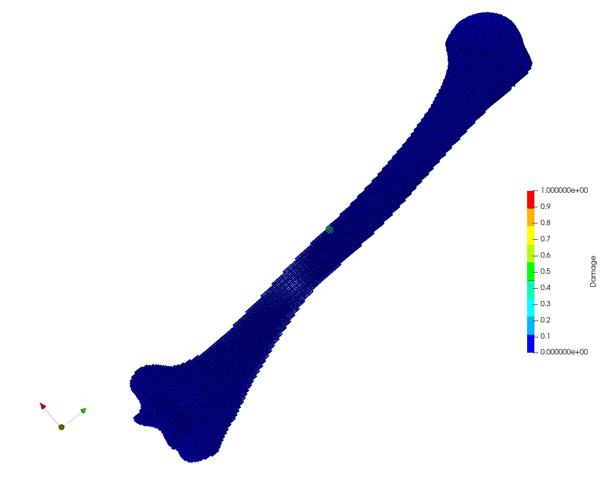
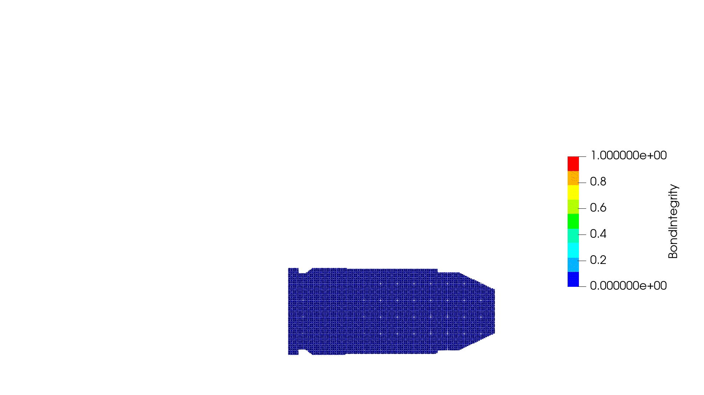
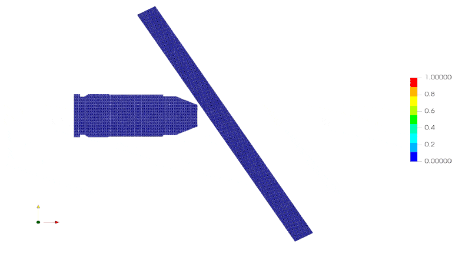
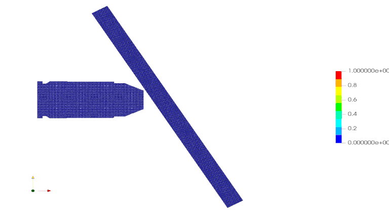
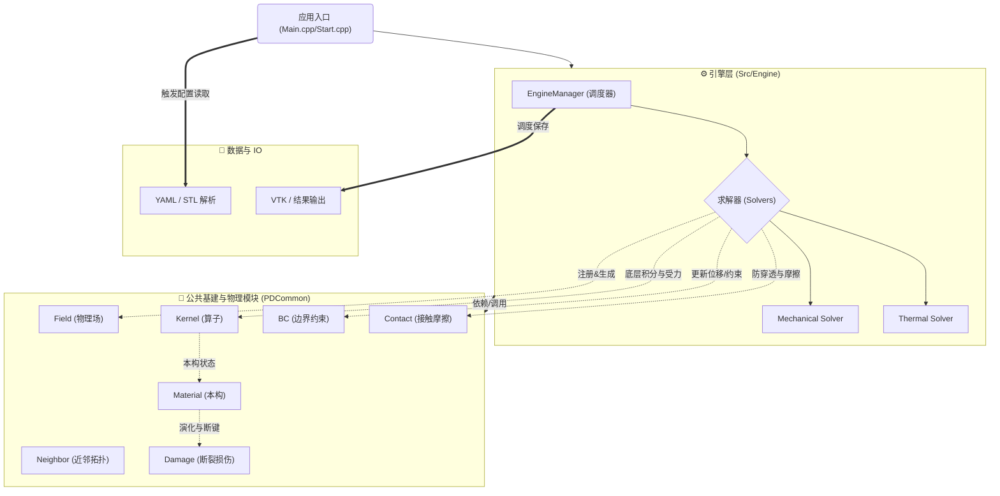
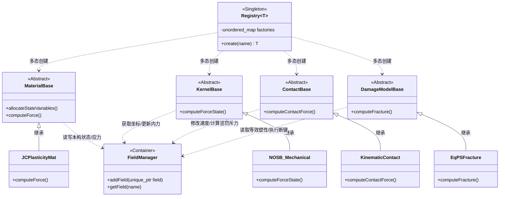
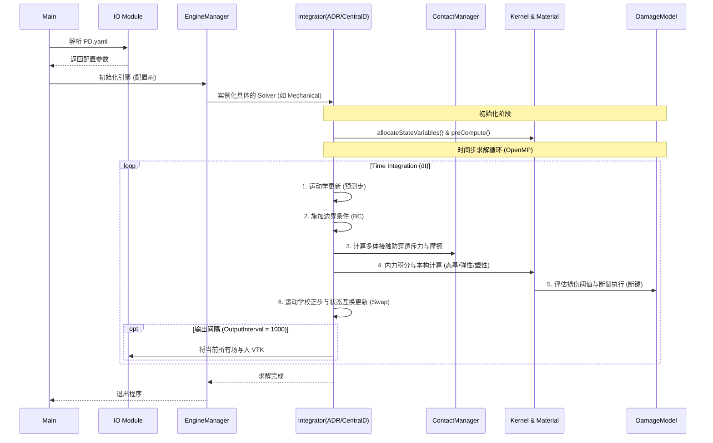

# General Peridynamics 🚀

General Peridynamics (即原 GRPD) 是一个基于 **现代 C++ (C++17)** 编写的高性能、高扩展性近场动力学求解引擎。采用完全面向数据的设计和多态工厂架构，该引擎能够以极致的内存局部性和高度的模块化去处理多物理场（如各向同性热传导、动量方程）的非局部积分运算。其核心理论脱胎于 **非常规态基近场动力学 (NOSB-PD)**，为复杂域内的破裂与跨尺度问题提供强劲底层计算力。

---

## ✨ 核心特性与架构亮点

General Peridynamics 坚持极简的依赖项、严苛的性能优化以及面向工业级扩展的架构准则：

1. 🚀 **纯粹的面向数据设计 (Data-Oriented Design)**
   抛弃传统“大对象裹挟数据”的重度封装。所有物理量按需经由 `FieldManager` 转化为连续的 SoA（结构体数组转数组结构体）存储（即成百上千个长度为 `NUM_PARTICLES` 的 `double*` 一级指针）。对计算核直接暴露连续数组，完全消灭指针追逐 (Pointer Chasing)，榨干 L1 高速缓存。

2. 🧩 **高度解耦的多态隔离与注册中心 (Registry & Factory)**
   从底层的材料本构 (`Material`)、物理场清单 (`PhysicsFields`)，到边界解析器 (`MeshReader`)，全部采用单例工厂加编译期注册设计。只要新增一个对应类并调用注册宏，即可自动注入内核逻辑，无需对求解器本身进行任何硬编码修改，实现了功能“插拔”和极致解耦。

3. ⚡ **全面并发指令驱动 (Parallel Native)**
   利用 OpenMP 进行细粒度共享大数组并发调度。无论是巨量的距离和影响系数运算，还是状态张量的内部还原、断键惩罚以及积分方程的主循环，全链路铺满 `#pragma omp parallel for`，且无任何锁开销风险带来的竞争。

4. 📂 **泛用型多格式无缝对接工作流**
   从上游点云/网格到下游计算的入口已实现了标准化。内置 Python 工具集支持使用 Open3D 高速扫描构建含表面精修的百万级体素测试物，而内核 IO 则拥有解析自定义文本 (`.grpd`) 乃至经典分析网格 (`.inp`) 等多模态提取能力。

5. 🛡️ **表面体积修正与零能震荡抑制**
   内嵌高精度非常规态基模型的体积补偿计算，彻底解决材料表面粒子因积分域被截断带来的非物理“软化”与形状张量不可逆缺陷；同时集成了高效抑制点阵空间零阶伪能震荡的算法模块机制。

6. 📈 **多段复杂载荷追踪与准静态弛豫 (LoadSteps & ADR Quasi-Static)**
   深度对齐商用有限元级别的大型非线性求解控制台。引擎内建并剥离了极高鲁棒性的自适应动态弛豫 (Adaptive Dynamic Relaxation, ADR) 积分控制网。原生支持高度复杂的多级 `LoadStep` 与精细 `NumSubsteps` 微步分段。能够精确感知并追踪基于阶跃 (Step) 或坡道 (Ramp, KBC) 控制的边界条件加压协议，并在单一子步收敛时完美触发弹塑性/损伤历史位姿的硬状态刻录 (State Commit)，将近场动力学全面推向能支撑材料强硬化非线性变形与破裂的刚性准静态模拟纪元。

---

## 📸 效果演示


_非常规态基近场动力学 (NOSB-PD) 模拟的长骨三点弯曲与动态脆性断裂过程（ParaView 渲染）_


_带十字预制裂纹弹头的非对称高速旋转撞击与复杂延性撕裂（基于 Johnson-Cook 流动法则与应力三轴度断裂阈值）_


_带有复杂曲面法向探测的接触摩擦体系 (NTS Contact)：高速硬弹体穿透靶板引发的结构大面积脆性崩塌_


_基于 Johnson-Cook 本构与三轴度加持的高爆延性网络：高速穿甲引发的靶板花瓣状撕裂与靶心动能投射_

---

## 🚀 快速上手 (Quick Start)

让引擎跑起来只需简单几步！我们的计算管线通过 `PD.yaml` 灵活调度。

### 1. 基本依赖准备

- **C++17 编译器**（需支持 OpenMP）：例如 TDM-GCC 或 Visual Studio 2019/2022+。
- **CMake** (3.15+) 及 **Python** (3.10+)。Python 端依赖库请通过以下命令装载：

  ```bash
  pip install open3d numpy pyyaml pydantic
  ```

### 2. 获取源码与编译

务必使用 `--recurse-submodules` 拉取第三方子模块（如 yaml-cpp）：

```bash
git clone -b v1.2 --recurse-submodules https://github.com/Huckleberry-F/GRPD.git
cd GRPD
mkdir build && cd build
# 生成工程 (Windows 环境使用 VS 则可以直接 cmake ..)
cmake -G "MinGW Makefiles" ..
# 执行最终多线程构建
cmake --build . --config Release -j 12
```

### 3. 执行第一个算例

程序编译生成至 `bin/release/` 下。让我们以自带的 Box 测试用例为例：

```bash
# 1. 移步业务运行目录
cd Examples\Box

# 2. 调用 Python 前处理脚本引擎，根据 YAML 将 STL 立体离散化生成初始节点网络
python ..\..\Generate_py\generate_model.py PD.yaml

# 3. 轰鸣起动机，调用 C++ 引擎（它会自动拾取本目录的 PD.yaml）
..\..\bin\release\GRPD.exe
```

计算结束后，当前目录下将自动生成形如 `Result_YYYYMMDD_HHMMSS/` 的时间戳数据包，直接向 ParaView 中一拉，即可探索分析您的模拟数据。

---

## 🗺️ GRPD 架构全景图 (Architecture Overview)

为了能够直观展现 GRPD 项目的结构、底层设计模式以及各模块之间的解耦关系，我们可以从“**模块组织层**”、“**核心运行流转层**”以及“**设计模式类图**”三个维度来构建架构图。

### 1. 系统模块层级图 (System Component Diagram)

展示整个 `GRPD` 的目录结构与模块宏观职责划分。严格遵守“解耦”和“高内聚低耦合”原则，`Engine` 和 `PDCommon` 形成了清晰的边界。



### 2. 核心架构与设计模式类图 (Design Patterns)

GRPD 采用了大量现代 C++ 架构设计，其中最核心的是：**“Manager进行生命周期管理（自身非单例，由引擎或求解器持有） + Registry进行静态注册（单例模式） + Factory实现多态分离”**。



### 3. 主计算循环时序图 (Main Computation Flow)

反映 `YAML` 解析到整个求解循环（`TimeIntegrator`）的时间线流转。



### 4. 静态资产：多态插件矩阵与求解能力兵器库 (Static Plugins & Arsenal)

得益于底层的 `Registry` 与 `Factory` 架构，GRPD 引擎已挂载并开放了极为丰富的物理拓展池。它代表了引擎的**软件设计与外延能力**。使用者仅需在 YAML 中简单声明对应 `Type` 即可无缝切换不同物理环境的模拟配置，展现出高度工业级的复合分析能力。全系模块及其主要应用场景如下：

| **架构层级** | **功能注册组件 (YAML Type)** | **核心能力与适用场景说明** |
| :--- | :--- | :--- |
| 💾 **网格解析与接口<br>(IO Readers)** | `GrpdMesh`<br>`InpMesh` | 自定义高并发扁平化点云读取格式、Abaqus 标准 `inp` 网格（六面体/四面体）提取与脱水重组。 |
| 🗃️ **多物理场发生器<br>(Physics Fields)** | `Mechanical`<br>`Thermal` | 基于求解类型自动开辟场内存：位移/速度/加速度场（力学），温度/热通量场（热学）。 |
| ⏱️ **演化积分控制<br>(Time Integrator)** | `ExplicitEuler`<br>`CentralDifference`<br>`ADR`<br>`StaggeredIntegrator` | 显式前向欧拉（一阶热扩散）、显式二阶中心差分（高速冲击）、自适应动态弛豫（静力平衡态）、多场交错步耦合控制。 |
| ⚙️ **空间计算核<br>(PDKernel)** | `NOSB_M`<br>`NOSB_T` | 力学非常规态基（处理大变形/大旋转客观应力率）、热传导态基（无网格多维连续热通量演化）。 |
| 🧱 **材料本构库<br>(Material)** | `LinearElastic`<br>`J2Plasticity`<br>`JCPlasticity`<br>`FourierThermal` | 圣维南线弹性介质、J2 Von-Mises 流动塑性径向返回、具备应变率极高敏及热软化的强冲击 Johnson-Cook 本构、傅里叶导热介质。 |
| 💥 **损伤与断裂演化<br>(Fracture Model)** | `BondStretchFracture`<br>`EqPSFracture`<br>`DamageValueFracture` | 经典临界伸长率断裂、等效塑性演化破坏、以及包含拉伸保护阈值与应力三轴度（$p/q$）加持的高爆延性毁伤网络。 |
| 🛡️ **接触与碰撞机制<br>(Contact Mechanics)** | `Kinematic`<br>`Penalty`<br>`NTN` / `NTS` | 纯净宏观非背景库仑滑动摩擦法则、防穿模罚函数阻力、MPM动量投影网格法（防跳弹爆炸）、NTS 子步稳固几何插值体系。 |
| ⚖️ **稳定器与抗沙漏<br>(Stabilizers)** | `Zhang`<br>`Wan`<br>`Silling` | 高效二次型张量投影阻力阵列、四阶刚度张量缩并、经典标量力补偿。彻底根治点阵离散零阶能震荡（Zero-Energy Oscillations）。 |
| 🛑 **驱动边界网<br>(Boundary Control)** | `DISP`, `VELOCITY`<br>`BODY_FORCE`, `PRESSURE`<br>`TEMPERATURE`, `HEAT_FLUX` | 全系支持分步递增（坡道/阶跃）解析，支持 AABB 框或 `PartID` 自适应扫描绑定，涵盖拉压、速度投射乃至智能 2D 等效面压驱动。 |

---

---

## 🏗️ 动态管线：引擎工作流与 8 层执行体系 (Dynamic Pipeline)

> 💡 **架构哲学：如何理解“多态矩阵”与“8层执行体系”的关系？**
> 
> 在您向他人展示架构时，可以这样清晰界定两者的角色：
> - **多态矩阵（第 4 节）**是系统的**静态能力兵器库**。它回答的是：*“这套系统目前能解什么物理问题？”*
> - **8 层体系（第 5 节）**是系统的**动态内核流水线**。它回答的是：*“这套系统在计算机里是怎么一步步跑起来的？”*
> 
> **两者的完美交叉**：8 层体系（流水线）在底层代码里定义了极其死板的“插槽（抽象基类接口）”，而多态矩阵就是运行时根据 `PD.yaml` 装填进去的“插件弹药”。例如，流水线的第 7 层只负责无脑调用 `MaterialBase->computeForce()`，而真正执行物理定律的，是从多态矩阵中提取出来的那个 `J2Plasticity`。流水线骨架永远不变，兵器库无限扩充。

> **注：这里的“多层体系”指的是项目在软件架构上实施的“横向分层”隔离机制**。如同网络 OSI 七层模型一样，GRPD 引擎将整个计算流程从“外”到“内”、从“高阶时间控制”到“微观材料响应”划分为 8 个互不依赖、单向调用的层级。每一层只知道自己该做什么，并通过标准化接口（如 `PDContext` 和 `FieldManager`）与上下层通信，实现了**全链路的互不侵入**，确保了极端的模块化，防止了面条式代码 (Spaghetti Code) 的产生。

> ⏳ **层级间的逻辑联系（线性还是交叉？）**
> 这 8 个层级在时间轴上并不是简单的“一溜烟跑完”的纯线性，而是**“线性初始化 + 嵌套循环计算”**的逻辑关联：
> - **单次线性流水 (层1 -> 层2 -> 层3)**：这三层是初始化阶段，在 $t=0$ 时刻严格按顺序**只执行一次**。
> - **嵌套高频循环 (层4 托管 -> 依次调用 层5/层6/层7/层8)**：第 4 层（时间积分器）是一个永不停止的时钟主控（Master Loop）。在它的每次滴答（时间步 $dt$）内，它会向下**依次**发号施令，按序激活第 5、6、7、8 层的计算操作，并将各层算出的受力累加起来去更新粒子的下一步运动。

引擎的每一次“点火”，均按照以下 **8个核心层级** 依次激活与演化，每一层严格执行单一职责：

### 第 1 层：输入解析控制层 (IO & Parsing Gateway)

这是外部世界与引擎握手的接驳点。

- 由 `IOManager` 自动寻获当前运行环境下的 `PD.yaml` 并转换为引擎参数结构。
- 调用 `ReaderRegistry` 获取当前环境最适配的 `MeshReader` 派生类。不管是点云结构还是 FEM 网格拓扑，统一翻译剥离并存储为高度扁平化、脱水的 `MeshData` 对象。

### 第 2 层：预处理与内存初始化池 (Initialization Pool)

从混沌进入有序状态。主导权交由 `PDEngineInitializer`：

- 由 `InitModel` 将 `MeshData` 的点数据转换为粒子抽象身份 (`ParticleManager`)。
- 由 `InitNeighbors` 计算邻域范围并压紧生成数以百万计的稀疏映射池 (`NeighborList`)，并一次性进行体积修复计算。至此，拓扑连接完成建立并固化。

### 第 3 层：大容量连续场接管层 (Core Data Fields)

整个底层的高性能命脉。

- 基于给定的 `Physics Type` 和材料种类，工厂会唤醒对应的注册器。随即，`FieldManager` 会向内存开辟大块的线性连续存储区 (即 `double*`)，作为 `Temperature`、`Volume`，乃至 `State Variables` 的最终宿主，为下一步的指针狂潮做准备。

### 第 4 层：时间积分与外力驱动器 (Time Integration & Drivers)

引擎大循环的节拍器。

- 这层主要承接 `TimeIntegrator` 显式或混合步进（例如 Explicit Euler, Velocity-Verlet）。
- 在每次循环起步时下发外力和边界条件约束锁 (`BCManager`)。

### 第 5 层：多体接触与摩擦防卫层 (Contact Mechanics)

物理拓扑防穿刺的先锋卫士。

- 在每一时间步位移预测完成后，由 `ContactManager` 激活底层的 MPM 或罚函数排斥阵列，利用空间哈希网格 (Spatial Hash) 或子步锚定去探测多材料体的互穿量，并投射强大的法向斥力与切向滑动摩擦机制，确保碎片与结构的物理几何隔离。此层与内核积分、材料本构均**互不侵入**。

### 第 6 层：物理积分核方程体系 (Physics Integral Kernel)

真正的数学计算深渊：非常规态基 (`NOSB_Base`) 内部架构处理。

- 使用最高频的 OMP 并发大循环调取相邻空间相互作用系数。组装形状张量表观 $\mathbf{K}$ 并执行它的精确求逆；处理广义状态力和零能控制模式衰减惩罚并将其平铺。此层计算结果将回传直接影响粒子的运动状态更新。

### 第 7 层：力学和物理本构层 (Material Constitutive)

极微观尺度的裁决官。

- 如 `J2PlasticityMat` (塑性本构) 等均以无状态类的单例形态存在。`PDKernel` 积分时仅负责传参下发，材料层计算应力、热通量响应值并回传反馈。两者完全解耦，绝不互相知晓各自内存结构。

### 第 8 层：损伤演化与拓扑断裂层 (Damage & Fracture)

负责生与死的审判。

- 依附于材料模型被计算完毕之后，`DamageModel` 提取最新的应变/应力态（如等效塑性、应力三轴度），评估粒子周边键的失效阈值并标记死亡。它在物理周期的最后彻底修改邻域矩阵，其独立自治防止了本构模型代码的极度膨胀。

---

## 📁 目录结构与功能注解

```text
General-Peridynamics/
├── PDCommon/          # 核心底层通用架构与各类计算基底构件 (Core Base)
│   ├── BC/            # → 边界约束容器：位移锁定(DISP)/外力载荷(BODY_FORCE)/速度场控制
│   ├── Contact/       # → 接触惩罚体系：跨材料防穿透搜索树与自动接触刚度标定
│   ├── Core/          # → 全局类型定义与内存配置抽象基类
│   ├── Damage/        # → 损伤力学架构：解耦的断裂模型组件与预制裂纹形态注册表
│   ├── Field/         # → 数据大动脉：连续内存场(SoA)生态与分配池
│   ├── IO/            # → 多态接驳口：结构化 YAML分析与多模态模型写入接口
│   ├── Kernel/        # → 物理内循环组件：广义力学(NOSB_M)与动态稳定器 (Stabilizer)
│   ├── Material/      # → 本构计算枢纽：弹性介质库(LinearElasticMat)与状态存储
│   ├── Model/         # → 模型构架图谱：承载网格转化信息的 ParticleManager
│   ├── Neighbor/      # → 邻域搜索引擎：CSR大容量索引建设及表面截断修正库
│   └── Utils/         # → 底层服务体系：日志打印系统、错误溯源捕手
├── Src/               # 主求解核心与全生命周期组装厂
│   ├── Engine/        # → 求解引擎多态池：定义Engine抽象机制与注册工厂
│   │   └── Solvers/   #   └── 具体的求解机实现仓库 (如 PDEngine 及特供力学初始化机制)
│   ├── Integration/   # → 时间演化推进器：显式差分大总管 (ExplicitEuler/CentralD/ADR)
│   └── main.cpp       # 引擎最高时序控制主点火程序入口
├── Generate_py/       # 辅助 Python 前处理与网格体素工厂
│   └── generate_model.py # → 使用 Open3D 构建高密度实体微元模型的瑞士军刀
├── Examples/          # 工程应用与测试基准全解靶场
│   ├── Box/           # → 均质长方体空间导热 Benchmark
│   ├── Sphere/        # → 标准球体径向扩展 Benchmark
│   ├── bone/          # → 特异性曲面网格 (如骨骼) 分析 Benchmark
│   └── Engine/        # → 复杂装配体级仿真案例
└── CMakeLists.txt     # 各平台编译一键流水线蓝本
```

---

## 📌 版本更新日志 (Changelog)

### v4.5 — 面向 ADR 准静态松弛的 NTS 权重冻结与完美接触生态 (Robust Quasi-Static Topology Anchoring & Contact Ecology)

- **子步级别接触几何锚定 (Incremental Topology Freezing)**: 为彻底攻克 Node-To-Surface (NTS) 高阶曲面平滑插值在 `ADR` 人工松弛虚步下所带来的非保守内力振荡难题，首次全面引入子步起点缓存锚定机制。基于扩展后的 `PDContext` 信号总线，`NTSEvaluator` 具备智能区分物理时间递进与松弛下山试探的能力。在同一个 LoadStep 子步期间强制锁死投影法线与逆距离拓扑，把 NTS 从极具破坏性的非定常雅可比降维成了超强收敛的全等二次保守形式。将原本 20000 步拒不收敛的接触工况，提速至极细步长的数百次微循环内精确结晶至 $10^{-6}$ 精度。
- **混合状态接触场零损传输 (Lossless State Forwarding)**: 针对因引入 Topology Cache 后遗留的 `ContactNormal` 和 `VirtualSurfacePos` 瞬态可视化场消隐问题，深度修正了 `onPreEvaluate` 生命周期。在完全不需要重新分配与搜索的虚步内安全避让 `std::fill` 清空管线，确保用户在 ParaView 后处理中能实时捕获并追踪到被严丝合缝冻结的主面轮廓变迁。

### v4.4 — 接触底层扁平化与双轴正交解耦 (Contact Flattening & Dual-Axis Orthogonal Decoupling)

- **架构降维与极致扁平化 (Flattened Architecture)**: 彻底移除了人为编造的 `StandardContactAlgorithm` 组装器与 `IContactDetector` 抽象封装层。将空间哈希网格探测循环 (Spatial Hash) 直接打入顶层算法 `NTNContact` 内部；促使 `NTN` 与基于质心投影的 `Kinematic` 成为平级的直系调度入口，显著缩短并净化了底层引擎 OMP 并发的物理调用栈深度。
- **双轴正交极简注册中心 (Dual-Axis Factory Registration)**: 重塑了全局 `ContactRegistry` 出厂协议。使得力学公式（ForceLaw，如 Penalty/Silling）与几何算法（Type，如 NTN/NTS）被物理隔离。允许直接在 YAML 下发 `Type: "NTN"` 叠加 `ForceLaw: "Penalty"` 的搭积木配置，实现新力学算子的一键全局多搜索系适配。
- **斩断技术债务底座清理 (Eradication of Legacy Wrappers)**: 大刀阔斧地彻底移除了包含 `PenaltyContact`, `ViscousPenaltyContact`，`NodeNodeContact` 在内的共 17 个由于早期架构混乱而滋生的废弃过渡封装文件头与源文件，实现了系统全代码库的极致“纯净态”。

### v4.3 — 运动学库仑摩擦机制与项目级极限参数字典 (Coulomb Friction & Full-Stack YAML Mapping)

- **动量限制型库仑摩擦机制 (Momentum-Bound Coulomb Friction)**: 颠覆了原版显式动力学中因引入单纯反向力而容易诱发的低速抖动缺陷。于 `KinematicContact` (运动学修正算法) 的核心底层完成了纯净切向速度抽离，使经典滑动摩擦 ($\mu F_n$) 原生挂载；特设了单步冲量锁死防线 $F_{max} = m^* v_t / dt$，完美根除滞滑转态 (Stick-Slip) 时的反向自激跳跃，在积分层面上完成了静、动摩擦的自动、绝对平滑的过渡识别统合。
- **柔性防漏风接触容差探测 (Soft Boundary Halo Tolerance)**: 全系引入了突破网格硬边线封锁的 `PinballRatio` 检测倍率扩展。底层接触树（Cell-Linked List）能自动识别被放大化的粒子防撞区，凭借预先吸收极微小的安全斥力，彻底填补微元块体组装并发生滑移时的接触面阶梯效应。该机制经 ANSYS 对标实测，强力碾平了离散介质边缘锯齿诱发的寄生侧向剪滞力波。
- **极客级全矩阵属性映射蓝本落地 (Exhaustive YAML Schema & GUI Foundation)**: 从零逆向拆解并盘点了 GRPD 所有的底层 C++ `Node::as<T>` 并发接口池，发布最高指级的架构词典《`GRPD_YAML_Dictionary.md`》。强行将超过 60 个被封装在暗渠的高阶属性——从小至 `RepairMesh` 的拓扑微操到大至 `NonlinearOnsetRatio` 的非线性防模罚锁——全盘提拉至白盒级别。正式确立了在未来挂载 Qt6 / PySide6 进行一键工程组装与渲染映射的终极底层协议大纲。

### v4.2 — 二维架构大一统与人工质量守恒 (2D Planar Kinematics & Unified Mass Scaling)

- **边界受力免疫降维 (Pressure-to-BodyForce Automata)**: 深度重构边界条件模块，为 `BC` 基类开辟自适应比例尺注入通道。现在 `PressureBC` (面压条件) 可在底层完美侦测解析粒子的等效几何尺度 (`dx`, 密度)、甚至是动量方程里由于显式大步长而开启的 `MassScaleFactor` 质量放大系数，并自动实施完美等价的牛顿第二定律体力投影。解除了使用者在前处理时对虚拟质量心智的绑定。
- **接触惩罚刚度与态基微模量的等效降维 (2D Planar Thickness Extrusion)**: 首次为二维平面的接触赋予了空间物理感知能力。针对面际惩罚排斥 (`PenaltyContact`)，自动调取系统维度，仅在触发 `Plane Stress`/`Strain` 时自动乘以厚度进行弹性刚度膨胀；深度修复了原生态基 `SillingContact` 排斥模型，为其特供注入了基于二维平面应力的近场动力学专属微模量修正解 $c_{2D} = 9K / (\pi t \delta^3)$，从底层算式上彻底铲除了伪三维常数积分时衍生的平方级几何失真假象，使接触反馈完美契合线性缩放规律。
- **动态松弛时间尺度演进与收敛鲁棒性大一统 (ADR Global Evolution)**: 将全局 `MassScaleFactor` 直接注入每一个节点碰撞循环，使接触力场演化步调彻底与主位移迭代同频共振；强力修复了显式准静态的求解控制回路，纠正了阶跃载荷 `kbc=1` 期间波峰基准跟踪失效的数学谬误。并独创性挂载了基于宏观超静止容差的“保持载荷步放行门栅 (Hold-Step Stillness Bypass)”，当系统完全丧失动能且仅余运算底噪时强行终止空转迭代。将准静态算法的推进效率与物理收敛性推向巅峰。

### v4.1 — MPM 式多体动量投影接触与模板体系架构大一统 (MPM-Style Contact & Unified Architecture)

- **NodeNodeContact 模板方法强基座**: 彻底重构接触内核模块。抽取空间哈希网格探测 (Spatial Hash Grid)、OpenMP 拓扑并行与防自交过滤的核心逻辑，上浮为 `NodeNodeContact` 统一基类中的模板生命周期法。衍生子类 (Penalty, ViscousPenalty) 仅需专注实现 `computePairForce` 惩罚闭包，单文件代码削减高达 65%，使扩展新型数学接触模型变得犹如搭积木般纯粹。
- **MPM 式运动学质心动量接触法 (Kinematic Contact)**: 彻底颠覆了传统的逐对点计算与法向约束无限叠加机制，根治了由于 N 对接触累积所致的超临界阻尼过冲及爆炸式跳弹现象。创新性引入 MPM “虚拟主面映射”理论，按侵入深度收集碰撞对构筑“连续虚面法向与聚合切向速度”，从而将极端侵彻与碎片飞溅安全稳固在全球质量-动量守恒的投影法则中。
- **原生多体 Coulomb 摩擦力场 (Coulomb Friction)**: 乘借准确的干涉场体积梯度法向 ($\sum d_{ij}\vec{n}_{ij}$)，在非背景网格的物理引擎中成功精准抽离了摩擦切向速度，顺势落实了带有严格滑移限幅的纯粹库仑摩擦阻尼 ($F_f = \mu F_n$)，大幅削减穿甲动能流失与靶心跳弹率。
- **Silling 态基原生基础修正**: 定位到了原版标量级力密度态基模型量纲缺失之痛，引入基于粒子真实体积映射的二次缩放常委 ($V_i V_j$)，将短程等效刚度与 Penalty 型力学量纲严格拉平方圆。

### v4.0 — 强非线性接触引擎与面向数据防腐架构 (Robust Contact Mechanics & DoD Refactoring)

- **物理化罚函数接触弹簧 (Penalty-Based Contact Kinematics)**: 实现了跨材料的防穿透接触斥力系统 `PenaltyContact`。首次引入基于体积缺损算法判定的动态表面剥离体系 `SurfaceDetector`。系统可通过读取关联材料的体积模量 (Bulk Modulus)，全自动计算稳健的基准接触刚度。配合安全下探探测率 (`PinballRatio`)，完美隔绝了不同 `PartID` 子网格的高速幽灵穿模现象爆发。
- **面向数据级 (DoD) 中央内存互换网管 (State Swap Manager)**: 针对多物理材料模型（如子弹+靶板同时应用断裂算法）导致的底层指针反复翻车灾难，重写了 `FieldManager` 的双指针互换层。剥夺了具体求解模块的状态切权，由全局引擎实行统一的 `executeAllRegisteredSwaps` O(1) 纳秒级指针换绑，从根本上实现了安全可靠、零拷贝的千军万马显式代数推进。
- **全局域穿刺边界控制 (Part-ID Bounding Override)**: 对 Python 核心预处理算子 `generate_model.py` 实施黑科技魔改，使 `.yaml` 解析内核正式支持以 `PartID` 直接圈定全尺寸零件。完美解决了由于几何包围盒重叠、倾斜网格相交导致的约束误伤边界，将 Dirichlet 时间锁定边界发挥得犹如“手术刀般精准”。
- **单步隐式冲量与自由断离支持**: 解决了长期以来的动量方程“永久神权锁定”悖论。确立了在短兵相接的前置 `Step 1` 内实施初速度（微秒级）强锁、继而在后续大局观剥离的隐式“初速赋予法”，还原了高能金属材料接触后的疯狂拉扯与塑性飞洒碎裂。
- **动态沙包破片接触与应力超截断 (Rubble-Pile Sandbagging & Stress Cut-off)**: 在高爆冲击与穿甲分析场景中，解除了废弃死点对接触检测的免疫机制。使完全断键脱离基体的金属碎片继续承当“沙包”吸收撞击动能并在前锋堆积；同时在 `NOSB_M` 态基内力积分时引入毫秒级超截断机制 (Stress Zeroing)，切断死点向外传递剧烈畸变伪应力的后效，极大地平息了弹道穿甲中的无物理意义冲击波，实现了真实可信的蘑菇头堆栈碰撞碎裂形态。

### v3.2 — 高性能内存布局演进与高速冲击动力学蓝图 (HPC Architecture & Explicit Dynamics Roadmap)

- **J2 塑性无分支流水线优化与 AoS 缓存穿透 (Branchless Vectorization & Cache Locality)**: 成功对 `J2PlasticityMat` 的径向返回核心算法清除了破坏 SIMD 预测的条件判定分支 (`if-else`)，使代码实现纯数学平铺；经由底层带宽与张量访存特性的严格剖析，将力学核心内存定格在利于单粒子 $3 \times 3$ 张量矩阵 L1 缓存全命中的 `AoS` (Array of Structures) 结构。
- **动态多重载荷步调度修正 (Dynamic KBC per-step Resolution)**: 重构了 `ADR_Integrator` 的子步迭代器。摒弃了全局定常化载荷错配，实现了对任一独立 LoadStep 流的私有 `KBC` (阶跃/坡道加载) 熟悉实时读取与精准跟踪；从根本上修复了多阶非线性载荷切换期间 `MechanicalBC` 物理位移捕捉断崖的隐患。
- **大变形弹性超弹性基座规范化与证明 (Finite Strain Hyperelasticity Formulations)**: 理论梳理并确认了以 `LinearElasticMat::ComputePK1Stress` 为主轴的圣维南-基尔霍夫 (Saint Venant-Kirchhoff, SVK) 超弹性大旋转本构处理流程。彻底透彻了商用大厂求解器 (ANSYS / LS-DYNA) 弹塑性框架中 Jaumann/Green-Naghdi 客观次弹性率机制与乘法分解 ($F=F^eF^p$) 的选型哲学。
- **军工穿甲与汽车碰撞研发蓝图 (Roadmap for Ballistics & Crashworthiness)**: 对着 GRPD 面向国家级高精尖武备碰撞实验领域的拓展，撰写了详尽的底层架构白皮书《架构远景规划：AoSoA 路线展望》并正式确立了包含 Johnson-Cook 本构、近场短程接触斥力在内的下一代四大显式研发战线。

### v3.1 — 金属塑性与二次开发插槽 (J2 Plasticity & UMAT Architecture)

- **J2 流动塑性本构落地 (Von Mises Plasticity)**: 成功实装了经典的 J2 金属塑性本构 `J2PlasticityMat`。引入了标准的小变形切线映射与径向返回算法 (Radial Return Algorithm)。首次跨越纯弹性阈值，使 GRPD 具备了模拟金属屈服、能量耗散与弹塑性加载的能力。
- **面向数据设计 (SOA) 的状态挂载机制**: 新增首创的 `bindStateVariables` 内存挂载策略。在海量粒子场分配完成定型后，将复杂的历史状态变量 (`EqPlasticStrain`, `PlasticStrain` 等) 的底层连续裸指针直接硬对接给材料计算单例，从而在确保极低访存延迟的 OMP 深层循环下，实现无锁的、精确的粒子历史依赖更新方案。
- **极端优化的 O(1) 状态试探与推进机制 (Trial & Commit States)**: 对接 ADR 等显式准静态跌代体系，引入 `Trial` 试探场和 `Old` 落盘场的双套全尺寸场设计。并在推进代际时，引入深置于 `TypedField` 的原生内存交换算子 `swapDataWith` 机制，将成千上万粒子的微观历史步耗时清空至纳秒级 O(1) 互换。
- **物理严密的复合拉伸损伤拦截网 (Tension-only Damage & Fracture)**: 修正了传统的 Johnson-Cook 本构模块与全局 `EqPSFracture` 等效位错断裂在三向静水约束时“因被过度受捏而虚假崩解”的物理缺陷。构建了底层的拉伸追踪防卫网（只有 $\sigma_m \text{（静水压）} > 0$ 时，破坏演变方可被接纳），史诗级还原本源的超高速接触与背板应力破壳特征。
- **用户材料动态挂载 (UMAT/DLL) 架构范本**: 新增详尽的 `Docs/UMAT_Development_Guide.md` 指南，确立了采用匿名通用一维内存池 (`numStateVariables > 0` 与 `SDV`) 和纯 C-ABI 裸指针穿梭来实现高性能第三方 DLL 二次开发的蓝图架构。

### v3.0 — 终极组件化与伪代码级积分架构重构 (Ultimate Componentization & Self-Documenting Integrators)

- **自文档化积分架构 (Self-Documenting Pipelines)**: 彻底分解重构了 `ADR_Integrator`、`CentralDifference` 与 `ExplicitEuler` 历代积累的巨石型主循环代码。将所有繁杂的内核数组寻址与拓扑配对逻辑下沉抽象至 `TimeIntegrator` 基类的 `extractFirst/SecondOrderTargets` 函数。现在的积分器入口如同严谨的伪代码散文，真正实现了大解耦与高度可拓展性。
- **动能状态探针与预成型外挂**: 深度集成了 `TOL1` （伪速度 L2 范数）的动能探测与日志规范输出。在确保原版自适应阻尼器 ($cn$) 可观测性的同时，为后续直接接入“全场动能归零强制减速法 (KER)”做好了底层探针接驳口。
- **统一外设工具链与解耦隔离**: 抽离创立了 `PDCommon/Utils/StringUtils.h`，统一管控了全场底层精度的科学计数法打印；凭借对积分核心目标的隔离，将大部分积分器的头文件包含数量砍去过半，达到极致的文件级编译隔离。
- **多阶段物理推进器底座 (Multi-Step Time Integrator Base)**: 跨求解器打破了全局单调定步长加载的时代限制。在 `TimeIntegrator` 基类层升维引入 `LoadSteps` 与时间/子步驱分段控制框架，使包含显式动量、准静态松弛（ADR）、显式热传导的全体积分核均彻底获得多任务分步连续演化能力。底层已并轨支持基于物理时长的变尺度 $\Delta t$ 控制以及预置了与时间-幅值查表技术 (Table Amplitude) 耦合的高阶生态。
- **精简化纯净日志系统 (Clean & Professional Logging)**: 针对底层 `Logger` 彻底重构了具备缩进感知的支持 UTF-8 的全自动 Word-Wrap 折行算法。智能消除缺乏前缀的冗余时间戳断层，并全面静默了后处理 `VTKOutput` 频繁的刷屏提示。使庞杂的时间积分循环能在极度纯净且自动排版的模块 Header 层级下流畅推演汇报。

### v2.5 — 高阶非线性求解重构与 ADR 极速优化 (Advanced ADR Optimization)

- **反多核实例重叠计算防御 (Multi-Kernel Defenses)**: 在时间积分系统底层确立了更安全的结构体内存查重防卫机制（提炼提取了 `FirstOrderTarget` 与 `SecondOrderTarget` 到积分基类 `TimeIntegrator`）。根除了相同的物理场被复数同类型求解模块（例如同时启动数个独立区域的非常规态基核）带来的重复积分迭代崩溃，赋能全模块泛用大耦合。
- **残差阻尼归一化基准 (Incremental Adaptive Damping)**: 在自适应动态弛豫核心 (`ADR_Integrator`) 内引入跨 Substep 的 `dispBase` 基准记录体系。彻底消除累加多 LoadStep 的物理大变形场景下，因为总体位移分母过度膨胀导致的结构动力消能失活 Bug。
- **极速热核分支消除 (Zero-Branch OMP execution)**: 应用乘法平移取代指令中断判定语句。在热点并行 `schedule(static)` 内核内通过智能三元赋值清剿了基于机器截断精度的防除零发散检测分支 (`if(abs(v)>1e-16)`），让底层指令寄存器和 L1 Cache 预加载管线得以满负荷发挥并发优势。
- **显式准静态高级架构确立 (Explicit Quasi-Static Architecture Blueprint)**: 提炼并编制出了《基于子步分段的显式动态松弛跟踪法》设计大纲 (`Docs/ADR_Substepping_Explicit_Relaxation_Design.md`)。为 GRPD 引入连续极小增量、内层实时径向返回及本构状态瞬间固化的重型非线性暴力求解流派确立了实施范本，破除了传统牛顿法根找不着引发全步长丢弃的时间诅咒，为强硬化与破坏准静态定常化铺平道路。

### v2.4 — 显式准静态自适应动态弛豫积分器体系 (ADR Quasi-Static Solver)

- **自适应动态弛豫核心 (Adaptive Dynamic Relaxation)**: 全新引入了基于速度 Verlet / Leapfrog 框架的显式准静态时间推进器 (`ADR_Integrator`)。通过计算内力残差与位移增量内积，自动感知系统振荡并投射最优的衰减阻尼系数 ($cn$)。实现了在显式并行框架内完美过滤激波、极高稳定性地模拟大变形与断裂准静态加载。
- **ANSYS 风格阶跃/坡道加载管线 (KBC Load Control)**: 深度对齐顶级商软底层的载荷调度内核。在积分域外包裹了 `LoadStep` + `NumSubsteps` 复合架构，且完美还原了 `KBC=0` (Ramp 坡道平滑爬升) 与 `KBC=1` (Step 阶跃突加) 控制逻辑，`BCManager` 实现了 `loadFactor` 分步加压支持。
- **纯净的多态时间积分网络与状态刻录**: 将积分系统（ExplicitEuler/CentralDifference）的 YAML `configure` 解析全盘剥离至各 `.cpp` 私密实现，保持了头文件无污染的防御性编程规范。在 ADR 载荷收敛时刻全面引入 `Material::commitState()` 状态池固化钩子，为未来的塑性与不可逆损伤做好了伏笔。

### v2.3 — 损伤断裂力学解耦与多材料扩展架构 (Damage Module Refactoring)

- **全局损伤机制解耦 (Damage Decoupling)**: 彻底重构 Peridynamics 断裂模块。将 `DamageModel` 的配置与判断逻辑由全局 `Solver` 级别剥离，下沉至 `Material` 本构层级。这种架构级的重大解耦使不同材料能够拥有独立自治的断裂失效法则，为未来处理多相复合材料复杂破坏、界面脱粘提供了坚实的扩展根基。
- **预制裂纹单例注册表 (PreCrack Registry)**: 引入 `PreCrackRegistry` 和 `PreCrack` 多态抽象体系，通过参数化几何描述（如 `QuadCrack` 四边形裂纹面）精确定位并自动切断初始拓扑连结。实现了在连续体素网格内无需前处理结构分割即可灵活定义三维内部裂纹。
- **状态变量内聚化管理**: 损伤状态等历史记忆变量完全作为一种内部场，依托标准 `allocateStateVariables` 机制由材料组件自我管理。断绝了物理积分内核与具体损伤演化的相互粘连，将内核演化系统还原为最纯粹的微分代数计算。

### v2.2 — 高性能零分配内核与多维惩罚架构升维

- **零内存分配生命周期 (Zero-Allocation Lifecycle)**: 彻底重构 `Stabilizer` 的基类体系与运行机制，引入强制性的 `preCompute` 生命期接口。将原本在时间积分主循环 (Hot-Loop) 中每步触发的属性下发、张量不变式拼装全盘剥离至初始化阶段。依靠预申请的高速大缓存（如 `pkKinvCache_`, `shapeAi_`），彻底根除了单步千万级的底层动态堆内存分配和 RTTI 检查。
- **物理维度自动降阶投影 (Auto Dimension Projection)**: Python 前处理工作流深度挂载 `Dimension` 控制选项。开启 2D 时将自动剥离冗余 Z 轴进行微元切片降维组装。巧妙利用数学恒等变换，让纯粹 3D 架构的 C++ 底层引擎在**零业务代码修改、无特判**的情境下，完成了纯平面的跨量级降维打击，粒子搜索开销几何级清空。
- **深度局部并发与 OMP Guided 均衡 (SIMD Vectorization & Load Balancing)**: 将力学 `NOSB_M` 和热学 `NOSB_T` 内核中涉及巨量点积计算的底循环通过 `#pragma omp simd` 强制挂载编译器矢量化寄存器，并手动实施不变式前置抽取。将所有物理场层级并发块挂入 `schedule(guided)` 调度网络，彻底歼灭表面和缺角粒子带来的多线程长尾饥饿问题。
- **现代 CMake 标准破壁前向兼容 (Forward Compatibility)**: 排查并修复了 `Eigen` 等下辖泛型模板库内陈旧的预处理语法。启用 `VERSION 3.14...4.1.0` 的闭区间宽恕声明，完美横跨对接最新 CMake 4.0.3+ 的所有规范性检验，全战线黄线报错清零。
- **零能控制模块角点异常解析 (Boundary Anomaly Resolving)**: 针对 Zhang 等刚度惩罚力算法在局部张量条件数病态断层时的“角点爆炸”痛点，给出了涵盖幽灵粒子 (Fictitious Nodes)、边界刚度衰减器 (Boundary Attenuation)、多态回退融合三种工业级化解纲领。

### v2.1 — 边界条件体系规范化与时间积分器统一重构

- **BC 分类体系统一**: 所有边界条件子类（热/力学共 7 个）全部显式声明 `isConstraint()` 覆盖，彻底消除依赖基类默认值的隐患。统一约定：Dirichlet 型（`set`, `isConstraint=true`）在积分步末尾重新施加；Neumann 型（`add`, `isConstraint=false`）仅在力计算前施加一次。
- **VelocityBC 叠加缺陷修复**: 修复了 `VelocityBC` 因缺少 `isConstraint()` 重写导致速度在每步不断累加的严重 bug。
- **力学 BC `apply()` 接口统一**: 全部力学边界条件的 `apply()` 方法从手动 `getData()` 下标操作重构为使用 `TypedField` 的 `set()`/`add()` 按分量接口，与热 BC 风格完全对齐。
- **时间积分器步骤结构规范化**: `ExplicitEuler` 与 `CentralDifference` 统一为「清零→源项→内力→积分→约束」的标准循环模板。`applySources()` 与 `applyConstraints()` 完全解耦，各自出现在逻辑正确的位置。
- **Python 前处理科学计数法容错**: 修复 `generate_model.py` 中因 PyYAML 将 `1.0e20` 解析为字符串导致的格式化崩溃。
- **通用算力流程封装**: 在 `TimeIntegrator` 基类中提取 `evaluateForces()` protected 函数，封装「清零率场→施加源项→计算内力」三步通用流程，消除子类间的重复代码。
- **力学位移加载算例**: 新增 `Examples/Box_Disp` 二维平面位移拉伸测试用例，配套速度驱动边界与线弹性本构。

### v2.0 — 非常规态基力学内核崛起与全域稳定化体系

- **大变形 NOSB 核心上趟**: 全面贯通了 `NOSB_M` 力学积分核。在双重 OMP 热点下实现了形变梯度 $\mathbf{F}$、广义形状算子 $\mathbf{K}^{-1}$、以及非仿射残存位移 $\mathbf{z}$ 的无分支萃取与高性能并发现发。
- **全系零能模式防护墙 (Zero-Energy Stabilizers)**: 构建了三套针对大变形切变与穿透的微观惩罚网络（Silling 标量法、Wan 纯四阶缩并法、Zhang 动态阻力张量阵）。通过对公式体系的终极重整，将原本极易拖垮缓存的全局阻滞张量替换为 L1 命中率爆表的 $O(N)$ 零长延时向量点积。
- **动量与显式差分驱动器**: 针对运动方程上线了 `CentralDifference` 核心差分推进引擎，被安全挂入全局 `TimeIntegrator` 网络，支持双物理场异阶时间分步演化。
- **固体微观材料工厂**: 完全封装了力学专有的线弹性本构 `LinearElasticMat` 基元，只需杨氏模量极简介入便可高效率投射拉梅常数反馈第一类皮奥拉-基尔霍夫 (PK1) 应力场。
- **精细化刚体边界**: 新增涵盖 `DISP`, `BODY_FORCE`, `VELOCITY`, `PRESSURE` 的四大结构动力学约束协议，真正实现由外部 YAML 安全指挥时域载荷施加。

### v1.5 — 稳态底层模块职责纯度与 Manager/Registry对齐

- **Field 模块统一工厂路线**: 销毁遗留的散装注册路径，统一由 `FieldRegistry` 接手 `DoubleField` 与 `IntField` 工厂分发，根除历史遗留。
- **三大容器模块多态闭环体系**: 抽象规范了 Field/Material/BC 实例化参数通道。

### v1.4 — 多态核心提炼与全面解耦

- **全局泛型工厂架构**: 将零能模式抑制项彻底从核积分体系中剥离，建立了跨物理场的 `Stabilizer` 纯虚抽象体系。
- **单例注册表注入**: 确立了 `StabilizerRegistry` 编译期加载机制，实现了无需硬编码的安全策略模式换血。
- **高性能二次型预计算**: 深度实装了 Zhang 的全维各向异性零能惩罚方法（基于逆向形状张量的 $\mathbf{K_T}$ 二次形式展开），并通过预计算场极大压缩了时间积分内循环压力。
- **同一 Part 多材料映射**: 前处理 `generate_model.py` 新增 `MatRegions` 特性，允许利用 AABB 几何分块安全切割并赋闲多材料 ID。

### v1.3 — 彻底纯化 IO 多态架构

- **剔除遗留硬编码**：完全删除了早期的粗暴读取类 `GrpdReader`。
- **解析逻辑闭环**：全格式多态解码均已融入 `GrpdMeshReader` 及新派生体系内。
- **提炼通用数据引擎**：实现了 `MeshData` 解耦数据泵，专门负责将外部点云拓扑无缝输送灌入底层物理场。

### v1.2 — 多态网格接入与 NOSB 表面补偿

- **自动 `MeshReader` 体系**：确立了基于文件后缀双向识别的多态工厂。
- **空间孤岛切除**：前置 Python 脚本引入了基于 Open3D 树扫描的筛选器，前置抹除了脱离主体大部队的游离死点。
- **NOSB 表面体积修正落地**：实现了基于实际邻域体积的修正补偿，抑制了表面截断引发的张量病态。

### v1.1 — 全局路径接管与无锁化迭代

- **智能工作目录**：`IOManager` 单例诞生，废除一切路径硬编码，程序开始基于本地 `PD.yaml` 机动执行。
- **全局并发矩阵**：极限线程发掘的大规模稀疏邻接映射池构建完成。

---

## 📅 未来研究方向与学术计划 (Roadmap)

当前的重构与开发已完成了 **底层架构极度提纯**，未来项目将沿着多物理耦合与防断裂机制的深水区全速推进。

### ✅ Phase 0. 稳态/瞬态纯热场算法闭环与零能抑制补测 (Completed)

- **热零能模式抑制 (Zero-Energy Mode Suppression) 多态实施**: 彻底完成了对点阵积分由于畸变/截面断裂所引发的虚假零能空间震荡进行多态化的补偿抑制。
- **基准标定与 ANSYS 仿真校验**: 热传导全解模型的数据结果已与顶级商软 ANSYS 在同平台网格下完成了深度映射校验，核心算法结果分毫不差。

### ✅ Phase 1. 结构大变形内核全覆盖推进实装 (Completed)

- **`MechanicalFields` 基础就绪**: 完美兼容且实装了力学位移、速度、加速度三维核心运动学场的底层注册化剥离。
- **`CentralDifference` 与多场协同**: 已实现且深度验证了具备高精度的二阶显式中心差分加速器以及异阶交错步积分编排 (`StaggeredIntegrator`)。
- **`NOSB_Mechanical` 与弹性力态根基落地**: 全量落实力学内核，彻底打破网格局限解算大形变梯度张量。实装针对各类穿透与沙漏变形的纯并发惩罚计算网络，杜绝任何零能崩溃点。
- **线弹性微观材料库搭建**: 植入可控的线弹性基元 (`LinearElasticMat`) 及其到宏观弹性 PK1 应力场的高速映射转化通道，现已完全具备纯净的介质抗拉防变能力。

### ✅ Phase 2. 高阶边界条件钳制与动态本领强化 (Completed)

- **力学专属边界条件全覆盖**: 完整实现了位移锁定 (`DisplacementBC`)、速度驱动 (`VelocityBC`)、体力载荷 (`BodyForceBC`)、压力加载 (`PressureBC`) 四大结构动力学约束协议，统一 Dirichlet/Neumann 分类与 `isConstraint` 显式声明体系。
- **时间积分器规范化**: `ExplicitEuler` 与 `CentralDifference` 统一为标准化步骤模板，BC 施加逻辑完全解耦且位置正确。
- **待后续扩展**: 动态加载场与时域查表加载机制 (Table Curve)、多物件刚体接触判定算法。

### ✅ Phase 3. 弹塑性本构与高爆冲击动力学 (Completed - V3.1)

为了将引擎推向能与 LS-DYNA 在高速碰撞和军工仿真硬碰硬的高度，已确立并完成了以下核心军工级能力建设：

- **Johnson-Cook 军工级弹塑性本构基地**: 抛弃单纯的 J2 塑性，全面引入融合`(硬化项) × (应变率敏感) × (热软化)`的高速动态本构 `JCPlasticityMat`。支持零成本 O(1) 的指针态基替换，完全支撑纳秒级显式时间差分的极限运算。
- **韧性断裂与 JC 损伤基准 (Ductile Damage Evolution)**: 将损伤断裂门槛由纯粹基于静态几何拉伸的 `CriticalStretch` 跨越至融入【应力三轴度 ($p/q$)】的动态限制阈值。完美模拟金属的超塑性流动特性，杜绝纯受压情况下的非物理性单元“死亡雪崩”。

### 🚀 Phase 5. 破甲动力学与接触粘弹阻尼 (Contact Viscous Damping & Advanced Shockwaves)

对于超高速侵彻的动量传递，当前完美的弹性接触排斥容易造成非符合物理规律的微米级瞬间跳弹 (Ricochet Phenomenon)。针对此难题，未来研究战线将挂载：

- **LS-DYNA 风格接触粘性阻尼 (Viscous Contact Damping)**: 按规划蓝图，即将实施通过预估碰撞质量缩放因子 ($m^*$) 与刚度计算临界阻尼，并将指定系数的法向阻尼力 $F_{damp} = -c_n v_n$ 合并入库，强力衰减瞬时高频冲击带来的无损反射！让子弹呈现真实“粘碾”形变。
- **绝热剪切热力深层耦合 (Adiabatic Heating)**: 打通 `ThermalFields` 与 `MechanicalFields` 的 FieldManager 壁垒通道，使 90% 的冲击塑性机械能能在瞬间转化为内能（发热），激发真实的软化。

### ⚡ Phase 6. 高性能计算架构 (High-Performance Computing Architecture)

- **AoSoA (分块包裹体系) 与 CUDA 生态跨越**: 计划在未来撕碎局部 C++ 面向对象枷锁，开启 `Warp=32` 大小的内存 `Chunk` 行列式（见文档《架构远景白皮书》），使底盘彻底拥抱物理内存合并访存 (Coalesced Memory Access) 以彻底发挥顶级 GPU 数据管线的 TB/s 脱缰算力。
- **基于 METIS / Zoltan 的 MPI 分布式网格阵列**: 为引擎穿戴超级计算机切片协议，打破内存与主板封锁，在多节点集群上维持无感知的 Ghost Node (幽灵晕环) 云通信，支撑从百万级自由度向十亿级国之重器算例的大幅跨越。

> 👨‍💻 **项目哲学**: 计算科学的代码架构应如其推导的微分算式一样——**严密、纯粹、互不冗余且无处不展现高度的数学秩序**。这就是 General Peridynamics 永远的追求目标。
