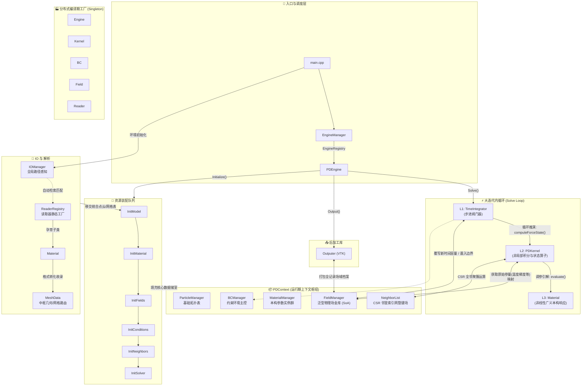

# GRPD (General Rectangular Peridynamics) 🚀

GRPD 是一个基于**现代 C++ (C++17)** 编写的高性能、高扩展性近场动力学 (Peridynamics) 求解引擎。目前主要实现了基于**非常规态基近场动力学 (NOSB-PD)** 的**各向同性热传导**求解。

本项目在架构设计上追求**极致的模块化与解耦**，核心模块全部遵循 **"接口驱动 + Registry (注册中心) + Factory (工厂) + Singleton (单例)"** 的工业级设计模式。

---

## 📌 版本更新日志

### v1.2 — 多格式网格支持与 NOSB 表面修正 (当前版本)

**1. MeshReader 网格读取子系统**
- 引入了解耦的 `MeshReader` 抽象接口与 `MeshData` 通用中间数据结构，彻底打通物质点云与未来 FEM 网格的底层数据通路。
- 新增 `ReaderRegistry`（单例工厂），通过宏 `REGISTER_READER` 支持编译期按文件后缀名（如 `.grpd`, `.inp`）全自动静态注册网格解析器。
- `IOManager` 现可自动扫描 工作目录 (Job Folder) 并匹配注册的最佳解析器实例。

**2. NOSB 表面体积修正与孤立粒子消除**
- **C++ 物理核**：在 `NOSB_Base` 中实现了基于实际邻域体积的表面修正因子（2D与3D通用），彻底解决了表面粒子因邻域截断导致的形状张量 $\mathbf{K}$ 不可逆/数值爆炸的经典表面效应缺陷。同时加入有效邻居数防跳闸保护（不足阈值直接降级单位阵）。
- **Python 预处理**：`generate_model.py` 中引入 Open3D `KDTreeFlann` 聚类检测机制，在网格生成阶段主动扫描并无情剔除自由飘散的极孤立粒子，从源头净化网格数据。

**3. 细节改进**
- `GRPD.log` 日志文件现置于 Job 文件夹的根层级，取消放入深层时间戳文件夹内，大幅提升调试便利性。

### v1.1 — 全局路径管理与工作流重构

- **新增 `IOManager` 模块**：基于单例模式接管全局输入输出路径管理，完全废除硬编码的配置文件指向。
- **全新算例运行方式**：取消基于启动参数的繁琐调用，用户只需将终端置于目标 Job 文件夹下（包含 `PD.yaml` 与 STL 几何），程序即可智能感知工作环境并寻找输入。
- **构建时间戳结果仓库**：每次运行的底层 VTK 算例都会安全归档于新生成的 `Result_YYYYMMDD_HHMMSS/` 内。

### v1 — 初始核心版本

- NOSB 架构抽象分离，多态核构建。
- Silling 等多种非常规零能模式校正式的精准落装。
- IO 输出机制与底层物理场数据流解耦。

---

## 🏗️ 核心架构与多态体系

整个项目包含 **8 大核心继承树体系**，它们通过编译期宏注册机制实现动态装配，从顶层引擎到底层计算模型新增任何功能**完全不需要修改控制流核心代码**。

### 1. ⚙️ 顶层引擎 (`Engine`)
统筹所有模块的生命周期（初始化、循环、步进、导出）。
- **基类**: `Engine` 
- **当前实现**: `PDEngine` (PD 求解专属)

### 2. 📁 IO 与解析体系 (`MeshReader` & `IOManager`)
负责全局路径寻址，并将复杂的输入文件流式转换为底层计算模块兼容的标准内存格式。
- **核心中间件**: `MeshData` (节点坐标、单元/粒子体积、材料划分的通用中间站容器)
- **多态解析库**: `MeshReader` (支持 Grpd, Inp 等格式的多态泛化读取)

### 3. ⏱️ 时间积分求解器 (`TimeIntegrator`)
掌管时间步进循环与状态量的时间显式/隐式积分迭代。
- **当前实现**: `ExplicitEuler` (显式欧拉时间积分)

### 4. 🌌 场生成器 (`PhysicsFields`) & 📊 物理场存储 (`Field`)
**场生成器**根据物理特权"声明需要什么数据"，**物理场存储**负责"底层内存如何进行非结构化连续分配"。
- **当前实现**: `ThermalFields` (自动生成 Temperature 等热流场)，基于 `TypedField<T>` 提供 SoA 高速裸指针存储。

### 5. 🔥 物理计算核 (`PDKernel`)
执行内循环中最为密集的核心数学与物理计算（形状张量、影响函数权重、零能防范、状态演化散度项等）。
- **NOSB 族底座**: `NOSB_Base` (处理纯几何、表面体积修正与零能稳定化防暴)
- **当前实现**: `NOSB_T` (非常规态基热传导微分方程积分算法内核)

### 6. 🧱 材料本构 (`Material`)
只负责且独立负责给物理核提供纯粹的物理属性系数与内部状态变量分配方案。
- **当前实现**: `FourierThermalMat` (傅里叶各向同性导热本构)

### 7. 🌡️ 边界条件 (`BC`)
作为外循环修正项，在特定的节点或边界上强行施加物理约束条件或额外源项流入。
- **当前实现**: `TemperatureBC` (固定面温度约束), `HeatFluxBC` (指定热通量边界), `ConvectionBC` (牛顿对流冷却体系)

---

## ⚡ 性能优化 (HPC)

由于 PD 算法的大规模 N-Body 属性，项目实施了以下几类极客级底部优化：

1. **完全的 OpenMP 多线程拓展**: 底层所有的沉重计算双向循环 (影响函数预组、形状张量求逆、边界条件施加、热量聚集与积分演化) 均由 `#pragma omp parallel for` 进行高并发指令分发。
2. **极速的连续内存访问 (SoA 范式)**: 彻底粉碎了附带重度拷贝与解引用的 `std::vector<Particle>` 经典面向对象模式；所有热计算路径所需极限量度全部萃取至 `FieldManager` 中统一接管，通过获取原始裸指针 `double*` 达到 100% 的 L1 缓存命中！
3. **零动态查表开销**: 摒弃在热流内部的多态跳转，对上万亿次吞吐的方法（例如 `GetInfluenceWeight` 核函数）直接通过硬编码 `inline + switch` 实施局部扁平化，引导编译器强行 SIMD 向量化展开。
4. **表面截断预修正与常驻内存**: 包含体积修正信息的 $\mathbf{K}^{-1}$ 与权函数 $\omega$ 仅在首遍静态网格上结算，然后将其绑定写入至 `NeighborList` 深度的结构化 CSR `BondField`；后验积分只读免算，兼顾完美边界效应消除并实现零延迟。

---

## 🎯 当前实现功能 (Features)

目前主要实现了 **各向同性热传导问题**，形成了非常规态基的完整求解链路闭环：
- **热传导本构模型**: 傅里叶定常导热 (`FourierThermalMat`)。
- **多类边界集齐**: 支持恒温固定保护 (Dirichlet)、指定热流散发流入 (Neumann)、自动对流环境冷却剥夺 (Robin)。
- **变尺度与无序网格支持**: 无死角兼容不等距微体单元（即局部加密网格）；不依赖正规阵列布局点。
- **全面核距调控**: 常数、线性、多阶多项式方程、反距离及高斯分布——统共支持达 7 种核函数控制阈值。
- **强悍零能模式惩罚控制**: 内建了依据加权体积补偿规则运行的沙漏振荡抑制器引擎，搭配表面缺失修正因子，无惧任何尖锐边界效应带来的数值灾难。
- **高端可视化渲染输出**: 运行成果全自动流水线输出最经典的 `.vtu` 拓展标准集，并随时间步序自生成帧集，开箱支持接入高端引擎 ParaView。

---

## 🚀 快速上手 (Setup & Trial)

### 1. 环境准备

本级算例附带极硬核的前处理脚本环境设定，建议准备以下配置：
- **Python 环境 (3.10 - 3.12)**: 用于处理大型 STL 切片预建模；必须。在官网下载安装时务必勾选 `Add python.exe to PATH`。预装关键依赖为：`pip install open3d numpy pyyaml pydantic`。
- **C++ 17 高层编译套件**: 推荐使用 [TDM-GCC](https://jmeubank.github.io/tdm-gcc/)，因其原生捆绑集成无痛版 OpenMP 多线程拓展支援。Visual Studio 2019/2022亦可极佳支持。

### 2. 克隆代码 (防坑提醒)

本项目集成了 `yaml-cpp` 和 `eigen` 等深度子模块环境，必须附加 `--recurse-submodules` 开启仓库群克隆操作：
```bash
git clone -b v1.1 --recurse-submodules https://github.com/Huckleberry-F/GRPD.git
cd GRPD
```

### 3. 配置与构建 (Build)

```bash
mkdir build && cd build
# 依据编译器，选用对应 Generator
cmake -G "MinGW Makefiles" ..   # (对于 Visual Studio 请仅输入: cmake ..)
cmake --build . --config Release -j 12
```

### 4. 点火运行！

凭借新一代 `IOManager` 的智能调度，用户终于告别了漫长而容易指偏的启动参数：

1. **前往计算工作间**: 控制台定向至你想处理数据的任意 Job 实验区目录下，例如：`cd GRPD\Examples\Plate`。
2. **执行建模 (产生网格体素)**: `PD.yaml` 就是全部设定书！直接敲击 `python ..\..\Generate_py\generate_model.py PD.yaml`，引擎脚本会自动将 STL 切片填充提炼，生成最终结构中间态：`{ModelName}.grpd`。
3. **求解引擎启动**: 直接空降调用刚刚编译出炉的核执行文件！例如：`D:\Project_C++\GRPD\bin\release\GRPD.exe`！
4. **审阅仿真奇观**: 安全停机后的完整热图时序切片已在当前工作间的 `Result_{系统时间戳}/` 内全部生成。开启 [ParaView](https://www.paraview.org/) 载入欣赏热力狂奔之美吧！

---

## 📋 模块完整性与路线图

### 全局架构总览



### 开发路线图 (按优先级)

| 优先级 | 模块 | 所在层级 | 极客寄语 |
|--------|------|--------|----------|
| 🔴 **P0** | `NOSB_Mechanical` | L2 Kernel | 【核心突破】彻底构建非局部力学变形梯度 $F$ 并将其压入非常规态基形状散度算子，接管机械力传递心脏！ |
| 🔴 **P0** | `MechanicalMaterial` (`LinearElastic`) | L3 Material | 将原本混沌的机械变形用应力法则赋予灵魂，完成广义胡克定律在积分球内的重建！ |
| 🟡 P1 | `MechanicalPhysicsFields` | PhysicsFields | 自动化开垦卸载强排型力场仓库柜 (`Displacement`, `Velocity`, `Acc`, `Force`) |
| 🟡 P1 | `Velocity-Verlet` | L1 Integration | 力学二阶常微分动态系统跨时域标配。 |
| 🟡 P1 | 力学系边界组群 | BC | 布设钳位夹持边界(`DisplacementBC`)以及冲量爆破加载群 (`ForceBC`) |
| 🟢 P2 | `ADR` 追踪器 | L1 Integration | 准静态算法王冠——用来消磨大变形、后屈曲下令人战栗的高频率弹性波残党震荡。 |
| 🟢 P2 | 塑性本构 `J2` | L3 Material | 碾碎纯弹性的禁锢，释放全金属在非线性不可逆变形路径下的刚度巨变潜能。 |
| ⚪ P3 | `ThermoMechanical` | L2 + L3 | 跨界霸主：冷热突变下的热应力涨缩与残余塑性发热狂潮混合闭环引擎构建！ |

> 👨‍💻 **当前总结**: 通过对核心 IO 解析分群、表面缺陷修正、节点孤岛预剔除等深海作业，目前温度拓扑传递核心已臻至无暇。全员武装完备，向 **大尺度固体力学核弹级分支（Mechanical Kernel）** 的进军号角已全线拉响！
