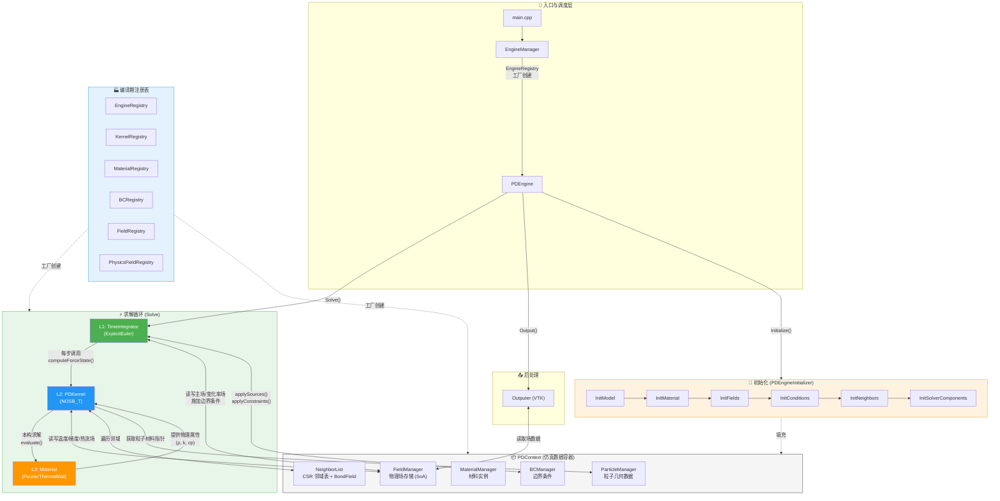

# GRPD (General Rectangular Peridynamics) 🚀

GRPD 是一个基于**现代 C++ (C++17)** 编写的高性能、高扩展性近场动力学 (Peridynamics) 求解引擎。目前主要实现了基于**非常规态基近场动力学 (NOSB-PD)** 的**各向同性热传导**求解。

本项目在架构设计上追求**极致的模块化与解耦**，核心模块全部遵循 **"接口驱动 + Registry (注册中心) + Factory (工厂) + Singleton (单例)"** 的工业级设计模式。

---

## 📌 版本更新日志

### v1.1 — 更新算例测试运行方式

**核心变更：IOManager 单例全局路径管理器**

- **新增 `IOManager` 模块** (`PDCommon/IO/`)：基于单例模式的全局输入输出管理器。程序启动时自动推导模型名称、定位配置文件、创建带时间戳的结果目录。
- **全新运行方式**：用户现在只需 `cd` 到任意 Job 文件夹（包含 `PD.yaml` + STL 文件），直接调用 exe 即可运行。无需再从 `build/` 目录启动。
- **时间戳结果管理**：每次运行自动创建 `Result_YYYYMMDD_HHMMSS` 文件夹，所有 VTK 输出和日志文件统一归档，便于追溯历史。
- **移除 `OutputGrpd` 字段**：`.grpd` 路径由 IOManager 从文件夹名自动推导，YAML 配置更简洁。
- **文件夹重组**：`Input/` → `Generate_py/`（内置 Python 脚本），新增 `Examples/` 目录存放算例模板。
- **2D/3D 维度感知形状张量**：`PDContext` 新增维度字段，`NOSB_Base` 对 2D 模型自动处理 `K(2,2)=1.0` 避免奇异。

### v1 — 初始版本

- NOSB 架构重构、多种零能模式修正、性能修复、废除冗余架构（详见下方）。

---

## 🏗️ 核心架构与多态体系

整个项目包含 **7 棵核心继承树**，它们通过编译期宏注册机制实现动态装配，从顶层引擎到底层计算模型新增任何功能**完全不需要修改控制流核心代码**。以下按照从宏观到微观 (自上而下) 的调用层级：

### 1. ⚙️ 顶层引擎 (`Engine`)

统筹所有模块的生命周期（初始化、循环、步进、导出）。

- **基类**: `Engine`
- **当前实现**: `PDEngine` (PD 求解专属引擎)

### 2. ⏱️ 时间积分求解器 (`TimeIntegrator`)

掌管时间步进循环与状态量的时间显式/隐式更新。

- **基类**: `TimeIntegrator`
- **当前实现**: `ExplicitEuler` (显式欧拉时间积分)

### 3. 🌌 场生成器 (`PhysicsFields`) & 📊 物理场存储 (`Field`)

**场生成器**负责根据物理问题"声明需要什么数据"，**物理场存储**负责"底层内存如何非结构化连续分配"。

- **基类**: `PhysicsFields` & `Field`
- **当前实现**: `ThermalFields` (自动生成 Temperature 等热流场)，配套使用 `TypedField<T>` 提供 SoA 热路径裸指针存储。

### 4. 🔥 物理核 (`PDKernel`)

执行内循环中最为密集的核心数学与物理计算（形状张量、影响函数权重、零能防范、状态演化散度项等）。

- **基类**: `PDKernel`
- **NOSB 族底座**: `NOSB_Base` (处理纯几何与稳定化支持)
- **当前实现**: `NOSB_T` (非常规态基热传导微分方程积分内核)

### 5. 🧱 材料本构 (`Material`)

只负责给物理核提供纯粹的物理属性系数与状态变量分配方案。

- **基类**: `Material` -> `ThermalMaterial`
- **当前实现**: `FourierThermalMat` (傅里叶各向同性材料)

### 6. 🌡️ 边界条件 (`BC`)

作为外循环修正项，在特定的节点边界上强行施加物理约束或额外源项。

- **基类**: `BC` -> `ThermalBC`
- **当前实现**: `TemperatureBC` (固定面温度), `HeatFluxBC` (指定热通量), `ConvectionBC` (牛顿冷却定律)

---

## ⚡ 性能优化 (HPC)

由于 PD 算法计算量巨大，本项目在实现上实施了以下底层优化：

1. **OpenMP 级并行**: 所有的底层计算循环 (影响函数预计算、形状张量、边界条件施加、热量积分) 均基于 `#pragma omp parallel for` 进行多线程加速。
2. **极速的数据访问 (SoA)**: 抛弃传统的 `std::vector<Particle>` 肥大对象模式，所有关键物理量全部萃取至 `FieldManager` 中成为连续内存块。热循环通过原始裸指针 `double*` 访问以确保缓存命中！
3. **零动态开销**: 多态设计仅在初始化 (`configure/initialize`) 以及大阶段 (`computeForceState`) 调用虚函数。对于百万级别调用的极热路径函数 (`GetInfluenceWeight`, `ComputeZeroEnergyModePenalty`)，采用**内联 (inline) + 局部 switch**，促使编译器实现极限展开与自动 SIMD 向量化。
4. **影响函数与空间截断预计算**: $K^{-1}$ 和影响函数权重 $\omega$ 在初始化阶段合并计算并绑定到 `BondField`。且引入了基于距离阈值的邻域刚性截断过渡项，在无形中修剪边界误差的同时保证热循环零判断开销。

---

## 🎯 当前实现功能 (Features)

目前项目主攻**热传导**问题，已实现完整的非常规态基功能闭环：

- **热本构模型**: 傅里叶各向同性热传导 (`FourierThermalMat`)。
- **丰富的边界条件**:
  - 第一类 (`TemperatureBC`): 恒定的固定温度。
  - 第二类 (`HeatFluxBC`): 给定热通量。
  - 第三类 (`ConvectionBC`): 对流热交换。
- **支持非均匀网格**: 底层积分完全基于粒子体积 (Volume) 与自动提取的局部特征尺寸 (dx)，无缝兼容局部网格加密与变大小时域/空域。
- **可选核函数 (Kernel)**: 支持 Constant, InverseDistance, Linear, Quadratic, Cubic, Quartic, Gaussian 共 7 种距离加权影响函数。
- **零能模式防范**: 实现了针对非常规态基数值震荡的零能惩罚修正 (Zero-Energy Mode Penalty)，目前默认支持基于加权体积积分的 Silling 修正方案。
- **输出格式**: 全面兼容 VTK 标准，直出支持 ParaView 各种高级体渲染与多场耦合过滤器的 `.vtu` 格式。

---

## 🚀 快速上手 (Setup & Trial)

### 1. 环境准备

本项目附带了用于 Windows 的一键环境配置与编译脚本 `setup_build.cmd`。如果你不想折腾命令行，在确保安装了基础工具后，直接双击该脚本即可完成 C++ 编译与 Python 核心依赖加载！

如果是纯手动安装，本项目需要 CMake、C++17 编译器以及用于预处理大型 STL 模型生成粒子点云的 Python 环境：

- **安装 Python (3.10 - 3.12)**:
  1. 访问 [Python 官方网站](https://www.python.org/downloads/)。
  2. 下载 Python 3.10 到 3.12 之间的任意稳定版 Windows 安装包。**千万不要使用任何处于预发布/极度前沿的 Python 试验版本（如 3.14），这些版本常常缺乏底层 C++ 加速库的预编译 Wheel，会导致致命的安装失败！**
  3. 运行安装程序，**务必在第一页底部勾选 "Add python.exe to PATH"**。
  4. 打开终端，配置物理前处理所必须依赖的高性能光线追踪三维处理库（Open3D 等）：
     `pip install open3d numpy pyyaml pydantic`
- **安装 Git**: 用于拉取代码库。
- **安装 C++ 工具链**:
  - **选项 A (推荐)**: TDM-GCC / MinGW-w64 (提供现代 GCC 编译器)。
  - **选项 B**: Visual Studio 2019/2022 (包含 MSVC 和 CMake)。

### 2. 克隆代码

打开终端 (Terminal) 或 PowerShell，使用 Git 克隆本项目的 `v1` 分支。**注意：本项目包含 yaml-cpp 和 eigen 子模块，必须添加 `--recurse-submodules` 参数**：

```bash
git clone -b v1 --recurse-submodules https://github.com/Huckleberry-F/GRPD.git
cd GRPD
```

*(如果克隆时忘记带参数，可在仓库拉取后运行 `git submodule update --init --recursive` 补充下载子模块)*

### 3. 配置与构建 (Build)

使用 CMake 进行项目的配置与编译。项目中已自带了用于数学计算的 Eigen3 库和解析 YAML 的 yaml-cpp 静态库。

```bash
# 1. 创建并进入构建目录
mkdir build
cd build

# 2. 生成构建系统文件
# -> 如果你使用的是 TDM-GCC (MinGW)，请指定生成器：
cmake -G "MinGW Makefiles" ..
# -> 如果你使用的是 MSVC (Visual Studio)，直接运行：
# cmake ..

# 3. 开始编译 (Release 模式获取最高性能)
cmake --build . --config Release
```

### 4. 试用流程 (Trial Run)

编译成功后，可执行文件会生成在 `bin/release/`（Windows）下。

1. **准备 Job 文件夹**：在任意位置创建一个文件夹作为你的 "Job"（可参考 `Examples/Plate/`）。文件夹内放入：
   - `PD.yaml` — 模型配置文件
   - `*.stl` — 几何文件（YAML 中 `Source` 引用的）

2. **运行求解器**：
   ```powershell
   # 在终端中 cd 到 Job 文件夹
   cd D:\MyJobs\Plate

   # 直接调用 exe（IOManager 自动推导所有路径）
   D:\Project_C++\GRPD\bin\release\GRPD.exe
   ```

3. **查看结果**：
   程序运行后，会在 Job 文件夹内自动创建 `Result_YYYYMMDD_HHMMSS/` 时间戳目录，所有 VTK 结果和日志文件均在其中。
   - 下载并安装开源数据可视化软件 [ParaView](https://www.paraview.org/)。
   - 在 ParaView 中打开 `Result_*/` 目录下的 `.vtk` 文件，即可渲染温度场等结果！

---

## ✨ v1 版本更新说明

- **NOSB 架构重构**: 抽象出通用的 `NOSB_Base` 处理纯几何形状张量、零能修正与内核函数，并实现第一个派生类 `NOSB_T`。
- **多种零能模式修正式**: 在 `NOSB_Base` 框架中正式引入 Silling, Wan, Zhang 等多种零能纠正策略，由 YAML 枚举项动态指定，且使用加权体积进行精准修正。
- **性能修复**: 回退可能阻断 OMP 与 SIMD 分支预测的多态影响函数计算，将其压入内联函数体系中完美保证底层循环纯净。
- **废除冗余架构**: 由于 `FieldManager` 的完美接管，旧版用于分离 Particle 数据的 `DataExtractor` 获取方式已废弃，真正达成数据彻底解耦！

---

## 📋 模块完整性与路线图

### 全局架构总览



**说明**：程序并非只有「三层」，**三层多态 (L1/L2/L3)** 是指求解循环内部的调用链。完整架构还包括：

- **入口调度层**：`EngineManager` 通过 `EngineRegistry` 工厂创建具体引擎（如 `PDEngine`）
- **初始化层**：`PDEngineInitializer` 按 6 步依次建模、分配材料、注册场、加载边界条件、构建邻域、创建求解组件
- **数据容器层**：`PDContext` 统一持有 `ParticleManager`、`FieldManager`、`MaterialManager`、`BCManager`、`NeighborList`
- **求解循环层**：L1 时间积分器驱动 L2 PD 核心积分，L2 调用 L3 本构计算；同时 L1/L2 分别与 `FieldManager`、`BCManager`、`NeighborList` 交互
- **注册表体系**：所有核心模块均通过编译期静态注册实现零耦合扩展

### 各层已有实现 vs 缺失模块

#### L1 — 时间积分器 (`Src/Integration/`)

| 模块 | 状态 | 说明 |
|------|------|------|
| `TimeIntegrator` (基类) | ✅ 已完成 | 抽象接口，定义 `run()` |
| `ExplicitEuler` | ✅ 已完成 | 显式前向 Euler，支持多场积分目标 |
| `ADR` (自适应动态松弛) | ❌ 缺失 | 静态/准静态力学求解必需 |
| `Velocity-Verlet` | ❌ 缺失 | 显式动力学（力学二阶 ODE）常用 |

#### L2 — PD 积分核心 (`PDCommon/Kernel/`)

| 模块 | 注册键 | 状态 | 说明 |
|------|--------|------|------|
| `PDKernel` (基类) | — | ✅ 已完成 | 纯虚接口 |
| `NOSB_Base` (中间基类) | — | ✅ 已完成 | 形状张量 K⁻¹、影响函数、零能修正 |
| `NOSB_T` (热传导) | `NOSB_Thermal` | ✅ 已完成 | 非局部温度梯度 + 散度积分 |
| `NOSB_M` (力学) | `NOSB_Mechanical` | ❌ 缺失 | 变形梯度 F → 应力 → 力散度 |
| `BB_Elastic` | `BB_Elastic` | ❌ 缺失 | 键基弹性力学 |
| `BB_Thermal` | `BB_Thermal` | ❌ 缺失 | 键基热传导 |

#### L3 — 材料本构 (`PDCommon/Material/`)

| 模块 | 状态 | 说明 |
|------|------|------|
| `Material` (基类) | ✅ 已完成 | 抽象接口 |
| `ThermalMaterial` → `FourierThermalMat` | ✅ 已完成 | 各向同性傅里叶导热 |
| `MechanicalMaterial` (力学中间基类) | ❌ 缺失 | 应提供 `computeStress(F)` 接口 |
| `LinearElastic` | ❌ 缺失 | 各向同性线弹本构 |
| `J2Plasticity` | ❌ 缺失 | J2 弹塑性本构 |

#### 支撑模块

| 模块 | 状态 |
|------|------|
| `FieldManager` / `FieldRegistry` / `PhysicsFieldRegistry` | ✅ 已完成 |
| `BCManager` / `BCRegistry` | ✅ 已完成 |
| `NeighborList` (CSR 格式 + BondField) | ✅ 已完成 |
| `ParticleManager` / `PDContext` | ✅ 已完成 |
| `MaterialManager` / `MaterialRegistry` | ✅ 已完成 |
| `KernelRegistry` / `EngineRegistry` | ✅ 已完成 |
| `IO` (GrpdReader / Outputer / IOManager) | ✅ 已完成 |

### 开发路线图 (按优先级)

| 优先级 | 模块 | 所在层 | 理由 |
|--------|------|--------|------|
| 🔴 P0 | `NOSB_Mechanical` (NOSB 力学核) | L2 Kernel | 项目最核心需求——力学求解 |
| 🔴 P0 | `MechanicalMaterial` + `LinearElastic` | L3 Material | 力学核心的本构依赖 |
| 🟡 P1 | `MechanicalPhysicsFields` | PhysicsFields | 力学场自动注册 (Displacement, Velocity, Force) |
| 🟡 P1 | `Velocity-Verlet` 积分器 | L1 Integration | 力学二阶 ODE 必需 |
| 🟡 P1 | 力学边界条件 (`DisplacementBC`, `ForceBC`) | BC | 位移约束与外力 |
| 🟢 P2 | `ADR` 准静态积分器 | L1 Integration | 静态力学问题 |
| 🟢 P2 | `BB_Elastic` / `BB_Thermal` 键基核 | L2 Kernel | 键基理论实现 |
| 🟢 P2 | `J2Plasticity` 弹塑性本构 | L3 Material | 非线性材料行为 |
| ⚪ P3 | 热力耦合 (`ThermoMechanical`) | L2 + L3 | 多物理场耦合 |
| ⚪ P3 | 断裂判据 + 裂纹扩展 | Kernel 内部 | PD 特色破坏力学功能 |

> **当前状态**: 热传导求解链路已完整闭环 (`ExplicitEuler → NOSB_T → FourierThermalMat`)，下一步最关键的工作是补全力学求解链路。
