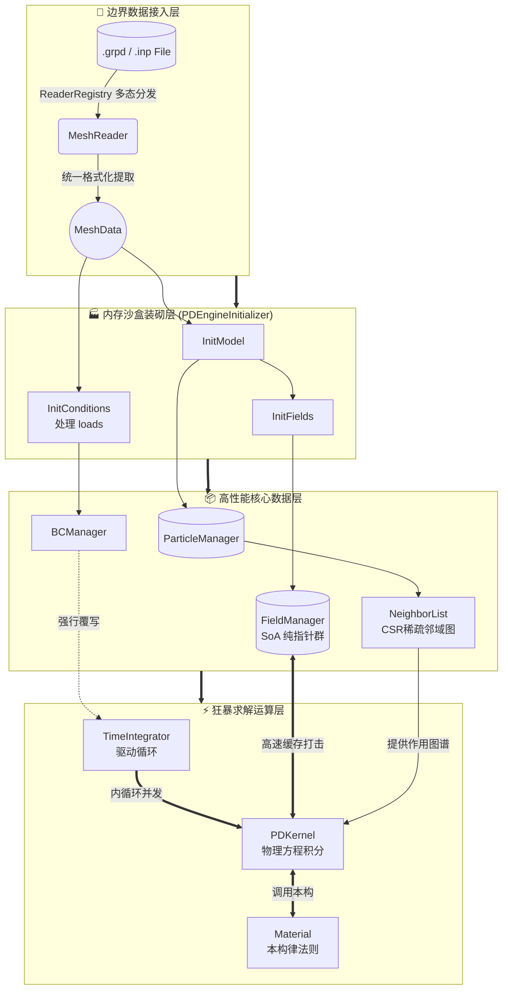

# GRPD (General Rectangular Peridynamics) 🚀

GRPD 是一个基于**现代 C++ (C++17)** 编写的高性能、高扩展性近场动力学 (Peridynamics) 求解引擎。目前主要实现了基于**非常规态基近场动力学 (NOSB-PD)** 的**各向同性热传导**求解。

本项目在架构设计上追求**极致的模块化与解耦**，核心模块全部遵循 **"接口驱动 + Registry (注册中心) + Factory (工厂) + Singleton (单例)"** 的工业级设计模式。

---

## 📌 版本更新日志

### v1.3 — 彻底纯化 IO 多态架构 (当前版本)
- **剔除遗留工具类**：完全删除了早期的硬编码神器 `GrpdReader`。
- **解析逻辑内聚**：所有的文件解析操作（状态机、行分割）已完美融入 `GrpdMeshReader` 派生类实体中，实现了读取器的彻底自洽。
- **提炼通用数据结构**：分离出 `MeshData` 静态数据泵方法，专门负责将格式无关的数据结构归一化并源源不断地压入底层的 `ParticleManager` 和 `FieldManager` 中。

### v1.2 — 多格式网格支持与 NOSB 表面修正
- **MeshReader 体系**：引入了 `MeshReader` 抽象接口与 `MeshData` 通用中间数据结构。通过 `ReaderRegistry`（单例工厂）宏注册机制，支持按文件后缀名全自动静态注册网格解析器。
- **NOSB 表面体积修正**：实现了基于实际邻域体积的表面修正因子，解决表面粒子因邻域截断导致的形状张量 $\mathbf{K}$ 不可逆缺陷，并加入孤立粒子防跳闸保护。
- **孤岛切除手术**：预处理脚本当中引入 Open3D 空间结构树聚类扫描，前置过滤并抹除脱离大部队的游离死点。

### v1.1 — 全局路径管理与工作流重构
- **智能上下文**：`IOManager` 单例接管全局路径，废除硬编码配置文件。用户在终端任意位置挂载 `PD.yaml` 即可唤醒程序。
- **自动化结果归档**：建立 `Result_YYYYMMDD_HHMMSS/` 时间戳仓库机制。

### v1.0 — 初始核心版本
- NOSB 架构抽象分离，多态核构建。
- Silling 等多种非常规零能模式校正式的精准落装。

---

## 🏗️ 核心架构体系深入剖析

GRPD 在架构思路上，彻底摒弃了传统面向对象中“一个超级大对象管到底”的面条代码，而是实施了极致的**分层解耦**和**数据驱动**。

整个项目按照数据和控制的流向，切分为以下四大层级领域：

### 1. 📂 边界数据接入层 (IO Gateway)
本层是外界数据进入内存宇宙的唯一关隘。
- `IOManager`：总揽全局的雷达系统。它侦测工作目录、指明 `PD.yaml`、STL 与 `.grpd` 的位置。
- `ReaderRegistry` & `MeshReader`：**多态翻译官**。任何外部文件格式（.grpd, .inp），都能在这里找到它的专属解码派生类，且无需修改核心源码。
- `MeshData`：**万能中转站**。无论外界是点云还是 FEM 网格，读进来统统塞进这个标准扁平化的数据中枢大厅，供下游随意取用。

### 2. 🏭 内存沙盒装砌层 (Assembly Factory)
`PDEngineInitializer` 在第一步接管大局，它是掌控从混乱走向秩序的上帝之手：
- `InitModel`：抽取 `MeshData` 并注入 `ParticleManager`。这是归一化步骤，将世界统一定义为无连接的散点池。
- `InitMaterial`：给各个点注入物理灵魂属性。
- `InitFields`：**大动脉开辟**。从 `PhysicsFieldRegistry` 获取场清单，并在 `FieldManager` 中分配百万级别的连续存储空间。
- `InitConditions`：读取 `MeshData.loads`，转化为约束实体锁链。
- `InitNeighbors`：计算构建并拉网形成百万级的 CRS 稀疏邻里映射表 `NeighborList`。

### 3. 📦 高性能核心数据层 (Data Core)
这是整个游戏的心脏数据仓库。PD 最大的敌人是内存跳跃，这里实现了**从 AoS 向 SoA（结构体数组转数组结构体）的极致革命**。
- `PDContext`：上下文收纳盒。
- `ParticleManager`：保留最基础的点拓扑学特征表。
- **`FieldManager`（绝对核心）**：摒弃对象的封装幻觉，直接掌管成吨的 `double*` 裸指针连续大数组（如 Coords、Volume、Temperature）。这些大数组是喂给 L1 缓存狂飙突进的终极炮弹。

### 4. ⚡ 狂暴求解运算层 (Solve Engine)
数据集结完毕后，进入疯狂的时域迭代大回环！
- `TimeIntegrator (ExplicitEuler)`：节拍器，推动时间滚轮，执行外层状态更新与边界条件压制。
- `PDKernel (NOSB_Base & NOSB_T)`：**核心公式撕裂者**。在这个双层遍历深渊里，计算影响函数、组装形状张量、展开非局部积分与零能惩罚散度。
- `Material (FourierThermalMat)`：计算法则裁定者。在极小尺度下裁决节点间状态演化的热力学响应定律。

### 🛠️ 工作流图示



---

## ⚡ 性能优化与 HPC 技艺

1. **全面并发 (OpenMP)**: 底层所有沉重计算的双向循环均由 `#pragma omp parallel for` 进行高并发指令分发。
2. **纯血 SoA 内存连续化**: 通过 `FieldManager` 统一接管连续大数组，对算法核心层暴露出原始 `double*`，换取 L1 缓存的极致利用率，粉碎传统大对象包裹带来的解引用开销。
3. **消除动态虚表分派**: 大规模密集的频繁调用（如核距和影响系数），转为硬编码的偏特化匹配；避免多态成本阻断流水线。
4. **表面截断预修正驻留**: 复杂的 $K^{-1}$ 形状张量和修正系数全部在 `Init` 阶段单次压制到邻域 CSR 的伴随 BondField 储存空间中。狂暴的计算态只需只读免算。

---

## 🚀 快速上手 (Setup & Trial)

### 1. 环境准备
- **Python (3.10+)**: 必须拥有 `pip install open3d numpy pyyaml pydantic`。
- **C++ 17 编译器**: 推荐采用带有原生 OpenMP 的 TDM-GCC 或 Visual Studio 2019/2022+。

### 2. 获取代码 (含有子模块！)
必须带上 `--recurse-submodules` 指令拉取依赖！
```bash
git clone -b v1.1 --recurse-submodules https://github.com/Huckleberry-F/GRPD.git
cd GRPD
```

### 3. 构建编译
```bash
mkdir build && cd build
cmake -G "MinGW Makefiles" ..   # (Visual Studio 用户只需 cmake ..)
cmake --build . --config Release -j 12
```

### 4. 点火运行！
1. 你的终端 `cd` 到任意有业务资料的目录，如 `cd Examples\Plate`
2. 根据参数设定文件 `PD.yaml` 打造点云世界：`python ..\..\Generate_py\generate_model.py PD.yaml` 
3. 一键出鞘，执行计算引擎：`..\..\bin\release\GRPD.exe`
4. 爽快结算，目录里新增加的 `Result_XXXXXX/` 就是最终答卷，拖进 ParaView 尽情赏析。

---

## 📋 功能演进与未来路线

| 优先级 | 模块核心靶向 | 开发状态 |
|--------|--------------|----------|
| 🟢 P0 | **NOSB 核心架构分离重组，纯净热传导系统贯通** | ✅ 完成 |
| 🟢 P1 | **IO 解析多态架构重建，格式归一化清洗** | ✅ 完成 |
| 🔴 P1 | `NOSB_Mechanical` 与 `LinearElastic` **(力学心脏植入)** | 🏃 进行中 |
| 🟡 P2 | 力学物理场 (`Displacement`, `Velocity`) 与动力学 `Velocity-Verlet` | 待启 |
| 🟡 P2 | 位移锁喉和动量冲击边界 (`DisplacementBC`, `ForceBC`) | 待启 |
| ⚪ P3 | `ThermoMechanical` 跨界大一统：冷热热应力耦合狂潮 | 待启 |
| ⚪ P3 | `ADR` 动能衰减减震系统以及强非线性 `J2` 塑性本构 | 待启 |

> 👨‍💻 **领航员简报**: 我们刚刚在版本 `v1.3` 中对老旧的僵化代码进行了粉碎性的解耦革命。彻底分离的文件分析器与高度标准化的 `MeshData` 中转池不仅确保了热核系统的澄澈，更是打造出了足以支撑未来巨大扩展的强固地基。现在，向着深沉且艰难的大位移与形变领域的进军钟声，已经敲响！
