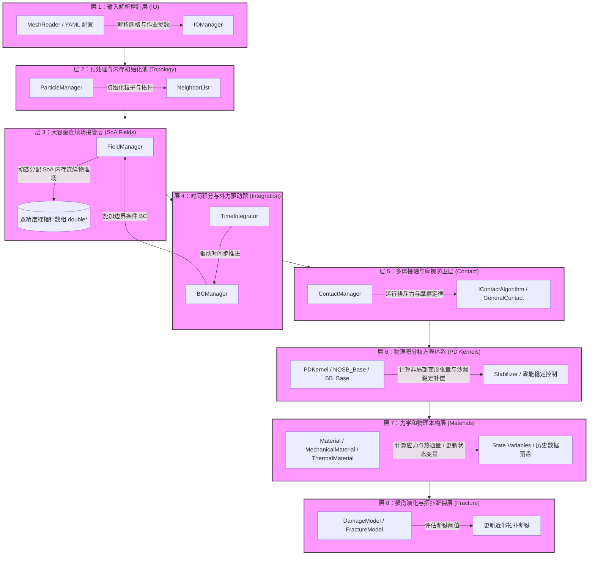
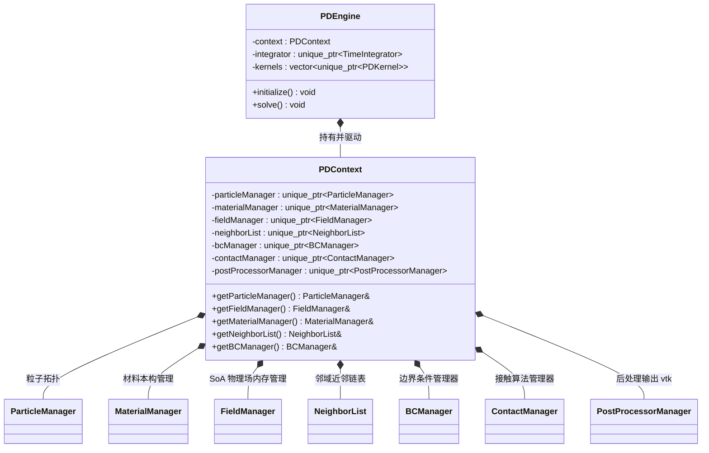
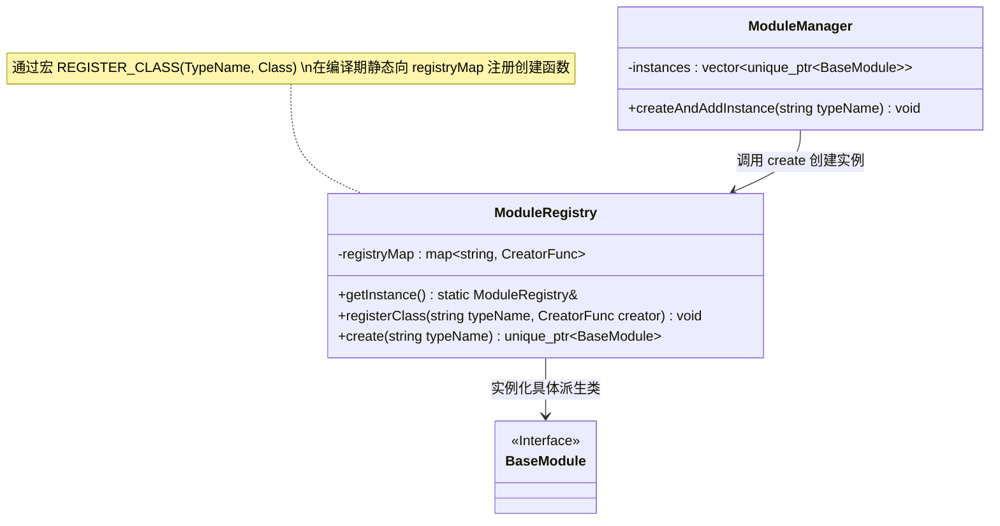
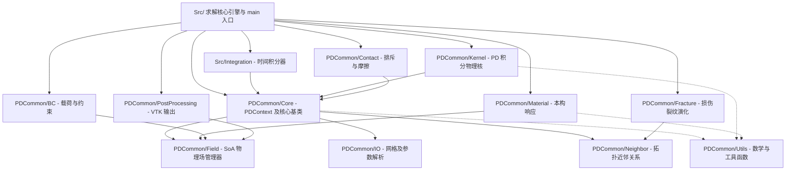

# GRPD 项目关系图与架构说明

本文档基于 `codegraph` 的静态代码分析与检索结果，详细梳理了 GRPD (General Peridynamics Solver) 项目的架构设计与核心关系图。图表采用 Mermaid.js 格式绘制，主要展示了求解器的 **8层计算管线**、**核心类继承体系**、**PDContext 数据中枢**、**注册表与工厂单例模式** 以及 **模块间依赖方向**。

---

## 1. 8层计算管线执行流图

根据 `AGENTS.md` 的规范，GRPD 求解器在运行期间遵循严格的 8 层物理执行与内存隔离体系。以下是该计算管线的具体调用流向及各层对应的核心模块与类：

---

## 2. 核心类继承体系图

GRPD 基于 C++17 构建，大量使用面向对象的多态机制来实现求解器各组件的灵活插拔。以下是核心接口与其具体派生类的继承树：

```mermaid
classDiagram
    %% PDKernel 体系
    class PDKernel {
        <<Abstract>>
        +computeForces() void*
        +initialize() void*
    }
    class BB_Base {
        <<Abstract>>
        comment: 键基近场动力学基类
    }
    class NOSB_Base {
        <<Abstract>>
        comment: 非常规态基近场动力学基类
    }
    PDKernel <|-- BB_Base
    PDKernel <|-- NOSB_Base
    NOSB_Base <|-- NOSB_M : 力学态基
    NOSB_Base <|-- NOSB_T : 热学态基
    NOSB_Base <|-- NOSB_Axis : 轴对称态基

    %% Material 本构体系
    class Material {
        <<Abstract>>
        +allocateStateVariables(FieldManager&) void*
        +updateMaterialResponse() void*
    }
    class MechanicalMaterial {
        <<Abstract>>
    }
    class ThermalMaterial {
        <<Abstract>>
    }
    Material <|-- MechanicalMaterial
    Material <|-- ThermalMaterial
    MechanicalMaterial <|-- LinearElasticMat : 线性弹性
    MechanicalMaterial <|-- J2PlasticityMat : J2 塑性
    MechanicalMaterial <|-- J2VoceLemaitreMat : 隐式 Lemaitre 塑性损伤
    MechanicalMaterial <|-- CreepMaterialBase : 蠕变基类
    ThermalMaterial <|-- FourierThermalMat : 傅里叶热传导

    %% TimeIntegrator 时间积分器体系
    class TimeIntegrator {
        <<Abstract>>
        +integrateStep() void*
    }
    TimeIntegrator <|-- ExplicitEuler : 显式欧拉
    TimeIntegrator <|-- CentralDifference : 中心差分
    TimeIntegrator <|-- ADR_Integrator : 自适应动态弛豫
    TimeIntegrator <|-- StaggeredIntegrator : 温度-力学交替积分

    %% BC 边界条件体系
    class BC {
        <<Abstract>>
        +apply(double time) void*
    }
    class MechanicalBC {
        <<Abstract>>
    }
    class ThermalBC {
        <<Abstract>>
    }
    BC <|-- MechanicalBC
    BC <|-- ThermalBC
    MechanicalBC <|-- DisplacementBC : 位移约束
    MechanicalBC <|-- BodyForceBC : 体力载荷
    MechanicalBC <|-- VelocityBC : 速度载荷
    ThermalBC <|-- TemperatureBC : 温度约束
    ThermalBC <|-- HeatFluxBC : 热通量载荷
    ThermalBC <|-- ConvectionBC : 对流边界

    %% FractureModel 损伤断裂体系
    class FractureModel {
        <<Abstract>>
        +evaluateBondStatus() void*
    }
    FractureModel <|-- BondStretchFracture : 键伸长量阈值
    FractureModel <|-- EqPSFracture : 等效塑性应变阈值
    FractureModel <|-- DamageValueFracture : 状态量损伤值阈值

    %% MeshReader 读网格体系
    class MeshReader {
        <<Abstract>>
        +readMesh(string path) MeshData*
    }
    MeshReader <|-- GrpdMeshReader : GRPD 原生格式
    MeshReader <|-- InpMeshReader : ABAQUS INP格式
```

---

## 3. PDContext 核心数据中枢关系图

`PDContext` 是 GRPD 的核心数据总线，它持有计算所需的所有管理器 (Managers)、场 (Fields) 和拓扑拓扑关系。所有模块通过传递 `PDContext` 的引用来实现解耦协作，而不需要全局直接依赖求解器核心。

---

## 4. 注册表与工厂单例模式

GRPD 使用了编译期静态注册与反射机制。每新增一个材料、算法或内核，只需通过对应的宏注册到各自的 `Registry` 中。`Manager` 会通过字符串标识从 `Registry` 动态实例化具体子类。

项目中具体包含以下注册表单例（均遵循上述设计模式）：
- `EngineRegistry` (负责求解引擎的选择，如 `"PD"`)
- `KernelRegistry` (负责物理积分核，如 `"NOSB_M"`, `"BB_Base"`)
- `MaterialRegistry` (负责材料本构选择，如 `"LinearElastic"`)
- `TimeIntegratorRegistry` (负责时间积分选择，如 `"ADR"`)
- `BCRegistry` (负责边界条件分配)
- `FieldRegistry` / `PhysicsFieldRegistry` (负责物理场及状态变量生成)
- `ContactRegistry` (负责接触与排斥算法选择)
- `StabilizerRegistry` (负责零能控制稳定器，如 `"Zhang"`, `"Wan"`)
- `FractureRegistry` (负责损伤断裂模型选择)
- `ReaderRegistry` (负责网格解析器分配)

---

## 5. 模块间依赖方向图 (PDCommon 拓扑)

为了保持求解器的结构清晰，`PDCommon` 内部模块均保持了高度的解耦。其依赖关系呈现自上而下的单向拓扑结构，严禁反向强耦合：

