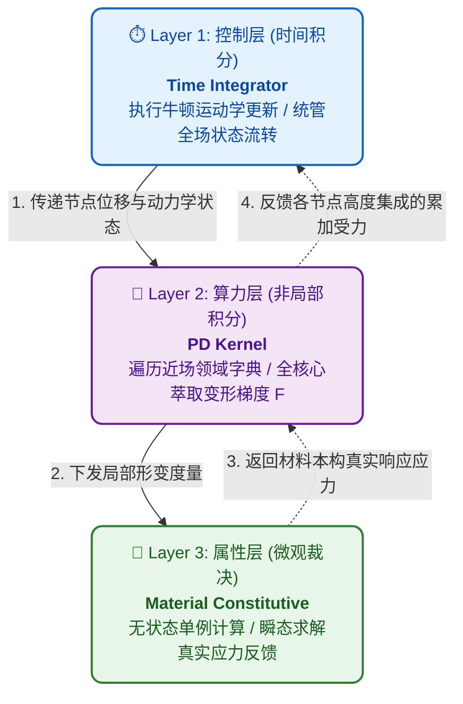

# 🚀 GRPD 引擎核心架构讲解

### 面向高性能多物理场计算的纯粹底层与模块解耦

欢迎查看这份幻灯片。
这里为您梳理了 General Peridynamics 项目中**强制解耦的三层体系**及其**物理流转机制**。

> 👨‍💻 **架构金律**: 代码设计应如其推导的微分方程自身一样——严密、纯粹且绝不多做一毫不相干的事。

---

# 三层强制解耦体系

项目的计算核心逻辑被严格划分为互不可见的三层：**控制（时间积分）**、**算力（拓扑运算）**、与**属性（材料本构）**。

---

# 🛡️ 架构层级之间的边界协议

### ⏱️ Layer 1: 时间推进 (TimeIntegrator)

我不关心你在算什么物理场（力或热），我也不知道什么是材料。
**我只负责：**

- 推进 `dt`，执行简单的牛顿运动学更新 ($x += v\cdot dt$)。
- 按时给各个点位加减外界约束与力场（Dirichlet、BodyForce）。

---

### 🧩 Layer 2: 并发积分核 (PDKernel)

我不在乎你是欧拉前向还是中心差分，我也不关心这是铁还是铝。
**我只负责：**

- 遍历拓扑邻居字典，全核心发动算力去萃取变形梯度 $\mathbf{F}$ 和非局部空间信息。
- 把算完的变量下放给下边，等他们告诉我应力，我再聚合成受力。

### 🧱 Layer 3: 本构层 (Material)

我不知道什么是“粒子对象”，也没听说过什么“搜索半径”。
**我只负责：**

- 给我一个张量，我还你一个包含连续介质力学的应力本构反应。

---

# 🏗️ 动态管线：引擎 8 层执行体系 (1/2)

> 引擎大循环在时间轴上呈现**“线性初始化 + 嵌套高频循环计算”**的混合结构。

**纯线性单次流水 (初始化)**

1. **输入解析层 (IO Gateway)**：`IOManager` 自动提取脱水数据结构。
2. **内存初始化池 (Init Pool)**：数据粒子化，压紧建立数以百万计的邻域拓扑映射表。
3. **连续场大动脉 (Core Fields)**：开辟巨量 `double*` SoA 内存连续存储场域变量。

**时间轴循环主控 (Master)** 4. **积分驱动器 (Time Integrator)**：托管主循环，下发边界约束，按序唤醒执行 5-8 层。

---

# 🏗️ 动态管线：引擎 8 层执行体系 (2/2)

**嵌套高频循环计算（被第 4 层无脑顺序调度）**

5. **多体接触防卫层 (Contact Mechanics)**
   基于哈希网格探测互穿量，投射强大的排斥与摩擦力，确保刚体隔离。
6. **物理积分核深渊 (Physics Kernel)**
   并发提取非局部空间变形梯度，精确求逆形状张量，计算广义状态力。
7. **微观本构裁决官 (Material Constitutive)**
   基于张量输入，极速查询并返回连续介质力学的本构与热通量响应。
8. **损伤与断裂判定 (Damage Fracture)**
   提取最新应力态评估断键阈值，彻底改变局部拓扑与材料死生。

---

# 💡 架构哲学：流水线与兵器库的完美互锁

在讲解整个 GRPD 时，可以清晰划分为横竖两面：

- **静态能力兵器库（多态矩阵）**：回答*“这套系统目前能解什么物理问题？”*
- **动态内核流水线（8层体系）**：回答*“这套系统底层如何按时序流转？”*

> **十字交叉：** 8 层流水线骨架在 C++ 中定义了极其死板的“抽象基类插槽”。而多态矩阵，就是运行时根据 `PD.yaml` 装填进去的“插件弹药”。
> 例如，流水线第 7 层只会无脑调用 `MaterialBase->computeForce()`，而真正执行定律的，是多态矩阵里的 `J2Plasticity`！
> **结论：流水线骨架永远不变（极具稳定性），兵器库无限扩充（极具扩展性）。**

# 🛠️ 模块化拓展与单例注册流

> 💡 **多层解耦不仅是设计选项，而是纪律！** 开发者进行功能延伸时必须遵循这三大模式：

- **Registry（注册表）**: 使用底层宏 `REGISTER_MATERIAL("Type", MyClass)` 编译期注入字典。
- **Factory（工厂）**: 程序将自动从 `PD.yaml` 读取字符匹配，然后构建 `unique_ptr` 智能基类指针。
- **Manager（容器库）**: 以 `MaterialManager` 为首的容器不负责生产，只负责在内存中纯粹地保管它们并执行调配。

> **坚持数据驱动：消灭指针追逐，保持 L1 CACHE 命中率。坚守 `double*` 一级访问。**

---

# 🧩 引擎全域多态注册矩阵 (1/2)

依托于底层 Registry 架构，这是 GRPD 无限扩充的“静态能力兵器库”。

### 💾 网格解析与场发生器 (IO & Fields)

- **`GrpdMesh / InpMesh`**：多态支持点云或商用 Abaqus INP 四面体/六面体脱水。
- **`Mechanical / Thermal`**：根据物理类型，多态化开辟并注册对应的位移场或温度场。

### ⏱️ 时间演化与控制 (Time Integrator)

- **`ExplicitEuler`**：显式前向欧拉法，处理一阶热传导、物质扩散推进。
- **`CentralDifference`**：显式二阶中心差分法，处理冲击、破甲等高速显式动力学。
- **`ADR`**：自适应动态弛豫法，引入基于速度的虚拟阻尼，强力镇压动能以求取准静态与结构静力学稳态收敛。
- **`StaggeredIntegrator`**：交错积分器，原生支持多物理场（力/热）异阶时间步耦合推进。

### ⚙️ 并发近场积分核 (PDKernel)

- **`NOSB_M`**：力学非常规态基，完美消除大旋转伪应力，支持三维/二维等效降维积分。
- **`NOSB_T`**：热传导态基，提供基于非局部温度梯度提取的连续介质级热通量积分。

---

# 🧩 引擎全域多态注册矩阵 (2/2)

### 🧱 材料与本构库 (Material)

- **`LinearElastic`** (弹性)：小变形/大旋转圣维南线弹性。
- **`J2Plasticity`** (金属塑性)：经典的 Von-Mises 流动塑性与径向返回。
- **`JCPlasticity`** (军工级强塑性)：支持高应变率、热软化耦合的 Johnson-Cook 动力学本构。
- **`FourierThermal`** (热传导)：标准傅里叶导热本构。

### 💥 损伤断裂与惩罚防御 (Fracture & Stabilizer)

- **断裂防卫网**：`BondStretchFracture` (纯伸长拉断), `EqPSFracture` (等效塑性应变破坏), `DamageValueFracture` (复合三轴度动态毁伤)。
- **零能抑制器 (Stabilizer)**：`Zhang` (高性能张量投影), `Wan` (四阶张量缩并), `Silling` (经典标量力补偿)。

---

# ⚔️ 高级物理边界与多体接触体系

除了内核运算，引擎周围还挂载着高度自治的多体环境约束体系：

### 🛑 边界条件群 (Boundary Conditions)

支持针对局部零件/点群的混合时间幅值调制（坡道/阶跃）：

- **力学载荷**：`DISP` (位移锁死), `VELOCITY` (速度驱动), `BODY_FORCE` (彻体力), `PRESSURE` (边界正压强)。
- **热学载荷**：`TEMPERATURE` (恒温壁面), `HEAT_FLUX` (定向热流)。

### 🛡️ 高能接触网络 (Contact Mechanics)

剥离自空间网格探测的 MPM 式通用接触池：

- **`Kinematic`**：质心速度投影干涉，附带高能阻尼耗散，专治飞溅跳弹与防过冲。
- **摩擦体系**：原生附带纯正的非背景库仑滑动摩擦机制 ($F_f = \mu F_n$)。
- **`Penalty / NTN / NTS`**：点对面罚函数斥力阵列，支持 `Pinball` 拓扑锚定，实现稳固防穿模。

---

# 📸 工业级仿真成果演示：侵彻与断裂

 

_左：NTS 接触下硬弹体引发的脆性大面积崩塌；右：JC 本构下的高爆延性撕裂与穿甲_

---

# 📸 工业级仿真成果演示：生物力学

_非常规态基近场动力学 (NOSB-PD) 模拟的长骨三点弯曲与动态脆性断裂过程（ParaView 渲染）_
