# 🚀 GRPD 引擎核心架构讲解

### 面向高性能多物理场计算的纯粹底层与模块解耦

欢迎查看这份幻灯片。
这里为您梳理了 General Peridynamics 项目中**强制解耦的三层体系**及其**物理流转机制**。

> 👨‍💻 **架构金律**: 代码设计应如其推导的微分方程自身一样——严密、纯粹且绝不多做一毫不相干的事。

---

# 三层强制解耦体系

项目的计算核心逻辑被严格划分为互不可见的三层：**控制（时间积分）**、**算力（拓扑运算）**、与**属性（材料本构）**。

---

# 🛡️ 架构层级之间的边界协议

### ⏱️ Layer 1: 时间推进 (TimeIntegrator)
我不关心你在算什么物理场（力或热），我也不知道什么是材料。
**我只负责：**
- 推进 `dt`，执行简单的牛顿运动学更新 ($x += v\cdot dt$)。
- 按时给各个点位加减外界约束与力场（Dirichlet、BodyForce）。

---

### 🧩 Layer 2: 并发积分核 (PDKernel)
我不在乎你是欧拉前向还是中心差分，我也不关心这是铁还是铝。
**我只负责：**
- 遍历拓扑邻居字典，全核心发动算力去萃取变形梯度 $\mathbf{F}$ 和非局部空间信息。
- 把算完的变量下放给下边，等他们告诉我应力，我再聚合成受力。

### 🧱 Layer 3: 本构层 (Material)
我不知道什么是“粒子对象”，也没听说过什么“搜索半径”。
**我只负责：**
- 给我一个张量，我还你一个包含连续介质力学的应力本构反应。

---

# 🏗️ 引擎起飞大循环：六大生命周期

1. **输入解析（IO Gateway）**
   `IOManager` + `MeshReader` 撕裂模型，生成最纯净的脱水数据结构。
2. **初始化缓冲池（Init Pool）** 
   将数据粒子化，开辟并压缩百万级的邻域拓扑映射表。
3. **连续场大动脉（Core Fields）**
   巨量的 `double*` SoA 内存连续存储托举数据。
4. **时间管理（Integrators）**
   准备大循环，如 100,000 步并行差分。
5. **计算深渊（Kernel Arrays）** 
   全面调取矩阵算力进行全积分，引入并发空间，执行影响函数和惩罚项。
6. **局部裁决（Constitutives）** 
   材料瞬时极速计算。

---

# 🛠️ 模块化拓展与单例注册流

> 💡 **多层解耦不仅是设计选项，而是纪律！** 开发者进行功能延伸时必须遵循这三大模式：

- **Registry（注册表）**: 使用底层宏 `REGISTER_MATERIAL("Type", MyClass)` 编译期注入字典。
- **Factory（工厂）**: 程序将自动从 `PD.yaml` 读取字符匹配，然后构建 `unique_ptr` 智能基类指针。
- **Manager（容器库）**: 以 `MaterialManager` 为首的容器不负责生产，只负责在内存中纯粹地保管它们并执行调配。

> **坚持数据驱动：消灭指针追逐，保持 L1 CACHE 命中率。坚守 `double*` 一级访问。**
